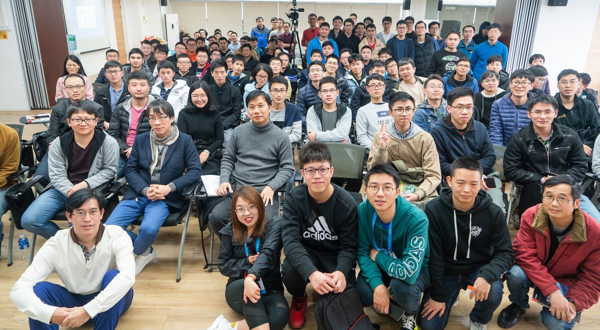
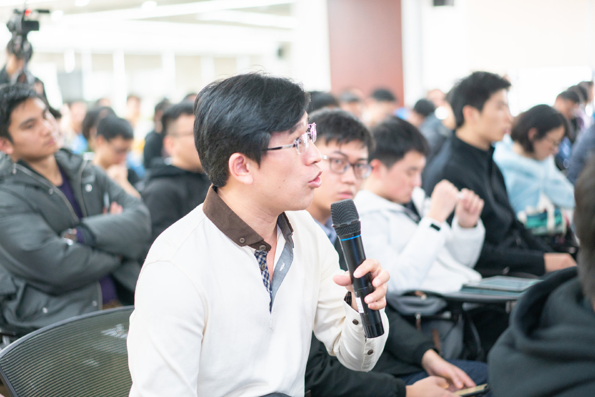

#### 唯品会 Service Mesh 的实践分享

郑德惠 唯品会Java资深开发工程师，内部Service Mesh框架负责人，唯品会开源项目vjtools重要开发者，10年电信与互联网后台开发经验。

#### SOFAMosn 持续演进路径及实践案例

陈逸凡 花名无钩，蚂蚁金服资深开发工程师。专注于网络接入层，高性能服务器研发，SOFAMosn团队核心成员

#### 在网格的边缘试探——企业 Istio 试水指南

崔秀龙 HPE 软件分析师，Kubernetes 权威指南作者之一，Kubernetes、Istio 项目成员

#### Roundtable：回顾2018，Service Mesh 蓄势待发

陈逸凡、崔秀龙、敖小剑、郑德惠共同参加的圆周讨论环节，共话 service mesh，解答观众现场提问。

## 视频回放与资料下载

地址：https://tech.antfin.com/activities/72/review

## 致谢

感谢以下单位的大力支持：

- 联合主办方[蚂蚁金服金融科技](https://tech.antfin.com/activities/2)
- [电子工业出版社](https://www.phei.com.cn/)赠书
- 阿里巴巴 UC 提供场地支持
- [云犀直播](http://www.yunxi.tv/)提供直播支持

