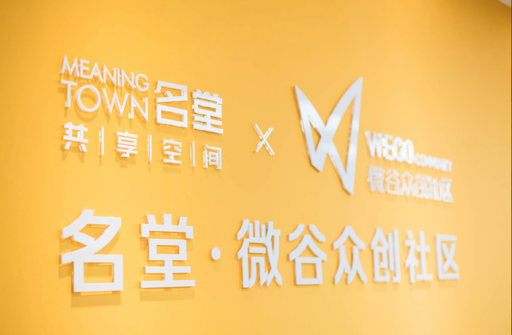
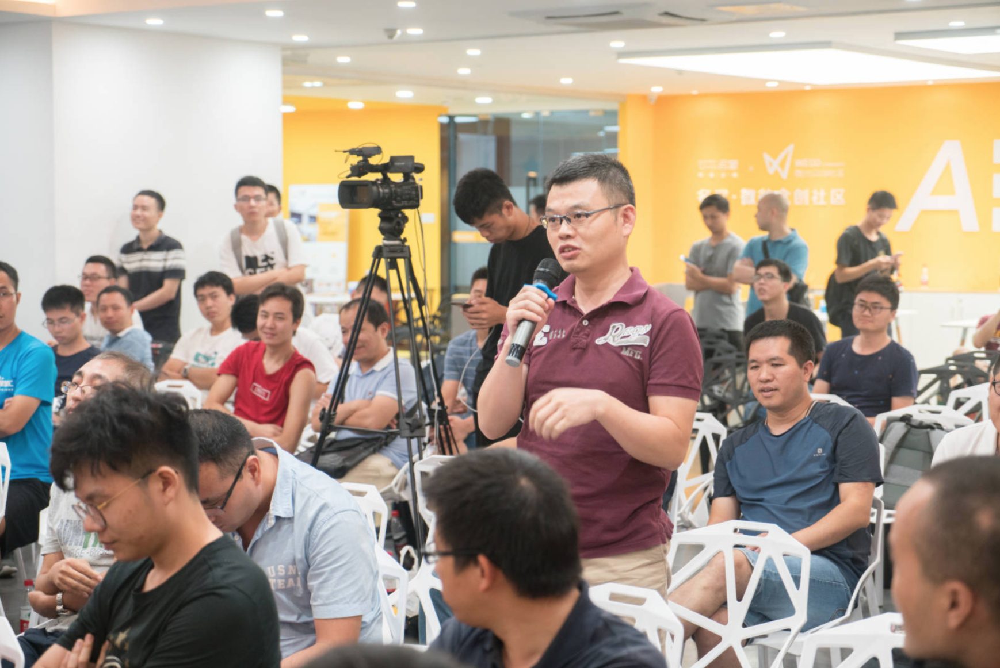

ServiceMesher 社区和蚂蚁金服联合主办、SOFAStack 社区协办的第三届 Service Mesh Meetup 深圳站收官，感谢各位现场参加和通过 IT 大咖说观看直播的同学参与 ServiceMesher 社区，华为张超盟、蚂蚁金服熊啸、JEX 杨文、联邦车网朱经惠的分享，深圳名堂共创空间提供场地支持，vivo 的两位美女志愿者，电子工业出版社提供图书。更多活动信息和 Service Mesh 资讯请关注我们的微信公众号 ServiceMesher。

## 相关资料	

本次活动的视频回放，请访问[IT 大咖说](http://www.itdks.com/eventlist/detail/2549)。

PPT 下载地址：https://github.com/servicemesher/meetup-slides

## 现场照片

场地提供方，名堂共享空间。

来自 Vivo 的两位美女志愿者

到现场参加的有 100 多人。

通过[IT 大咖说](http://www.itdks.com/eventlist/detail/2549)在线观看的有几千人。

### 张超盟（华为）——Kubernetes 容器应用基于 Istio 的灰度发布实践

现场提问的观众。

### 朱经惠（联邦车网）——Istio 控制平面组件原理解析

好多同学拿着小本本提问。

### 邵俊雄（蚂蚁金服）——SOFAMesh 的通用协议扩展

### 杨文（JEX）——Kubernetes、Service Mesh、CI/CD 实践

