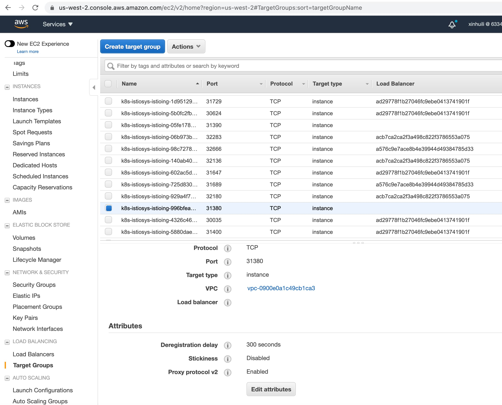

*注：原文发布于 2020 年 12 月，以下内容未在当下得到验证，可能已经过时。*

本文介绍了如何配置并在 AWS NLB 和 Istio Ingress 网关的堆栈中启用代理协议的最新经验。[代理协议](https://www.haproxy.com/blog/haproxy/proxy-protocol/) 旨在在不丢失客户端信息的情况下链接代理和反向代理。代理协议避免了对基础架构进行更改或 `NAT` 防火墙的需求，并提供了协议不可知性和良好可伸缩性的优势。此外，我们还在部署中启用了 `X-Forwarded-For` HTTP 标头，以便轻松读取客户端 IP 地址。在本文中，展示了 Istio Ingress 的流量管理，使用端口 80 和 443 上的 httpbin 服务来演示代理协议的使用。请注意，代理协议的 v1 和 v2 都适用于此示例，但由于 AWS NLB 目前仅支持 v2，因此默认情况下在本文的其余部分使用代理协议 v2。下图显示了在 AWS NLB 中使用代理协议 v2。



接收器可以配置为支持协议的版本 1 和版本 2。识别协议版本很容易：

- 如果传入的字节计数为 16 或更多，并且前 13 个字节与协议签名块 `\x0D\x0A\x0D\x0A\x00\x0D\x0A\x51\x55\x49\x54\x0A\x02` 匹配，则协议是版本 2。
- 否则，如果传入的字节计数为 8 或更多，并且前 5 个字符与“PROXY”的 `US-ASCII` 表示（`\x50\x52\x4F\x58\x59`）匹配，则必须解析协议作为版本 1。
- 否则，此协议不在此规范范围内，连接必须被关闭。

## 在 80 和 443 上进行分开的设置

在执行以下步骤之前，假定已经配置了适当的 VPC、IAM 和 Kubernetes 设置的 AWS 环境。

### 步骤 1：使用 AWS NLB 安装 Istio

博客[使用 AWS NLB 配置 Istio Ingress](https://istio.io/latest/blog/2018/aws-nlb/) 提供了设置 AWS IAM 角色和通过 Helm 启用 AWS NLB 使用的详细步骤。你还可以使用其他自动化工具，例如 Terraform，来实现相同的目标。在以下示例中，为了同时启用代理协议和 `X-Forwarded-For`，显示了更完整的配置。

```yaml
apiVersion: v1
kind: Service
metadata:
  annotations:
    service.beta.kubernetes.io/aws-load-balancer-proxy-protocol: "*"
    service.beta.kubernetes.io/aws-load-balancer-type: "nlb"
    proxy.istio.io/config: '{"gatewayTopology" : { "numTrustedProxies": 2 } }'
  labels:
    app: istio-ingressgateway
    istio: ingressgateway
    release: istio
  name: istio-ingressgateway
```

### 步骤 2：创建代理协议 Envoy 过滤器

```yaml
apiVersion: networking.istio.io/v1alpha3
kind: EnvoyFilter
metadata:
  name: proxy-protocol
  namespace: istio-system
spec:
  workloadSelector:
    labels:
      istio: ingressgateway
  configPatches:
  - applyTo: LISTENER
    patch:
      operation: MERGE
      value:
        listener_filters:
        - name: envoy.filters.listener.proxy_protocol
        - name: envoy.filters.listener.tls_inspector
```

### 步骤 3：启用 `X-Forwarded-For` 标头

此[博客](https://istio.io/latest/docs/ops/configuration/traffic-management/network-topologies/)包括配置 Gateway Network Topology 的几个示例。在以下示例中，根据需要调整配置，以在没有中间代理的情况下启用 `X-Forwarded-For`。

```yaml
apiVersion: networking.istio.io/v1alpha3
kind: EnvoyFilter
metadata:
  name: ingressgateway-settings
  namespace: istio-system
spec:
  configPatches:
  - applyTo: NETWORK_FILTER
    match:
      listener:
        filterChain:
          filter:
            name: envoy.http_connection_manager
    patch:
      operation: MERGE
      value:
        name: envoy.http_connection_manager
        typed_config:
          "@type": type.googleapis.com/envoy.config.filter.network.http_connection_manager.v2.HttpConnectionManager
          skip_xff_append: false
          use_remote_address: true
          xff_num_trusted_hops: 1
```

### 步骤 4：在端口 80 和 443 上部署 httpbin 的入口网关

在执行[安全入口设置](https://istio.io/latest/docs/tasks/traffic-management/ingress/secure-ingress/)时，macOS 用户必须添加额外的补丁来生成 TLS 证书。

```yaml
apiVersion: networking.istio.io/v1alpha3
kind: Gateway
metadata:
  name: httpbin-gateway
spec:
  selector:
    istio: ingressgateway # use Istio default gateway implementation
  servers:
  - port:
      number: 80
      name: http
      protocol: HTTP
    hosts:
    - "a25fa0b4835b.elb.us-west-2.amazonaws.com"
---
apiVersion: networking.istio.io/v1alpha3
kind: VirtualService
metadata:
  name: httpbin
spec:
  hosts:
  - "a25fa0b4835b.elb.us-west-2.amazonaws.com"
  gateways:
  - httpbin-gateway
  http:
  - match:
    - uri:
        prefix: /headers
    route:
    - destination:
        port:
          number: 8000
        host: httpbin
```

```yaml
apiVersion: networking.istio.io/v1alpha3
kind: Gateway
metadata:
  name: mygateway2
spec:
  selector:
    istio: ingressgateway # use istio default ingress gateway
  servers:
  - port:
      number: 443
      name: https
      protocol: HTTPS
    tls:
      mode: SIMPLE
      credentialName: httpbin-credential # must be the same as secret
    hosts:
    - "a25fa0b4835b.elb.us-west-2.amazonaws.com"
---
apiVersion: networking.istio.io/v1alpha3
kind: VirtualService
metadata:
  name: httpbin
spec:
  hosts:
  - "a25fa0b4835b.elb.us-west-2.amazonaws.com"
  gateways:
  - mygateway2
  http:
  - match:
    - uri:
        prefix: /headers
    route:
    - destination:
        port:
          number: 8000
        host: httpbin
```

### 步骤 5：检查 httpbin 的标头输出

检查端口 443（80 类似）并比较使用和不使用代理协议的情况。

```yaml
//////with proxy_protocal enabled in the stack
*   Trying YY.XXX.141.26...
* TCP_NODELAY set
* Connection failed
* connect to YY.XXX.141.26 port 443 failed: Operation timed out
*   Trying YY.XXX.205.117...
* TCP_NODELAY set
* Connected to a25fa0b4835b.elb.us-west-2.amazonaws.com (XX.YYY.205.117) port 443 (#0)
* ALPN, offering h2
* ALPN, offering http/1.1
* successfully set certificate verify locations:
*   CAfile: new_certificates/example.com.crt
  CApath: none
* TLSv1.2 (OUT), TLS handshake, Client hello (1):
* TLSv1.2 (IN), TLS handshake, Server hello (2):
* TLSv1.2 (IN), TLS handshake, Certificate (11):
* TLSv1.2 (IN), TLS handshake, Server key exchange (12):
* TLSv1.2 (IN), TLS handshake, Server finished (14):
* TLSv1.2 (OUT), TLS handshake, Client key exchange (16):
* TLSv1.2 (OUT), TLS change cipher, Change cipher spec (1):
* TLSv1.2 (OUT), TLS handshake, Finished (20):
* TLSv1.2 (IN), TLS change cipher, Change cipher spec (1):
* TLSv1.2 (IN), TLS handshake, Finished (20):
* SSL connection using TLSv1.2 / ECDHE-RSA-CHACHA20-POLY1305
* ALPN, server accepted to use h2
* Server certificate:
*  subject: CN=a25fa0b4835b.elb.us-west-2.amazonaws.com; O=httpbin organization
*  start date: Oct 29 20:39:12 2020 GMT
*  expire date: Oct 29 20:39:12 2021 GMT
*  common name: a25fa0b4835b.elb.us-west-2.amazonaws.com (matched)
*  issuer: O=example Inc.; CN=example.com
*  SSL certificate verify ok.
* Using HTTP2, server supports multi-use
* Connection state changed (HTTP/2 confirmed)
* Copying HTTP/2 data in stream buffer to connection buffer after upgrade: len=0
* Using Stream ID: 1 (easy handle 0x7fc6c8810800)
> GET /headers?show_env=1 HTTP/2
> Host: a25fa0b4835b.elb.us-west-2.amazonaws.com
> User-Agent: curl/7.64.1
> Accept: */*
>
* Connection state changed (MAX_CONCURRENT_STREAMS == 2147483647)!
< HTTP/2 200
< server: istio-envoy
< date: Thu, 29 Oct 2020 21:39:46 GMT
< content-type: application/json
< content-length: 629
< access-control-allow-origin: *
< access-control-allow-credentials: true
< x-envoy-upstream-service-time: 2
<
{
  "headers": {
    "Accept": "*/*",
    "Content-Length": "0",
    "Host": "a25fa0b4835b.elb.us-west-2.amazonaws.com",
    "User-Agent": "curl/7.64.1",
    "X-B3-Sampled": "0",
    "X-B3-Spanid": "74f99a1c6fc29975",
    "X-B3-Traceid": "85db86fe6aa322a074f99a1c6fc29975",
    "X-Envoy-Attempt-Count": "1",
    "X-Envoy-Decorator-Operation": "httpbin.default.svc.cluster.local:8000/headers*",
    "X-Envoy-External-Address": "XX.110.54.41",
    "X-Forwarded-For": "XX.110.54.41",
    "X-Forwarded-Proto": "https",
    "X-Request-Id": "5c3bc236-0c49-4401-b2fd-2dbfbce506fc"
  }
}
* Connection #0 to host a25fa0b4835b.elb.us-west-2.amazonaws.com left intact
* Closing connection 0
```

```yaml
//////////without proxy_protocal
*   Trying YY.XXX.141.26...
* TCP_NODELAY set
* Connection failed
* connect to YY.XXX.141.26 port 443 failed: Operation timed out
*   Trying YY.XXX.205.117...
* TCP_NODELAY set
* Connected to a25fa0b4835b.elb.us-west-2.amazonaws.com (YY.XXX.205.117) port 443 (#0)
* ALPN, offering h2
* ALPN, offering http/1.1
* successfully set certificate verify locations:
*   CAfile: new_certificates/example.com.crt
  CApath: none
* TLSv1.2 (OUT), TLS handshake, Client hello (1):
* TLSv1.2 (IN), TLS handshake, Server hello (2):
* TLSv1.2 (IN), TLS handshake, Certificate (11):
* TLSv1.2 (IN), TLS handshake, Server key exchange (12):
* TLSv1.2 (IN), TLS handshake, Server finished (14):
* TLSv1.2 (OUT), TLS handshake, Client key exchange (16):
* TLSv1.2 (OUT), TLS change cipher, Change cipher spec (1):
* TLSv1.2 (OUT), TLS handshake, Finished (20):
* TLSv1.2 (IN), TLS change cipher, Change cipher spec (1):
* TLSv1.2 (IN), TLS handshake, Finished (20):
* SSL connection using TLSv1.2 / ECDHE-RSA-CHACHA20-POLY1305
* ALPN, server accepted to use h2
* Server certificate:
*  subject: CN=a25fa0b4835b.elb.us-west-2.amazonaws.com; O=httpbin organization
*  start date: Oct 29 20:39:12 2020 GMT
*  expire date: Oct 29 20:39:12 2021 GMT
*  common name: a25fa0b4835b.elb.us-west-2.amazonaws.com (matched)
*  issuer: O=example Inc.; CN=example.com
*  SSL certificate verify ok.
* Using HTTP2, server supports multi-use
* Connection state changed (HTTP/2 confirmed)
* Copying HTTP/2 data in stream buffer to connection buffer after upgrade: len=0
* Using Stream ID: 1 (easy handle 0x7fbf8c808200)
> GET /headers?show_env=1 HTTP/2
> Host: a25fa0b4835b.elb.us-west-2.amazonaws.com
> User-Agent: curl/7.64.1
> Accept: */*
>
* Connection state changed (MAX_CONCURRENT_STREAMS == 2147483647)!
< HTTP/2 200
< server: istio-envoy
< date: Thu, 29 Oct 2020 20:44:01 GMT
< content-type: application/json
< content-length: 612
< access-control-allow-origin: *
< access-control-allow-credentials: true
< x-envoy-upstream-service-time: 1
<
{
  "headers": {
    "Accept": "*/*",
    "Content-Length": "0",
    "Host": "a25fa0b4835b.elb.us-west-2.amazonaws.com",
    "User-Agent": "curl/7.64.1",
    "X-B3-Sampled": "0",
    "X-B3-Spanid": "69913a6e6e949334",
    "X-B3-Traceid": "729d5da3618545da69913a6e6e949334",
    "X-Envoy-Attempt-Count": "1",
    "X-Envoy-Decorator-Operation": "httpbin.default.svc.cluster.local:8000/headers*",
    "X-Envoy-Internal": "true",
    "X-Forwarded-For": "172.16.5.30",
    "X-Forwarded-Proto": "https",
    "X-Request-Id": "299c7f8a-5f89-480a-82c9-028c76d45d84"
  }
}
* Connection #0 to host a25fa0b4835b.elb.us-west-2.amazonaws.com left intact
* Closing connection 0
```

## 结论

本文介绍了部署一个由启用代理协议的 AWS NLB 和 Istio Ingress 网关组成的堆栈。如果你对协议启用以一种轶事、经验和更不正式的方式感兴趣，希望这对你有所帮助。但请注意，`X-Forwarded-For` 标头应仅用于测试时方便阅读，因为处理虚假的 `X-Forwarded-For` 攻击不在本文的范围内。

## 参考资料

- [协议设置](https://docs.nginx.com/nginx/admin-guide/load-balancer/using-proxy-protocol/)
- [协议介绍](https://www.haproxy.com/blog/haproxy/proxy-protocol/)