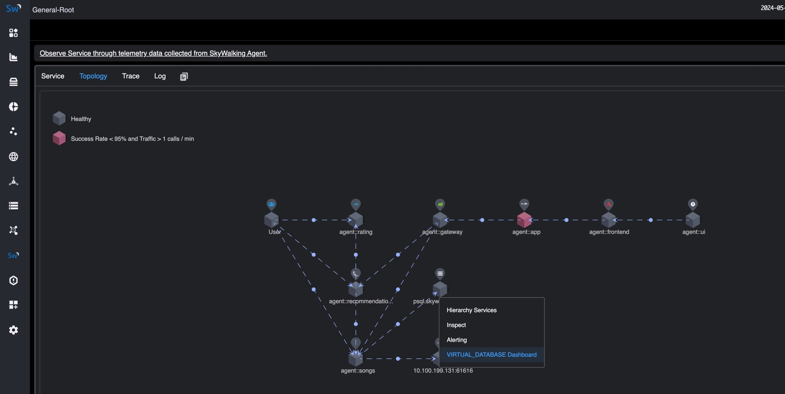
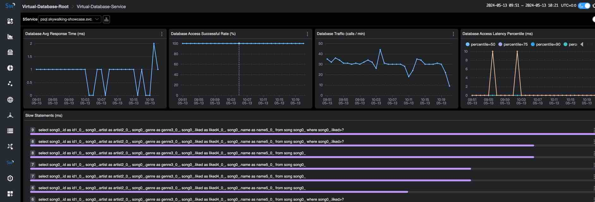
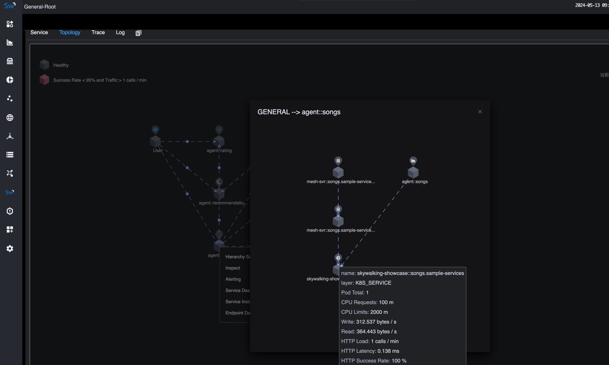
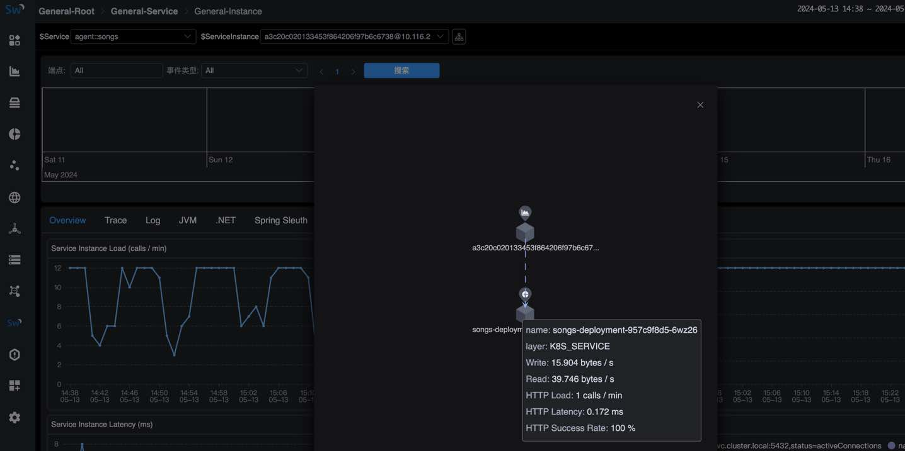
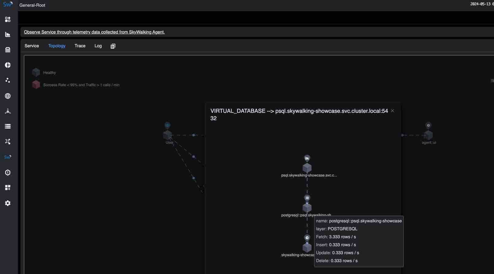
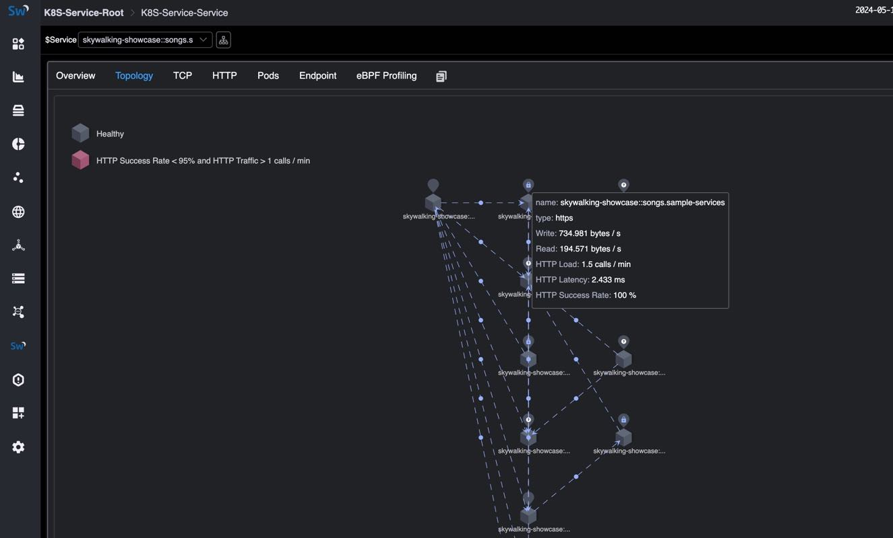
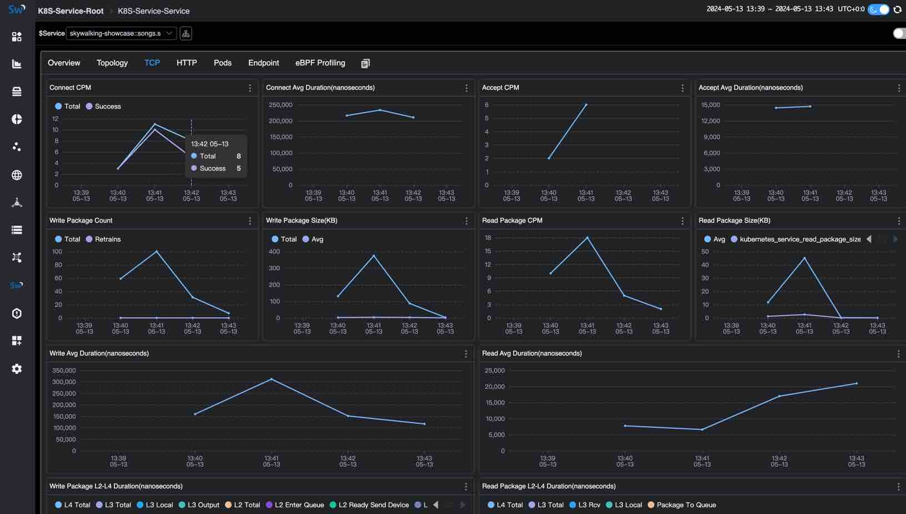
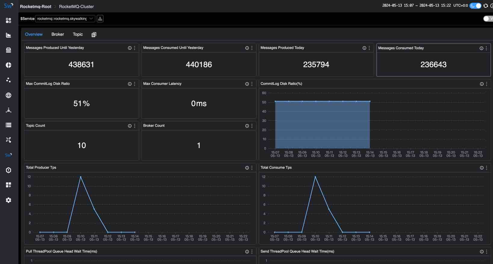
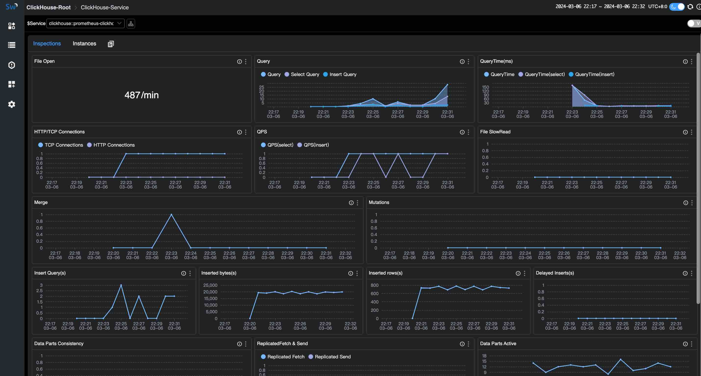
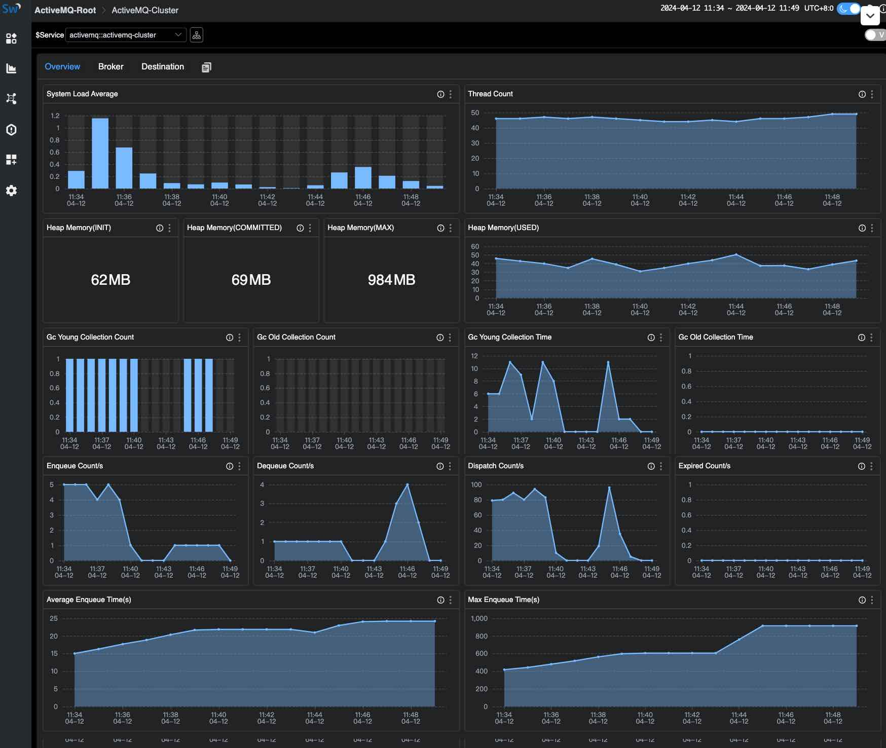

Apache SkyWalking 团队今天宣布发布 SkyWalking 10。SkyWalking 10 提供了一系列突破性的功能和增强功能。Layer 和 Service Hierarchy 的引入通过将服务和指标组织成不同的层次，并提供跨层无缝导航，从而简化了监控。利用 eBPF 技术，Kubernetes 网络监控提供了对网络流量、拓扑和 TCP/HTTP 指标的详细洞察。BanyanDB 作为高性能的原生存储解决方案出现，同时扩展的监控支持包括 Apache RocketMQ、ClickHouse 和 Apache ActiveMQ Classic。对多标签名称的支持增强了指标分析的灵活性，而增强的导出和查询功能简化了数据分发和处理。

本文简要介绍了这些新功能和增强功能以及其他一些值得注意的变化。

## Layer 和 Service Hierarchy

Layer 概念是在 SkyWalking 9.0.0 中引入的，它代表计算机科学中的一个抽象框架，例如操作系统（OS_LINUX layer）、Kubernetes（k8s layer）。它根据系统中服务和指标的角色和职责将其组织到不同的层次。SkyWalking 为每个层提供了一套监控和诊断工具，但层之间存在 gap，无法轻松跨层桥接数据。

在 SkyWalking 10 中，SkyWalking 提供了跨层跳转/连接的新功能，为用户提供无缝的监控体验。

### Layer Jump

在拓扑图中，用户可以点击服务节点跳转到另一层服务的仪表板。下图显示了通过点击拓扑节点从 GENERAL 层服务拓扑跳转到 VIRTUAL_DATABASE 服务层仪表板的过程。 





### Service Hierarchy

SkyWalking 10 引入了一个新概念，称为 Service Hierarchy，它定义了各层中现有逻辑相同服务的关系。OAP 将检测不同层次的服务，并尝试建立连接。用户可以点击任何层的服务拓扑节点或服务仪表板中的 Hierarchy Services 获取 Hierarchy Topology。在此拓扑图中，用户可以看到不同层次服务之间的关系和指标摘要，并且可以跳转到该层的服务仪表板。当服务发生性能问题时，用户可以轻松分析不同层次的指标并找出根本原因：

以下是 Service Hierarchy 关系的示例：

1. 应用程序 `song` 同时在 Kubernetes 集群中部署了 SkyWalking agent 和 Service Mesh。因此，应用程序 `song` 跨越了 GENERAL、MESH、MESH_DP 和 K8S_SERVICE 层，SkyWalking 可以监控这些层次，Service Hierarchy 拓扑如下： 

 

   还可以有 Service Instance Hierarchy 拓扑来获取跨层的单实例状态，如下所示：     

2. 在 Kubernetes 集群中部署并由应用程序 `song` 使用的 PostgreSQL 数据库 `psql`。因此，数据库 `psql` 跨越 `VIRTUAL_DATABASE`、`POSTGRESQL` 和 `K8S_SERVICE` 层，SkyWalking 可以监控这些层次，Service Hierarchy 拓扑如下： 

 

有关更多支持的层次以及如何检测不同层次服务之间的关系，请参阅 [Service Hierarchy](https://skywalking.apache.org/docs/main/latest/en/concepts-and-designs/service-hierarchy/#service-hierarchy)。有关如何在 SkyWalking 中配置 Service Hierarchy，请参阅 [Service Hierarchy Configuration](https://skywalking.apache.org/docs/main/latest/en/concepts-and-designs/service-hierarchy-configuration/) 部分。

## 使用 eBPF 监控 Kubernetes 网络流量

在之前的版本中，SkyWalking 提供了 [来自 kube-state-metrics 和 cAdvisor 的 Kubernetes (K8s) 监控](https://skywalking.apache.org/docs/main/latest/en/setup/backend/backend-k8s-monitoring-metrics-cadvisor/)，它可以监控 Kubernetes 集群状态和 Kubernetes 资源的指标。

在 SkyWalking 10 中，通过利用 [Apache SkyWalking Rover](https://skywalking.apache.org/docs/skywalking-rover/latest/readme/) 0.6+，SkyWalking 具有使用 eBPF 监控 Kubernetes 网络流量的能力，可以收集和映射 Kubernetes 环境中应用程序的访问日志。通过这些数据，SkyWalking 可以从 Kubernetes 角度分析和提供服务流量、拓扑、TCP/HTTP 级别指标。

下图显示了 Kubernetes 网络流量的拓扑和 TCP 仪表板：

 

 

有关如何使用 eBPF 监控 Kubernetes 网络流量的更多详细信息，请参阅 [使用 eBPF 监控 Kubernetes 网络流量](https://skywalking.apache.org/blog/2024-03-18-monitor-kubernetes-network-by-ebpf/)。

## BanyanDB - 原生 APM 数据库

[BanyanDB](https://skywalking.apache.org/docs/skywalking-banyandb/latest/readme/) 0.6.0 和 [BanyanDB Java 客户端](https://github.com/apache/skywalking-banyandb-java-client) 0.6.0 随 SkyWalking 10 一起发布。作为 SkyWalking 的原生存储解决方案，BanyanDB 将成为 SkyWalking 的下一代存储解决方案。推荐在 0.6 到 1.0 期间用于中等规模的部署。
它展示了高性能改进的潜力。与 Elasticsearch 在同一规模下相比，CPU 使用率降低 50%，内存使用率降低 50%，磁盘使用量减少 40%。

## Apache RocketMQ 服务器监控

Apache RocketMQ 是一个开源的分布式消息和流平台，广泛应用于互联网、大数据、移动互联网、物联网等领域。SkyWalking 为 RocketMQ 提供了一个基本的监控仪表板，包括以下指标：

- Cluster Metrics：包括当天产生/消费的消息数、总生产者/消费者 TPS、生产者/消费者消息大小、截至昨天产生/消费的消息数、最大消费者延迟、最大 commitLog 磁盘比、commitLog 磁盘比、拉取/发送线程池队列头等待时间、topic count 和 broker count。
- Broker Metrics：包括生产/消费 TPS、生产者/消费者消息大小。
- Topic Metrics：包括最大生产者/消费者消息大小、消费者延迟、生产/消费 TPS、生产/消费偏移、生产/消费消息大小、消费者组数和代理数。

下图显示了 RocketMQ Cluster Metrics 仪表板： 

 

有关 RocketMQ 监控的更多指标和详细信息，请参阅 [Apache RocketMQ 服务器监控](https://skywalking.apache.org/docs/main/latest/en/setup/backend/backend-rocketmq-monitoring/)。

## ClickHouse Server 监控

ClickHouse 是一个开源的列式数据库管理系统，可以实时生成分析数据报告，广泛用于在线分析处理 (OLAP)。ClickHouse 监控提供了 ClickHouse 服务器的指标、事件和异步指标的监控，包括以下部分的指标：

- Server Metrics
- Query Metrics
- Network Metrics
- Insert Metrics
- Replica Metrics
- MergeTree Metrics
- ZooKeeper Metrics
- Embedded ClickHouse Keeper Metrics

下图显示了 ClickHouse Cluster Metrics 仪表板：

 

有关 ClickHouse 监控的更多指标和详细信息，请参阅 [ClickHouse 服务器监控](https://skywalking.apache.org/docs/main/latest/en/setup/backend/backend-clickhouse-monitoring/)，以及一篇可以帮助快速入门的博客 [通过 SkyWalking 监控 ClickHouse](https://skywalking.apache.org/blog/2024-03-12-monitoring-clickhouse-through-skywalking/)。

## Apache ActiveMQ 服务器监控

Apache ActiveMQ Classic 是一个流行且强大的开源消息和集成模式服务器。SkyWalking 为 ActiveMQ 提供了一个基本的监控仪表板，包括以下指标：

- Cluster Metrics：包括内存使用率、写入/读取速率和平均/最大写入持续时间。
- Broker Metrics：包括节点状态、连接数、生产者/消费者数和代理下的写入/读取速率。根据集群模式，一个集群可以包含一个或多个代理。
- Destination Metrics：包括生产者/消费者数、不同状态的消息、队列和队列/主题中的入队持续时间。

下图显示了 ActiveMQ Cluster Metrics 仪表板： 

 

有关 ActiveMQ 监控的更多指标和详细信息，请参阅 [Apache ActiveMQ 服务器监控](https://skywalking.apache.org/docs/main/latest/en/setup/backend/backend-activemq-monitoring/)，以及一篇可以帮助快速入门的博客 [通过 SkyWalking 监控 ActiveMQ](https://skywalking.apache.org/blog/2024-04-19-monitoring-activemq-through-skywalking/)。

## 支持多标签名称

在 SkyWalking 10 之前，SkyWalking 不会在指标数据中存储标签名称，这使得 MQE 必须使用 `_` 作为通用标签名称，无法使用多个标签名称查询指标数据。

SkyWalking 10 支持在指标数据中存储标签名称，MQE 可以使用多个标签名称查询或计算指标数据。例如：`k8s_cluster_deployment_status` 指标具有 `namespace`、`deployment` 和 `status` 标签。如果我们想查询所有 `namespace=skywalking-showcase` 和 `status=true` 的部署指标值，可以使用以下表达式：

```text
k8s_cluster_deployment_status{namespace='skywalking-showcase', status='true'}
```

相关增强：

- 由于在 SkyWalking 9.6.0 中告警规则配置已迁移到 MQE，因此告警规则也支持多标签名称。
- PromeQL 服务支持多标签名称查询。

## Metrics gRPC 导出器

SkyWalking 10 增强了 [metrics gPRC exporter](https://skywalking.apache.org/docs/main/latest/en/setup/backend/exporter/#grpc-exporter)，支持将所有类型的指标数据导出到 gRPC 服务器。

## SkyWalking 原生 UI 指标查询切换到 V3 API

SkyWalking 原生 UI 指标查询弃用 V2 API，全部迁移到 [V3 API](https://skywalking.apache.org/docs/main/latest/en/api/query-protocol/#v3-apis) 和 [MQE](https://skywalking.apache.org/docs/main/next/en/api/metrics-query-expression/#metrics-query-expressionmqe-syntax)。

## 其他值得注意的增强功能

1. 支持 Java 21 运行时和 oap-java21 镜像用于 Java 21 运行时。
2. 从镜像中删除 CLI（`swctl`）。
3. 支持更多的 MQE 函数和操作。
4. 增强原生 UI 并改善用户体验。
5. 修复了一些 Bug 和 CVE。