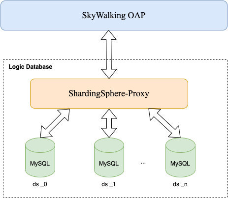
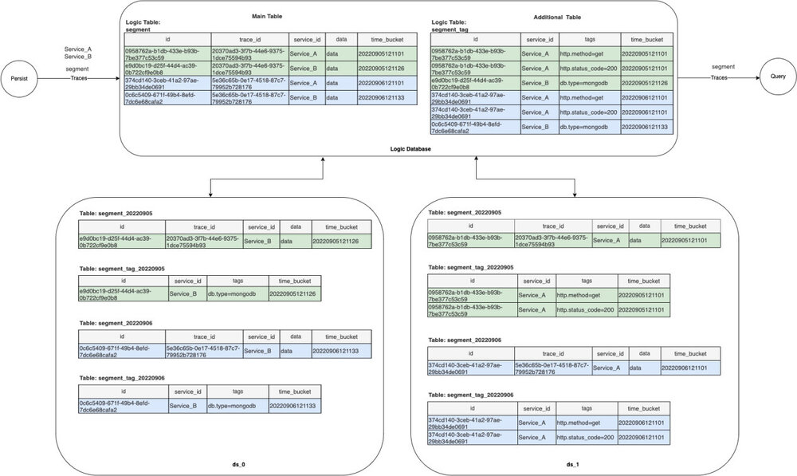
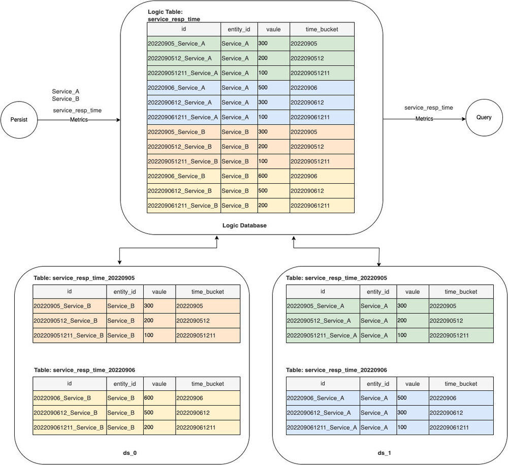
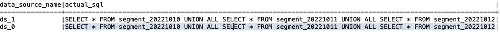

Apache SkyWalking 作为一个分布式系统的应用性能监控工具，它观察服务网格中的指标、日志、痕迹和事件。其中 SkyWalking OAP 高性能的数据流处理架构能够实时处理庞大的数据流量，但是这些海量数据的存储更新和后续查询对后端存储系统带来了挑战。

SkyWalking 默认已经提供了多种存储支持包括 H2、OpenSearch、ElasticSearch、MySQL、TiDB、PostgreSQL、BanyanDB。其中 MySQL 存储提供的是针对单机和单表的存储方式（MySQL 的集群能力需要自己选型提供），在面对高流量的业务系统时，监控数据的存储存在较大压力，同时影响查询性能。

在 MySQL 存储基础上 SkyWalking v9.3.0 提供了一种新的存储方式 MySQL-Sharding，它提供了基于 [ShardingSphere-Proxy](https://shardingsphere.apache.org/document/5.1.2/cn/quick-start/shardingsphere-proxy-quick-start/) 的分库分表特性，而分库分表是关系型数据库面对大数据量处理的成熟解决方案。

## 部署架构

SkyWalking 使用 ShardingSphere-Proxy 的部署方式如下图所示。



- SkyWalking OAP 由直连数据库的方式变成只与 [ShardingSphere-Proxy](https://shardingsphere.apache.org/document/current/en/overview/#shardingsphere-proxy) 进行交互；
- 每一个 MySQL 节点暴露的连接都是一个数据源，由 [ShardingSphere-Proxy](https://shardingsphere.apache.org/document/current/en/overview/#shardingsphere-proxy) 进行统一管理；
- [ShardingSphere-Proxy](https://shardingsphere.apache.org/document/current/en/overview/#shardingsphere-proxy) 会根据配置建立一个虚拟逻辑数据库，根据 OAP 提供的分库分表规则进行库表分片和路由；
- SkyWalking OAP 负责生成分库分表规则并且像操作 MySQL 一样对虚拟逻辑库执行 DDL 和 DML；

## 适用场景

希望使用 MySQL 作为存储，随着业务规模的增长，单表模式已经无法满足性能需要。

## SkyWalking 分库分表逻辑

分库分表逻辑通过注解 `@SQLDatabase.Sharding` 对 SkyWalking 中的数据模型 Model 进行定义：

```java
@interface Sharding {
  ShardingAlgorithm shardingAlgorithm();
  String dataSourceShardingColumn() default "";
  String tableShardingColumn() default "";
}
```

其中：

- `shardingAlgorithm`：表分片算法

- `dataSourceShardingColumn`：分库键

- `tableShardingColumn`：分表键

SkyWalking 根据注解 `@SQLDatabase.Sharding` 选择分库键、分表键以及表分片算法对每个表动态生成分片规则通过 DistSQL 操作 [Shardingsphere-Proxy](https://shardingsphere.apache.org/document/current/en/overview/#shardingsphere-proxy) 执行规则定义 [Shardingsphere-Proxy](https://shardingsphere.apache.org/document/current/en/overview/#shardingsphere-proxy) 根据规则定义进行数据分片。

### 分库方式

SkyWalking 对于分库采用统一的方式，路由目标库的数字后缀使用分库键的哈希值取模需要分库的数据库数量，所以路由目标库为：

```
ds_{dataSourceShardingColumn.hashcode() % dataSourceList.size()}
```

例如我们有 `dataSourceList = ds_0...ds_n`，如果

`{dataSourceShardingColumn.hashcode() % dataSourceList.size() = 2}` 那么所有数据将会路由到 `ds_2` 这个数据源节点上。

### 分表方式

由于 TTL 机制的存在，分表算法主要根据时间的日期进行分片，分片表的数量是根据 TTL 每天一个表：

分片表名 = 逻辑表名_时间序列（日期）：`{tableName =logicTableName_timeSeries}`

为保证在 TTL 有效期内的数据能够被写入和查询，时间序列将生成当前日期

```
{timeSeries = currentDate - TTL +1...currentDate + 1}
```

例如：如果 `TTL=3, currentDate = 20220907`，则分片表为：

```
logicTableName_20220905
logicTableName_20220906
logicTableName_20220907
logicTableName_20220908
```

SkyWalking 提供了多种不同的分表算法用于不同的数据模型：

| 算法名称                              | 分片说明                              | 分片键时间精度要求                                     | 典型应用数据模型                                             |
| :------------------------------------ | :------------------------------------ | :----------------------------------------------------- | :----------------------------------------------------------- |
| `NO_SHARDING`                         | 不做任何表分片，保持单表模式          | /                                                      | 数据量小无需分片的数据模型                                   |
| `TIME_RELATIVE_ID_SHARDING_ALGORITHM` | 使用 ID 列中的 `time_bucket` 按天分片 | `time_bucket` 的精度可以是同一表中的秒、分、小时和天   | 各类 Metrics 指标                                            |
| `TIME_SEC_RANGE_SHARDING_ALGORITHM`   | 使用 `time_bucket` 列按天分片         | `time_bucket` 的精度必须是秒                           | `SegmentRecordLogRecord` 等                                  |
| `TIME_MIN_RANGE_SHARDING_ALGORITHM`   | 使用 `time_bucket` 列按天分片         | `time_bucket` 的精度必须是分钟                         | EndpointTraffic                                              |
| `TIME_BUCKET_SHARDING_ALGORITHM`      | 使用 `time_bucket` 列按天分片         | `time_bucket` 的精度可以是同一个表中的秒、分、小时和天 | Service、Instance、Endpoint 调用关系等如 `ServiceRelationServerSideMetrics` |

## TTL 机制

- 对于进行分片的表根据 TTL 直接删除 `deadline` >= `timeSeries` 的物理表 `{deadline = new DateTime().plusDays(-ttl)}`
- TTL 定时器在根据当前日期删除过期表的同时也会根据新日期更新分片规则，通知 ShardingSphere-Proxy 创建新的分片表
- 对于单表的延续之前的方式，删除 deadline >= `time_bucket` 的行记录

## 分片数据存储示例

下面以 segment（Record 类型）和 `service_resp_time`（Metrics 类型）两个为例说明数据存储的逻辑和物理分布。这里假设 MySQL 为 `ds_0` 和 `ds_1` 两个节点。

注意：以下的存储表结构仅为简化后的存储示例，不表示 SkyWalking 真实的表结构。

### segment

分片配置为：

```
@SQLDatabase.Sharding(shardingAlgorithm = ShardingAlgorithm.TIME_SEC_RANGE_SHARDING_ALGORITHM, dataSourceShardingColumn = service_id, tableShardingColumn = time_bucket)
```

逻辑库表结构和实际库表如下图：



### service_resp_time

分片配置为：

```
@SQLDatabase.Sharding(shardingAlgorithm = ShardingAlgorithm.TIME_RELATIVE_ID_SHARDING_ALGORITHM, tableShardingColumn = id, dataSourceShardingColumn = entity_id)
```

逻辑库表结构和实际库表如下图：



## 如何使用

你可以选择手动或使用 Docker 来运行 Demo。

### 手动部署

这里以单节点 SkyWalking OAP 和 [Shardingsphere-Proxy 5.1.2](https://shardingsphere.apache.org/document/current/en/overview/#shardingsphere-proxy) 部署为例，集群部署请参考其他相关文档。

- 准备好 MySQL 集群

- 部署安装并配置 [Shardingsphere-Proxy](https://shardingsphere.apache.org/document/current/en/overview/#shardingsphere-proxy)：

  - `conf/server.yaml`，`props.proxy-hint-enabled` 必须为 `true`，完整配置可参考[这里](https://github.com/wankai123/skywalking-mysql-sharding-demo/blob/main/shardingsphere-proxy/conf/server.yaml)。
  - `conf/config-sharding.yaml`，配置逻辑数据库和 `dataSources` 列表，`dataSource` 的名称必须以 `ds_`为前缀，并且从 `ds_0` 开始，完整配置可参考[这里](https://github.com/wankai123/skywalking-mysql-sharding-demo/blob/main/shardingsphere-proxy/conf/config-sharding.yaml)。

- 部署安装并配置 SkyWalking OAP：

  - 设置 OAP 环境变量 `${SW_STORAGE:mysql-sharding}`
  - 根据实际部署情况配置连接信息： `${SW_JDBC_URL}` `${SW_DATA_SOURCE_USER}` `${SW_DATA_SOURCE_PASSWORD}`

  注意：连接信息需对应 [Shardingsphere-Proxy](https://shardingsphere.apache.org/document/current/en/overview/#shardingsphere-proxy) 虚拟数据库。

- 将 [Shardingsphere-Proxy](https://shardingsphere.apache.org/document/current/en/overview/#shardingsphere-proxy) 中 `conf/config-sharding.yaml` 配置的数据源名称配置在 `${SW_JDBC_SHARDING_DATA_SOURCES}` 中，用 `,` 分割

- 启动 MySQL 集群

- 启动 [Shardingsphere-Proxy](https://shardingsphere.apache.org/document/current/en/overview/#shardingsphere-proxy)

- 启动 SkyWalking OAP

### 使用 Docker 运行 Demo

GitHub 资源库提供了一个基于 Docker 完整可运行的 demo：[skywalking-mysql-sharding-demo](https://github.com/wankai123/skywalking-mysql-sharding-demo)，可以快速尝试实际运行效果。

其中部署包含：

- oap 服务 1 个，Metrics 和 Record 数据的 TTL 均设为 2 天
- sharding-proxy 服务 1 个版本为 5.1.2，对外端口为 13307，创建的逻辑库名称为 swtest
- mysql 服务 2 个，对外端口分别为 3306，3307，在 sharding-proxy 的 `conf/config-sharding.yaml` 中配置为 `ds_0` 和 `ds_1`
- provider 服务 1 个（模拟业务程序用于验证 trace 和 metrics 等数据），对外端口为 9090
- consumer 服务 1 个（模拟业务程序用于验证 trace 和 metrics 等数据），对外端口为 9092

将 Demo 程序获取到本地后，在 skywalking-mysql-sharding-demo 目录下直接运行：

```bash
docker-compose up -d
```

注意：初次启动由于拉取镜像和新建所有表可能需要一定的时间。

所有服务启动完成之后可以通过数据库工具查看 `sharding-proxy` 逻辑表创建情况，以及两个 MySQL 库中实际的物理分片表创建情况。也可以连接 `sharding-proxy` 逻辑库 `swtest` 查看数据查询路由情况，如：

```sql
PREVIEW
SELECT * FROM SEGMENT
```

显示结果如下：



Demo 提供的模拟业务程序可以通过请求 consumer 服务模拟业务请求，用于验证各类型数据分布：

```bash
curl http://127.0.0.1:9092/info
```

## 总结

在这篇文章中我们详细介绍了 SkyWalking  基于 ShardingSphere-Proxy 的 MySQL-Sharding 存储特性的部署架构、适应场景、核心分库分表逻辑以及 TTL 机制，并提供了运行后的数据存储示例和详细部署配置步骤以便大家快速理解上手。SkyWalking 提供了多种存储方式以供选择，如果你目前的需求如本文所述，欢迎使用该新特性。
