MOSN GitHub地址：https://github.com/sofastack/mosn

本文作者：朵晓东，花名奕杉，蚂蚁金服高级技术专家，专注云计算技术及产品。Apache Kylin 创始团队核心成员，蚂蚁金融云 PaaS 创始团队核心成员，Antstack 网络产品负责人，SOFAMesh 创始团队核心成员。

本文是基于作者在第二届 Service Mesh Meetup 的主题分享《蚂蚁金服 Service Mesh 数据平面 SOFAMosn 深层解密》部分内容所整理，以下是具体内容。关于本次meetup的情况请访问[第二届Service Mesh Meetup北京站回顾](/blog/beijing-meetup-20180729/)。

### 前言

今天给大家带来的分享内容是蚂蚁金服 Service Mesh 数据平面 SOFAMosn 深层揭秘。

承接小剑老师月初《大规模微服务架构下的 ServiceMesh 探索之路》对 SOFAMosn 的分享，本次聚焦在数据平面在蚂蚁落地的思考和探索。

### 背景

上一次分享小剑老师已经介绍了 SOFAMesh 的技术选型，以及我们在开源和自研方面的一些权衡。

> 呼应这个话题我们首先来看一下为什么蚂蚁会选择 Service Mesh

#### 重点归纳为 4 个方面：

蚂蚁正在全面拥抱微服务，云原生，不管是 SOFA5，还是兼容 K8S 的容器平台 Sigma 落地，Service Mesh 都是不可获取的重要组件。 

其次，蚂蚁的运维体系在服务层面基于流量调度工作，比如说 LDC 架构在逻辑 zone 间的调度流量，再比如弹性伸缩，本质上也是在异构机房间调度流量，此外还有像逻辑 zone 蓝绿发布，机房容灾等都需要在流量调度能力上更健壮，更灵活，更具扩展性。

此外，由于蚂蚁的金融属性，我们在服务鉴权等方面有更严格的要求，比如说国密的落地，加密卡内的证书管理，加解密等方面，不止要求更高的安全级别，还要有承载大流量的能力。同时我们看到，zero trust网络架构也在加速发展，这与我们的诉求不谋而合。

最后，蚂蚁内部技术栈多样，但多种语言体系融合仍然成本很高。举个例子，非 SOFA 语言与 SOFA 互通要理解配置中心，SOFARPC 的序列化等逻辑，如果在生产环境部署还要理解 LDC 路由规则，而这些共性需求都可以通过下沉到 Mesh 体系来解决。

了解 SOFAMesh 的同学应该知道，蚂蚁选择了使用 Golang 自研数据平面，做这个决定我们重点考虑了未来的技术选型，跨团队研发效率，蚂蚁现有技术体系，运维体系等因素；同时通过调研和验证，Golang 版本的性能也是我们可以接受的。

> 接下来，我会向大家介绍由蚂蚁和 UC 联合研发的 Mesh 数据平面，我们为它取名 **SOFAMosn** 。

### 架构设计

首先我们由浅入深看一下 **SOFAMosn** 的架构设计

#### 1. SOFAMesh 的整体架构

大家看到的图示是基于 Istio 的架构，在数据平面我们使用 SOFAMosn 替代了 Envoy，同时加入了一些蚂蚁实践中摸索的改进，比如说 Mixer 的位置，我们考虑把 Mixer下沉到 SOFAMosn ，比如说对 SOFA，DUBBO 协议的支持等。

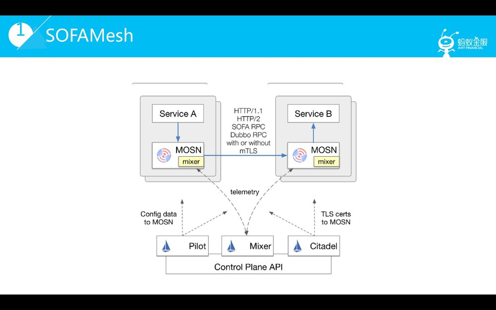

 0.1.0 版本的 SOFAMosn 支持了 xDS V0.4 api 核心能力，重点支持了 SOFARPC 协议，并在蚂蚁内部在生产环境使用；同时支持了HTTP/1.1，HTTP/2.0的基本功能，但目前暂未在生产环境使用。

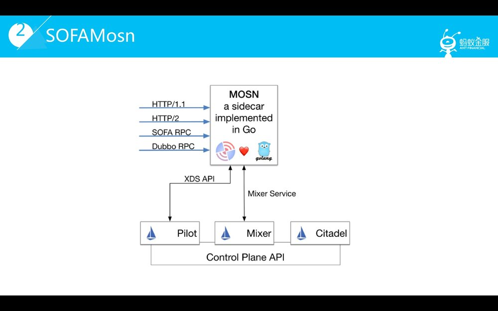 

#### 2. SOFAMosn 的核心设计思路

首先，将 SOFAMosn 作为代理处理的数据流划分为4层，在入方向数据依次经过网络 IO 层，二进制协议处理层，协议流程处理层，转发路由处理层；出向与入向过程基本相反。

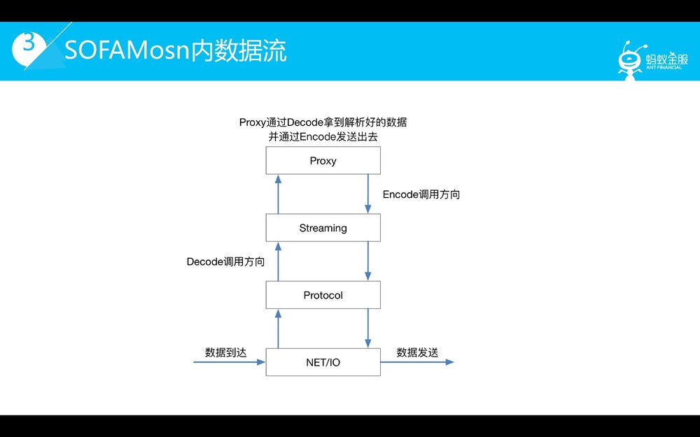

了解了分层的基本思路，具体介绍一下各层的具体职能：

- **IO 层**提供了 IO 读写的封装以及可扩展的 IO 事件订阅机制
- **PROTOCOL 层**提供了根据不同协议对数据进行序列化/反序列化的处理能力
- **STREAMING 层**提供向上的协议一致性，负责 STREAM 生命周期，管理 Client / Server 模式的请求流行为，对 Client 端stream 提供池化机制等
- **Proxy 层**提供路由选择，负载均衡等的能力，让前后端 stream 流转起来。大家可以从这张图清晰的看到单向请求流转的过程。

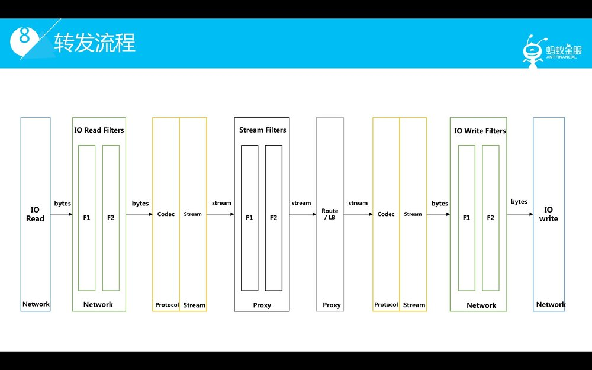

#### 3. 了解了分层设计及转发流程，我们再看一下线程模型

我们先看看 0.1.0 版本的线程模型，可以看到每个链接的 IO 协程是成对出现的，读协程负责读取，事件机制及 Codec 逻辑，数据上升到 steam 层，具体的 stream 事件由独立的常驻 worker 协程池负责处理。在 0.2.0 版本中我们将会进行多核优化，读协程将不再负责 codec 逻辑，将转发由 codec worker pool 来进行。从发展方向上看，我们会借鉴 SEDA 的思路，将转发流程中每一阶段的处理抽象为一个 stage，通过 task queue，worker 协程池，controller 的机制来对每一个阶段进行处理。从技术实现上看，Golang 实现 SEDA 机制的组件也更简单。

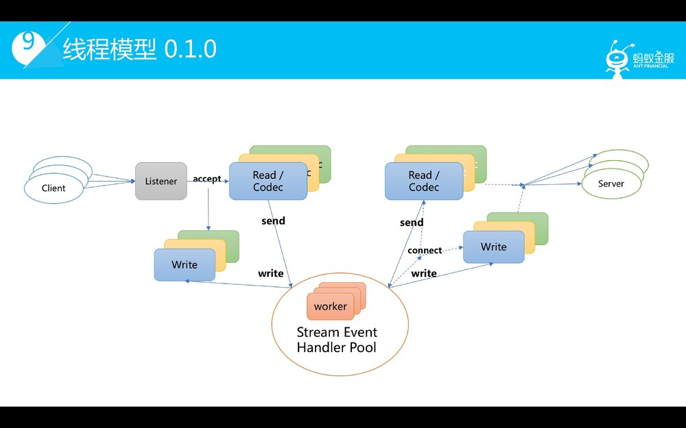

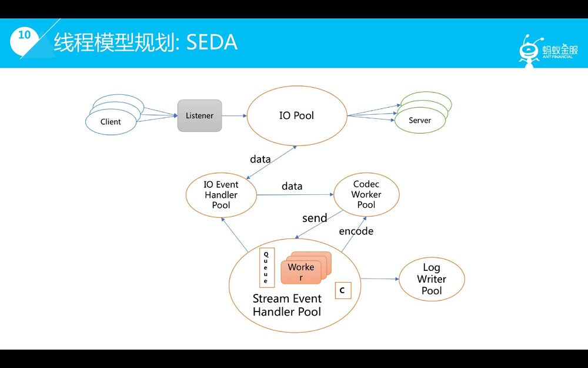

#### 4. SOFAMosn 的模块划分

除了刚才介绍了 4 个核心模块，还有如路由模块负责请求的路由寻址，后端管理模块负责管理后端的生命周期，健康度等。其中蓝色的框是 SOFAMosn 0.1.0 会涉及到的功能模块，红色的虚线框是我们规划去实现，或实验的一些topic。这方面也欢迎大家加入我们一起来建设。

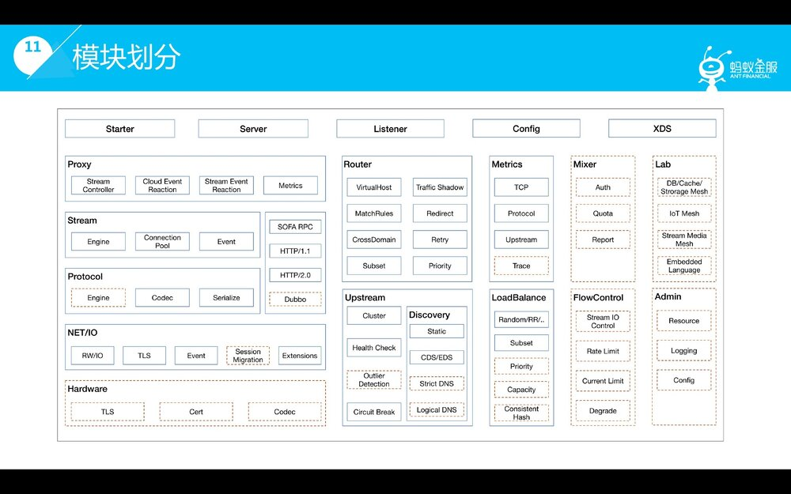

> 最后总结一下，模块化，分层解耦是 SOFAMosn 设计的初衷，此外可编程性，事件机制，扩展性，高吞吐量，都是设计中的重要考量因素。

### SOFAMosn 核心能力

介绍完结构设计方面的一些思路，我们来看看 SOFAMosn 0.1.0 的核心能力。

在网络核心能力方面，我们将 IO 处理相关能力封装抽象成可编程接口，这部分我们已经做过性能优化，可以单独使用；SOFAMosn 提供了内置的 TCP 代理功能，也做过性能优化，可单独使用；此外 SOFAMosn 支持 TLS 链路加密，目前复用了 Golang 的实现，后面的章节会介绍 Golang TLS 性能实验。SOFAMosn 可以配合 iptables 透明转发支持TProxy 模式。同时，MOSN 支持平滑 reload，平滑升级。

在多协议方面，0.1.0 版本中 SOFAMosn 重点支持 SOFARPC，并已运用在蚂蚁生产环境中。同时 SOFAMosn 支持HTTP/1.1，HTTP/2.0 的基本功能，实现方式是使用开源的 HTTP/1.1实现 FastHTTP 和 Golang 自带的 HTTP2 实现。由于 FastHTTP 和 HTTP2 都自带了 IO，链接池等功能，所以这两个协议的支持暂时是脱离 SOFAMosn 整体设计的，性能等方面也还没有做优化，我们会在后续版本迭代考虑将其纳入到 SOFAMosn 的框架体系，并进行性能优化。此外，我们正在研发 Dubbo，HSF 的支持，会在后续版本中推出。同时，目前已支持的 SOFARPC，HTTP/1.1，HTTP/2.0 都支持 Mes h间的 TLS 链路加密。 

此处，在核心路由方面，0.1.0 版本 SOFAMosn 在核心功能上对齐 Envoy，支持 virtual host 匹配，支持 route match匹配，支持 subset 路由匹配/负载均衡。

在后端管理功能方面，支持基础负载均衡算法，支持主动健康检查等必须功能。

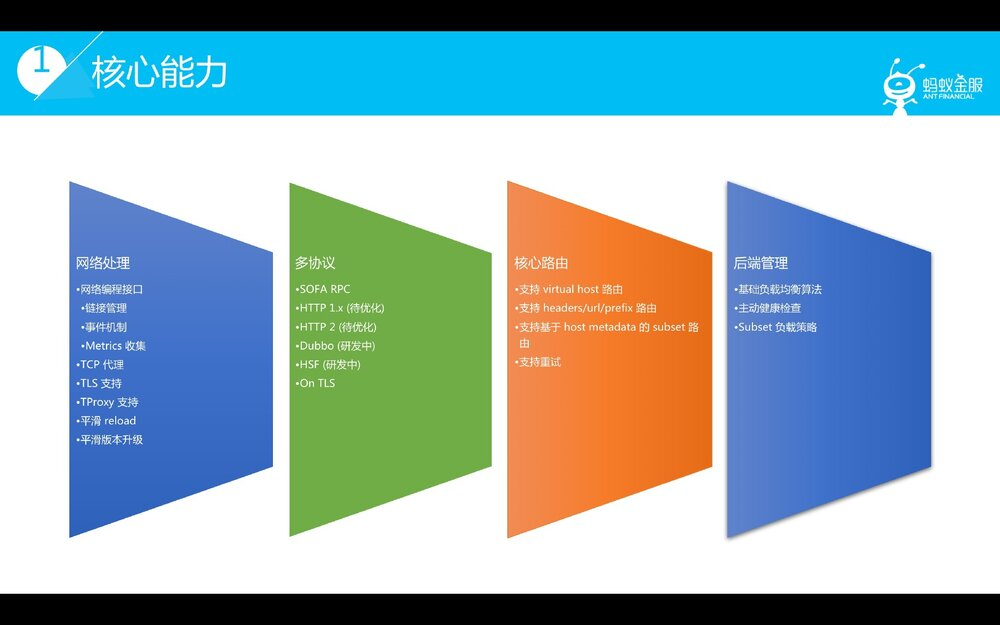

除核心功能外，SOFAMosn 根据我们落地的一些经验提供了一些亮点功能。

首先，SOFAMosn 支持 X-PROTOCOL，一种更轻量级的方式支持自定义 RPC 协议，对于无需解包的相对简单的场景，将 RPC 数据作为 TCP 或者 HTTP/2.0 的payload 进行转发，同时支持所有无需解包的路由负载策略。

同时我们计划在 X-PROTOCOL 中加入编解码扩展点，支持需要解包的场景。在平滑升级的支持上，除了经典的传递 listener fd+ 协议层等待方式，SOFAMosn 支持对存量链接进行协议无关的迁移。同时为了部署升级，SOFAMosn 支持指定 / 更新前后端通信协议。

在 Istio 集成方案上，SOFAMosn 0.1.0 支持 Istio 0.8 版本 Pilot V0.4API 全动态配置运行，支持 xDS on ADS 核心功能，后续版本会不断补齐功能。SOFAMosn 同时支持静态配置模型运行。

除了能力支持，SOFAMosn 在网络层，协议处理层，基于 TCP 的私有协议层都提供了可扩展的能力，使得自定义业务可以优雅集成。在蚂蚁落地的过程中我们内部的 SOFAMosn 依赖于开源版本，通过可扩展的方式来实现蚂蚁内部的自有业务，在工程落地上提供了可行的方案。

### 性能

在介绍了核心功能以后，我们再看另一个大家非常关注的问题，性能，这也是目前关注度较高的问题之一。

在 SOFAMosn 0.1.0 版本，我们重点优化了基于 SOFAMosn 整体框架的协议在 Sidecar 模式下单核转发的性能，即 TCP，SOFARPC 的单核转发性能。 

首先我们分享一下我们在单核场景下优化的一些手段和经验。我们使用的方式主要是独占绑核，内存，IO，调度等方面进行优化。

首先看绑核，在指定 P=1 的情况下，独占绑核不论在系统调用执行效率，cache locality affinity 两个方面都比更表现更好，整体吞吐量提升大约 30%。其次是内存优化，我们采样了 SLAB-style 的回收机制来提高复用，减少内存 copy；

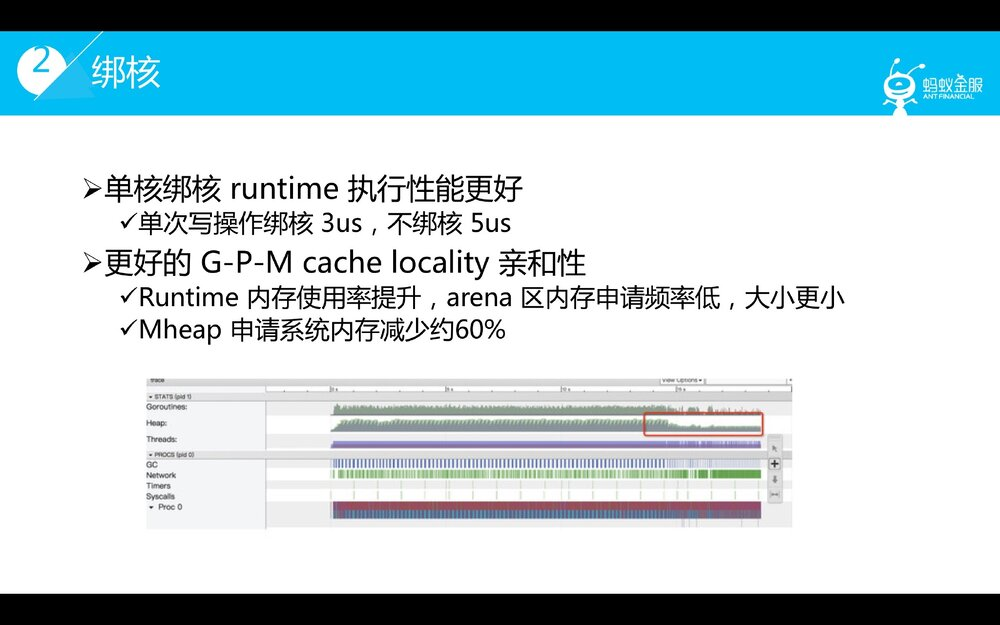

同时在内存分配上需要考虑 Golang 内存模型的亲和性，尽量减少 arena 区内存申请；最后，大家都知道 Golang的 GC 需要是你要去熟悉并适应他的，很多细节需要关注，尽量减少GC scanobject的压力。

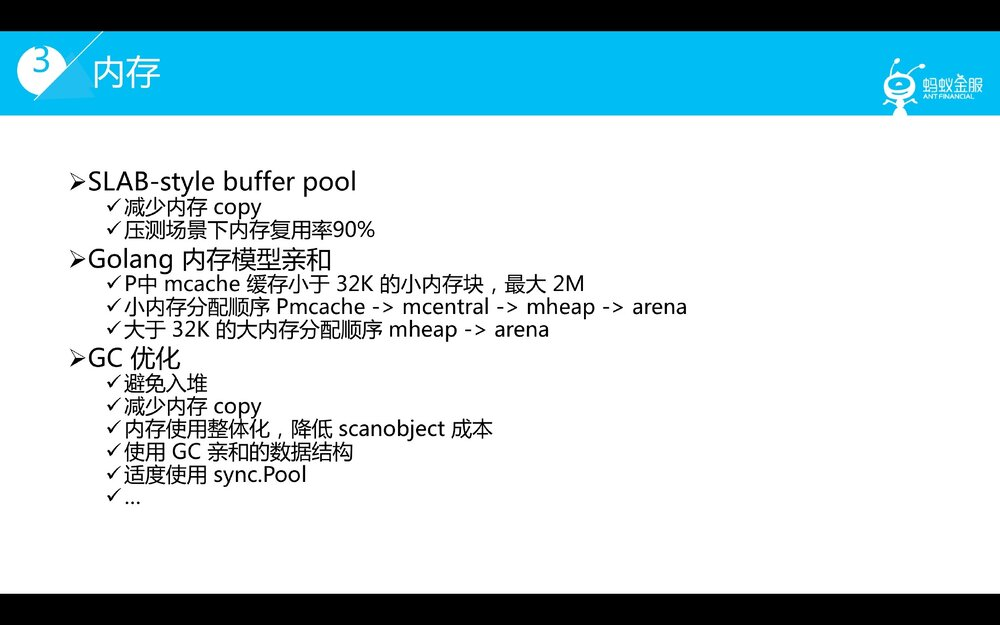

在 IO 方案，Golang 的 IO 模型是同步化的，在读方面既要尽可能多读，又要避免频繁调用 SetReadDeadline 造成的的影响，在我们压测下面频繁调用 SetReadDeadline 会对吞吐量有一定影响。在写方面需要适度 buffer，例如由多 worker 协程驱动造成某个 IO 协程频繁写系统 IO 也会造成吞吐量下降。另一个需要注意的方面是，在多协程场景下需要避免读写频率不均衡，这也是造成整体吞吐量下降的一个潜在原因。另外，如果读或写大量触发，会造成大量系统调用，这会引起 Golang runtime 调度成本升高。在 Golang runtime 调度方面，首先会触发协程调度造成时间消耗，同时 runtime 调度本身没有 OS 线程调度灵敏，也会有一定的时间损耗。同时 OS 系统调用本身也有会耗时，会造成性能下降。

> 这里我分享一些我们在性能优化过程中遇到的真实的 case

**除了 IO 方面的思考，还要关注一下调度均衡方面的问题。**

首先我们利用协程池化来避免 runtime.morestack 的问题，其次在单核场景下需要重点关注 G 是否在饥饿状态，造成资源浪费。

介绍完性能优化的一些过程，我们来看一下目前我们在性能优化上的一些结果，即单核 TCP 转发的性能，和单核SOFARPC 转发的性能。可以看到，在单核 TCP 转发场景，SOFAMosn 0.1.0 版本和 Envoy 1.7版本转发性能差距可控，后续版本我们会继续优化。

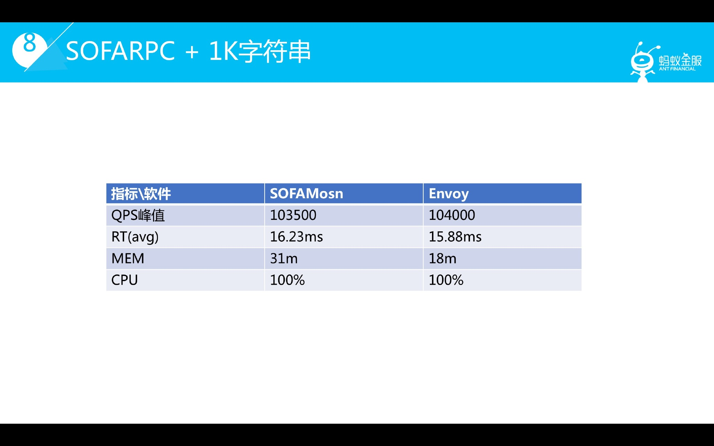

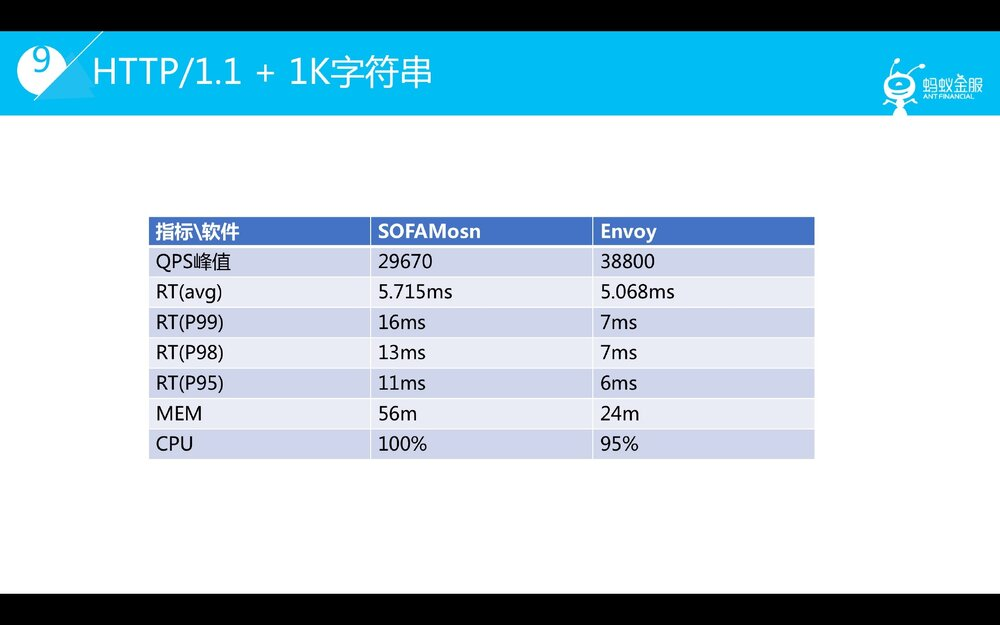

此外，前面提到过 TLS 的实现，我们再来看一下性能方面的一些探索。首先介绍了一下测试的场景。在这个场景下，我们发现对于 ECDHE 算法，Golang 原生的实现性能虽然低于Ningx（使用 OpenSSL），但是高于 Golang with boring SSL。通过对具体算法和协议的性能压测，代码调研我们得出如下结论。可以看出对于 ECDHE-P256加密套件，Golang 原生实现的性能是很不错的，可以放心使用。

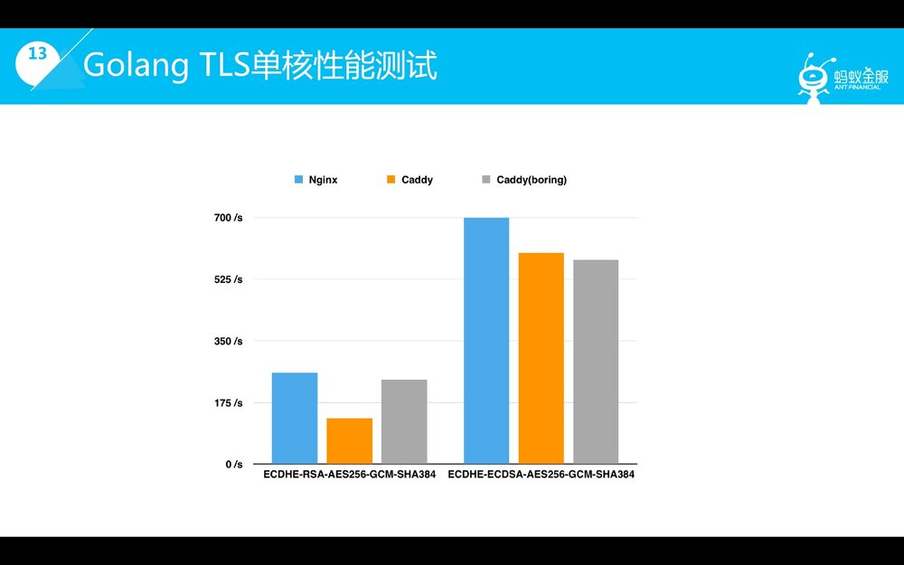

除了这些优化点以后，我们会在后续版本持续进行性能优化，多核优化，内存优化，同时利用用户态，内核态的加速技术来提升 SOFAMosn 的转发性能。在TLS加解密方面，我们将会尝试基于本地加速卡和 Keyless 架构的 Offload 加速，这也是我们在蚂蚁网络从中已经落地的一些技术手段。

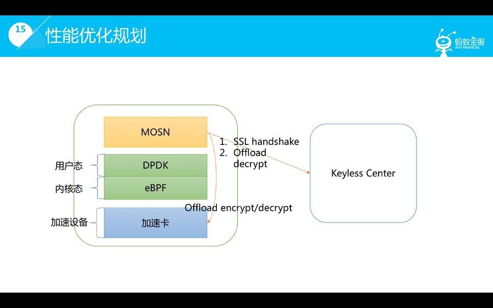

### RoadMap

最后我介绍一下SOFAMosn 的 RoadMap（时间为大体范围，具体发布请关注本公众号）：

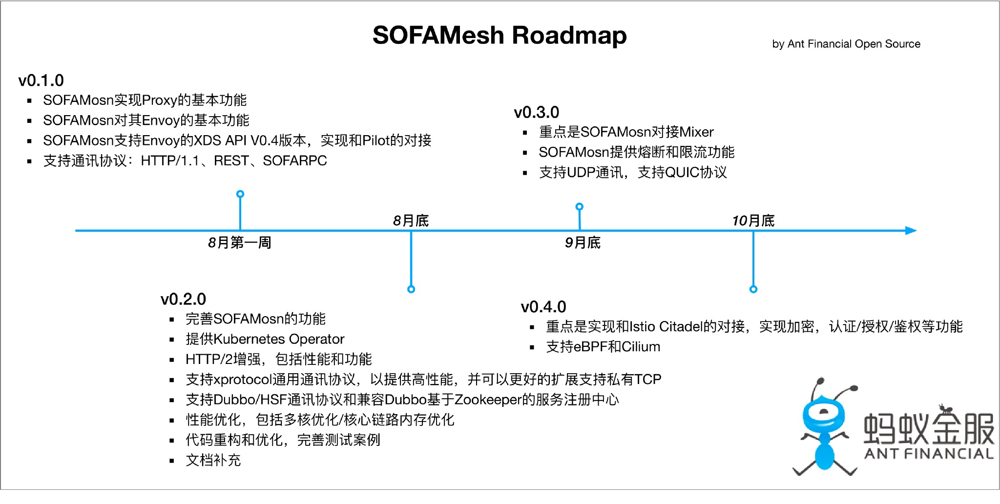

8月第一周我们将发布 SOFAMesh 0.1.0 版本，这个版本重点支持 Proxy 核心能力，支持 xDS V0.4 API 核心功能，支持 SOFARPC 等通信协议。

8月底我们将发布 0.2.0 版本，在不断完善提升核心能力的基础上，我们会完善 X-Protocol 的功能和扩展性，以支持私有 RPC 协议扩展；同时我们将支持 Dubbo/HSF 通讯协议，并接入基于 ZK 的服务注册中心。同时我们将重点加强 HTTP/2.0 的功能，性能优化。我们还将支持 K8S operator，使得 SOFA Mesh 可以接入 K8S 资源。

除功能性补强以外，我们会持续优进行性能优化，重点在多核性能，整体内存优化。此外，我们会持续推进代码优化，完善测试等基础性工作。 

9月底我们将发布 0.3.0，重点提供 Mixer 集成，提供 precondition，quota，report 功能。同时在9月提供熔断和限流的能力。

目前SOFAMosn仍然是一个初级版本，我们将持续投入补充，改进，优化，也欢迎开源社区感兴趣的朋友一起加入SOFAMesh开源版的建设。

### 补充

本文基于作者在 Service Mesh Meetup #2 分享的部分内容所整理，现场分享的 PPT 以及视频，可以在 [IT 大咖说](https://www.itdks.com/eventlist/detail/2455)观看；

PPT下载地址：https://github.com/servicemesher/meetup-slides
