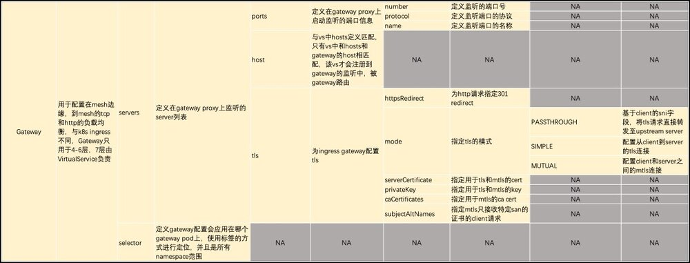
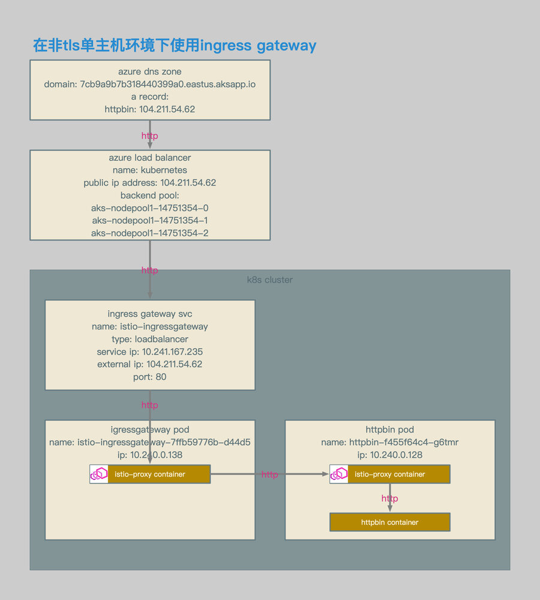
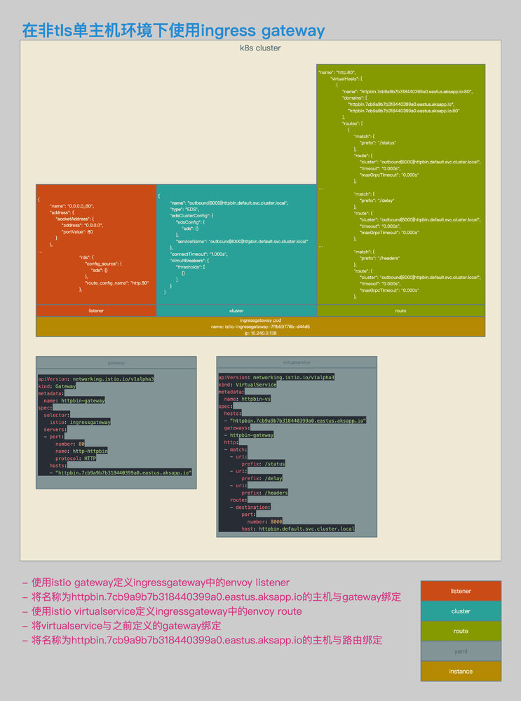
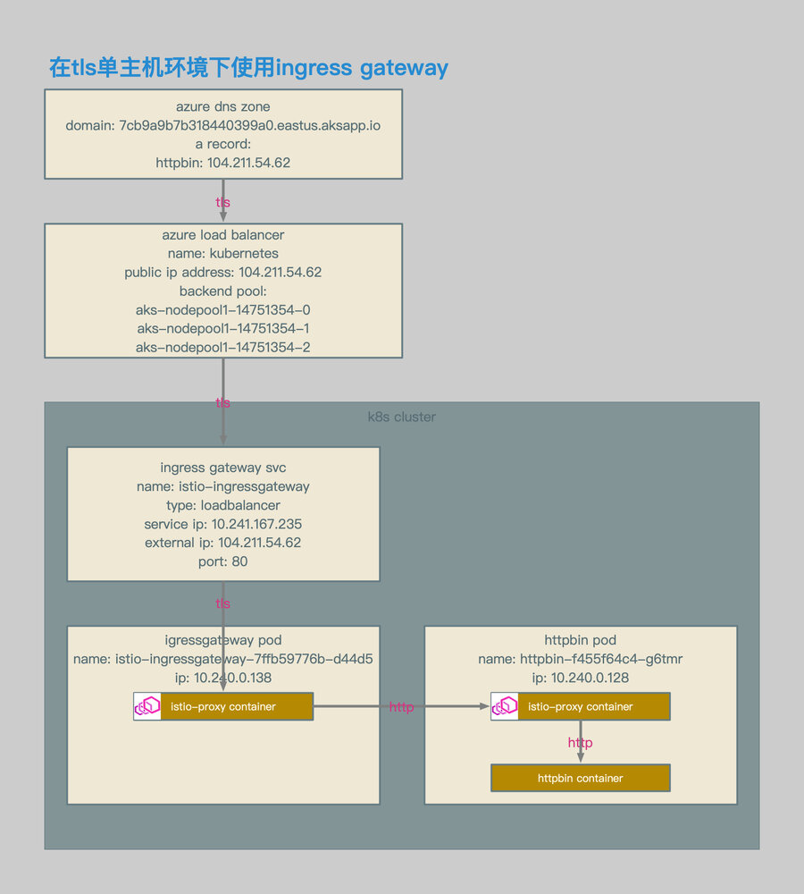
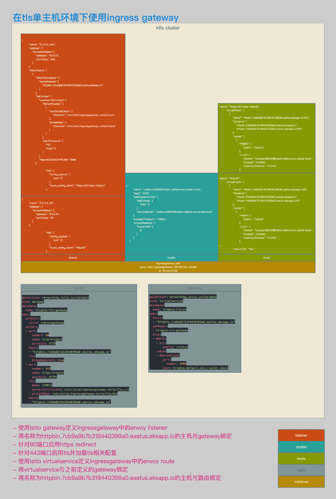
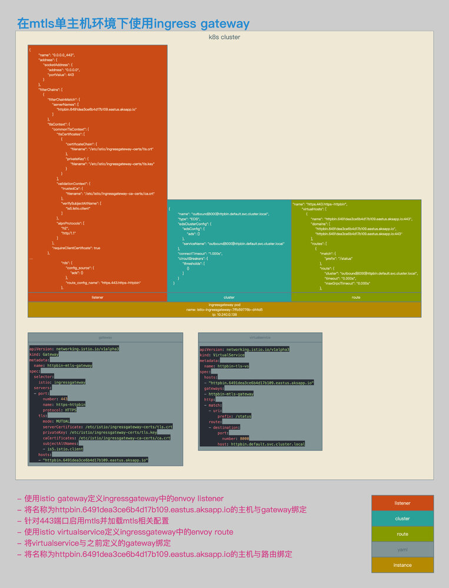
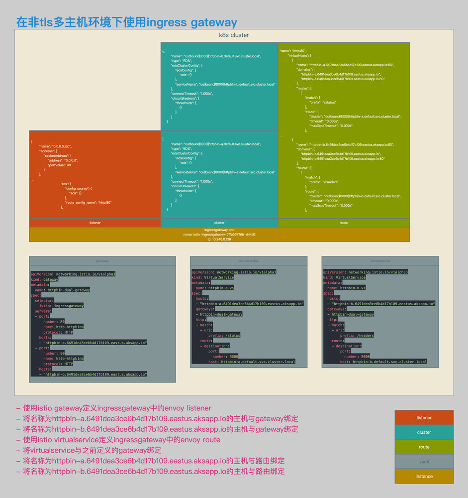
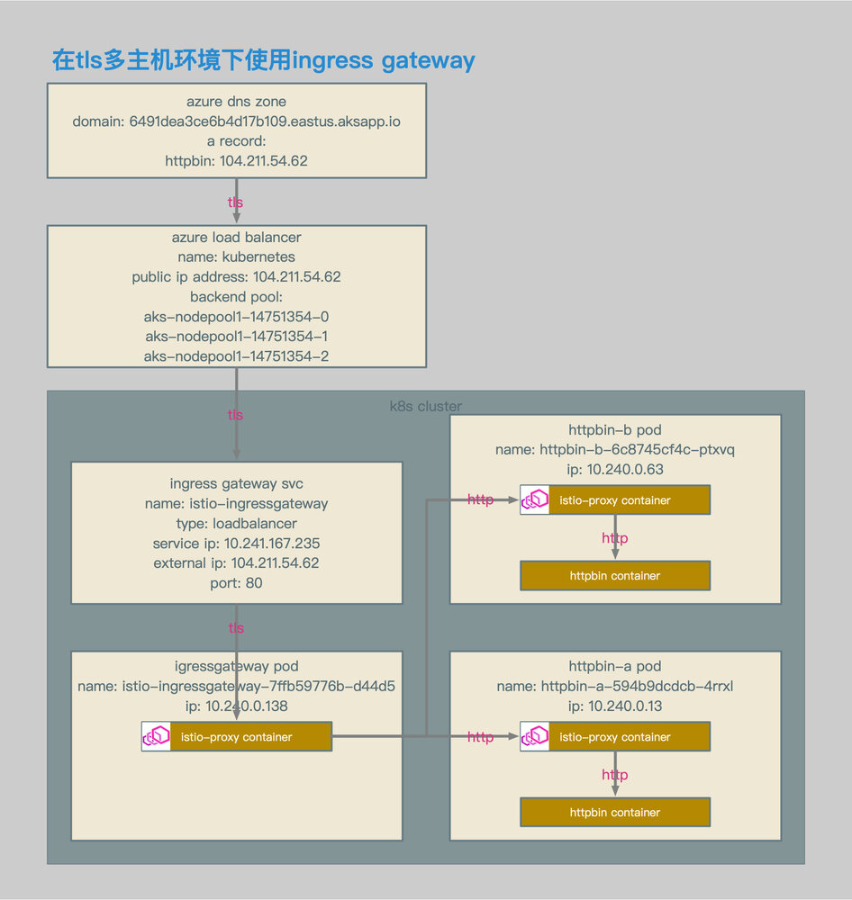
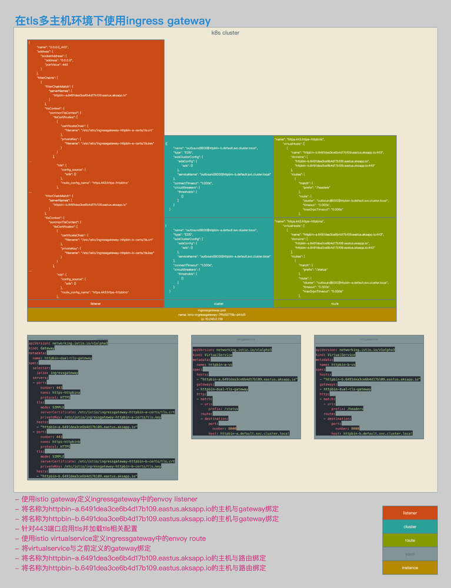

- gateway定义用于配置在mesh边缘，到mesh的tcp和http的负载均衡。

## 非TLS单主机环境

### 相关拓扑



- 使用azure aks环境。
- ingress gateway的service类型为loadbalancer。
- ingress gateway的service enternal ip为104.211.54.62。
- 通过该external ip对应的域名，访问ingress gateway svc。




- 增加gateway定义。
- gateway定义中的selector会将该设置与相应的gateway pod绑定。
- gateway定义中的servers会在相应的pod中生成listener实例，该拓扑中的监听端口为80。
- 需要将80端口注册到该gateway pod对应的服务中（默认已注册）。
- gateway定义中的hosts表示listener会向哪些特定的虚拟主机转发流量，在该示例中为httpbin.7cb9a9b7b318440399a0.eastus.aksapp.io。
- 增加virtualservice定义。
- virtualservice定义中的hosts与gateway中的hosts相对应，表示该服务可以注册到gateway的监听中，这个host写会更新到gateway pod路由表的虚拟主机条目中。
- virtualservice定义中的gateways将virtualservice与gateway关联起来。
- virtualservice定义中的http定义了路由规则，路由规则会写入到相应gateway pod的路由表中。


### 相关配置

```yaml
apiVersion: networking.istio.io/v1alpha3
kind: Gateway
metadata:
  name: httpbin-gateway
spec:
  selector:
    istio: ingressgateway
  servers:
  - port:
      number: 80
      name: http-httpbin
      protocol: HTTP
    hosts:
    - "httpbin.7cb9a9b7b318440399a0.eastus.aksapp.io"
```

- gateway相关配置。
- 该定义与包含istio: ingressgateway label的ingress gateway pod绑定。
- 新建80端口监听。
- 监听主机为httpbin.7cb9a9b7b318440399a0.eastus.aksapp.io的请求。


```yaml
apiVersion: networking.istio.io/v1alpha3
kind: VirtualService
metadata:
  name: httpbin-vs
spec:
  hosts:
  - "httpbin.7cb9a9b7b318440399a0.eastus.aksapp.io"
  gateways:
  - httpbin-gateway
  http:
  - match:
    - uri:
        prefix: /status
    - uri:
        prefix: /delay
    - uri:
        prefix: /headers
    route:
    - destination:
        port:
          number: 8000
        host: httpbin.default.svc.cluster.local
```

- virtualservice相关配置。
- 将该配置应用到名称为httpbin-gateway的实例中。
- 定义路由规则和相关转发目的地。


```bash
[~/K8s/istio/istio-azure-1.0.2/samples/httpbin]$ http http://httpbin.7cb9a9b7b318440399a0.eastus.aksapp.io/status/418
HTTP/1.1 418 Unknown
access-control-allow-credentials: true
access-control-allow-origin: *
content-length: 135
date: Sat, 03 Nov 2018 16:20:59 GMT
server: envoy
x-envoy-upstream-service-time: 4
x-more-info: http://tools.ietf.org/html/rfc2324

    -=[ teapot ]=-

       _...._
     .'  _ _ `.
    | ."` ^ `". _,
    \_;`"---"`|//
      |       ;/
      \_     _/
        `"""`

[~/K8s/istio/istio-azure-1.0.2/samples/httpbin]$
```

- 测试结果。
- 通过主机httpbin.7cb9a9b7b318440399a0.eastus.aksapp.io，可以正常访问httpbin pod。


## TLS单主机环境

### 相关拓扑



- 使用azure aks环境。
- ingress gateway的service类型为loadbalancer。
- ingress gateway的service enternal ip为104.211.54.62。
- 通过该external ip对应的域名，访问ingress gateway svc。
- 客户端使用tls方式访问主机。
- tls请求在ingress gateway处被卸载，并转化为http请求。




- 增加gateway定义。
- gateway定义中的监听端口包括80和443。
- 在80中启用httpsredirect。
- 在443中启用simple tls。
- 指定443的key和cert。
- 增加virtualservice定义，并定义相应路由规则。


### 相关配置

```bash
openssl req \
-newkey rsa:4096 -nodes -sha256 -keyout ca.key \
-x509 -days 3655 -out ca.crt

openssl req \
-newkey rsa:4096 -nodes -sha256 -keyout httpbin-tls.key \
-out httpbin-tls.csr

echo subjectAltName = DNS:httpbin.7cb9a9b7b318440399a0.eastus.aksapp.io > extfile-httpbin-tls.cnf

openssl x509 \
-req -days 3655 -in httpbin-tls.csr -CA ca.crt -CAkey ca.key \
-CAcreateserial -extfile extfile-httpbin-tls.cnf -out httpbin-tls.crt

kubectl create -n istio-system secret tls istio-ingressgateway-certs --key ./httpbin-tls.key --cert ./httpbin-tls.crt
```

- 自签名证书相关配置。
- k8s secret相关配置。


```yaml
apiVersion: networking.istio.io/v1alpha3
kind: Gateway
metadata:
  name: httpbin-tls-gateway
spec:
  selector:
    istio: ingressgateway
  servers:
  - port:
      number: 80
      name: http-httpbin
      protocol: HTTP
    hosts:
    - "httpbin.7cb9a9b7b318440399a0.eastus.aksapp.io"
    tls:
      httpsRedirect: true
  - port:
      number: 443
      name: https-httpbin
      protocol: HTTPS
    tls:
      mode: SIMPLE
      serverCertificate: /etc/istio/ingressgateway-certs/tls.crt
      privateKey: /etc/istio/ingressgateway-certs/tls.key
    hosts:
    - "httpbin.7cb9a9b7b318440399a0.eastus.aksapp.io"
```

- gateway相关配置。
- 新建监听端口包括80和443。
- 在80中启用httpsredirect。
- 在443中启用simple tls。
- 指定443的key和cert。


```yaml
apiVersion: networking.istio.io/v1alpha3
kind: VirtualService
metadata:
  name: httpbin-tls-vs
spec:
  hosts:
  - "httpbin.7cb9a9b7b318440399a0.eastus.aksapp.io"
  gateways:
  - httpbin-tls-gateway
  http:
  - match:
    - uri:
        prefix: /status
    route:
    - destination:
        port:
          number: 8000
        host: httpbin.default.svc.cluster.local
```

- virtualservice相关配置。
- 配置相关路由。


```bash
[~/K8s/istio/istio-azure-1.0.2/samples/httpbin]$ http http://httpbin.7cb9a9b7b318440399a0.eastus.aksapp.io/status/418 --verify no --follow -v
GET /status/418 HTTP/1.1
Accept: */*
Accept-Encoding: gzip, deflate
Connection: keep-alive
Host: httpbin.7cb9a9b7b318440399a0.eastus.aksapp.io
User-Agent: HTTPie/0.9.9

HTTP/1.1 301 Moved Permanently
content-length: 0
date: Sat, 03 Nov 2018 19:25:25 GMT
location: https://httpbin.7cb9a9b7b318440399a0.eastus.aksapp.io/status/418
server: envoy

GET /status/418 HTTP/1.1
Accept: */*
Accept-Encoding: gzip, deflate
Connection: keep-alive
Host: httpbin.7cb9a9b7b318440399a0.eastus.aksapp.io
User-Agent: HTTPie/0.9.9

HTTP/1.1 418 Unknown
access-control-allow-credentials: true
access-control-allow-origin: *
content-length: 135
date: Sat, 03 Nov 2018 19:25:26 GMT
server: envoy
x-envoy-upstream-service-time: 6
x-more-info: http://tools.ietf.org/html/rfc2324

    -=[ teapot ]=-

       _...._
     .'  _ _ `.
    | ."` ^ `". _,
    \_;`"---"`|//
      |       ;/
      \_     _/
        `"""`

[~/K8s/istio/istio-azure-1.0.2/samples/httpbin]$
```

- httpsredirect测试结果。
- 通过http方式访问httpbin.7cb9a9b7b318440399a0.eastus.aksapp.io，可以正常访问httpbin pod。


```bash
[~/K8s/istio/istio-azure-1.0.2/samples/httpbin]$ http https://httpbin.7cb9a9b7b318440399a0.eastus.aksapp.io/status/418 --verify no -v
GET /status/418 HTTP/1.1
Accept: */*
Accept-Encoding: gzip, deflate
Connection: keep-alive
Host: httpbin.7cb9a9b7b318440399a0.eastus.aksapp.io
User-Agent: HTTPie/0.9.9

HTTP/1.1 418 Unknown
access-control-allow-credentials: true
access-control-allow-origin: *
content-length: 135
date: Sat, 03 Nov 2018 19:26:21 GMT
server: envoy
x-envoy-upstream-service-time: 5
x-more-info: http://tools.ietf.org/html/rfc2324

    -=[ teapot ]=-

       _...._
     .'  _ _ `.
    | ."` ^ `". _,
    \_;`"---"`|//
      |       ;/
      \_     _/
        `"""`

[~/K8s/istio/istio-azure-1.0.2/samples/httpbin]$
```

- https测试结果。
- 通过https方式访问httpbin.7cb9a9b7b318440399a0.eastus.aksapp.io，可以正常访问httpbin pod。


## mTLS单主机环境

### 相关拓扑


- 使用azure aks环境。
- ingress gateway的service类型为loadbalancer。
- ingress gateway的service enternal ip为104.211.54.62。
- 通过该external ip对应的域名，访问ingress gateway svc。
- 客户端使用mtls方式访问主机。
- mtls请求在ingress gateway处被卸载，并转化为http请求。




- 增加gateway定义。
- gateway定义中的监听端口443。
- 在443中启用mtls。
- 指定443的key和cert。
- 指定443的ca cert。
- 指定允许连接443的san。
- 增加virtualservice定义，并定义相应路由规则。


### 相关配置

```bash
openssl req \
-newkey rsa:4096 -nodes -sha256 -keyout ca.key \
-x509 -days 3655 -out ca.crt

openssl req \
-newkey rsa:4096 -nodes -sha256 -keyout httpbin-mtls.key \
-out httpbin-mtls.csr

echo subjectAltName = DNS:httpbin.6491dea3ce6b4d17b109.eastus.aksapp.io > extfile-httpbin-mtls.cnf

openssl x509 \
-req -days 3655 -in httpbin-mtls.csr -CA ca.crt -CAkey ca.key \
-CAcreateserial -extfile extfile-httpbin-mtls.cnf -out httpbin-mtls.crt

openssl req \
-newkey rsa:4096 -nodes -sha256 -keyout client.key \
-out client.csr

echo subjectAltName = DNS:is5.istio.client > client-extfile.cnf

openssl x509 \
-req -days 3655 -in client.csr -CA ca.crt -CAkey ca.key \
-CAcreateserial -extfile client-extfile.cnf -out client.crt

kubectl create -n istio-system secret tls istio-ingressgateway-certs --key ./httpbin-mtls.key --cert ./httpbin-mtls.crt
kubectl create -n istio-system secret generic istio-ingressgateway-ca-certs --from-file ./ca.crt
```

- server端自签名证书相关配置。
- client端自签名证书相关配置。
- k8s secret相关配置。


```yaml
apiVersion: networking.istio.io/v1alpha3
kind: Gateway
metadata:
  name: httpbin-mtls-gateway
spec:
  selector:
    istio: ingressgateway
  servers:
  - port:
      number: 443
      name: https-httpbin
      protocol: HTTPS
    tls:
      mode: MUTUAL
      serverCertificate: /etc/istio/ingressgateway-certs/tls.crt
      privateKey: /etc/istio/ingressgateway-certs/tls.key
      caCertificates: /etc/istio/ingressgateway-ca-certs/ca.crt
      subjectAltNames:
      - is5.istio.client
    hosts:
    - "httpbin.6491dea3ce6b4d17b109.eastus.aksapp.io"
```

- gateway相关配置。
- 新建监听端口443。
- 在443中启用mtls。
- 指定443的key和cert。
- 指定443的ca cert。
- 指定允许连接443的san。


```yaml
apiVersion: networking.istio.io/v1alpha3
kind: VirtualService
metadata:
  name: httpbin-tls-vs
spec:
  hosts:
  - "httpbin.6491dea3ce6b4d17b109.eastus.aksapp.io"
  gateways:
  - httpbin-mtls-gateway
  http:
  - match:
    - uri:
        prefix: /status
    route:
    - destination:
        port:
          number: 8000
        host: httpbin.default.svc.cluster.local
```

- virtualservice相关配置。
- 配置相关路由。


```bash
[~/K8s/istio/istio-azure-1.0.2/samples/httpbin/ssl]$ http https://httpbin.6491dea3ce6b4d17b109.eastus.aksapp.io/status/418 --verify no --cert ./client.crt --cert-key ./client.key
HTTP/1.1 418 Unknown
access-control-allow-credentials: true
access-control-allow-origin: *
content-length: 135
date: Sun, 04 Nov 2018 15:28:47 GMT
server: envoy
x-envoy-upstream-service-time: 6
x-more-info: http://tools.ietf.org/html/rfc2324

    -=[ teapot ]=-

       _...._
     .'  _ _ `.
    | ."` ^ `". _,
    \_;`"---"`|//
      |       ;/
      \_     _/
        `"""`

[~/K8s/istio/istio-azure-1.0.2/samples/httpbin/ssl]
```

- 测试结果。
- 通过https mtls方式访问httpbin.6491dea3ce6b4d17b109.eastus.aksapp.io，可以正常访问httpbin pod。


## 非TLS多主机环境

### 相关拓扑


- 使用azure aks环境。
- ingress gateway的service类型为loadbalancer。
- ingress gateway的service enternal ip为104.211.54.62。
- 通过该external ip对应的域名，访问ingress gateway svc。
- 2个主机，分别为：httpbin-a.6491dea3ce6b4d17b109.eastus.aksapp.io和httpbin-b.6491dea3ce6b4d17b109.eastus.aksapp.io。
- 客户端使用http方式访问主机。




- 为2个主机配置统一的gateway定义。
- 为2个主机分别配置virtualservice定义。
- 主机httpbin-a.6491dea3ce6b4d17b109.eastus.aksapp.io被路由至pod httpbin-a的/status uri。
- 主机httpbin-b.6491dea3ce6b4d17b109.eastus.aksapp.io被路由至pod httpbin-b的/headers uri。
- 在gateway的listnener中生成统一的监听0.0.0.0_80。
- 在gateway的route中分别生成针对httpbin-a和httpbin-b的虚拟主机。


### 相关配置

```yaml
apiVersion: networking.istio.io/v1alpha3
kind: Gateway
metadata:
  name: httpbin-dual-gateway
spec:
  selector:
    istio: ingressgateway
  servers:
  - port:
      number: 80
      name: http-httpbin
      protocol: HTTP
    hosts:
    - "httpbin-a.6491dea3ce6b4d17b109.eastus.aksapp.io"
    - "httpbin-b.6491dea3ce6b4d17b109.eastus.aksapp.io"

apiVersion: networking.istio.io/v1alpha3
kind: Gateway
metadata:
  name: httpbin-dual-gateway
spec:
  selector:
    istio: ingressgateway
  servers:
  - port:
      number: 80
      name: http-httpbina
      protocol: HTTP
    hosts:
    - "httpbin-a.6491dea3ce6b4d17b109.eastus.aksapp.io"
  - port:
      number: 80
      name: http-httpbinb
      protocol: HTTP
    hosts:
    - "httpbin-b.6491dea3ce6b4d17b109.eastus.aksapp.io"
```

- gateway相关配置。
- 这2个gateway的配置，生成的envoy配置是一致的。
- 新建监听端口80。
- 分别针对两个主机httpbin-a和httpbin-b进行监听。


```yaml
apiVersion: networking.istio.io/v1alpha3
kind: VirtualService
metadata:
  name: httpbin-a-vs
spec:
  hosts:
  - "httpbin-a.6491dea3ce6b4d17b109.eastus.aksapp.io"
  gateways:
  - httpbin-dual-gateway
  http:
  - match:
    - uri:
        prefix: /status
    route:
    - destination:
        port:
          number: 8000
        host: httpbin-a.default.svc.cluster.local

apiVersion: networking.istio.io/v1alpha3
kind: VirtualService
metadata:
  name: httpbin-b-vs
spec:
  hosts:
  - "httpbin-b.6491dea3ce6b4d17b109.eastus.aksapp.io"
  gateways:
  - httpbin-dual-gateway
  http:
  - match:
    - uri:
        prefix: /headers
    route:
    - destination:
        port:
          number: 8000
        host: httpbin-b.default.svc.cluster.local
```

- httpbin-a和httpbin-b的virtualservice相关配置。
- httpbin-a.6491dea3ce6b4d17b109.eastus.aksapp.io的/status请求被路由至httpbin-a。
- httpbin-b.6491dea3ce6b4d17b109.eastus.aksapp.io的/headers请求被路由至httpbin-b。


```bash
[~/K8s/istio/istio-azure-1.0.2/samples/httpbin/ssl]$ http http://httpbin-a.6491dea3ce6b4d17b109.eastus.aksapp.io/status/418
HTTP/1.1 418 Unknown
access-control-allow-credentials: true
access-control-allow-origin: *
content-length: 135
date: Sun, 04 Nov 2018 16:27:07 GMT
server: envoy
x-envoy-upstream-service-time: 10
x-more-info: http://tools.ietf.org/html/rfc2324

    -=[ teapot ]=-

       _...._
     .'  _ _ `.
    | ."` ^ `". _,
    \_;`"---"`|//
      |       ;/
      \_     _/
        `"""`

[~/K8s/istio/istio-azure-1.0.2/samples/httpbin/ssl]$ http http://httpbin-b.6491dea3ce6b4d17b109.eastus.aksapp.io/headers
HTTP/1.1 200 OK
access-control-allow-credentials: true
access-control-allow-origin: *
content-length: 412
content-type: application/json
date: Sun, 04 Nov 2018 16:27:25 GMT
server: envoy
x-envoy-upstream-service-time: 7

{
    "headers": {
        "Accept": "*/*",
        "Accept-Encoding": "gzip, deflate",
        "Content-Length": "0",
        "Host": "httpbin-b.6491dea3ce6b4d17b109.eastus.aksapp.io",
        "User-Agent": "HTTPie/0.9.9",
        "X-B3-Sampled": "1",
        "X-B3-Spanid": "9b6889437bfe02c8",
        "X-B3-Traceid": "9b6889437bfe02c8",
        "X-Envoy-Internal": "true",
        "X-Request-Id": "e43ae114-52dd-9ee4-930b-dbb0405c6fef"
    }
}

[~/K8s/istio/istio-azure-1.0.2/samples/httpbin/ssl]$
```

- 测试结果。
- 请求httpbin-a.6491dea3ce6b4d17b109.eastus.aksapp.io/status/418和httpbin-b.6491dea3ce6b4d17b109.eastus.aksapp.io/headers均可以被正确路由。


## TLS多主机环境

### 相关拓扑



- 使用azure aks环境。
- ingress gateway的service类型为loadbalancer。
- ingress gateway的service enternal ip为104.211.54.62。
- 通过该external ip对应的域名，访问ingress gateway svc。
- 2个主机，分别为：httpbin-a.6491dea3ce6b4d17b109.eastus.aksapp.io和httpbin-b.6491dea3ce6b4d17b109.eastus.aksapp.io。
- 客户端使用tls方式访问主机。




- 为2个主机分别配置gateway中的server定义。
- 为2个主机的server定义中增加证书的定义，每个server使用不同的证书。
- 为2个主机分别配置virtualservice定义。
- 在gateway的listnener中生成统一的监听0.0.0.0_443。
- 因为gateway中配置的2个server中有不相同的配置，所以在监听0.0.0.0_443中，会生成2个server，分别为httpbin-a.6491dea3ce6b4d17b109.eastus.aksapp.io和httpbin-b.6491dea3ce6b4d17b109.eastus.aksapp.io。
- 因为监听中生成2个server，所以在路由中会生成2条不同的路由相对应，在gateway的路由中生成分别的虚拟主机https.443.https-httpbina和https.443.https-httpbinb。
- 监听0.0.0.0_443所属的server httpbin-a.6491dea3ce6b4d17b109.eastus.aksapp.io被关联至路由https.443.https-httpbina，server httpbin-b.6491dea3ce6b4d17b109.eastus.aksapp.io被关联至路由https.443.https-httpbinb。
- 主机httpbin-a被路由至pod httpbin-a的/status uri。
- 主机httpbin-b被路由至pod httpbin-b的/headers uri。


### 相关配置

```bash
openssl req \
-newkey rsa:4096 -nodes -sha256 -keyout ca.key \
-x509 -days 3655 -out ca.crt

openssl req \
-newkey rsa:4096 -nodes -sha256 -keyout httpbin-a-tls.key \
-out httpbin-a-tls.csr

echo subjectAltName = DNS:httpbin-a.6491dea3ce6b4d17b109.eastus.aksapp.io > extfile-httpbin-a-tls.cnf

openssl x509 \
-req -days 3655 -in httpbin-a-tls.csr -CA ca.crt -CAkey ca.key \
-CAcreateserial -extfile extfile-httpbin-a-tls.cnf -out httpbin-a-tls.crt

openssl req \
-newkey rsa:4096 -nodes -sha256 -keyout httpbin-b-tls.key \
-out httpbin-b-tls.csr

echo subjectAltName = DNS:httpbin-b.6491dea3ce6b4d17b109.eastus.aksapp.io > extfile-httpbin-b-tls.cnf

openssl x509 \
-req -days 3655 -in httpbin-b-tls.csr -CA ca.crt -CAkey ca.key \
-CAcreateserial -extfile extfile-httpbin-b-tls.cnf -out httpbin-b-tls.crt

kubectl create -n istio-system secret tls istio-ingressgateway-httpbin-a-certs --key ./httpbin-a-tls.key --cert ./httpbin-a-tls.crt
kubectl create -n istio-system secret tls istio-ingressgateway-httpbin-b-certs --key ./httpbin-b-tls.key --cert ./httpbin-b-tls.crt
```

- 自签名证书相关配置。
- k8s secret相关配置。


```bash
helm template install/kubernetes/helm/istio/ --name istio-ingressgateway --namespace istio-system -x charts/gateways/templates/deployment.yaml --set gateways.istio-egressgateway.enabled=false \
--set gateways.istio-ingressgateway.secretVolumes[0].name=ingressgateway-ca-certs \
--set gateways.istio-ingressgateway.secretVolumes[0].secretName=istio-ingressgateway-ca-certs \
--set gateways.istio-ingressgateway.secretVolumes[0].mountPath=/etc/istio/ingressgateway-ca-certs \
--set gateways.istio-ingressgateway.secretVolumes[1].name=ingressgateway-httpbin-a-certs \
--set gateways.istio-ingressgateway.secretVolumes[1].secretName=istio-ingressgateway-httpbin-a-certs \
--set gateways.istio-ingressgateway.secretVolumes[1].mountPath=/etc/istio/ingressgateway-httpbin-a-certs \
--set gateways.istio-ingressgateway.secretVolumes[2].name=ingressgateway-httpbin-b-certs \
--set gateways.istio-ingressgateway.secretVolumes[2].secretName=istio-ingressgateway-httpbin-b-certs \
--set gateways.istio-ingressgateway.secretVolumes[2].mountPath=/etc/istio/ingressgateway-httpbin-b-certs > \
./helm-ingressgateway-httpbin-dual-tls.yaml

...
          volumeMounts:
          - name: istio-certs
            mountPath: /etc/certs
            readOnly: true
          - name: ingressgateway-ca-certs
            mountPath: "/etc/istio/ingressgateway-ca-certs"
            readOnly: true
          - name: ingressgateway-httpbin-a-certs
            mountPath: "/etc/istio/ingressgateway-httpbin-a-certs"
            readOnly: true
          - name: ingressgateway-httpbin-b-certs
            mountPath: "/etc/istio/ingressgateway-httpbin-b-certs"
            readOnly: true
      volumes:
      - name: istio-certs
        secret:
          secretName: istio.istio-ingressgateway-service-account
          optional: true
      - name: ingressgateway-ca-certs
        secret:
          secretName: "istio-ingressgateway-ca-certs"
          optional: true
      - name: ingressgateway-httpbin-a-certs
        secret:
          secretName: "istio-ingressgateway-httpbin-a-certs"
          optional: true
      - name: ingressgateway-httpbin-b-certs
        secret:
          secretName: "istio-ingressgateway-httpbin-b-certs"
          optional: true
...
```

- 修改了ingress gateway deployment的配置，可以支持多个证书。
- 分别包含域名为httpbin-a和httpbin-b的证书。

 

```yaml
apiVersion: networking.istio.io/v1alpha3
kind: Gateway
metadata:
  name: httpbin-dual-tls-gateway
spec:
  selector:
    istio: ingressgateway
  servers:
  - port:
      number: 443
      name: https-httpbina
      protocol: HTTPS
    tls:
      mode: SIMPLE
      serverCertificate: /etc/istio/ingressgateway-httpbin-a-certs/tls.crt
      privateKey: /etc/istio/ingressgateway-httpbin-a-certs/tls.key
    hosts:
    - "httpbin-a.6491dea3ce6b4d17b109.eastus.aksapp.io"
  - port:
      number: 443
      name: https-httpbinb
      protocol: HTTPS
    tls:
      mode: SIMPLE
      serverCertificate: /etc/istio/ingressgateway-httpbin-b-certs/tls.crt
      privateKey: /etc/istio/ingressgateway-httpbin-b-certs/tls.key
    hosts:
    - "httpbin-b.6491dea3ce6b4d17b109.eastus.aksapp.io"
```

- gateway相关配置。
- 分别定义2个server，每个server配置不同的证书。


```yaml
apiVersion: networking.istio.io/v1alpha3
kind: VirtualService
metadata:
  name: httpbin-a-vs
spec:
  hosts:
  - "httpbin-a.6491dea3ce6b4d17b109.eastus.aksapp.io"
  gateways:
  - httpbin-dual-tls-gateway
  http:
  - match:
    - uri:
        prefix: /status
    route:
    - destination:
        port:
          number: 8000
        host: httpbin-a.default.svc.cluster.local

apiVersion: networking.istio.io/v1alpha3
kind: VirtualService
metadata:
  name: httpbin-b-vs
spec:
  hosts:
  - "httpbin-b.6491dea3ce6b4d17b109.eastus.aksapp.io"
  gateways:
  - httpbin-dual-tls-gateway
  http:
  - match:
    - uri:
        prefix: /headers
    route:
    - destination:
        port:
          number: 8000
        host: httpbin-b.default.svc.cluster.local
```

- httpbin-a和httpbin-b的virtualservice相关配置。
- httpbin-a.6491dea3ce6b4d17b109.eastus.aksapp.io的/status请求被路由至httpbin-a。
- httpbin-b.6491dea3ce6b4d17b109.eastus.aksapp.io的/headers请求被路由至httpbin-b。


```bash
[~/K8s/istio/istio-azure-1.0.2/samples/httpbin/ssl]$ http https://httpbin-a.6491dea3ce6b4d17b109.eastus.aksapp.io/status/418 --verify no
HTTP/1.1 418 Unknown
access-control-allow-credentials: true
access-control-allow-origin: *
content-length: 135
date: Sun, 04 Nov 2018 17:36:30 GMT
server: envoy
x-envoy-upstream-service-time: 6
x-more-info: http://tools.ietf.org/html/rfc2324

    -=[ teapot ]=-

       _...._
     .'  _ _ `.
    | ."` ^ `". _,
    \_;`"---"`|//
      |       ;/
      \_     _/
        `"""`

[~/K8s/istio/istio-azure-1.0.2/samples/httpbin/ssl]$ http https://httpbin-b.6491dea3ce6b4d17b109.eastus.aksapp.io/headers --verify no
HTTP/1.1 200 OK
access-control-allow-credentials: true
access-control-allow-origin: *
content-length: 412
content-type: application/json
date: Sun, 04 Nov 2018 17:36:33 GMT
server: envoy
x-envoy-upstream-service-time: 8

{
    "headers": {
        "Accept": "*/*",
        "Accept-Encoding": "gzip, deflate",
        "Content-Length": "0",
        "Host": "httpbin-b.6491dea3ce6b4d17b109.eastus.aksapp.io",
        "User-Agent": "HTTPie/0.9.9",
        "X-B3-Sampled": "1",
        "X-B3-Spanid": "27a46e99214fe1e1",
        "X-B3-Traceid": "27a46e99214fe1e1",
        "X-Envoy-Internal": "true",
        "X-Request-Id": "6c1ace56-7f57-9b0d-bb3d-2eb57519c4a2"
    }
}

[~/K8s/istio/istio-azure-1.0.2/samples/httpbin/ssl]$

```

- 测试结果。
- 请求httpbin-a.6491dea3ce6b4d17b109.eastus.aksapp.io/status/418和httpbin-b.6491dea3ce6b4d17b109.eastus.aksapp.io/headers均可以被正确路由。

