**作者介绍**：田晓亮，8年软件行业经验，曾就职于三星，2012年进入云计算领域，对PaaS，DevOps，APM有深入的研究和实践经验，方案支撑近千台VM中的应用部署监控。 2016年加入华为担任架构师，负责微服务的Go语言开发框架及Service Mesh设计和落地。

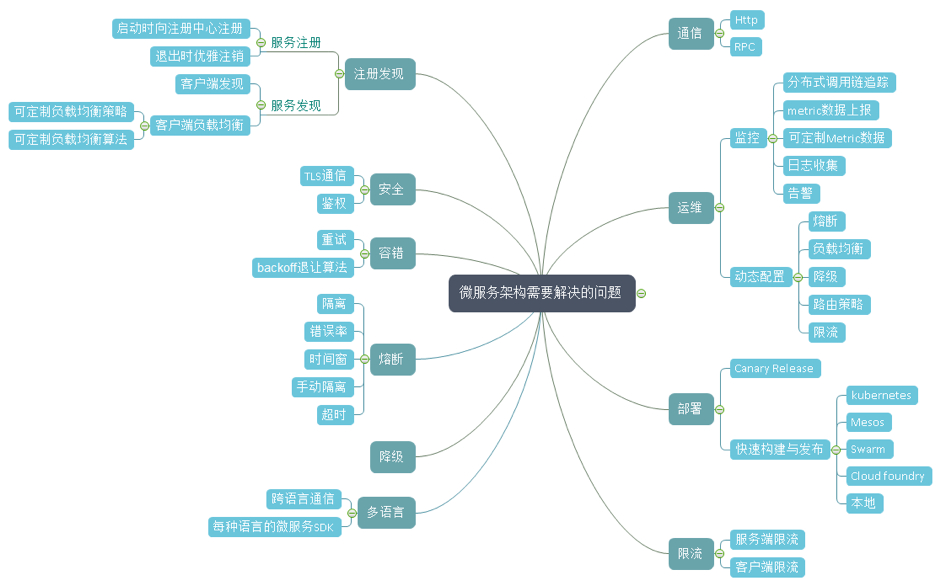

图1 微服务架构需要解决的问题

微服务将原本内存中函数的调用转换为网络中的调用后，就牵扯到这些问题，而任何一个分支展开，都会涉及一系列的问题。业务开发者也许真的有精力去学习架构相关的复杂问题，然而对于公司来说，真正有价值的是业务本身，让业务开发者解决这些问题需要花费浪费大量的时间精力，导致业务上线受到影响。那我们来看看是否有便捷的方式来解决业务开发者的痛点。

### Chassis模式

一句话来概括：一种语言开发框架来作为微服务开发的底座，封装掉复杂性，帮助你解决跨网络带来的问题，让用户聚焦在上层业务逻辑的开发。通常情况下会实现以下功能：

- 日志、Metrics、分布式追踪数据上报
- 健康检查
- 对接统一的配置中心实现动态配置
- 对接注册中心
- 实现负载均衡、熔断降级、容错、限流等保证高可靠运行的功能

现在我们来看看业界有哪些可用的Chassis框架

- Spring Cloud
- ServiceComb
- Dubbo
- Go-Micro
- Go-Kit

先不细去纠结微服务的严格定义，也先暂且搁置诸如“某些老旧框架是否是真的微服务框架”这类争议，从实现方式来看，上述服务化框架都是将分布式系统开发的复杂性进行了一定程度的封装然后提供了简便的开发接口供使用者调用。但是，用这种方式构建微服务还有一些问题：

- 多语言SDK支持：微服务提倡不同组件使用最适合它的语言开发，但是这需要每种语言都有开发框架，不断实现相同的功能。上面可以看到只有go语言和Java语言出现了微服务开发框架，其他语言呢？
- 不论代码侵入程度，都需要开发者思考如何与SDK结合，并从代码层面做出改变，对于大部分开发者来说都是一个高曲线的学习过程。
- 绑定了特定技术栈，一旦想抽身就需要一定程度上的代码改造。
- 老旧单体应用由于无人维护，耦合程度高等问题无法进行改造，在进行微服务拆分的过程中重用遗留代码变得无比困难。而且微服务的拆分难以分步进行，需要一个相对较长的周期将系统整体拆分后才能上线。

我们知道技术演进来自于在实践中不断地将功能抽象，解耦，封装，服务化。

- 云计算技术出现前是数据中心虚拟化，不断地实践使技术发展形成理论和新的实践。IaaS是一种封装，如今开发者与大部分技术团队不需要再学习虚拟化等技术以及如何维护数据中心。
- 没有TCP/IP的时代，开发人员需要自己考虑网络间数据包的传输，以及网络传输代码与业务代码完全耦合的问题，如今，开发者已经不需要关心，操作系统和开发语言已经封装好网络传输过程。 
  是否也可以把语言框架提供的能力抽象，成为服务？

在引入后面内容前，我先介绍下SideCar模式

### SideCar模式

- 在近些年受到Kubernetes对容器调度方式的启示而日渐受到关注的一种功能部署模式，也是一种微服务的设计模式。
- 主要利用了一个Pod中的容器可以共享存储与网络的能力，或者说在一个Host中，这个模式也同样适用。
- 一般分为应用容器和工具容器，工具容器可以重用。

一个典型的场景如下: 

图2 SideCar典型场景

应用容器与日志同步工具在同一个Pod下，共享存储卷，应用程序生成的日志文件会由日志同步工具收集并发送到类似kafka，elasticsearch这样服务中。

在这样的架构下我们获得了什么呢？

- 以容器作为基础打包单元，那么就可以分给不同的团队进行开发测试
- Sidecar容器可重用，可以与不同的容器结合
- 以容器作为错误边界，使服务能够独立开发和测试，比如应用服务在没有日志保存功能的情况下也可以独立运行
- 独立回滚与更新（但需要考虑复杂的版本组合，建议使用语义版本管理对版本进行控制）

在这个模式的基础之下，我们引入了Service mesh。

## Service Mesh 新瓶中的那一杯老酒

### 什么是Service Mesh

Service mesh最早是由Linkerd给出的定义，我们来看看英文版:

> A service mesh is a dedicated infrastructure layer for handling service-to-service communication. It’s responsible for the reliable delivery of requests through the complex topology of services that comprise a modern, cloud native application. In practice, the service mesh is typically implemented as an array of lightweight network proxies that are deployed alongside application code, without the application needing to be aware. (But there are variations to this idea, as we’ll see.)
>
> The concept of the service mesh as a separate layer is tied to the rise of the cloud native application. In the cloud native model, a single application might consist of hundreds of services; each service might have thousands of instances; and each of those instances might be in a constantly-changing state as they are dynamically scheduled by an orchestrator like Kubernetes. Not only is service communication in this world incredibly complex, it’s a pervasive and fundamental part of runtime behavior. Managing it is vital to ensuring end-to-end performance and reliability.

大致的意思如下：

- 一种基础设施层服务，服务间的通信通过service mesh进行
- 可靠地传输复杂拓扑中服务的请求，将它们变成现代的云原生服务
- 一种网络代理的实现，通常与业务服务部署在一起，业务服务不感知
- 一种网络模型，在TCP/IP之上的抽象层，TCP/IP负责将字节码可靠地在网络节点间传递，Service mesh则复杂将服务间的协议请求可靠地在服务间进行传输。它们不关心传输的内容
- TCP/IP仅仅负责传输，但Service mesh可对运行时进行控制，使服务变得可监控，可管理。

### 为什么使用Service Mesh

- 无需考虑每种语言都要解决的问题
- 对业务代码0侵入，开发者无需关心分布式架构带来的复杂性以及引入的技术问题
- 对于不适合改造的老旧单体应用，提供了一种接入分布式环境的方式
- 微服务化的进程通常不是一蹴而就的，很多应用选择了演进的方式，就是将单体应用一部分一部分地进行拆分。而在这个过程中，使用Service Mesh就可以很好地保证未拆分的应用与已经拆分出来的微服务之间的互通和统一治理
- 开发出的应用既是云原生的又具有云独立性，不将业务代码与任何框架，平台或者服务绑定

依然没有银弹，我们来看看Service mesh解决不了的问题

- 无分布式事务方案
- Service Mesh组件代理请求转发，会在一定程度上降低系统通信性能
- 没有Event Driven的框架
- 侵入式框架以源码和业务代码结合，有较强定制和扩展能力，Service mesh相对不易定制扩展
- 在运行时，依赖单独的Service Mesh代理，多了一个故障点。整个系统的运行和运维也强依赖于Service Mesh组件的能力

## Service Mesh的实践历程和设计思路

### Service Mesh在华为公司内部的发展历程

第一代： 基于NGINX的微服务代理

该平台是华为公司内部使用的微服务开发部署运行平台，开发于2013年，用于公司内部某电信业务。在这个业务系统中有大概400多个左右的微服务，实例数量根据局点大小不一样，一个典型的部署为800多个左右实例的规模。

整体架构如下：

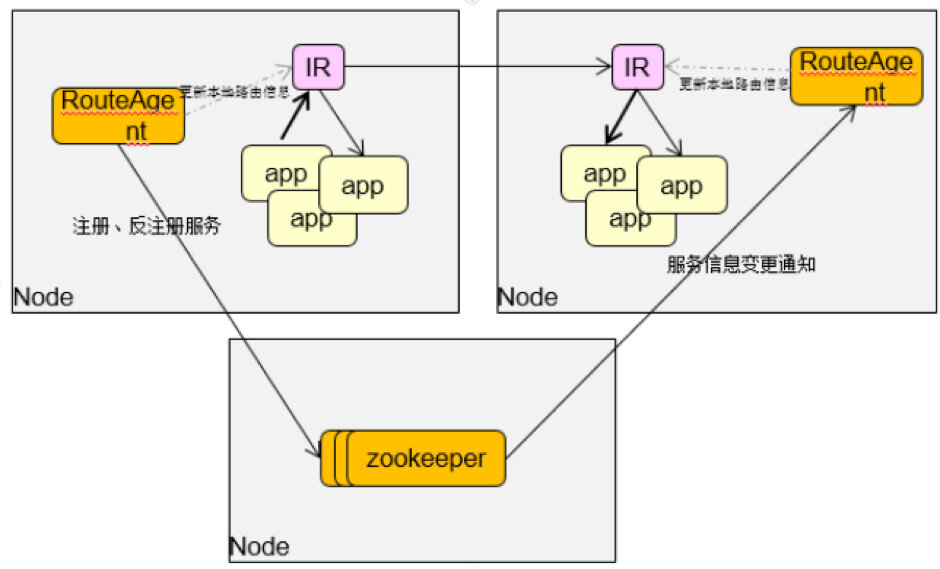

图3 基于NGINX的微服务代理的平台整体架构

其中的Internal Router组件用来给开发者解决分布式架构中的可靠传输问题：

- 使用高性能nginx及其相应的lua扩展作为Internal Router，将Http服务接入
- 使用RouteAgent负责注册/注销实例，更新IR的实例信息
- 使用zookeeper作为注册中心
- 以Per-Host的方式部署在微服务所运行的环境中

用这种方式构建的微服务环境已经在超过200个局点的生产环境下得到使用，整体运行情况良好。但是随着时间的推移，当业务对敏捷的要求越来越大，而且容器的使用也越来越广泛，这种方式带来了一些问题：

- 使用lua脚本扩展注册发现，负载均衡，熔断，降级，容错，限流，但lua的扩展性有一定的局限
- 用RouteAgent负责服务的注册以及每个NGINX上服务实例路由的刷新，RA需清楚地感知本节点上的微服务都有哪些，但是使用Kubernetes做容器调度后微服务和实例的分布信息在K8S里面集中记录
- 容器的IP更多，变化更频繁，使用RouteAgent刷新NGINX路由的方式会导致NGINX服务受到影响，频繁的路由刷新导致业务运行收到影响
- 当IR服务失败后，整个Host中的服务都会丢失，无法与外界建立联系

为了解决这些问题，出现了第二代的解决方案： HSA Sidecar

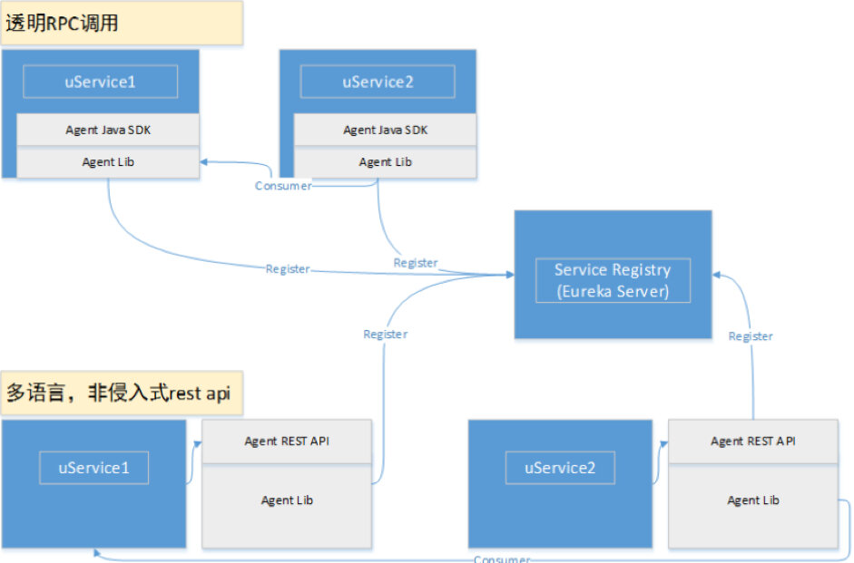

图4 HSA Sidecar设计

HSA是华为内部的一套微服务开发框架，它提供了注册中心，配置中心，java开发框架，以及SideCar等组件

- 基于Java 微服务框架开发,非侵入式通信方式，支持RPC与Http，提供SOAP协议转换，但会导致性能下降
- 与微服务部署在一个Pod中即Sidecar模式
- 作为代理服务，使微服务自动获得注册发现，负载均衡，熔断，降级，容错限流等功能
- 占用资源很高，一个应用实例一个Sidecar实例的部署方式，会占用过高资源

虽然第一代的问题解决了，但是第二代的Sidecar在性能和资源占用上有很大的问题，在少量的技术项目中试用后，因为资源占用过高的问题无法在大规模环境中推广使用。

### CSE Mesher介绍

Service Mesh 模式的一种实现。基于自研的Go语言微服务框架（该框架即将开源）开发，使用ServiceComb注册中心（已经开源）与CSE配置中心，以Sidecar的方式部署在微服务所运行的环境中，也可以PerHost模式运行。在用户数据面使用，提供VM部署、公有云部署、容器部署，占用资源小（闲置10多M，并发运行时30多M）。

#### 基本能力

**注册发现**

注册中心为插件化模块，目前对接了ServiceComb、Service Center，未来还会有更多的系统对接进来 

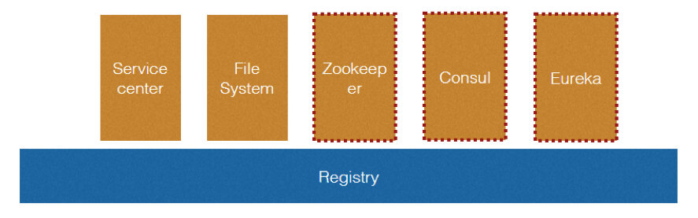

图5 可插件化的注册中心

**路由规则管理**

根据预定义的路由规则对请求进行引流

- 支持权重引流：比如将5%的流量引到购物车的1.0版本，20%引到2.0版本
- 可根据服务请求特征进行引流：比如消费者的请求中Header带有的用户名为Json，那么可以引流到某个服务的特定版本中
- 利用读写锁，路由可在运行时更新，并且不丢失请求

**协议转换与不同框架的对接与统一治理**

使用标准OpenAPI契约，可以实现Dubbo RPC协议与Http协议的互转，用于透明地接入遗留的Dubbo应用并对遗留应用进行统一的服务治理

**使用负载均衡与重试策略**

- 负载均衡器会调用注册中心插件进行实例查询
- 在查询中的实例里表中，使用Filter进行过滤
- 将过滤后的实例传入Strategy中进行实例选择
- 默认提供RoundRobin Random，会话粘滞策略
- 具备容错能力且加入Backoff算法，增强网络稳定性

**使用熔断降级**

熔断使用的断路器对一个执行过程进行包装，断路器负责监控维护每个执行过程的状态、结果、错误、超时。当达到一定阀值时就会熔断，并触发降级。以这样的机制来保护服务提供者，不会出现级联的雪崩式错误。

**使用限流**

提供了消费者端与提供者端限流

用户可以通过配置来限制每秒只允许多少个请求被发出或者接受

**对接监控**

Metrics：提供了主动上报到CSE Dashborad的方式。也可与华为公有云APM，Prometeus对接 
分布式追踪：对接Zipkin

#### 架构设计

**整体架构**

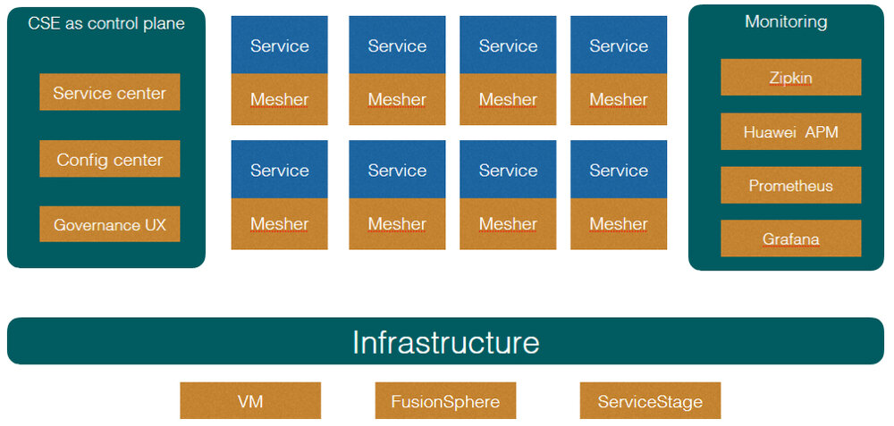

图6 CSE Mesher整体架构

Mesher背靠CSE组件，使用微服务引擎中的服务中心与配置中心等服务作为控制面，Mesher与业务代码部署在一起运行在数据面

**数据面**

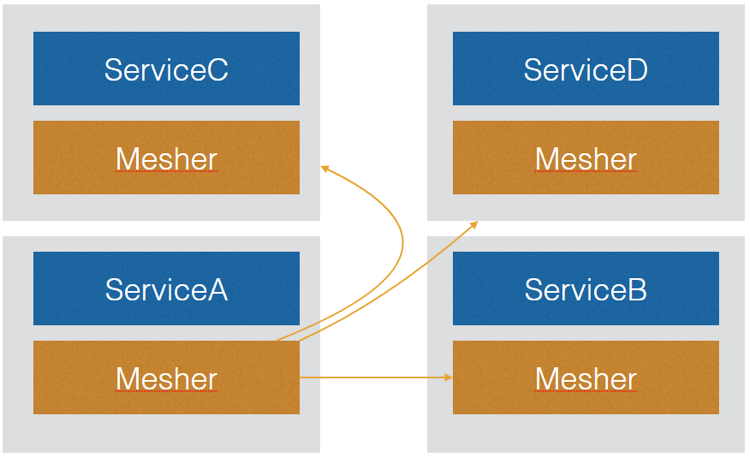

图7 CSE Mesher数据面

即Service mesh组件本身，对所有请求进行处理，它有以下功能

- 发现服务
- 执行路由策略
- 负载均衡
- 拦截所有请求并处理，转发
- 认证鉴权
- 生成监控数据

**控制面**

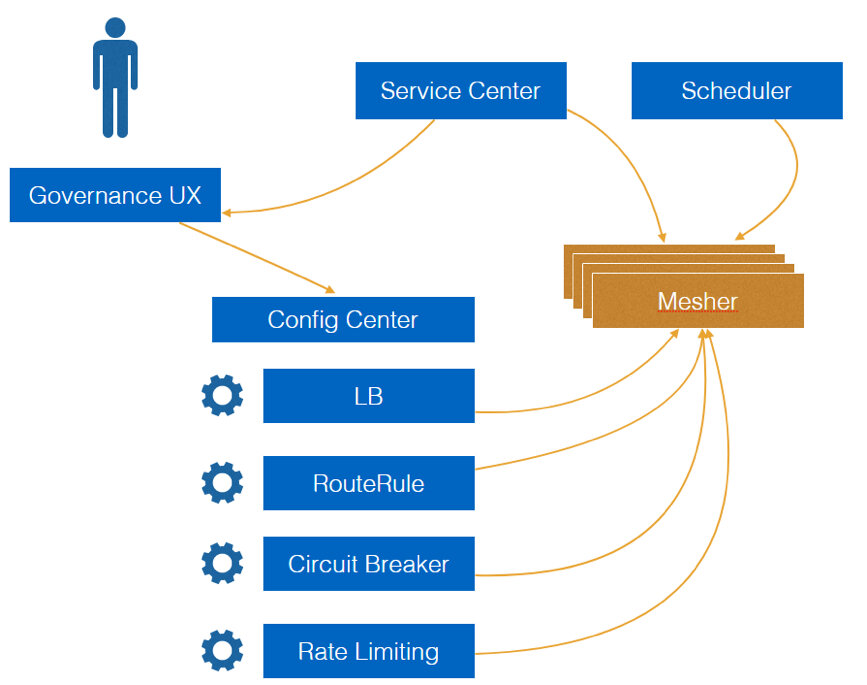

图8 CSE Mesher控制面

为管理人员提供统一的管理入口，为所有运行的mesher提供配置下发但不会介入服务请求

- 注册中心：服务上下线感知
- 下发配置：使用Web Console对运行时更改，负载均衡，熔断容错，限流等策略
- 对接监控服务与监控页面
- 调度引擎：这里并非是微服务引擎提供的组件，是可选组件，这个组件负责拉起服务，维护实例数，在资源池中调度分配实例，这里推荐使用ServiceStage负责实例的生命周期管理

#### 运行场景

**不同的部署方式**

与业务服务部署在一起有3种运行模式

1.仅消费者使用Mesher，提供者为使用ServiceComb开发框架的服务或者裸服务，

下图为例:

ServiceC为裸服务,它既不用mesher也不用SDK，那么起码它需要自己注册到服务中心中，供其它服务发现，否则无法进行访问。

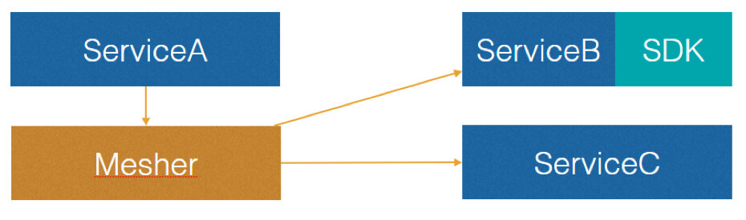

图9 仅消费者使用Mesher

2.消费者与提供者均使用Mesher

图10 消费者与提供者均使用Mesher

以这种方式运行的服务可以使用透明TLS传输，并且拥有了服务端限流

3.提供者使用Mesher，消费者A使用ServiceComb SDK进行开发可直接发现服务B，但是消费者C作为裸服务需要自己发现服务B 

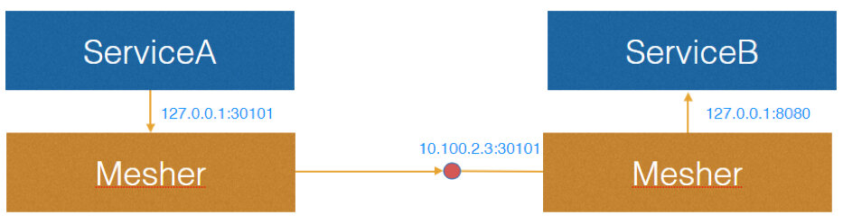

图11 仅提供者使用Mesher

**运行时请求处理**

消费者端请求 
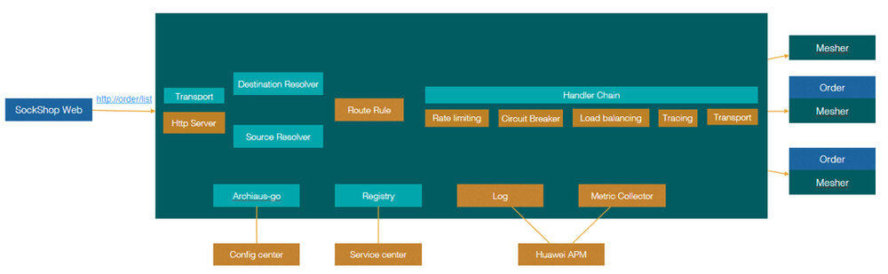

图12 消费端发送请求流程

上图为例：

SockShop服务将mesher作为代理并使用地址<http://order/list>访问订单服务

1. Destination Resolver 
   目标微服务名解析，支持插件定制，可根据请求特征决定微服务名是什么
2. Source Resolver 
   将IP地址解析为微服务实体信息
3. 路由决策 
   根据Source和Destination 信息决定最终要访问哪个微服务
4. 处理链 
   处理链为可随时插入或减少的模块，在这里Mesher实现了限流，熔断，降级，负载均衡等功能
5. 传输层 
   最终请求通过传输层发送到目标微服务实例 
   提供者端接收请求 
   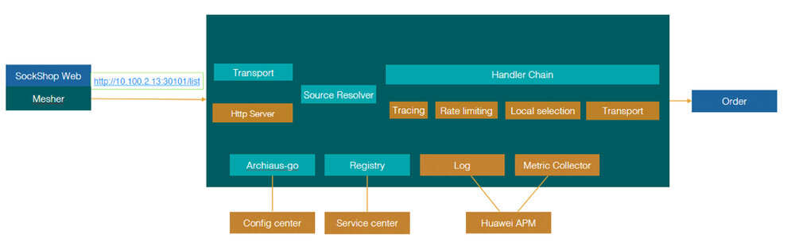
   图13 提供者端接收请求流程

上图为收到远程请求后的处理过程

1. 服务端接到请求，将IP地址解析为微服务信息
2. 进入处理链，这一步并没有负载均衡而是直接使用local selection 进行处理

#### 性能对比

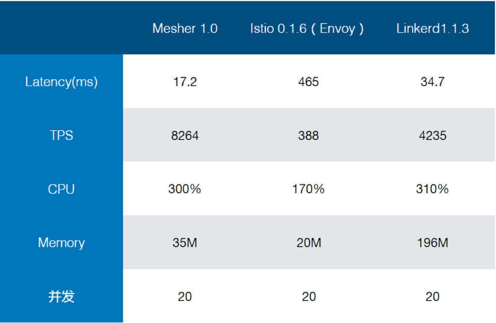

图14 Mesher1.0、Istio 0.1.6 (Envoy)、Linkerd1.1.3性能对比

在性能对比后，我聊下自己的看法

- Linkerd 作为java实现的service mesh，受到资源占用的拖累，考虑到数据中心成本，不适合作为SideCar和应用部署在一起，相信它的主要场景在于Kubernetes Ingress和Daemonset，并且由于只有数据面，需要和别的生态系统对接获得控制面能力，否则，业务团队又要考虑自己开发控制面。
- 目前Istio已知问题是每次请求都要调用一次Mixer API来传送metric数据，相信未来版本能够解决，但不能满足我们内部的产品节奏。
- 作为对比，Mesher通过Channel与Go协程机制主动上报metric数据，以此获得更高的性能，机制如下：模块将数据传送到channel中，协程收到信号并主动上报，在这样的机制下开启监控，性能只有百分之2左右的下降。 
  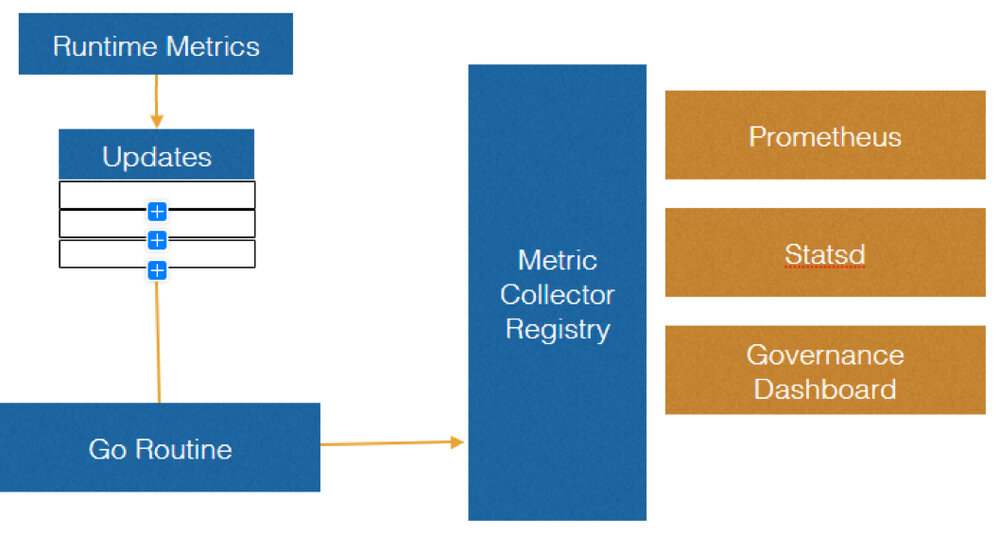
  图15 Metric数据上报机制

## 一些思考以及未来

### 华为为什么开发了自己的Service Mesh

- Istio的性能问题没有解决，Envoy每次访问请求Mixer API导致性能下降
- Istio强绑定Kubernetes平台（1.7.4+），虽然有着良好的架构，对接不同平台不是问题但需要时间，Mesher贯彻不将开发者绑定到任何框架和平台的理念
- 从成本角度讲Linkerd并不适合做SideCar部署，JVM资源占用较多
- 过去在ServiceComb中的积累：Service center，Config center，Go SDK，Governance UX已经提供了大量技术积累，可用于做Mesher的控制面。
- 既然非侵入式与侵入式都不是银弹，侵入式（ServiceComb Java）与Mesher提供的非侵入式框架的无缝结合，混编就变得有价值了，开发者可以因地制宜，选择适合自己的方案。

### Service Mesh是个大舞台

现在已经出现了越来越多的Service mesh实现：

- 数据面：Linkerd，Nginx，Envoy
- 控制面：Istio

Linkerd 是在2016年出现的，Envoy在6个月后出现，不过Envoy已经在2015年就商用了。这两个项目也是最有名的Service Mesh。

Istio在2017年5月出现，它提供了控制面，并使用Envoy作为数据面的Service Mesh。目前已经开始有些Service Mesh提供者宣布与Istio进行集成，比如Linkerd和Nginx。这意味着控制面与数据面是解耦的，任何的控制面都可以和数据面Service Mesh进行集成。CSE Mesher也会考虑与Istio进行集成，成为除了Envoy之外的另一种数据面选择。

实际上在开源项目之外，很多公司内部也早已用类似的方案进行自己系统的构建，各自有各自的特点用来解决自己的实际问题。Istio成为CNCF里面一个被认为是“Kubernetes之后的第二个爆款”是有理由的，它提供了一种从平台的角度解决应用架构的思路，进一步简化了应用的开发。我们也相信在这个大舞台上会有更多的方案出现，而这些方案的出现也会让微服务和Cloud Native应用的构建方式有更多地选择。

我们团队也已经基于多年的实践经验将当前的内部Service Mesh方案包含在华为云的“微服务引擎”中，开放给外部用户使用。希望可以作为一种参考，可以给正在选择实施微服务架构方案的读者一些帮助。

