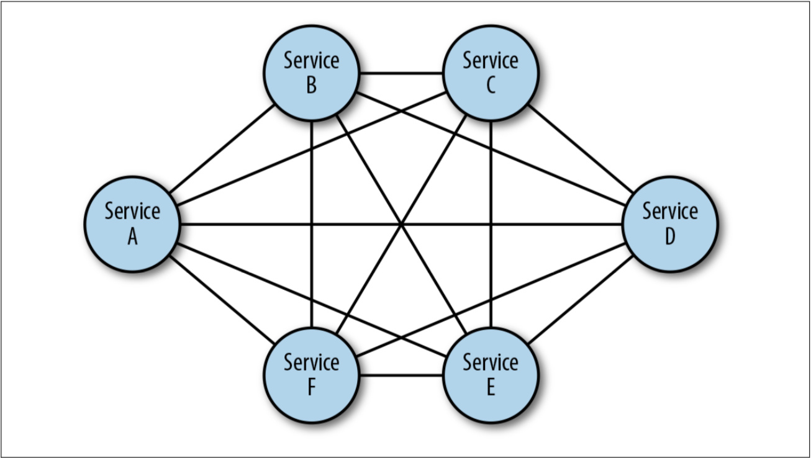
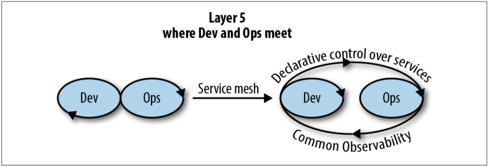
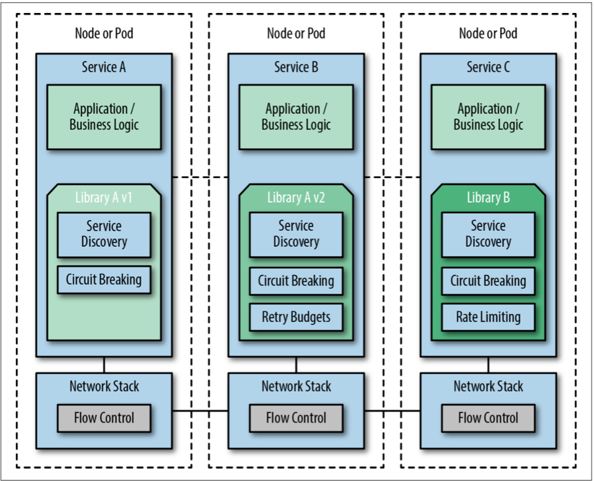
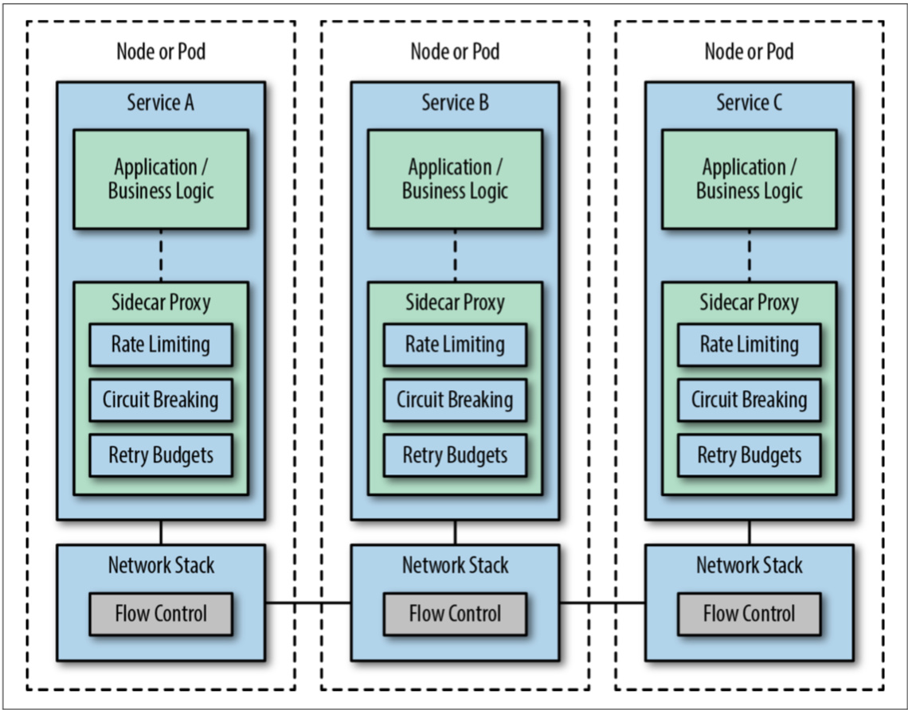
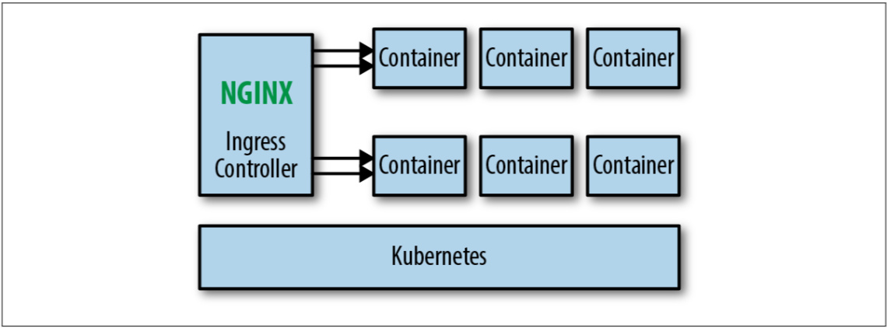
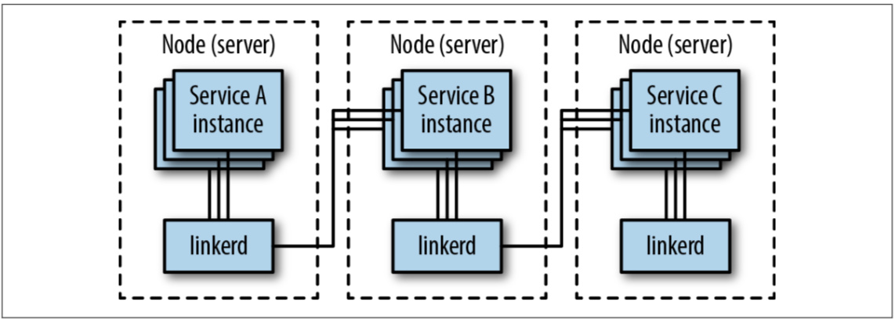
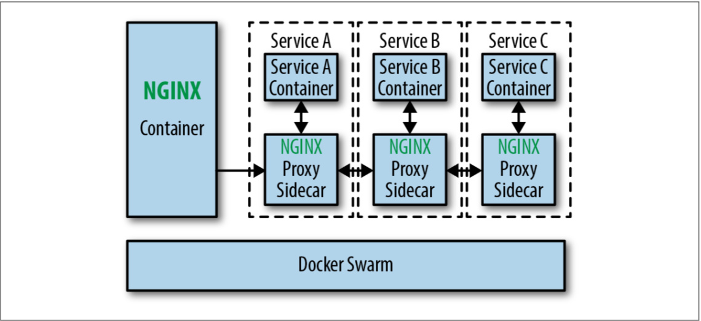
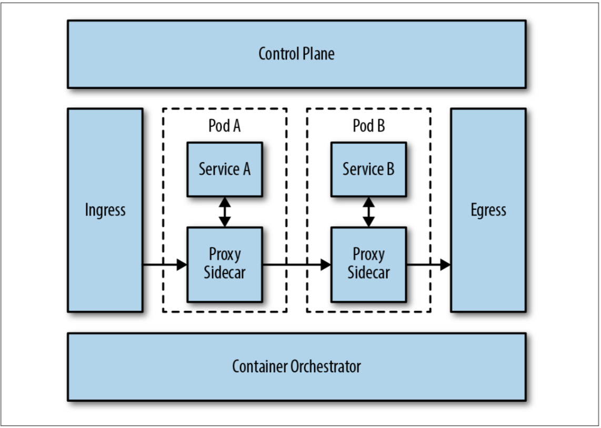
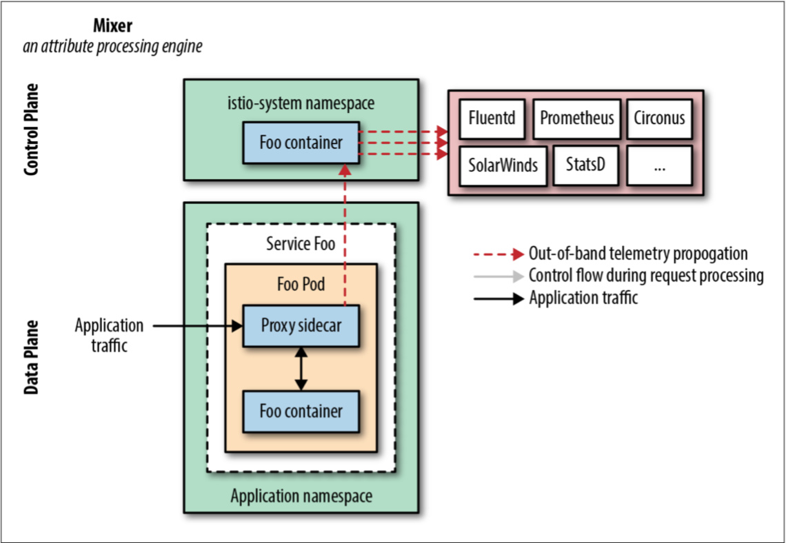
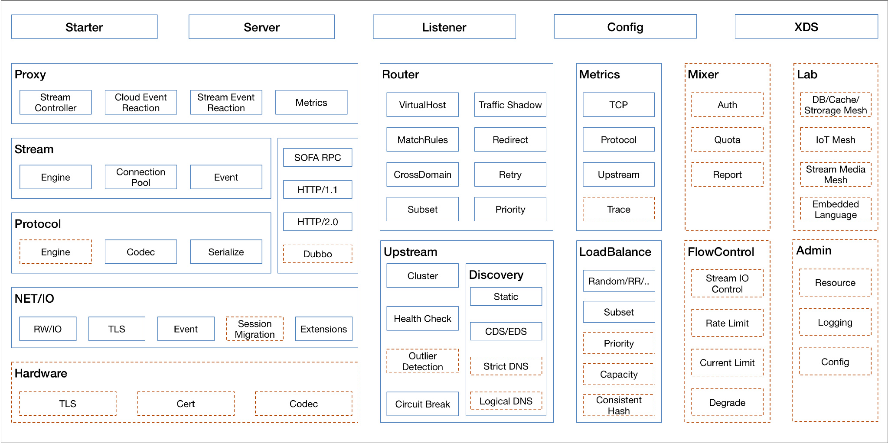

> 追本溯源，Service Mesh 实际上是一种 SDN，等同于 OSI 模型中的会话层。每一次技术变革，必然要导致生产力和生产关系的变革，我们看到这种趋势正在加速。本书中给出了企业上 Service Mesh 的路径，可供广大技术和管理人员参考。
>

这是一本由 Nginx 赞助，O’Reilly 出版社出品的关于服务网格的书籍，本书标题是 _The Enterprise Path to Service Mesh_，还有个副标题 _Decoupling at Layer 5_，第一版发行于 2018 年 8 月 8 日。这本书一共 61 页，本文是我对该书的一些解读，读者可以在[Nginx 的网站](https://www.nginx.com/resources/library/the-enterprise-path-to-service-mesh-architectures/)上免费下载阅读完整内容。

## 关于作者

本书作者是[Lee Calcote](https://twitter.com/lcalcote)，先后在 Cisco、Seagate、Solarwind 任职负责技术战略决策，参与 DMTF（Distributed Management Task Foundation）、CIS（Center for Internet Security），还是 CNCF Ambassador、Docker Captain。

*图书封面*

下面看下本书目录，大体了解下本书讲了哪些内容。

## 目录

**第 1 章 Service Mesh 基础**

- 管控多个服务
- 什么是 Service Mesh
- 为什么需要 Service Mesh
- 结论

**第 2 章 技术对比**

- 不同的服务网格（还有 Gateway）
- 容器编排
- API Gateway
- 客户端库
- 总结

**第 3 章 采纳和演进**

- 渐渐式采纳
- 采纳步骤
- 改造部署
- 架构演进
- 总结

**第 4 章 定制和集成**

- 可定制 Sidecar
- 可扩展适配器
- 总结

**第 5 章 总结**

- 用还是不用？

下面将对每章解读。

## 第 1 章 Service Mesh 基础

微服务将原先的单体架构中的应用内通信，转变为基于 RPC 的远程通信，虽然这样提高了研发效率，提高了开发语言选择的多样性，但是随着单体应用的解体，原先的巨石散落为石块变得四处都是，如何管理这些微服务就成了难题。当微服务的个数少的时候还可以通过人工配置的方式去管理，但随着业务规模的增大，微服务的数量也可能呈指数级增长，如何协调管理成百上千的服务，这就需要有一套设计良好的框架。

一直以来都存在一个[谬误](https://en.wikipedia.org/wiki/Fallacies_of_distributed_computing)，那就是在分布式系统中网络是可靠的。实际上网络是不可靠的，而且也是不安全的，如何保证应用调用和事务的安全性与可靠性，保护微服务的一个专门的基础设施层 Service Mesh 就应运而生。

Service Mesh 是建立在物理或者虚拟网络层之上的，基于策略的微服务的流量控制，与一般的网络协议不同的是它有以下几个特点：

- 开发者驱动
- 可配置策略
- 服务优先的网络配置而不是协议

本章主要介绍 Service Mesh 的定义和组成，为什么要使用 Service Mesh，它可以带来哪些好处。

Service Mesh 与传统网络的区别就是**硬件或者虚拟网络**与**软件定义网络（SDN）**的区别，我们从上图中可以看到物理和虚拟网络中比起 SDN 还多了**管理平面**。

硬件网络中控制平面与数据平面紧耦合，也就是说是与供应商绑定的，管理平面是独立出来的。而 SDN 却给了我们很多自由度，可以通过软件的形式自定义网络，例如 Kubernetes 中的[CNI](https://jimmysong.io/kubernetes-handbook/concepts/cni.html)。

物理网络有很多种拓扑类型，如星形拓扑、总线拓扑、环形拓扑、树型拓扑、网状拓扑等，大家可以去搜索拓扑网络。不论是那种拓扑结构，总有一条路径可以从一个节点路由到另一个节点，只是不同的拓扑类型效率不同，管理的复杂度不一样罢了。

下图是网状拓扑，所谓网状拓扑就是每个节点都可以跟所有其他节点直接互联，这样而这也是链接数最多一种拓扑，如果有 n 个节点的话，链接数就是 n(n-1)。

### Service Mesh 架构

下图是[Conduit](https://condiut.io) Service Mesh（现在已合并到 Linkerd2 中了）的架构图，这是 Service Mesh 的一种典型的架构。

Service Mesh 中分为**控制平面**和**数据平面**，当前流行的两款开源的 Service Mesh Istio 和 Linkerd 实际上都是这种构造，只不过 Istio 的划分更清晰，而且部署更零散，很多组件都被拆分，控制平面中包括 Mixer、Pilot、Citadel，数据平面默认是用 Envoy；而 Linkerd 中只分为 linkerd 做数据平面，namerd 作为控制平面。

**控制平面**

控制平面的特点：

- 不直接解析数据包
- 与控制平面中的代理通信，下发策略和配置
- 负责网络行为的可视化
- 通常提供 API 或者命令行工具可用于配置版本化管理，便于持续集成和部署

**数据平面**

数据平面的特点：

- 通常是按照无状态目标设计的，但实际上为了提高流量转发性能，需要缓存一些数据，因此无状态也是有争议的
- 直接处理入站和出站数据包，转发、路由、健康检查、负载均衡、认证、鉴权、产生监控数据等
- 对应用来说透明，即可以做到无感知部署

### Service Mesh 的价值所在

Service Mesh 中服务是一等公民，它提供 L5 的网络流量管理，并提供以下功能：

**可观察性**

还是拿 Istio 做例子，Mixer 通过适配器将应用的遥测数据发送给后端监控、日志、认证和份额管理系统。

从上图可以看到 Mixer 适配器可以对接多种监控和日志后端。

**流量控制**

文中给出的例子是超时、重试、截止时间和速率限制。

**安全性**

下图是 Istio 中安全通信路径的示意图。

一般的安全性都是通过证书的方式实现的。Sidecar 代理负责证书生命周期的管理，包括证书的生成、分发、刷新和注销。从图中还可以看到，在 Pod 内部 sidecar 会与应用容器之间建立本地 TCP 连接，其中使用 mTLS（双向传输层加密）。这一点是非常重要的，因为一个节点上甚至一个 Pod 内都不一定运行一个容器，容器可能会被暴露到外部访问，保证传输层的双向加密，可以保证流量传输的安全。

**延迟和故障注入**

这个功能对于荣宰容灾和故障演练特别有用。通过人为的向系统中注入故障，如 HTTP 500 错误，通过分析分布式应用的行为，检验系统的健壮性。

### 在 L5 解耦

这是本书最有重要的一个观点，重要到要放到副标题，熟悉 OSI 模型的人都知道 L5 是什么。

*OSI 模型（图片来自[CSDN](https://blog.csdn.net/yaopeng_2005/article/details/7064869)）*

Service Mesh 是在开发和运维之间植入的一个基础设施层。它将服务通信的关注点分离出来，在 TCP/IP 层之上抽象出一层通用功能。Service Mesh 的引入直接导致生产关系的改变进而提高生产效率。具体表现在：

- **运维人员**在修改服务重试超时时间之前无需再知会**开发人员**。
- **客户成功**部门在撤销客户的访问权限前无需再知会**运维**。
- **产品 Owner**可以针对特定服务，根据用户选择的套餐执行配额管理。
- **开发人员**可随时将新版本功能重定向到 beta 版本，不需要**运维人员**干涉。

这种职责的解耦大大加速了软件的迭代速度，总之你可以把 Service Mesh 作为 OSI 模型中的会话层。

## 第 2 章 技术对比

这一章主要讲解 Service Mesh 技术之间的区别，Service Mesh 与其他相关技术之间的区别，读者可以直接浏览该网站来查看对比：http://layer5.io/service-meshes/

为什么有了如 Kubernetes 这样的容器编排我们还需要 Service Mesh 呢，下表是对容器编排调度器的核心功能和缺少的服务级别能力对比。

| 核心能力                     | 缺少的服务级别能力            |
| ---------------------------- | ----------------------------- |
| 集群管理                     | 熔断                          |
| 调度                         | L7 细粒度的流量控制            |
| 编排器和主机维护             | 混沌测试                      |
| 服务发现                     | 金丝雀部署                    |
| 网络和负载均衡               | 超时、重试、budget 和 deadline |
| 有状态服务                   | 按请求路由                    |
| 多租户、多 region             | 策略                          |
| 简单的应用监控检查和性能监控 | 传输层安全（加密）            |
| 应用部署                     | 身份和访问控制                |
| 配置和秘钥管理               | 配额管理                      |
| /                            | 协议转换（REST、gRPC）        |

以上是容器编排中缺少的服务级别的能力，当让类似 Kubernetes 这样的容器编排系统中也有服务管理的能力，如 Ingress Controller，但是它仅仅负责集群内的服务对外暴露的反向代理，每个 Ingress Controller 的能力受限于 Kubernetes 的编程模型。对服务进行管理还可以通过例如 Kong、基于云的负载均衡器、API Gateway 和 API 管理来实现，在没有 Service Mesh 的时候还需要如[Finagle](https://finagle.github.io/blog/)、[Hystrix](https://github.com/Netflix/Hystrix)、[Ribbon](https://github.com/Netflix/ribbon)客户端库的加持。

下图是一个使用**客户端库**将应用与服务治理紧耦合的示意图。

从图中我们可以看到，应用程序代码与客户端度库紧耦合在一起，不同的服务团队需要一起协调超时和重试机制等。容器编排更适用于分布式应用，API Gateway 通常只需要部署在系统边缘即可，不需要在每个应用中都部署，而 Service Mesh 却需要在每个服务或者说节点中部署。

## 第 3 章 采纳和演进

没有人会一下子采纳 Service Mesh 架构的所有组件，或者一次性将所有的应用都改造成 Service Mesh 的，都是渐渐式采纳，从非核心系统开始改造。采纳 Service Mesh 就两种路径：

- 全盘采纳：通常对于新应用来说才会这样做，也叫做 Greenfiled 项目
- 渐进式采纳：旧系统改造，也叫做 Brownfiled 项目

通过价值驱动、开发人员的接受程度、自底向上的选择你最急切需要的功能，可能是可观察性或 RPC 的负载均衡等等，先采纳部分功能，然后通过渐渐式的方式来演进。

**架构演进**

我们在前面看到了通过**客户端库**来治理服务的架构图，那是我们在改造成 Service Mesh 架构前使用微服务架构通常的形式，下图是使用 Service Mesh 架构的最终形式。

当然在达到这一最终形态之前我们需要将架构一步步演进，下面给出的是参考的演进路线。

### Ingress 或边缘代理

如果你使用的是 Kubernetes 做容器编排调度，那么在进化到 Service Mesh 架构之前，通常会使用 Ingress Controller，做集群内外流量的反向代理，如使用 Traefik 或 Nginx Ingress Controller。

这样只要利用 Kubernetes 的原有能力，当你的应用微服务化并容器化需要开放外部访问且只需要 L7 代理的话这种改造十分简单，但问题是无法管理服务间流量。

### 路由器网格

Ingress 或者边缘代理可以处理进出集群的流量，为了应对集群内的服务间流量管理，我们可以在集群内加一个`Router`层，即路由器层，让集群内所有服务间的流量都通过该路由器。

这个架构无需对原有的单体应用和新的微服务应用做什么改造，可以很轻易的迁移进来，但是当服务多了管理起来就很麻烦。

### Proxy per Node

这种架构是在每个节点上都部署一个代理，如果使用 Kubernetes 来部署的话就是使用`DaemonSet`对象，Linkerd 第一代就是使用这种方式部署的，一代的 Linkerd 使用 Scala 开发，基于 JVM 比较消耗资源，二代的 Linkerd 使用 Go 开发。

这种架构有个好处是每个节点只需要部署一个代理即可，比起在每个应用中都注入一个 sidecar 的方式更节省资源，而且更适合基于物理机/虚拟机的大型单体应用，但是也有一些副作用，比如粒度还是不够细，如果一个节点出问题，该节点上的所有服务就都会无法访问，对于服务来说不是完全透明的。

### Sidecar代理/Fabric模型

这个一般不会成为典型部署类型，当企业的服务网格架构演进到这一步时通常只会持续很短时间，然后就会增加控制平面。跟前几个阶段最大的不同就是，应用程序和代理被放在了同一个部署单元里，可以对应用程序的流量做更细粒度的控制。

这已经是最接近 Service Mesh 架构的一种形态了，唯一缺的就是控制平面了。所有的 sidecar 都支持热加载，配置的变更可以很容易的在流量控制中反应出来，但是如何操作这么多 sidecar 就需要一个统一的控制平面了。

### Sidecar代理/控制平面

下面的示意图是目前大多数 Service Mesh 的架构图，也可以说是整个 Service Mesh 架构演进的最终形态。

这种架构将代理作为整个服务网格中的一部分，使用 Kubernetes 部署的话，可以通过以 sidecar 的形式注入，减轻了部署的负担，可以对每个服务的做细粒度权限与流量控制。但有一点不好就是为每个服务都注入一个代理会占用很多资源，因此要想方设法降低每个代理的资源消耗。

### 多集群部署和扩展

以上都是单个服务网格集群的架构，所有的服务都位于同一个集群中，服务网格管理进出集群和集群内部的流量，当我们需要管理多个集群或者是引入外部的服务时就需要[网格扩展](https://preliminary.istio.io/zh/docs/setup/kubernetes/mesh-expansion/)和[多集群配置](https://preliminary.istio.io/zh/docs/setup/kubernetes/multicluster-install/)。

## 第 4 章 定制和集成

例如 Istio 这样的 Service Mesh 中有很多地方可以给大家定制，例如作为数据平面的 sidecar，虽然默认使用的是 Envoy，但是你可以开发自己的 sidecar 代理；还有 Mixer 中的各种 adpater，你也可以开发自己的 adapter 来扩展遥测和鉴权功能，[Consul Connect](http://www.servicemesher.com/blog/consul-1-2-service-mesh/)就是个例子。

当前可选择的开源的代理可以在[landscape](http://layer5.io/landscape/)里找到，例如使用 nginMesh 替代 Envoy 作为数据平面。下图是使用 nginMesh 作为 sidecar 的架构图。

**nginMesh**

通过扩展 Istio Mixer adapter 来对接不同的监控后端。

**SOFAMosn**

还有蚂蚁金服开源的 Go 语言版的数据平面[SOFAMosn](https://github.com/alipay/sofa-mosn)，这是也兼容 Istio 的 SOFAMesh 的一部分，也可以单独作为代理使用，详见：[SOFAMesh & SOFA MOSN—基于 Istio 构建的用于应对大规模流量的 Service Mesh 解决方案](https://jimmysong.io/posts/sofamesh-and-mosn-proxy-sidecar-service-mesh-by-ant-financial/)。

[SOFAMosn](https://github.com/alipay/sofa-mosn)的模块架构图。

在未来我们会看到更多定制的数据平面和 Mixer 适配器出现。

## 总结

最后一章是对全书的总结，2018 年必然是一场服务网格或者说 Proxy 的战争。

### 用还是不用

既然 Service Mesh 这么好，那到底用还是不用，如果用的话应该什么时候用，应该怎么用？这取决于您的公司的云原生技术的成熟度曲线的位置，服务的规模，业务核心和底层基础设施管理是否适应等。

技术总是在不断向前发展，容器出现后，解决的软件环境和分发的问题；但是如何管理分布式的应用呢，又出现了容器编排软件；容器编排软件解决的微服务的部署问题，但是对于微服务的治理的功能太弱，这才出现了 Service Mesh，当然 Service Mesh 也不是万能的，下一步会走向何方呢？会是 Serverless 吗？我们拭目以待。

Service Mesh 还有一些遗留的问题没有解决或者说比较薄弱的功能：

- 分布式应用的调试，可以参考[squash](https://github.com/solo-io/squash)
- 服务拓扑和状态图，可以参考[kiali](https://github.com/kiali/kiali)和[vistio](https://github.com/nmnellis/vistio)
- 多租户和多集群的支持
- 白盒监控、支持 APM
- 加强负载测试工具 slow_cooker、fortio、lago 等
- 更高级的 fallback 路径支持
- 可拔插的证书授权组建，支持外部的 CA

下面是采纳 Service Mesh 之前需要考虑的因素。

| 因素      | 可以考虑使用 Service Mesh                               | 强烈建议使用 Service Mesh                                     |
| --------- | ------------------------------------------------------ | ------------------------------------------------------------ |
| 服务通信  | 基本无需跨服务间的通讯                                 | 十分要求服务间通讯                                           |
| 可观察性  | 只关注边缘的指标即可                                   | 内部服务和边缘指标都要考虑以更好的了解服务的行为             |
| 客户关注  | 主要关注外部 API 的体验，内外用户是隔离的                | 内部外部用户没有区别体验一致                                 |
| API 的界限 | API 主要是作为客户端为客户提供，内部的 API 与外部是分离的 | API 即产品，API 就是你的产品能力                               |
| 安全模型  | 通过边缘、防火墙可信内部网络的方式控制安全             | 所有的服务都需要认证和鉴权、服务间要加密、zero-trust 安全观念 |

在考虑完上述因素后，尽量选择开源的平台和解决方案，还要想好开源软件的边界在哪里，哪些能力将是企业版才会提供的。
