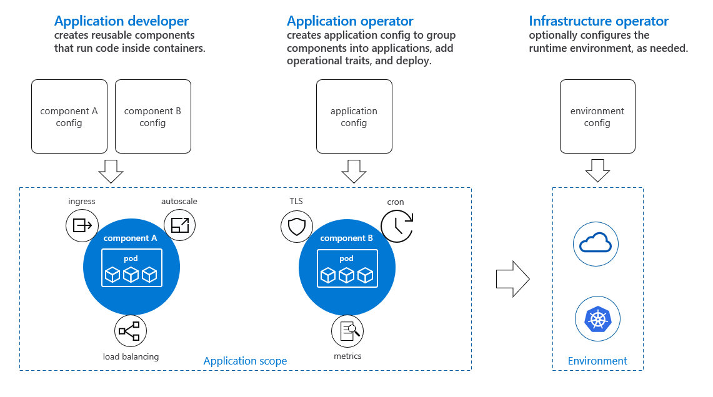
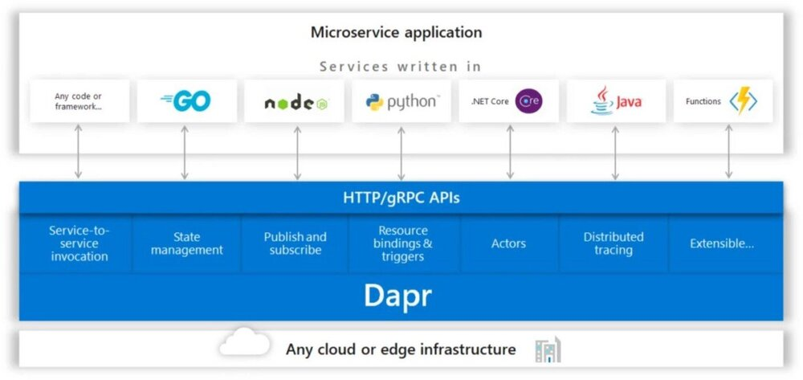

本文译自 [The Future of Cloud Native Applications With OAM and Dapr](https://hugomsbarona.medium.com/the-future-of-cloud-native-applications-with-oam-and-dapr-ed5766c8d583)。

在 2019 年 11 月 4 日至 8 日于佛罗里达州奥兰多举办的[2019 年微软 Ignite 大会上](https://www.microsoft.com/en-us/ignite)，Azure 首席技术官 Mark Russinovich 介绍了微软开发的两个创新和革命性的项目，旨在解决当今 IT 专业人士和开发人员在试图构建基于微服务的应用程序时的一系列现有问题。这场会议被命名为《基于开放应用模型（OAM）和分布式应用运行时（Dapr）的云原生应用的未来》。

## 开放式应用模型（OAM）

因此，其中一个项目与开放应用模型（OAM）有关。它代表了一个开放的标准，允许我们建立云原生应用程序，与平台无关，并遵循关注点分离的原则，通过将应用程序的定义与应用程序的部署和托管基础设施的细节分离，为我们提供一些好处。

将应用程序的定义与操作细节分开，使应用程序开发人员能够专注于其应用程序的关键要素，并将其从部署地点和方式的操作细节中抽象出来。另外，关注点的分离允许平台架构师开发可重复使用的组件，而应用开发者则专注于将这些组件与他们的代码集成，以快速、轻松地构建可靠的应用。在所有这些方面，OAM 在那些有不同角色的场景中特别有用，比如在下面的图片中，构建和管理应用程序，因为它允许你有一个关注点的分离，所以开发和管理你的应用程序的不同角色可以专注于他们任务的关键因素。

OAM 引入了几个概念，组成了你的应用程序。其中一个概念是代表你的应用程序的 Component（组件）。这些组件可能是服务，如 SQL 数据库或带有相应负载均衡器的.NET WebAPI。开发人员可以创建代码，将其打包成一个组件，然后创建清单，描述不同组件和其他应用程序之间的关系。有了这个，你就把组件的实现和这些组件如何在一个完整的分布式应用架构中结合起来的描述分开了。

为了将这些组件转化为具体的应用程序，应用程序运维使用这些组件的配置来形成一个可以被部署的应用程序的具体实例。配置资源是使应用程序运维能够从开发人员提供的组件中运行一个真正的应用程序。

最后一个概念是 Trait（特征），而你使用它们的集合来描述你的应用环境的特征和它的能力，如自动扩展和入口等等。这些特征允许你根据要求和背景，将你的应用程序部署到具有不同特征的不同环境。然后，这些特征可以由基础设施运维进行配置，以满足其环境的独特操作要求。

最后但同样重要的是，该规范在设计上是可扩展的。同样，OAM 使平台提供者能够通过 Trait（特征）系统公开其平台的独特特征，这种方式使应用开发者能够在支持必要特征的地方建立跨平台的应用。

## 分布式应用程序运行时（Dapr）

Dapr 是一个可移植的、事件驱动的运行时，它使开发人员能够轻松地建立弹性的、无状态和有状态的微服务应用程序，并在云和边缘上运行，并拥抱语言和开发人员框架的多样性。它遵循**Sidecar 架构**，所以它使用一个连接到你的每个组件的 Sidecar 节点，所以它可以扩展和增强你的应用程序的功能，如服务发现、负载均衡、流量管理等。

使用这种编程模型，开发人员能够创建微服务应用程序，而不需要携带那么多在构建分布式应用程序过程中引入复杂性的因素，如弹性、可扩展性、服务身份和发现、负载均衡、状态管理等等。Dapr 将这些复杂的因素从开发人员那里抽象出来，这样他们就可以专注于他们正在编写的代码。

Dapr 的另一个重要方面是与托管我们应用程序的平台有关。Dapr 使我们能够在云端、企业内部、甚至是边缘的多种环境中运行我们的应用程序，包括任何可用于托管应用程序的 Kubernetes 集群。

最后，同样重要的是，Dapr 允许你利用你最喜欢的编程语言来构建你的分布式应用，并克服你在现今的一些服务中可能面临的编程语言和版本的限制，以构建基于微服务的应用。

下面的图片提供了一个使用 Dapr 的微服务应用架构的概述。基本上，你使用你喜欢的编程语言或框架，如 Java、Node.js、Python、.NET Core 等，构建构成你的应用程序的服务，然后你的服务使用其可用的标准 API，并使用 HTTP 或 gRPC 协议与 Dapr 通信。

## 总结

因此，我们有 OAM，它代表了一种规范，允许你定义和建立跨平台的应用程序，在云和边缘上运行，为你提供关注点的分离，让你的团队专注于他们任务和责任的关键要素。

然后，我们把 Dapr 作为一个运行时，通过提供关注点的分离和促进一些影响构建这种应用的复杂性的因素，降低了构建基于微服务的分布式应用的复杂性。此外，Dapr 允许应用程序在 "云和边缘 "计算基础设施之间进行移植，并克服目前开发人员在构建此类应用程序时面临的移植问题。

如果你想获得与这些项目有关的更多细节，请看以下资源。

- [Mark Russinovich 介绍 OAM 和 Dapr 的云原生应用的未来](https://azure.microsoft.com/en-au/resources/videos/ignite-2019-mark-russinovich-presents-the-future-of-cloud-native-applications-with-oam-and-dapr/)
- 开放应用模式（OAM）官方网站 - <https://oam.dev/>
- 分布式应用程序运行时（Dapr）官方网站 - <https://dapr.io/>
