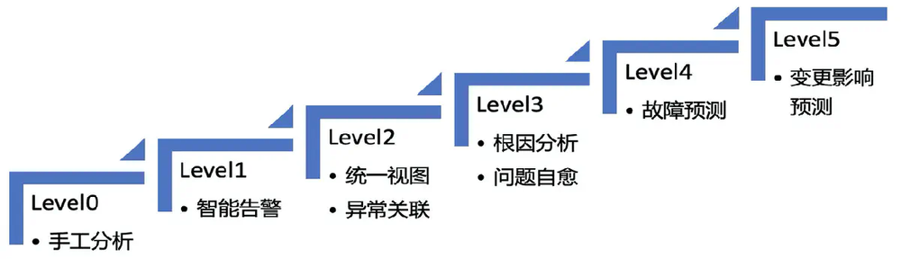
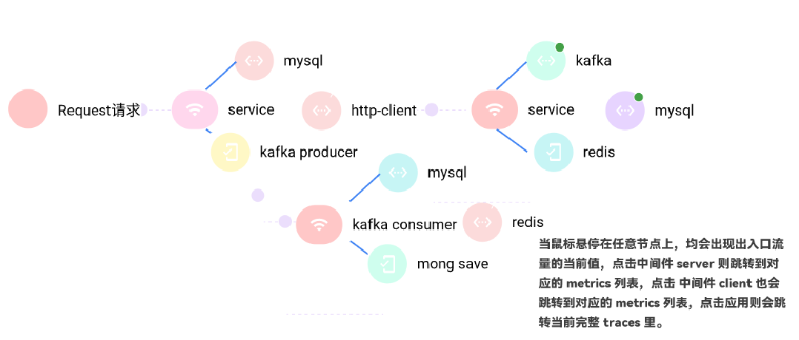
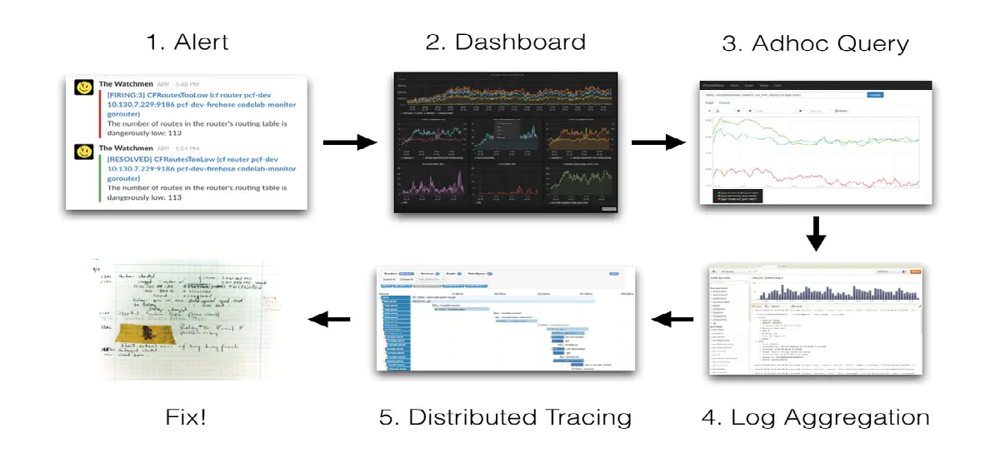
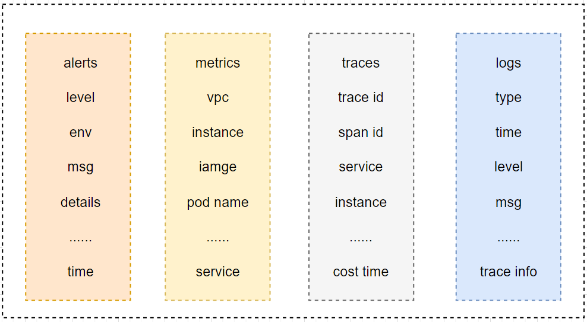
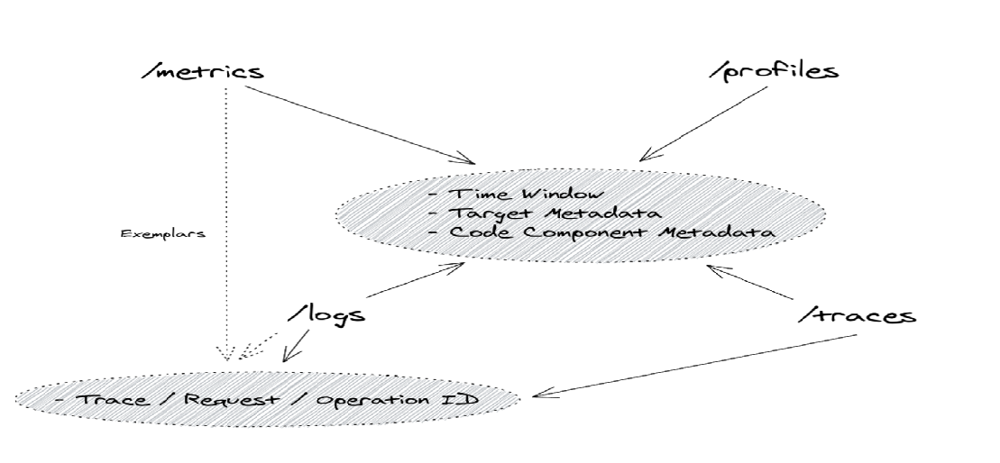
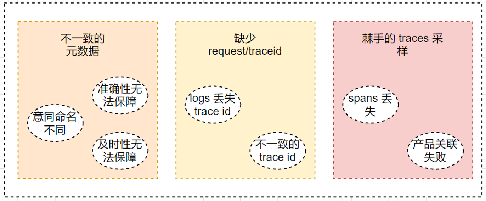
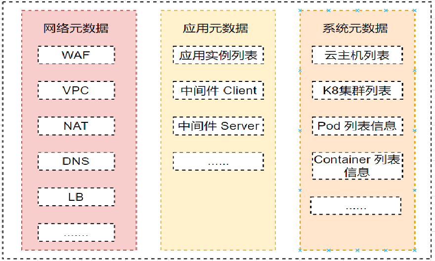
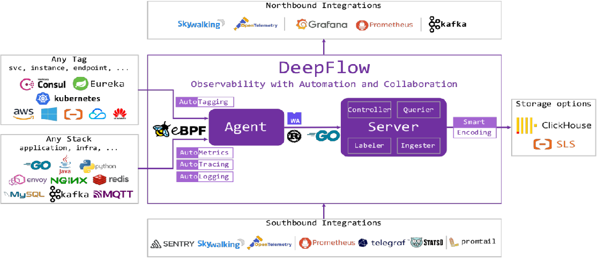

本文为云杉网络原力释放 - 云原生可观测性分享会第十一期直播实录。[回看链接](https://mp.weixin.qq.com/s/QKb1cbqfkmhtxI8rGEtLUg?vid=1688856588389646&deviceid=8b31b0c6-6d71-4c84-864b-f1d468e717a1&version=4.0.19.6020&platform=win)，[PPT 下载](http://yunshan-guangzhou.oss-cn-beijing.aliyuncs.com/yunshan-ticket/pdf/39efae2215f69da573b095259f8cd79f_20221027183747.pdf)。

大家好，我是陈晨，今天和分享的内容是《论元数据在可观测性中的重要性》，大纲为：

1. 从智能驾驶看可观测性未来发展。
2. 用开源产品构建可观测性遇到的痛点。
3. 构建内部元数据平台打通多信号关联。

那前期我们多位老师为大家分享了可观测性相关的领域知识，看到大家对**多信号之间的关联**有一些疑惑，今天来和大家聊下**元数据在可观测性多信号关联的重要性**。

## 从智能驾驶看可观测性未来发展

在此之前为大家解释下多信号的概念，该概念来源于 CNCF 可观测性 SIG 推出的《可观测性白皮书》一文中的译词，当然云原生社区也有我们翻译的中文版白皮书内容，欢迎大家去看往期的文章推送。那从白皮书里总结起来，多信号就是可观测性系统中各种用途不同但具备结构化、标准化数据的总称，例如我们常常听到的 logs，traces，metrics 等数据。

可观测性在获取到多个信号后，会将其以静态或动态的状态放置于存储内，通过多个不同状态的信号来构建属于自己的可观测性平台，以此来缩短解决错误的时间和透视化软件服务内部的黑盒状态。在这个动态过程中，让多信号之间可以紧密的配合来反馈应用程序或 IT 部署环境的实际运行状态，就是元数据开始发挥作用的时候了。

当然我们在聊元数据之前，我们先来看两张图。这两张图来源于张城老师在云原生社区 Meetup 北京站演讲的 PPT（已经征求本人同意）《云原生下的可观测性发展方向》。

上面这张图是自动驾驶分级后的表现图。我们可以看到自动驾驶依据分级可分为 6 级，其中 0 - 2 级主要还是靠人工来干预，三级后开始变得无意识起来，之后开始变得更加智能化起来。

下面这张图则是 IT 系统可观测性参考智能驾驶划分的六级图。

- 等级 0：手工分析，依靠基础的 Dashboard、告警、日志查询、分布式链路追踪等方式进行手动告警、分析，也是目前绝大部分公司使用的场景
- 等级 1：智能告警，能够自动去扫描所有的可观测性数据，利用机器学习的方式去识别一些异常并进行自动告警，免去人工设置 / 调整各种基线告警的工作
- 等级 2：异常关联 + 统一视图，对于自动识别的异常，能够进行上下文的关联，形成一个统一的业务视图，便于快速的定位问题
- 等级 3：根因分析 + 问题自愈，自动根据异常以及系统的 CMDB 信息直接定位问题的根因，根因定位准确后那边可以去做问题的自愈。这一阶段相当于是一次质的飞跃，在某些场景下可以在人不用参与的情况下实现问题的自愈。
- 等级 4：故障预测，故障发生总会有损失，所以最好的情况是避免故障的发生，因此故障预测技术可以更好的来保证系统的可靠性，利用之前积累的一些故障先兆信息做到“未卜先知”
- 等级 5：变更影响预测，我们知道绝大部分的故障都是由变更引起的，因此如果能够模拟出每个变更对系统带来的影响以及可能产生的问题，我们就能够提前评估出是否能够允许此次变更。

当然我们会有一些专业的可观测性团队已经在实践异常关联、根因分析、故障预测等能力。那我们今天以大家最常用的手工分析作为切入点来看下问题排查过程中遇到的问题。

## 用开源产品构建可观测性遇到的痛点

我们在进行案例分析前来看一个图：

熟悉的**拓扑分析**，大家一直都在考虑为用户产生一个具体的运行时应用级别的画像，可以清晰的告诉开发者我们的应用关联是怎样的，应用所依赖的中间件运行状态，我们出入口流量等。

那这样的拓扑分析其实有很很多小技巧，比如我们可以构建一个静态的应用拓扑依赖分析图，也可以构建 Request Scope 级别的运行时应用拓扑分析图。那什么叫做**静态的应用拓扑分析图**呢？

比如我们业务应用只想知道自己依赖的上下游服务和相关联的中间件的拓扑，那这种拓扑则当业务应用开始运行时就会确定，不存在有较大的改变的可能，除非在中间件 Client 做了中间件 Server 的**故障动态切换和转移**。

那相对的**动态的应用拓扑分析图**呢？就是指在 Request Scope 下的某一次请求下的应用实时拓扑分析，一般动态应用拓扑分析里面包含了运行时的一些指标数据以及关联的 Span 信息还有一些业务日志的联动。

当然具体是静态拓扑还是动态拓扑，我们都需要在某一个地方获取到这些关联关系，行业优秀产品 SkyWalking 在旧版本 DashBoard 上绘制出来的链路拓扑分析图则是依赖存储中聚合到的 Span 来构建应用的关联关系，并对关键的 RED 指标做了关联，那其实相对的这种方式对存储也会有一定的压力。

以 Grafana Loki 中介绍的一个典型问题排查过程来看：

- 我们通常因为告警而感知系统出现了运行时问题（主要是 metrics，当然会有一些历史项目使用 logs），
- 因为大盘而确定异常的模块（metrics/events）和查看一些系统性指标，
- 通过拓扑分析/链路信息定位到问题发生的具体应用（topology/traces），
- 然后通过应用运行时日志确定具体的细节（logs）。

通过多信号之间的配合完成问题的定位，有些问题的排查步骤和上述不太一致，有些许改变。但是不影响多信号之间配合发挥的重要作用。

我们将上述定位问题使用到的**信号解析到数据层面**：

- 告警：我们有基本的告警信息，包括告警内容，告警级别，告警时间以及其他一些利于定位问题的信息（行政信息、云资产信息等）。
- Metrics：不同的指标会有不同的 lables/tags，和告警可以匹配到一般是一组依据算子计算好的指标数据。Open Metrics 组织和 Prometheus 是这方面的专家，当然也有一些比较优秀的厂商在做这样的指标产品。
- Traces：各家 trace 产品大同小异，内部包含的元信息也类似。不过我们应该感谢 OTel，让这件事儿变成了标准，并让数据流管道化。
- Logs：logs 里会有一些和其他信号重复的数据，例如 service name, instance name, trace info 等。logs 的重点也会在他的 msg 内，一般供大家检索查询。当然也会有一些不需要检索的日志产品，Loki 是这方面的实践专家。

当然可观测性也是在不断的进化，会有新的信号进来和现有的多信号配合一起来透视化软件黑盒状态和加速解决问题的进度。例如大家一直都在实践的 profiles/ dumps 等。

那这些**多信号间是如何关联的**呢？我们来看下一张图：

我们依据时间来缩小问题定位的窗口，依据 多信号间共有的 元信息来关联多信号。例如：
- 我们依据  trace id 来关联 traces 和 logs 以及 metrics 的 Exemplars（是最普遍也是最有效的方式）。
- 我们依靠埋点的 service name，instance name，span id 或者其他元信息来关联到更细节的信号（例如我们指标和指标之间的关联通过 labels/tags 中重复的元数据，业务日志通过应用信息关联到 K8s Pod metrics）。

这些元信息里面包括 私有云，公有云的实例信息，容器的运行时信息，应用的列表信息，中间件的连接信息，业务自埋点的信息等。但是这样我们一定就能够做到无缝连接了吗？

我们来看下**多信号关联的难点**：

1. **不一致的元数据**：我们能看到多信号关联的重点在于存在同样的元数据，但是其实垂直领域下现阶段我们使用的各家产品在元数据层面并没有达到一致，包括统一产品在不同版本迭代中也会出现 意思相同命名不同的现象，造成准确性和及时性无法保障。
2. **缺少 trace info**：logs, metrics, traces 关联过程最简单也是最高效的方式是通过 trace info 被打点在各个信号中，然后依据 trace info 去将多信号进行关联。但是如果应用级的 trace 中丢失了 span infos，那将会是一个灾难。
3. **糟糕的采样**：采样是一个极具争议的话题，一方面会降低存储压力，但是一方面又会影响产品功能的完整性。
4. **缺失的元数据**：我们想从系统层面关联到应用层面，继而再通过网络关联到其他的系统层面以及网络层面，当缺失了某些元数据，对于可观测性系统来说将是灾难性的，对产品的功能有极大的影响。

当然，依据多信号内的元数据不能做到 100% 的高度关联，还需要做一些其他的工作来辅助和补充元数据，以此来大幅度提升可观测性的能力。比如统一具备**通用性的元数据**打入到我们的多信号内，以此来**增强多信号关联性**。但是因为打入在多信号中的元数据愈发变多，存储的压力及繁琐的工作也常常会让我们头痛。

## 构建元数据平台打通多信号关联

那基于此，如果我们要构建一个健壮的可观测性平台，在这个过程中遇到的散落在各地的元数据，我们应该将他组织并利用起来，以此站在更高纬度的视角去观测我们的系统（当然元数据平台的功能不止于此）。

依据维基百科中元数据的定义：元数据被定义为提供某些资料单方面或多方面信息的资料，被用来概述资料的基础信息，以简化查找过程与方便使用。

IT 基础设施的元数据构建我们可以考虑以下几点：

- **网络级别的元数据**：包括我们使用的网络设施的基础数据和实际运行时挂载的运行时元数据。
- **应用级别的元数据**：包括我们业务应用列表信息和应用关联的中间件的连接元数据信息及中间件自身的元数据。
- **系统级别的元数据**：包括我们主机列表信息以及虚拟化容器化之后的动态元数据信息。

当然构建这样的系统可能是一件需要持续做下去的事情，但是构建这样的元数据平台对于基础设施建设和 IT 可观测性的重要性不言而喻。那可能有人会问，我们这里的元数据和运维侧的元数据平台的区别是什么呢。

一些公司内部可能会构建属于自己运维侧的元数据平台，那根据过往经验内部包含的则是一些资产信息和管理信息。我们这里的元数据平台将其归纳到系统级元数据内，并对其做了一定的补充，包括应用级元数据、网络层元数据等，但其实还缺少了行政级元数据。如果有了这样齐全的元数据信息后，这样我们做到什么能力呢。

1. 精准的告警直达某业务线某小组内某应用的主要开发者、测试人员和负责人，而不是告警泛滥。
2. 精准的告警直达某中间件中的某表或某队列、某交换机，继而转发至对应团队、对应负责人来处理。
3. 准确的关联关系构建，细粒度的产品角度去为不同问题筛选出不同的可观测性视角，而不是千篇一律的 DashBoard（举例 Grafana 的筛选栏）。
4. 完整的关联关系、准确无误的为高阶可观测性系统能力做铺垫，例如根因分析、错误自愈、缩容扩容自动化等。

当然，急剧扩充的元数据会让可观测性多信号的数据暴涨，也会带来一些其他的问题，那这些问题该如何解决呢，请**关注我们下期的直播内容**。

## 总结

那其实我们今天讲的蛮浅的，从**智能驾驶来看可观测性的发展**作为引入，然后我们依据一个案例来分析在这个过程中，我们**使用开源产品遇到的多信号关联的挑战**，继而引出了我们构建一个这样的**元数据平台**，并且需要**维护什么样**的数据作为结尾，最终我们聊了下构建出这样的元数据平台为我们可观测性平台**带来了什么样的价值**。

那构建 IT 的可观测性是一件复杂而又重要的事情，元数据为**多信号之间关联**和**产品的健壮性**带来了重要的作用。当然 OTel 为这项工作带来了不少便利，但是还会有更多的挑战在等着我们！

最后重点来啦，**DeepFlow** 作为新时代的高度自动化的可观测性平台，将为大家带来意想不到的能力。

大家对我们的产品的第一印象可能是 使用了 eBPF，但是我想告诉大家的是，我们产品**不仅仅使用了一些炫酷的技术**，也会有比上述更加炫酷的**类似元数据平台的功能**，并且对比其他产品具备**无侵入的高度观测能力**、炫酷的 AutoTagging 技术和**大幅度降低存储压力**的 SmartEncoding 能力等优点，欢迎大家关注我们的 Github 和公众号来了解更多。

当然刚才提到了，后面几期我们会有专题来介绍 AutoTagging 和 SmartEncoding 能力，欢迎大家预定后面的直播。

访问 [DeepFlow Online Demo](https://ce-demo.DeepFlow.yunshan.net/)，体验高度自动化的可观测性新时代。

## 参考：
1. [云原生下的可观测性发展方向](https://cloudnative.jimmysong.io/blog/cloud-native-observability/)
2. [维基百科中的元数据的定义](https://zh.wikipedia.org/wiki/%E5%85%83%E6%95%B0%E6%8D%AE)
3. [百度百科中的元数据的定义](https://baike.baidu.com/item/%E5%85%83%E6%95%B0%E6%8D%AE/1946090)
