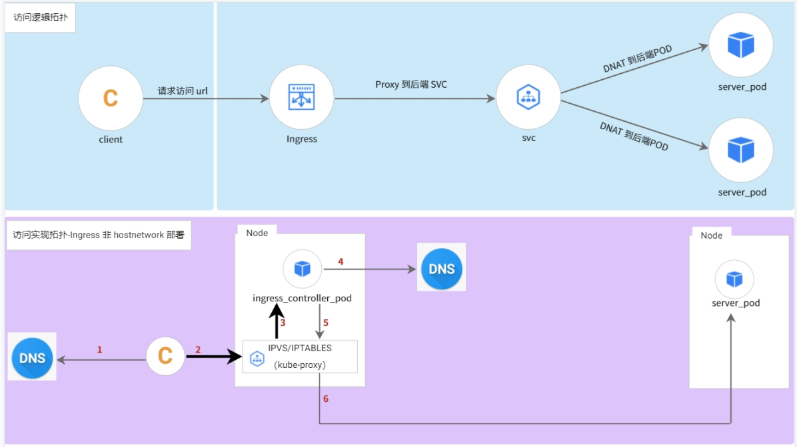
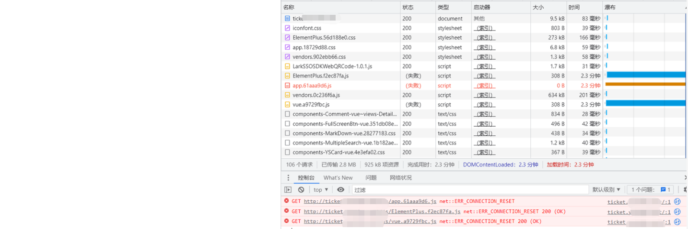
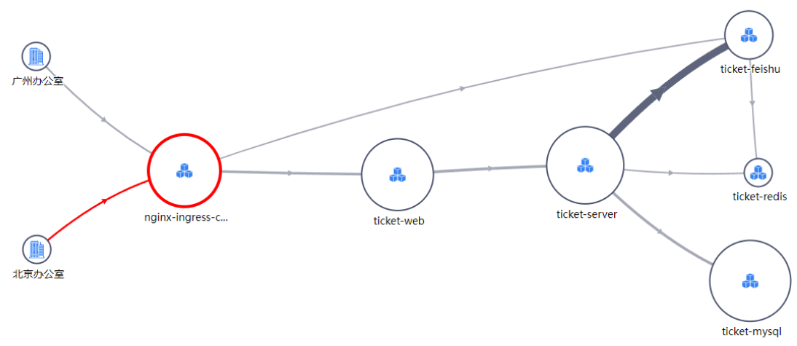
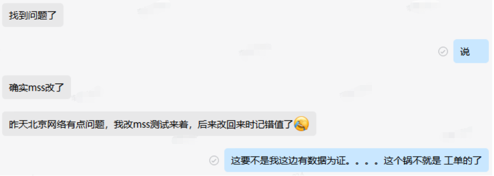

故障发生在2023春节前两天，DeepFlow 团队内部访问工单系统出现问题，影响了所有北京区的同事，这篇文章将详细记录如何利用 DeepFlow 定位到对这次问题根因（网关 MSS 误变更导致报文大于 MTU，大数据报文被丢弃）。

## 背景介绍

工单系统是 DeepFlow 团队自主研发的一个跟踪工单的内部工具，部署在阿里公有云的容器服务（ACK）中，工单系统通过 Ingress 的方式对外提供服务，办公区与阿里云通过 VPN 连接，因此办公区可以直接使用域名访问工单系统。在[《K8s 服务异常排障过程全解密》](https://deepflow.yunshan.net/blog/020-k8s-service-exception-troubleshooting/)文中对 K8s 访问方式做过总结，工单系统是比较典型的`方式三`的访问形式

下图是通过 DeepFlow 自动绘制的访问拓扑图，可以看出北京和广州办公区都是通过 Ingress 的形式来访问工单的入口服务 (ticket_web)。工单系统部署在基础服务的容器集群上，此容器集群所有的 Node 上都已经部署了 deepflow-agent，因此可以自动采集所有 POD 及 Node 的网络/系统/应用相关的数据，其中就包括阿里云 nginx-ingress-controller 服务对应的 POD 以及应用的 POD

## 排障过程

下午 3:00 左右，陆续收到同事反馈，工单系统加载不出来，首先和工单系统研发明确，并未做过任何变更

依据[《K8s 服务异常排障过程全解密》](https://deepflow.yunshan.net/blog/020-k8s-service-exception-troubleshooting/)总结的思路

查看了对应的 `Node/POD` 负载、状态等都正常；登录到 DeepFlow 平台，调出了工单系统的访问拓扑（拓扑上标红部分表明有异常），从访问拓扑可知`后端服务`黄金指标也都一切正常；又通过图可看出来广州办公室对工单系统的访问也并没有异常（也同步与广州同事确认，访问一切正常），可推测 `DNS/SVC` 也应该都正常；进一步结合拓扑图，**可看出异常仅出现在北京办公室与 nginx-ingress-controller 之间**。

**继续分析标红的路径**，查看对应的流日志，因为云下未部署采集器，因此仅支持查看的是 nginx-ingress-controller POD 以及 Node 的数据，发现了几个问题：
- 服务端异常都是因为`传输-连接超时`导致的
- 服务端异常时，服务端 (nginx-ingress-controller) 回复的数据包，都是大包
- 服务端异常时，服务端 (nginx-ingress-controller) 都未收到任何客户端发送的数据

**结合以上几点发现，怀疑方向转移到 MSS/MTU 上**，立马咨询了 IT 同事，是不是变动过网关的 MSS/MTU 值，IT 同事否认了

**既然云下部分未变动过，转而怀疑是不是 nginx-ingress-controller 动过 MSS/MTU**，通过`时序图`查看 MSS 是否有变化，通过故障前后对比可知：
- 客户端在故障前后发送的 MSS 确实发生过变动，从 1280 变为了 1380
- 服务端 (nginx-ingress-controller) MSS 值一直未变动过

通过数据可明确，云下一定变动过 MSS 值，拿着数据截图又去找 IT 同事，最后 IT 同事一顿找，**明确改了 MSS 值**，将 MSS 值恢复后，工单系统恢复正常

## 问题总结

问：**MSS 值变动了，为什么影响了工单系统**
- 因为云下的 MTU 值设置的是 1420，如果 MSS 值为 1380 + 报文头则会大于 MTU 值，因此大数据报文无法通过云下的网关，这就导致了 nginx-ingress-controller 收不到任何客户端的回应（客户端也未收到服务端的包）出现`传输-连接超时`的情况

问：**MSS 值变动了，为什么其他内部系统未受到影响**
- 工单描述中包含了大量的图片和文件，因此存在传输大数据的情况，而其他系统大部分都是文字传输，所以未受到明显影响
- 其他如 gitlab 存在图片和大文字传输的服务，并未使用 Ingress 的方式对外提供访问形式，而是利用阿里云 Terway 提供的内网直接访问 Headless 服务后端 POD 的方式，在协商 MSS 值时，后端 POD 的值为 1360（nginx-ingress-controller 的值为 1460），因此最终协商的取 1360 + 报文头则小于 MTU 值，所以也未受到明显影响

## 什么是 DeepFlow

[DeepFlow](https://github.com/deepflowys/deepflow) 是一款开源的高度自动化的可观测性平台，是为云原生应用开发者建设可观测性能力而量身打造的全栈、全链路、高性能数据引擎。DeepFlow 使用 eBPF、WASM、OpenTelemetry 等新技术，创新的实现了 AutoTracing、AutoMetrics、AutoTagging、SmartEncoding 等核心机制，帮助开发者提升埋点插码的自动化水平，降低可观测性平台的运维复杂度。利用 DeepFlow 的可编程能力和开放接口，开发者可以快速将其融入到自己的可观测性技术栈中。

GitHub 地址：https://github.com/deepflowys/deepflow

访问 [DeepFlow Demo](https://deepflow.yunshan.net/docs/zh/install/overview/)，体验高度自动化的可观测性新时代。
