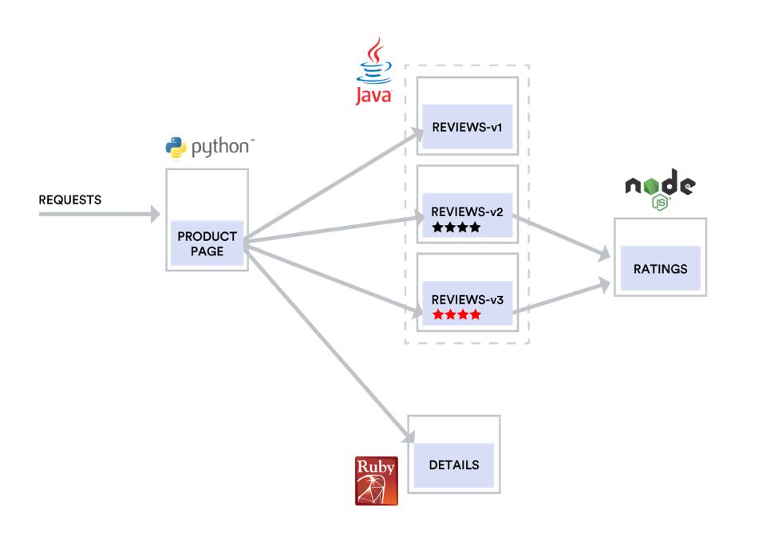
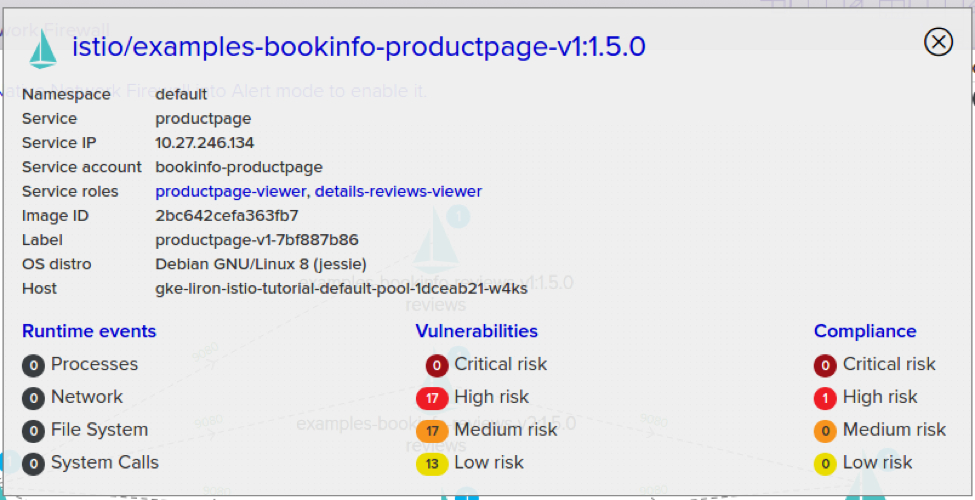
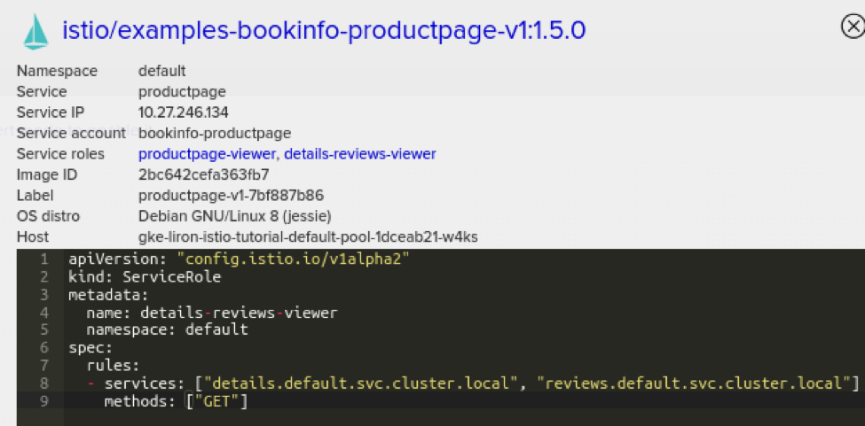
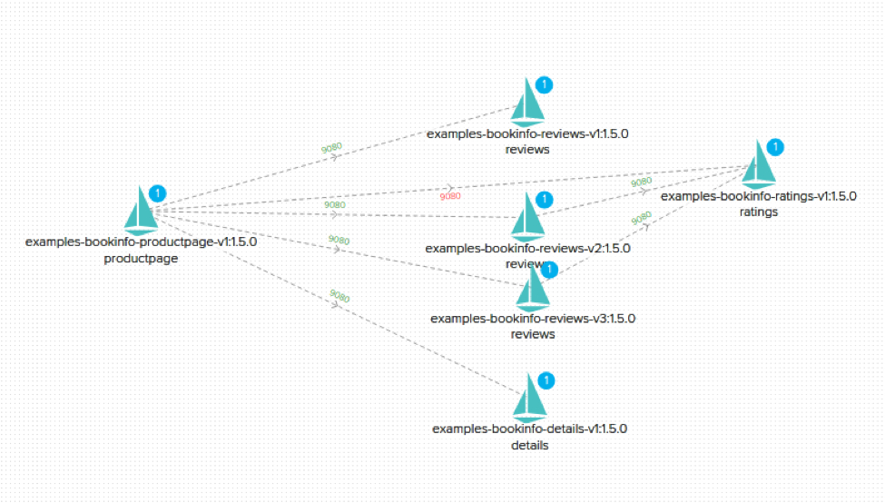

本文为翻译文章，[点击查看原文](https://thenewstack.io/twistlock-makes-istios-security-layer-more-robust-easier-to-monitor/)。

Istio 已经成为一种流行且可靠的服务网格管理平台，使用它可以更轻松地部署、操作和扩展跨云部署的微服务。作为保证这些服务网格的一种方式，Twistlock 已经与 Istio 集成，以丰富平台的连接机器学习功能。Twistlock 通过使用 Twistlock 数据来隔离受损服务并提供合规策略来执行安全配置，以及 Istio 运行的其他堆栈。

随着云原生成为构建和运行现代的基于 Web 的大规模应用程序的默认方式，组织需要越来越复杂的工具来将基本复杂性从日常操作中抽象出来。Kubernetes 显然是编排调度军备竞赛的赢家，并且已经提炼出了管理大型计算节点的复杂性。但是，由于 Kubernetes 可以实现更大规模的部署，因此我们可以利用其平台级别原语的配套技术使管理大型服务组合变得更简单。

例如，使用 Kubernetes 您可以轻松部署应用程序并将其扩展到 1000 个节点的集群，并处理部署和节点故障。但是，为该服务路由流量、监控服务的整体运行状况（而不仅仅是单个节点和 pod）以及确保该服务与集群内其他服务之间的公平资源分配可能很复杂。

[Istio](https://istio.io/)是一个旨在补充 Kubernetes（和微服务平台）并提供上述功能的项目。更具体地说，Istio 旨在为微服务提供流量管理、服务标识、管理策略实施和遥测。

Istio 是围绕托管在[云原生计算基金会（CNCF）](https://cncf.io)的开源项目[Envoy proxy](https://www.envoyproxy.io/) 而构建的项目。Istio 建立在现有 Kubernetes 能力的基础上，使部署更加集成，同时提供超越 Kubernetes 基础设施所关注的各种增值服务。

在过去的几个月中，我们的客户越来越多地询问 Twistlock 关于 Istio 的计划，今天我们很高兴分享这些细节。Istio 是一个复杂的平台，具有多种配置选项和安全设置，在处理所有细节时很容易迷失。

尽管开始运行 Istio 非常简单，但能够了解流量流，实施安全最佳实践以及（可能最重要的）利用 Istio 提高应用安全性的能力是我们关注的重点领域。

## 示例场景

为了探索 Twistlock 提供的新安全功能，我们将使用大家耳熟能详的[Bookinfo](https://istio.io/docs/guides/bookinfo)示例应用程序。如指南中所述，此应用由多个互连的微服务组成：

- `productpage`微服务调用`details`和`reviews`微服务来填充页面;
- `details`微服务包含书籍信息;
- `reviews`微服务包含书评。它也称为`ratings`微服务;
- `ratings`微服务包含伴随书评的书籍排名信息。

该应用程序的拓扑结构如下所示：

## 可视化和控制雷达视图上的 Istio

我们在使用 Istio 的客户中意识到的第一个挑战就是可视化服务的拓扑结构。尽管 Twistlock 一直提供雷达视图来为您的整个容器化环境提供实时 Visio，但 Istio 允许我们以更多的应用特定知识和深度进一步增强这些数据。

**Istio 的主要安全优势之一是严格控制的网络策略——即严格控制通信协议和实体之间的连接。**为此，建议在 Istio 中启用[服务级别访问控制](https://istio.io/docs/tasks/security/role-based-access-control/)。在 Twistlock 中使用此功能时，您可以直接在雷达的可视化界面中获得对网络拓扑的完全可视性和控制。

例如，在 Bookinfo 示例中，`productpage`服务具有一个绑定到`productpage-viewer`的`product-viewer`角色和一个`details-reviews-viewer`服务角色。

第一个角色表示所有用户都可以访问产品页面，而第二个角色是为产品页面明确设置的，并且只允许访问 details 和 ratings 服务。

Twistlock 会自动注册整个配置，以便动态更新并注释到每个服务的 Radar 界面上：

此外，单击服务角色时，可以查看每个角色的详细信息：

使用 Twistlock，我们可以编辑和管理与给定实体关联的所有安全设置，并查看 Istio 管理服务网格拓扑中反映的更改。

## 利用 Istio 进行运行时隔离

我们还把运行时防御传感器与 Istio 集成在一起，通过分析实体间允许的连接和基础架构元数据，在覆盖拓扑中添加深度安全智能。我们利用这些数据，根据网络元数据和观察到的行为异常来提供报告和隔离实体。

例如，如果在 Bookinfo 应用程序中，攻击者成功过的破解了`productpage`服务并从那里访问`ratings`服务，那么会发生什么？从技术上讲，如果所有网格规则配置正确，Istio 网络策略可能会阻止连接，但您仍然需要关注日常的检测和警告，这是通过 CNNF（我们 L3 云原生网络防火墙）与 Istio 集成：

当然，这些网络违规也会在雷达中报告和显示：

该流程中将利用 Twistlock 的 ML 驱动的行为建模来自动检测异常情况，随后让 Istio 关闭该服务的响应以隔离受损的服务。

例如，Twistlock 可以在检测到异常时通过指示 Istio 断开该服务与后端支付数据库的连接以隔离面向公众的 Web 服务。由于此集成发生在服务网格层，因此 Istio 可以即时并优雅地在整个环境中执行它，而无需更改 IP 路由或手动重新配置端口。

## Istio 合规

最后，我们的 Twistlock Labs 研究团队已经为 Istio 开发了一系列新的合规性检查。这些合规性检查与 Istio 项目和社区中的现有最佳实践保持一致，例如确保在生产 namespace 中启用相互 TLS，并启用严格的基于角色的访问控制（RBAC）。这些合规性策略符合 Twistlock 现有的合规性功能，包括出现不合规情况时的提醒和阻止的能力，以及在 Compliance Explorer 仪表板中实时查看全局状态。

## 总结

随着客户部署和运行的云原生应用程序越来越复杂，像 Istio 这样的平台补充了 Docker 和 Kubernetes 的现有功能，为每个客户提供行星际尺度的工具。Twistlock 通过为 Istio 添加一个安全层，并利用它来扩展整个服务网格的安全性，有助于扩展 Istio 的适用范围。

------

**关于 Twistlock**：[Twistlock](https://www.twistlock.com)通过先进的智能和机器学习功能，保护当今应用免受未来的威胁，并自动制定政策和执行。作为第一个端到端的容器安全解决方案，Twistlock 专门用于提供现代化的安全性。
