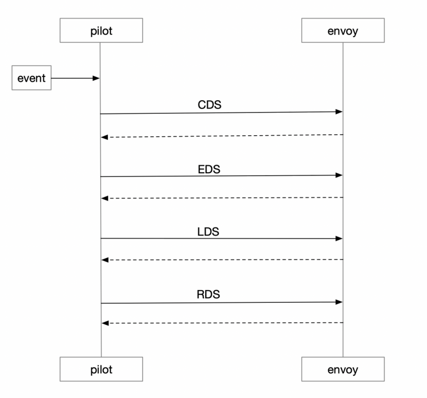
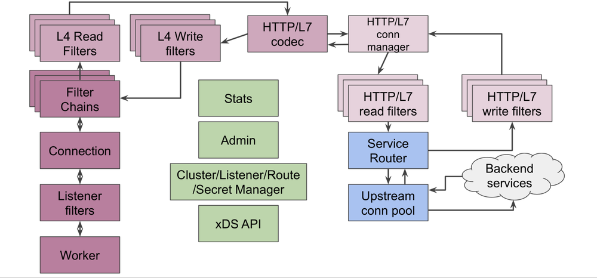
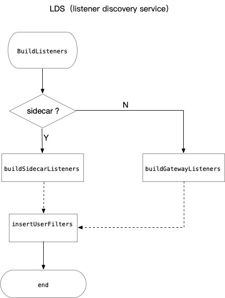
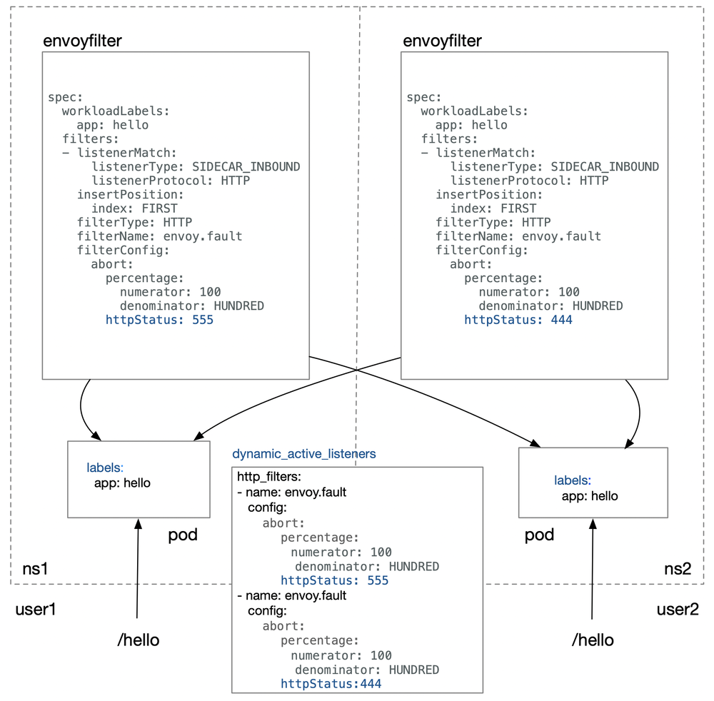
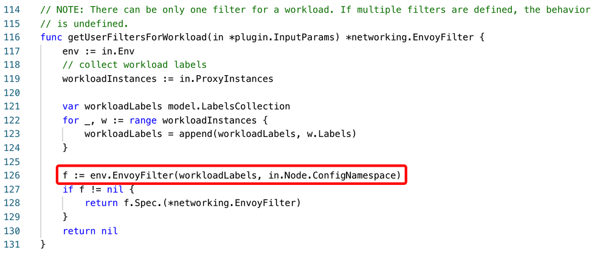
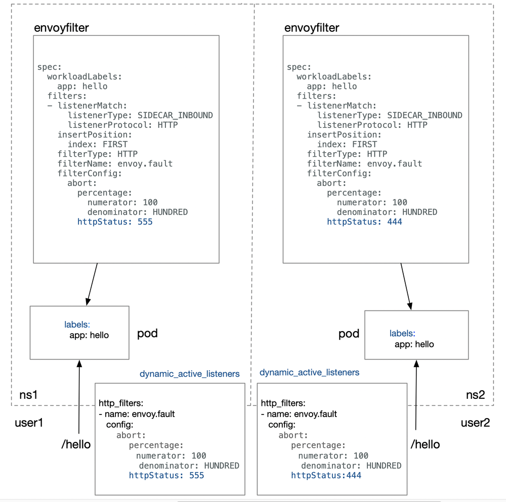

KUN（中文名鲲）是 UCloud 面向内部的基于 Kubernetes 的资源交付平台，提供监控告警、CI/CD、网络双栈、Service Mesh 等能力。在践行 Service Mesh 理念的过程中，面对 Istio 的不足，团队针对其源码做了大量改进，包括给网络子系统 Pilot 下的资源做隔离，对 EnvoyFilter 做深度优化等，使其能在生产环境稳定运行，并提供强大的扩展能力。截止目前，KUN 平台上已有 175 个应用通过 Istio 提供服务。下面将分享我们在这方面的实践经验。

## Istio 流量管理策略

Istio 中的流量管理策略是通过 Pilot 统一管理下发给 Envoy 的，Envoy 作为数据面，对外提供 XDS 接口。为了保证最终一致性，Pilot 实现了 Envoy 提供的 ADS(Aggregated Discovery Service) 接口，执行顺序为：CDS, EDS, LDS, RDS。Pilot 本身是无状态的，所有的资源配置全部以 CRD 实例的形式保存在 Kubernetes 集群上，Envoy 和 Pilot 连接建立完成以后，Pilot 以事件通知的形式触发推送，Envoy 配置更新生效。



统一的配置管理简化了运维成本，同时也意味着定制化能力的缺失。享受 Pilot 通用配置管理所带来的便利化的同时，又要针对具体的 sidecar 流量管理做微调，如何才能做到两者兼顾呢？这就涉及今天要介绍的主题：EnvoyFilter

## Envoy 架构

EnvoyFilter 是 Istio 中自定义的一种网络资源对象，用来更新配置 Envoy 中的 filter，为服务网格控制面提供了更强大的扩展能力，使 Envoy 中 filter chain 具备自定义配置的能力。

我们先来看下 Envoy 的整体架构：



从上图中我们可以看到 Envoy 中包含两种类型的 filter:L4 filter(即 network filter) 和 L7 filter。EnvoyFilter 中可以自定义配置的 filter 即为这两种 filter。从下面的监听器配置可以看到具体的 filter 所处的位置。

```yaml
listener:
  filter_chains:
  - filters:  // L4 filter
    - name: {L4-filter-name}
    - name: envoy.http_connection_manager
      config:
        http_filters: // L7 filter
        - name: {L7-filter-name}
```

[L4 filter](https://www.envoyproxy.io/docs/envoy/latest/configuration/listeners/network_filters/network_filters#config-network-filters)主要包括：HTTP connection manager, MySQL proxy, Rate limit, RBAC, Redis proxy, TCP proxy 等。[L7 filter](https://www.envoyproxy.io/docs/envoy/latest/configuration/http/http_filters/http_filters#config-http-filters)是 L4 filter 中[HTTP connection manager](https://www.envoyproxy.io/docs/envoy/latest/configuration/http/http_conn_man/http_conn_man#config-http-conn-man)下面定义的 filter, 主要包括：CORS, External Authorization, Fault Injection, Health check, JWT Authentication, Lua, Rate limit, Router 等。无论 L4 还是 L7 的 filter 都是按照指定的次序执行，istio 中使用的 istio-proxy 也是在 envoy 的基础上额外编译进了 istio_authn，mixer 等 filter，以实现 istio 中的 policy 和 telemetry 等功能。

## 更近一步：EnvoyFilter 案例分析

假设现在有一个需求，在调用 REST 接口时候如果 header 中含有 k/v 为“foo:bar”的请求要求返回 444。那么我们可以通过 EnvoyFilter 实现，在 sidecar 的 inbound 链中修改监听器配置，在 http_connection_manager 的第一个位置插入 envoy.fault 这样一个 filter。

```yaml
apiVersion: networking.istio.io/v1alpha3
kind: EnvoyFilter
metadata:
  name: simple-envoy-filter
spec:
  workloadLabels:
    app: helloworld
  filters:
  - listenerMatch:
      listenerType: SIDECAR_INBOUND
      listenerProtocol: HTTP
    insertPosition:
      index: FIRST
    filterType: HTTP
    filterName: envoy.fault
    filterConfig:
      abort:
        percentage:
          numerator: 100
          denominator: HUNDRED
        httpStatus: 444
      headers:
        name: foo
        exactMatch: bar
```

配置完成后我们看下 XDS 接口生成的动态监听器配置：

```yaml
dynamic_active_listeners:
- listener:
    filter_chains:
    - filters:
        - name: envoy.http_connection_manager
        config:
          http_filters:
          - name: envoy.fault
            config:
              abort:
                percentage:
                  denominator: HUNDRED
                  numerator: 100
                httpStatus: 444
              headers: 
                name: bar
                exactMatch: foo
          - name: istio_authn
          - name: mixer
```

我们可以看到 envoy.fault 添加到了 envoy.http_connection_manager 这个 L4 下面的 http_filters 链中第一条规则，符合预期，同时请求结果生效。
EnvoyFilter 的更多具体配置可以参考[社区](https://istio.io/docs/reference/config/networking/v1alpha3/envoy-filter/)

## 追本溯源：缺少隔离

了解 EnvoyFilter 的基本使用之后，我们将深入分析 Pilot(1.1.2) 源码，来探究 EnvoyFilter 的工作原理和隔离性不足的根源。下图展示了构建 Envoy 监听器的主要工作流程。



insertUserFilter 是在监听器配置完成之后执行的，用于向 envoy filter chain 中插入用户自定义的 filter。insertUserFilter 会调用下图中的 getUserFiltersForWorkload 函数，在整个集群范围内查找满足条件的 EnvoyFilter，把获取到的 filter 合并后插入到监听器的 filter chain 中。

```go
func getUserFiltersForWorkload(in *plugin.InputParams) *networking.EnvoyFilter {
    env := in.Env
    // collect workload labels
    workloadInstances := in.ProxyInstances

    var workloadLabels model.LabelsCollection
    for _, w := range workloadInstances {
        workloadLabels = append(workloadLabels, w.Labels)
    }

    f := env.EnvoyFilter(workloadLabels) // 集群范围查找
    if f != nil {
        return f.Spec.(*networking.EnvoyFilter)
    }
    return nil
}
```

这就会产生一个严重的问题。因为用户之间的行为是不可感知的，在集群范围内查找 EnvoyFilter 会导致用户行为的不可控，什么意思呢？让我们通过下图来具体说明：



如果图中的两个用户 user1 和 user2，分别在对应的 namespace 下面部署两个具有相同标签的 pod，绑定不同的 EnvoyFilter，返回码应该分别为 555（user1）和 444（user2）。但 user2 访问/hello 得到的最终返回码是 555，与预期 444 不符，其行为被 user1 干扰了。
原因就在于缺少 namespace 级别的隔离。

### 解决：namespace 级别隔离

EnvoyFilter 为什么不做 namespace 级别的隔离？针对这个问题，笔者曾向 istio 社区寻求答案，但没有得到合理的答复。基于此，KUN 团队针对 istio1.1.2 中 EnvoyFilter 做了 namespace 级别的隔离，使其影响范围控制在单一的 namespace 下，让普通用户具备可以修改 envoy filter chain 的能力而不会相互干扰。


下图我们可以看到 EnvoyFilter 的作用域被控制在了 namespace 级别


截止目前为止，KUN 平台上共有 175 个应用通过 Istio 提供服务，除了 EnvoyFilter，KUN 同时针对其他网络资源也做了严格的隔离，以此来保证不同用户的服务的稳定性。基于此，不同用户可以根据具体需求在自定义 namespace 下创建 EnvoyFilter，为自己的服务做功能扩展。

## 持续改进：校验

除了隔离之外，如果用户在 EnvoyFilter 中配置的 filter 没有被编译进 Envoy，那么 Pilot 下发给 Envoy 的配置会直接导致 Envoy 出错，如下。

```text
[2019-08-08 02:03:44.048][19][warning][config] [external/envoy/source/common/config/grpc_mux_subscription_impl.cc:73] gRPC config for type.googleapis.com/envoy.api.v2.Listener rejected: Error adding/updating listener(s) 172.17.0.13_80: Didn't find a registered implementation for name: 'envoy.filters.unknown'
```

KUN 团队为了提升整个服务网格的容错性和可用性，对 EnvoyFilter 的创建做了进一步的校验，这涉及到 istio-galley。
istio-galley 的作用之一是实现了 kubernetes 中 validating webhook 的功能，用户在创建 EnvoyFilter 的时候 apiserver 会调用 istio-galley 做校验，如果校验失败则直接返回，该实例不会持久化到集群。于是我们修改了 istio-galley 源码，将 Envoy 中的原生支持的 filter 及 istio-proxy 编译的 filter 作为基准进行校验。

\# kubectl create -f

```yaml
apiVersion: networking.istio.io/v1alpha3
kind: EnvoyFilter
metadata:
  name: network-filter
spec:
  workloadLabels:
    version: v1
  filters:
  - listenerMatch:
      listenerType: SIDECAR_INBOUND
      listenerProtocol: HTTP
    insertPosition:
      index: LAST
    filterType: NETWORK
    filterName: envoy.filters.unknown
    filterConfig:
      key: value
```

此时，我们可以看到错误的配置直接被拦截在创建时

```text
Error from server: error when creating "networkfilter.yaml": admission webhook "pilot.validation.istio.io" denied the request: configuration is invalid: envoy filter: unknown
```

## 总结

Service Mesh 将基础设施下沉，使上层业务只专注于业务本身，在云原生领域具有广阔的应用前景。KUN 团队很早开始跟进 Service Mesh，早在 Istio1.0 版本之前就已在内部试用。团队将始终致力于改革 UCloud 内部研发流程，提升研发效率，并协同社区一同完善 Service Mesh 功能。同时也很欣喜地看到，我们此前做的一些改进工作，如支持 IPv6 环境、资源隔离等，在 Istio 后续版本中也陆续开始支持。

