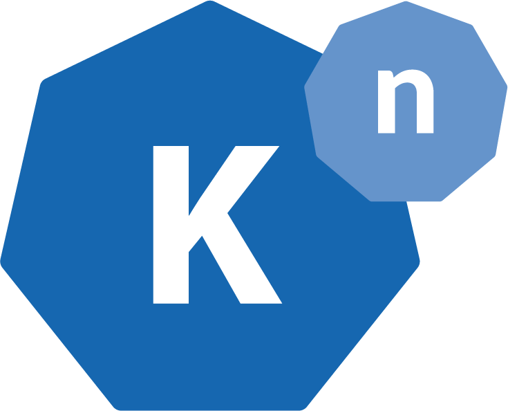
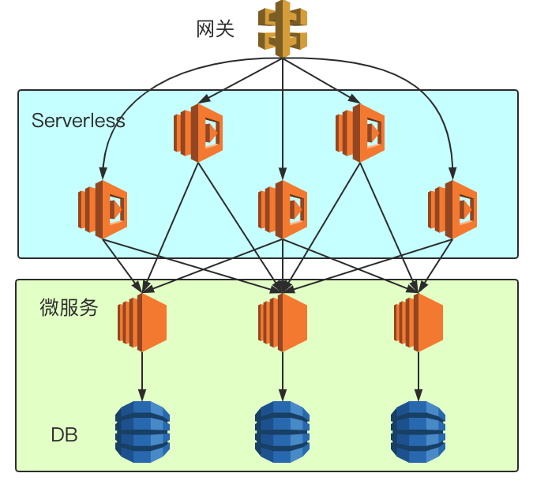
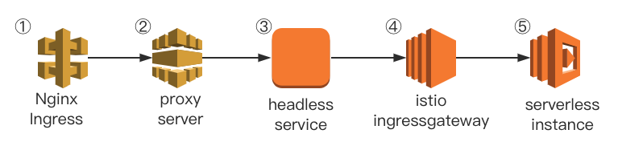

## 前言

在 2019 年的今天，微服务这个词相信对于绝大多数的开发者都已经不再陌生。时至今日，非常多的项目都逐渐开始实践起微服务这一设计思想，将原本的磐石应用逐渐按照领域模型切分成一个个小的服务，对于微服务的实践也日渐趋向于成熟。在笔者目前工作的业务实践中，同样也使用着微服务作为后端服务的架构设立思想，微服务为我们的代码管理与项目管理带来了非常大的简便性。然而随着需求的迭代与代码的日益积累，曾经泾渭分明、代码精简的各个微服务也逐渐开始变得逻辑复杂、代码冗余，同时每个微服务之间有似乎存在着剪不断理还乱的关系。2019 年是 Serverless 蓬勃发展的一年，作为 Serverless 领域的中的明星产品，Knative 在今年 8 月份发布了 0.8 版本，其中 Serving 组件的 0.8 版本在笔者看来才真正达到了可用的程度。本篇文章将介绍笔者是如何使用 Knative 来作为 API 聚合层，来解决我们在实践微服务中所遇到的问题的。

## 微服务迭代之痛

在笔者目前的工作实践中，我们在架构设计中严格遵循着微服务的设计理念。每块业务上独立的领域作为一个微服务，每个微服务有自己单独的数据库。任何一个微服务只能读写自己的数据库，而绝对不能干涉其他微服务的数据库，所有微服务之间获取信息都是通过 http 协议进行通信。在业务初期时，由于产品处于雏形中，所有服务的接口在逻辑上都比较简单，大部分接口都可以看做各自领域模型上的增删改查形态，服务与服务之间的调用也并不密集频繁。随着业务的持续发展与产品的迭代，大大小小、许许多多的功能需求交织重叠在一起，相应的各个服务直接服务于需求的接口也逐渐变多，每个接口越来越“需求相关”。并且我们逐渐发现随着需求的逐渐复杂，每个接口涉及的服务也越来越多，很难有一个强有力的理由去确定这个接口就必须放在某个服务里。这个时候将这个接口放在哪个服务里面，往往取决于做这个需求的开发对哪个服务的掌控力更强，或者说这个接口看上去更倾向于哪块业务领域。同时由于大大小小的“需求相关”的接口越来越多的堆积在各个微服务内以后，整个服务仓库的代码量逐渐增大，代码质量也逐渐下降、微服务仿佛变得不再那么“微”。

## Serverless

Serverless，又或者说无服务器、Faas，几乎是 2019 年内整个云原生领域甚至是整个互联网技术圈领域内呼声最旺的关键字。当然 Serverless 并非只是在 2019 年才开始出现相关的技术，早在 2014、2015 年的时候，AWS 就已经在各个文章、博客渠道上就已经开始宣传与推广自家的 AWS Lambda 服务了。当然，在如今 2019 年，国内的各个云服务厂商也都已经开始提供了成熟的 Serverless 产品，整个云原生开源社区内各个 Serverless 产品技术也逐渐走向成熟，同时 Serverless 这一技术落地的场景比起过去几年也越来越清晰、边界也越来越广。如同今年 Kubecon 上越来越多关于 Serverless 的议题一样。以及针对 Serverless 落地的技术分享也越来越多，这块笔者听到的最多的就是关于前端领域和 Serverless 结合的落地分享了。而在许多开源的 Serverless 产品中，最饱受关注的莫过于[Knative](https://knative.dev/)了。而在今年 8 月份，Knative 也终于发布了 0.8 版本，虽然这依然还不是一个生产就绪版本，但是 0.8 版本在 API、稳定性上已经“几乎”可以认为是一个生产就绪版本了。这其中最关键的就是 Knative Serving 组件的更新了，可以说在 Knative Serving 0.7 及其之前的版本，这个组件都一直处于一个“几乎”可用的状态，有着不少令人困扰的小 bug。好在这些许多影响正常使用的 bug 都最终在[Knative Serving 0.8 版本](https://github.com/knative/serving/releases/tag/v0.8.0)中被修复了。

## Serverless 在 API 聚合层的尝试

Api 聚合层，第一次听到这个名词依旧也是在今年前端领域的技术分享中。相应的、API 聚合层在前端领域中也有个专门的名词叫做 BFF，即 Backend For Frontend。在这一块，国内已经有过不少 BFF 与 Serverless 结合的的[分享](https://zhuanlan.zhihu.com/p/65914436)。可以说 BFF 与 Serverless 的结合即解决了在前端领域中，多端适配、又或者是 UI 模型与后端 API 数据的转化这一系列问题，同时也没有引入多余的维护服务稳定性以及服务治理等一系列额外的运维负担。

那么，既然在前端场景中可以有 API 聚合层，在后端服务的场景中是否也可以引入 API 聚合层这一个概念？既然在目前的微服务中，许多直接服务于需求、业务，并且在整个请求链路周期内会跨越许多微服务的 API 难以定位应该放在哪个微服务里，那么倒不如将思维逆转过来，对于这些“无处安放”的 API，我们就干脆不把他们放在任何一个服务上，我们用 Serverless 去支持这些 API，使得这些 API 一直以独立的函数单元存在。这样就让每个后端微服务的定位更加“靠后”，每个微服务提供的 API，用如今一个比较流行的词来形容就是更加“中台化”，更加领域相关，更加的可复用化，而不再是直接面向需求，难以复用的接口。让 Serverless 去承载那些直接面向需求的接口，直接接受来自客户端的请求，然后通过调用更加“靠后”的微服务接口，来将各个 API 聚合在一起进行处理，最终返回给客户端。



在这种设计下的架构就很可能是以上这种形态，每个微服务都会提供自己业务领域内的、高度可复用的接口，然后再由 Serverless 层将这些 API 都聚合在一起直接服务与客户端请求。但不得不说这种设计其实非常“严格”，抑或是“苛刻”。事实上，我们完全可以让微服务与 Serverless 共同服务客户端的请求，而每个微服务之间也可以依旧有着相互的请求调用，只要每个微服务所暴露的接口不要再是那么的“需求相关”即可。毕竟推动我们这么去做的一个最大的痛点就在于一点：微服务如今已经不再那么“微”，希望把那些乱七八糟的接口通通移出去。

## 使用 Knative 来搭建 API 聚合层

这里我们单独使用 Knative Serving 组件来搭建这么一个 API 聚合层的基础设施，相关安装文档可以参考[官方文档](https://knative.dev/docs/install/)。这里我选择的是 Knative+Istio 的方案，版本则为目前最新的 0.8 版本。在搭建完 Knative Serving 组件以后，我们随便部署一个官方 Demo 来看看 Serving 组件究竟给我们做了哪些操作。

```yaml
apiVersion: serving.knative.dev/v1alpha1
kind: Service
metadata:
  name: autoscale-go
  namespace: istio-test
spec:
  template:
    metadata:
      annotations:
        # Target 10 in-flight-requests per pod.
        autoscaling.knative.dev/target: "10"
    spec:
      containers:
      - image: gcr.azk8s.cn/knative-samples/autoscale-go:0.1
```

在这里我们创建完 KSVC 以后，可以看到 Knative Serving 还为我们在 K8S 里创建了对应的 Kubernetes 中的 Service，Deployment 以及 Istio 中的 VirtualService。

```bash
$ kubectl get ksvc
NAME           URL                                          LATESTCREATED        LATESTREADY          READY   REASON
autoscale-go   http://autoscale-go.istio-test.example.com   autoscale-go-cl5ng   autoscale-go-cl5ng   True    

$ kubectl get service | grep 'autoscale-go'
autoscale-go               ExternalName   <none>          istio-ingressgateway.istio-system.svc.cluster.local   <none>              2m16s
autoscale-go-cl5ng         ClusterIP      10.212.41.137   <none>                                                80/TCP              2m41s
autoscale-go-cl5ng-hpl9z   ClusterIP      10.212.65.244   <none>                                                80/TCP              2m41s
autoscale-go-cl5ng-zklz4   ClusterIP      10.212.32.0     <none>                                                9090/TCP,9091/TCP   2m41s

$ kubectl get deployment | grep 'autoscale-go'
autoscale-go-cl5ng-deployment   1/1     1            1           3m15s

$ kubectl get virtualService | grep 'autoscale-go'
autoscale-go        [knative-serving/cluster-local-gateway knative-serving/knative-ingress-gateway]   [autoscale-go.istio-test autoscale-go.istio-test.example.com autoscale-go.istio-test.svc autoscale-go.istio-test.svc.cluster.local e6171b7a9294b95cd736d9111a66f2da.probe.invalid]   3m
autoscale-go-mesh   [mesh]                                                                            [autoscale-go.istio-test.svc.cluster.local 675805e7307e82364d1ccb70387c018e.probe.invalid]
```

在这里我们先直接看一下 Service 内 autoscale-go 的定义，在这里我们可以看到 autoscale-go 这个 Service 其实是一个 Headless Service，他会将请求直接转发给 Istio Ingressgateway，然后我们再查看一下 autoscale-go VirtualService 的定义。虽然 autoscale-go 的 VirtualService 很长，但其实内核非常简单，就是将 host 满足相关条件的 HTTP 请求转发到 autoscale-go 这个 KSVC 最后对应的服务实例中。

```yaml
apiVersion: v1
kind: Service
metadata:
  creationTimestamp: "2019-08-23T06:26:40Z"
  labels:
    serving.knative.dev/route: autoscale-go
  name: autoscale-go
  namespace: istio-test
  ownerReferences:
  - apiVersion: serving.knative.dev/v1alpha1
    blockOwnerDeletion: true
    controller: true
    kind: Route
    name: autoscale-go
    uid: e577a131-c56e-11e9-b3f2-5254000238c1
  resourceVersion: "303862837"
  selfLink: /api/v1/namespaces/istio-test/services/autoscale-go
  uid: f78f8742-c56e-11e9-b3f2-5254000238c1
spec:
  externalName: istio-ingressgateway.istio-system.svc.cluster.local
  sessionAffinity: None
  type: ExternalName
status:
  loadBalancer: {}
---
apiVersion: networking.istio.io/v1alpha3
kind: VirtualService
metadata:
  annotations:
    kubectl.kubernetes.io/last-applied-configuration: |
      {"apiVersion":"serving.knative.dev/v1alpha1","kind":"Service","metadata":{"annotations":{},"name":"autoscale-go","namespace":"istio-test"},"spec":{"template":{"metadata":{"annotations":{"autoscaling.knative.dev/target":"10"}},"spec":{"containers":[{"image":"gcr.azk8s.cn/knative-samples/autoscale-go:0.1"}]}}}}
    networking.knative.dev/ingress.class: istio.ingress.networking.knative.dev
    serving.knative.dev/creator: i18n
    serving.knative.dev/lastModifier: i18n
  creationTimestamp: "2019-08-23T06:26:40Z"
  generation: 2
  labels:
    serving.knative.dev/route: autoscale-go
    serving.knative.dev/routeNamespace: istio-test
  name: autoscale-go
  namespace: istio-test
  ownerReferences:
  - apiVersion: networking.internal.knative.dev/v1alpha1
    blockOwnerDeletion: true
    controller: true
    kind: Ingress
    name: autoscale-go
    uid: f791860d-c56e-11e9-b3f2-5254000238c1
  resourceVersion: "303863300"
  selfLink: /apis/networking.istio.io/v1alpha3/namespaces/istio-test/virtualservices/autoscale-go
  uid: f794b8c8-c56e-11e9-9d0d-5254008ecd85
spec:
  gateways:
  - knative-serving/cluster-local-gateway
  - knative-serving/knative-ingress-gateway
  hosts:
  - autoscale-go.istio-test
  - autoscale-go.istio-test.example.com
  - autoscale-go.istio-test.svc
  - autoscale-go.istio-test.svc.cluster.local
  - e6171b7a9294b95cd736d9111a66f2da.probe.invalid
  http:
  - match:
    - authority:
        regex: ^autoscale-go\.istio-test\.example\.com(?::\d{1,5})?$
      gateways:
      - knative-serving/knative-ingress-gateway
    - authority:
        regex: ^autoscale-go\.istio-test(\.svc(\.cluster\.local)?)?(?::\d{1,5})?$
      gateways:
      - knative-serving/knative-ingress-gateway
    retries:
      attempts: 3
      perTryTimeout: 10m0s
    route:
    - destination:
        host: autoscale-go-cl5ng.istio-test.svc.cluster.local
        port:
          number: 80
      headers:
        request:
          add:
            Knative-Serving-Namespace: istio-test
            Knative-Serving-Revision: autoscale-go-cl5ng
      weight: 100
    timeout: 10m0s
    websocketUpgrade: true
  - fault:
      abort:
        httpStatus: 200
        percent: 100
    match:
    - authority:
        exact: e6171b7a9294b95cd736d9111a66f2da.probe.invalid
    route:
    - destination:
        host: null.invalid
        port:
          number: 80
      weight: 0
```

从以上层层分析中我们可以看到，其实 Knative Serving 背后的拓扑关系并不复杂，依旧是一个依托于 Kubernetes 与 Istio 固有的 API 所结合起来的一个 Serverless 方案，但这同时也给我们带来一个非常显而易见的矛盾。从以上 Knative Serving API 定义中，我们不难发现在 Knative 中，区分一个个函数、即 KSVC，依靠的是 Hostname。即对于 Knative 而言，他并不关心这个函数的 Http Method 与 Http Path 是什么，只要这个 Http 请求的 host 符合{ksvc-name}.{namespace}的判断条件，他就会将这个请求转发到对应的实例中去。而作为 Faas 使用者的我们，区分一个个函数，尤其是作为 API 聚合层的场景下，最直观的区分变量其实就是 Http Method 与 Http Path。同时另外一点是，和之前常驻型的微服务不同的是，对于常驻型的微服务，通常匹配 Http 请求与 Http Handler 往往只需要 Http Method 与 Http Path 即可，并不需要关心这个 Http 请求的 Host 是什么。而在现在的 Knative Serving 的场景下，即使我们在 Knative 接受到请求之前 Handle 了 Http Method 与 Http Path 与各个 KSVC 的对应关系，我们同时还需要将这个来自外部客户端的 HTTP 请求中的 Hostname 改写为 KSVC 能接受的 Hostname。这个需求其实听上去非常像是一个反代服务器，事实上用 Nginx 也可以同样 handle 住这个需求，当然这里为了快速验证这个想法，我就简单用 golang 快速写了一个 proxy server，同时增加了在反代过程中通过 Http Method 与 Http Path 快速检索对应的 KSVC HostName 的逻辑。(当然这块一一对应的关系最好在应用启动时事先加载在内存中)

Golang 起一个 HTTP 反代服务器非常简单，其核心代码就短短几行。

```golang
package main

import (
    "net/http"
    "net/http/httputil"
    "log"
)

func main() {
    http.HandleFunc("/", func(w http.ResponseWriter, r *http.Request) {
        director := func(req *http.Request) {
            req = r
            req.URL.Scheme = "http"
            req.URL.Host = r.Host
        }
        proxy := &httputil.ReverseProxy{Director: director}
        proxy.ServeHTTP(w, r)
    })

    log.Fatal(http.ListenAndServe(":8888", nil))
}
```

经过上面这一番操作，我们整个调用 Serverless 函数的网络链路也就最终确定下来，并且在我们的实践中，我们所有使用 Serverless 的函数在 Http Path 上都约定以“/faas/”作为 Http Path 前缀，这样一个来自外部客户端的请求从网关层进入到最终被 autoscale-go 访问这个网络链路可以分为五步。
假设 autoscale-go 这个程序本身监听了 Get 请求，“/faas/demo”作为 Http Path 的请求，然后网关层接收到了[https://www.example.com/faas/golang](https://www.example.com/faas/golang")的请求。

1. 网关层 Nginx Ingress 会将 https 解包成 http 协议，并且根据 Ingress 规则将请求转发给 proxy-server
2. proxy-server 收到请求后，会根据请求的 Http Method 与 Http Path 检索其对应的 KSVC，如果检索到，则改写 HostName，并转发到对应的 Headless Service 上。
3. Headless Service 收到请求后将请求转发给 Istio IngressGateway
4. Istio IngressGateway 收到请求后，根据 VirtualService 规则转发到对应的服务实例中去
5. autoscale-go 实例收到请求后开始处理，处理完以后回复 Response。



## 为何要这么设计链路？

纵观上面整个五步，一定会有人问这么设计会不会整个网络链路转发的步骤太多了，影响性能之类的问题。事实上，在我们做任何一个架构上的设计时，一定会牵扯到**可维护性**，**复杂度**，**性能**，**风险**等多个因素的平衡与取舍。事实上上面的第一步和第二步，完全可以合并为一步，在网关层就直接将 KSVC 检索、HostName 替换给一起做了，可是试想下，在互联网场景下，一个高速迭代的业务平时会上线、下线大量的接口。和常驻的微服务不同，微服务增加新的接口是不需要刷新网关层配置的，而在 Faas 的场景下我们每新增一个接口新相当于上线一个新服务，更别提也许我们未来希望在每个函数接受到请求时都已经经过鉴权以及设置了一些约定的 Http Header 等更多需求。而上面的第三到第五步则完全就是 Knative Serving 原生的处理流程，这里不去干涉 Knative Serving 的原生处理流程，就是为了能直接使用到 Knative Serving 原生封装好的各种功能，包括函数迭代、灰度发布、冷启动等功能。

## 最后的一点经验总结

在 Serverless 领域中，一个被所有开发者最关心的一个问题就是冷启动的耗时问题。在笔者的场景下，即使是在所有使用到的镜像都彻底预先拉取到宿主机的情况下，并且函数本身所使用的镜像大小都尽可能小时，对于冷启动的耗时依旧处于一个不令人满意的结果。但是这也问题不大，因为 Knative Serving 本身也提供了杜绝冷启动的选项，当然在这一情况下每个函数都会保留一个实例，也就没了节约资源这一说法。然而，站在一个向业务开发方推荐 Serverless 这一新技术的角度下，在保证性能的前提下，节约资源这一优点对于业务方而言并不属于非常通用，非常有说服力的痛点。正如在我看来前端领域中 BFF+Serverless 是一个非常好的双方各取所需的共赢案例，Serverless 希望推广，希望扩展场景，而前端开发者们则希望解决 UI 模型与后端数据转换的痛点，于是双方一拍即合。你能说在这一例子中，Serverless 所强调的节约资源，弹性伸缩等特性完全契合了 BFF 的需求吗？非也，无需运维才是。在这 API 聚合的场景中，针对微服务不再“微”，通过将直接面向需求的接口从各个微服务中剥离转交到 Serverless 层，达到了将各个复杂的接口独立治理、分而治之的思想降低了整体的复杂度，让每个微服务都能直接提供“中台化”的，“可复用”的接口，这往往会大大提高每个微服务的代码可维护性。实践证明，往往那些一次性的、无法复用的、极度“需求相关”的逻辑往往是摧毁项目可维护性的元凶之一，而在一个多人合作的业务项目中，我们往往无法杜绝这样的代码，也无法拒绝这样的需求，那么这篇文章所讲的落地场景就是将这些代码剥离出来，作为一个个函数。就算某个函数写的极其混乱，那又如何，把整个函数清空了重写的成本也并不高，毕竟重构一个函数比重构一个服务简单多了。
