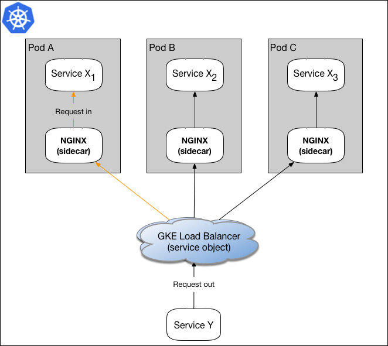
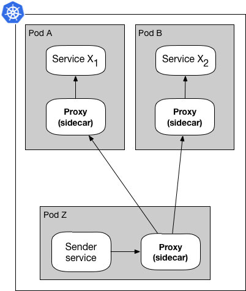
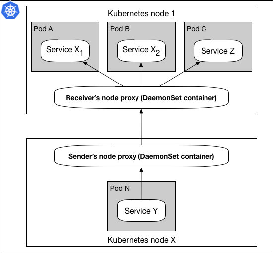
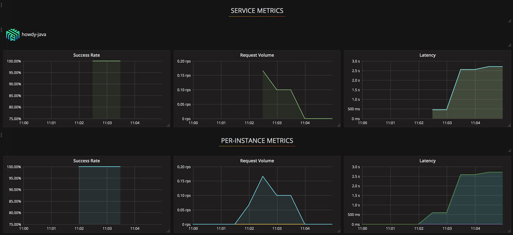
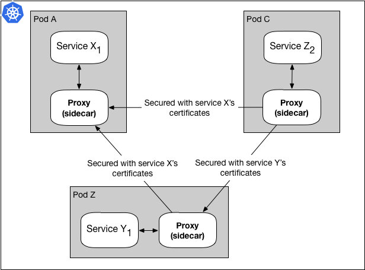

本文为翻译文章，[点击查看原文](https://wecode.wepay.com/posts/using-l5d-as-a-service-mesh-proxy-at-wepay)。

在接下来的几个月中，我们将撰写一系列文章来记录从传统负载均衡器到[谷歌 Kubernetes 引擎](https://cloud.google.com/kubernetes-engine/)（GKE）之上服务网格的[WePay 工程化](https://wecode.wepay.com/)之路。

在本系列的第一部分中，我们将看看曾使用过的一些路由和负载均衡选项并将它们与服务网格代理进行比较，以及它们是如何改变我们基础设施的运行方式的。

图 1.数据面板使用 sidecar 代理模式

图 1 显示了一个数据面板的简化版本。用服务网格术语来描述就是：服务 X 通过其 sidecar 代理向服务 Y 发送请求。由于服务 X 通过其代理发送请求，所以请求首先被传递给服务 X 的代理（PX），然后在到达目的服务 Y 之前被发送到服务 Y 的代理（PY）。在大多数情况下，PX 通过服务发现服务发现 PY，例如 Namerd。

我们有期[主题为 gRPC 的 meetup](https://www.youtube.com/watch?v=8KWmNw9jQ04&feature=youtu.be&t=28m59s)讨论了一些关于使用该模式进行代理负载平衡的内容。

本文由于简便起见将专注于数据面板，并为进一步简化，将只讨论使用 sidecar 模式的代理。

注意：本文所提到的全部技术都是非常复杂的软件，由许多天才工程师所著，且可供其他面临类似案例的公司开源使用。下面的对比完全基于 WePay 的应用案例，包括哪种技术最适合这些案例，且不打算诋毁其他提及的技术。

## 设置阶段

在 WePay 我们目前正在 GKE 中运行许多微服务（Sx）。在同一个数据中心一些微服务与其他微服务通信，如下图所示：

图 2.使用 GKE 和 NGINX 的简单负载均衡

在图 2 所示的模型中，服务 Y 向服务 X 发送请求，并且 Kubernetes 的负载均衡对象通过将请求转发给 X1 的 NGINXsidecar 来为服务 X 执行负载平衡。当 NGINX 收到请求时，它终止 SSL 并将数据包转发到 X1。

过去一年左右的时间，我们的基础设施中微服务的数量随之不断增长，以下问题已被证明对我们非常重要，在某些方面我们转向服务网格的动机如下：

- 更智能，高性能和并发的负载均衡
- 对平台和协议无感知的路由，要求：HTTP 和 HTTP/2（聚焦 gRPC）
- 独立于应用的路由和指标追踪
- 通信安全

一旦我们意识到我们想要迁移到服务网格基础设施，我们就会研究构建数据面板的各种不同的代理。从名单上看，[Envoy](https://www.envoyproxy.io/)和[Linkerd](https://linkerd.io/)看起来最为接近我们的需求，两者都同时提供了一套成熟的功能。

注意：在研究过程中，NGINX 自身暂不支持服务网格，但为了支持服务网格基础设施，[NGINX 增加了对 Istio 支持](https://www.nginx.com/press/implementation-nginx-as-serviceproxy-istio/)。以对比为目的，将 Envoy 和 NGINX 放到同一边。

## 更好的负载均衡

Envoy 和 Linkerd 都可以访问一些更复杂的负载均衡算法，但 Linkerd 聚焦于[性能调优](https://blog.buoyant.io/2017/01/31/making-things-faster-by-adding-more-steps/)及其平台使用的是[Finagle](https://twitter.github.io/finagle/)，使其成为负载均衡的最佳选择。

图 3. Sidecar 模式处理负载均衡

图 3 展示了服务网格代理如何通过服务发现获取可用目标列表来处理负载均衡。

除基本的负载均衡功能外，Linkerd 还支持 Kubernetes DaemonSet，使负载均衡更接近每个 Kubernetes 节点边缘。从资源分配的角度看，这同样显著降低了在大型集群中运行代理的成本。

图 4.DaemonSet 代理模式

在图 4 中，DaemonSet 模式显示每个 Kubernetes 集群节点托管一个代理。当服务 Y 向服务 Z 发送请求时，该请求被传递给发送方的节点代理，在使用服务发现的情况下，代理将请求转发给接收方的节点代理，并且最终将该请求发送到服务 Z.通过分离与运行在同一集群中的微服务代理的生命周期，该模式使维护和配置这些代理变得更简单。

## 相同基础设施上的新协议

早在 2017 年，当我们考虑改进服务与 gRPC 进行服务通信时，[Linkerd对HTTP/2和gRPC开箱即用的支持](https://blog.buoyant.io/2017/01/10/http2-grpc-and-linkerd/)，使得应用 Linkerd 更易于迁移到服务网格。

此外，为任意微服务提供 HTTP 和 HTTP/2（gRPC）的能力，以及在我们的基础设施中同时支持多种协议的需求，意味着多协议支持已经成为为我们的基础设施选择代理服务器的一项艰巨任务。

图 5.代理在相同的设置中接收和转发 gRPC 和 HTTP

该图展示了一些请求使用HTTP而其他请求使用HTTP/2。当我们计划从HTTP到HTTP/2（gRPC）的迁移时，能够使用具有相同基础结构配置的多种协议被证明是一项关键功能。在迁移期间，我们有一些服务通过 HTTP 彼此通信，而其他服务通过 HTTP/2 进行通信。图 5 假设了随着时间推移产生的基础设施。在后续文章中，我们将深入探讨微服务如何在我们的基础设施中发送和接收不同类型的有效负载，例如 REST，Protobufs 等。

当下包括 Envoy 在内的大多数服务网格代理都能处理最新的协议，如 HTTP，HTTP/2 等。

## 指标测量

在基础设施中，我们利用[Prometheus](https://prometheus.io/)来监控 Kubernetes、微服务及其他内部服务。 [Envoy 需要额外的一个步骤](https://www.datawire.io/faster/ambassador-prometheus/)才能使用 Prometheus，但使用 Linkerd 的即用型[Prometheus 遥测插件](https://linkerd.io/administration/telemetry/)，我们可以更容易地启动和运行各种指标视图，而无需额外的服务将服务网格代理胶合到我们的可视化仪表板：

图 6.集群和应用程序级别代理指标视图

图 6 中的示例仪表板展示了位于同一处的全局、单个微服务和单个代理的流量，以更好地了解 DaemonSet 代理模式中通过基础设施发生的操作。

使用 Linkerd 的其他便利部分之一是代理随附的指标范围。此外，Linkerd 还使编写自定义插件更容易，例如：使用这些自定义指标来控制重试机制。因此可对任何特定的指标、警报和监控进行改造以满足运行服务网格的基础设施的需求。

## 安全性就是启动它

如今大多数代理支持各类代理加密和授权方法，并且以 sidecar 模式与 Linkerd 一起使用时，我们能够更进一步。使用 sidecar 模式，我们可以在 Linkerd 中对每个服务进行授权，这使我们能够在合适的时机和位置最大限度地提高基础设施的安全性。

在使用 sidecar 代理模式的环境设置中，工作方式有所不同的是 SSL 握手的每个服务 TLS 证书。

图 7.用于 SSL 握手的每个服务 TLS 证书

图 7 显示了服务 Z 的 Linkerd 代理使用服务 X 的证书向服务 X 发送请求的同时，使用服务 Y 的证书向服务 Y 发送请求。这使我们能够维护每个服务，更新和修改 SSL 证书使服务彼此独立，并且还增加微服务的安全性。

该功能对某些设置可能很有用，但对于其他设置来说则相当麻烦，所以具有相互选择功能是非常不错的能力。

## 结论

基于基础设施需求和改进思路，我们决定选择 Linkerd 作为我们的技术栈。

使用 Linkerd，我们可以获得所需的可靠性，引入新协议到基础设施以供微服务引用，更好地可视化服务流量，并根据需要调整安全性。

在本系列即将发布的博文中，我们将讨论服务网格架构中的不同部分，以及它们如何应用于 WePay 的架构中。

---

关于 WePay：WePay is a platform payments company that provides payment, risk and support products and services to software and platform companies. We do payments for software and platforms, that’s all we do and we do it better than anyone else. WePay is a JPMorgan Chase company.
