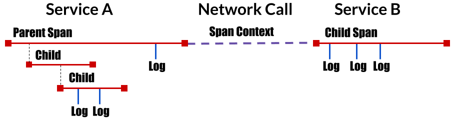
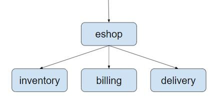
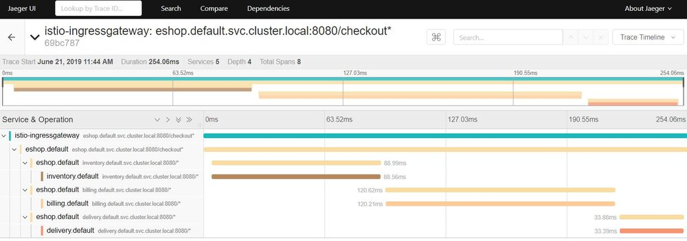
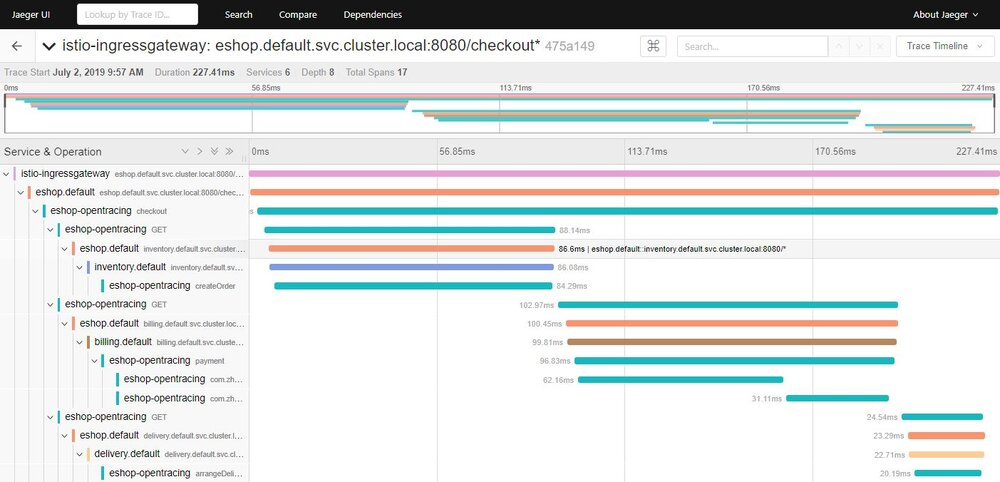
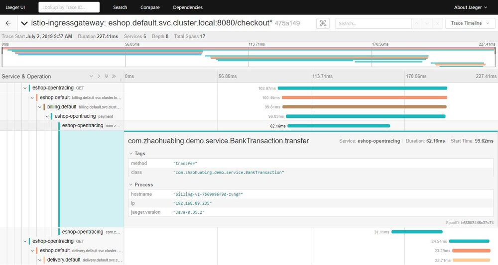
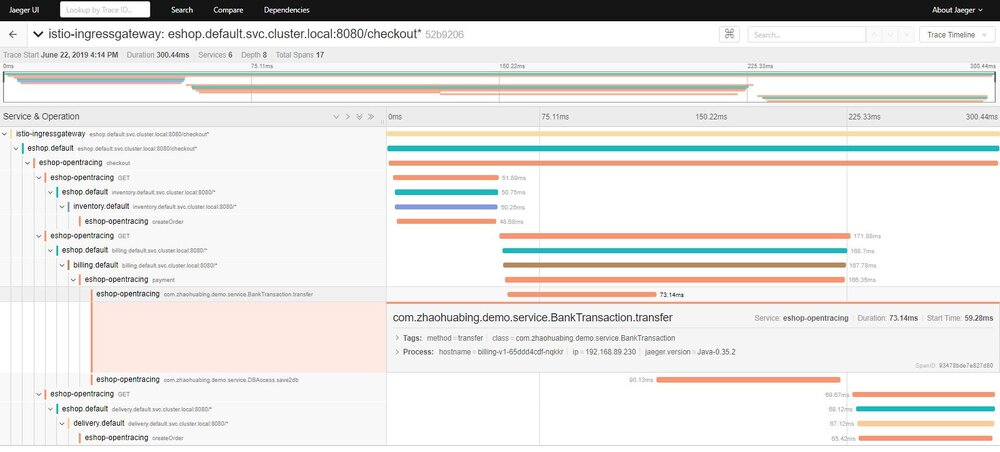

## 什么是分布式调用跟踪？

相比传统的“巨石”应用，微服务的一个主要变化是将应用中的不同模块拆分为了独立的进程。在微服务架构下，原来进程内的方法调用成为了跨进程的 RPC 调用。相对于单一进程的方法调用，跨进程调用的调试和故障分析是非常困难的，很难用传统的调试器或者日志打印来对分布式调用进行查看和分析。


如上图所示，一个来自客户端的请求经过了多个微服务进程。如果要对该请求进行分析，则必须将该请求经过的所有服务的相关信息都收集起来并关联在一起，这就是“分布式调用跟踪”。

## 什么是 Opentracing？

## CNCF Opentracing 项目

[Opentracing](http://https://opentracing.io/)是[CNCF](https://www.cncf.io/)（云原生计算基金会）下的一个项目，其中包含了一套分布式调用跟踪的标准规范，各种语言的 API，编程框架和函数库。Opentracing 的目的是定义一套分布式调用跟踪的标准，以统一各种分布式调用跟踪的实现。目前已有大量支持[Opentracing 规范的 Tracer 实现](https://opentracing.io/docs/supported-tracers/)，包括 Jager,Skywalking,LightStep 等。在微服务应用中采用 Opentracing API 实现分布式调用跟踪，可以避免 vendor locking，以最小的代价和任意一个兼容 Opentracing 的基础设施进行对接。

## Opentracing 概念模型

Opentracing 的概念模型参见下图：



如图所示，Opentracing 中主要包含下述几个概念：

* Trace：描述一个分布式系统中的端到端事务，例如来自客户端的一个请求。
* Span：一个具有名称和时间长度的操作，例如一个 REST 调用或者数据库操作等。Span 是分布式调用跟踪的最小跟踪单位，一个 Trace 由多段 Span 组成。
* Span context：分布式调用跟踪的上下文信息，包括 Trace id，Span id 以及其它需要传递到下游服务的内容。一个 Opentracing 的实现需要将 Span context 通过某种序列化机制 (Wire Protocol) 在进程边界上进行传递，以将不同进程中的 Span 关联到同一个 Trace 上。这些 Wire Protocol 可以是基于文本的，例如 HTTP header，也可以是二进制协议。

## Opentracing 数据模型

一个 Trace 可以看成由多个相互关联的 Span 组成的有向无环图（DAG 图）。下图是一个由 8 个 Span 组成的 Trace：

```text

        [Span A]  ←←←(the root span)
            |
     +------+------+
     |             |
 [Span B]      [Span C] ←←←(Span C is a `ChildOf` Span A)
     |             |
 [Span D]      +---+-------+
               |           |
           [Span E]    [Span F] >>> [Span G] >>> [Span H]
                                       ↑
                                       ↑
                                       ↑
                         (Span G `FollowsFrom` Span F)

```

上图的 trace 也可以按照时间先后顺序表示如下：

```text
––|–––––––|–––––––|–––––––|–––––––|–––––––|–––––––|–––––––|–> time

 [Span A···················································]
   [Span B··············································]
      [Span D··········································]
    [Span C········································]
         [Span E·······]        [Span F··] [Span G··] [Span H··]
```

Span 的数据结构中包含以下内容：

* name: Span 所代表的操作名称，例如 REST 接口对应的资源名称。
* Start timestamp: Span 所代表操作的开始时间
* Finish timestamp: Span 所代表的操作的的结束时间
* Tags：一系列标签，每个标签由一个 key value 键值对组成。该标签可以是任何有利于调用分析的信息，例如方法名，URL 等。
* SpanContext：用于跨进程边界传递 Span 相关信息，在进行传递时需要结合一种序列化协议（Wire Protocol）使用。
* References：该 Span 引用的其它关联 Span，主要有两种引用关系，Childof 和 FollowsFrom。
    * Childof：最常用的一种引用关系，表示 Parent Span 和 Child Span 之间存在直接的依赖关系。例 PRC 服务端 Span 和 RPC 客户端 Span，或者数据库 SQL 插入 Span 和 ORM Save 动作 Span 之间的关系。
    * FollowsFrom：如果 Parent Span 并不依赖 Child Span 的执行结果，则可以用 FollowsFrom 表示。例如网上商店购物付款后会向用户发一个邮件通知，但无论邮件通知是否发送成功，都不影响付款成功的状态，这种情况则适用于用 FollowsFrom 表示。

## 跨进程调用信息传播

SpanContext 是 Opentracing 中一个让人比较迷惑的概念。在 Opentracing 的概念模型中提到 SpanContext 用于跨进程边界传递分布式调用的上下文。但实际上 Opentracing 只定义一个 SpanContext 的抽象接口，该接口封装了分布式调用中一个 Span 的相关上下文内容，包括该 Span 所属的 Trace id，Span id 以及其它需要传递到 downstream 服务的信息。SpanContext 自身并不能实现跨进程的上下文传递，需要由 Tracer（Tracer 是一个遵循 Opentracing 协议的实现，如 Jaeger，Skywalking 的 Tracer）将 SpanContext 序列化后通过 Wire Protocol 传递到下一个进程中，然后在下一个进程将 SpanContext 反序列化，得到相关的上下文信息，以用于生成 Child Span。 

为了为各种具体实现提供最大的灵活性，Opentracing 只是提出了跨进程传递 SpanContext 的要求，并未规定将 SpanContext 进行序列化并在网络中传递的具体实现方式。各个不同的 Tracer 可以根据自己的情况使用不同的 Wire Protocol 来传递 SpanContext。

在基于 HTTP 协议的分布式调用中，通常会使用 HTTP Header 来传递 SpanContext 的内容。常见的 Wire Protocol 包含 Zipkin 使用的[b3 HTTP header](https://github.com/openzipkin/b3-propagation)，Jaeger 使用的[uber-trace-id HTTP Header](https://www.jaegertracing.io/docs/1.7/client-libraries/#trace-span-identity),LightStep 使用的"x-ot-span-context" HTTP Header 等。Istio/Envoy 支持 b3 header 和 x-ot-span-context header，可以和 Zipkin,Jaeger 及 LightStep 对接。其中 b3 HTTP header 的示例如下：

```text
X-B3-TraceId: 80f198ee56343ba864fe8b2a57d3eff7
X-B3-ParentSpanId: 05e3ac9a4f6e3b90
X-B3-SpanId: e457b5a2e4d86bd1
X-B3-Sampled: 1
```

## Istio 对分布式调用跟踪的支持 

Istio/Envoy为微服务提供了开箱即用的分布式调用跟踪功能。在安装了Istio和Envoy的微服务系统中，Envoy会拦截服务的入向和出向请求，为微服务的每个调用请求自动生成调用跟踪数据。通过在服务网格中接入一个分布式跟踪的后端系统，例如zipkin或者Jaeger，就可以查看一个分布式请求的详细内容，例如该请求经过了哪些服务，调用了哪个REST接口，每个REST接口所花费的时间等。

需要注意的是，Istio/Envoy 虽然在此过程中完成了大部分工作，但还是要求对应用代码进行少量修改：应用代码中需要将收到的上游 HTTP 请求中的 b3 header 拷贝到其向下游发起的 HTTP 请求的 header 中，以将调用跟踪上下文传递到下游服务。这部分代码不能由 Envoy 代劳，原因是 Envoy 并不清楚其代理的服务中的业务逻辑，无法将入向请求和出向请求按照业务逻辑进行关联。这部分代码量虽然不大，但需要对每一处发起 HTTP 请求的代码都进行修改，非常繁琐而且容易遗漏。当然，可以将发起 HTTP 请求的代码封装为一个代码库来供业务模块使用，来简化该工作。

下面以一个简单的网上商店示例程序来展示 Istio 如何提供分布式调用跟踪。该示例程序由 eshop,inventory，billing，delivery 几个微服务组成，结构如下图所示：



eshop 微服务接收来自客户端的请求，然后调用 inventory，billing，delivery 这几个后端微服务的 REST 接口来实现用户购买商品的 checkout 业务逻辑。本例的代码可以从 github 下载：<https://github.com/zhaohuabing/istio-opentracing-demo.git>

如下面的代码所示，我们需要在 eshop 微服务的应用代码中传递 b3 HTTP Header。

```java
 @RequestMapping(value = "/checkout")
public String checkout(@RequestHeader HttpHeaders headers) {
    String result = "";
    // Use HTTP GET in this demo. In a real world use case,We should use HTTP POST
    // instead.
    // The three services are bundled in one jar for simplicity. To make it work,
    // define three services in Kubernets.
    result += restTemplate.exchange("http://inventory:8080/createOrder", HttpMethod.GET,
            new HttpEntity<>(passTracingHeader(headers)), String.class).getBody();
    result += "<BR>";
    result += restTemplate.exchange("http://billing:8080/payment", HttpMethod.GET,
            new HttpEntity<>(passTracingHeader(headers)), String.class).getBody();
    result += "<BR>";
    result += restTemplate.exchange("http://delivery:8080/arrangeDelivery", HttpMethod.GET,
            new HttpEntity<>(passTracingHeader(headers)), String.class).getBody();
    return result;
}
private HttpHeaders passTracingHeader(HttpHeaders headers) {
    HttpHeaders tracingHeaders = new HttpHeaders();
    extractHeader(headers, tracingHeaders, "x-request-id");
    extractHeader(headers, tracingHeaders, "x-b3-traceid");
    extractHeader(headers, tracingHeaders, "x-b3-spanid");
    extractHeader(headers, tracingHeaders, "x-b3-parentspanid");
    extractHeader(headers, tracingHeaders, "x-b3-sampled");
    extractHeader(headers, tracingHeaders, "x-b3-flags");
    extractHeader(headers, tracingHeaders, "x-ot-span-context");
    return tracingHeaders;
}
```

在 Kubernets 中部署该程序，查看 Istio 分布式调用跟踪的效果。

* 首先部署 Kubernets cluster，注意需要启用 API Server 的 Webhook 选项
* 在 Kubernets cluster 中部署 Istio，并且启用 default namespace 的 sidecar auto injection
* 在 Kubernets cluster 中部署 eshop 应用

```bash
git clone https://github.com/zhaohuabing/istio-opentracing-demo.git
cd istio-opentracing-demo
git checkout without-opentracing
kubectl apply -f k8s/eshop.yaml
```

* 在浏览器中打开地址：<http://${NODE_IP}:31380/checkout> ，以触发调用 eshop 示例程序的 REST 接口。
* 在浏览器中打开 Jaeger 的界面 <http://${NODE_IP}:30088> ，查看生成的分布式调用跟踪信息。

注意：为了能在 Kubernets Cluster 外部访问到 Jaeger 的界面，需要修改 Istio 的缺省安装脚本，为 Jaeger Service 指定一个 NodePort。修改方式参见下面的代码：

```yaml
apiVersion: v1
  kind: Service
  metadata:
    name: jaeger-query
    namespace: istio-system
    annotations:
    labels:
      app: jaeger
      jaeger-infra: jaeger-service
      chart: tracing
      heritage: Tiller
      release: istio
  spec:
    ports:
      - name: query-http
        port: 16686
        protocol: TCP
        targetPort: 16686
        nodePort: 30088
    type: NodePort
    selector:
      app: jaeger
```

Jaeger 用图形直观地展示了这次调用的详细信息，可以看到客户端请求从 Ingressgateway 进入到系统中，然后调用了 eshop 微服务的 checkout 接口，checkout 调用有三个 child span，分别对应到 inventory，billing 和 delivery 三个微服务的 REST 接口。



## 使用 Opentracing 来传递分布式跟踪上下文

Opentracing 提供了基于 Spring 的代码埋点，因此我们可以使用 Opentracing Spring 框架来提供 HTTP header 的传递，以避免这部分硬编码工作。在 Spring 中采用 Opentracing 来传递分布式跟踪上下文非常简单，只需要下述两个步骤：

* 在 Maven POM 文件中声明相关的依赖，一是对 Opentracing Spring Cloud Starter 的依赖；另外由于后端接入的是 Jaeger，也需要依赖 Jaeger 的相关 jar 包。
* 在 Spring Application 中声明一个 Tracer bean。

```java
@Bean
public Tracer jaegerTracer() {
    // The following environment variables need to set
    // JAEGER_ENDPOINT="http:///{IP}:{PORT}/api/traces"
    // JAEGER_PROPAGATION="b3"
    // JAEGER_TRACEID_128BIT="true" Use 128bit tracer id to be compatible with the
    // trace id generated by istio/envoy
    return Configuration.fromEnv("eshop-opentracing").getTracer();
}
```

> 注意：
>
> Jaeger tracer 缺省使用的是 uber-trace-id header，而 Istio/Envoy 不支持该 header。因此需要指定 Jaeger tracer 使用 b3 header 格式，以和 Istio/Envoy 兼容。
> 
> Jaeger tracer 缺省使用 64 bit 的 trace id, 而Istio/Envoy使用了128 bit 的 trace id。因此需要指定 Jaeger tracer 使用 128 bit 的 trace id，以和 Istio/Envoy 生成的 trace id 兼容。

部署采用 Opentracing 进行 HTTP header 传递的程序版本，其调用跟踪信息如下所示：



从上图中可以看到，相比在应用代码中直接传递 HTTP header 的方式，采用 Opentracing 进行代码埋点后，相同的调用增加了 7 个 Span，这 7 个 Span 是由 Opentracing 的 tracer 生成的。虽然我们并没有在代码中显示创建这些 Span，但 Opentracing 的代码埋点会自动为每一个 REST 请求生成一个 Span，并根据调用关系关联起来。

Opentracing 生成的这些 Span 为我们提供了更详细的分布式调用跟踪信息，从这些信息中可以分析出一个 HTTP 调用从客户端应用代码发起请求，到经过客户端的 Envoy，再到服务端的 Envoy，最后到服务端接受到请求各个步骤的耗时情况。从图中可以看到，Envoy 转发的耗时在 1 毫秒左右，相对于业务代码的处理时长非常短，对这个应用而言，Envoy 的处理和转发对于业务请求的处理效率基本没有影响。

## 在 Istio 调用跟踪链中加入方法级的调用跟踪信息

Istio/Envoy提供了跨服务边界的调用链信息，在大部分情况下，服务粒度的调用链信息对于系统性能和故障分析已经足够。但对于某些服务，需要采用更细粒度的调用信息来进行分析，例如一个REST请求内部的业务逻辑和数据库访问分别的耗时情况。在这种情况下，我们需要在服务代码中进行埋点，并将服务代码中上报的调用跟踪数据和Envoy生成的调用跟踪数据进行关联，以统一呈现Envoy和服务代码中生成的调用数据。

在方法中增加调用跟踪的代码是类似的，因此我们用 AOP + Annotation 的方式实现，以简化代码。
首先定义一个 Traced 注解和对应的 AOP 实现逻辑：

```java
@Retention(RetentionPolicy.RUNTIME)
@Target(ElementType.METHOD)
@Documented
public @interface Traced {
}
```

```java
@Aspect
@Component
public class TracingAspect {
    @Autowired
    Tracer tracer;

    @Around("@annotation(com.zhaohuabing.demo.instrument.Traced)")
    public Object aroundAdvice(ProceedingJoinPoint jp) throws Throwable {
        String class_name = jp.getTarget().getClass().getName();
        String method_name = jp.getSignature().getName();
        Span span = tracer.buildSpan(class_name + "." + method_name).withTag("class", class_name)
                .withTag("method", method_name).start();
        Object result = jp.proceed();
        span.finish();
        return result;
    }
}
```

然后在需要进行调用跟踪的方法上加上 Traced 注解：

```java
@Component
public class DBAccess {

    @Traced
    public void save2db() {
        try {
            Thread.sleep((long) (Math.random() * 100));
        } catch (InterruptedException e) {
            e.printStackTrace();
        }
    }
}
```

```java
@Component
public class BankTransaction {
    @Traced
    public void transfer() {
        try {
            Thread.sleep((long) (Math.random() * 100));
        } catch (InterruptedException e) {
            e.printStackTrace();
        }
    }
}
```

demo 程序的 master branch 已经加入了方法级代码跟踪，可以直接部署。

```bash
git checkout master
kubectl apply -f k8s/eshop.yaml
```

效果如下图所示，可以看到 trace 中增加了 transfer 和 save2db 两个方法级的 Span。



可以打开一个方法的 Span，查看详细信息，包括 Java 类名和调用的方法名等，在 AOP 代码中还可以根据需要添加出现异常时的异常堆栈等信息。



## 总结

Istio/Envoy为微服务应用提供了分布式调用跟踪功能，提高了服务调用的可见性。我们可以使用Opentracing来代替应用硬编码，以传递分布式跟踪的相关http header；还可以通过 Opentracing 将方法级的调用信息加入到 Istio/Envoy 缺省提供的调用链跟踪信息中，以提供更细粒度的调用跟踪信息。

## 下一步

除了同步调用之外，异步消息也是微服务架构中常见的一种通信方式。在下一篇文章中，我将继续利用 eshop demo 程序来探讨如何通过 Opentracing 将 Kafka 异步消息也纳入到 Istio 的分布式调用跟踪中。

## 参考资料

1. [本文中 eshop 示例程序的源代码](https://github.com/zhaohuabing/istio-opentracing-demo)
1. [Opentracing docs](https://opentracing.io/docs/)
1. [Opentracing specification](https://github.com/opentracing/specification/blob/master/specification.md)
1. [Opentracing wire protocols](https://github.com/opentracing/specification/blob/master/rfc/trace_identifiers.md)
1. [Istio Trace context propagation](https://istio.io/docs/tasks/telemetry/distributed-tracing/overview/#trace-context-propagation)
1. [Using OpenTracing with Istio/Envoy](https://medium.com/jaegertracing/using-opentracing-with-istio-envoy-d8a4246bdc15)
1. [Zipkin-b3-propagation](https://github.com/apache/incubator-zipkin-b3-propagation)
1. [Istio 调用链埋点原理剖析—是否真的“零修改”？](https://www.infoq.cn/article/pqy*PFPhox9OQQ9iCRTt)
1. [OpenTracing Project Deep Dive](https://www.youtube.com/watch?v=ySR_FVNX4bQ&t=184s)
