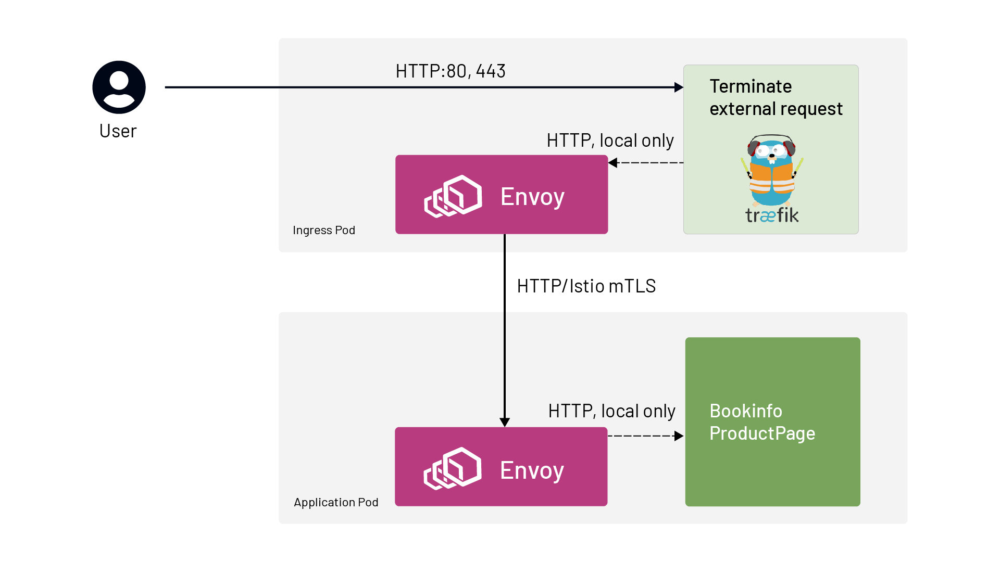

本文译自 [Using Traefik Ingress Controller with Istio Service Mesh](https://thenewstack.io/using-traefik-ingress-controller-with-istio-service-mesh/)。

Istio 服务网格自带 ingress，但我们经常看到有要求使用非 Istio ingress 的客户。此前，我们已经介绍过[将 NGINX 与 Istio 集成](https://www.tetrate.io/blog/using-istio-with-other-ingress-proxies/)的情况。最近，我们一直在与使用 [Traefik](https://traefik.io/) ingress 的客户合作。通过对我们之前建议的方法进行一些轻微调整，我将向你介绍如何实现 Traefik 作为 Istio 服务网格的入口网关。

流量的流向如下图所示。一旦请求从 Traefik Ingress 到达服务网格，Istio 就能够对请求应用安全性、可观察性和流量引导规则。



传入的流量绕过 Istio sidecar，直接到达 Traefik，所以请求终止在 Traefik ingress。

Traefik 使用 `IngressRoute` 配置重写 Host 头以匹配目的地，并将请求转发到目标服务，这是一个多步骤的过程。

- 从 Traefik Ingress 出来的请求被重定向到 Istio sidecar（由 iptables）。
- Sidecar 接收请求，对其进行加密（因为我们的 Istio `PeerAuthentication` 策略要求使用 STRICT mTLS），然后将请求转发到目标服务的 pod。

下面是一个端到端的部署示例，使用 Istio 的 bookinfo 演示应用，但用 Traefik ingress 来支撑整个部署。简而言之，要想在自己的环境中实现这个功能。

- 用 Istio sidecar 部署 Traefik 控制器，注释部署，使入站流量绕过 Istio Sidecar:

```
# Exclude the ports that Traefik receives traffic on
traffic.sidecar.istio.io/excludeInboundPorts: “80” 

# Make sure Traefik controller can talk to the Kubernetes API server 

traffic.sidecar.istio.io/excludeOutboundIPRanges: X.X.X.X/32 
```

- 在应用程序命名空间中启用 Istio sidecar 注入，并部署任何你需要的 Istio 特定配置。
- 用 Traefik `Middleware` 对象创建 `IngressRoute`，将主机名改写为网格识别的主机名（即集群中的服务；下文将通过一个例子详细讨论）。

## 使用 Traefik Ingress 的 Bookinfo

这篇文章的其余部分涵盖了部署 Istio 的 Bookinfo 示例应用程序，使用 Traefik 作为部署的 Ingress 代理。

### 设置环境

参考以下步骤。

1. 部署一个至少 1.17 版本的 Kuberentes 集群（最小支持 Istio 1.8 版本）。我们使用 Google Kubernetes Engine 创建的集群。

```sh
gcloud container clusters create istio-traefik \
  --cluster-version=1.17 \
  --region <GCP region> \
  --machine-type=e2-standard-4 \
  --project <GCP Project> \
  --num-nodes 1 \
  --node-locations <GCP Zone> # i.e us-west2-b (otherwise 1 node per zone)
```

1. 下载 Istio 1.8

```sh
curl -sL https://git.io/getLatestIstio |\
ISTIO_VERSION=1.8.1 sh -
```

1. 在启用 HTTP 访问日志的情况下进行安装。

```sh
./istio-1.8.1/bin/istioctl install \
  --set meshConfig.accessLogFile=/dev/stdout \
  --skip-confirmation
```

### 部署 Bookinfo 应用

安装好 Istio 后，我们就可以开始部署我们的应用程序了。我们将使用 Istio 的 Bookinfo 应用程序进行演示。这个示例应用程序是 Istio 发行版的一部分（在`./istio-1.8.1/samples/` 文件夹中）。

1. 创建 bookinfo namespace。

```sh
kubectl create ns bookinfo
```

1. 设置 label，让 sidecar 自动注入。

```sh
kubectl label namespace bookinfo istio-injection=enabled
```

1. 在该 namespace 中部署 bookinfo 应用程序。

```sh
kubectl apply -f istio-1.8.1/samples/bookinfo/platform/kube/bookinfo.yaml -n bookinfo
```

确认所有的吊舱都已启动，并部署了侧车。

启用 Istio mTLS 为应用程序命名空间的服务到服务通信。

```sh
cat <<EOF | kubectl apply -f - 
apiVersion: security.istio.io/v1beta1
kind: PeerAuthentication
metadata:
  name: default
  namespace: bookinfo
spec:
  mtls:
    mode: STRICT
EOF
```

### 部署 Traefik 入口

现在是时候按照 v2.3 文档来部署 Traefik 了（本篇文章中 Traefik 的最新版本是 2.3，但如果你根据你的版本调整了 `IngressRoute` 和 `Middleware` 资源，它将适用于任何版本的 Traefik）。

1. 部署 Traefik。请注意，Traefik 网站上的文档部署有一些修改（代替 Traefik 文档中的默认命名空间，将指定 bookinfo 命名空间）。该文件可以在这里访问并应用如下。

```sh
$ kubectl apply -f http://bit.ly/Traefik-CRDs-and-Roles
customresourcedefinition.apiextensions.k8s.io/ingressroutes.traefik.containo.us created
customresourcedefinition.apiextensions.k8s.io/middlewares.traefik.containo.us created
customresourcedefinition.apiextensions.k8s.io/ingressroutetcps.traefik.containo.us created
customresourcedefinition.apiextensions.k8s.io/ingressrouteudps.traefik.containo.us created
customresourcedefinition.apiextensions.k8s.io/tlsoptions.traefik.containo.us created
customresourcedefinition.apiextensions.k8s.io/tlsstores.traefik.containo.us created
customresourcedefinition.apiextensions.k8s.io/traefikservices.traefik.containo.us created
clusterrole.rbac.authorization.k8s.io/traefik-ingress-lb created
clusterrolebinding.rbac.authorization.k8s.io/traefik-ingress-lb created
```

1. 为传入的请求创建一个服务。该服务将接收外部 IP 地址。(Traefik 网站上的例子有一些变化)。

- 需要指定 Namespace。
- 只发布两个端口：80 用于 Bookinfo 应用，8080 用于 Traefik 管理。
- 服务需要使用的标签（traefik-ingress-lb）指向 Traefik。
- `Type: Loadbalancer` 是为了告诉 GCP 给服务分配一个外部 IP。

```sh
cat <<EOF | kubectl apply -f - 
apiVersion: v1
kind: Service
metadata:
  name: traefik
  namespace: bookinfo
spec:
  ports:
    - protocol: TCP
      name: web
      port: 80
    - protocol: TCP
      name: admin
      port: 8080
  selector:
    app: traefik-ingress-lb
  type: LoadBalancer
EOF
```

1. 确认服务的创建符合预期。

```sh
$ kubectl get svc traefik -n bookinfo
NAME      TYPE           CLUSTER-IP      EXTERNAL-IP   PORT(S)                       AGE
traefik   LoadBalancer   10.35.244.227   35.236.XXX.XXX   80:31718/TCP,8080:31334/TCP   2m6s
```

1. 正如 [Traefik 网站](https://doc.traefik.io/traefik/user-guides/crd-acme/)中介绍的，需要应用 `ServiceAccount` 的 Kubernetes 部署。除了名称和命名空间，网站示例还引入了以下变化。

- 为了简单起见，删除了安全端点。
  - `Accesslog`：增加了 `=true`，因为没有这个值就不行。
  - `Log.level` 设置为 DEBUG 将帮助我们看到发生了什么。
  - 增加了 `traffic.sidecar.istio.io` 注释（更多细节请参考之前提到的 Tetrate [NGINX 文章](https://www.tetrate.io/blog/using-istio-with-other-ingress-proxies/)）。

```sh
KUBERNETES_SVC_IP=$( kubectl get svc kubernetes -n default -o jsonpath='{.spec.clusterIP}' )
 
cat <<EOF | kubectl apply -f - 
apiVersion: v1
kind: ServiceAccount
metadata:
  namespace: bookinfo
  name: traefik-ingress-lb
 
---
kind: Deployment
apiVersion: apps/v1
metadata:
  namespace: bookinfo
  name: traefik-ingress-lb
  labels:
    app: traefik-ingress-lb
spec:
  replicas: 1
  selector:
    matchLabels:
      app: traefik-ingress-lb
  template:
    metadata:
      labels:
        app: traefik-ingress-lb
      annotations:
        traffic.sidecar.istio.io/excludeInboundPorts: "80"
        traffic.sidecar.istio.io/excludeOutboundIPRanges: ${KUBERNETES_SVC_IP}/32
    spec:
      serviceAccountName: traefik-ingress-lb
      containers:
        - name: traefik-ingress-lb
          image: traefik:v2.3
          args:
            - --api.insecure
            - --accesslog=true
            - --providers.kubernetescrd
            - --entrypoints.web.address=:80
            - --log.level=DEBUG
          ports:
            - name: web
              containerPort: 80
            - name: admin
              containerPort: 8080
EOF
```

1. 确认 Traefik 在 Bookinfo 命名空间的部署。

```
$  kubectl get pods -n bookinfo -l app=traefik-ingress-lb
NAME                                  READY   STATUS    RESTARTS   AGE
traefik-ingress-lb-669fc4b77d-74mpx   2/2     Running   0          2m35s
```

1. 获取服务 IP 并记录 BOOKINFO_IP 变量值。

```
BOOKINFO_IP=$(kubectl -n bookinfo get service traefik -o jsonpath='{.status.loadBalancer.ingress[0].ip}')
```

1. 测试来自 Ingress 80 端口的响应，看看它是否有通往应用的路由。

```sh
curl -I $BOOKINFO_IP
```

确保它返回“404 Not Found”—— 由于尚未实施 Ingress 规则，所以预计会有 not-200 响应。

### 配置 Traefik Ingress 规则

1. Traefik 的 `Middleware` 头重写功能将使 Istio 服务网格正常运行。本例中，需要将主机定义为 `productpage.bookinfo.svc`。头可以根据 [Traefik 文档](https://doc.traefik.io/traefik/middlewares/headers)来定义。

```sh
cat <<EOF | kubectl apply -f - 
apiVersion: traefik.containo.us/v1alpha1
kind: Middleware
metadata:
  name: productpage-header
  namespace: bookinfo
spec:
  headers:
    customRequestHeaders:
      Host: productpage.bookinfo.svc
EOF
```

1. 最后一步是指定 ingress 请求的路由逻辑，因为本文的重点是服务网格集成。这个定义非常简单，将所有到达 80 端口的入站请求转发到名为 ProductPage 的前沿 bookinfo 应用服务（服务于 9080 端口的流量）。它还使用了上一步创建的中间件对象。

```sh
cat <<EOF | kubectl apply -f - 
apiVersion: traefik.containo.us/v1alpha1
kind: IngressRoute
metadata:
  name: productpage
  namespace: bookinfo
spec:
  entryPoints:
    - web
  routes:
  - match: PathPrefix(`/`)
    kind: Rule
    middlewares:
    - name: productpage-header
    services:
    - name: productpage
      port: 9080
EOF
```

### 验证部署功能

1. 重新测试应用程序的响应。

```sh
curl -I $BOOKINFO_IP
```

我们会收到“200 OK“的回复。也可以通过浏览器测试，使用 `http://<BOOKINFO_IP>/productpage`。

1. 如果在 `http://<BOOKINFO_IP>/productpage`，就会返回应用响应。


1. 通过查询 istio-proxy 容器的 bookinfo 命名空间中的 Traefik pod 日志，可以在 istio-proxy 日志中看到向应用程序发出的请求。没有传入请求，因为它们直接到达 Traefik Ingress。

```sh
TRAEFIK_POD=$( kubectl -n bookinfo get pods -l app=traefik-ingress-lb -o jsonpath='{.items[0].metadata.name}' )
kubectl -n bookinfo logs ${TRAEFIK_POD} -c istio-proxy
```

请注意，请求处理后，日志需要几秒钟才能显示。只有在 Istio 安装时使用 `meshConfig.accessLogFile=/dev/stdout` 标志的情况下，才会显示日志。

```ini
[2021-01-05T20:13:55.015Z] "GET /productpage HTTP/1.1" 200 - "-" 0 5179 1069 1069 "10.32.0.1" "Mozilla/5.0 (Windows NT 10.0; Win64; x64) AppleWebKit/537.36 (KHTML, like Gecko) Chrome/87.0.4280.88 Safari/537.36" "4bd443e9-1a2e-4d30-b1e3-398a5005f240" "productpage.bookinfo.svc" "10.32.0.18:9080" outbound|9080||productpage.bookinfo.svc.cluster.local 10.32.0.19:51810 10.32.0.18:9080 10.32.0.1:0 - default
[2021-01-05T20:13:56.301Z] "GET /static/bootstrap/fonts/glyphicons-halflings-regular.woff2 HTTP/1.1" 200 - "-" 0 18028 3 3 "10.32.0.1" "Mozilla/5.0 (Windows NT 10.0; Win64; x64) AppleWebKit/537.36 (KHTML, like Gecko) Chrome/87.0.4280.88 Safari/537.36" "8cb44552-c3c8-45dd-8674-4af207ce1648" "productpage.bookinfo.svc" "10.32.0.18:9080" outbound|9080||productpage.bookinfo.svc.cluster.local 10.32.0.19:51810 10.32.0.18:9080 10.32.0.1:0 - default
```

## 总结

本文演示了如何将 Traefik Ingress 作为 Istio 服务网格的入口点。这里应用的基本方法应该是适用的，即使你的环境与我们例子中使用的环境不同。当引入服务网格时，Traefik / 服务网格集成可以在不同的云中成功实施，并使用全新或现有（也就是棕地）部署 Traefik。最终，您将获得两者最好的东西：Istio 服务网格与您所选择的 Ingress 控制器相集成！
