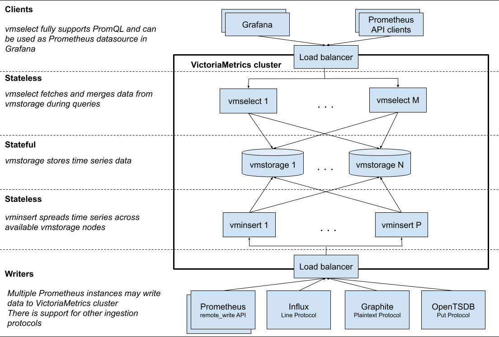

## 前言

本文首先对VictoriaMetrics的功能和架构进行介绍。接着，使用一个场景例子演示单集群VictoriaMetrics的安装，并验证其对Prometheus的兼容性和可替换性。

## VictoriaMetrics简介

我们知道，若要保证一个系统的稳定运行，那么对于这个系统的监控是不可或缺的环节。当今在云原生领域中，Prometheus作为已经毕业的CNCF项目，已经成为了非常主流的监控和报警工具。但它也存在一些缺点，例如：默认情况下，其数据存储于本地文件的TSDB中，不利于容灾和做数据管理，若用于生产一般需要搭配第三方的如InfulxDB进行使用。大数据量的场景下，指标的收集和管理性能存在一定的瓶颈。

而我们今天介绍的VictoriaMetrics可以认为是Prometheus在上述问题上的一个增强版。它不仅能作为时序数据库结合Prometheus使用进行指标的长期远程存储，也能单独作为一个监控解决方案对Prometheus进行平替。

对比其他一些主流的监控方案、时序数据库，VictoriaMetrics具有如下优势：

1.	指标数据的收集和查询具有极高的性能和良好的垂直和水平伸缩性，比InfluxDB和TimesscaleDB的性能高出20倍
2.	在处理高技术时间序列时，内存方面做出了优化，比InfluxDB少10x倍，比Prometheus、Thanos或Cortex少7倍
3.	数据存储的压缩方式更加高效。比TimescaleDB少70倍，与Prometheus、Thanos、Cortex相比，所需存储空间也少7倍。
4.	针对高延迟IO和低IOPS存储进行了优化
5.	单节点的VictoriaMetrics即可替代Thanos、M3DB、Cortex、InfluxDB或TimescaleDB等竞品中等规模的集群
6.	对于Prometheus具有良好的兼容性，能够支持Prometheus的配置文件、PromQL、各类API、数据格式，并有一些自己的增强API。

## VictoriaMetrics的架构

VictoriaMetrics分为单节点和集群两个方案。两种方案都提供了二进制文件、docker、helm以及operator等部署方式。对于数据采集点对于100w/s的场景，官方推荐使用单节点版，单节点版相当于一个all-in-one的包，包含了大部分的功能，但不支持告警，简单好维护。多集群的架构图如图1所示：



VictorMetrics集群部分主要包含了以下几个组件：

* vmstorage：它是一个有状态的组件，主要负责存储原始数据并返回指定标签过滤器在给定时间范围内的查询数据，集群部署的必选组件，默认端口为8482。
* vminsert：无状态的服务组件，主要负责接收摄取的数据并根据指标名称和标签的哈希值分散从存储到部署了vmstorage的节点中去，集群部署的必选组件，默认端口为8480。
* vmselect：无状态的额服务组件，面向外部终端的查询组件，根据收到的请求去各个vmstorage节点中获取数据，集群部署的必选组件，默认端口为8481。
* vmagent：主要负责数据指标的抓取，并将它们存储在VictoriaMetrics或其他支持remote write协议的Prometheus兼容的存储系统中，会占用本地磁盘缓存。它是一个可选组件，位于图1的Writers那层Load balancer与各个采集源之间，类似于Prometheus中pushgateway的地位。是一个可选组件，默认占用端口8429。其组件作用如图2所示：


* vmalert：类似于Prometheus中的alertmanager，是一个告警的相关组件，如果不需要告警功能可以不使用该组件，是一个可选组件，默认占用端口为8880。

集群部署模式下，各个服务可以进行独立的扩展，但部署vmstorage节点之间建议互不通信和进行数据共享，单节点模式的二进制文件或镜像已经集成了三个必选组件的功能。

下面我们将使用单集群的方式在K8S中对VictoriaMetrics进行部署，并验证其对于Prometheus的兼容性。

## VictoriaMetrics单节点的安装和兼容性验证

首先，我们使用Prometheus-Operator进行Prometheus以及相关诸如node-exporter、grafana的快速安装。接着，在K8S内部署单节点的VictoriaMetrics。最后，开启远程写入将Prometheus的数据写入VictoriaMetrics中，并在grafana中浏览Prometheus和VictoriaMetrics的指标，若结果相同，说明在不使用告警功能的情况下，VictoriaMetrics可兼容替换Prometheus进行使用（单节点版不包含告警功能）。整体的组件图如图3所示：


## 使用kube-prometheus安装prometheus相关组件

首先，我们克隆和使用 kube-prometheus (https://github.com/prometheus-operator/kube-prometheus) 这个项目来进行图3中蓝色、黄色以及粉色部分组件的快速安装，该项目和 prometheus-operator 的区别就类似于 Linux 内核和 CentOS/Ubuntu

这些发行版的关系，真正起作用的是 Operator 去实现的，kube-prometheus 项目编写了一系列常用的监控资源清单，更加容易上手安装。不过需要注意 Kubernetes 版本和 kube-prometheus 的兼容，各个版本的兼容关系如图4所示：


由于作者本地的K8s环境为1.21版本，所以我们这里下载使用release-0.9的版本到本地，接着进行进行解压并重命名（起始目录为压缩包所在目录），并进入工作目录，命令如下：

* tar -xvf kube-prometheus-0.9.0.tar.gz
* mv kube-prometheus-0.9.0 kube-prometheus 
* cd kube-prometheus

下一步，我们执行命令：

* kubectl create -f manifests/setup

这会帮我们安装创建prometheus-operator的命名空间（默认是monitoring）和所需的CRD资源。

接着，执行命令：

* kubectl wait --for condition=Established --all CustomResourceDefinition --namespace=monitoring

这个命令会校验和等待我们所需CRD和命名空间的完成。

最后，执行命令：

* kubectl create -f manifests/

它会帮我们安装项目已经定义好的Prometheus、node-exporter、kube-state-metrics、alertmanager组件。为了后续方便使用Prometheus和grafana，我们将两个服务对应的service设置成NodePort（默认为ClusterIP）。命令为：

* kubectl edit svc prometheus-k8s -n monitoring
* kubectl edit svc grafana -n monitoring

完成之后，总体的服务清单如图5所示：


我们通过http://<node-ip>:30246就可以访问grafana了，我们可以看到kube-prometheus这个项目的grafana已经为我们关联了图5中的prometheus，具体见图6：


点击面板左侧的Explore，我们可以进行指标查询，此处我们查询节点的CPU使用率指标“instance:node_cpu:ratio”，查询结果如图7和图8所示（由于作者的Prometheus做了联邦配置所以结果样本会偏多，只看cnp_cluster为“local-cluster”的样本即可）：


## 在K8S中部署VictoriaMetrics

接下来我们进行VictoriaMetrics的部署，由于我们要使用VictoriaMetrics作为远程存储，所以在部署时需要为VictoriaMetrics服务挂载一个存储，此处我们使用Local PV作为其存储（生产环境一般使用NFS或者ceph）。一般来说，Local PV对应的存储介质应该是一块外挂在宿主机的磁盘或者块设备，我们这里暂时将本机节点的/Users/chris/data/k8s/vm这个目录看成是一个挂载的独立磁盘，然后我们依次准备StorageClass、PV和PVC的资源清单，其内容如下代码块所示：

```
apiVersion: storage.k8s.io/v1
kind: StorageClass
metadata:
  name: local-storage
provisioner: kubernetes.io/no-provisioner
volumeBindingMode: WaitForFirstConsumer
```

<center>StorageClass定义</center>

```
apiVersion: v1
kind: PersistentVolume
metadata:
  name: victoria-metrics-data
spec:
  accessModes:
    - ReadWriteMany
  capacity:
    storage: 10Gi
  storageClassName: local-storage
  local:
    path: /Users/chris/data/k8s/vm-operator
  persistentVolumeReclaimPolicy: Retain
  nodeAffinity:
    required:
      nodeSelectorTerms:
        - matchExpressions:
            - key: project
              operator: In
              values:
                - local-cluster
```

<center>PV定义</center>

```
apiVersion: v1
kind: PersistentVolumeClaim
metadata:
  name: victoria-metrics-data
  namespace: kube-vm
spec:
  accessModes:
    - ReadWriteOnce
  resources:
    requests:
      storage: 10Gi
  storageClassName: local-storage
```

<center>PVC定义</center>

PV定义中我们设置了一个亲和性的nodeSelector进行使用，是因为本地存储不能随着Pod进行漂移，所以要求Pod固定到一个节点上，一旦漂移到其他节点上，另外的节点是没有对应的数据的（project=local-cluster是我们实现为node设置的一个标签对）。并且我们在StorageClass定义中创建StorageClass的时候设置了延迟绑定，当节点第一次调度的时候才进行PV与PVC的绑定过程。因为假如我们一开始就绑定了PV和PVC在node1节点，且PV的存储卷在node1节点，但Pod只能运行在node2节点，那么就会出现冲突，导致调度失败，延迟调度就是让K8S调度器的总和考虑调度规则，再Pod被调度时再考虑PVC到底应该和哪个PV进行绑定。

接着，我们定义VictoriaMetrics的Deployment和它的Service，如下代码块所示：

```
apiVersion: apps/v1
kind: Deployment
metadata:
  name: victoria-metrics
  namespace: kube-vm
spec:
  selector:
    matchLabels:
      app: victoria-metrics
  template:
    metadata:
      labels:
        app: victoria-metrics
    spec:
      volumes:
        - name: storage
          persistentVolumeClaim:
            claimName: victoria-metrics-data
      containers:
        - name: vm
          image: victoriametrics/victoria-metrics:v1.79.8
          imagePullPolicy: IfNotPresent
          args:
            - -storageDataPath=/var/lib/victoria-metrics-data
            - -retentionPeriod=1w
          ports:
            - containerPort: 8428
              name: http
          volumeMounts:
            - mountPath: /var/lib/victoria-metrics-data
              name: storage
```
<center>VictoriaMetrics的Deployment清单</center>

```
apiVersion: v1
kind: Service
metadata:
  name: victoria-metrics
  namespace: kube-vm
spec:
  type: NodePort
  ports:
    - port: 8428
  selector:
    app: victoria-metrics
```
<center>VictoriaMetrics的Service清单</center>

Deployment定义中，我们使用-storageDataPath参数指定了数据存储目录，-retentionPeriod参数指定了数据的保留周期为1个星期，Service中使用NodePort的方式对服务进行了暴露。

最后，我们先使用命令`kubectl create ns kube-vm`创建命名空间，再依次使用kubectl apply -f命令应用上述代码块的资源定义清单即可。部署之后的结果图，如图9所示：


依据图3的场景，我们需要在Prometheus中开启远程写入。我们可以在kube-promethus项目下的manifest目录下找到prometheus-prometheus.yaml文件，在清单的最后添加VictoriaMetrics在K8S中的DNS路径，并重新apply即可，如图10所示：


## 验证兼容性

我们使用图5部署好的grafana添加一个新的prometheus数据源，数据源地址为图14部署的VictoriaMetrics的DNS地址，并命名数据源为victoriametrics，最后使用这个数据源进行指标`instance:node_cpu:ratio`的浏览，整个过程的截图如图11~13所示：


从图13中可以观察到，跟Promethus相同，我们同样可以正常的从VictoriaMetrics获取该指标的结果数据（图中红框部分，多出一条数据是因为图5部署的Promethus有两个容器组），如官方所说VictoriaMetrics可以兼容Prometheus，并作为一个及其良好的替换方案。

生产环境中，开启Prometheus的remote_write功能，会导致Prometheus占用主机资源增加，若没有告警的需求，我们可以把图3的Prometheus进行精简，直接让VictoriaMetrics使用之前Prometheus的配置，让各个exporter直接对接到VictoriaMetrics。

对于有告警需求的场景，我们可以使用vmagent替代图3中Prometheus的角色，部署完整的5个组件进行Prometheus告警系统的替换。VictoriaMetrics官方也提供了类似kube-prometheus的项目vm-operator，它不但能够帮助我们管理VictoriaMetrics的相关规则配置，而且能够识别kube-prometheus中servicemonitor、podmonitor等CRD资源。

## 总结

* VictoriaMetrics作为近两年新兴流行的时序数据库和监控解决方案，很好的对Prometheus性能和缺点就行了提升和补充，它能够兼容原先Prometheus监控方案进行指标的长久存储也能快速替换升级Prometheus的监控系统，可作为我们搭建系统监控模块的另一种比较好的选择。

## 参考资料

<https://blog.csdn.net/qihoo_tech/article/details/120558834>

<https://docs.victoriametrics.com/Single-server-VictoriaMetrics.html>
