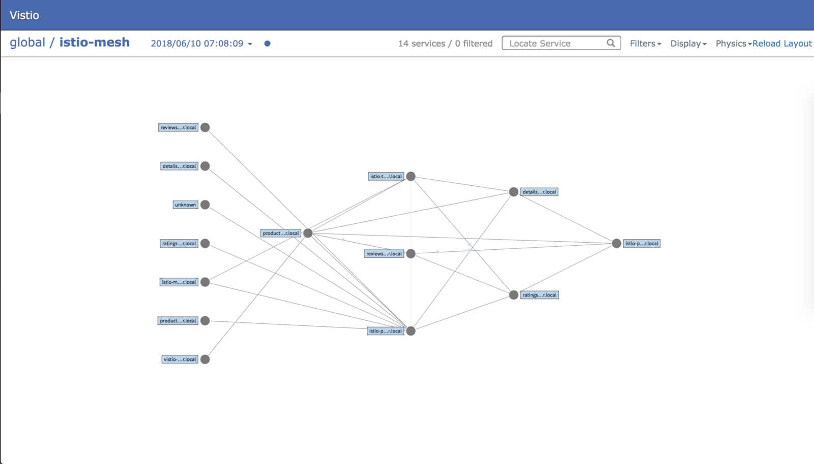
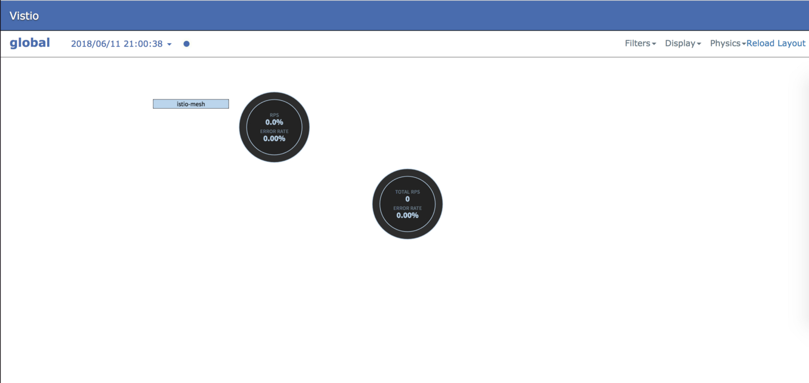

本文为翻译文章，[点击查看原文](https://itnext.io/vistio-visualize-your-istio-mesh-using-netflixs-vizceral-b075c402e18e)。

Vistio GitHub 地址：https://github.com/nmnellis/vistio

[Vizceral](https://github.com/Netflix/vizceral)是 Netflix 发布的一个开源项目，用于近乎实时地监控应用程序和集群之间的网络流量。Vistio 是使用 Vizceral 对 Istio 和网格监控的改进。它利用 Istio Mixer 生成的指标，然后将其输入 Prometheus。Vistio 查询 Prometheus 并将数据存储在本地以允许重播流量。

Vizceral 有两个可视化级别，全局可视化和集群级别可视化。在全局范围内（如上所示），您可以通过 Istio Ingress Gateway 等入口点将从 Internet 到 Istio 服务网格网络的网络流量可视化，或者您可以在 Istio 服务网格网络中显示总网络流量。

在集群级别（如下所示），您可以可视化内部网格的流量。通过设置警告和错误级别警报，当应用程序出现问题时可以被快速检测出来。



### 在 Istio 服务网格中安装 Vistio

**依赖**

- Prometheus
- Istio 0.7 或更高版本

**假设**

以下 Demo 使得这些假设更容易部署。如果您的环境设置不同，则可能需要将代码下载到本地并编辑一些文件。

- Prometheus 部署在`istio-system` namespace 下，可以通过[http://prometheus.istio-system:9090](http://prometheus.istio-system:9090/)地址访问
- Istio mixer 启用了`istio_request_count` metric
- Kubernetes 集群包含有`standard` StorageClass
- 为了便于部署已安装了 Helm（可选）

**前言**

如果您还尚未部署服务网格，可以按照此[Istio Bookinfo Demo](https://istio.io/docs/guides/bookinfo/)中的说明部署 Istio 及其示例应用程序。您需要能够在应用程序之间生成流量。要测试指标是否从 Mixer 正确发送到 Prometheus，您可以运行以下 Prometheus 查询`istio_request_count`，应该会看到多个条目。


### 部署 Vistio

您可以选择说过 kubectl 或者[Helm](https://github.com/kubernetes/helm)来部署 Vistio，下面会分别介绍两种部署方式。有些变量可能需要根据您自己的环境来修改。

**下载 Vistio（可选的）**

如果你想通过 Helm 部署 Vistio，你将需要在 GitHub 上下载项目来获取 Helm 模板。此外，如果上述假设之一不符合您的需求（例如 prometheus url 不同），则应手动签出并编辑文件。

```bash
git clone https://github.com/nmnellis/vistio.git
```

**使用 kubectl 部署**

```bash
kubectl apply -f https://raw.githubusercontent.com/nmnellis/vistio/v0.1.2/vistio-mesh-only.yaml -n default
```

**使用 Helm 部署**

切换到 Vistio 项目的根目录，运行`helm install`。

```bash
helm install helm/vistio -f helm/vistio/values-mesh-only.yaml --name vistio --namespace default
```

### 验证和暴露 Vistio Web/API

验证应用程序已经启动并在运行。使用`kubectl port-forward`命令暴露应用程序。

**验证 vistio-api**

```bash
kubectl describe statefulset vistio-api -n default
```

**日志检查（可选的）**

您应该能够从vistio-api的日志中查看是否存在与Prometheus的连接/查询相关的错误。

```bash
kubectl logs -n default -c vistio-api $(kubectl -n default get pod -l app=vistio-api -o jsonpath='{.items[0].metadata.name}')
```

**验证 vistio-web**

```bash
kubectl describe deployment vistio-web -n default
```

**暴露 vistio-api**

我们使用`kubectl port-forward`将 vistio-api 暴露到<http://localhost:9191>。

```bash
kubectl -n default port-forward $(kubectl -n default get pod -l app=vistio-api -o jsonpath='{.items[0].metadata.name}') 9091:9091 &
```

**验证 vistio-api**

vistio-web 调用 vistio-api 来渲染服务网格。访问<http://localhost:9091/graph>您应该会看到类似下列的输出。


**暴露 Vistio**

在另一个命令行终端中，暴露 Vizcera UI 到<http://localhost:8080>。

```bash
kubectl -n default port-forward $(kubectl -n default get pod -l app=vistio-web -o jsonpath='{.items[0].metadata.name}') 8080:8080 &
```

**访问 Vistio**

如果一切都已经启动并准备就绪，您就可以访问 Vistio UI，开始探索服务网格网络，访问<http://localhost:8080>您将会看到类似下图的输出。



### 探索

在全局范围内，您将看到 Istio 网格内所有请求的总和。如果您部署了 istio-ingressgateway，则可以选择显示通过其他配置从网格外部接收的流量，参考[使用 Ingress Gateway 部署 Vistio](https://github.com/nmnellis/vistio#deploy-vistio-with-istio-ingress-gateway-helm)。

如果您点击 istio-mesh 气泡，您将能够查看您的网状网络。


在您的 Istio 网格中，您可以使用许多可视化工具来帮助您查明故障的应用程序。


使用屏幕右上方的过滤器可以快速过滤出错误率较高的应用程序。通过高级配置，当错误率超过特定值时，也可以触发警报。警报将显示给定应用程序的当前错误率趋势。

### 问题排查

访问<http://localhost:9091/graph>，如果您从 vistio-api 中看到以下输出，表示某些功能无法正常工作。正确的输出显示在教程上面。


**1.**  检查 vistio-api 日志中是否有错误——在大多数情况下，vistio-api 将记录与 Prometheus 通信时遇到的任何问题。

```bash
kubectl logs -n default -c vistio-api $(kubectl -n default get pod -l app=vistio-api -o jsonpath='{.items[0].metadata.name}')
```
**2.** 验证 Prometheus 查询——vistio-api 使用以下查询检索其数据。您应该确保 Prometheus 内部的数据都存在。

```bash
# Global Level Query
sum(rate(istio_request_count[1m])) by (response_code)
# Cluster Level Query
sum(rate(istio_request_count[1m])) by (source_service,destination_service,response_code)
```
**3.** 提交 Issue——如果遇到问题无法解决请提交 Issue：<https://github.com/nmnellis/vistio/issues>

