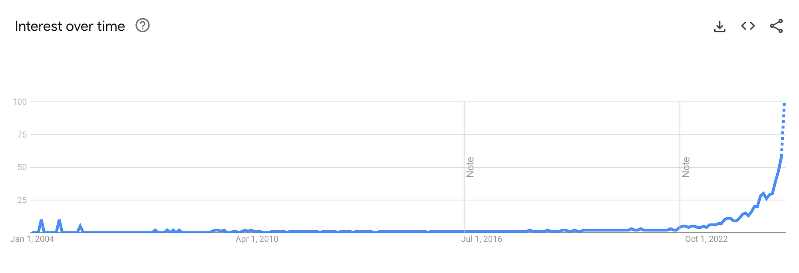
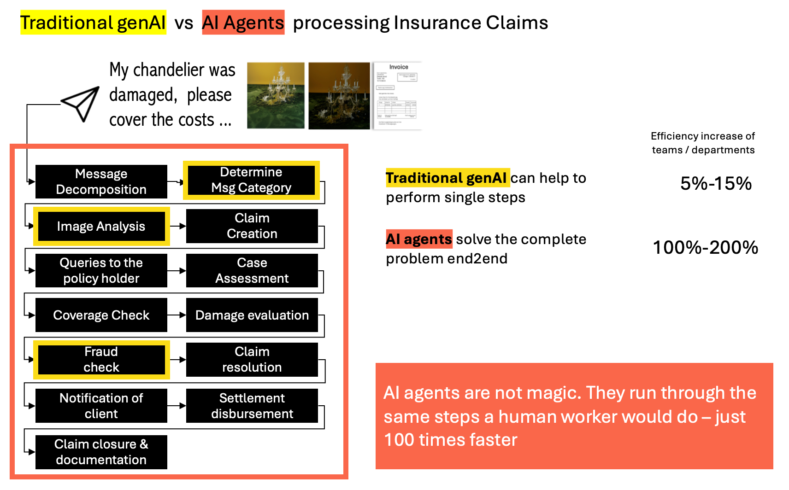
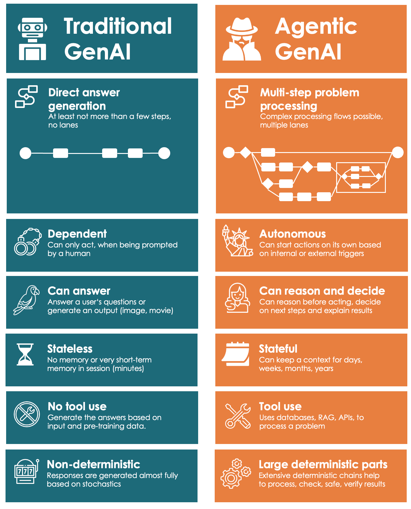
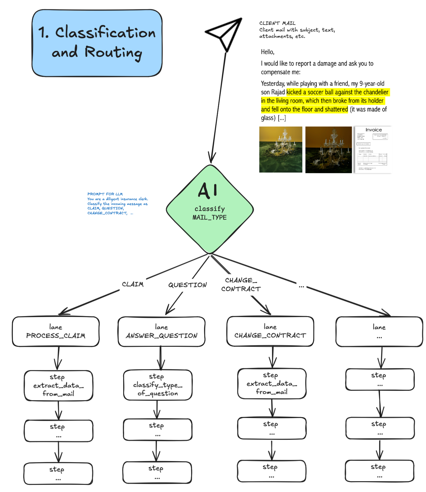
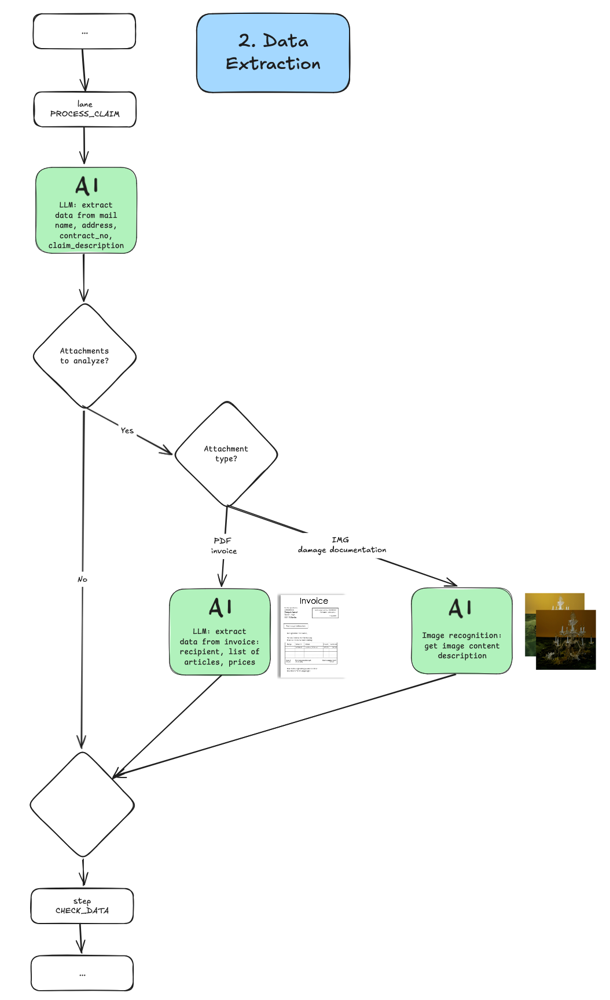
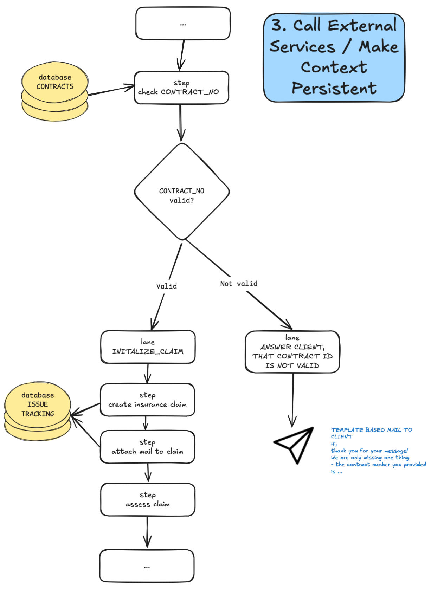
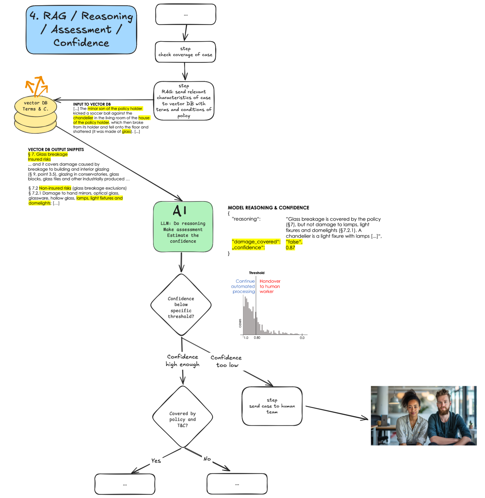
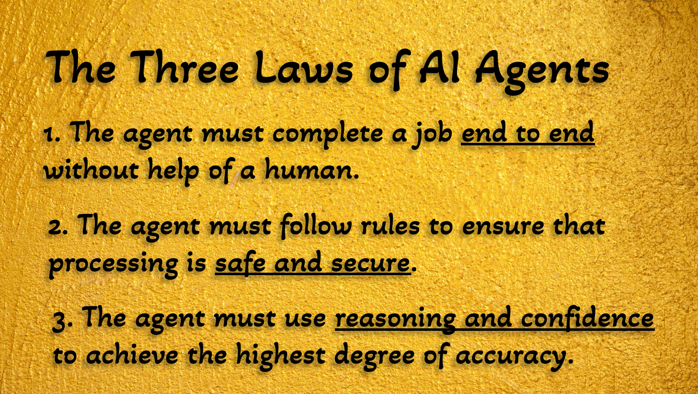

**下一件大事？** Gartner 认为 AI Agent 将引领未来。OpenAI、Nvidia 和 Microsoft 都在下注，就连在 AI 领域一直比较低调的 Salesforce 也开始布局。

这一趋势确实正在快速起飞。



“AI Agents” 在 Google Trends 上的搜索趋势（来源：trends.google.com）

## 什么是 AI Agent？关键词是 “Agency”

不同于传统的生成式 AI 系统，Agent 不只是回应用户输入，而是能够**自主处理一个复杂流程**，比如处理一个保险理赔请求：理解邮件内容、图像、PDF 文件，从客户数据库提取信息，比对条款、与客户沟通并等待对方回复（哪怕是几天后）——整个过程中不丢失上下文。

**它能自主完成这些操作**，无需人类实时干预。

## 咖啡机与咖啡师的比喻

相比 Copilot 这类工具“辅助”员工，**AI Agent 更像是一位可以独立上岗的“数字员工”**，可实现高程度的流程自动化。

**想象一下**，一个 AI 能够承担当前由人类员工或整个部门完成的复杂任务：

- 策划、设计、执行、评估并优化一场 **营销活动**
- 与物流公司、客户和仓库沟通以**追踪遗失的货物**，若找不到可发起索赔
- 每天**监控商标注册数据库**，发现潜在冲突后自动提起异议
- **汇总 ESG 报告所需数据**，主动向员工发起询问并校验信息准确性

目前的 AI 模型只能在流程中“协助”，而不能主导。**AI Agent 则能完成整个流程的执行**。



如上图所示，传统生成式 AI 协助团队完成流程（黄色），AI Agent 能从头到尾执行整个任务（橙色）。图片来源：Maximilian Vogel

**如果把传统模型比作高端咖啡机，Agent 则是咖啡师**。咖啡师不仅能做咖啡，还能招呼客人、点单、收银、洗杯子，甚至打烊关店。而咖啡机永远无法独自运营一家咖啡馆。

## 为什么 Agent 能胜任这些任务？

Agent 擅长在复杂流程中**掌控多个子流程**，能自主判断下一步应该执行什么任务。如果遇到问题，它知道该向谁请求帮助（缺咖啡豆就找老板，机器故障就联系售后）。



AI Agent 与传统生成式 AI 的比较。图片来源：Maximilian Vogel

## 一位 AI 员工的构成解剖

现在开始动手构建一个 AI Agent，基于上述保险理赔流程，我们来看每一步的设计。

我们的目标是构建业务架构与流程设计。由于篇幅原因，本篇不涉及具体代码实现。

### 第一步：分类并进入处理通道

流程从客户发送邮件报案开始。Agent 需要先**分析邮件内容，识别客户的意图**。

一旦分类完成，Agent 会将请求路由至正确的处理通道。通常这远不止是 function calling，而是涉及流程路径的选择与多个步骤的执行。



AI Agent 的第一步：对邮件进行分类并分发至对应处理路径。图片来源：Maximilian Vogel

### 第二步：提取数据

下一步，Agent 将**非结构化数据转化为结构化数据**，以实现安全、系统、规范的处理。

- 分类是将文本归入某个类别
- 而抽取是“读懂”数据并提取其中的关键信息

模型并不会直接“复制粘贴”，而是生成带格式的结果，例如将“(718) 123–45678”转换为“+1 718 123 45678”。



数据提取可以来自邮件文本、附件图片、PDF等。通常是多模型协作，包含 LLM、OCR 等模块。

示例输入（非结构化）：

```
Hi,

I would like to report a damage and ask you to compensate me...
```

输出（结构化 JSON）：

```json
{
  "name": "Deepak",
  "surname": "Jamal",
  "address": "123 Main Street, 10008 New York City, NY",
  "phone":"+1 718 123 45678",
  "contract_no": "HC12-223873923",
  "claim_description": "..."
}
```

### 第三步：调用外部系统并持久化上下文

普通生成式 AI 通常只能在会话中处理信息，Agent 则**需要访问并更新数据库与企业系统中的数据**。

例如：

- 查询合同号是否存在
- 将处理状态写入客服工单系统
- 向客户或外部方索要补充信息



图示：调用系统服务并实现上下文持久化。图片来源：Maximilian Vogel

### 第四步：判断、RAG、推理与置信度

行政流程的核心是**基于规则做判断**。这就需要引入 RAG（检索增强生成），通过向量数据库找出条款内容。

在判断前，我们引导模型“思考过程”，即 prompt 要求其先解释自己的推理过程。

好处包括：

- 给客户一个合理解释
- 帮助数据科学家分析模型是否“瞎猜”
- 判断模型的结果是否有理可循

设置“置信度阈值”也很关键：

- 若置信度低，交给人工处理
- 若置信度高，可全自动处理

阈值的设置影响系统的安全性与自动化程度之间的平衡。



AI Agent 的判断流程。图片来源：Maximilian Vogel

至此，如果你实现了以上 2~3 个步骤，你就构建了一个初级 Agent。

你可以使用 crewAI、langGraph、langFlow 等框架，也可以直接用 Python 编写。

根据实践，这种 Agent 可承担理赔部门 70%~90% 的工作量。这是传统生成式 AI 无法完成的。



AI Agent 的三大法则（致敬 Asimov 的机器人三定律）。图片来源：Maximilian Vogel

---

我的团队刚刚上线了一个大型物流系统，预计未来几个月我们将继续深耕 Agent 系统的开发。

祝你成功打造属于自己的 AI Agent！