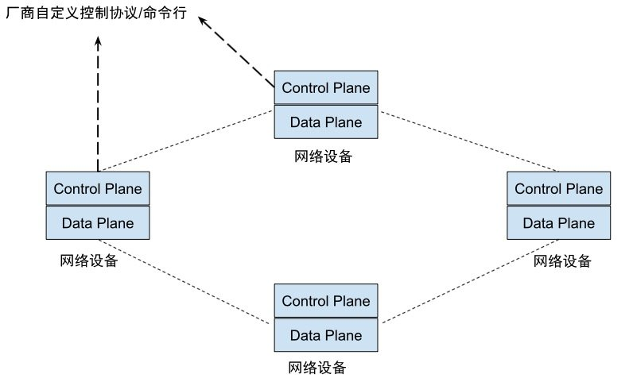
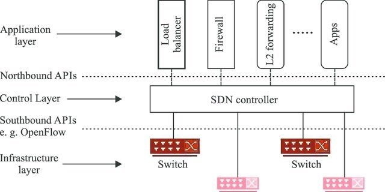
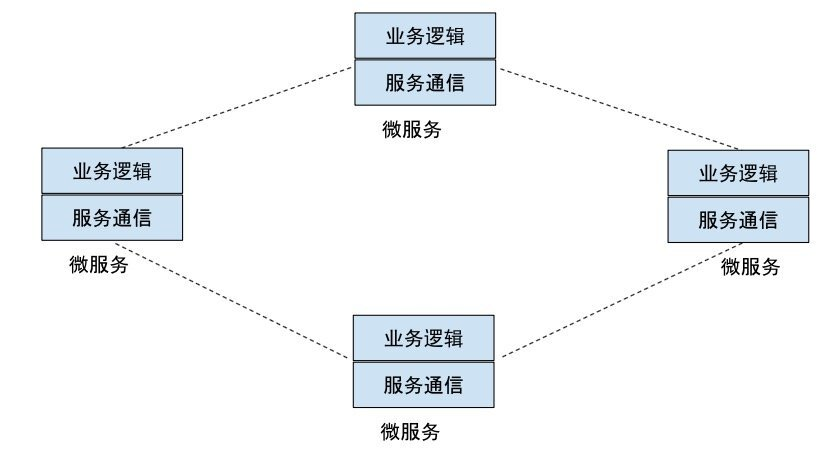
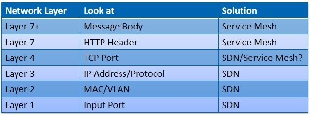
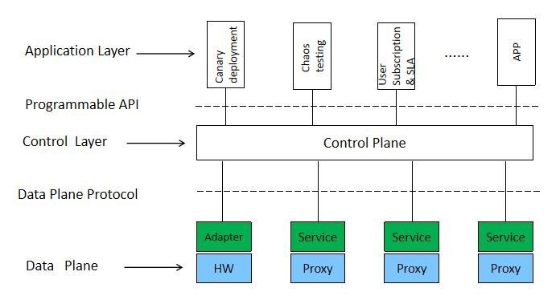
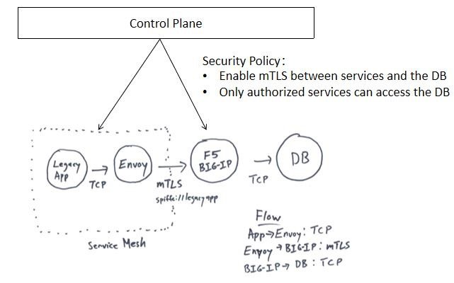
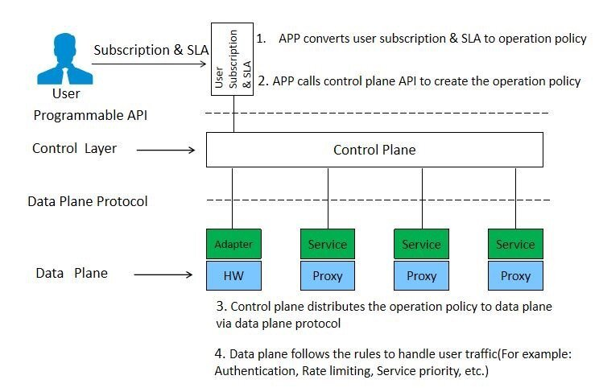

## 前言

如果具有通信或者网络行业的知识背景，那么你对 SDN(Software Defined Network) 一定不会陌生。你也许已经注意到，近来在微服务领域兴起的 Service Mesh 和 SDN(Software Defined Network) 非常相似，这两者都采用了软件对网络进行管理和控制，也都采用了包含控制面和数据面的类似架构。

那么 Service Mesh 和 SDN 有什么关系？Service Mesh 是下一代的 SDN 吗？Service Mesh 是否可以从 SDN 的发展历史中借鉴一些经验？本文将就这些问题进行一一探讨。

## 传统网络面临的挑战

首先我们来回顾一下 SDN 的起源。传统的 IP 网络是一个分布式的无中心架构，各个网络设备包含完整的控制面和数据面，单个设备通过网络协议探测网络中其他设备的状态，自主决定如何对流量进行路由。该架构的好处是容错性强，即使网络局部出现故障，整个网络也可以自主恢复，不会影响整个网络的运行。

这种去中心的架构在基于文本和图片的 web 浏览器应用时代运作良好，但随着互联网业务的爆炸式增长，各种各样的业务纷纷承载在了 IP 网络上，包括各种实时业务如语音视频通话，对网络提出了新的挑战。

* 缺少网络质量保证：绝大多数 IP 网络都是基于无连接的，只有基于大带宽的粗放带宽保障措施，缺乏质量保证和监控，业务体验较差。
* 低效的业务部署：网络配置是通过命令行或者网管、由管理员手工配置到网络设备上，并且各种网络设备之间的控制命令互不兼容，导致业务的部署非常低效。
* 缓慢的业务适应：业务由硬件实现，导致新业务的开发周期过长。需要持续数年的特性和架构调整、引入新设备，才能推出新的业务，无法快速适应市场，满足用户的需求。

## SDN 如何解决传统网络的问题

为了应对这些问题，提出了 SDN 的解决方案，SDN 的架构如下图所示：

从图中可以看到，SDN 从下至上划分为三层体系结构：

* 基础设施层（Infrastructure Layer）：是网络的数据平面，由各种网络设备构成，根据控制层下发的路由规则对网络数据进行处理和转发。
* 控制层（Control Layer）：是一个逻辑上集中的控制平面，维护了整个网络的信息，如网络拓扑和状态信息等，控制层根据业务逻辑生成配置信息下发给基础设施层，以管理整个网络的运行。
* 应用层（Application Layer）：通过控制层提供的编程接口，可以编写各种应用利用控制层的能力对网络进行灵活的配置。

SDN 的不同层次之间采用标准接口进行通信：

* 南向接口（Southbound API）：数据面和控制面的接口，控制面通过该接口将路由和配置下发到数据面，该接口一般使用 OpenFlow、NetConf 等网络协议。标准的南向接口解耦了控制层和基础设施层，只要支持标准南向接口的交换机都可以接入到 SDN 网络中，这样基础设施层可以大量采用支持 OpenFlow 协议的白盒交换机，解除了厂商锁定，降低了网络成本。
* 北向接口（Northbound API）：控制面向应用层提供的可编程接口，例如 RestConf 接口。利用控制面提供的编程接口，新的网络业务可以通过存软件的方式实现，大大加快了推出新业务的周期。

## 微服务面临的问题

在一个微服务系统中，各个独立的微服务之间采用远程调用进行通信。服务发现，请求路由等服务通信相关的功能以代码库的形式存在于各个微服务之中。

该架构也存在和通信网络类似的问题：

* 不同语言/框架的代码库版本中关于服务通信相关的配置完全不同，需要对不同的微服务单独进行配置，导致微服务的运维非常困难。
* 应用和服务通信之间的代码耦合导致修改或者增加新的服务通信功能需要修改并升级所有的微服务，如果需要引入新的运维功能，例如支持灰度发布等，则需要修改并升级所有微服务，代价非常大。

## Service Mesh 是下一代 SDN 吗？

从上面的分析可以看出，SDN 和 Service Mesh 面临的是类似的问题，既然都是解决类似的问题，那么 Service Mesh 是否可以看作下一代的 SDN 呢？ 

我认为答案是否定的，因为两者之间还是有显著的不同。SDN 主要面对 L1 到 L4 层，即网络层的基本转发和控制功能；Service Mesh 则主要面对 L7 层及以上，用于处理应用层的服务发现，服务路由等功能，但两者采用了相似的理念，我们可以把 Service Mesh 看作 SDN 的理念在应用层的扩展和实践。

Service Mesh 可以借鉴 SDN 的架构来解决微服务系统的服务通信的相关问题，如下图所示：

我们可以看到，基本上所有的 Service Mesh 实现都采用了类似上图的的架构，包括[Istio](https://istio.io)，[Linkerd](https://linkerd.io)，[Kuma](https://kuma.io)等。

在该架构中，数据面承担的是一个白盒交换机的角色，不管何种实现，其功能都是类似的，不存在太多争议，目前 envoy 已经成为数据面的标准实现，因此数据面和控制面之间也采用了 Envoy 的 xDS v2 作为标准的数据面协议。

各个 Service Mesh 项目的创新和争夺的战场主要在控制面上，Microsoft 等公司提出了采用 SMI（Service Mesh Interface）作为控制面的标准接口，虽然 SMI 得到了 Linkerd，HashiCorp, Solo.io 等一干公司的支持，但目前影响最大的 Service Mesh 项目 Istio 还未对此进行表态。缺乏统一的控制面标准，控制面之上的应用层生态目前还没有发展起来，基本没有看到有项目对应用层进行宣传。

## 统一管理硬件设备和 Envoy

SDN 给 Service Mesh 带来的一个重要启发是控制面对数据面各种网络设备的统一控制，那么是否可以采用 Service Mesh 控制面对硬件设备和软件代理进行统一控制呢？

F5 网站上提供了一个[F5 Big IP 和 Istio 集成的案例](https://aspenmesh.io/2019/03/expanding-service-mesh-without-envoy/)。在该案例中，
Service Mesh 中的微服务需要和一个外部数据库系统进行通信，为了对数据库进行保护，在数据库前放置了一个 F5 Big IP 设备作为反向代理，并进行下述配置：

* Service Mesh 中的微服务通过 F5 Big IP 作为代理和后端的数据库通信
* F5 Big IP 和微服务之间采用 mTLS，F5 Big IP 和数据库之间采用 Plain TCP
* F5 Big IP 采用 spiffe 对微服务进行身份认证，只允许需要访问该数据库的微服务的请求通过

F5 的该案例证明了 Service Mesh 和 F5 设备之间集成的可能性，但是需要在 F5 Big IP 设备上进行一系列复杂的配置操作，包括开通服务端口，配置 TLS 证书，设置认证和访问策略等等。如果 Service Mesh 控制面可以将 F5 设备也纳入统一控制，通过控制面统一下发规则，则可以极大简化网络的配置工作，加快业务下发的敏捷性。

## 利用控制面接口开发应用

SDN 的另一个优势是可以通过控制器提供的北向接口快速开发各种 SDN 应用，而不需要对硬件进行升级，这种模式加快了新业务上线的周期，鼓励各种创新业务蓬勃发展。目前 Service Mesh 在应用方面尚未有太多实践，但从 SDN 的发展历程来看，Service Mesh 应用层有极大的发展空间。

下图是一个利用控制面接口开发的用户业务订阅及 SLA 管理的 APP 示例：

1. 用户通过 APP 管理界面订阅服务，并设置 SLA（服务水平协议），包括服务的请求次数，服务的响应时间等等
1. APP 将用户订阅及 SLA 约定转换为运维策略，调用控制面提供的编程接口下发给控制面
1. 控制面将运维策略转换为数据面标准协议下发给数据面的代理，在代理上，运维策略被转换为代理的配置和转发策略
1. 代理在收到用户请求时，根据用户标识对用户进行认证，并根据配置和路由策略对用户请求进行处理，例如根据 SLA 处理用户请求的限流策略，系统忙时优先转发高 SLA 等级的用户请求，等等。

上面只是一个非常简单的应用示例。通过对 Service Mesh 控制面提供的流量控制，安全策略，拓扑信息、性能指标等基本能力进行组合，并加以创新，可以创建大量端到端的高附加值业务，例如支持业务平滑升级的灰度发布，测试微服务系统健壮性的混沌测试，微服务的监控系统等等。

## 总结：他山之石，可以攻玉

SDN 和 Service Mesh 的出现都是为了解决类似的网络通信问题，两者都采用了“数据面 + 控制面”这种类似的架构，但位于网络协议的不同层次。Service Mesh 并不是下一代的 SDN，但通过借鉴 SDN 的发展经验，Service Mesh 也许可以向下面这些方向发展：

* 北向接口：北向接口面向业务和运维，具有较高的抽象层次，比较容易提取统一的控制面标准。目前已经有多个公司支持采用 SMI 作为统一的控制面标准。但 SMI 的发展也存在一些挑战，例如如何避免 SMI 成为不同 Service Mesh 实现之间的最小公共子集，如何扩展支持除 HTTP 之外的其它应用层协议？
* 南向接口：Envoy 的 xDS v2 已经成为了南向接口的事实标准，但 xDS 接口包含有较多实现相关内容，例如 Listener, Filter 等，这些限制是否会妨碍 Envoy 之外的其它兼容数据面实现？
* 对硬件的控制能力：Service Mesh 控制面可以提供对数据面软硬件的统一控制能力，以减少软硬件混合环境下的运维复杂度。
* 应用层的发展：通过北向接口（控制面编程接口）提供出来的能力，可以开发各端到端的创新应用，这也许会成为 Service Mesh 的下一个热点。

备注：本文来自于 Service Mesher Meetup 成都站的话题分享 [Service Mesh 是下一代 SDM 吗？](https://zhaohuabing.com/slides/what-can-service-mesh-learn-from-sdn-servicemesher-meetup-20191026.pdf) 点击链接可以下载[演讲稿](https://zhaohuabing.com/slides/what-can-service-mesh-learn-from-sdn-servicemesher-meetup-20191026.pdf)。
