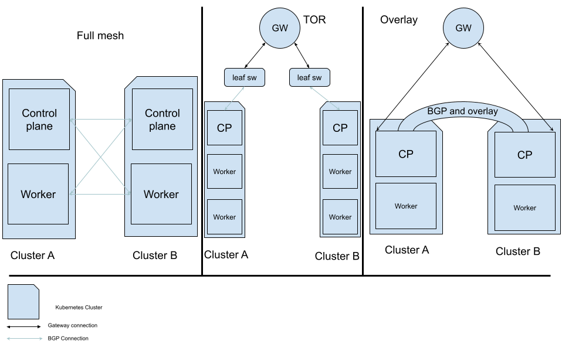
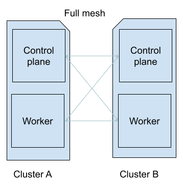
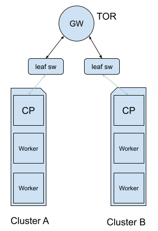
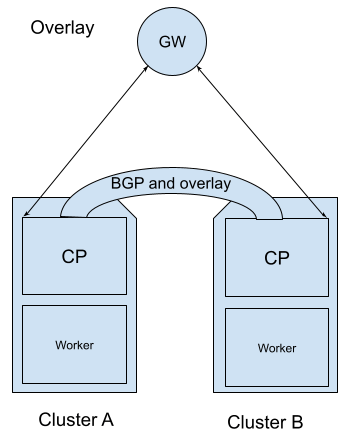
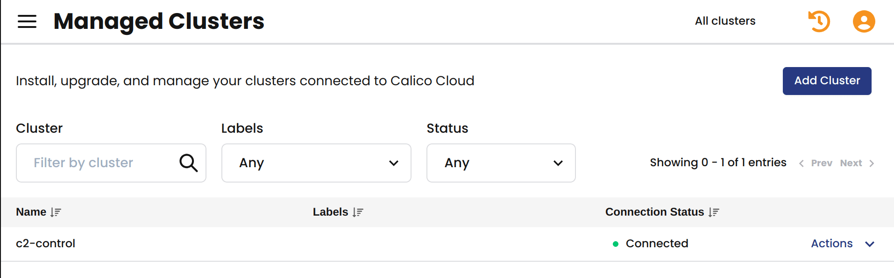
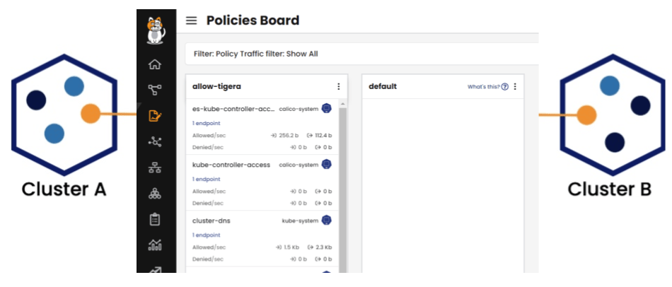

Kubernetes 是构建灵活可扩展基础设施以运行动态工作负载的优秀解决方案。然而，随着我们的集群扩展，我们可能会面临同时扩展和管理多个集群的不可避免情况。这个概念可能会给我们的日常工作负载维护带来很多复杂性，并增加在所有环境中保持所有策略和服务的最新性的难度。在这种情况下，[集群网格](https://www.tigera.io/blog/using-calico-to-create-a-kubernetes-cluster-mesh-for-multi-cluster-environments/) 可以在这些集群之间建立无缝的连接，并将工作负载集成到统一的网络环境中。

集群网格是连接独立 Kubernetes 集群并在不同集群中的资源之间提供连接性的绝佳方式，以提供超出单个集群情况下可能的容错性和高可用性。

在本博客文章中，我们将引导你完成构建多集群环境并建立集群网格所需的步骤，利用 Calico Open Source 的多功能能力。我们将探讨不同的方法，如顶级机架 (TOR) 和 overlay，以建立集群网格，解决不同环境提出的独特网络挑战。这是可能的，因为 Calico 提供了建立多集群环境的多种方法，灵活适应你的网络基础设施和特定要求。此外，我们还将介绍如何加入 DNS 连通性以增强集群间通信。

随着你的集群网格环境扩展，我们将讨论涉及[联邦](https://www.tigera.io/learn/guides/kubernetes-security/kubernetes-federation/)和使用 Calico Enterprise 进行多集群管理的下一步，以及涉及联邦集群。我们将展示 Calico 如何提供多集群管理平面，允许在集群间无缝实施安全性和可观测性。

最后，我们将涉及到 Calico Enterprise 联邦身份如何在[多集群](https://www.tigera.io/learn/guides/kubernetes-networking/kubernetes-multi-cluster/)环境中弥合差距，提供一种统一的方式来定制网络策略，可以引用来自不同集群的资源并构建跨集群边界负载平衡请求的服务。

## 什么是集群网格？

集群网格连接了两个或多个独立集群内部资源。通常，每个 Kubernetes 集群将为内部资源分配私有 IP 地址，除非将**节点端口**或**负载均衡器**服务与它们关联，否则这些资源对任何外部实体都不可见。然而，将资源暴露给所有人可能会带来安全风险，并破坏你应该保持的[零信任安全](https://www.tigera.io/learn/guides/zero-trust/zero-trust-security/)姿态，以保护你的环境。此外，它可以通过允许恶意用户利用漏洞并在关键服务中占据立足点来危及整个环境。

在多集群环境中建立集群网格提供了一种安全机制，用于促进集群之间的直接通信。这种通信可以通过指定的集群服务或私有 IP 地址进行，确保强大而受控制的交互，同时减轻了将内部资源暴露给更广泛网络的风险。

### 如何构建多集群环境并建立集群网格

以下图片说明了 Calico 如何在你的集群之间建立集群网格连接。

Calico 提供了不同的方式，你可以使用这些方式来构建多集群环境，从而提供了与你的网络基础设施和需求相匹配的灵活性。Calico 最好的部分是，在将两个集群连接在一起后，它将自动提供集群网格，你可以通过使用它们的内部集群服务和 IP 地址开始在不同的集群中使用资源。

### 在扁平网络环境中的集群网格

集群网格的配置可以根据底层基础设施的不同而变化，但其基本目的保持不变，实质上是用于建立独立集群之间的连接。

例如，在我们的集群的参与节点通过广播域直接连接的环境中，我们可以通过传播内部路由到外部实体的路由协议来快速建立一个网格。这将允许我们广告内部路由，而无需通过**节点端口**服务将它们暴露给我们的目标服务。

以下图片说明了扁平网络的常见设计：

考虑观看我们的视频，[使用 Calico 开源进行 Kubernetes 的 BGP](https://www.youtube.com/watch?v=PefluN8YM9o&ab_channel=ProjectCalico)，以了解使用全网格方法部署集群网格的全面教程。

### 在企业或云网络环境中的集群网格

在复杂的网络环境中，例如云或企业网络，形成集群的基础设施资源通常分为单独的广播域。这是因为这些域中的每个实体都被要求通过网关来到达其目的地。但是，默认情况下，这个额外的跳跃（网关）需要了解我们在 Kubernetes 集群中创建的内部集群资源。因此，网关会丢弃前往这些内部资源的数据包，使简单的路由方法无法满足要求。

以下图片说明了复杂网络环境的常见设计：

既然我们知道了问题，让我们看看如何利用 Calico 来解决这个问题。

为了在这样的环境中建立集群网格，我们可以使用两种方法：

- 顶层机架（TOR）
- overlay

#### TOR 方法（推荐）

在企业或云环境中，资源通常通过中间网关互连。通常，我们建议我们的客户使用 TOR，因为通过与云提供商自动建立路由传播机制来使你的集群了解你监管下的所有云资源，从而使你的集群具备高可用性。这也在云提供商的底层网络基础设施上发挥了作用，从而使你的集群在网络基础设施的支持下具备高可用性。

假设你可以配置云网关并将其与像 Calico 这样的强大的[容器网络接口（CNI）](https://www.tigera.io/learn/guides/kubernetes-networking/kubernetes-cni/)配对，那么你可以利用 BGP 路由来建立集群网格。Calico BGP 集成提供了动态路由，允许你将内部 Pod 和集群 IP 路由传播到网络基础设施中的其他资源。

以下图片说明了支持 BGP 的云环境的常见设计：

在许多情况下，TOR（顶层机架）提高了高可用性和容错性。这种方法优化了网络流量分布，减轻了单点故障，并进一步增强了你的基础设施的可靠性和弹性。

注意：要了解使用 TOR 方法部署集群网格的详细指南，请查看[此处](https://docs.tigera.io/calico/latest/networking/configuring/bgp#top-of-rack-tor)的教程。

#### IPIP overlay

在某些情况下，你可能无法访问网关以修改其设置，或者它可能不支持 BGP 对等连接。在这种情况下，你可以使用 IPIP overlay 来封装流向目标集群的流量。overlay 网络允许网络设备在底层网络（称为底层）上相互通信，而底层网络不需要了解连接到 overlay 网络的设备。

注意：如果你想了解更多关于 overlay 网络的信息，请单击[此处](https://docs.tigera.io/calico/latest/about/kubernetes-training/about-networking#overlay-networks)。

#### VXLAN overlay (Calico Enterprise)

即将发布的 Calico Enterprise（3.18+）版本将在多集群环境下启用 VXLAN 网络。这种方法的一个显著优势之一是能够使用身份感知策略来保护跨集群的流量（你将在接下来的联邦部分了解有关此功能的信息）。通过其多集群网络功能，Calico Enterprise 自动扩展 overlay 网络，以在集群之间建立 Pod IP 路由。

在使用 VXLAN 的 Calico Enterprise 集群网格设置中，每个集群都充当本地集群和远程集群，本地集群配置为从远程集群的加密通道中检索端点和路由数据。VXLAN 集群网格提供了一种安全、可扩展和高效的解决方案，用于管理多集群网络，实现了跨集群的无缝通信和身份感知策略强制执行。

注意：如果你想了解有关 VXLAN overlay 的更多信息，请单击[此处](https://www.tigera.io/news/tigera-introduces-powerful-enhancements-to-calico-open-source-and-calico-cloud-to-elevate-security-scalability-and-performance/)。

以下图片说明了没有 BGP 能力的云环境的常见设计：

注意：要了解使用 TOR 方法部署集群网格的全面指南，请查看[此教程](https://youtu.be/rv-DnExi6SM?t=2287)。

### DNS 连接

在建立多集群之后，各个集群可以在 IP 级别进行通信。然而，根据你的网络规模以及 Kubernetes IP 地址的性质，这些地址可以随时动态更改，因此你需要实现一种更容易建立这些集群之间连接的方式。域名解析可以成为你的集群网格的重要补充，允许更容易进行集群间通信。

在大多数 Kubernetes 部署中，CoreDNS 作为负责解析集群域名的主要工作负载。要将 DNS 与集群网格无缝集成，只需对 CoreDNS 配置映射进行简单的修改即可。具体来说，你需要将其他集群的 CoreDNS 内部服务 IP 添加为转发器到你的配置中。

这个简单的调整使你的集群能够通过向其他集群发送查询来解析名称，并检索所需资源的相应 IP 地址。这种集成大大简化了集群网格内的通信，增强了整体连通性，并提高了管理效率。

注意：考虑观看[此视频](https://youtu.be/rv-DnExi6SM?t=2574)以了解有关 DNS 连接的全面教程。

## 联邦和多集群管理（下一步）

随着你的环境扩展，你可能会遇到多个团队必须同时在所有集群上工作的情况。多集群管理（MCM）通常解决的一个常见问题是以集中的方式处理来自不同集群的对象，包括网络策略、Pod、[合规性](https://www.tigera.io/learn/guides/kubernetes-security/kubernetes-compliance/)报告、可观测性和安全日志。

虽然从技术上讲，可以通过 kubectl 为每个集群手动创建策略、网络集和其他资源，但这种方法会在你的日常维护任务中引入相当复杂性，并可能为意外的凭据泄漏开辟一条途径。此外，与我们在前一节中探讨的类似，它反映了没有良好结构的多集群环境所面临的挑战，特别是在集群管理、网络、故障排除和可观测性方面。

### 使用 Calico Enterprise 进行多集群管理

Calico Enterprise 提供了一个 MCM 平面，通过在这些集群之间建立安全连接，实现了多集群的安全和可观测性。该架构还支持跨集群联邦[网络策略](https://www.tigera.io/learn/guides/kubernetes-security/kubernetes-network-policy/)资源，并为真正的集中式管理、可观测性和集群维护奠定了基础。

以下图像是列出所有已连接集群的 MCM 页面的示例。

MCM 的安全功能不仅限于集群的网络方面。由于 MCM 完全集成了 Kubernetes 基于角色的访问控制（RBAC），你可以制定授权，允许用户仅查看他们需要查看的信息。

注意：使用[这个](https://www.tigera.io/tutorials/?_sft_tutorial_product=calico-enterprise)实际操作的工作坊来了解更多关于多集群管理的信息。

### 利用 Calico Enterprise 的联邦身份和统一策略执行

Calico Enterprise 联邦将工作负载和服务端点与在集群之间共享的唯一身份关联起来。

联邦身份可以与网络安全策略关联，以创建引用位于不同集群中的端点的唯一资源，从而实现对集群间安全的无缝控制。

此外，通过联邦服务，你可以发现并与位于不同集群中的远程 Pod 互动。这两个关键功能使得可以创建精确、细粒度的安全控制，加强了跨多个集群的整体安全姿态。

通过实施联邦层和策略，你可以灵活地定义网络安全策略，这些策略可以普遍适用于所有集群，也可以专门针对一组定义的集群。这种方法提供了一种有效的手段，以在扩展部署以包括多个集群的同时扩展安全措施。通过将这些安全控制扩展到现有和新的集群，你有效地减少了策略的重复和简化了从创建到维护的整个过程。

## 结论

总结一下，集群网格连接不同 Kubernetes 集群中的内部资源。Calico 的灵活集群网格设置为在任何环境中连接到多个集群提供了构建块。

Calico Enterprise MCM、联邦和联邦策略强制执行成为多集群架构的缺失环节，允许无缝通信，同时优先考虑安全性。Calico 在这个领域的能力使你能够无缝提供多集群管理、可观测性、联邦服务和身份，从而使你的组织能够自信而高效地应对现代网络的复杂性。随着组织的继续扩展和扩大规模，整合这些策略将在塑造多集群环境的未来中发挥关键作用。
