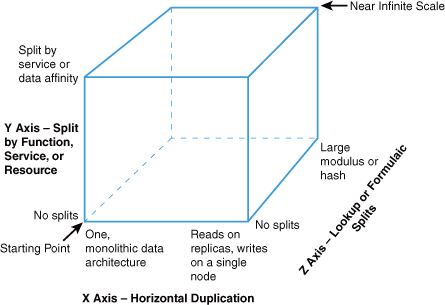

撰写这篇博客非常有趣，虽然它可能不受某些人欢迎，但这是一个必须讨论的话题。

亲爱的开发者朋友们，我们需要开诚布公地讨论一下微服务以及某些不适宜的使用场景。这个过程可能不会轻松，但我们必须进行这样的探讨，否则我们无法取得成功。

如今，微服务极为流行，它是一种优秀的架构风格，有助于扩展系统和组织架构。许多成功的公司都在使用微服务（例如 Netflix、Spotify 等），因此，大多数公司正在使用或计划使用微服务并不令人意外。然而，一些公司忽视了它带来的额外成本。

在深入讨论之前，让我分享一下我与微服务的经历。

## 起始 - 是微服务吗？

2012 年，在我当时的公司，我们面临一个挑战：如何使公司扩展到数千名工程师和增加 1000 倍的交易量。这篇文章不关注招聘、入职等方面，而是关注架构。

当时我在阅读《Scalability Rules: 50 Principles for Scaling Web Sites》，这本书介绍了 AKF Scale Cube。

我发现这个模型非常容易理解。因此，我用它来向其他人解释为什么我们需要在生产环境中运行不同的二进制文件。搜索模块的流量模式与购物车模块的流量模式完全不同。将这些组件分开是有道理的。此外，这也允许我们拥有多个独立、自主的团队。这将有助于我们面对公司扩大到数千名工程师的挑战。

当时我们并没有称之为微服务，只是服务。"微服务"这个术语还没有出现在我们的雷达上。在这一过程中，我们犯了很多错误。但从问题出发做出的决定，回顾起来，是正确的。

因此，你现在知道我对这个话题相当熟悉，而且在这 10 多年中，我在实施众多服务和进行大量重新架构方面有过很多经验。

## 那么，问题出在哪里？

从本质上说，微服务没有错。单体架构也没有错。但我们的行业似乎忘记了没有银弹。有时候，某些选择实际上可能会带来伤害。不相信？让我给你举几个例子。

#### 示例 1 - 你得到一个服务，他也得到一个服务，大家都得到一个服务

我喜欢与行业中的其他人交流，了解他们正在做什么并分享我的经验。这些对话是拓展人脉和从聪明人那里获得洞察的好方法。

我记得特别是和一家拥有约 200 人技术部门的创业公司的两位工程总监的一次对话。他们是令人难以置信的人物，非常聪明，也很好交流。

我通常喜欢深入了解技术领域，了解公司正在做什么以及主要的挑战是什么。因此，不出所料，我询问他们是否可以告诉我更多关于架构和团队组织方式的信息。

其中一位说他们在生产中使用了一个复杂的微服务系统。然后说他们在生产中运行了大约 350 个微服务。他们说的最大挑战是确保所有这些微服务得到维护——过时的依赖项，过时的运行时版本，对一些服务的内部了解不足等。

公司的微服务数量超过了开发人员数量。在那些为客户提供许多功能的以产品为中心的公司中，跟上所有这些微服务的步伐是很困难的。

#### 示例 2 - 你变我也变，大家都变

低耦合和高内聚很难做到正确。在微服务架构中做到这一点更是难上加难。你可能最终会得到一些非常小的微服务（也称为纳米服务），它们耦合紧密，内聚性低。

我记得在之前的公司中，一个“有界上下文”有许多小服务，任何变更都需要许多团队共同努力才能实现。更糟糕的是，性能非常差。

这个例子非常好，因为在此基础上，团队希望建立另一个服务来整合所有信息以提高性能。将小服务合并以增加内聚力的想法被认为是不好的，因为它看起来，我引用一下，"像一个单体"。

#### 示例 3 - 一切都好，直到不好

随着技术行业裁员的增多，我越来越多地听到公司在大幅裁员后还拥有太多服务的情况。

这可能不是一个公平的例子，因为谁能猜到公司会开始裁减其技术部门的 40% 或 60% 呢？问题是，简单是我们行业中最难的事情之一。但我们应该力求将事物保持在尽可能简单的状态，但又不能过于简单。

拥有简单系统的公司在生产中拥有更多的灵活性。他们可以削减成本和减少人员而不必过多担心运营负担。

#### 示例 4 - 让我们使用微服务开始我们的创业项目

这将是最后一个例子，我保证。这实际上来自一个我正在努力寻找的讲座——如果你知道我所指的是哪个讲座，请在评论中告诉我，以便我可以给予适当的致谢。

绿地项目很棒，对吧？它就像一块等待创意艺术家开始绘画的空白画布。在这种情况下，艺术家选择绘制一幅多彩的画作。艺术家挑选了所有主要颜色，Ruby、Golang 和 Java。他们将这些颜色与一些 Postgresql、Elasticsearch 和 Cassandra 混合在一起。

这幅画？如果他们能找到时间完成的话，它本可以成为一幅毕加索作品。

是否总是不好的？

我并不是说它不好。我相信 Jet.com 实际上是从使用微服务开始的，并且成功地被沃尔玛收购。我只是说我们作为工程师，需要进行批判性思考并选择最佳方案。

## 好的，但为什么？

有些人读到这里可能会想，“这是技能问题”。其实不是。在前两个例子中，我认识涉及的人。他们都是非常聪明的优秀工程师。我相信其他例子中的人也同样聪明。

我们可能已经内化了微服务的思维方式。这也许就是为什么我们看到如此多的小团队采用微服务的原因。这种思维方式深深地植入了我们的大脑。

零利率政策 (ZIRP) 也可能是罪魁祸首。ZIRP 可能确实促进了这一现象。公司希望增长，并且聘请大量开发人员成为大多数公司的标准选择。

在后 ZIRP 时代，我预期人们会更加意识到微服务的隐藏成本。即使微服务是解决手头问题的好方法，管理层可能也会更加不愿采用它。

## 你还有时间

如果上述任何例子反映了你的现实，请不要担心。软件的好处是你几乎总是可以改变它。如果你将其视为一个“问题”，试着将“问题”一词替换为“机会”——就像笑话中说的，我有一个喝酒的“机会”。

**你是否处于服务数量影响你创新能力的位置？** 制定一个策略，让你的公司可以减少运营开销。也许你可以放松对可靠性的要求，或者你可以投资简化系统架构，以便在未来拥有更多的创新能力。

第二个例子中的团队就是这样做的。他们提出了一个以节约成本和改善客户体验为重点的合并服务的策略。利益相关者非常满意。

**你是否正在创办一家公司？** 如果你正在创办一家公司并考虑使用微服务，请撰写一份设计文档，解释什么挑战，为什么选择微服务，以及你考虑过的替代方案。如果你有信任的人，分享这份设计文档并征求他们的反馈——如果你可以合法地这样做的话。这可能有助于澄清你的思路并清晰地了解微服务是否适合你的创业项目的正确架构风格。

微服务很棒，但它增加了你的系统和组织的复杂性。工作方式发生变化，架构变得更加复杂，如果你正从单体架构迁移到微服务，要理解这将需要多年时间。你需要在急于采用微服务之前停下来思考，它们将如何帮助你，又将如何伤害你...

而且相信我，它会同时带来伤害和喜悦，即使它是最佳的架构风格。就像生活中的每一件好事一样。

所以，亲爱的开发者们，我之所以开始这场对话，是因为我关心。我关心我们行业的未来。我希望我们的行业能长久、持续、可持续地建立能抵御时间考验的软件。我希望我们的行业能做出务实的决策，将技术作为手段，而不是目的。

有时候微服务很棒……但你可能并不需要微服务。