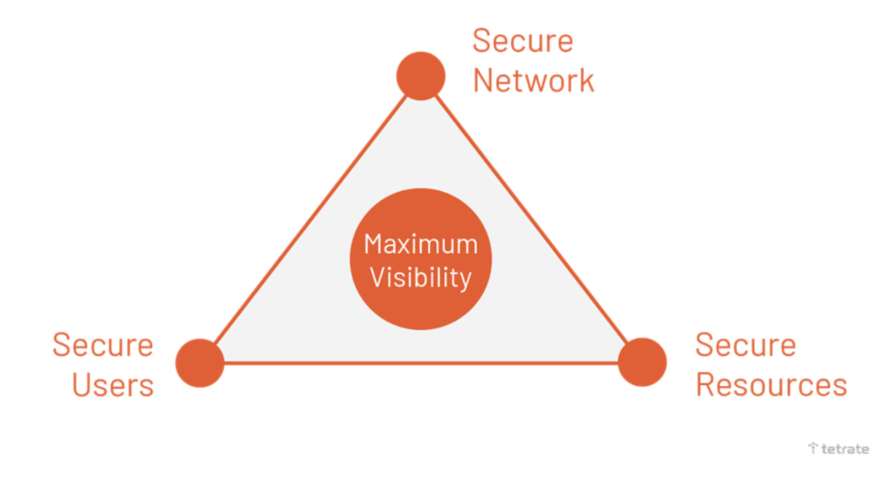

> **编者按**
>
> 本博客将向您介绍零信任网络及其基本要素，这是 CISO（首席信息安全官）必须考虑的，以使网络强大，在当今的数字转型中没有安全漏洞，并减少潜在的财务损失。

当今所有主要组织都在经历大规模的数字化转型，采用云、移动、微服务和容器技术来高效地提供服务，满足关键业务需求，赶上市场预期。企业的平台和 DevOps 团队必须对分布式和多云的应用程序和服务进行建模，以便随时随地进行访问，从而实现敏捷性。这在组织内部产生了两个重要的趋势：

1. 随着越来越多的组织采用多云，他们将其应用程序部署到公有云（谷歌、亚马逊、Azure 等），这意味着数据离开了他们所认为的安全的内部数据中心。
2. 企业使用微服务和分布式架构来实现大规模和敏捷。

然而，应用程序开发人员现在需要解决一系列新的可靠性和安全性问题，因为越来越多的依赖性是通过网络调用消耗的。当集中式系统在使用时，网络和端点安全在十年前很容易实现和管理。安全团队可以利用防火墙充分保障周边的安全。随着多云中的分散数据和微服务导致的分布式工作负载的新趋势，IT 安全组织需要评估他们的安全态势，并重新思考他们的网络架构。当然，安全不是一个人或一个部门的工作，它是一个组织中的 IT 安全、DevOps 和 Ops 团队的共同责任。

## 什么是零信任网络？

零信任是一个指导原则，它强调 IT 组织在构建网络架构时不信任任何个人、应用程序或设备。在这里，“零 "信任意味着" 不隐含 " 信任。企业 IT 部门不能假设外部和内部实体是值得信任的，或者对任何实体的安全风险进行一次性评估就足够了（实体可以是应用、人或流量）。

零信任通常与网络安全相关，因为只有在有数据交换的情况下，信任才会出现。零信任网络是一种通过认证和监控每个网络访问来识别任何外部实体的可信度的方法。

[点击下载零信任架构白皮书](https://www.tetrate.io/white-paper-zero-trust-architecture/)

## 为什么我们比以往任何时候都更需要零信任网络？

我们想强调零信任网络比以往任何时候都更重要的最常见原因。

### 云中的数据泄露现在很普遍

数据泄露事件在逐年上升，损害了公司的声誉。我仍然记忆犹新，一个分水岭事件是 2020 年的 Solarwinds 攻击事件。Solarwinds Orion 是一个基于 SaaS 的网络监控工具，它被入侵了，木马使用恶意软件攻击来掌握整个网络基础设施。虽然没有任何企业的敏感数据或文件被窃取等附带损害，但入侵是跨领域和跨地域的。即使是先进的公司，对云的网络钓鱼攻击和恶意软件攻击通常也很难发现，而且在未来可能会上升。根据 Verizon [最近的研究结果](https://www.verizon.com/business/resources/reports/dbir/2021/masters-guide/)，云计算漏洞已经超过了内部数据漏洞 ——2021 年 73% 的网络安全事件涉及外部云资产。而 CISO 的一个标准建议是尽快应用零信任网络的原则以避免安全漏洞。

### 分布式工作负载也不安全，由于运行时矢量攻击

虽然企业采用 Kubernetes 技术的速度比以往任何时候都快，但它们并不是 100% 安全的。Kubernetes 和容器化应用经常出现漏洞和黑客攻击的情况。根据 [2021 年 RedHat 的报告](https://www.redhat.com/en/resources/kubernetes-adoption-security-market-trends-2021-overview)，90% 的受访者在过去一年中经历了涉及其容器和 Kubernetes 环境的安全事件。

分布式系统失败的常见原因之一是 Kubernetes 集群在运行时（或实时）的矢量攻击，并带来了一系列新的安全挑战。如果黑客攻破一个 Kubernetes 容器，他们将试图攻破整个集群，这是一种复杂的矢量攻击。美国国家安全局（NSA）指出，黑客针对 Kubernetes 来[窃取数据和计算能力](https://www.zdnet.com/article/hacker-target-kubernetes-to-steal-data-and-processing-power-now-the-nsa-has-tips-to-protect-yourself/)。

根本原因往往是隐性信任，假设集群间的资源是可信的，集群内不安全的网络通信是安全的。

### 安全配置不是开发人员的核心能力

尽管 Kubernetes 给基础设施和应用交付领域带来了敏捷性和规模，但要确保安全是个挑战。有人可能会说，Kubernetes 中有一些固有的安全功能，如使用 ClusterRoleBinding 的 RBAC，Kubernetes 服务的 TLS 等，应该足够了。然而，Kubernetes 需要大量的配置来使工作负载免受外部和内部威胁。例如，在 pod 之间强制执行 TLS，在某些时候需要维护数百个 TLS 证书。

而那些已经专注于开发业务功能的开发人员可能不会优先考虑安全问题。红帽公司最近发布的一份关于 [Kubernetes 安全状况](https://www.redhat.com/en/blog/state-kubernetes-security)的报告显示，大型企业面临的安全事件大多与错误配置、重大漏洞有关，并遭遇到运行时安全事件。

### 应用程序的交付在 CI/CD 的帮助下获得了快速发展，而安全问题却没有

通过 CI/CD 流程、交付协调工具、GitOps 风格的部署，DevOps 团队加快了软件交付速度。许多组织可以每天将应用程序部署到生产中（如果需要，往往在几个小时内）。这种创新速度适合于组织的蓬勃发展和成长，但如果不注重强大的安全性和合规性，就会带来漏洞。

我们所接触的大多数组织都在他们的 DevOps 流程中逐步发展并开始采用 DevSecOps，将安全检查整合到他们的 SDLC 过程中。作为一种实践，他们的 DevOps 团队、合规经理、安全经理、网络管理员在部署前合作讨论安全要求和构建威胁模型。

## 实施零信任网络的关键因素

不同的安全组织、分析师和作者提出了许多框架。例如，Forrester 建议零信任扩展（ZTX 模型），并主张保护不同的数据管道以保护数据本身。Gartner 有一个概念，叫做持续适应性风险和信任评估（CARTA），它主要侧重于分析与身份和设备相关的风险态势。

我们相信，没有任何一个放之四海而皆准的框架能适用于所有的场景和所有的组织。我们为使用微服务范式开发和部署应用程序的企业提供一个零信任框架，以确保网络和应用程序的安全。

Tetrate 与[美国国家标准与技术研究所（NIST）](https://www.nist.gov/news-events/events/2022/01/zta-and-devsecops-cloud-native-applications-virtual)合作，为联邦机构开发标准，以便为其微服务实施零信任架构。

**你可以在 NIST 和 Tetrate 共同编写的 NIST 特别出版物中阅读在微服务中实现零信任的详细指南：《**[**微服务的安全策略**](https://nvlpubs.nist.gov/nistpubs/SpecialPublications/NIST.SP.800-204.pdf)**》、《**[**使用服务网格构建安全的微服务**](https://nvlpubs.nist.gov/nistpubs/SpecialPublications/NIST.SP.800-204A.pdf)**》、《**[**使用服务网格的基于属性的微服务访问控制**](https://nvlpubs.nist.gov/nistpubs/SpecialPublications/NIST.SP.800-204B-draft.pdf)**》、《**[**使用服务网格实现微服务的 DevSecOps**](https://nvlpubs.nist.gov/nistpubs/SpecialPublications/NIST.SP.800-204C-draft.pdf)**》和《**[**零信任架构**](https://nvlpubs.nist.gov/nistpubs/SpecialPublications/NIST.SP.800-207.pdf)**》。**

对于 CISO 和 CTO 来说，基于上述研究文件，我们主张采用持续安全框架，以实现其微服务和服务网格的零信任，避免数据泄露。在这个框架下，有 4 个关键因素需要考虑。

微服务的零信任网络框架

**1. 安全网络**

DevSecOps 团队的首要任务是确保网络和数据的完整性。到你的应用程序的流量可以来自任何地方：包括企业自有网络内部和外部。任何设备或请求都不应该被信任，不管它们是否属于企业网络。所有的通信都应该以加密、认证和授权的方式进行，以保护数据的机密性，防止恶意行为者从网络中窃取数据。

**2. 保障资源**

资源可以是小型应用（服务或工作负载），可以向网络内的其他应用发送流量。一个网络可能由多个服务组成，每个服务将通过网络使用 API 调用与其他服务对话，以执行某些业务功能和逻辑。在授予访问权以发送处理请求之前，必须根据已建立的资源身份，对每个服务的信任进行评估。认证和授权检查服务身份必须发生在一个会话中，而且服务不应该默认继承对所有资源的访问。

**3. 确保用户安全**

对一个应用程序的威胁可能是由内部或外部用户造成的。这就是为什么在授予访问权之前要通过适当的认证来评估每个请求者的可信度。就像保护资源一样，对用户的访问应该以完成任务所需的最小权限来授予，而且应该是基于会话的。当然，各种用户会根据他们的角色获得访问权限。DevOps 团队和安全部门应该谨慎地分配权限，定义角色，并对用户进行治理，以避免安全和合规性威胁。

**4. 最大限度地提高可见性**

为了实施零信任网络，IT 安全组织必须不断实时评估其 IT 环境的安全态势，特别是微服务。为了对任何安全事件做出反应，安全团队必须配备适当的信息和可见性，以加快诊断和分流。应该有一个适当的机制，从企业网络的资源中追踪和隔离损坏的或脆弱的资源或用户或设备。

## Tetrate Service Bridge（TSB）如何帮助开箱即用？

[Tetrate Service Bridge(TSB)](https://www.tetrate.io/tetrate-service-bridge/) 通过一个与云无关的集中式平台为所有从边缘到工作负载的应用和 API 实现安全、敏捷和可观察性。它为平台所有者提供所有环境的内置安全和集中的可见性和治理，同时授权开发人员为其应用程序做出本地决定。

TSB 通过为您的应用程序和云平台提供 FIPS 认证的构建，Istio 和 Envoy 的生命周期管理，以及其他增强功能以提高可用性，将 Istio 和 Envoy 增强为企业级服务网格。

Tetrate Service Bridge（TSB）位于应用边缘，负责控制所有计算集群的请求级流量、多云、Kubernetes 和传统计算集群之间的流量转换，并提供南北 API 网关功能。TSB 还提供了一个带有 [NGAC](https://www.tetrate.io/blog/unpacking-next-generation-access-control-ngac-and-tetrate-q/) 框架的全局管理平面，以定义安全策略和配置，获取遥测数据，并在整个网络拓扑结构中处理 Istio 和 Envoy 的生命周期。有了 TSB，安全团队可以将安全从应用代码栈中剥离出来，放在属于他们的透明网络层中 —— 避免开发人员为安全而耗费精力修改代码。

DevOps 团队仍然可以继续执行他们的计划，根据业务需求更快地将应用程序部署到多云中，而安全方面可以对微服务的安全策略进行集中控制。让我们看看 TSB 组件如何帮助实现安全。

微服务的零信任网络的 Tetrate 实现

TSB 提供保护您的资源、网络、用户和最大限度地提高可见性。

**1. 安全命名，用于服务间的授权，以确保资源安全**

由于 Tetrate Service Bridge（TSB）建立在 Istio 上，默认情况下它提供安全命名，以确保工作负载（VM 和 Pod）属于同一个微服务。TSB 为每个工作负载（VM 或 Pod）创建服务身份，并将信息存储在安全名称信息中。服务器身份在证书中进行编码，但服务名称是通过发现服务或 DNS 检索的。安全命名信息将服务器身份映射到服务名称。从（例如）服务 A 到服务名称 B 的身份映射意味着 "A 被授权与服务 B 对话”。

**2. 基于 mTLS 的服务认证，确保网络安全**

TSB 提供 Istio 点对点认证资源，以验证客户端与安全工作负载的连接。它使你能够通过 Envoy 代理在你的服务网格中实现 mTLS 认证，这是一个与每个服务一起工作的小应用程序（也被称为 sidecar 代理）。客户端 Envoy 代理与服务端 Envoy 代理进行握手，只有当相互的 TLS 连接建立后，流量才从客户端转移到服务器端。

基于 mTLS 的认证被称为点对点（P2P）认证，不需要改变任何服务代码。基于 mTLS 的 p2p 认证为每个服务提供了一个强大的识别，以实现跨集群和多云的互操作性。安全管理人员现在可以在 TSB 管理平面中定义基于 mTLS 的认证策略，对网络中的服务间的通信进行加密。有了安全的网络，就没有中间人攻击的机会。

TSB 提供了一个证书管理系统，自动生成、分发和轮换私钥和证书，以解密请求中的数据。

**3. 基于 JWT 的认证，以确保来自内部和外部用户的应用安全**

对于终端用户的认证，以验证附加在请求上的凭证，TSB 提供现有的 Istio 资源（也称为请求认证）。安全管理人员现在可以利用 Istio 资源，通过验证 JSON 网络令牌（JWT）来验证凭证。该令牌将有令牌的位置、发行者的详细信息和公共 JSON 网络密钥集。安全经理可以根据他们的组织标准指定认证策略和规则，TSB 将根据令牌与策略的匹配程度拒绝或接受用户请求。

由于 TSB 全局管理使用 Istio，它提供了灵活性，可以与您选择的认证供应商连接，如 OpenID Connect 供应商，例如，KeyCloak、OAuth 2.0、Google Auth、Firebase Auth 等。

**4. 对安全资源和用户进行访问控制的授权策略**

TSB 授权策略允许安全经理创建跨服务网格、命名空间和工作负载的访问控制。比如说，一个真实的用户已经进入了一个系统，但是应该限制他在该系统下采取任何行动。

安全经理现在可以使用单一资源定义工作负载之间和最终用户之间授权的细化规则（如允许、拒绝或自定义请求）；易于使用和维护。最重要的是，TSB 中的 Istio 授权策略支持通信框架，如 gRPC、HTTP、HTTPS 和 HTTP/2、TCP。

**5. 可观察性和实时可见性**

Tetrate Service Bridge（TSB）允许安全管理人员主动监控和测量微服务的完整性和安全态势。TSB 控制平面产生运行时遥测数据，帮助安全人员、网络管理员和 SRE 不断跟踪服务的行为。除了生成指标，TSB 还提供运行时的可观察性，如每个服务的流量和服务依赖关系。TSB 管理平面提供对信息的可见性，如谁被授权使用什么服务，什么被加密等。

安全团队现在可以看到每个服务是如何与其他服务互动的，在发生恶意攻击的情况下，他们可以迅速隔离被破解的应用程序，以免损害其声誉，然后准备发布补丁。此外，TSB 为选定的时间段生成审计日志，提供每个访问信息的方式、内容、时间和地点的完整视图。审计日志帮助审计人员和安全经理追踪潜在的安全漏洞或任何违反策略的行为，并帮助迅速找到问题的根源。

## 总结

如果安全团队能够保护网络，在每笔交易中验证服务和用户的身份，并获得 360 度的可见性，以便在发生事故时做出更快的反应，他们就达到了微服务的零信任。通过零信任架构，安全团队可以消除从网络中窃取数据（用户凭证、网络访问和横向移动能力）的风险。另一方面，终端用户可以获得一致的、稳定的，更重要的是安全的体验，无论他们在什么地方，使用什么终端，或者他们的应用程序是在企业内部还是在云中。

如果你对此感兴趣的话，你可以：

- 注册参加即将举行的关于 [ZTA 和云原生应用的 DevSecOps 的](https://www.tetrate.io/zta-devsecops-conference-2022/)安全会议
- 阅读更多关于 [TSB 提供的服务](https://www.tetrate.io/zero-trust/)如何[帮助您在微服务中实现零信任的信息](https://www.tetrate.io/zero-trust/)
- 下载我们的白皮书，了解[为什么使用 Istio 服务网格来实现零信任安全](https://www.tetrate.io/white-paper-zero-trust-architecture/)
