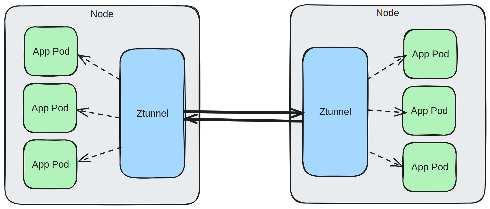
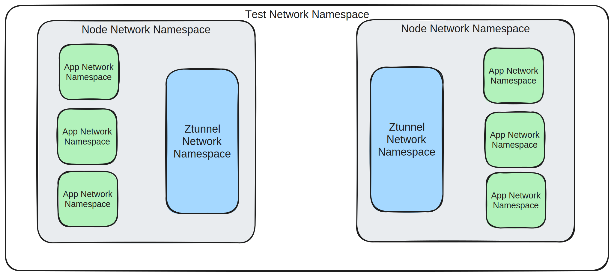
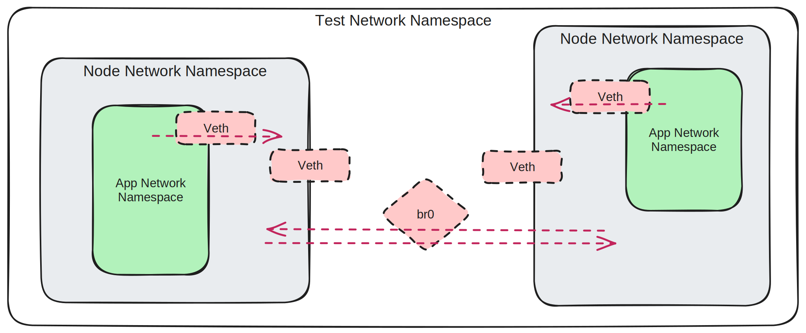

由于在开发过程中我[真的不喜欢等待](https://blog.howardjohn.info/posts/ideal-ci/)，所以在构建 Ztunnel（一个为 Istio 的新[Ambient 模式](https://istio.io/latest/blog/2022/introducing-ambient-mesh/)设计的底层网络代理）时，我的首要任务之一便是确保测试的快速进行（包括运行和编写测试），并且易于调试。

这一任务颇为棘手，因为在大多数真实场景中，Ztunnel 高度依赖 Kubernetes。虽然它能够完全独立于 Kubernetes 运行，但许多关键代码路径的行为完全不同，使得仅通过这种方式进行测试变得不可行。

下图为典型的 Ztunnel 部署架构：



在此架构中，用户将运行一个包含多个节点的 Kubernetes 集群。每个节点上都运行着一个 Ztunnel，配置了宿主机和每个 pod 的网络栈。

此外，Ztunnel 实际上进入了每个 pod 的网络命名空间，并代表其发送/接收流量。这一点非常奇特且酷炫，但也大大增加了测试的难度！（[详细信息](https://www.youtube.com/watch?v=cuMeEhpyH5s)）

## 加速测试

启动完整的 Kubernetes 环境、重建镜像、部署到每个节点的过程非常缓慢且难以调试。

黄金标准应该是将所有操作运行在一个简单的单一二进制文件中——仅需执行 `cargo test`。这种方式避开了复杂的设置和缓慢的重建，并使调试变得轻而易举（当然，你可以将调试器连接到正在运行的 pod，但这很麻烦）。

## 设置网络

如果我们去除无尽的抽象层，Kubernetes pods 实际上只是几个 Linux 命名空间和挂载的组合。Docker 在这方面管理得很好，[bash](https://github.com/p8952/bocker)也可以。

我们特别关注的是[网络命名空间](https://man7.org/linux/man-pages/man7/network_namespaces.7.html)，它可以实现网络栈的隔离。每个 pod 都有自己的网络命名空间，通过各种机制连接，允许与同一节点上的其他 pod、其他节点以及外部目的地通信。

好消息是创建网络命名空间非常简单。

```shell
$ sudo ip netns add testing
```

我们的最终目标是设置一系列的网络命名空间，外观与我们在 Kubernetes 上的真实架构类似：



在网络命名空间之间建立连接稍微复杂一些。像 [`cnitool`](https://www.cni.dev/docs/cnitool/) 这样的工具可以帮助我们完成（它实际上执行了一些 Kubernetes 环境中用于设置网络的相同逻辑，但作为 CLI 工具），但你也可以完全手动操作。我们选择了后者。

最终，我们的设置如下：

- 每个测试都拥有自己的网络命名空间，通过一个桥接设备（`br0`）来促进节点之间的流量。
- 每个节点配置了一个 `veth` 设备。一端成为节点上的 `eth0`，另一端连接到根命名空间中的 `br0`。
- 每个 pod 都配置了一个 `veth` 设备。一端成为 pod 上的 `eth0`，另一端位于节点网络命名空间中。
- 为每个 pod 设置路由以将流量发送到节点。
- 为每对节点设置路由，以实现跨节点流量。



除了根命名空间/桥接设备外，这与许多现实世界中的 Kubernetes 集群的运行方式相同（在现实世界中，根命名空间是两台机器之间的物理网络）。

你可以在[这里](https://github.com/istio/ztunnel/blob/34fce85a6a2b2a85eb170a04096731e2ea4e0e9f/src/test_helpers/netns.rs#L194)找到所有细节。

## 运行测试

一旦我们有了这些命名空间，我们仍然需要一种实际使用它们的方法。幸运的是，Linux 允许在运行时更改当前命名空间线程（这是接下来重要的内容）。这让我们建立了一个基本的帮助函数（真实的代码稍微更复杂）：

```rust
fn run_in_namespace(namespace: Namespace, f: Fn()) { let original_namespace = get_current_namespace(); namespace.enter(); f(); original_namespace.enter(); }
```

有了这个，我们可以轻松地从任意的“pods”或“nodes”执行代码。

然而，我们仍然面临一个问题。我们的所有代码都运行在 [tokio](https://tokio.rs/) 异步运行时中，它会根据需要将我们的各种任务安排到物理操作系统线程上（类似于 Go 运行时的工作方式）。由于网络命名空间是线程相关的，所以当我们的任务在线程之间跳转时，这一切都会崩溃。

幸运的是，Rust 给了我们比 Go 更多的关于异步运行时的灵活性——我们可以同时拥有多个！借此，我们能够构建一个能够异步执行 `run_in_namespace`。对于我们想要执行的每个函数，我们启动一个新线程并构建一个专用的单线程异步运行时来处理它：

```rust
async fn async_run_in_namespace(namespace: Namespace, f: async Fn()) { thread::spawn(move || { run_in_namespace(namespace, || { let rt = tokio::runtime::Builder::new_current_thread().enable_all().build(); rt.block_on(f()) }) }); }
```

我们为每个命名空间运行一次这个函数，因此这里的开销是最小的。如果我们想要运行许多小函数，可以在顶层构建一个抽象来发送工作到线程以执行。

我们需要的最后一件事是一种合理的方法来识别如何调用每个目的地。虽然它们都会被分配一个 IP（基于我们代码中的简单 IPAM 策略），但我们不希望每个测试都必须猜测 IP。为了处理这个问题，我们构建了一个简单的名称解析器。这就像 DNS，但简单得多：对于我们创建的每个“pod”，我们记录一个`name -> IP`的映射，并允许查找 IP。

将所有这些放在一起，一个简单的测试启动了3个 pods（客户端、服务器和 ztunnel）在一个单一节点上看起来像这样：

```rust
#[tokio::test] async fn simple_test(){ let ztunnel = manager.deploy_ztunnel(DEFAULT_NODE).await?; let server = manager .workload_builder("server", DEFAULT_NODE) .register() .await?; run_tcp_server(server)?; let client = manager .workload_builder("client", DEFAULT_NODE) .register() .await?; run_tcp_client(client, manager.resolve("server"))?; // ... some assertions here }
```

## 放弃权限

上述设置效果很好，但也带来了一些问题。

基本上设置的每一步都需要提升的 root 权限；这让简单的 `cargo test` 案例的开箱即用变得乏味，通常也不可取。

此外，这会在主机环境中污染大量的命名空间。虽然我们有一些清理过程，但这些并不是100%可靠，可能会导致悬挂的命名空间阻碍未来的执行。

解决拥有太多命名空间的问题的方法？更多的命名空间！为此，我们需要的不仅仅是网络命名空间。

[用户命名空间](https://man7.org/linux/man-pages/man7/user_namespaces.7.html) 允许我们实质上假装是 UID 0 (root)，同时实际上将其映射回我们原始的 UID。这里的力量在于，在该命名空间中，我们可以做一些本来需要 root 权限的事情——特别是创建新的网络命名空间。

然而，我们不能做的一件事是修改主机-root 拥有的文件（这将是明显的权限违规）。尽管我们可能可以绕过它们，但我们在测试中使用的很多工具喜欢触摸 root 文件。这再次可以通过 [mount 命名空间](https://man7.org/linux/man-pages/man7/mount_namespaces.7.html) 解决，它允许我们将我们拥有的文件绑定挂载到主机-root 拥有的文件上，而不会影响命名空间外的事物。

将所有这些放在一起，我们有这样的东西：

```rust
let original_uid = get_uid(); // 首先，进入一个新的用户命名空间。 unshare(CloneFlags::CLONE_NEWUSER).unwrap(); // 将用户命名空间中的 root 映射到我们原始的 UID File::create("/proc/self/uid_map").write(format!("0 {original_uid} 1")); // 设置一个新的网络命名空间 unshare(CloneFlags::CLONE_NEWNET).unwrap(); // 设置一个新的挂载命名空间 unshare(CloneFlags::CLONE_NEWNS).unwrap(); // 将一个文件夹在我们的每个测试目录中挂载到 /var/run/netns mount(tmp_dir.join("netns"), "/var/run/netns", MS_BIND); // 一个方便手动调试的好帮手信息，如果需要的话。 let pid = get_pid(); eprintln!("Starting test in {tmp_dir}. Debug with `sudo nsenter --mount --net -t {pid}`");
```

如上所述，一个技巧是，进入命名空间是按线程进行的。我们需要在生成任何额外线程之前设置这一点。

Rust 实际上为我们提供了这样做的能力，但这意味着我们失去了 `#[tokio::test]` 宏帮助。我们可以写自己的宏，但这有点痛苦。幸运的是，通过 [链接器的花招](https://crates.io/crates/ctor) 我们可以迫使我们的代码在进程执行的非常早期运行。

Go 中的类似方法也有效（请参见 [我写的帮助库](https://github.com/howardjohn/unshare-go)），实际上在那里是必需的，因为设置必须在 Go 运行时启动之前完成（这通常在任何用户代码运行之前很久）。

## 总结

有了所有这些设备，一个完整的测试只需要大约 200 毫秒。一切都在一个单一进程中运行，使调试变得轻而易举。所有的测试也都是完全隔离的，因此可以完全并行运行测试（包括相同的测试，用于压力测试以消除测试缺陷）。
