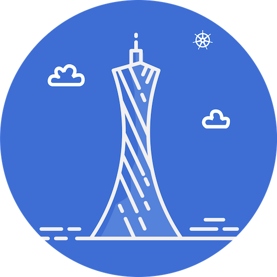

## 广州站简介

广州站成立于 2020 年 8 月，社区成员 100 多人。我们致力于汇聚广州当地优秀云原生人才，连接云原生开源社区与开发者，通过举办丰富的线上和线下的活动，促进云原生技术交流和推广！同时我们欢迎广州云原生企业和开发者加入，积极参与共建社区。

## 站长

- 张晓辉
- 周继海
- 韦正清

## 广州站徽章

广州站专属 Logo 融合了地标建筑广州塔和 Kubernetes Logo。

广州塔，广州新八景之一，也是广州精神的象征。寓意广州社区以开放、进取、拼搏的态度拥抱云原生，促进云原生的繁荣。