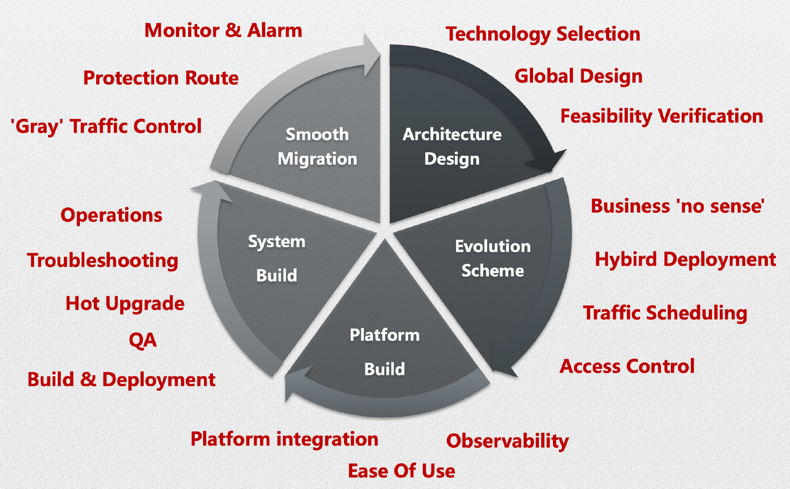
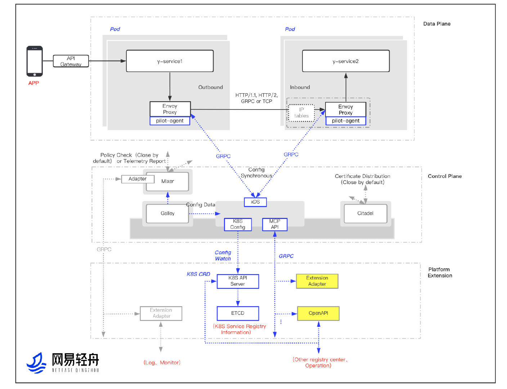
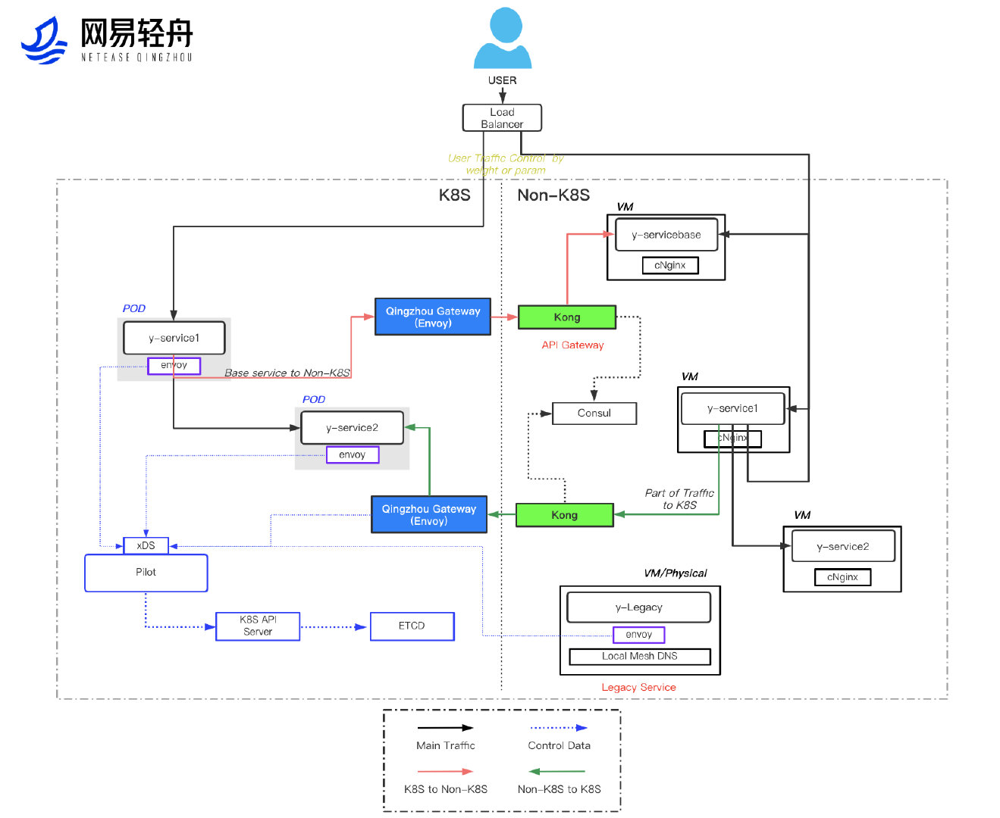
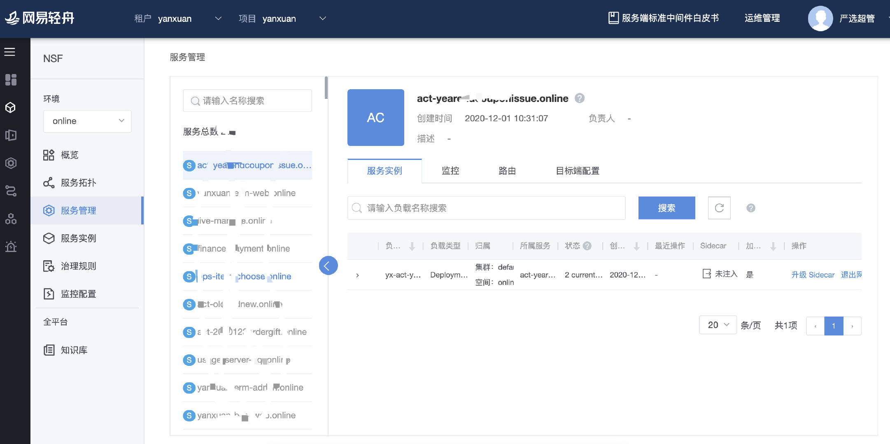
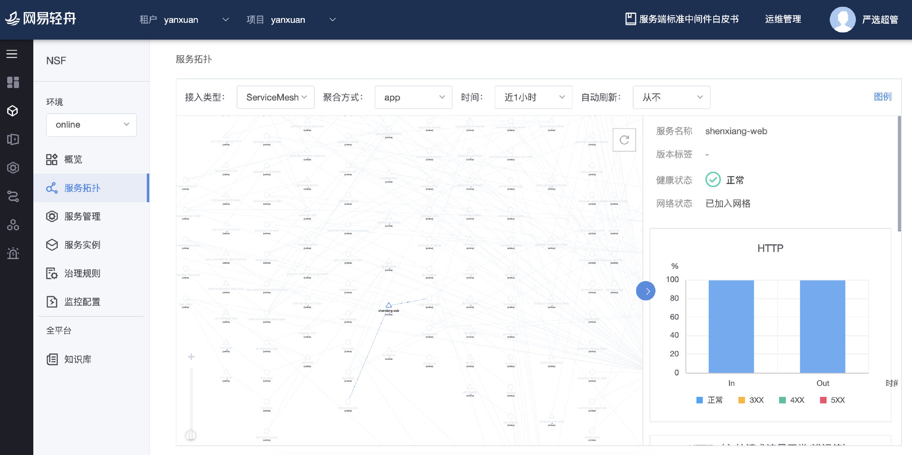
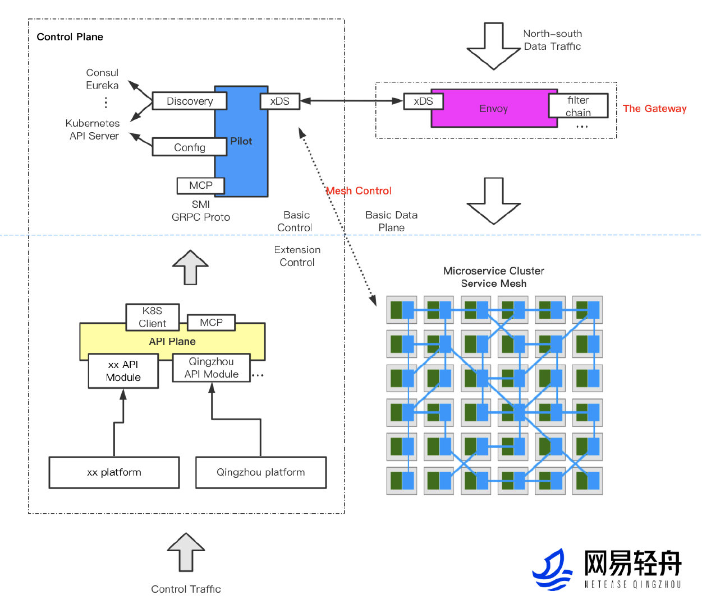

In a company with diverse internet businesses like NetEase, each business has its own unique choice of microservices tech stack and system architecture based on their business nature and team composition. While this might seem harmless at the initial stage of business development, as the businesses grow, the business scale, level of complexity and team composition will vary. These problems may stand in the way of the microservices architecture:

- High R&D costs due to uncoordinated R&D efforts by different businesses.
- Failure to make full use of the technological assets of the NetEase Group.
- High level of intrusion into businesses. Business personnel must understand, learn about, monitor, and maintain the microservices framework
- Long upgrade cycle. A minor framework upgrade may take more than a month.
- Language limitations. The microservices system adopted by most core services is built from Java with little support for other languages.

## Strategies

The service mesh is a key microservices technology under the cloud-native system. It can effectively solve problems arising out of the microservices architecture adopted by a wide variety of internet businesses at NetEase. The decision by NetEase to use Istio, the classic service mesh open-source framework, is the product of careful deliberations:

- Strong background in cloud-native solutions. Endorsed by tech giants.
- Envoy, a key data plane component of Istio, is a de facto standard component of the cloud-native data plane.
- As the most popular choice within the service mesh landscape, Istio has a vibrant community and an outstanding architecture.
- As an enterprise-friendly solution, Istio strives to optimize its services for improved user experience and enhanced support in service implementation.

Having decided on Istio as the service mesh platform of choice, the NetEase Shufan Qingzhou team built the Qingzhou Service Mesh platform. This addresses the various problems of the microservices architecture faced by the diverse internet businesses of the NetEase Group and consolidates the existing microservices management framework. The establishment of this common, distributed microservices platform enables more enterprises to implement the evolution and upgrade of their microservices architecture. Further, NetEase Qingzhou has released an upgrade of the API gateway system built upon the Istio tech stack. The Envoy and Istio-based Qingzhou API gateway has enhanced capabilities and better performance. It has since become the standard component of the NetEase API gateway.
Despite the comprehensive service mesh solutions provided by Istio, enterprises still need to set clear goals when constructing their service mesh systems.

### Architectural Design

An overview of the architecture of the NetEase Qingzhou Service Mesh is shown as follows:

#### Key Points on Architectural Design:

- The overall architectural design is implemented by **extending Envoy and customizing Istio**.  The requisite feasibility checks have been carried out.
- **Envoy-based data planes support various ways of interception**. In addition to the complete interception of TCP traffic natively powered by Istio, other traffic interception methods that facilitate business integration, such as IP pointing and a dynamic interception, have been added.
- **Components in the Istio Pilot-based control plane are pluggable**. Before Istio 1.5, the control plane used to have more components, leading to higher maintenance costs. In designating Pilot as a key component of the control plane and making other components pluggable, the risks of production and implementation, as well as the maintenance costs, are significantly reduced. It also allows developers and maintainers to focus on building a better system.
- **Multiple extension methods allowing easy integration with existing business platforms. Numerous open platforms**, including the Istio CRD, MCP and API plane, can fully preserve their native capabilities. Simply with the use of a Restful API, they significantly reduce the costs incurred by businesses to build a new platform or to integrate with an existing platform.
- **Performance improvements**: Improvements are made on both components and networks. For components, as an example, the patterns of Envoy filter are now responsible for the back-end capabilities of the centralized mixer found in earlier versions of Istio, allowing configuration trimming for call tracing. On the other hand, the networks are faster than ever to keep up with the pace of container networks. This is a major step towards reducing latency.

### Development Plan

The microservices architecture development plan is founded upon the overall architectural design and reference to the architecture and tech stack of services. Let’s take the NetEase e-commerce business as an example. Its business development plan is shown below:

#### Key Points on Development:

- Overall migration architecture is specifically designed for the **existing technologies and architectural pattern of the business**.
- **Business integration**: Adaptation at the infrastructure level to ensure imperceptible migration for the business.
- **Cross-cloud accesses**: Ensuring seamless mutual accesses before and after migration with the use of the mixed cloud solutions of edge gateways.
- **High usability**: Ensuring that the SLAs are met during the migration process with added capabilities such as fallback routing as well as routing a certain percentage of traffic.

### Platform Building

During their application of Istio, businesses need a visualized map of the mesh, and the ability to efficiently manage the mesh. Because of this, the NetEase Qingzhou microservices platform has been enhanced with the addition of service mesh monitoring capabilities and supporting cross-cluster centralized monitoring between service mesh and microservices framework (Spring Cloud, Dubbo, gRPC and Thrift). With this update, users can benefit from a smoother migration of their existing microservices architecture.

#### Key Points on Building: 

**Stepping up on product enhancements to address business challenges**

- **Observability**: Providing visualization tools and quick resolution functions.
- **Usability**: Packaging on par with cloud-native concept products.
- **Extensibility**: Open API system architecture. Rapid migration with business platforms.

### System Building

The Istio-based service mesh architecture requires comprehensive system protection features.

#### Key Points on System Building

- **Architectural and deployment**: Service mesh component CICD and auto-deployments.
- **Quality**: Automated functions, performance, and stability testings; overall fault diagnosis; chaos testing.
- **Debugging**: Debugging for services and components; rapid fault location and recovery in the service mesh.
- **Operations and maintenance**: All-round monitoring and alarm functions.
- **Hot upgrade**: Support for hot upgrade of sidecars.
- **Open-source technologies**: The Qingzhou team continues to contribute to the service mesh community.

### Use Case Extensions: Support for the API Gateway

#### Key Points on Design:

- Extensions of the service mesh tech stack, making full use of cloud-native technologies.
- Overall design validation and feasibility checks.
- Enhancement on the extensibility of the high-performance control plane Envoy.
- Multiple extension plug-in methods for the primary control plane Istio Pilot.
- API interface design mitigates the discrepancies between different platforms, fostering rapid integration across platforms.

## Results

- Various services of NetEase, including NetEase Yeation, NetEase Media, NetEase Youdao, and industry platforms, have been successfully launched. **NetEase effectively manages thousands of services and tens of thousands of instances.**
- The NetEase microservices architecture is built onto a uniform infrastructure. Different lines of business can now leave the hassles of microservices management behind as well as lower R&D and maintenance costs for microservices.
- Introduction of service management capabilities, such as multi-language management, hot upgrade, fault injection, routing, and fuse downgrade.
- As part of the long-term plan for cloud-native infrastructure, more use cases are now supported: API gateways, DB & middleware mesh, failure drill, and so on. API gateway has become the standard component of the NetEase API gateway, providing **support for entire site traffic access for many core services of NetEase, such as NetEaseMedia, NetEase Yeation, and NetEase Lofter**.
- The NetEase microservices architecture and technologies are leading in the industry.
