From February 4 to February 11, 2020, the ServiceMesher community initiated a Service Mesh end-user survey. The results of the survey are as follows.

## Personnel involved in the survey

A total of 516 questionnaire results were collected. 94.2% of those who completed the questionnaires came from the ServiceMesher community, 21.7% of them participated in online community activities, 27.5% of them participated in community meetups, and 86.6% were **optimistic** about the future development of Service Mesh.

The following is the basic situation of the survey participants.

**Company Industry**

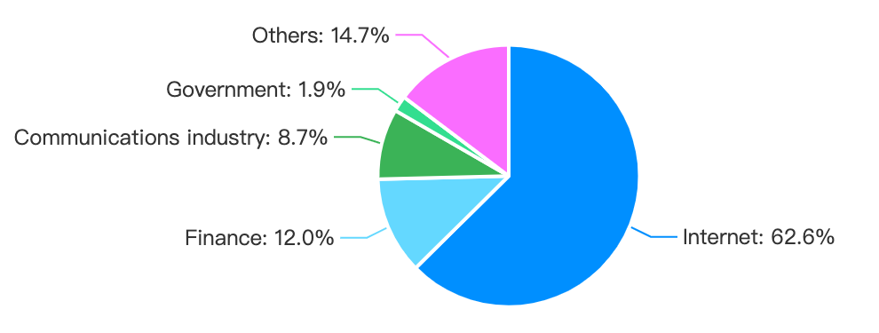

**Service Mesh usage of your company**

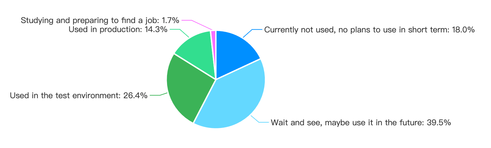

**Working years**

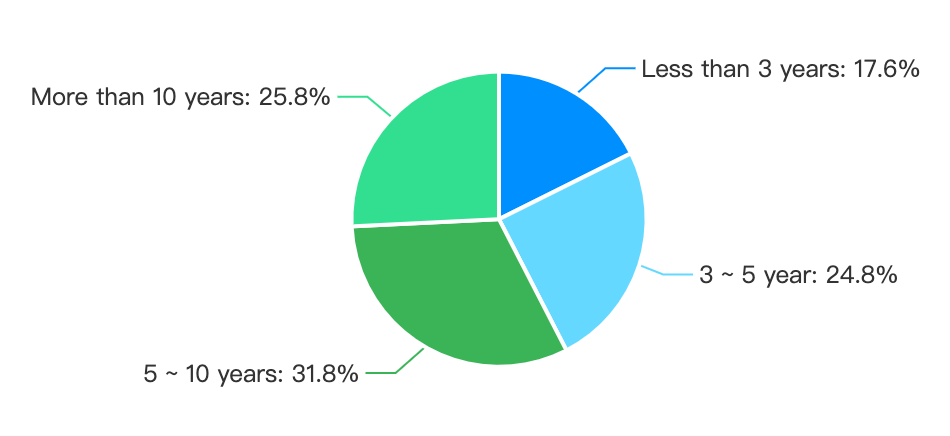

**Possession in the company**

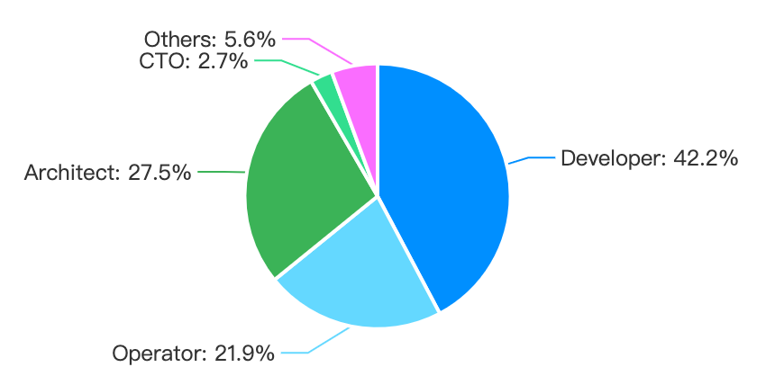

**Focus on the duration of Service Mesh technology**

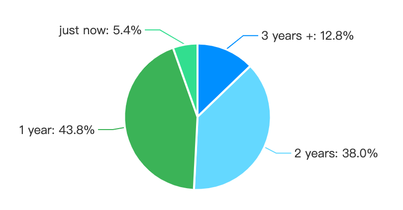

**Personnel who care about or understand Service Mesh technology**

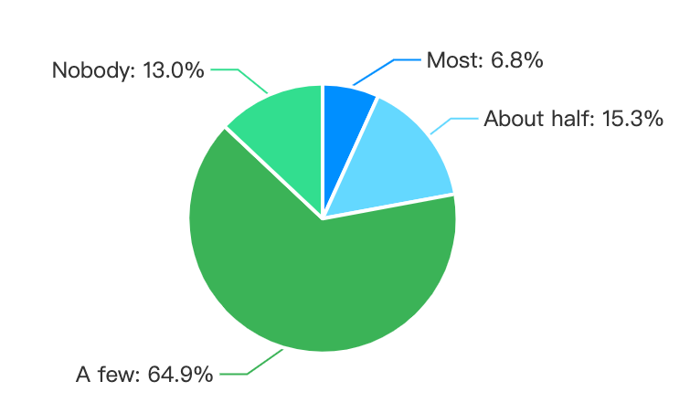

**How to Learn Service Mesh Technology**

**Focused Service Mesh related open source projects**

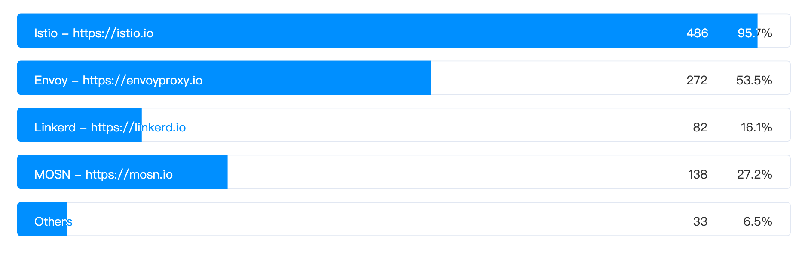

**Other cloud-native areas that focus on besides Service Mesh**

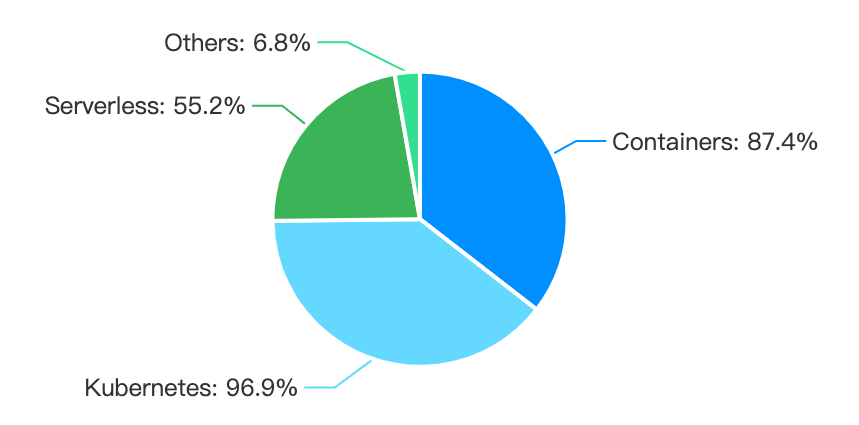

**Knowledge of Service Mesh**

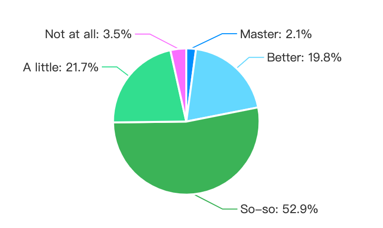

**Which part of the Service Mesh technology are you focusing on?**

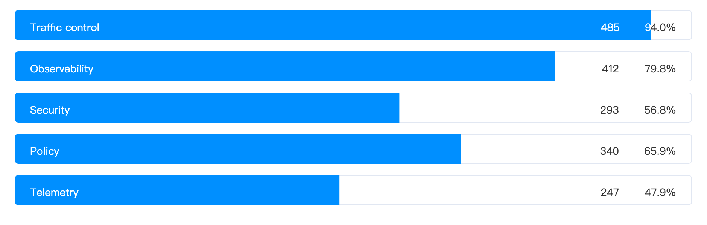

## Community Involvement

**Suggestions for the community**

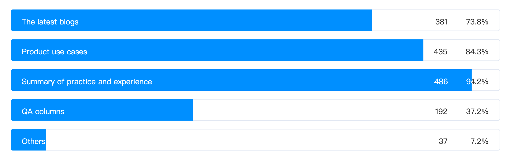

There are also many suggestions for the community. The feedback is as follows:

- More practices and guides
- Publish some entry-level articles, combined with cases, to make technology landing in SMEs
- Organize some online or offline activities
- Advice on career development for ordinary developers
- A series of tutorials

## Summary

It can be seen from the results that Service Mesh has the highest proportion of attention among Internet companies, but it is still developing at a high speed, and there is no complete tutorial and use cases.

The purpose of this questionnaire survey is to understand the service mesh community members' understanding of service mesh and the level of community participation, and to help the service community community to do a better job. It also requires the joint efforts of community members.

Welcome those who are following Service Mesh technology [Join the ServiceMesher Community](https://www.servicemesher.com/contact/) to exchange learning and growth together.

The final interpretation of this questionnaire is owned by the ServiceMesher community.

## About ServiceMesher community

The ServiceMesher community was launched in April 2018 by a group of volunteers with the same values and values in China. It now has more than 4,000 members and is the largest service mesh community in China.

The community's focus areas are: containers, microservices, Service Mesh, Serverless, embrace open source and cloud native, and are committed to promoting the vigorous development of Service Mesh.