## 前言

当第一次看到Network Service Mesh这一名词时，你很可能和我一样好奇它到底是什么？是否和Service Mesh有什么关系？Network Service Mesh是云原生领域中一个新的热点，是CNCF（云原生基金会）中的一个沙箱项目。本文将介绍Network Service Mesh的起源和架构，并探讨其与Service Mesh、SDN、NFV等相关技术的区别与联系。

## 正文云原生应用面临的网络问题

### Kubernetes网络模型

Kubernetes已经成为云原生应用编排（即应用程序资源分配、部署和运行管理）的事实标准，几乎所有的公有和私有云解决方案都提供了Kuberetes的管理服务。由于采用了微服务架构，因此云原生应用系统中存在大量服务间的东西向网络流量。为了满足集群内部应用之间的这些东西向流量需求，Kubernetes采用了一个扁平的三层网络模型。该模型可以有多种实现方式，但所有这些实现都必须满足下面的基本要求：

* 每个Pod有一个独立的IP地址。
* 每个Pod可以和集群中任一个Pod直接进行通信（不经过NAT）。

如果忽略掉底层的实现细节，从本质上来看Kubernetes网络模型，Kubernetes网络如下图所示：

从上图中可以看到，一个Kubernetes集群中的所有Pod之间都可以通过一个”扁平“的三层网络相互访问，这里“扁平”的含义指的是从一个Pod的角度来看，它可以只通过三层路由访问集群中任何一个其他的Pod，中间不需要经过NAT，即在发送端和目的端看到的数据包的源地址和目的地址是一样的。

该“扁平”的三层网络是从Pod角度来说的，在实际部署时，这个L3网络的实现可以是underlay的，直接通过底层网络的物理设备进行路由；也可以采用overlay的隧道技术实现。

### Kubernetes网络的局限性

Kubernetes网络的目的是为了处理同一个集群中Pod之间的东西向流量，因此设计得非常简单清晰。对于普通的IT和企业应用场景，该模型已经完全够用。但对于电信、ISP和一些高级的企业网络需求来说，Kubernetes的网络存在下面的一些局限性：

* Kubernetes网络不能提供除了集群内三层可达之外的其他高级的L2/L3网络服务。
* Kubernetes网络不能满足应用的动态网络需求，如需要临时将一个Pod连接到企业内网。
* Kubernetes网络缺乏对跨集群/跨云连通性的支持。

也不能说以上这些局限是Kubernetes网络的缺陷，因为Kubernetes设计的初衷是为企业/IT的服务化应用提供一个云原生的部署和运行环境，而该网络模型已经很好地支撑了集群中部署的应用之间的东西向流量，达到了其设计目的。

电业行业也逐渐认识到云原生带来的好处，并开始将云原生的思想和技术如微服务、容器化等运用到电信领域中。但当试图将Kubernetes强大的容器编排能力运用到电信的NFV（网络功能虚拟化）中时，发现Kubernetes的网络能力和其编派能力相比而言显得非常弱小。NFV中涉及到很多复杂的L2/L3网络功能，而静态的，功能相对固定的Kubernetes网络则难以支撑NFV对网络的需求。对于NFV来说，Kubernetes有限的网络能力成为了它的“阿琉克斯之踵”。

## Network Service Mesh介绍

Network Service Mesh（NSM）是CNCF下的一个开源项目，为Kubernetes中部署的应用提供了一些高级L2/L3网络功能，补齐了Kubernetes对云原生应用网络支持的这一块短板。NSM并没有对Kubernetes的CNI模型进行扩展或者修改，而是采用了一套与CNI完全独立的新机制来以实现这些高级的网络需求。除了Kubernetes之外，NSM还支持虚拟机和服务器，是一个跨云平台的云原生网络解决方案。

### 什么是Network Service？

首先我们来看一下Network Service的定义，在Kubernetes中有Service对象，用于对外提供某种服务，一般来说Service对外提供的是应用层的服务，例如HTTP/GRPC服务,这些服务又一起组成了一个大的系统对用户提供服务，例如淘宝，亚马逊等网上商店。NSM参考了Kubernetes中Service的概念提出了Network Service。Network Service也是一种服务，和Kubernetes Service不同的是，Network Service对外提供的是L2/L3层的网络服务，即对数据包进行处理和转发，而不会终结数据包。Service和Network Service的区别如下：

* Service：属于应用工作负载，对外提供的是应用层(L7)的服务，例如web服务。
* Network Service：属于网络功能，对外提供的是L2/L3层的服务，对数据包进行处理和转发，一般不会终结数据包。例如Firewall，DPI，VPN Gateway等。

下图描述了Service和Network Service之间的关系。

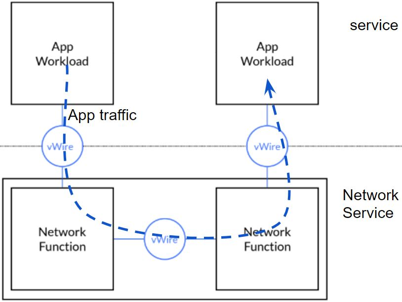

一个Kubernetes Service后端可以有多个服务实例来提供对外提供服务，Kubernetes采用Endpoint对象来表示一个Service实例；和Kubernetes Service类似，一个Network Service也可以对应有多个实例，并根据需要进行水平伸缩，以满足不同的客户端处理压力，一个Network Service实例用Network Service Endpoint对象表示。

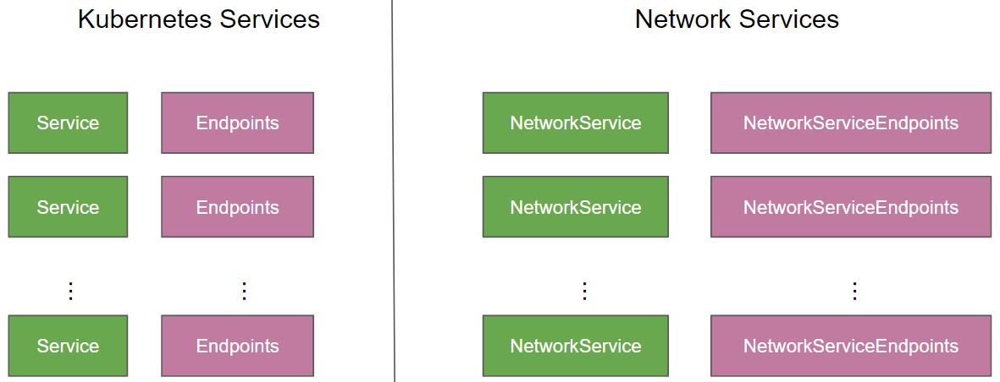

### Network Service Mesh架构

Network Service Mesh的架构如下图所示。

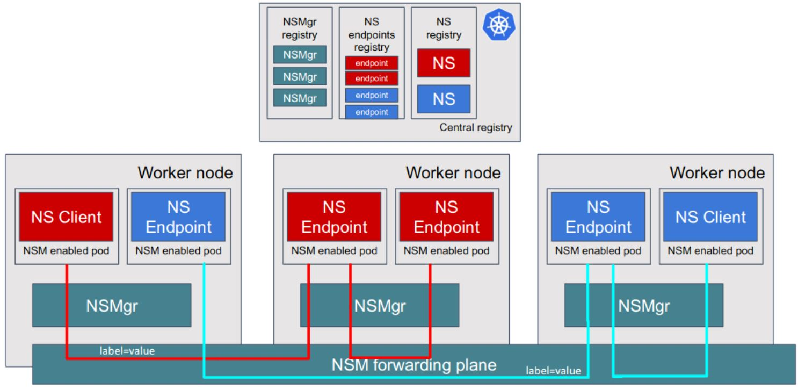

从图中可以看到，Network Service Mesh主要包含了下面这些组件：

* Network Service Endpoint(NSE) ：对外提供网络服务，可以是容器，POD，虚拟机或者物理设备。 NSE接收来自一个或者多个client的请求，向client提供请求的网络服务。
* Network Service Client(NSC) ：使用Network Service的客户端。
* Network service registry(MSR)：NSM中相关对象和组件的注册表，包含NS和NSE、NSMgr的实例信息。
* Network Service Manager (NSMgr) ：是NSM的控制组件，以daemon set形式部署在每个节点上,NSMgr之间可以相互通信，形成了一个分布式控制面。NSMgr会做两件事情：
  * 处理来自客户端的Network Service使用请求，为请求匹配符合要求的Network Service Endpoint，并为客户端创建到Network Service Endpoint的虚拟链接。
  * 将其所在节点上的NSE注册到NSR上。
* Network Service Mesh Forwarder：提供客户端和Network Service之间的端到端链接的数据面组件，可以直接配置linux内核的转发规则，也可以是一个第三方的网络控制面，如FD.io (VPP), OvS, Kernel Networking, SRIOV等。

NSM会在每个Node上部署一个NSMgr,不同Node上NSMgr之间会进行通信和协商，为客户端选择符合要求的NSE，并创建客户端和NSE之间的连接。这些相互通信的NSMgr类似于Service Mesh中的Envoy Sidecar，也组成了一个连接NSE和NSC的网格，这就是Network Service Mesh这个项目名称的来源。

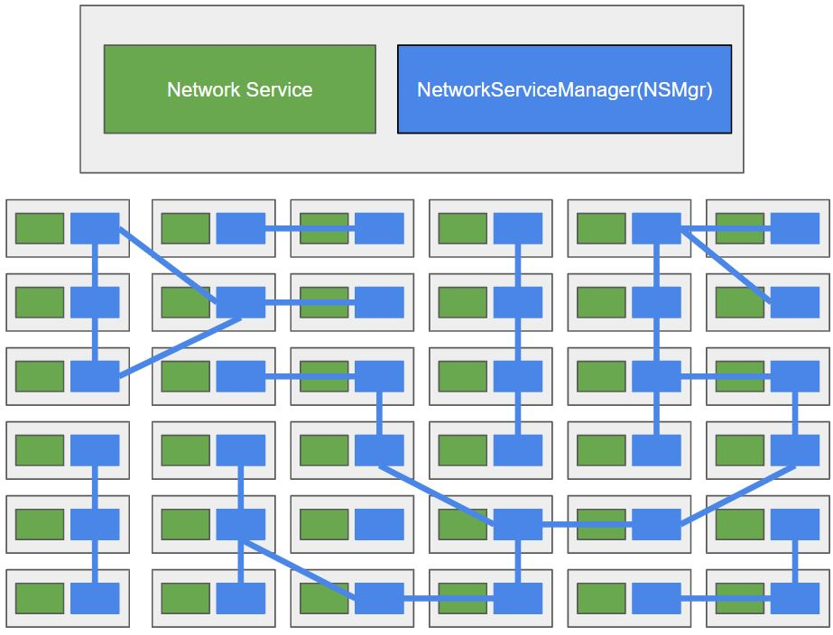

## Network Service Mesh示例

下面我们通过一个例子来说明NSM的运行机制。设想这样一个场景，用户需要将Pod中的应用中通过VPN连接到公司内网上，以访问公司内网上的服务。

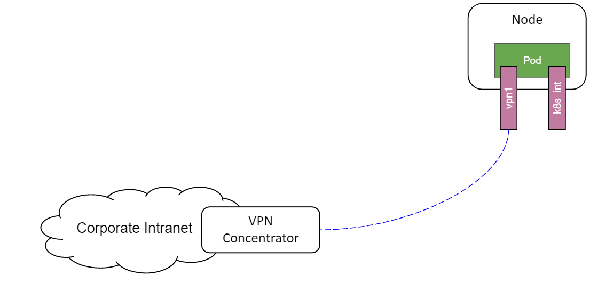

如果采用“传统”的方式，用户需要在应用程序中配置VPN网关的地址，到企业内网的子网路由，还需要部署和设置VPN网关。而在该场景中，客户端只是需要一个“连接到企业内网的VPN”这样一个网络服务而已，完全没有必要将这些网络中的各种概念和细节暴露给用户。

NSM提供了一种声明式的方式来为客户端提供该VPN服务，下图是VPN服务在NSM中的服务定义和客户端使用的声明方式。

* NSM通过一个NetworkService CRD来创建vpn-gateway网络服务，在该网络服务的spec中声明其接受的负载为IP数据包，并通过app:vpng标签选择提供服务的Pod为vpng-pod。

* 客户端通过Ns.networkservicemesh.io注解声明需要使用vpn-gateway网络服务。

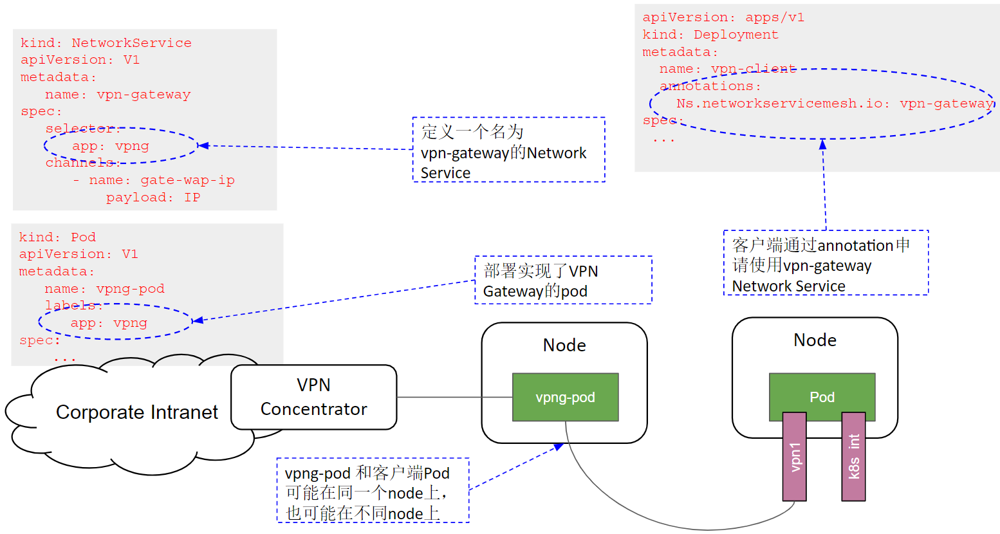

NSM会通过admission webhook在使用网络服务的客户端Pod中注入一个Init Container，由该Container来负责根据yaml注解来向NSMgr请求对应的网络服务，因此应用程序不需要关注网络服务的请求和连接创建过程。客户端与VPN Gateway网络服务建立连接的过程如下图所示：

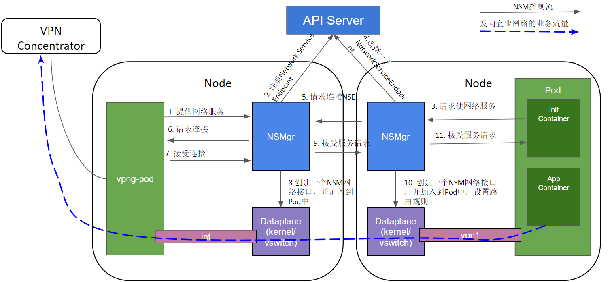

1. 启动vpng-pod，对外提供VPN Gateway网络服务。
1. NSMgr将vpng-pod作为NSE注册到API Server（Service Registry）中。
1. 客户端应用Pod中的NSM Init Container根据yaml注解向同一node上的NSMgr发起使用网络服务的请求。
1. NSMgr向API Server（Service Registry）查询可用的NSE。
1. NSE可能位于和客户端相同的node上，也可能在不同的node上；如果在不同的node上，NSMgr会和NSE所在Node上的NSMgr进行通信，转发请求。
1. NSMgr向NSE请求连接
1. NSE根据自己的业务逻辑进行判断，如果可以接受该客户端的服务请求，则接受该连接请求。
1. NSE所在Node的NSMgr调用数据面组件创建一个网络接口，加入到NES的Pod中。
1. 如果NSE和NSC在不同的Node上，NSE所在Node的NSMgr通知NSC所在Node的NSMgr，接受该服务请求。
1. NSE所在Node的NSMgr调用数据面组件创建一个网络接口，加入到应用Pod中，并进行相应的网络配置，例如设置到企业网络的子网路由。

NSM的数据面组件在NSE和NSC的两个新创建的网络接口之间搭建了一条虚拟点对点链路，该链路可以看做这两个网络接口之间的一条虚拟网线，从一段进入的数据，会从另一端出来。链路有多种实现方式，如果NSE和NSC处于同一个节点上，这可能是一个vpp memif共享内存通道，如果在不同节点上，则可能是一个VXLAN隧道。

从通过NSM提供VPN服务的例子，可以看到NSM有这样一些优点：

* 简单
  * VPN客户端只需通过Yaml声明使用VPN-Gateway服务。
  * 不需要手动配置VPN客户端到VPN-Gateway之间的连接、IP地址、子网、路由，这些业务逻辑细节被Network Service的Provider和NSM框架处理，客户端无感知。
  * 和Kubernetes自身的网络机制是独立的，不影响Kubernetes自身的CNI网络模型。
* 灵活
  * 可以根据需求向NSM中添加新的Network Service类型，这些网络服务可以由第三方实现和提供。
  * 应用Pod可以通过Yaml配置需要使用的服务。
  * Network Service Endpoint的数量可以根据工作负载进行水平扩展。

## Network Service Mesh与Kubernetes CNI的关系

从前一节中NSM的介绍中可以看到，NSM与Kubernetes CNI是两套相互独立的机制。

Kubernetes CNI的作用范围在Kubernetes的生命周期中，其初始化，调用时机，支持的接口都是相对固定的。只提供Cluster内Pod之间基本的3层网络连接，不能动态添加其他类型的网络服务。

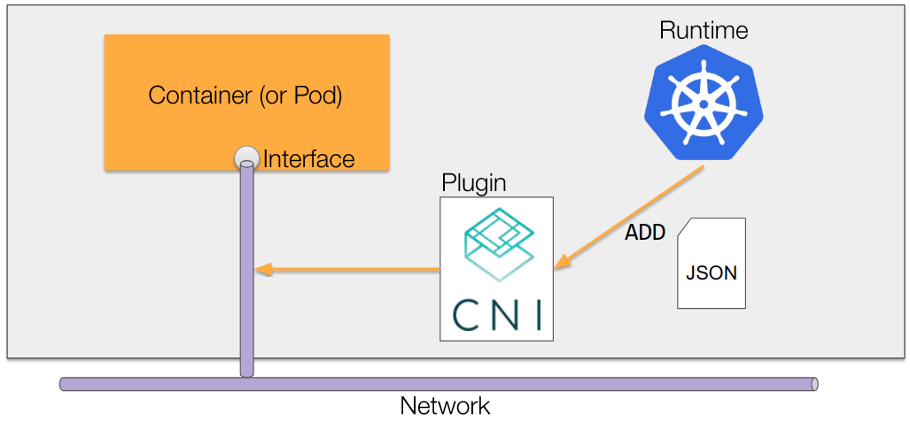

如上图所示，Kubernetes会在创建Pod时调用CNI plugin，为Pod创建网络接口，当Pod创建完成后，就不能再对Pod使用的网络进行更改了。

NSM独立于Kubernetes的生命周期之外，自成体系。除了可以采用Kubernets yaml文件提供申明式的网络服务外，NSM还提供了GRPC接口，因此还可以用于虚机和服务器环境。

可以看到，NSM是Kubernetes CNI网络模型的强有力的补充，NSM为Pod提供了动态的，高级的网络服务，采用NSM，可以在不影响CNI和Pod中应用的情况下为Kubernetes动态添加新的网络服务。

## Network Service Mesh与Service Mesh的关系

NSM采用了和Service Mesh类似的理念，但所处网络层次不同，提供的网络功能也不同。

Service Mesh对网络数据的处理位于L4/L7（主要为L7），提供了应用层可见性（分布式调用跟踪、http调用metrics指标）、应用层安全（TLS认证及加密，jtoken身份认证）、4层/7层的服务发现，LB，请求重试等功能。

NSM提供的是L2/L3层的网络服务，提供虚拟点对点链路、虚拟L2网络、虚拟L3网络、VPN，防火墙，DPI等网络服务。

由于两者处于不同的网络层次，Service Mesh和NSM可以协同工作。例如可以通过NSM创建一个跨云的三层网络，再在该三层网络上搭建一个Istio Service Mesh。

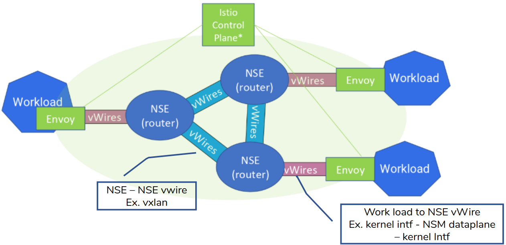

## Network Service Mesh与SDN的关系

如下图所示，SDN（软定义网络）采用软件化的集中控制面和标准接口对网络设备进行设置，一方面可以通过硬件白盒化降低网络建设和运维成本，一方面可以通过软件的方式快速推出新的网络业务。

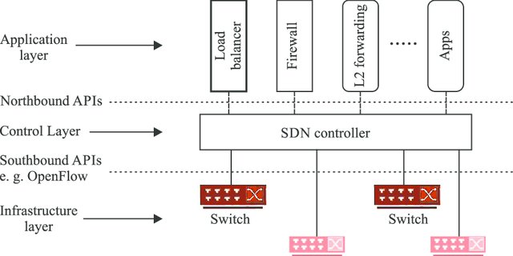

可以看到，NSM与SDN作用的网络层次是有所重叠的，SDN作用于L1/L2/L3，而NSM作用于L2/L3，但两者的关注点不同，NSM主要为Kubernetes和混合云环境中的云原生应用提供高级的L2/L3网络服务，而SDN则主要用于对网络设备的配置和管理。

我们可以将NSM和SDN结合使用，可以通过NSM中的Network Service接入SDN提供的强大的网络服务。下图是在NSM中利用SDN为应用提供QoE（Quality of Experience）服务的一个例子。

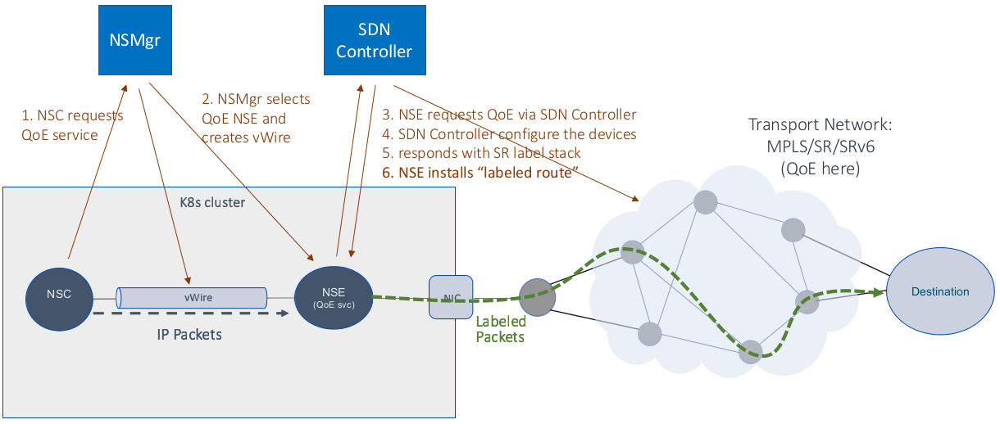

在这个示例中，NSM在Kubernetes中提供了QoE网络服务以及客户端和QoE网络服务之间的虚拟点对点链接；SDN controller则设置相关的网络设备，提供QoE服务的实现机制。NSM以云原生的方式将SDN的网络能力提供给了Kubernetes中的应用。

## Network Service Mesh与NFV的关系

NFV（网络功能虚拟化）就是将传统的电信业务以软件的形式部署到云平台上，从而实现软硬件解耦合。VNF（Virtual Network Function）是采用软件实现的网络设备功能，目前VNF主要是采用VM在NFV基础设施之上实现的。采用Container在CaaS平台上实现NFV是一个资源占用更少，更为敏捷的方式，该方式的主要问题是CaaS网络架构主要是为IT应用设计的，缺少电信所需的高级网络功能。而NSM可以在标准CaaS平台上实现VNF所需的高级网络功能，提供了一种云原生的NFV解决方案。采用CaaS和NSM来实现NFV，有如下的好处：

* NSM可以实现实现Cloud Native 的VNF（CNF）。
* NSM可以采用抽象和声明式的方式表述对网络功能的需求。
* NSM可以串联CNF实现service function chaining (SFC)。
* 通过Kubernets和NSM，可以很容易实现VNF的水平伸缩。

下图是采用NSM实现的SFC示例：

目前NFV主要由电信标准驱动(如ETSI NFV系列标准），电信标准用在各种系统之间的接口上很有意义，可以确保不同厂家系统之间的互联互通；但如果在系统内部的实现机制上也采用标准那一套流程，就显得过于笨重和缓慢。NSM以开源代码的方式推动NFV向云原生时代迈进，很有可能将对NFV带来革命性的变革。

## 总结

Network Service Mesh是CNCF中的一个沙箱项目，其架构借鉴了Service Mesh的理念（换句话说，蹭了Service Mesh的热点 :-) ），可以为Kubernetes中部署的应用提供高级的L2/L3网络服务。Network Service Mesh补齐了Kubernetes在网络能力方面的短板，并且可以用于虚拟机、服务器等混合云以及跨云场景。相信随着Network Service Mesh项目的发展和逐渐成熟，将加速电信，ISP，高级企业应用等对网络功能有更高要求的行业向云原生的转型。

# 参考文档

* <https://drive.google.com/drive/folders/1f5fek-PLvoycMTCp6c-Dn_d9_sBNTfag>
* <https://www.youtube.com/watch?v=YeAKtUFaqQ0>
* <https://www.youtube.com/watch?v=AWHkn_dqAUA&t=331s>
* <https://static.sched.com/hosted_files/kccnceu19/26/NSM%20Deep%20Dive%20KubeCon%20EU%202019%20%28developer%20centric%29.pdf>
* <https://www.youtube.com/watch?v=mrkW83_kLLM&t=2990s>
* <https://docs.google.com/presentation/d/1aG56Oqv7I1JpNsY4VPNpyoKppT-BRyOdYE43fr9ylNs/edit#slide=id.g64538f607d_2_94>
* <https://docs.google.com/presentation/d/1-nlBx0Qo4oCmlwYc72dirVcw19y5MAwvKu0wc4lk1VA/edit#slide=id.g790e663adc_0_145>

