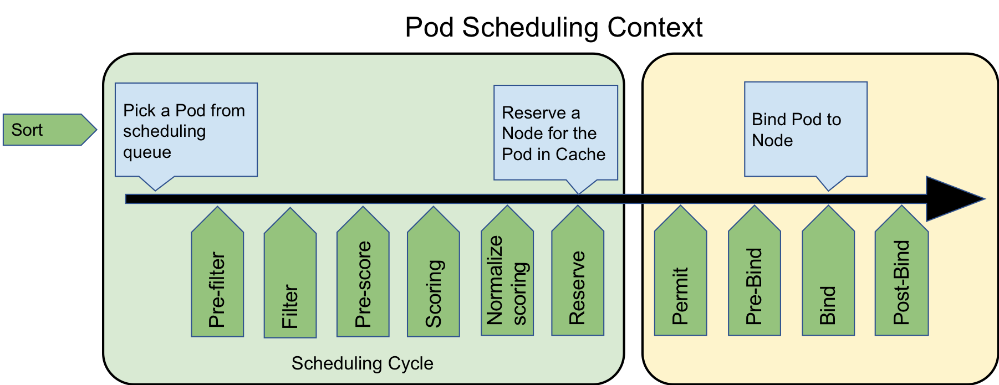

最近几个月一直在研究 kubernetes 的 scheduling-framework 调度框架，发现还是十分有意思的，我自己也实现了一个基于 scheduling-framework 调度框架的自定义调度器，希望感兴趣的同学一起学习：https://github.com/NJUPT-ISL/Yoda-Scheduler

### Scheduling-framework 调度框架

Kubernetes 的 scheduling-framework 调度框架（以下简称调度框架）是针对当前 kubernetes 调度器的增强，它不同于之前的 scheduler-extender，用户可以编写多个插件，这些插件可以在调度的不同阶段作为原有调度器的扩展，并且这些插件会和 kubernetes 原有的调度器源代码会一起编译到调度程序中。

### 调度框架设计目标

- 增强 kubernetes 原有调度器的可扩展性。
- 通过将调度程序的某些功能移至插件，可以简化调度程序核心。
- 调度框架中可设置多个扩展点。
- 调度框架通过插件机制来接收插件结果，并根据接收到的结果继续或中止。
- 提出一种处理错误并将其与插件进行通信的机制。

### Proposal

调度框架在 kubernetes 调度器中定义了很多 Go 的接口和 Go API，用于用户设计插件使用。这些用户设计的插件将会被添加到调度程序中，并在编译时包含在内。可以通过配置调度程序的 `ComponentConfig` 将允许启用、禁用和重新排序插件。自定义调度程序可以“ [在树外](https://github.com/kubernetes/enhancements/blob/master/keps/sig-scheduling/20180409-scheduling-framework.md#custom-scheduler-plugins-out-of-tree) ” 编写其插件并编译包含其自己的插件的调度程序二进制文件。

### 调度周期和绑定周期

调度器调度一个 Pod 的过程分为两个阶段：**调度周期**和**绑定周期**。

在调度周期中，调度器会为 Pod 选择一个最合适它运行的节点，然后调度过程将进入绑定周期。

在绑定周期中，调度器会检测调度周期中选中的那个“最合适的节点”是不是真的可以让这个 Pod 稳定的运行（比如检测 PV、检测是否有端口冲突等），或者需不需要做一些初始化操作（比如设置这个节点上的 FPGA 板子的状态、设置 GPU 显卡的驱动版本、CUDA 的版本等）。


### 扩展点

kubernetes 调度框架在调度周期和绑定周期都为我们提供了丰富的扩展点，这些扩展点可以“插上”我们自己设计的调度插件，一个插件可以在多个扩展点注册以执行更复杂或有状态的任务，实现我们想要的调度功能：



下面阐述下各个扩展点可以实现的功能。


#### Sort 排序

排序扩展点，由于调度器是按照 `FIFO` 的顺序调度 Pod 的，因此当队列里出现多个等待调度的 Pod 时，可以对这些 Pod 的先后顺序进行排序，把我们想要的 Pod（可能优先级比较高）往出队方向移动，让它可以更快地被调度。

目前的 Sort 扩展点只能启用一个，不可以启用多个 Sort 扩展插件。

我们可以看下 Sort 的接口，代码位于 kubernetes 项目的 `/pkg/scheduler/framework/interface.go` 中：

```go
type QueueSortPlugin interface {
	Plugin
	// Less are used to sort pods in the scheduling queue.
	Less(*PodInfo, *PodInfo) bool
}
```

也就是只需要实现 Less 方法即可，比如如下的实现：

```go
func Less(podInfo1, podInfo2 *framework.PodInfo) bool {
	return GetPodPriority(podInfo1) > GetPodPriority(podInfo2)
}
```


#### Pre-filter 预过滤

该扩展点用于预处理有关 Pod 的信息，或检查集群或 Pod 必须满足的某些条件。预过滤器插件应实现 PreFilter 函数，如果 PreFilter 返回错误，则调度周期将中止。注意，在每个调度周期中，只会调用一次 PreFilter。

Pre-filter 插件可以选择实现 `PreFilterExtensions` 接口，这个接口定义了 **AddPod** 和 **RemovePod** 方法以增量方式修改其预处理信息。

```go
type PreFilterPlugin interface {
	Plugin
	PreFilter(ctx context.Context, state *CycleState, p *v1.Pod) *Status
	PreFilterExtensions() PreFilterExtensions
}
```

这里的 CycleState ，表示调度的上下文，其实是一个 map 的封装，结构体内部通过读写锁实现了并发安全，开发者可以通过 CycleState 来实现多个调度插件直接的数据传递，也就是多个插件可以共享状态或通过此机制进行通信。

 ```go
 type CycleState struct {
 	mx      sync.RWMutex
 	storage map[StateKey]StateData
 	recordFrameworkMetrics bool// 该值为 true, 则调度框架会记录此次调度周期的数据
 }
 ```

这里的 StateKey 是 string 类型，StateData 是一个接口类型：

 ```go
 type StateData interface {
 	// Clone is an interface to make a copy of StateData. For performance reasons,
 	// clone should make shallow copies for members (e.g., slices or maps) that are not
 	// impacted by PreFilter's optional AddPod/RemovePod methods.
 	Clone() StateData
 }
 ```

 我们可以做一个简单的接口实现，来实现 StateData：

 ```go
 type Data struct {
 	Value int64
 }
 
 func (s *Data) Clone() framework.StateData {
 	c := &Data{
 		Value: s.Value,
 	}
 	return c
 }
 ```

 那么当插件在该扩展点想传递数据时就可以使用如下类似的代码实现数据的传递：

 ```go
 Max := Data{Value: 0}
 state.Lock()
 state.Write(framework.StateKey("Max"), &Max)
 defer state.Unlock()
 ```


#### Filter 过滤

用于过滤不能满足当前被调度 Pod 运行需求的节点。对于每个节点，调度程序将按配置的顺序调用该类插件。如果有任何过滤器插件将节点标记为不可行，则不会为该节点调用其余插件。可以同时评估节点，并且在同一调度周期中可以多次调用 Filter 插件。这块其实是调度器会启动多个 go 协程以实现对多个节点并发调用 filter，来提高过滤效率。过滤插件其实类似于上一代 Kubernetes 调度器中的预选环节，即 Predicates。

我们看下接口定义：

```go
type FilterPlugin interface {
	Plugin
	Filter(ctx context.Context, state *CycleState, pod *v1.Pod, nodeInfo *schedulernodeinfo.NodeInfo) *Status
}
```

我们可以对应的实现，比如我这里需要做 GPU 的调度，我需要检查每个节点的 GPU 是否满足 Pod 的运行要求：

```go
func (y *Yoda) Filter(ctx context.Context, state *framework.CycleState, pod *v1.Pod, node *nodeinfo.NodeInfo) *framework.Status {
	klog.V(3).Infof("filter pod: %v, node: %v", pod.Name, node.Node().Name)
  // 检查节点 GPU 的健康状态
	if ok, msg := filter.CheckGPUHealth(node); ok {
    // 节点的 GPU 是否符合Pod 运行等级
		if !filter.PodFitsLevel(pod, node) {
			return framework.NewStatus(framework.Unschedulable, "Node:"+node.Node().Name+" GPU Level Not Fit")
		}
    // 节点的 GPU 显存是否符合 Pod 运行
		if !filter.PodFitsMemory(pod, node) {
			return framework.NewStatus(framework.Unschedulable, "Node:"+node.Node().Name+" GPU Memory Not Fit")
		}
    // 节点的 GPU 数量是否符合 Pod 运行
		if !filter.PodFitsNumber(pod, node) {
			return framework.NewStatus(framework.Unschedulable, "Node:"+node.Node().Name+" GPU Number Not Fit")
		}
		return framework.NewStatus(framework.Success, "")
	} else {
		return framework.NewStatus(framework.Unschedulable, "Node:"+node.Node().Name+msg)
	}
}
```


#### Pre-Score 预打分 (v1alpha1 版本称为 Post-Filter)

**注意：`Pre-Score` 从 v1alpha2 开始可用。**

该扩展点将使用**通过 Filter 阶段的节点列表**来调用插件。插件可以使用此数据来更新内部状态或生成日志、指标。比如可以通过该扩展点收集各个节点中性能指标，所有节点中最大的内存的节点，性能最好的 CPU 节点等。

我们继续来看接口里长什么样子（我这里是v1alpha1）：

```go
type PostFilterPlugin interface {
	Plugin
	PostFilter(ctx context.Context, state *CycleState, pod *v1.Pod, nodes []*v1.Node, filteredNodesStatuses NodeToStatusMap) *Status
}
```

针对这个扩展点，通过传递的参数可以看出，接口传入了节点的切片，因此开发者可以通过启动多个并发协程来获取数据，并且可以把这些数据存在 CycleState 中，给之后的插件扩展点使用：

```go
func (y *Yoda) PostFilter(ctx context.Context, state *framework.CycleState, pod *v1.Pod, nodes []*v1.Node, filteredNodesStatuses framework.NodeToStatusMap) *framework.Status {
	klog.V(3).Infof("collect info for scheduling  pod: %v", pod.Name)
	return collection.ParallelCollection(collection.Workers, state, nodes, filteredNodesStatuses)
}
```

并发这块我们也可以参考 1.13 调度器中经常使用的经典并发模型：

```go
func ParallelCollection(workers int, state *framework.CycleState, nodes []*v1.Node, filteredNodesStatuses framework.NodeToStatusMap) *framework.Status {
	var (
		stop <-chan struct{}
		mx   sync.RWMutex
		msg  = ""
	)
  // 数据存入管道
	pieces := len(Sum)
	toProcess := make(chan string, pieces)
	for _, v := range Sum {
		toProcess <- v
	}
	close(toProcess)
  // 并发协程数限制
	if pieces < workers {
		workers = pieces
	}
	wg := sync.WaitGroup{}
	wg.Add(workers)
	for i := 0; i < workers; i++ {
		go func() {
      // 协程消费管道数据
			for value := range toProcess {
				select {
				case <-stop:
					return
				default:
          // state 并发安全，调用的时候可以不用加锁
					if re := CollectMaxValue(value, state, nodes, filteredNodesStatuses); !re.IsSuccess() {
						klog.V(3).Infof(re.Message())
						mx.Lock()
            // message非并发安全，加锁
						msg += re.Message()
						mx.Unlock()
					}
				}
			}
			wg.Done()
		}()
	}
	wg.Wait()
	if msg != "" {
		return framework.NewStatus(framework.Error, msg)
	}
	return framework.NewStatus(framework.Success, "")
}
```


#### Score 打分

Score 扩展点和上一代的调度器的优选流程很像，它分为两个阶段：

1. 第一阶段称为 “打分”，用于对已通过过滤阶段的节点进行排名。调度程序将为 `Score` 每个节点调用每个计分插件。
2. 第二阶段是 “归一化”，用于在调度程序计算节点的最终排名之前修改分数，可以不实现， 但是需要保证 Score 插件的输出必须是 **[MinNodeScore，MaxNodeScore]**（`[0-100]`） 范围内的整数 。如果不是，则调度器会报错，你需要实现 NormalizeScore 来保证最后的得分范围。如果不实现 NormalizeScore，则 Score 的输出必须在此范围内。调度程序将根据配置的插件权重合并所有插件的节点分数。

看看接口的定义：

```go
type ScorePlugin interface {
	Plugin
	// Score is called on each filtered node. It must return success and an integer
	// indicating the rank of the node. All scoring plugins must return success or
	// the pod will be rejected.
	Score(ctx context.Context, state *CycleState, p *v1.Pod, nodeName string) (int64, *Status)
	// ScoreExtensions returns a ScoreExtensions interface if it implements one, or nil if does not.
	ScoreExtensions() ScoreExtensions
}
```

我们也可以做如下简单的实现：

```go
func (y *Yoda) Score(ctx context.Context, state *framework.CycleState, p *v1.Pod, nodeName string) (int64, *framework.Status) {
	nodeInfo, err := y.handle.SnapshotSharedLister().NodeInfos().Get(nodeName)
	if err != nil {
		return 0, framework.NewStatus(framework.Error, fmt.Sprintf("getting node %q from Snapshot: %v", nodeName, err))
	}
	s, err := score.Score(state, nodeInfo)
	if err != nil {
		return 0, framework.NewStatus(framework.Error, fmt.Sprintf("Score Node Error: %v", err))
	}
	klog.V(3).Infof("node : %v yoda-score: %v",nodeName,s)
	return s, framework.NewStatus(framework.Success, "")
}
```

如果最后的分数不在范围内，我们可能需要实现 NormalizeScore 函数做进一步处理：

```go
func (y *Yoda) NormalizeScore(ctx context.Context, state *framework.CycleState, p *v1.Pod, scores framework.NodeScoreList) *framework.Status {
	var (
		highest int64 = 0
	)
	// 归一化 
	for i, nodeScore := range scores {
		scores[i].Score = nodeScore.Score * framework.MaxNodeScore / highest
	}
	return framework.NewStatus(framework.Success, "")
}
```


#### Reserve 保留

为给定的 Pod 保留节点上的资源时，维护运行时状态的插件可以应实现此扩展点，以由调度程序通知。这是在调度程序实际将 Pod 绑定到 Node 之前发生的，它的存在是为了防止在调度程序等待绑定成功时发生争用情况。

```go
type ReservePlugin interface {
	Plugin
	// Reserve is called by the scheduling framework when the scheduler cache is
	// updated.
	Reserve(ctx context.Context, state *CycleState, p *v1.Pod, nodeName string) *Status
}
```

这里和上面的 Score 类似，函数并没有提供 nodeInfo 接口，我们可以通过调用 `handle.SnapshotSharedLister` 来获取节点的信息。

```go
nodeInfo, err := y.handle.SnapshotSharedLister().NodeInfos().Get(nodeName)
```

那么以上就是调度周期的插件与实现，其实绑定周期的插件实现和上述的方法也都类似，实现相关的函数即可。


### 插件注册

每个插件必须定义一个构造函数，并将其添加到硬编码的注册表中。

```go
type PluginFactory = func(runtime.Unknown, FrameworkHandle) (Plugin, error)

type Registry map[string]PluginFactory

func NewRegistry() Registry {
   return Registry{
      fooplugin.Name: fooplugin.New,
      barplugin.Name: barplugin.New,
      // New plugins are registered here.
   }
}
```

那么在编译的时候，编译器会将我们的插件和调度源码一起编译成我们的自定义调度器。

在声明插件的时候也需要实现构造函数和对应的方法：

```go
type Yoda struct {
	args   *Args
	handle framework.FrameworkHandle
}

func (y *Yoda) Name() string {
	return Name
}

func New(configuration *runtime.Unknown, f framework.FrameworkHandle) (framework.Plugin, error) {
	args := &Args{}
	if err := framework.DecodeInto(configuration, args); err != nil {
		return nil, err
	}
	klog.V(3).Infof("get plugin config args: %+v", args)
	return &Yoda{
		args:   args,
		handle: f,
	}, nil
}
```


### 编译小技巧

由于最终的调度器还是以容器的方式运行的，我们可以写一个 `Makefile` 来简化编译流程：

```makefile
all: local

local:
	GOOS=linux GOARCH=amd64 go build  -o=my-scheduler ./cmd/scheduler
	
build:
	sudo docker build --no-cache . -t registry.cn-hangzhou.aliyuncs.com/my/scheduler

push:
	sudo docker push registry.cn-hangzhou.aliyuncs.com/my/scheduler

format:
	sudo gofmt -l -w .
clean:
	sudo rm -f my-scheduler
```

编写调度器的Dockerfile：

```go
FROM debian:stretch-slim

WORKDIR /

COPY my-scheduler /usr/local/bin

CMD ["my-scheduler"]
```

那么编译 -> 构建就可以三步走了:

- 编译

```shell
make local
```

- 构建镜像

```shell
make build
```

- 上传镜像

```shell
make push
```


### 自定义调度器的配置

首先需要设置一个 ConfigMap ，用于存放调度器的配置文件：

```go
apiVersion: v1
kind: ConfigMap
metadata:
  name: scheduler-config
  namespace: kube-system
data:
  scheduler-config.yaml: |
    apiVersion: kubescheduler.config.k8s.io/v1alpha1
    kind: KubeSchedulerConfiguration
    schedulerName: yoda-scheduler
    leaderElection:
      leaderElect: true
      lockObjectName: yoda-scheduler
      lockObjectNamespace: kube-system
    plugins:
      queueSort:
        enabled:
          - name: "yoda"
      filter:
        enabled:
        - name: "yoda"
      score:
        enabled:
        - name: "yoda"
      postFilter:
        enabled:
        - name: "yoda"
    pluginConfig:
    - name: "yoda"
      args: {"master": "master", "kubeconfig": "kubeconfig"}
```

这里主要需要修改的就是 schedulerName 字段的调度器名称和 plugins 字段中各个扩展点的插件名称，enable 才能保证该扩展点运行了你的插件。

接着为调度器创建 RBAC：

```go
kind: ClusterRole
apiVersion: rbac.authorization.k8s.io/v1
metadata:
  name: yoda-cr
rules:
  - apiGroups:
      - ""
    resources:
      - endpoints
      - events
    verbs:
      - create
      - get
      - update
  - apiGroups:
      - ""
    resourceNames:
      - yoda-scheduler
    resources:
      - endpoints
    verbs:
      - delete
      - get
      - patch
      - update
  - apiGroups:
      - ""
    resources:
      - nodes
    verbs:
      - get
      - list
      - watch
  - apiGroups:
      - ""
    resources:
      - pods
    verbs:
      - delete
      - get
      - list
      - watch
      - update
  - apiGroups:
      - ""
    resources:
      - bindings
      - pods/binding
    verbs:
      - create
  - apiGroups:
      - ""
    resources:
      - pods/status
    verbs:
      - patch
      - update
  - apiGroups:
      - ""
    resources:
      - replicationcontrollers
      - services
    verbs:
      - get
      - list
      - watch
  - apiGroups:
      - apps
      - extensions
    resources:
      - replicasets
    verbs:
      - get
      - list
      - watch
  - apiGroups:
      - apps
    resources:
      - statefulsets
    verbs:
      - get
      - list
      - watch
  - apiGroups:
      - policy
    resources:
      - poddisruptionbudgets
    verbs:
      - get
      - list
      - watch
  - apiGroups:
      - ""
    resources:
      - persistentvolumeclaims
      - persistentvolumes
    verbs:
      - get
      - list
      - watch
  - apiGroups:
      - ""
    resources:
      - configmaps
    verbs:
      - get
      - list
      - watch
  - apiGroups:
      - "storage.k8s.io"
    resources:
      - storageclasses
      - csinodes
    verbs:
      - watch
      - list
      - get
  - apiGroups:
      - "coordination.k8s.io"
    resources:
      - leases
    verbs:
      - create
      - get
      - list
      - update
  - apiGroups:
      - "events.k8s.io"
    resources:
      - events
    verbs:
      - create
      - patch
      - update
---
apiVersion: v1
kind: ServiceAccount
metadata:
  name: yoda-sa
  namespace: kube-system
---
kind: ClusterRoleBinding
apiVersion: rbac.authorization.k8s.io/v1
metadata:
  name: yoda-crb
  namespace: kube-system
roleRef:
  apiGroup: rbac.authorization.k8s.io
  kind: ClusterRole
  name: yoda-cr
subjects:
  - kind: ServiceAccount
    name: yoda-sa
    namespace: kube-system
```

最后配置调度器的 Deployment：

```go
apiVersion: apps/v1
kind: Deployment
metadata:
  name: yoda-scheduler
  namespace: kube-system
  labels:
    component: yoda-scheduler
spec:
  replicas: 1
  selector:
    matchLabels:
      component: yoda-scheduler
  template:
    metadata:
      labels:
        component: yoda-scheduler
    spec:
      serviceAccount: yoda-sa
      priorityClassName: system-cluster-critical
      volumes:
        - name: scheduler-config
          configMap:
            name: scheduler-config
      containers:
        - name: yoda-scheduler
          image: registry.cn-hangzhou.aliyuncs.com/geekcloud/yoda-scheduler
          imagePullPolicy: Always
          args:
            - yoda-scheduler
            - --config=/scheduler/scheduler-config.yaml
            - --v=3
          resources:
            requests:
              cpu: "50m"
          volumeMounts:
            - name: scheduler-config
              mountPath: /scheduler
```


随着云计算技术的不断发展，kubernetes scheduler 也在根据各种复杂的需求不断进化，未来也会涌现更多各种各样的丰富的、支持不同功能的调度器在不同的生产环境中发挥着更多强劲的作用，一起期待吧！

### 作者介绍

李俊江

kubernetes & istio member

南京邮电大学物联网学院研究生，热衷于 Kubernetes 与云原生相关技术。

微信：FUNKY-STARS 欢迎交流！

### 参考

- [Scheduling Framework](https://github.com/kubernetes/enhancements/blob/master/keps/sig-scheduling/20180409-scheduling-framework.md)
- [enhancements/624](https://github.com/kubernetes/enhancements/issues/624)
- [scheduler-framework-sample](https://github.com/angao/scheduler-framework-sample)
- [kubernetes 1.13 源码分析](https://github.com/daniel-hutao/k8s-source-code-analysis)

### 致谢

感谢 Scheduler-SIG Leader HuangWei 大佬在 kubecon 2018 的 Q&A 和指导！

感谢张磊、车漾大佬在 kubecon 2018 的分享和讨论！
