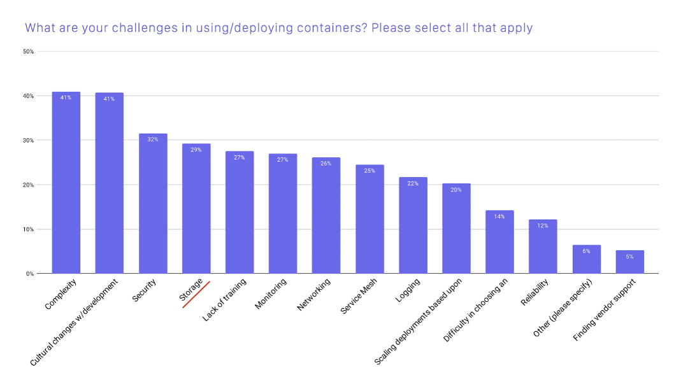
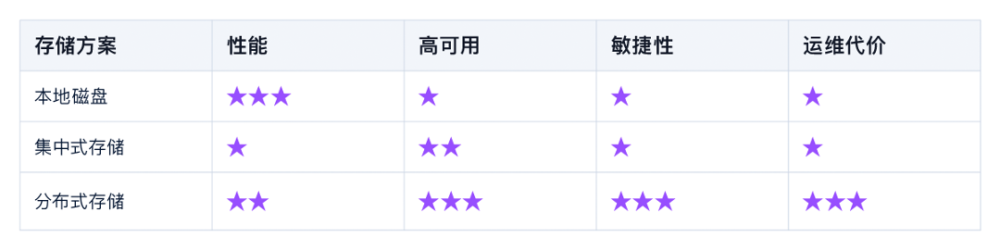
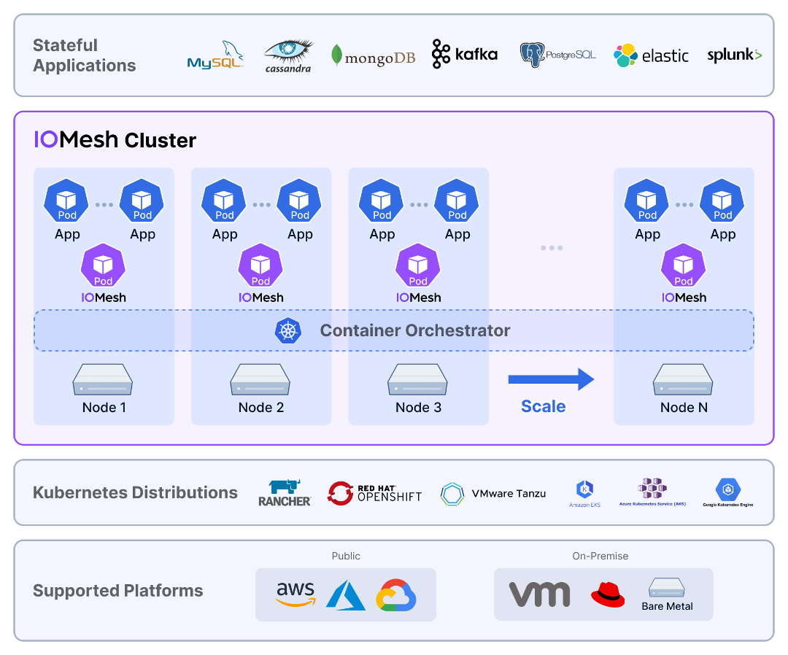
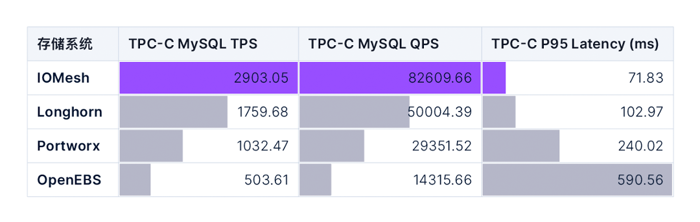
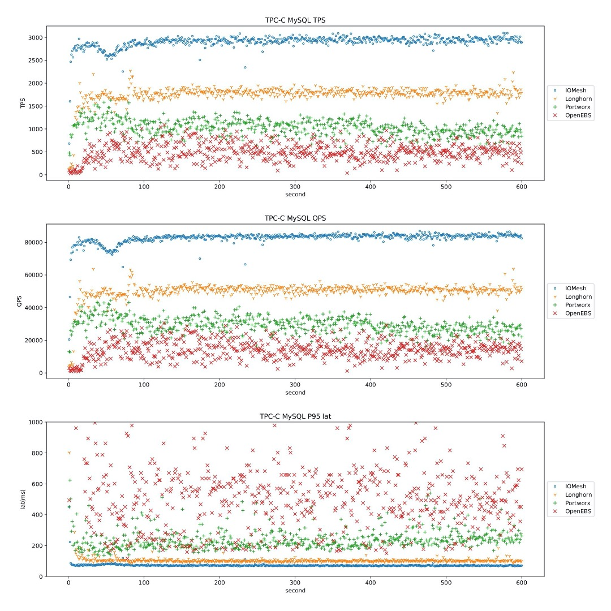

```
---
title: "云原生时代需要什么样的存储系统"
date: 2021-06-22T19:51:43+08:00
description: "本文介绍了目前云原生环境下，支持有状态应用的几种典型存储方案的特点，并对市场主流的几个云原生存储产品实际测试性能进行对比。"
author: "[Kyle Zhang](https://github.com/kylezh)"
image: "/images/blog/cloud-native-storage-banner.png"
categories: ["云原生"]
tags: ["云原生", "云原生存储", "云原生数据库"]
type: "post"
avatar: "/images/profile/kylezh.png"
profile: "张凯现任 SmartX 联合创始人兼 CTO。张凯硕士毕业于清华大学计算机系，拥有十余年分布式存储研究与产品经验。在创立 SmartX 之前，张凯曾就职于 Baidu，负责大数据平台基础设施建设、稳定性和性能优化。"
---
```

## 现状

当前，云原生已经成为应用开发者在选择架构设计时的首选。云原生让应用开发者可以将所有精力都集中在开发业务逻辑本身，这极大降低了应用开发者的负担。

而应用系统的敏捷性、扩展性、可靠性、高可用等，则由基础设施软件和运维团队共同承担。一方面，运维团队需要利用基础设施软件，快速响应业务系统提出的部署、扩容、迁移等需求，另一方面，也要时刻保持业务系统和基础设施软件的稳定运行。这为基础设施软件和运维团队都带来了更大的挑战。

如何正确的为基础架构软件进行设计和选型，就成为了运维主管们最具挑战的任务之一。

## 云原生场景下的存储系统

存储系统一直以来都是基础设施软件中的核心之一。无论业务采用什么样的运行环境和架构，都离不开存储系统的支撑。

在过去的 30 年中，业务系统的运行环境经历了巨大的变化，从单独部署的物理机，小规模部署的虚拟化环境，大规模部署的云环境，以及目前的 Kubernetes 平台。在这个变革的过程中，业务系统对平台敏捷性的要求越来越高。在物理机时代，运维人员需要手动配置存储系统和部署业务系统，业务上线以周为单位。而在云原生时代，每分钟都可能发布新的应用版本，每天都可能有大量的业务要上线。

这意味着，云原生时代的存储系统，除了要满足性能、稳定性、可靠性的要求以外，还要满足业务系统对敏捷性的要求，能够通过统一的编排系统配合业务上线，并且可以实现快速扩容。同时，为了减轻运维管理员的工作负担，存储系统自身的自动化运维能力，也成为运维团队关注的核心焦点。

## 云原生的存储方案



图 1. 使用/部署容器的主要挑战（图片来源于 CNCF 报告）

从 CNCF 的调查可以看出，目前存储系统依然是云原生场景使用和部署中面临的最主要障碍之一。接下来我们来介绍一下云原生场景下不同存储方案的优劣点。

### 本地磁盘

本地磁盘是最容易想到的方式，也是从物理机时代就一直在使用的方式。

在服务器的硬盘槽上插上硬盘，并利用 HBA 卡或软件的方式制作 RAID，划分逻辑卷，格式化成某种文件系统后，挂载到容器中。

由于磁盘和应用系统中间的 IO 路径最短，本地磁盘可以提供最佳的性能。同时 RAID 提供了一定程度的可靠性的保证，可以避免因单个磁盘故障而导致的数据丢失。因此，目前有大量用户采用这种方式为有状态的应用提供存储服务。

然而本地磁盘方案也存在着巨大的缺陷。

- 首先，本地磁盘无法提供节点级别的高可用，当物理节点发生故障时，由于数据都存储在故障节点上，所以应用无法被恢复到其他节点。如果业务系统有节点级高可用的要求，则必须由业务系统自己实现数据层面的高可用，这极大的增加了业务系统的复杂度。
- 其次，本地磁盘在敏捷性上也无法满足业务需求，业务使用的存储空间受限于本地磁盘的大小，如果达到磁盘空间的上限后难以扩容。部署 RAID 也是相当耗时的操作，难以实现在短时间内部署大量的应用系统。
- 此外，该方案无论是部署还是故障后的修复，都需要大量人力的参与，这使得本地存储方案的运维成本非常高。同时由于节点间的存储空间无法共享，也很容易造成存储空间的浪费。

总的来说，本地磁盘的方案只适合在业务容器化的初期阶段进行小规模试用，难以在大规模场景下被广泛使用。

### 集中式存储

集中式存储提供了可远程访问共享存储的能力。和本地磁盘的方案相比，集中式存储解决了应用系统高可用的问题，当业务系统所在的服务器发生故障时，由于数据不再存储在服务器本地，而是存储在远端的共享存储中，所以可以在其他节点上把应用拉起来，以实现业务系统的高可用。此外，由于数据集中存储，也一定程度解决了本地存储对磁盘空间浪费的问题。

很多商用存储都采用集中式存储架构，除了基本的数据读写能力外，还提供了很多高级功能，包括快照、克隆、容灾等等，进一步提升业务数据的可靠性。

然而集中式存储的架构决定了它不适合云原生的场景。

- 集中式存储采用存储控制器加盘柜的形式，控制器负责提供性能和存储功能，盘柜提供可扩展的存储容量。
- 尽管集中式存储可以为单个业务系统提供较高的性能保证，但是当面临大量业务并发访问时，存储控制器则成为了性能瓶颈。如果想要满足大量业务对性能需求，需要采用多套集中式存储系统，存储系统的管理成本也会急剧上升。
- 此外，由于集中式存储诞生在几十年前，在设计上就没有把敏捷性和运维便利性考虑进去，无法应对短时间内大量 Volume 的并发创建和销毁操作，无法满足业务系统对敏捷性的要求。

### 分布式存储

分布式存储的诞生就是为了解决集中式存储无法解决的问题。

分布式存储天然具有横向扩展能力，在性能和高可用方面远优于集中式存储，非常适合应对大规模虚拟化场景。与此同时，分布式存储也逐渐具备了企业级存储的能力，包括快照、克隆等等。

不过，尽管分布式存储在架构上具备众多优点，但在实现难度上具备非常大的挑战，并不是所有的分布式存储都能够充分发挥出分布式架构的优势。在实际的使用过程中，大部分分布式存储的性能和稳定性都难以达到生产级别的标准，这使得很多运维团队不敢轻易地部署分布式存储产品。

### 总结



图 2. 不同存储方案对比

## 云原生有状态应用对存储系统的需求

谈存储技术无法脱离应用场景。在云原生架构下，大部分业务系统不会处理数据存储的逻辑，而是尽可能将数据存储和处理能力交给数据库来完成。

目前越来越多的数据库也在采用云原生架构，数据库迎来了云原生时代。云原生数据库将实例运行在容器中，具备了快速部署，快速扩容的能力。同时，云原生数据库也采用了“存算分离”的架构，将数据库计算逻辑和存储逻辑进一步进行分离，存储能力交给更专业的存储系统完成，数据库只专注在数据库的业务逻辑处理。

在某种程度上讲，我们可以说云原生时代的有状态应用，大部分指的就是“云原生数据库”。接下来，我们分两种典型的数据库类型进行介绍。

### 交易型数据库（OLTP）

常见的 OLTP 数据库有 MySQL，PostgreSQL 等，通常承载的都是核心交易类业务，对存储系统的数据可靠性、性能要求极高。交易类业务本身对延迟非常敏感，所以存储系统的性能直接决定了 OLTP 系统能提供的能力。存储系统的带宽越高、延迟越低，OLTP 能提供的 TPS 越高。

每一套业务系统通常都会有 N 套独立的 OLTP 数据库作为业务支撑。由于业务系统会频繁的进行部署以及扩容，所以支撑 OLTP 的存储系统必须具备很高的敏捷性，可以快速提供数据库对存储空间的需求，同时也要方便的进行扩容等操作。

大部分 OLTP 数据库采用块存储系统作为数据存储系统，因为块存储通常可以提供最佳的性能。此外，商业块存储还提供了快照、克隆等技术，可以很好地保证数据库业务的延续性。

### 分析型数据库（OLAP）

OLAP 数据库主要用在数据分析场景，对存储系统的可靠性以及延迟的要求都不像 OLTP 数据库那么高，且因为数据量巨大，所以对存储成本也非常敏感。

为了支撑 OLAP 对存储成本的要求，存储系统通常采用 EC 技术，以降低数据存储的成本。而考虑到文件接口难以支撑百亿级别的文件数量，所以 OLAP 使用的存储系统通常采用对象接口，例如 S3 接口。

OLAP 系统对敏捷性没有特殊的需求，一旦部署好后，最常见的运维操作是扩容，并不会对数据库频繁的进行重新部署和销毁操作。

基于以上因素，分析型数据库通常采用支持 EC 的对象存储作为数据存储服务，通过 S3 接口访问数据。

### 总结


图 3. OLTP 和 OLAP 对存储系统的不同要求

## 多云环境对存储系统带来的新挑战

随着云技术越来越成熟，越来越多的企业面临多云的需求：部分对数据安全不敏感且具有大量网络流量的业务需要使用公有云服务，而对数据安全性和服务稳定性要求较高的业务需要使用私有云服务。

公有云和私有云在产品设计理念上完全不同，产品的使用方式、运维方式、服务质量、产品参数也完全不同。即使同样是公有云或者私有云，不同的服务提供商之间也存在着巨大差异。多云的环境，对企业的运维团队提出了巨大的挑战。

而云原生架构的诞生，就是为了应对多云的挑战：开发者在设计云原生应用时，只需要关注应用被如何创建和部署，无需关注在哪里运行。

然而尽管目前有相当多的开发者采用了云原生的架构设计应用系统，但是对于基础架构软件来说，目前还是由不同的云厂商来提供。基础架构的运维人员需要为不同服务商提供的存储系统，准备不同的运维方式，这极大的增加了运维人员的负担。

由此也诞生一个新的存储系统类别：云原生存储系统。云原生存储系统可以良好的运行在各种不同服务商提供的公有云环境或私有云环境，并且为运维人员提供相同接口和运维方式。云原生存储系统可以极大的降低运维团队的负担。

### 云原生存储有什么不同

此处我们以 IOMesh 的架构图作为示例，说明云原生存储的特点。



图 4. IOMesh 产品架构图

云原生存储不仅仅可以做到支持在公有云和私有云运行，而且提供了容器化部署、自动运维、声明式接口等特征，让用户可以采用和运维其他云原生应用一样的方式对存储系统进行部署、运维和管理。

除此之外，云原生存储还需要能够很好地和其他云原生基础设施配合，例如云原生数据库，使得云原生数据库可以真正的在公有云和私有云都能够得到一致的用户体验。

## 如何选择云原生存储

云原生存储也是存储系统，所以存储系统所必备的可靠性，性能，高可用等等特点都是必不可少的。

除此之外，“云原生”对存储系统提出了更高的要求。

### 尽量减少环境依赖

云原生存储系统应尽量不对软硬件环境存在任何依赖，例如对内核的依赖，对特定的网络设备和磁盘型号的依赖等等。只有尽量少的依赖，才能够做到最大的适配性。

### 避免资源消耗过高

云原生存储系统以容器的形式和业务系统混合部署在容器平台上。如果存储系统占用过多的计算资源（CPU、内存），则会导致整体投入成本太高。

### 声明式运维方式

存储系统应支持通过声明式的接口进行运维管理，同时支持一定程度的自动化运维，包括在线扩容、升级等等。当发生硬件故障时，存储服务可以自动恢复，以保证业务系统不受影响。

### 云原生生态

云原生存储系统应该可以很好地和云原生的运维生态系统结合，包括监控、报警、日志处理等待。

## 云原生存储系统的性能对比

性能是评判存储系统是否能够支撑核心业务的关键指标。本文将对 4 个常见的云原生存储系统，IOMesh、Longhorn、Portworx、OpenEBS，的性能测试结果进行对比。

我们准备了三个 Worker 节点作为运行应用和云原生存储的节点，每个节点配备了两块 SATA SSD，四块 SATA HDD，以及万兆网卡。

在测试中，我们采用最常见的 MySQL 数据库作为有状态应用，并使用 sysbench-tpcc 模拟业务负载。下表提供了四个云原生存储系统在 TPC-C MySQL 测试中的 TPS、QPS 以及 P95 延迟数据。



图 5. TPC-C MySQL 综合性能测试

下图对比了四个云原生存储系统的性能测试结果。图中横轴代表测试时间，纵轴分别代表：TPS、QPS、以及 P95 延迟的瞬时值。



图 6. TPC-C MySQL 性能稳定性测试

从以上数据与对比可以明显地看出， IOMesh 在绝对性能，以及性能的稳定性上，都遥遥领先于其他的云原生存储系统，具备为核心生产系统提供存储支撑的能力。

## 总结

随着云原生时代的到来，越来越多的业务系统会采用云原生架构。存储系统作为承载业务稳定运行的核心组件，在云原生的架构下，也面临着新的挑战。与此同时，数据库以及存储系统自身也受到了云原生架构的影响，逐渐发展出云原生数据库和云原生存储系统。未来可以看到越来越多的云原生数据库和云原生存储出现在数据中心中，成为被广泛使用的技术。
