本文将向大家介绍同程旅行大数据集群在Kubernetes上服务化建设的一些实践和经验。
## 前言
同程旅行大数据集群从 2017 年开始容器化改造，经历了自研调度 docker 容器 ，到现在的`云舱`平台,采用 `Kubernetes` 调度编排工具管理大数据集群服务。

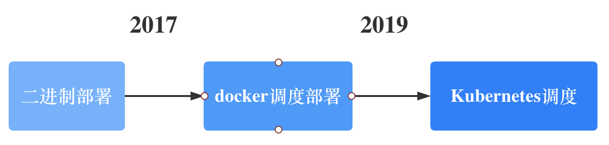

在这个过程中遇到很多问题和难点，本文会向大家介绍上云过程中总结的经验和教训。

今天的议题主要分下面几点来阐述:

- 为什么要将大数据集群服务搬到Kubernetes上
- 在上云的过程遇到哪些痛点
- 大数据服务上云攻略
- 现状和未来发展

## 集群即服务的理念
部门内部很早就提出集群即服务的理念，作为基础组件研发，希望从产品的角度来看待组件或者集群，让业务研发能直接触达底层集群，可以包含节点、日志、监控等功能，让集群使用更简单。

### 推行小集群化
以前组件研发部署一个组件集群，这个集群会陆续承接一些业务，时常会遇到A业务影响B业务，集群负责人会开始考虑拆分，搭建出一个新集群将消耗资源的业务拆分出去。这种是以人工介入的方式去评估业务体量并分配资源。

现在部门开始推行小集群模式，每个业务研发组都可以申请一个或者多个集群，在物理层面做到资源隔离，互不影响，不会因为A业务的流量上升而影响其他业务。

### 自动化运维建设
小集群化会导致集群数量成倍的上升，如果不做自动化运维，人力会远远跟不上业务增长，到那时组件研发会淹没在救火和运维的海洋。

所以需要构建一个集群全流程自动化平台。这里面包含服务申请，服务部署，服务运维等功能。

### 如何利用 Kubernetes 利器
起初自研编排工具去调度容器，但是实现的东西太多，在人力有限的情况下，认为这条路不可行。

2019年开始采用 `Kubernetes` 调度编排容器，先后采取过用`Helm` 工具编写模板部署组件，用`Operator`的方式管理服务，用Statefulset/Deployment 部署大数据集群。这些方式最后都被放弃。Helm 只是解决了部署的问题，想要基于 `Helm` 做平台精细化运维比较麻烦。Operator的理念是针对某个组件做自定义CRD，大数据服务有十几种组件，为每个组件专门定制Operator,运维和开发成本过大，基于此还要解决Operator和平台层的交互逻辑，这个也不适合同程的人力配比。`Statefulset`和`Deployment` 没法做到精细化运维，比如业务提出关闭某个指定的点，当业务逻辑和底层运维逻辑耦合在一起的时候，已经封装好的 Workload 并不能拿来即用。

由于是大数据生态，同程选择采用`Java Client` 和 `Kubernetes` 进行交互，在`Kuberentes` 上自研 `云舱` 调度器，将运维侧业务逻辑和平台交互代码放在一起，构建了一套适合自己的大数据服务自动化运维框架，当前覆盖了几乎所有的大数据服务，计算组件有Hive、Presto、Yarn，存储组件有 HDFS、ClickHouse、Kafka、Kudu等。

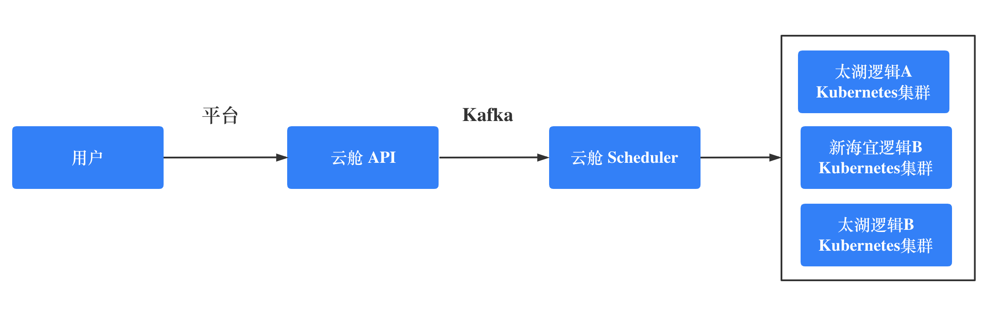

## 上云过程遇到了哪些痛点

### Kubernetes 环境问题
由于大数据组件有很多是分布式存储系统，组件本身会要求客户端和服务端能够网络互通，端到端的建立连接。这就需要`Kubernetes`容器网络要和外部物理网络打通，当然也可以采用`Proxy`层来屏蔽底层存储。同程大数据选择构建 `Underlay` 的容器网络，做到IP保持，容器IP提前分配，IP自动回收等功能。

将`Service`层网络和公司四层负载 `TVS` 服务做到很好的集成，利用Endpoints和Service 事件监听来保证负载数据的一致性。由于网络环境的限制，一个机房没有办法只搭建一个Kuberntes集群，需要支持一个应用跨多k8s集群部署，负载服务要支持跨多个k8s集群的应用负载。

`DNS` 层采用子域的方式做到Kubernetes 内部`CoreDns` 和公司`DNS`服务器数据同步，保证一致性，保证内外部域名通信一致。由于一些组件迁移的需求，需要提供在容器拉起来之前预先配置`DNS`和`IP`映射的功能,所以只好根据已知的`Pod`标识，提前分配IP。

### 基于Pod的方式管理容器
刚开始的时候采用`Statefulset`来部署一些服务，一些开源的Operator也是基于`STS`管理服务，比如我正在持续贡献的 `TiDB Operator` 、`Prometheus Operator`。虽然可以复用已有Workload的功能，但是当场景复杂，这么做反而会缝缝补补。大数据组件就是这样一个复杂的场景，所以决定采用纯`Pod`管理容器，基于Pod去组装成 `Group`。比如HDFS组件，会拆分成 `namenode` 、`journalnode`、`datanode` 这三个`Group`，每个`Group`可以理解为是同一种节点类型的容器。

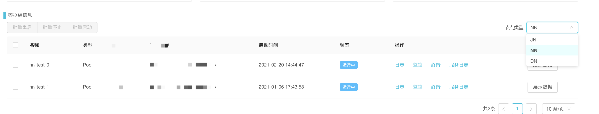

### Pod 配置有状态
存储组件有个明显的特性就是配置文件中会有一个唯一标识，比如`Zookeeper`的 `myid` , `Kafka` 的 `broker id`。将老集群逐步迁移到`Kubernetes`上的时候，这些配置项需要自定义且持久化。

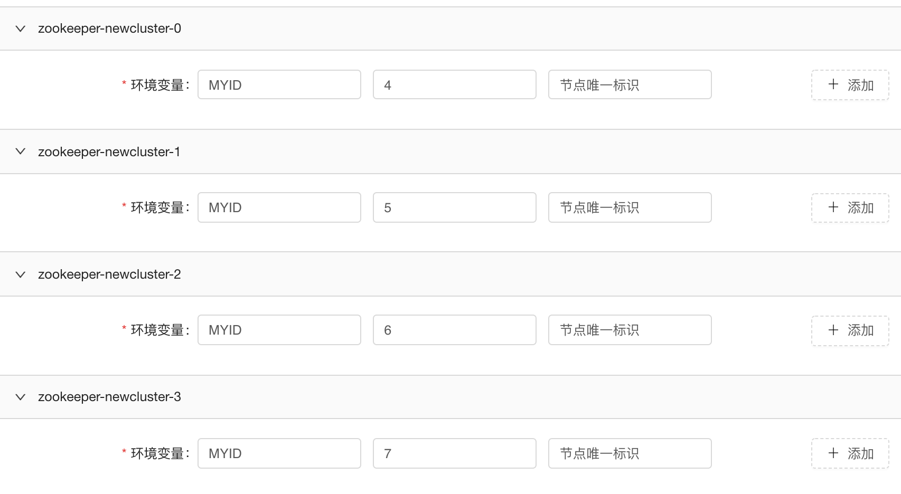

如果组件本身的配置文件格式比较固定，会做成模板化，将特定的配置项抽出来提供给组件研发配置，通过环境变量的方式注入到容器中。对于自定义特别强的组件，会基于`ConfigMap`做配置的版本控制，让组件研发可以很方便的填写配置并推送配置，`ClickHouse` 就是非常自定义配置的组件。

### 以虚拟机的方式启动容器
用`Kubernetes`部署有状态服务的时候，由于配置错误会导致容器反复`crash`,这个时候组件研发只希望快速进入现场排查问题，所以针对存储类组件均采用`tail -F`的方式启动容器，让服务进程作为后台进程启动，配置完善的健康检查，快速发现节点的不健康性。

这种方式虽然违反了`Kubernetes`的设计原则，但是易用性会显著提升。在部署Yarn组件的时候，由于`tail -F`命令为主进程，导致大量僵尸进程，最后改用`bash`命令启动。
### 资源异构问题和多盘挂载问题
在部署 Yarn 组件过程中，由于机器规格的问题，导致同一个应用节点之间的资源配置不一样，我们设计采用划分资源池，将相同规格的机器分为一个资源池，一个应用根据资源池的配置来调整合适的资源。

在`Kubernetes`中使用本地盘，一般会推荐`localpv`的方式，大数据某些组件会采用多盘写入的方式部署，`local pv`的方式并不能解决这个问题。同程大数据选择采用`hostpath`+`nodeselector`的方式来做到多盘绑定且节点不漂移。在提交给`Kubernetes Scheduler`之前，会在`云舱Scheduler`基于资源池和节点信息对容器提前做一层调度。
起初准备用`hostpath`+`nodename`的方式来做到节点不漂移，但是`nodename` 会跳过 Scheduler update 步骤，并不会进行 `bind` pvc等步骤。详情可以参考 [issue 93145](https://github.com/kubernetes/kubernetes/issues/93145)。

### DNS 问题
大数据里面很多组件节点都采用 `hostname` 作为节点标识，比如`NodeManager`采用`hostname`注册，`Hbase`组件要支持域名反解，`Kudu`的master节点依赖自身的域名提前通信。这些都违背了Kubernetes的设计理念，`Kubernetes` 创建容器，CNI分配得到IP，进程启动OK，容器变成Ready状态，Pod的Service域名才能通信。

同程大数据选择用`Host`网络部署大部分的存储组件，沿用宿主机网络，除了`Kubernetes`集群子域外再创建一个子域用于组件本身标识，这样组件迁移会很方便，也不有网络损耗的烦恼。但是要做好宿主机端口的管理划分。

### 调度问题
为了提升资源利用率，`云舱` 平台会有很多分时段的部署任务和资源销毁任务。比如某个`Yarn`集群，晚上的时候，对可以混部的资源池打上标签，在晚高峰的时候尽可能的扩容`NodeManager`。这个类似于`HPA`，由于业务逻辑的复杂性，同程基于自研 `云舱Scheduler` 做到这一点。

## 大数据服务基于Kubernetes的架构体系
从`2019`年开始转向 `Kubernetes` 到现在，同程已经建立了一套成熟的大数据服务`PAAS`体系。

基于Kubernetes屏蔽底层的基础设施，支持多机房多k8s集群的应用部署，除了要考虑各种大数据服务如何迁移上云，也要考虑整个平台的易用性，让组件研发无需登录机器进行运维和迁移等操作。同程自研了`云舱`平台，主要承担这一职责。

考虑到业务研发的接入成本，学习成本，研发`控制台`平台，让只读的集群信息和集群管理结合起来。改变以前底层信息触摸不到的情景，让业务研发也能在平台层获取更多的信息，可以对自己的服务做出一些合理的判断。

### 监控收集
使用`Thanos`+`Prometheus Operator`框架部署收集各个组件集群的监控，按照以下原则来做到监控的可扩展。

- 一个组件集群对应一个`Prometheus`节点
- 每个组件都对应一套独立的Thanos集群，`Thanos Query` 聚合同一组件的所有集群，`Thanos Rule` 通过自研的`Sidecar`同步组件报警规则,部署独立的`AlterManager`，独立的`Grafana`应用。
- 每个组件都有一个ceph bucket,将历史监控数据存储到`Ceph`中。

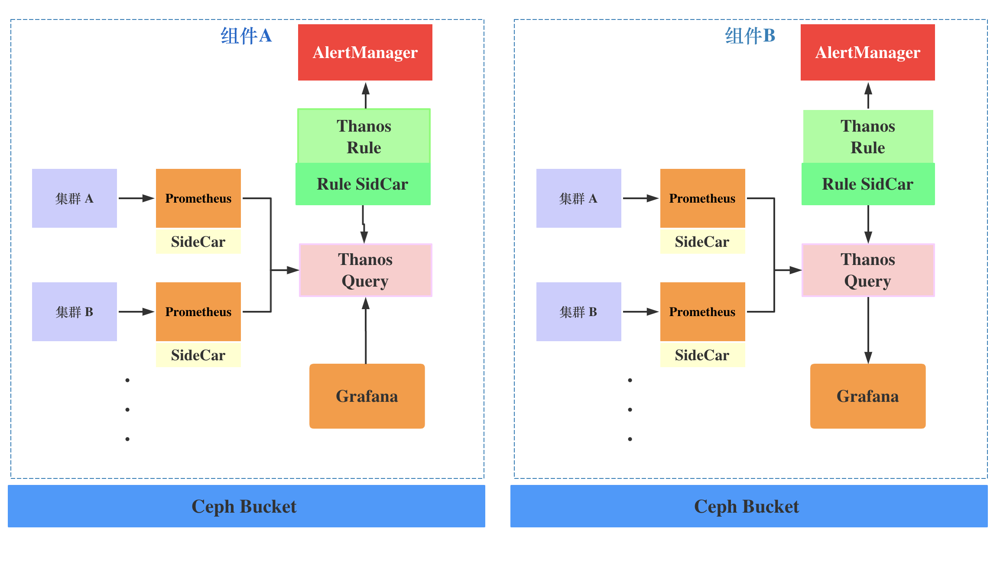

监控域名规则配置如下:

Prometheus: `<域名>/prometheus/<组件名>/<集群名称>`

Thanos Query:` <域名>/thanos/<组件名>`

Thanos Rule:` <域名>/thanos/rule/<组件名>/alerts`

AlertManger: ` <域名>/thanos/alert/<组件名>/#/alerts`

Grafana: ` <域名>/grafana/<组件名>`

### 集群服务日志收集
使用`Filebeat`采集集群节点的服务日志，将`Filebeat`容器和服务容器放在一个`Pod`中,用富容器的方式来启动服务。

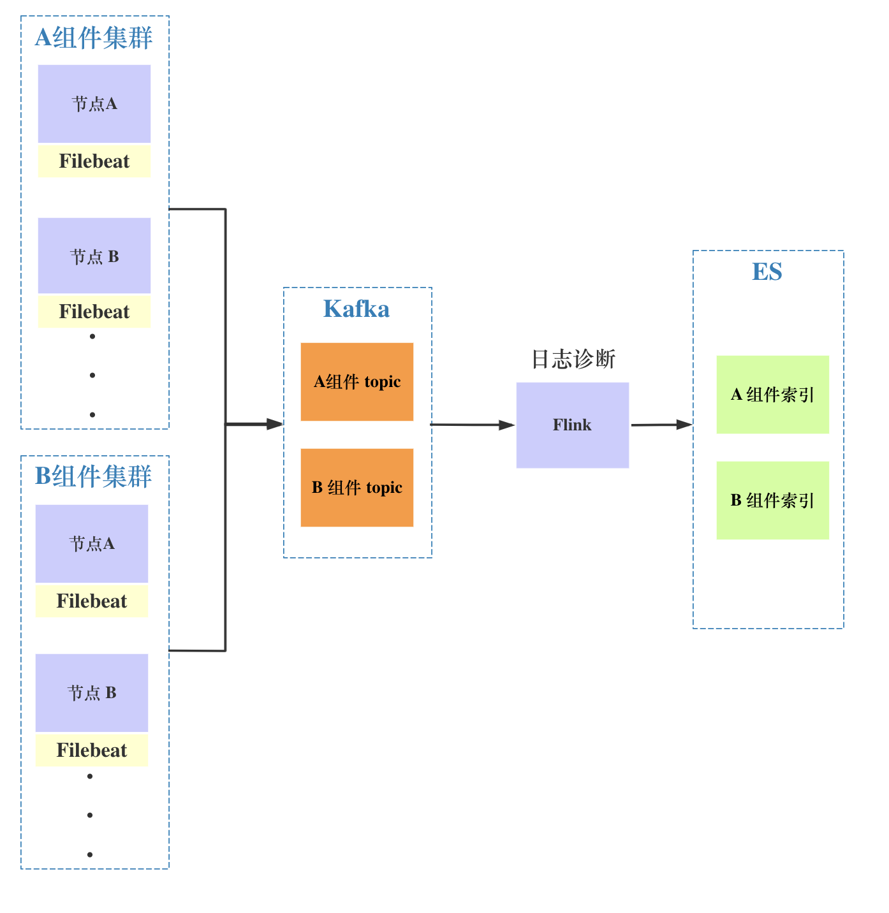

在`Flink`计算层做日志诊断，提供配置规则动态更新，便于更快速发现集群的故障问题。
### 集群生命周期平台化
一个组件的集群从申请创建到服务销毁中间包含很多环节，应该将这些环节程序并平台化，让基础技术能以平台代码的形式沉淀下来。

下图是用户申请`Hbase`集群服务的工单，用户在申请的时候只需要填写少量配置。简单就是让业务少思考。
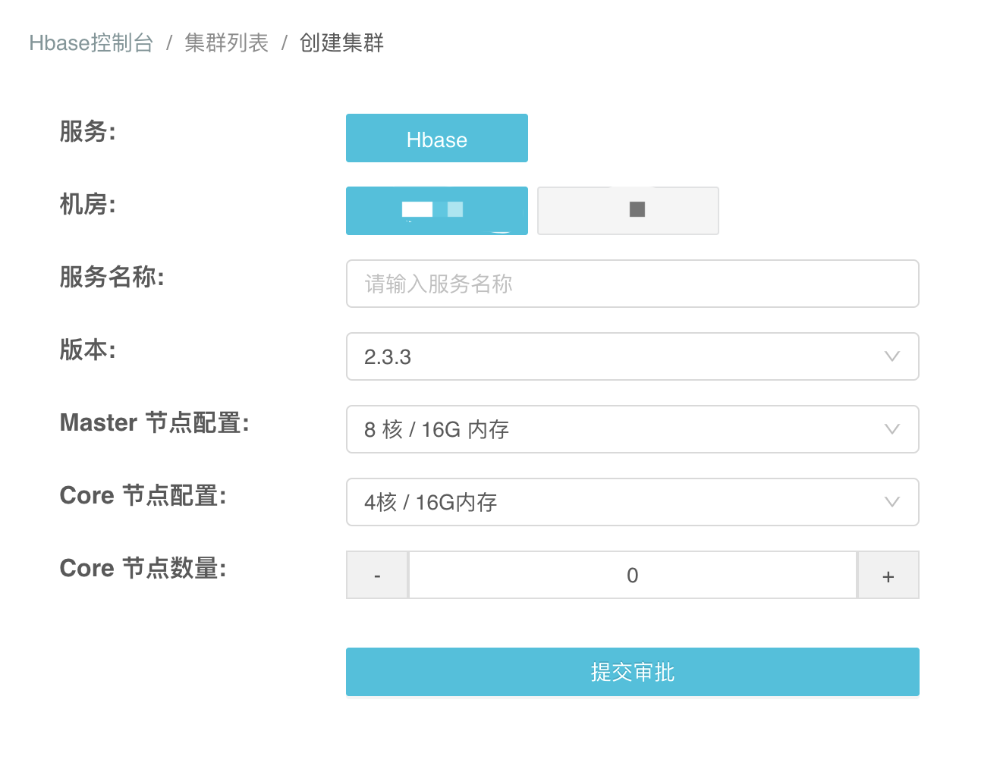

组件`控制台`为业务研发侧提供只读信息，例如集群信息、监控、日志、报警等功能，和组件本身管控平台相结合，不提供操作或者运维集群的功能。

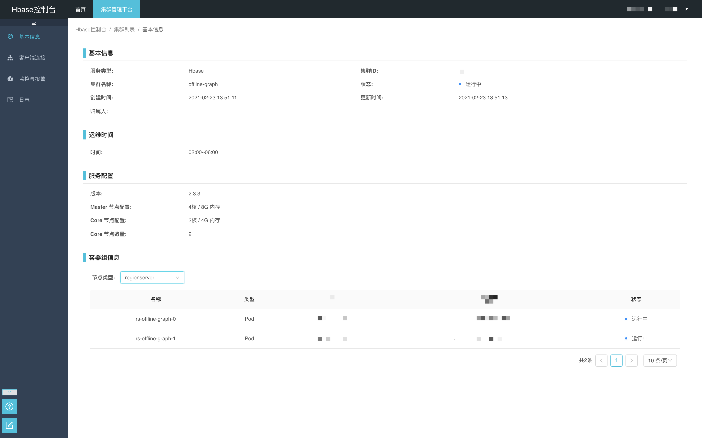

`云舱平台`会为组件研发提供完善的运维和诊断功能，让他们无需关心底层基础设施层。

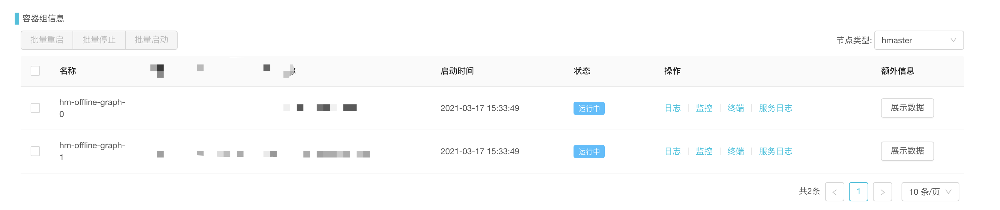

集群服务化后，计费，报警配置，日志诊断能功能都能轻松的集成起来。
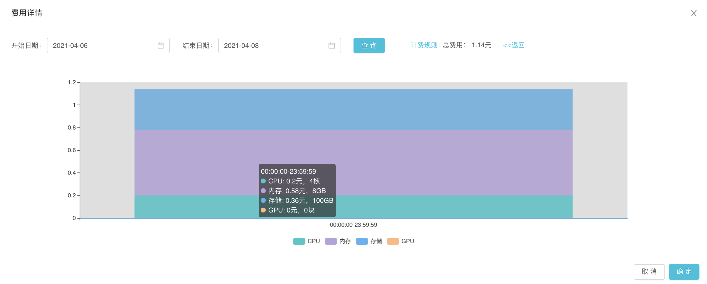

### 自研大数据云原生服务框架
`云舱`平台将服务分为单个容器和多个容器，用数量来区分，在此之上用组装的方式支持多节点类型，一个节点类型对应一个`Group`,这个Group就是一组相同规格的容器。比如Kudu组件就分成两个`Group`,master和tserver两个`Group`。

用一个UML图来简单描述代码层结构:
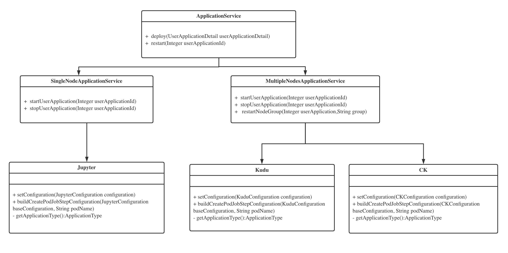

对`Kubernetes`集群的操作会分解成多个`Task`,`Task`之间有依赖关系，组装成`Job`发送给`Kafka`，云舱Scheduler进行消费和处理。比如部署一个`Zookeeper`集群，先创建容器，再创建`Service`负载，配置`DNS`策略，配置监控，这是一个完整的部署任务。

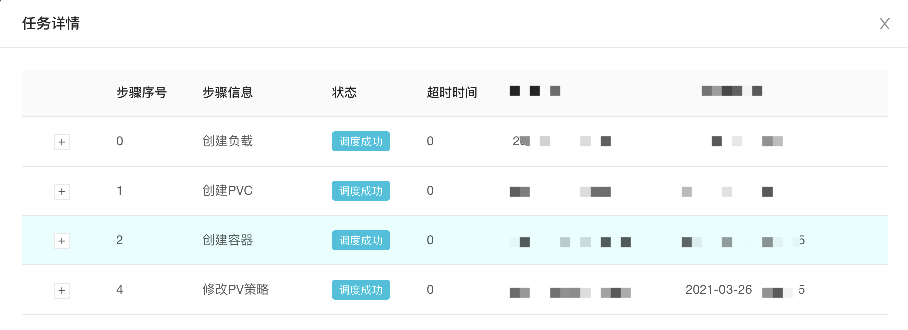

## 现状
当前同程将几乎所有的大数据服务都采用 `Kubernetes` 工具部署和调度，有近`400+`集群服务跑在`Kubernetes`上， 一个新的组件集群可以在15分钟之内完成交付，极大地减少组件部署消耗的时间。当所有的集群服务被平台化管理后，对于机器资源层的调度和利用率提升的需求越来越明显，同程基于资源监控对组件做混合部署，利用率提升`30%`。

大数据底层一般会分为计算和存储，但是随着机器资源越来越多，资源层的研发也是很关键的一环。同程希望将数据，资源，算法流程打通，让数据使用更简单，让数据处理更快更稳定。

业界有很多公司会考虑将大数据计算任务 `native on k8s`,同程也进行调研和尝试，当前大家都只是解决了部署的问题，任务的完整生命周期还需要研发和测试。所以同程还是着重于 `Yarn` on k8s,一些算法和分析类的`Python`任务会采用容器调度方式运行。

## 未来方向
同程大数据上云还有很多问题没有去优雅的解决，比如已有服务如何平滑的通过平台的方式迁移上云，现在还有很多中间过程需要资源研发介入。

未来的方向主要分为:

- 采用混部和分时调度，提升集群资源整体利用率
- 用混沌工程的方式提升组件稳定性。
-  计算任务 `native on k8s`,提供高优保障。
- 持续提升PAAS平台易用性。
- 让底层资源触手可及。
