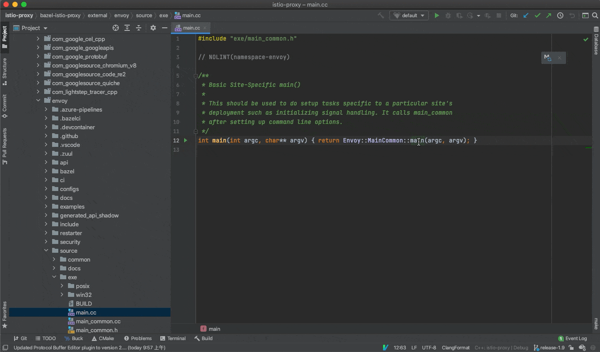
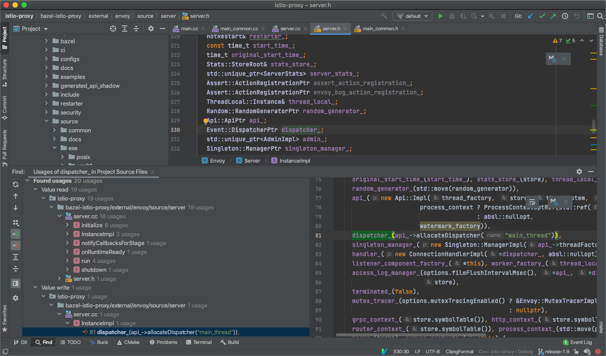
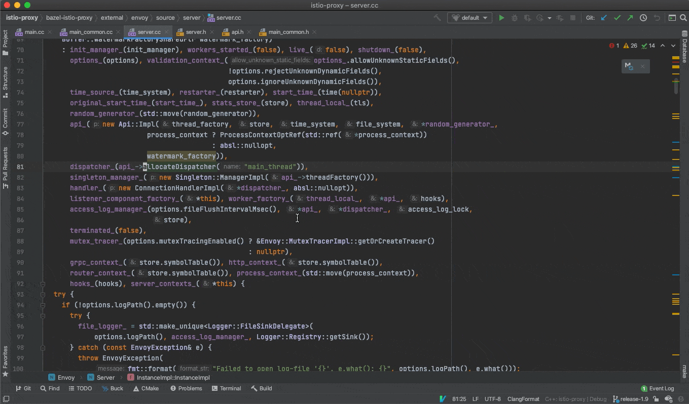

## 背景

要想深入学习 istio，还得学习下数据面的实现，istio 的数据面使用了 envoy，在 istio group 下有个叫 [proxy](https://github.com/istio/proxy) 的仓库，包含了一些 istio 用到的一些 envoy 扩展，编译时将 envoy 代码作为库来引用，最终使用 bazel 编译出 istio 版本的 Envoy。

代码量非常庞大，如果没有智能的代码跳转、查找引用与实现，阅读和开发起来简直低效的要命。如何更加高效呢？关键在于 IDE/编辑器 的代码索引能力要好，需要能够准确跳转和查询，vscode 用的同学比较多，但它的 c/c++ 插件不够智能，很多情况无法跳转，而且效率较低；它还有个 clangd 的插件，基于 LSP，但不够成熟。这方面做的最好的目前还是来自 JetBrains CLion，不过它需要依赖 `CMakeLists.txt` 文件来解析项目结构，由于 c/c++ 没有统一的结构标准，不同项目结构千差万别，不太好自动生成 `CMakeLists.txt`，需要我们先理解项目结构，然后编写 `CMakeLists.txt` 来让 CLion 进行解析。

虽然社区有人针对 bazel 构建的项目写了一个通用脚本 [bazel-cmakelists](https://github.com/lizan/bazel-cmakelists) ，但很久没维护，测试了用它来生成最新 envoy 的 `CMakeLists.txt` ，由于代码量庞大，最终会 OOM 而失败。

所以我们需要另寻更好的方法，不太了解这方面的同学弄起来会比较麻烦，本人也折腾了好一段时间才搞定，本文记录下方法和心得，以供大家参考。

## 克隆代码

首先克隆 [istio-proxy](https://github.com/istio/proxy) 的代码:

``` bash
git clone https://github.com/istio/proxy.git istio-proxy
```

最好切到某个稳定的 release 分支上:

``` bash
cd istio-proxy
git checkout -b release-1.9 origin/release-1.9
```

## 项目分析

istio-proxy 代码库中主要只包含了在 istio 里用到的一些 envoy 扩展，代码量不大，源码主要分布在 src 与 extensions 目录，但编译需要很久，因为它实际编译的是 envoy，只是利用 bazel 将自身代码作为扩展编译进 envoy (得益于 envoy 的扩展机制)，从这个 bazel 的 [BUILD 文件](https://github.com/istio/proxy/blob/master/src/envoy/BUILD) 就能看得出来:

``` txt
envoy_cc_binary(
    name = "envoy",
    repository = "@envoy",
    visibility = ["//visibility:public"],
    deps = [
        "//extensions/access_log_policy:access_log_policy_lib",
        "//extensions/attributegen:attributegen_plugin",
        "//extensions/metadata_exchange:metadata_exchange_lib",
        "//extensions/stackdriver:stackdriver_plugin",
        "//extensions/stats:stats_plugin",
        "//src/envoy/extensions/wasm:wasm_lib",
        "//src/envoy/http/alpn:config_lib",
        "//src/envoy/http/authn:filter_lib",
        "//src/envoy/tcp/forward_downstream_sni:config_lib",
        "//src/envoy/tcp/metadata_exchange:config_lib",
        "//src/envoy/tcp/sni_verifier:config_lib",
        "//src/envoy/tcp/tcp_cluster_rewrite:config_lib",
        "@envoy//source/exe:envoy_main_entry_lib",
    ],
)
```

其中 `@envoy` 表示引用 envoy 代码库，main 函数也位于 envoy 代码库中。那么 envoy 代码库从哪儿来的呢？bazel 在构建时会自动下载指定的依赖，envoy 的代码来源在 [WORKSPACE](https://github.com/istio/proxy/blob/master/WORKSPACE) 中有指定:

``` txt
http_archive(
    name = "envoy",
    sha256 = ENVOY_SHA256,
    strip_prefix = ENVOY_REPO + "-" + ENVOY_SHA,
    url = "https://github.com/" + ENVOY_ORG + "/" + ENVOY_REPO + "/archive/" + ENVOY_SHA + ".tar.gz",
)
```

bazel 会自动下载指定版本的源码包来编译。

## 如果获取依赖源文件?

由于 istio-proxy 依赖了大量的第三方源文件，我们要阅读代码需要将这些源文件都下下来，只要将它编译一次，所有依赖源文件以及 generated 的代码都可以自动给你备好，所以我们需要对它进行一次编译。

由于编译 envoy 有复杂的工具链依赖，官方推荐使用容器进行编译，在执行 `make` 前加个 `BUILD_WITH_CONTAINER=1` 即可指定使用容器编译，免去复杂的环境依赖。但 bazel 编译会将依赖和 generated 的源文件都软链到临时目录，如果用容器编译，就会丢失这部分代码，而我们阅读 istio-proxy 代码时最关键的就是这部分代码了，所以不能用容器编译。

## 安装 bazelisk

不用容器编译就需要本机环境基本满足工具链要求，首先是需要安装 bazel，由于 bazel 版本很多，不同 istio-proxy(envoy) 版本依赖的 bazel 版本也不一样，我们可以直接安装 [bazelisk](https://github.com/bazelbuild/bazelisk) ，一个用于 bazel 多版本管理的工具，它可以自动识别项目中 [.bazelversion](https://github.com/istio/proxy/blob/master/.bazelversion) 文件，选取指定版本的 bazel 来进行构建(可以自动下载对应版本的 bazel 二进制)。

如果是 macOS 用户，安装很简单:

``` bash
brew install bazelisk
```

> 如果之前已安装过 bazel，可以使用 `brew link --overwrite bazelisk` 强制覆盖。

其它平台的可以在 [release](https://github.com/bazelbuild/bazelisk/releases) 页面下载最新的二进制，重命名为 `bazel` 然后放到 `PATH` 下。

## 其它依赖

如果是 macOS 用户，确保务必安装好 xcode，方便跳转系统库函数，安装命令:

``` bash
xcode-select --install
```

另外主要还有 python3 (macOS 自带)，其它依赖通常都系统自带，可以先不用管，等如果编译报错了再看。

更多依赖可参考 [官方文档](https://www.envoyproxy.io/docs/envoy/latest/start/building#requirements) 。

## 编译

在 istio-proxy 代码根目录执行以下命令进行编译:

``` bash
make build_envoy
```

环境没问题的话会经过漫长的构建和编译，通常可能几十分钟，取决于电脑配置。

编译完后会发现 bazel 为我们生成了一些目录软链:


> bazel 输出目录结构可参考官方文档 [Output Directory Layout](https://docs.bazel.build/versions/master/output_directories.html#layout-diagram) 。

我们主要关注以下两个目录:
* **bazel-istio-proxy**: 包含构建 istio-proxy 用到的源文件(包含依赖)。
* **bazel-bin**: 包含一些 generated 代码。

## 生成源码文件列表

在 istio-proxy 根目录创建脚本文件 `generate-srcs.sh`:

``` bash
#!/bin/bash

set -ex

bazel_dir="bazel-${PWD##*/}"

find -L -E $bazel_dir/external src extensions -regex '.*\.(cc|c|cpp)' > sourcefiles.txt
```

执行此脚本可以生成 istio-proxy 及其依赖的源文件列表 (`sourcefiles.txt`)，用于在 `CMakeLists.txt` 中引用。

**注:** `$bazel_dir/external` 下包含内容较多，全部索引的话 CLion 可能会比较卡，很多代码基本也都不会看，可以适当缩小范围，按需来配置，比如先只添加 `$bazel_dir/external/envoy`，后续有需要再添加其它目录，然后 `Reload Cmake Project` 重新索引。

## 生成 CMakeLists.txt

然后就可以在 istio-proxy 项目根目录创建下 `CMakeLists.txt`:

``` txt
cmake_minimum_required(VERSION 3.15)
STRING( REGEX REPLACE ".*/(.*)" "\\1" CURRENT_FOLDER ${CMAKE_CURRENT_SOURCE_DIR} )
project(istio-proxy)

macro(print_all_variables)
    message(STATUS "print_all_variables------------------------------------------{")
    get_cmake_property(_variableNames VARIABLES)
    foreach (_variableName ${_variableNames})
        message(STATUS "${_variableName}=${${_variableName}}")
    endforeach()
    message(STATUS "print_all_variables------------------------------------------}")
endmacro()

set(CMAKE_CXX_STANDARD 17)
add_definitions(-DNULL_PLUGIN) # enable wasm nullvm navigation

file(STRINGS sourcefiles.txt all_SRCS)

message(STATUS "CMAKE_SOURCE_DIR=${CMAKE_SOURCE_DIR}")
message(STATUS "CMAKE_HOME_DIRECTORY=${CMAKE_HOME_DIRECTORY}")

add_executable(istio-proxy ${all_SRCS})

set(istio_include_dirs
        "./"
        "./src"
        "./extensions"

        "./bazel-${CURRENT_FOLDER}/external/envoy"
        "./bazel-${CURRENT_FOLDER}/external/envoy/source"
        "./bazel-${CURRENT_FOLDER}/external/envoy/include"
        "./bazel-${CURRENT_FOLDER}/external/envoy/api/wasm/cpp"
        "./bazel-${CURRENT_FOLDER}/external/boringssl/src/include/"
        "./bazel-${CURRENT_FOLDER}/external/com_github_gabime_spdlog/include"
        "./bazel-${CURRENT_FOLDER}/external/com_github_c_ares_c_ares"
        "./bazel-${CURRENT_FOLDER}/external/com_google_absl"
        "./bazel-${CURRENT_FOLDER}/external/com_google_cel_cpp"
        "./bazel-${CURRENT_FOLDER}/external/com_google_protobuf/src"
        "./bazel-${CURRENT_FOLDER}/external/com_github_fmtlib_fmt/include"
        "./bazel-${CURRENT_FOLDER}/external/com_github_eile_tclap/include"
        "./bazel-${CURRENT_FOLDER}/external/com_github_grpc_grpc/include"
        "./bazel-${CURRENT_FOLDER}/external/com_envoyproxy_protoc_gen_validate/"
        "./bazel-${CURRENT_FOLDER}/external/com_github_tencent_rapidjson/include/"
        "./bazel-${CURRENT_FOLDER}/external/com_github_datadog_dd_opentracing_cpp/include/"
        "./bazel-${CURRENT_FOLDER}/external/com_github_libevent_libevent/include"
        "./bazel-${CURRENT_FOLDER}/external/com_github_mirror_tclap/include"
        "./bazel-${CURRENT_FOLDER}/external/com_github_grpc_grpc"
        "./bazel-${CURRENT_FOLDER}/external/com_github_circonus_labs_libcircllhist/src/"
        "./bazel-${CURRENT_FOLDER}/external/com_github_nodejs_http_parser"
        "./bazel-${CURRENT_FOLDER}/external/com_github_nghttp2_nghttp2/lib/includes/"
        "./bazel-${CURRENT_FOLDER}/external/com_github_cyan4973_xxhash/"
        "./bazel-${CURRENT_FOLDER}/external/com_github_google_flatbuffers/include/"
        "./bazel-${CURRENT_FOLDER}/external/com_github_fmtlib_fmt/test"
        
        "./bazel-bin"
        "./bazel-bin/external/envoy_api"
        "./bazel-bin/external/mixerapi_git"
        "./bazel-bin/external/com_envoyproxy_protoc_gen_validate"
        "./bazel-bin/external/com_google_googleapis"
        "./bazel-bin/external/com_github_cncf_udpa"
)

target_include_directories(istio-proxy PUBLIC ${istio_include_dirs})
```

解释一下:
* `add_executable` 将需要索引的源文件列表 (`sourcefiles.txt`) 加进索引。
* `target_include_directories` 将用到的一些纯头文件目录加进索引 (不包含实现代码，主要是一些接口)，这里也是可以按需进行增删。

## 使用 CLion 阅读

不要直接打开 istio-proxy 目录，而是 Open 时选中 `CMakeLists.txt`，然后 `Open as Project`:


弹出 `Load Project` 时不要勾选 `Clean project`，不然退出 CLion 时会执行 `make clean`，导致把 bazel 生成的源文件都给删除掉，就没法跳转了:


然后就会开始索引，完成后就可以愉快的看代码了，先从 main 看起吧(`bazel-istio-proxy/external/envoy/source/exe/main.cc`):



查找引用:



跳转到实现:



## 小结

本文介绍了如何使用 CLion 来阅读 istio-proxy (envoy) 的代码，包含源码结构分析、环境搭建，以及生成 CLion 所需要的 `CMakeLists.txt` 文件的方法，最后也展示了效果，希望对你有所帮助。