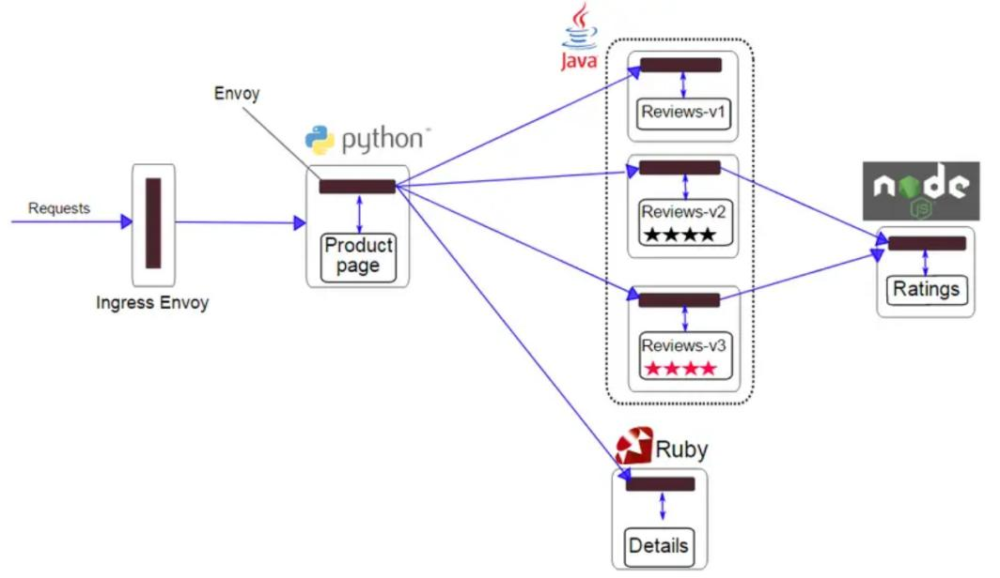
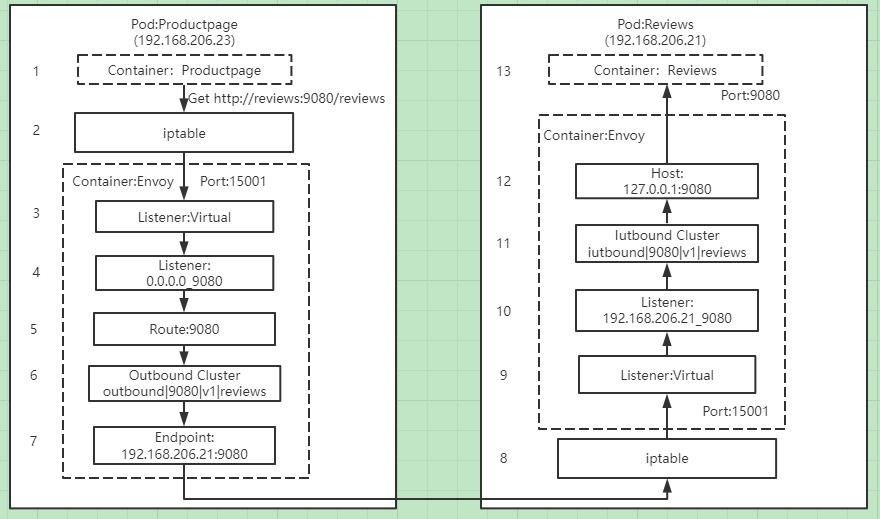
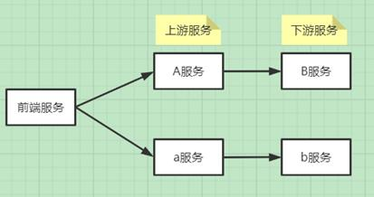

## 前言

本文将和大家一起探讨下Istio的路由管理，介绍使用Istio灰度发布的过程中，有哪些需要注意的地方。

流量治理用于控制服务之间的流量和接口调用。Istio可以通过服务级别的配置，实现蓝绿发布、灰度发布以及百分比流量策略发布等，Istio还可以实现诸如故障注入、熔断限流、超时重试等流量治理功能。
那么Istio如何具有如此强大的功能，它的路由管理是如何实现的，生产中使用Istio需要注意的要点有哪些呢？

## Istio为什么可以实现流量治理

Istio中路由策略的转发处理都是通过Envoy实现，Envoy作为Sidecar和每个服务容器部署在同一个pod中，Sidecar在注入到pod之后，将原有服务调用从源容器 ->目标容器的通信方式改变为源容器 -> Sidecar(源端) -> Sidecar(目的端) -> 目的容器，只要我们配置了正确的流量策略，通过pilot与envoy之间建立的长连接，envoy可以实时获取最新的网络路由策略，这样envoy接管了流入流出用户服务的流量，持有流量策略。并且Istio会自动探测kubernetes集群的services和endpoints，从而可以获取services与endpoints之间的关系，Envoy配置里既有流量策略，又有endpoints自然可以实现流量的转发处理。

Envoy可代理的流量包括从服务网格外部到其内部运行的服务，服务网格内部之间的服务，以及服务网格内部到外部的服务。下图展示了Istio完整的路由管理


1.客户端在特定端口上发出请求；

2.在集群内部，请求被路由到Istio ingressgateway服务所监听的端口上；

3.在Istio ingressgateway上会配置Gateway资源和VirtualService资源定义。Gateway会配置端口、协议以及相关安全证书，VirtualService的路由配置信息用于找到正确的服务；

4.Istio ingressgateway服务根据路由配置信息将请求路由到对应的应用服务上；

5.应用服务配置VirtualService与DestinationRule策略，通过Envoy进行服务调用；

6.外部服务可以通过ServiceEntry资源和VirtualService资源进行服务访问；

从上面的介绍中我们看出Istio功能的强大，下面举一个例子介绍下Istio是如何通过劫持流量实现路由管理的。

## Istio如何实现路由管理

下面以Bookinfo为例介绍下Istio中的路由管理，给需要部署Bookinfo的namespace打上istio-injection=enabled标签，通过几个kubectl apply命令就可以完成Bookinfo的部署。

Bookinfo应用分为四个单独的微服务：productpage、details、ratings、reviews，其中reviews微服务有3个版本v1、v2、v3



从图中我们可以看到Bookinfo中的几个微服务是由不同的语言编写的，不用像springcloud服务治理一样局限在java语言中；这些服务对 Istio无依赖关系，用户不用修改各个服务的代码，实现服务治理无侵入；

Reviews服务具有多个版本，通过配置VirtualService和DestinationRule可以轻松实现流量分发、管理。

这里我们以Productpage服务调用Reviews服务的流程为例讲述下注入Sidecar后，流量是如何根据VirtualService配置的路由规则实现流量流转的。

我们对Reviews的VirtualService进行配置，设置流量按照权重百分比进行转发，最终得到的Envoy里reviews的route配置信息如下：

```yaml
"route": {
    "weighted_clusters": {
        "clusters": [
             {
              "name": "outbound|80|v1|reviews.bookinfo.svc.cluster.local",
              "weight": 66
             },
             {
              "name": "outbound|80|v2|reviews.bookinfo.svc.cluster.local",
              "weight": 23
             },
             {
              "name": "outbound|80|v3|reviews.bookinfo.svc.cluster.local",
              "weight": 11
             }
        ]
    }
}
```
下面讲述下Product服务是如何按照设置的权重调用Reviews服务



1.Productpage发起对Reviews的调用：http://reviews:9080/reviews

2.请求被pod的iptable规则拦截，转发到15001固定端口，这里注入Sidecar的pod里的iptable规则均是通过Istio-init container进行修改的

3.Envoy的Virtual Listener在15001端口上监听，收到了该请求

4.请求被Virtual Listener根据原目标IP和端口转发到0.0.0.0_9080这个listener

5.根据0.0.0.0_9080 listener的filter配置，该请求采用9080 route进行分发。在这里我们看到有个特殊的9080 route，在此应用中9080 route对应了3个virtual host，分别是details、ratings和reviews，服务会根据host name来对请求进行路由分发

6.9080 route的配置中，host name为reviews:9080请求对应的cluster如上面的三个版本，通过权重从v1\v2\v3选择一个outbound|9080|v1|reviews.default.svc.cluster.local

7.outbound|9080|v1|reviews.default.svc.cluster.local cluster为动态资源，通过eds查询得到其endpoint为192.168.206.21:9080，如果kubernetes中的服务信息有变化，会通过XDS进行配置的下发，保证信息一致

8.请求被转发到Reviews服务所在的pod，被iptable规则拦截，转发到15001端口。

9.Envoy的Virtual Listener在15001端口上监听，收到了该请求。

10.请求被Virtual Listener根据请求原目标地址IP（192.168.206.21）和端口（9080）转发到192.168.206.21_9080这个listener。

11.根据92.168.206.21_9080 listener的http_connection_manager filter配置,该请求对应的cluster为 inbound|9080|v1|reviews.default.svc.cluster.local 。

12.inbound|9080|v1|reviews.default.svc.cluster.local cluster配置的host为127.0.0.1:9080。

13.请求被转发到127.0.0.1:9080，即Reviews服务进行处理。

通过以上处理，Productpage服务便可以调用Reviews服务，实现路由策略按照配置进行管理分发，Reviews服务返回值给Productpage服务同样需要再走一次类似的链路，由此可见引入了新的技术，虽然简化了流量治理的流程，但是却增加了网络的压力，目前在这块也有相关eBPF的技术实现，通过一键开启 eBPF代替 iptables，实现Istio的加速，具体实现原理可研究下[一行代码：开启 eBPF，代替 iptables，加速 Istio](https://mp.weixin.qq.com/s/Kvz4g0lPf74CnjjpClHhEA)。

### Istio路由管理配置

Istio中的路由管理包含以下几种常见的配置：

Gateway：为HTTP/TCP流量配置负载均衡器，用在网格的入口/出口，以处理应用程序的入口/出口流量

VirtualService：Istio服务网格中定义的路由规则，控制流量路由到service的规则

DestinationRule：配置将流量转发到实际工作负载时所使用的策略、标签

ServiceEntry：配置将外部服务添加到Istio网格内，以便对外部服务进行服务治理

Sidecar：用于配置进出网格的流量信息，可针对流量进行更精细的配置

下面将逐一介绍各个配置

#### Gateway配置资源

Istio中的网关分为入口网关和出口网关，Istio使用入口网关和出口网关来管理入站和出站流量，用户可以通过配置来管理进入或流出Istio的流量，Istio的网关是一个独立的Envoy 代理。

Gateway用于为HTTP/TCP流量配置负载均衡器，并不管该负载均衡器将在哪里运行。网格中可以存在任意数量的Gateway，并且多个不同的 Gateway 实现可以共存。通过在Gateway上绑定VirtualService的方式，可以使用标准的Istio规则来控制进入Gateway的HTTP和TCP流量。

在使用Istio进行灰度发布的应用中，基本上都是通过Istio ingressgateway接管所有入口流量，根据部署的集群是共享kubernetes集群还是产品独享的kubernetes集群，使用方法略有不同，主要体现在部署的Istio是单租户版本还是多租户版本，关于Istio的单租户和多租户部署在前面的文章中有介绍。通过配置Gateway进行入口流量的管理。下面举一个简单的Gateway例子说明。

```yaml
apiVersion: networking.Istio.io/v1alpha3
kind: Gateway
metadata:
  name: admin-gateway
spec:
  selector:
    Istio: ingressgateway
  servers:
    - port:
        number: 80
        name: http
        protocol: HTTP
      hosts:
        - "admin-console.cmecloud.cn"
        - "admin-order.cmecloud.cn"
 ```       
selector.Istio配置Gateway的ingressgateway控制器服务，如果是单租户版本，那么这个selector.Istio就是默认的Istio-system里的ingressgateway控制器服务；如果是多租户版本，那么会绑定在每个namespace的ingressgateway控制器服务，selector.Istio就是当前Gateway所在namespace里的ingressgateway控制器服务，注意这里的ingressgateway控制器服务其实就是一个独立的Envoy。

servers字段主要包含以下几个包括：

1)port描述这个Gateway对外开放的端口

2)hosts描述Gateway对外发布的域名地址，支持左侧通配符来进行模糊匹配。

#### VirtualService配置资源

Kubernetes Service只能实现简单的流量负载均衡，虚拟服务VirtualService基于Kubernetes Service，在原本 Kubernetes Service的功能之上，提供了更加丰富的路由控制，包括HTTP Header，负载百分比等，Istio建议为每个服务都创建默认路由，在访问某服务的时候，如果没有特定的路由规则，则使用默认的路由规则来访问指定的子集，以此来确保服务在默认情况下的行为稳定性。

下面演示下Gateway在接受到请求后，如何根据请求所附带的信息进行灰度发布，当请求的header里包含group=test标签时，就会访问admin-xx服务的新版本v1，否则就会访问admin-xx服务的旧版本v2。我们在进行产品的灰度发布时，通过在请求header中加上标签group=test来验证新版本的功能，当新功能验证通过后，便可以下线所有的旧版本服务。

```yaml
apiVersion: networking.Istio.io/v1alpha3
kind: VirtualService
metadata:
  name: admin-xx
spec:
  hosts:
  - "admin-console.cmecloud.cn"
  gateways:
  - admin-gateway
  http:
  - match:
      - headers:
          cookie:
            regex: ^(.*)?group=test(.*)?$
    route:
      - destination:
          host: admin-xx
          subset: v1
  - route:
    - destination:
        host: admin-xx
        subset: v2
```
下面介绍下关键配置：

hosts表示接收请求的主机。它可以是一个DNS、IP地址或kubernetes里的服务名。

http字段的下级成员是一个数组，代表多条路由规则。在进行灰度发布时，会存在多版本的情况，可以针对不同的版本进行流量分配。

上述介绍的是一种比较简单的灰度发布导流情况，后面我们将介绍一些比较复杂的灰度发布情况，在介绍VirtualService的时候，我们看到destination.subset配置，这个是什么用处呢？

#### DestinationRule配置资源

Istio可以通过流量特征来完成对后端服务的选择，它的流量控制功能会根据每次访问产生的流量进行判断，根据判断结果来选择一个后端服务响应本次请求，这种同服务不同组别的后端被称为子集（Subset）。

通过Destination Rule规则或者子集中规定的流量策略进行访问，这些Destination Rule中的subset用于VirtualService的路由规则设置中，可以将流量导向服务的某些特定版本。

我们继续查看上个VirtualService所对应的Destination Rule信息。

```yaml
apiVersion: networking.Istio.io/v1alpha3
kind: DestinationRule
metadata:
  name: admin-xx
spec:
  host: admin-xx
  subsets:
  - name: v1
    labels:
      version: v1
  - name: v2
    labels:
      version: v2
```

host代表 Kubernetes中的Service资源，或者一个ServiceEntry 定义的外部服务。

subsets是标签选择器，用来区分host不同的版本。

#### ServiceEntry配置资源

Istio服务网格内部会维护一个与平台无关的服务注册表，当服务网格内的服务需要访问外部服务时，需要使用ServiceEntry来向服务注册表里添加服务。

通过ServiceEntry可以把外部的其他服务纳入Istio服务网格中，并且可以对外部的服务进行监控、治理等，目前在工作中用的较少，不做过多讲解。

#### Sidecar配置资源

我们知道Istio网格中的服务都会注入Sidecar，Sidecar通过Envoy配置进行流量的流入inbound和流出outbound控制，Sidecar配置资源描述了Sidecar代理的配置，Sidecar代理控制与其连接工作负载的inbound和outbound通信。默认情况下，Istio将为网格中的所有Sidecar代理服务，使其具有到达网格中每个工作负载所需的必要配置，并在与工作负载关联的所有端口上接收流量，Sidecar通过配置可以调整流入流出的规则。 

工作中，在目前各产品的灰度使用中，还没用过Sidecar，在此也不过多介绍Sidecar。

## 灰度发布实践
### 产品灰度发布实践经验
由于Istio使用简单，功能强大，Istio在灰度发布中应用的越来越多，基于Istio可以实现全链路灰度发布，节约了大量的人力成本，研发人员也不用熬夜加班进行产品变更，根据灰度发布过程中服务调用关系，主要包含以下两种情况：

对单一服务进行灰度升级，通过在灰度版本的header里添加一些标志，把部分流量导入灰度版本测试灰度版本服务的正确性。

对有调用关系的服务进行灰度升级，比如下面的服务要实现灰度发布，a服务调用b服务，a服务的灰度版本为A服务，b服务的灰度版本为B服务，当从前端发来一个请求为灰度版本的请求时，后面调用的服务都必须是灰度版本的服务，目前springcloud服务的调用基本都是基于Feign实现，上游服务request header里的信息默认情况下是无法传给下游服务的，具体原因可参考我以前写的一个文章[基于蓝绿发布的Bg-Gray头部改造中Feign中获取不到头部问题](https://ecloud.10086.cn/api/query/developer/user/home.html?ticket=ST-7179-Jhem0Myd4NmqdlwEK4He-cas01.example.org#L2FwaS9xdWVyeS9kZXZlbG9wZXIvYmxvZy9ibG9nZGV0YWlsLmh0bWw/YmxvZ19pZD01NmE4NTc2ZDg2OGE0YTJmOWM1MDhhMWM1OWVhNTc5Yw==)，这样就导致灰度版本A调用下游服务时，无法根据header里的信息判断是调用灰度版本还是旧版本。这里给的一个解决方法需要根据上述文章进行相关改造，使得上游request里的header可以传递给下游服务。当然还有其他解决方法，比如可以对下游服务定义不同的hostname来进行区分等。以上这些方法的主要目的就是让上游服务可以区分出下游服务哪个是旧版本，哪个是灰度版本。



因为各个产品基本都是部署在共享kubernetes里，所以部署的Istio ingressgateway都是多租户版本，即在各个产品的namespace里部署各自独立的Istio ingressgateway，部署方式一样，下面总结下产品在做灰度发布时的一些实战经验。

1.在共享kubernetes集群里做灰度发布，暴露方式有两种，一是基于SLB，需要提前申请SLB VIP，申请完后，会分配一个ecloud.10086.cn/slb-svc.UniqueID进行IP地址的绑定；二是通过NodePort，这个在创建Istio ingressgateway的时候，配置分配给各产品Port即可

2.根据需求在各产品的namespace里按照《Istio安装部署手册 01-共享K8s版本.docx》进行Istio ingressgateway的创建，如创建中有问题，可联系相关人员支撑

3.提网络策略工单，进行相关网络策略、防火墙策略的打通

4.在各自产品的namespace下安装Istio ingressgateway，并正确配置好Gateway、VirtualService、DestinationRule，这里建议各配置里的service name与host name尽量保持一致，避免出现一些奇怪的问题

5.若出现流量没有按照灰度策略分发，则需要从SLB VIP、网络策略、Istio网关及配置逐个排查保证各个环节都不出问题，这样才能保障产品灰度成功
### 拥抱更强大的灰度方案

前面介绍了比较简单的在header加上标签实现灰度发布的方法，后面介绍下Istio在灰度发布中更强大的一些功能。我们仍然以上面介绍的产品灰度方案为例，通过修改VirtualService的路由策略，实现更强大的灰度方案，用例中仅展示spec.http部分的配置。

#### 流量切分实现灰度

1)根据流量权重进行切分
```yaml
spec:
  http:
  - route:
    - destination:
        host: admin-xx
        subset: v1
	  weight: 5
  - route:
    - destination:
        host: admin-xx
        subset: v2
	  weight: 95
```

通过上述配置，请求中会有5%的流量切到新版本v1，其他95%的流量流向旧版本v2，通过修改v1、v2的权重可以调节新旧版本流量占用的百分比。当新版本测试通过后，通过修改VirtualService的策略，可以实现所有流量流向新版本。


2)根据请求浏览器的进行切分
```yaml
spec:
  http:
  - match:
    - headers:
        User-Agent:
          regex: ".*Firefox/.*"
    route:
    - destination:
        host: admin-xx
        subset: v1
  - route:
    - destination:
        host: admin-xx
        subset: v2
```

通过上述配置，当使用Firefox进行访问时，流量会切到新版本v1，其他流量流向旧版本v2。

3)根据用户源IP进行流量切分
```yaml
spec:
  http:
  - match:
    - headers:
        X-Real-IP:
          regex: ".*192.168.3.*"
    route:
    - destination:
        host: admin-xx
        subset: v2
  - route:
    - destination:
        host: admin-xx
        subset: v2
```

通过上述配置，当请求的源IP地址为192.168.3.*时，流量会切到新版本v1，其他流量流向旧版本v2。
#### 多条件进行流量切分
1)多条件与进行流量切分
```yaml
spec:
  http:
  - match:
    - headers:
        user:
          exact: test
        User-Agent:
          regex: ".*Chrome/.*"
    route:
    - destination:
        host: admin-xx
        subset: v1
  - route:
    - destination:
        host: admin-xx
        subset: v2
```
通过上述配置，当请求的header里包含user=test，并且访问的浏览器是Chrome时，流量会切到新版本v1，其他流量流向旧版本v2。

2)多条件或进行流量切分
```yaml
spec:
  http:
  - match:
    - headers:
        user:
          exact: test
	- headers:
        User-Agent:
          regex: ".*Chrome/.*"
    route:
    - destination:
        host: admin-xx
        subset: v1
  - route:
    - destination:
        host: admin-xx
        subset: v2
```
通过上述配置，当请求的header里包含user=test，或者访问的浏览器是Chrome时，流量会切到新版本v1，其他流量流向旧版本v2。

我们认为不同的产品实现灰度应该根据自己的产品特性选择不同的灰度方案，根据产品选择各自的流量策略，实现产品按照流量百分比、使用人群的性质、使用的设备不同等进行流量的切分，真正体现灰度发布的作用，使产品既能平滑升级，又能保证质量。
