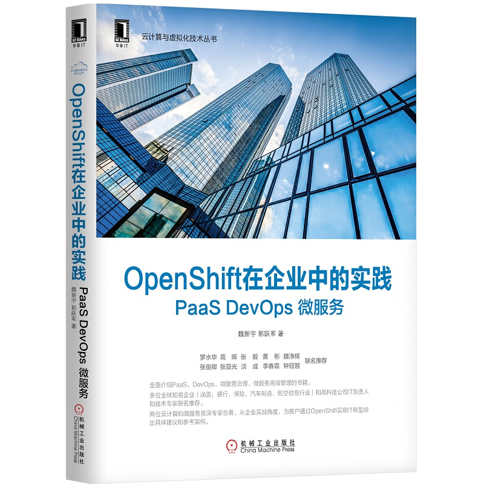

云原生社区邀请 RHCA Level 5，红帽资深解决方案架构师魏新宇，为大家带来分享《基于 Red Hat OpenShift 4 构建 Paas、DevOps 平台》。

DevOps、微服务、PaaS 将成为 IT 技术发展的新趋势。越来越多的日常开发和生命周期任务正在实现自动化，通过现有数据流提供 AI 支持，通过灵活的 DevOps 管道驱动和孵化。生命周期和应用开发也会更加的智能化，越来越多的企业应用部署在 PaaS 平台上，使用微服务架构。

OpenShift 是红帽推出的企业就绪型 Kubernetes 容器平台，可以实现全堆栈自动化运维，以管理混合云和多云部署。OpenShift 已进行过优化，可以提高开发人员的生产力并推动创新。

如何通过 OpenShift 构建 DevOps 平台？为企业构建敏捷生态需要哪些路径？OpenShift 在 K8S 容器平台之上做了哪些增强？在微服务治理、容器安全、CI/CD 方面提供哪些创新和解决方案？

本主题将会从容器云生态、容器安全、DevOps、微服务等领域介绍企业需求和 OpenShift 提供的企业级解决方案。

- 讲师：魏新宇
- 时间：2020 年 10 月 22 日（周四）晚 8 点 - 9 点
- 地址：https://live.bilibili.com/22230973
- 直播提问：大家提前在本文留言区评论，由编辑整理好在直播中提问

## 分享主题

《基于 Red Hat OpenShift 4 构建 Paas、DevOps 平台》

## 分享嘉宾

魏新宇 / 红帽资深解决方案架构师，RHCA Level 5

## 分享大纲

1. 敏态 IT 构建之路
2. OpenShift 的容器云生态
3. OpenShift 对 K8S 的扩展和增强
4. 容器安全解决方案
5. 应用容器化方法和迁移流程
6. 应用部署和 CI/CD 实现方式
7. 企业微服务治理需求和解决方案

## 直播福利

观看直播参与互动，可获得机械工业出版社华章图书赞助，魏新宇、郭跃军撰写的《OpenShift 在企业中的实践：PaaS DevOps 微服务》。

本书从企业数字化转型入手，介绍企业如何通过 OpenShift 构建 PaaS 平台、实现 DevOps、实现微服务治理和微服务的高级管理。

全书共分为四大部分：

- 第一部分 PaaS 能力建设。即本书的“PaaS 三部曲”，包含第 2-4 章的内容，分别是：基于 OpenShift 构建企业级 PaaS、OpenShift 在企业中的开发和运维实践、OpenShift 在公有云上的实践。
- 第二部分 DevOps 能力建设。即本书的“DevOps 两部曲”，包含第 5-6 章的内容，分别为：在 OpenShift 上实现 DevOps、DevOps 在企业中的实践。
- 第三部分微服务能力建设。即本书“微服务三部曲”，包含第 7-9 章的内容，分别为：微服务介绍及 Spring Cloud 在 OpenShift 上落地、Istio 架构介绍与安装部署、基于 OpenShift 和 Istio 实现微服务落地。
- 第四部分微服务高级管理。包含本书第 10 章的内容。介绍基于 OpenShft 和红帽其他解决方案微服务的高级管理（API 管理、分布式集成和流程自动化），并最终实现企业业务中台的建设。

## 用户收获

- 了解通过 OpenShift 构建敏态 IT 的路径以及建设中的经验

## 关于云原生学院

云原生学院（Cloud Native Academy）由云原生社区主办，致力于云原生知识的传播和普及。云原生学院将定期举办线上直播活动，邀请社区成员为大家带来云原生领域的知识和实践分享。
