> 本文作者：邵俊雄（熊啸），蚂蚁金服中间件团队高级技术专家，目前主要负责 SOFAMesh 的开发工作。
>
> 本文是基于作者在 [Service Mesh Meetup #3 深圳](/blog/service-mesh-meetup-shenzhen-20180825)的主题分享《SOFAMesh的通用协议扩展》部分内容所整理，完整内容见文末的直播回放

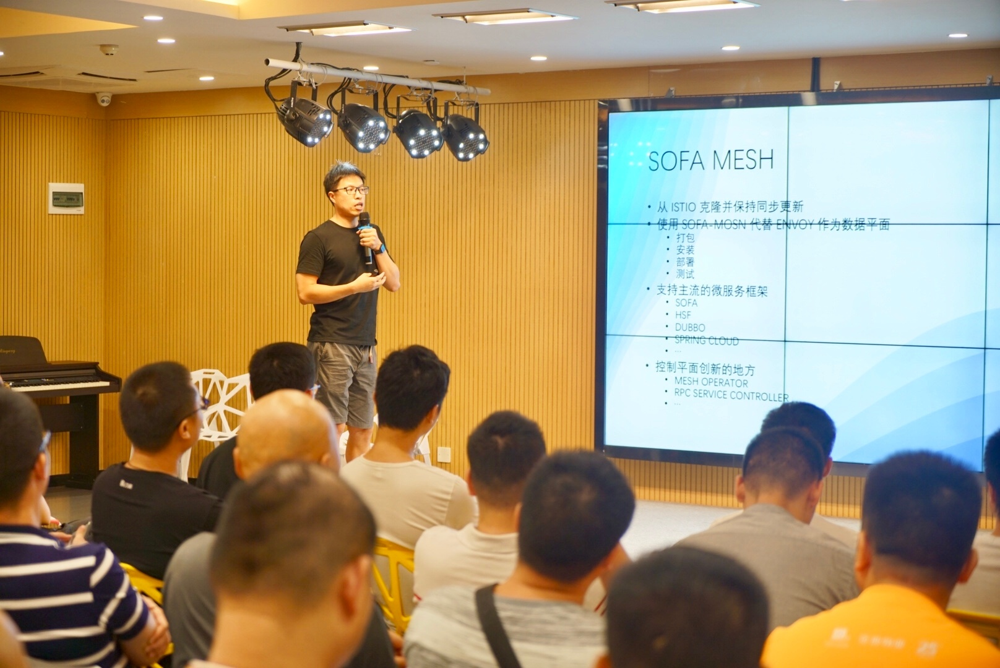

**本次分享主要介绍蚂蚁金服在 SOFAMesh 上开发对 SOFARPC 与 HSF 这两个RPC框架的支持过程中总结出来的通用协议扩展方案**

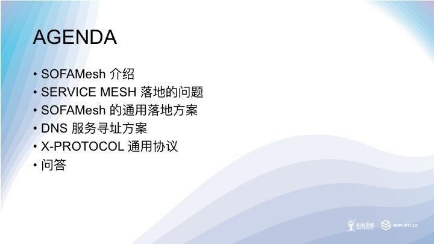

## 1. SOFAMesh 介绍

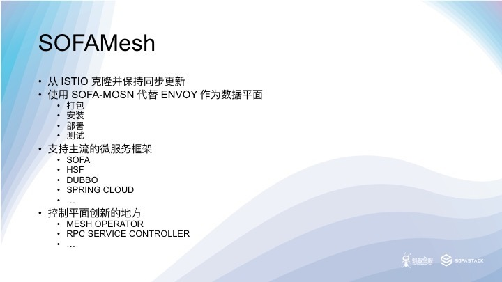

SOFAMesh 是蚂蚁从 ISTIO 上游克隆的开源项目，目的是在 ISTIO 的基础上进行控制平面的发展和创新，同时保持和上游 ISTIO 的同步更新，跟随 ISTIO 的发布节奏，当然也会把一些有价值能力贡献给 ISTIO 社区。

SOFAMesh 的一个重要目标是用蚂蚁自研的 Golang 版 L4/L7 层代理服务器 SOFAMosn 作为数据平面，取代 C++ 开发的 ENVOY。之前的 Meetup 中我们已经探讨过了一个 Golang 版本的数据平面的重要性，我们相信统一控制平面和数据平面的开发语言可以加快 Service Mesh 的技术创新和产品化落地的速度。

目前我们已经完成了集成 SOFAMosn 的前期开发工作，打包，安装，部署和测试的脚本都已经从 ENVOY 迁移到了 SOFAMosn，所有的镜像也都推到了公开的镜像仓库。下一步 SOFAMesh 将会整体在 UC 内部基于 Kubernetes 的 PAAS 平台中落地，在实际的生产环境中打磨。未来，SOFAMesh 还将在蚂蚁主站落地，在金融级的生产环境中进一步打磨。

ISTIO 目前仅能支持 TCP/REDIS/MONGO/HTTP 协议，其服务治理规则主要针对 HTTP 服务制定，对于业界目前大量在高并发、低延迟环境下使用的 RPC 框架及通信协议，例如 DUBBO/HSF/SOFA 没有很好的支持，SOFAMesh 把对于 RPC 通信协议的支持作为重点来看待，SOFAMosn 默认就提供对于 SOFA BOLT 协议的支持。

SOFAMesh 也是控制平面创新发生的地方，我们已经规划了的创新包括 Mesh Operator，RPC Service Controller 等等。未来的 Serverless 平台也会考虑基于 SOFAMesh 打造，SOFAMesh 将为 Serverless 平台提供基于 Reversion 的服务治理能力。Google Cloud 最近联合 CloudFoundry 和 IBM 发布的 Serverless 平台 Knative 同样也是基于 ISTIO 打造，和我们的想法也是不谋而合。

SOFAMesh 的下一步也是要融合到 PAAS 平台里面去，成为 PAAS 平台基础网络能力的一部分，用于支撑上层的业务更快速的创新，我们还会加强文档和快速上手方面，方便大家试用 SOFAMesh。

## 2. Service Mesh 落地中的问题

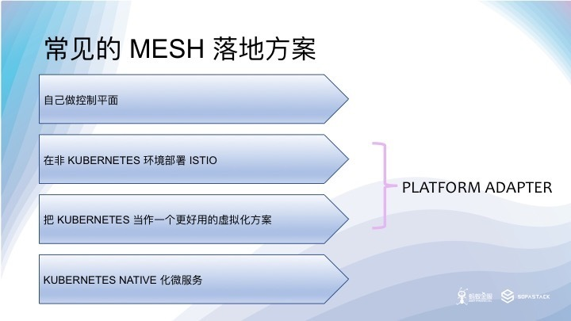

**第二部分是这次分享的重点，主要介绍蚂蚁金服在集成 SOFA/DUBBO 和 HSF 这些框架的过程中碰到的问题和我们的一套通用的解决方案，希望能够加速 Service Mesh 在实际生产中的落地。**

总的来说，业界在 Service Mesh 落地的时候主要有下面四种做法，基本上每种我们都思考和尝试过，最后我们也是走了一条循序渐进的道路。

- 第一种做法，比较常见，就是不用 ISTIO 只参考它的设计理念，用 ENVOY/MOSN 或者自研的 SIDECAR 结合已经成熟并且大规模部署的注册中心/配置中心组件，快速上线，拿到多语言，灰度发布，安全这些红利，比如唯品会的 OSP Local Proxy, 华为的 Mesher 都是这个套路。其实 ENVOY 最早也是如此，希望用户在 ENVOY 上直接扩展对 Consul, Eurkea 这些注册中心的支持。但是社区没有走这条路，反而对其 XDS API 进行了适配，由此诞生除了 Service Mesh 的控制平面，并进一步演化出了 ISTIO。目前看来这么做的主要问题是无法利用 ISTIO 社区在服务治理上的创新和工作，存在重复的建设，所以后来有了第二种思路。

- 第二种做法，更进一步，使用 ISTIO， 但是把 Kubernetes 剥离出去，适用于很多短期内无法上 Kubernetes 的企业。ISTIO 控制平面本来就提供了这个能力，ISTIO 有两个扩展点，一个通过 Platform Adapter 对接第三方注册中心，另一个 通过 Config Adapter 对接不通的配置存储。这个做法业界最典型的是 Ucloud 的轻量级 Service Mesh 方案，他们把 Pilot Discovery 模块从 ISTIO 里面剥离了出来，增加第三方注册中心的 Platform Adapter，Cofig Store 直接对接 ETCD 集群，可以通过 docker compose 直接跑起来整个 ISTIO。好处是入门更简单了，但是失去了 Kubernetes 提供了基础能力，ISTIO 的武功已经废了大半。

- 后来又了第三种做法，据说也有不少公司采用，具体做法是把 Kubernetes 做一个虚拟机用，阉割其服务发现，DNS 等能力，用注册中心/配置中心等成熟且大规模应用的产品替代。唯品会前几天发的文章说明他们已经把这个做法在生产中落地了。这种做法一般只使用 POD 和 StatfuleSet，不创建服务和Endpoints。一般来说， ISTIO 通过 Platform Adapter 对接注册中心，Config Adapter对应配置中心。相比前两种做法，这个做法更加复杂，好处是成熟的配置中心和注册中心能够快速的落地 ISTIO，不用解决 ISTIO 由于 ETCD 存贮带来的扩展性问题。这个做法还有个变种就是完全不用 ISTIO，直接在 ENVOY/MOSN 上对接注册中心和配置中心，甚至完成 MIXER 的检查和遥测上报的能力。比如唯品会，用的是 DaemonSet，在同一个 Node 上共享 SIDECAR，其 SIDERCAR 组件 OSP Local Proxy 直接集成注册中心/配置中心。

- 最后一个做法是我们努力的方向，向 Kubernetes 原生的方向发展，在生产环境中落地打磨，并和社区一起解决碰到的问题。

### UC 的 UAE 2.0 平台

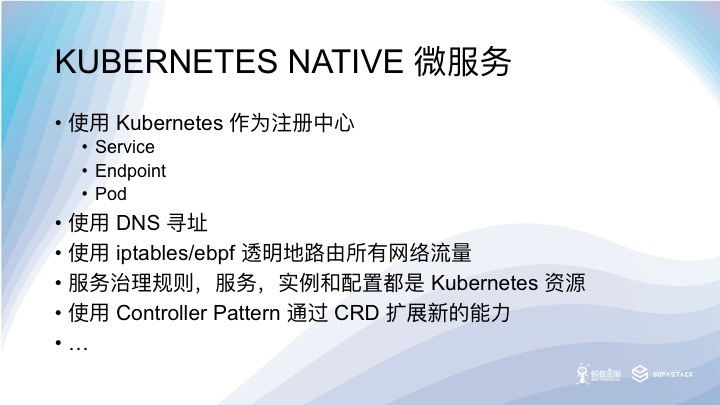

充分利用 Kubernetes 基础设施的能力是未来的方向，只要路走对了，就不怕远，比如说透明路由网络流量是方向，IPTABLES 是一个实现手段，它的性能不够好，那我们就通过引入 Cilium，用 EBPF 代替 IPTABLES。由于 BYPASS 了两次 TCP 协议栈道穿透，转发性能比常用的 loopback 地址 Workaround 方案还要好。更进一步，我们还能把 ISTIO 数据平面的同步检查逻辑，比如访问控制，通过 Cilium 推到内核的虚拟机中执行，从而解决 ISTIO 的另一的性能瓶颈。

Kubernetes 已经成为了云原生的事实标准，我们应该充分利用 Kubernetes 的能力，借用社区的力量发展自己的技术。

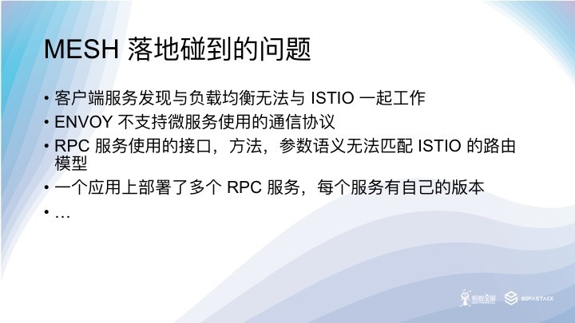

Spring cloud kubernetes 项目给 Spring cloud 项目落地 Kubernetes 提供了支持，但是在整合 ISTIO 的时候碰到了问题，即便使用 Kubernetes 作为注册中心，客户端的负载均衡和服务发现组件也会破坏 ISTIO 对请求规格的依赖，经过负载均衡之后发送给 ISTIO 数据平面的 PODIP 无法被正确的路由的后端的集群，既无法匹配到 Virtual Host。我们通过 BeanFactoryPostProcesser 在请求中带上了 Host 头，指向服务在 Kubernetes 中的域名，从而解决了这个问题，也因此认识到，给微服务框架的 SDK打补丁，或者说推动微服务框架轻量化可能是一个实现对业务代码无侵入性，必须的代价。

Envoy 社区目前还没有对非 HTTP 的 RPC 通信协议提供扩展支持，SOFAMosn 目前内部已经基本完成了 DUBBO 扩展的开发工作。

由于 ISTIO 的服务治理，路由规则都是针对 HTTP 协议定义的，当应用到基于接口，方法调用的 RPC 服务时，会有概念模型匹配的问题，比方说在定义 Content Based Routing 规则的时候。这里，我们选择了把 RPC 协议映射到 HTTP 上去而不是重新定义新的 RPC 路由的 CRD。

RPC 服务的容器模型也是个麻烦问题，目前大规模使用的 RPC 框架都是从 SOA 发展过来的，基于的还是传统的容器模型。一个容器中往往同时存在多个服务，各自有自己的版本，ISTIO 基于版本的路由要求每个服务都有自己的 POD 和 Service 定义，否则的话 Traffic Splitting 功能就无法完成。

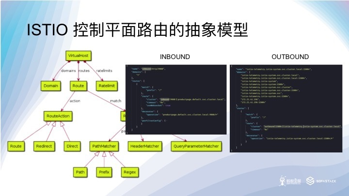

ISTIO 的控制平面抽象，顶层路由对象是 Virtual Host，Virtual Host 包含一组 Domain，通过 Domain 来选择 Virtual Host，Rate limit 也是定义在 Virtual Host 上面。

在 Outbound，也就是客户端的 SIDECAR 收到请求的时候，ISTIO 为服务生成的 Virtual Host 包含了服务的域名，Cluster VIP 和 端口的多种组合形式，这个形式确保了对 Host 头和 DNS 寻址的支持。Inbound，也就是服务端的 SIDECAR 收到请求的时候因为所有流量都去到后面的服务实例，所以域名是通配所有。

Route 上定义了超时，熔断，错误注入的策略。Route 上定义的 Header Matcher， Query Parameter Matcher, Path Matcher 等等都是针对 HTTP 协议的，RPC 协议需要进行映射以支持 Content Based Routing。

Route Action 指向后端集群，支持重定向和直接返回，集群通过名字路由，集群的变动受到 Destination Rule 的影响，主要是反应在 Subset 的变化上，权重信息就定义在这里。 

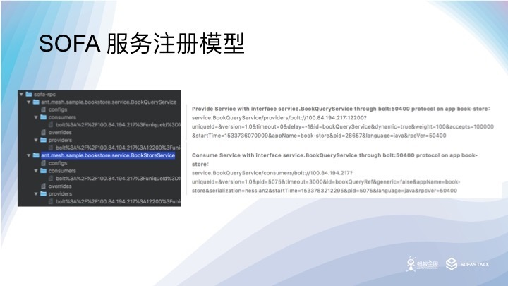

SOFA 的注册中心使用 Interface 来识别服务的，服务的配置信息，消费者和提供者列表，以及超时等服务治理信息也定义在注册中心里面，可以认为是一个具备一定服务治理能力的注册中心。

我们希望能够用 Interface 来调用服务，就是为了适应 RPC 框架的这个基于接口名字识别服务的概念模型。体现在 Kubernetes 里面就是用 Interface 名字当做域名，把请求头映射到 HTTP 头，请求参数映射到 Query Parameter，方法名映射到 Path 上。这样，基于 RPC 请求内容的服务治理就可以定义到方法和参数级别了，即便是蚂蚁金服站内复杂路由规则，比如 LDC 单元化流量调拨，也是可以支持的。

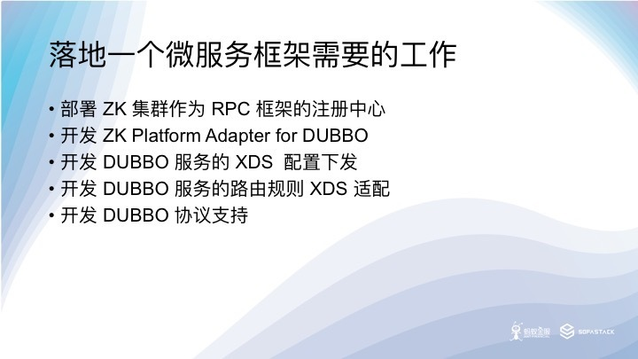

我们暂不考虑非 Kubernetes 平台的情况，以支持 DUBBO 作为例子

如果不适用 k8 作为注册中心，需要引入 ZK。

因为 ISTIO 目前还不支持 ZK，因此需要针对 DUBBO 的注册模型，与 SOFA 类似，通过 Platform Adapter 的方式加入对 DUBBO 的支持。

如前所述，我们还需要修改 Pilot Discovery 的代码，正确的为 DUBBO 服务生成 Inbound 和 Outbound 的配置，比如 Listener 和 Cluster 的配置信息。我们还需要为把 ISTIO 的路由规则正确的转成 XDS 的路由配置信息。

当然，我们还需要扩展 MOSN/ENVOY 来支持 DUBBO 协议，这里面有比较大的重复工作，而且还需要保证代码的执行性能。对于 MOSN 来说，需要自行实现 codec 和 stream 模块。

## 3. SOFAMesh 的统一解决方案

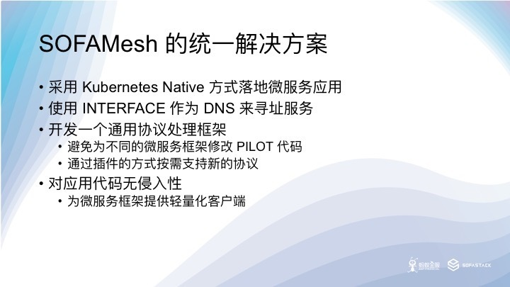

考虑到支持不同 RPC框架的大量重复工作和实现过程中的性能保障，我们希望能提供一个统一的解决方案，以高性能和插件化做为重点来支持，并允许用户在性能和功能之间做平衡。

这个方案是基于 Kubernetes Native 的方式来做的，使用 interface 来寻址服务，因此需要对客户端做轻量化，以做到不侵入用户的业务代码。

轻量化客户端是要解决客户端 Loadbalance 引起的问题。

## 4. DNS 服务寻址方案

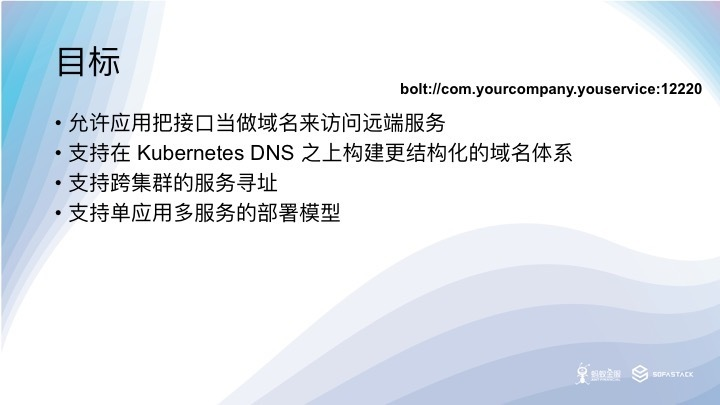

我们会在 Kubernetes 的 DNS 之外额外做一层域名抽象，不受 Kubernetes 的规则的限制，比如，允许用户直接使用 interface 作为域名或者按照组织结构来规划域名的层级关系。Kubernetes 的 namespace 往往被用来作为多租户的解决方案，并不适合用来作为企业内不同部门的逻辑划分。

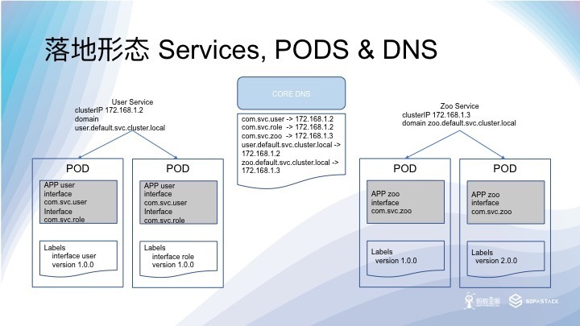

有些微服务应用本身没有版本，版本反应在应用中的服务接口上，往往每个接口服务都有其独立的版本，比如 SOFA 应用，其版本体现在服务接口的实例上（参考 SOFA 应用注册中心结构）。

蚂蚁主站内部在做蓝绿部署和灰度的时候，往往一次蓝绿发布会有多个应用参与，为了保证引流的准确性，我们会要求流量在整个调用的链路里面全部落到蓝或者绿的实例上，不允许出现交叉调用的情况。所以对于单应用多服务的场景，我们通过 POD label 把接口区分开来，从而做到流量在 POD 间调拨的粘性。

服务将会被按照接口维度创建，接口的版本和名字会反应在 POD 的 Label 上，这样做会增加运维的工作量，但是可以通过 PAAS 平台提供的工具解决这个痛点。这里面一个隐含的要求是，一个 POD 只会提供一个接口的服务，推动业务走向 Kubernetes Native。

对于按照 Kubernetes Native 方式创建的应用，应用只暴露一个接口，无需加上 interface 的标签。

通过 CoreDNS 的 PDSQL 插件支持，为 Cluster VIP 额外添加一个 interface name 的记录。

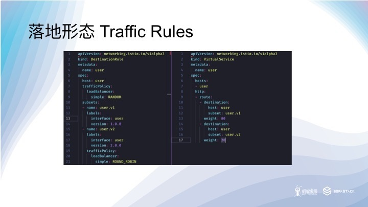

我们通过在 Destination Rule 中同时使用 Interface 和 Version 这两个 Label 来选择 Subset，每一个 Subset 都会在 Pilot Discovery 中形成一个可被路由的集群，这样通过 Subset 就可以完成 Traffic Splitting 的功能了。这样一来，蓝绿发布，灰度等能力都可基于这个RPC 接口和版本来做了。

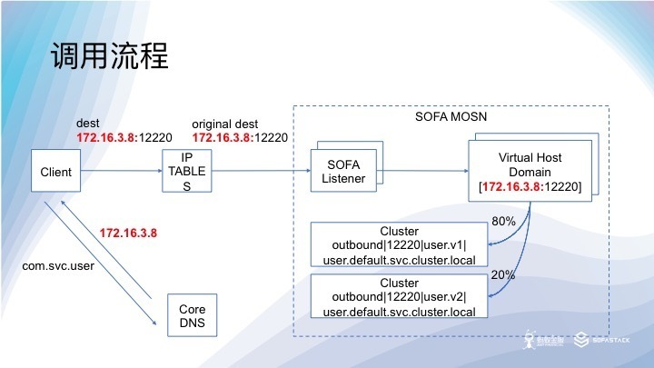

客户端向 Interface 域名发起请求，通过本地的 resolv.conf 文件指引到 CoreDNS 服务器进行域名解析，得到服务的 Cluster VIP。

客户端以 Cluser VIP 发起请求，经过 IPTables 转发到 SOFAMosn 的 12220 端口。

SOFAMosn 通过 socket 拿到 original destination 后，在此端口监听的 SOFA 协议 Listener，通过 Virtual Host 的域名找到正确的 Virtual Host。

SOFAMosn 将请求按照 Pilot Discovery 下发的 Destination Rule 按照权重转发到不通的后端集群。

Virtual Host 在生成的时候，其域名列表中会包含 Cluster VIP。

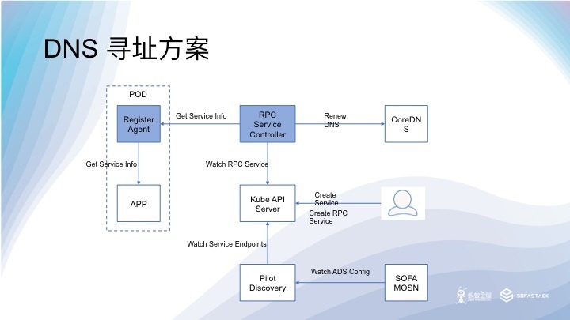

在寻址方案中，我们为 RPC Service 创建了一个新的 CRD，并创建一个 RPC Service Controller 来 Watch RPC Service。

RPC Service Controller 监听到 RPC Service 更新后，通过关联的 Service，按策略找到其中一个 POD，向其发起服务列表查询。请求到达 Register Agent，Agent 通过其协议插件从 APP 实例中获取到服务列表信息后返回给 RPC Service Controller。RPC Service Conroller 使用 RPC Service 接口和 Cluster VIP 更新 CoreDNS 中的域名记录。

## 5. X-PROTOCOL 通用协议

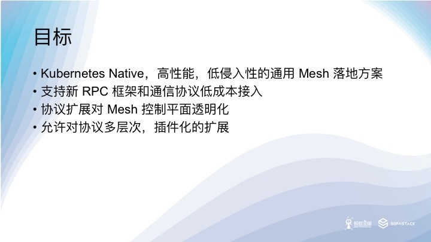

七层代理的性能瓶颈往往是出现在协议数据包的解析上，由于 SIDECAR 的特殊性，它本身往往得不到足够的资源，不得不运行在资源首先的环境，以避免影响应用本身的运行。在实际的部署中，我们常常会把 SIDECARE 限定在单核心上运行，并且限制它能使用的最大内存，这些都让 SIDECAR 的转发性能面临极大的压力。考虑到 ISTIO的复杂路由规则在实际的业务场景中很多时候并不会全部都用到，我们允许用户在性能和功能之间找到一个平衡。

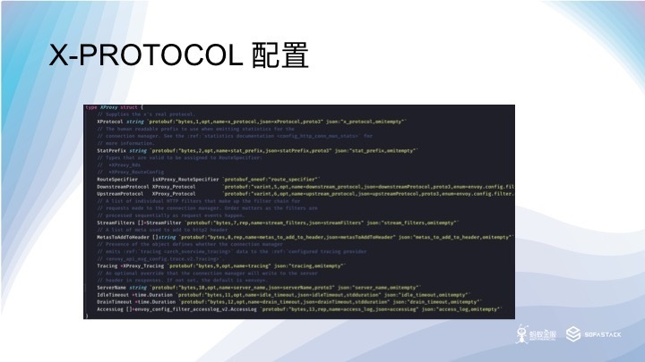

这个 Listener 的配置是参考 ISTIO 的 HTTP Connection Manager 做的，我们增加了 Downstream Protocol 和 Upstream Protocol 的配置，允许控制层面选择 SOFAMosn 之间的长连接的通行协议，比如使用 HTTP2，利用 HTTP2 的头部压缩能力提高协议的转发性能。x-protocol 配置项对应服务使用的真是通信协议，下发到 SOFAMosn 之后，SOFAMosn 通过分解 x-protocol 协议来进行适配真是请求协议，正确的加载协议插件进行协议处理。

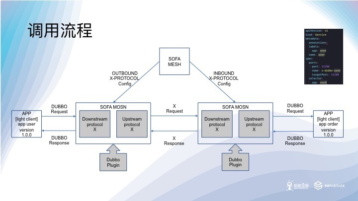

首先操作员在 Kubernetes 中创建 DUBBO 应用的服务，指定其 Port Name 为 x-dubbo-user，这很重要，也是 ISTIO 对 POD 的基本要求。SOFAMesh 监听到服务创建之后，开始在 Pilot 中创建 DUBBO 应用集群的x-protocol 协议的监听器和集群配置，请参考上文的 x-protocol 配置。

SOFAMosn SIDECAR 启动后，使用期静态配置的 Pilot 集群地址连接到 Pilot 并开始以 SIDECAR 模式，通过 ADS 接口监听配置的变化。

SOFAMesh 把 Outbound / Inbound 的配置数据通过 ADS 接口发送给监听的 SOFAMosn 实例。

Inbound 和 Outbound 的 SOFAMosn 之间建立 x-protocol/http2 协议的长连接，协议可以由下发的 x-protocol 配置指定，比如 HTTP2。目前 SOFAMosn 的 HTTP2 实现并还是 PingPong 模型，不推荐用作 SOFAMosn 之间的通信协议，下个 Milestone 改进后，应该是个更好的选择。

DUBBO 请求数据进入 Outbound 的 Downstream 后，SOFAMosn 会生成一个自增的 stream id，并且从插件中拿到 request id，建立两个 id 的映射表，同时利用插件把 stream id 写到请求数据中。请求经过路由计算，路由到集群，到达 Upstream 后 SOFAMosn 创建一个 x-protocol 的请求对象，把整个 DUBBO 请求数据作为 Payload，附上自定义的头，发送给 上游 Inbound 的 SOFAMosn，并把从插件中拿到的 class name 和 method name 等信息记录到自定义的头中。

请求数据到达 Inbound 的 Downstream 后，MOSN 会再生成一个自增的 stream id 并通过插件取出 request id，建立映射关系，并写入 stream id。经过路由匹配之后，请求通过 Upstream 发送给后端的服务实例。

服务实例返回响应，Inbound 的 SOFAMosn 从响应中拿出 request id，通过 ID 映射找回实际的 request id，写回响应对象，然后把请求用 x-protocol 打包，通过 Downstream 返回给 Outbound 的 SOFAMosn。

Outbound 的 SOFAMosn 收到响应后，拿出响应对象，并通过插件拿回 request id，最后通过 ID 映射关系找回实际的 request id，写回响应对象后，通过 Downstream 返回给应用实例。

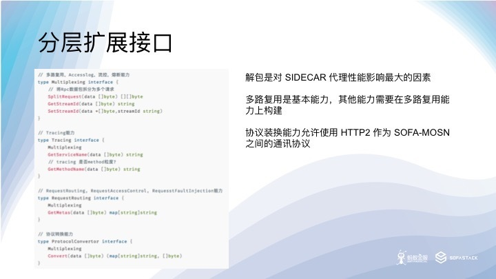

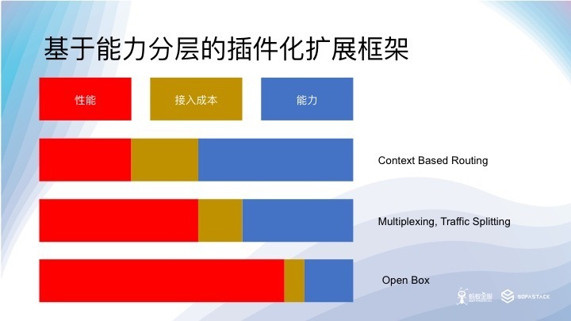

获得不同层次的能力，所付出的性能开销和接入成本也会不同，可以根据实际情况做出取舍。Golang 的接口特性允许协议插件的开发人员根据需要实现接口，还可以进行接口的组合。

开箱即用模式作为不解包方案，提供LabelRouting，LabelAccessControl，LabelFaultInjection，TLS，RateLimits，Metrics的能力，以高性能和低成本为亮点。

轻度解包可以获得更多能力，如多路复用，Accesslog，流控，熔断等（视具体协议而定），是性能和能力间的权衡选择。

更进一步，完全解除协议的头，可以获得将能力最大化，相对的性能开销和成本也同样最大化。

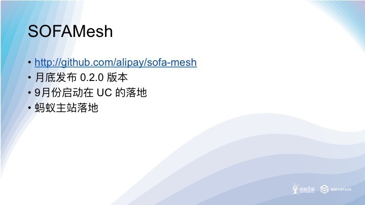

8月底发布的 SOFMesh 版本默认将会用 SOFAMosn 代替 ENVOY 做数据平面，ISTIO 自带的 BookInfo 的例子可以提供给大家试用。我们后续还会提供 SOFA/DUBBO 应用的例子。

目前 SOFAMosn 还不能在 Gateway 模式中使用，即不能用于 Ingress，而且部分高级路由功能，以及熔断，限流等高级治理能力目前还不支持。另外这个版本的 Mixer 节点也去除了，我们会在 9 月份的版本中持续完善 SOFAMosn 和 SOFAMesh，加入高级服务治理能力，同时我们也会完成 Mixer 的 Report 部分能力，放到开源版本中。

## 总结

本文首先介绍蚂蚁金服开源的 SOFAMesh ，然后分享在 SOFAMesh 上落地 UC 的 HSF 应用和蚂蚁的 SOFA 应用碰到的问题，以及我们总结出来的解决方案和最佳实践。最后分别就其中有代表性的 DNS 寻址方案和 X-PROTOCOL 协议分享一下做法。希望大家内部的 DUBBO 或者其他功能内部的 RPC 应用在 Service Mesh 落地的时候，能够有个参考。
