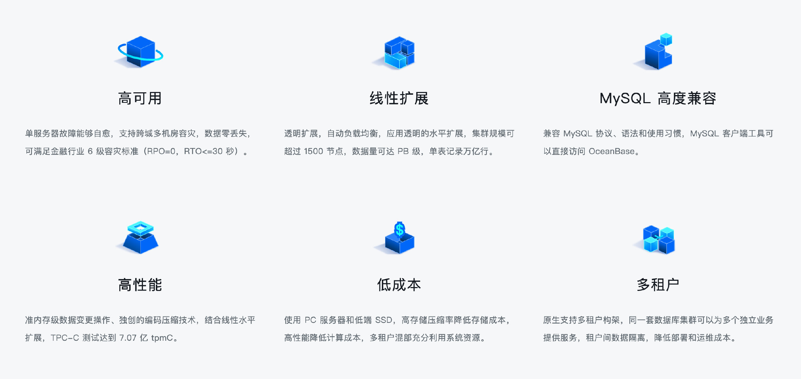
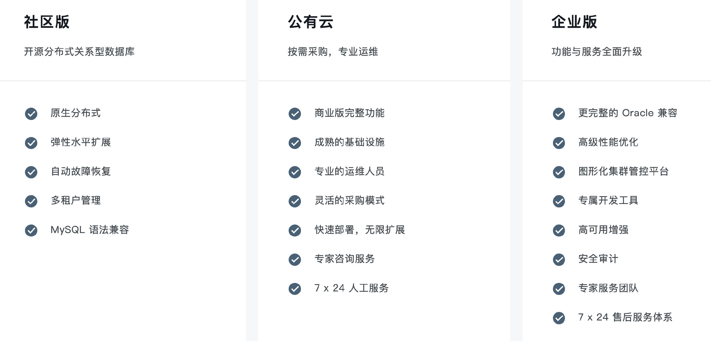

今天是六一儿童节，蚂蚁选择在今天开源 [OceanBase](https://open.oceanbase.com/)，想必是给各位分布式数据库用户送上的儿童节礼物吧！昨日凌晨蚂蚁已将代码推送到 GitHub：<https://github.com/oceanbase/oceanbase>。

本次开源的是 OceanBase 社区版，这是一款开源分布式 HTAP（Hybrid Transactional/Analytical Processing）数据库管理系统，具有原生分布式架构，支持金融级高可用、透明水平扩展、分布式事务、多租户和语法兼容等企业级特性。OceanBase 内核通过大规模商用场景的考验，已服务众多行业客户，现面向未来持续构建内核技术竞争力。

OceanBase 社区版具有以下特点。

不同版本对比。

### OceanBase 社区组织架构

OceanBase 社区治理架构借鉴 Apache 基金会的运作模式，角色分为：

- 技术委员会（Technical Oversight Committee）：是 OceanBase 社区的技术管理机构，负责 OceanBase 社区相关的技术类重大事件决议。
- PMC（Project Management Committee）：单个项目的项目管理委员会，为项目核心管理团队，参与 Roadmap 和本项目重大决议决策。
- Committer：具有代码提交能力的开发者。
- Contributor：曾做过代码贡献的开发者。
- Community Leader：社区用户布道师。
- Ambassador：帮助推广，使用，答疑 OceanBase 的用户
- 城市站社区管理者：帮助推广的城市线下的热心用户

未来分布式数据库领域是否还会有更多的开源项目出现，这个领域的竞争也许会变得更加白热化吧，我们拭目以待。