本文基于 [APISIX](https://github.com/apache/apisix) 2.6 版本进行源码分析，源码阅读注释仓库: [review](https://github.com/mayocream/apisix/tree/review)，分析主要流程以及核心机制。

## 1. APISIX 概述

### 1.1. 项目概述

APISIX 是基于 OpenResty 开发的 API 网关，与 OpenResty 的请求生命周期一致，APISIX 利用 Lua Nginx Module 提供的 `*_by_lua` 添加 Hook。

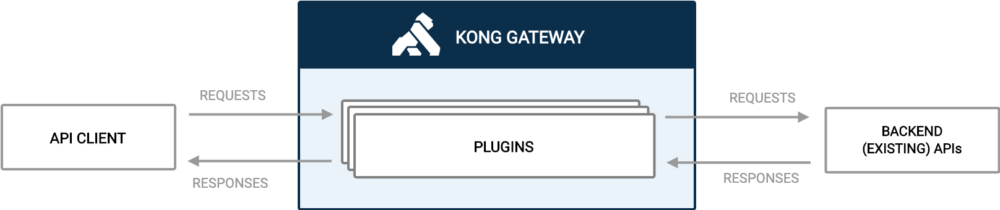

APISIX 抽象了 Route、Service、Upstream、Plugin、Consumer 等数据模型，与 Kong 网关如出一辙。


基本上可以看作 APISIX 是 Kong 网关的重构——运用大量 LuaJIT、OpenResty 技巧优化性能、简化复杂的数据结构、替换储存引擎为 etcd 等。


值得一提的是，在 APISIX 的一个 issue 中，项目开发者说不确定是什么原因，我们看看 Kong 网关是怎么解决的吧。

> "How does Kong solve similar problems?"[^1]

### 1.2. 生态概述

Kong 网关开源生态有的，APISIX 基本都有或者正在做。包含：Kubernetes Ingress Controller、Mesh、Dashboard。

插件方面比 Kong 开源版本多了 Skywalking APM 数据上报、Traffit 流量拆分、Mirror 流量镜像等功能。

## 2. APISIX 源码分析

### 2.1. 基本流程

#### 2.1.1. 目录结构

```bash
$ tree -L 2
.
├── apisix
│   ├── admin # Admin API
│   ├── api_router.lua
│   ├── balancer # 负载均衡器
│   ├── balancer.lua
│   ├── cli # CLI, Lua 脚本
│   ├── constants.lua # 常量
│   ├── consumer.lua
│   ├── control
│   ├── core # 主要是封装的公共方法
│   ├── core.lua
│   ├── debug.lua
│   ├── discovery # 服务发现, 支持 consul, eruka, dns
│   ├── http
│   ├── init.lua # _by_lua 函数入口
│   ├── patch.lua
│   ├── plugin_config.lua
│   ├── plugin.lua # 插件
│   ├── plugins
│   ├── router.lua # Router
│   ├── schema_def.lua # jsonschema 定义
│   ├── script.lua
│   ├── ssl
│   ├── ssl.lua
│   ├── stream
│   ├── timers.lua # timer 封装
│   ├── upstream.lua
│   └── utils
├── bin
│   └── apisix # apisix CLI, shell 脚本
├── ci # CI 脚本
├── conf # 默认配置文件
├── deps
├── docs
├── Makefile # 快捷指令
├── rockspec # luarocks 包管理
├── t # Test::Nginx 测试
└── utils # Shell 脚本
```

#### 2.1.2. 启动流程

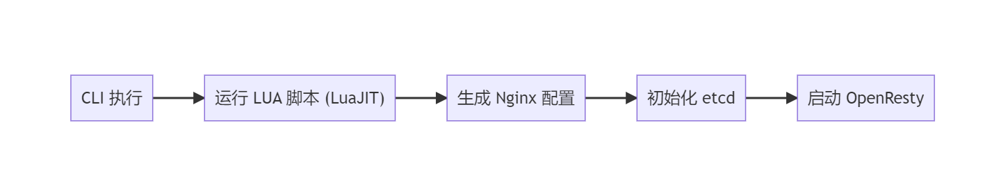


CLI 默认会用 LuaJIT 启动，若版本不够便退回到 Lua 5.1 解释器执行。
```bash
# 查找 APISIX LUA 包路径
# shell -s 判断文件是否存在且 size > 0
# ref: https://stackoverflow.com/questions/53319817/what-is-the-meaning-of-n-z-x-l-d-etc-in-shell-script
if [ -s './apisix/cli/apisix.lua' ]; then
	...
fi

# shell -e 判断文件是否存在
if [[ -e $OR_EXEC && "$OR_VER" =~ "1.19" ]]; then
    # use the luajit of openresty
    echo "$LUAJIT_BIN $APISIX_LUA $*"
    exec $LUAJIT_BIN $APISIX_LUA $*
elif [[ "$LUA_VERSION" =~ "Lua 5.1" ]]; then
    # OpenResty version is not 1.19, use Lua 5.1 by default
    # shell &* 传递所有 args
    # ref: https://stackoverflow.com/questions/4824590/propagate-all-arguments-in-a-bash-shell-script
    echo "lua $APISIX_LUA $*"
    exec lua $APISIX_LUA $*
fi
```


启动过程中：

- 调用 `popen` 执行 CMD 命令；
- 使用 [luasocket](https://github.com/diegonehab/luasocket) 库发起 HTTP 请求（非 OpenResty 运行时）；
- 使用 ltn12 [sink](http://lua-users.org/wiki/FiltersSourcesAndSinks) 进行流处理；
- 创建 etcd prefix，value 为 `init`；


### 2.2. APISIX Core

APISIX 的核心部分，也就是项目开发者说 “极简核⼼代码量，不到 4000 ⾏，去除空行、注释行数甚至不到 3000 行” 的部分。

主要封装了一些库和函数。

#### 2.2.1. 基本类型操作

基本上为了追求极致性能，能用 FFI 调用实现的都用了。

##### 2.2.1.1. 字符串

使用 FFI 调用 libc 函数 `memcmp` 进行字符串比较内存地址的前 n 长度是否相同。

```lua
local ffi         = require("ffi")
local C           = ffi.C

-- ref: https://www.cplusplus.com/reference/cstring/memcmp/
-- ref: https://www.tutorialspoint.com/c_standard_library/c_function_memcmp.htm
ffi.cdef[[
    int memcmp(const void *s1, const void *s2, size_t n);
]]
```

接收类型是 `const void *`，不可变类型可以直接传入 Lua string 类型。

> 如果你的 C 函数接受 `const char *` 或者等价的 `const unsigned char/int8_t/... *` 这样的参数类型，
> 可以直接传递 Lua string 进去，而无需另外准备一个 `ffi.new` 申请的数组。[^2]


string 前缀比较，比较 s, prefix 内存地址的前 n (#prefix) 长度是否相同。

```lua
-- 用 ffi 扩展 string 方法
function _M.has_prefix(s, prefix)
    if type(s) ~= "string" or type(prefix) ~= "string" then
        error("unexpected type: s:" .. type(s) .. ", prefix:" .. type(prefix))
    end
    if #s < #prefix then
        return false
    end
    -- 比较 s, prefix 内存地址的前 n (#prefix) 长度是否相同
    local rc = C.memcmp(s, prefix, #prefix)
    return rc == 0
end
```

同理比较后缀：

```lua
C.memcmp(ffi_cast("char *", s) + #s - #suffix, suffix, #suffix)
```


##### 2.2.1.2. Table

Table 是 Lua 中最常用的类型了，与其他语言比较的话相当于 PHP 的 Array 一样实用。

Lua Table 需要注意的地方其一：

>  table.new(narray, nhash)
>
> 这个函数，会预先分配好指定的数组和哈希的空间大小，而不是在插入元素时自增长，这也是它的两个参数 narray 和 nhash 的含义。
> 如果不使用这个函数，自增长是一个代价比较高的操作，会涉及到空间分配、resize 和 rehash 等，我们应该尽量避免。
>
> table.new 的文档并没有出现在 LuaJIT 的官网，而是深藏在 GitHub 项目的 [扩展文档](https://github.com/openresty/luajit2/blob/v2.1-agentzh/doc/extensions.html) 里，用谷歌也很难找到，所以很多人并不知道这个函数的存在。
>
> 超出预设的空间大小，也可以正常使用，只不过性能会退化，也就失去了使用 table.new 的意义。
>
> 需要根据实际场景，来预设好 table.new 中数组和哈希空间的大小，这样才能在性能和内存占用上找到一个平衡点。[^3]

Lua Table 需要注意的地方其二：

> table.insert 虽然是一个很常见的操作，但性能并不乐观。
> 如果不是根据指定下标来插入元素，那么每次都需要调用 LuaJIT 的 lj_tab_len 来获取数组的长度，以便插入队尾。获取 table 长度的时间复杂度为 O(n) 。

参考 APISIX 作者给 [ingress-nginx](https://github.com/kubernetes/ingress-nginx) 项目提的 Table 操作优化 PR：[used table functions of LuaJIT for better performance.](https://github.com/kubernetes/ingress-nginx/pull/3673)


OpenResty Fork 的 LuaJIT 新增的 table 函数[^13]：
- table.isempty
- table.isarray
- table.nkeys
- table.clone

回到 APISIX 封装的 Table 操作符：

```lua
-- 自行构建 index 插入 table, 比 table.insert 效率高
function _M.insert_tail(tab, ...)
    local idx = #tab
    -- 遍历输入的参数
    for i = 1, select('#', ...) do
        idx = idx + 1
        tab[idx] = select(i, ...)
    end

    return idx
end
```

`select('#', ...)` 获取输入参数的数量，`select(i, ...)` 获取第 n 个参数，Table 的遍历中大量使用该结构。

`try_read_attr` 实现了 `path.node.x` 的 table 访问方式，便于读取多层级配置项。

```lua
function _M.try_read_attr(tab, ...)
    for i = 1, select('#', ...) do
        local attr = select(i, ...)
        if type(tab) ~= "table" then
            return nil
        end

        tab = tab[attr]
    end

    return tab
end
```

使用示例：

```lua
    local size = core_tab.try_read_attr(local_conf, "graphql", "max_size")
    if size then
        max_size = size
    end
```


#### 2.2.2. 工具类

##### 2.2.2.1. JSON 操作

```lua
local delay_tab = setmetatable({data = "", force = false}, {
    __tostring = function(self)
        local res, err = encode(self.data, self.force)
        if not res then
            ngx.log(ngx.WARN, "failed to encode: ", err,
                    " force: ", self.force)
        end

        return res
    end
})


-- this is a non-thread safe implementation
-- it works well with log, eg: log.info(..., json.delay_encode({...}))
function _M.delay_encode(data, force)
    delay_tab.data = data
    delay_tab.force = force
    return delay_tab
end
```

设置了元表的 `__tostring` 方法，在字符串转换时才使用匿名函数调用 `json.encode`，在日志打印时，被忽略的日志会不执行 JSON 压缩，避免额外的性能损耗。

##### 2.2.2.2. LRU 缓存

[lua-resty-lrucache](https://github.com/openresty/lua-resty-lrucache) 在写入时会清理 TTL 过期的缓存，读时如果数据过期了，会作为第二个参数返回：

```lua
function _M.get(self, key)
    local hasht = self.hasht
    local val = hasht[key]
    if val == nil then
        return nil
    end

    local node = self.key2node[key]

    -- print(key, ": moving node ", tostring(node), " to cache queue head")
    local cache_queue = self.cache_queue
    queue_remove(node)
    queue_insert_head(cache_queue, node)

    if node.expire >= 0 and node.expire < ngx_now() then
        -- print("expired: ", node.expire, " > ", ngx_now())
        return nil, val, node.user_flags
    end

    return val, nil, node.user_flags
end
```

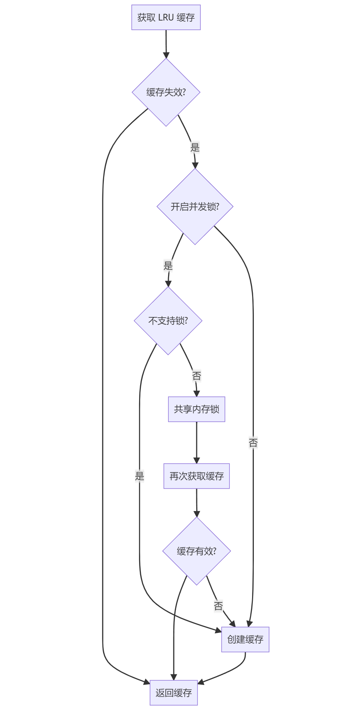

```lua
local function fetch_valid_cache(lru_obj, invalid_stale, item_ttl,
                                 item_release, key, version)
    local obj, stale_obj = lru_obj:get(key)
    if obj and obj.ver == version then
        return obj
    end

    -- 如果 TTL 到期的数据版本号仍一致, 重新 set 该缓存
    if not invalid_stale and stale_obj and stale_obj.ver == version then
        lru_obj:set(key, stale_obj, item_ttl)
        return stale_obj
    end

    -- release 回调
    if item_release and obj then
        item_release(obj.val)
    end

    return nil
end


-- 返回创建 LRU 的匿名函数
local function new_lru_fun(opts)
    local item_count, item_ttl
    if opts and opts.type == 'plugin' then
        item_count = opts.count or PLUGIN_ITEMS_COUNT
        item_ttl = opts.ttl or PLUGIN_TTL
    else
        item_count = opts and opts.count or GLOBAL_ITEMS_COUNT
        item_ttl = opts and opts.ttl or GLOBAL_TTL
    end

    local item_release = opts and opts.release
    local invalid_stale = opts and opts.invalid_stale
    -- 是否使用并发锁
    local serial_creating = opts and opts.serial_creating
    -- 参数为 LRU size
    local lru_obj = lru_new(item_count)

    return function (key, version, create_obj_fun, ...)
        -- 不支持的 yielding 的 Nginx phase 无法使用 resty.lock
        if not serial_creating or not can_yield_phases[get_phase()] then
            local cache_obj = fetch_valid_cache(lru_obj, invalid_stale,
                                item_ttl, item_release, key, version)
            if cache_obj then
                return cache_obj.val
            end

            local obj, err = create_obj_fun(...)
            if obj ~= nil then
                lru_obj:set(key, {val = obj, ver = version}, item_ttl)
            end

            return obj, err
        end

        local cache_obj = fetch_valid_cache(lru_obj, invalid_stale, item_ttl,
                            item_release, key, version)
        if cache_obj then
            return cache_obj.val
        end

        -- 当缓存失效时获取锁
        -- 创建共享内存 lock
        local lock, err = resty_lock:new(lock_shdict_name)
        if not lock then
            return nil, "failed to create lock: " .. err
        end

        local key_s = tostring(key)
        log.info("try to lock with key ", key_s)

        -- 获取 lock
        local elapsed, err = lock:lock(key_s)
        if not elapsed then
            return nil, "failed to acquire the lock: " .. err
        end

        -- 再次获取缓存
        cache_obj = fetch_valid_cache(lru_obj, invalid_stale, item_ttl,
                        nil, key, version)
        if cache_obj then
            lock:unlock()
            log.info("unlock with key ", key_s)
            return cache_obj.val
        end

        local obj, err = create_obj_fun(...)
        if obj ~= nil then
            lru_obj:set(key, {val = obj, ver = version}, item_ttl)
        end
        lock:unlock()
        log.info("unlock with key ", key_s)

        return obj, err
    end
end
```

这段代码关联到两个 PR:

1. [bugfix(lrucache): when creating cached objects, use resty-lock to avoid repeated creation.](https://github.com/apache/apisix/pull/1486)
2. [change: make lrucache lock optional](https://github.com/apache/apisix/pull/2575)

使用 [lua-resty-lock](https://github.com/openresty/lua-resty-lock) 通过共享内存竞争锁，用在缓存中避免缓存击穿，当该 Lib 出于 Luajit 限制，无法在 `init_by_lua`, `init_worker_by_lua`, `header_filter_by_lua`, `body_filter_by_lua`, `balancer_by_lua`, `log_by_lua ` 阶段中使用。

引入的 `serial_creating` 属性用于判断插件是否需要启用锁。

> Kong 使用的 [lua-resty-mlcache](https://github.com/thibaultcha/lua-resty-mlcache) 库内部也使用 resty.lock 防止缓存击穿（可选）。


##### 2.2.2.3. 后台任务

两个地方默认初始化了定时器（Nginx Timer）执行后台任务。

1. `init_by_lua` 阶段创建 OpenResty 特权进程，负责执行特定的后台任务，不会干扰其他 Worker 进程，权限相当于 root；
2. `init_by_worker` 阶段创建 Background Timer，执行并发执行后台任务。

OpenResty 特权进程不能处理请求，只能由 Timer 触发，逻辑上编写 `if type(ngx.process.type()) == "privileged agent"` 只在特权进程中执行操作。[^4]

> Enables the privileged agent process in Nginx.
>
> The privileged agent process does not listen on any virtual server ports like those worker processes. And it uses the same system account as the nginx master process, which is usually a privileged account like `root`.
>
> The `init_worker_by_lua*` directive handler still runs in the privileged agent process. And one can use the [type](https://github.com/openresty/lua-resty-core/blob/master/lib/ngx/process.md#type) function provided by this module to check if the current process is a privileged agent.[^5]


```lua
-- worker 默认后台运行的 timer, 执行各种后台任务 
local function background_timer()
    if core.table.nkeys(timers) == 0 then
        return
    end

    local threads = {}
    for name, timer in pairs(timers) do
        core.log.info("run timer[", name, "]")

        -- 开启协程执行
        local th, err = thread_spawn(timer)
        if not th then
            core.log.error("failed to spawn thread for timer [", name, "]: ", err)
            goto continue
        end

        core.table.insert(threads, th)

::continue::
    end

    local ok, err = thread_wait(unpack(threads))
    if not ok then
        core.log.error("failed to wait threads: ", err)
    end
end

function _M.init_worker()
    local opts = {
        each_ttl = 0,
        sleep_succ = 0,
        check_interval = check_interval, -- 默认间隔为 1 秒
    }
    local timer, err = core.timer.new("background", background_timer, opts)
    if not timer then
        core.log.error("failed to create background timer: ", err)
        return
    end

    core.log.notice("succeed to create background timer")
end
```

APISIX 引入特权进程的一个目的在于实现 Log Rotate 插件功能。


#### 2.2.3. 请求生命周期

##### 2.2.3.1. ctx

> Use `ngx.ctx` wherever you can. `ngx.var` is much  more expensive and is also limited to string values. The latter should  only be used to exchange data with other nginx C modules.[^6]

APISIX 中使用缓存 `ngx.var` 获取的结果， 在不同生命周期中传递。使用 [lua-var-nginx-module](https://github.com/api7/lua-var-nginx-module) Nginx C 模块和 FFI 获取变量，在没有开启 Nginx C 模块的情况下回退到 `ngx.var` 方式获取。APISIX 默认没有在构建脚本中加载 C 模块，提交的 PR [feat: add lua-var-nginx-module](https://github.com/api7/apisix-build-tools/pull/44) 在编译 OpenResty 时添加了该模块。

```lua
function _M.set_vars_meta(ctx)
    -- 从 table 池中获取/创建一个 hash 长度为 32 的 table
    local var = tablepool.fetch("ctx_var", 0, 32)
    if not var._cache then
        var._cache = {}
    end

    -- 通过 resty.core.base 获取原始 request C 指针 (?)
    -- ref: https://github.com/openresty/lua-resty-core/blob/master/lib/resty/core/base.lua
    var._request = get_request()
    -- 绑定元表
    setmetatable(var, mt)
    -- 缓存到 ngx ctx 中
    ctx.var = var
end
```

使用 [tablepool](https://github.com/openresty/lua-tablepool) 从 Lua table 池中获取 table，避免频繁分配内存。

```lua
do
    -- 获取特殊 var 类型的方法
    local var_methods = {
        method = ngx.req.get_method,
        -- ref: https://github.com/cloudflare/lua-resty-cookie
        cookie = function () return ck:new() end
    }

    local ngx_var_names = {
        upstream_scheme            = true,
        upstream_host              = true,
        ...

        var_x_forwarded_proto = true,
    }

    local mt = {
        -- 重载 hash 元方法
        -- t 是 self
        __index = function(t, key)

            -- 若 cache table 存在直接返回
            local cached = t._cache[key]
            if cached ~= nil then
                return cached
            end

            if type(key) ~= "string" then
                error("invalid argument, expect string value", 2)
            end

            local val
            -- 如果是特殊类型, 使用特定方法获取
            local method = var_methods[key]
            if method then
                val = method()

            elseif core_str.has_prefix(key, "cookie_") then
                -- 通过 var_methods 访问到 resty.cookie
                local cookie = t.cookie
                if cookie then
                    local err
                    val, err = cookie:get(sub_str(key, 8))
                    if not val then
                        log.warn("failed to fetch cookie value by key: ",
                                 key, " error: ", err)
                    end
                end

            elseif core_str.has_prefix(key, "http_") then
                key = key:lower()
                key = re_gsub(key, "-", "_", "jo")
                -- 最终通过 ngx.var 获取
                val = get_var(key, t._request)

            elseif core_str.has_prefix(key, "graphql_") then
                -- trim the "graphql_" prefix
                key = sub_str(key, 9)
                val = get_parsed_graphql(t)[key]

            elseif key == "route_id" then
                val = ngx.ctx.api_ctx and ngx.ctx.api_ctx.route_id

            elseif key == "service_id" then
                val = ngx.ctx.api_ctx and ngx.ctx.api_ctx.service_id

            elseif key == "consumer_name" then
                val = ngx.ctx.api_ctx and ngx.ctx.api_ctx.consumer_name

            elseif key == "route_name" then
                val = ngx.ctx.api_ctx and ngx.ctx.api_ctx.route_name

            elseif key == "service_name" then
                val = ngx.ctx.api_ctx and ngx.ctx.api_ctx.service_name

            elseif key == "balancer_ip" then
                val = ngx.ctx.api_ctx and ngx.ctx.api_ctx.balancer_ip

            elseif key == "balancer_port" then
                val = ngx.ctx.api_ctx and ngx.ctx.api_ctx.balancer_port

            else
                val = get_var(key, t._request)
            end

            if val ~= nil then
                t._cache[key] = val
            end

            -- 为空返回 nil
            return val
        end,

        __newindex = function(t, key, val)
            if ngx_var_names[key] then
                ngx_var[key] = val
            end

            -- log.info("key: ", key, " new val: ", val)
            t._cache[key] = val
        end,
    }
```

部分 APISIX 路由匹配的内部参数在其他阶段注入。

##### 2.2.3.2. headers

```lua
-- 用 ngx.ctx table 缓存 headers, 避免再进行一次 ffi 调用
local function _headers(ctx)
    if not ctx then
        ctx = ngx.ctx.api_ctx
    end
    local headers = ctx.headers
    if not headers then
        headers = get_headers()
        ctx.headers = headers
    end

    return headers
end
```

用到了上述的 ctx 库。

#### 2.2.4. etcd

etcd 在 APISIX 中作用相同与 PostgreSQL 之于 Kong，内部使用 [lua-resty-etcd](https://github.com/api7/lua-resty-etcd) 作为客户端，使用 timer 定时执行和长轮询获取跟踪 etcd 中数据的变化。

这里的优化点与 Kong 一样，在 `init_by_lua` 阶段进行数据的 warm up，之后数据会 fork 到其他的进程中。

> It does not really make much sense to use this library in the context of [init_by_lua](https://github.com/openresty/lua-nginx-module#lua_shared_dict) because the cache will not get shared by any of the worker processes (unless you just want to "warm up" the cache with predefined items which will get inherited by the workers via `fork()`).[^7]

##### 2.2.4.1. 初始化

读取 etcd 数据到全局单例的 Lua table。

```lua
-- 初始化 etcd
function _M.init()
    local local_conf, err = config_local.local_conf()
    if not local_conf then
        return nil, err
    end

    if table.try_read_attr(local_conf, "apisix", "disable_sync_configuration_during_start") then
        return true
    end

    -- 获取 etcd cli
    local etcd_cli, err = get_etcd()
    if not etcd_cli then
        return nil, "failed to start a etcd instance: " .. err
    end

    local etcd_conf = local_conf.etcd
    local prefix = etcd_conf.prefix
    -- 加载 etcd 所有数据到 lua table 中, 单例模式
    local res, err = readdir(etcd_cli, prefix, create_formatter(prefix))
    if not res then
        return nil, err
    end

    return true
end
```

对数据进行格式化，存入 Lua table 中：

```lua
-- 创建格式化 formatter
local function create_formatter(prefix)
    -- 返回闭包函数, 对 etcd 返回的结果进行格式化
    -- 格式个毛, 这就是个 hook 函数
    return function (res)
        res.body.nodes = {}

        local dirs
        if is_http then
            dirs = constants.HTTP_ETCD_DIRECTORY
        else
            dirs = constants.STREAM_ETCD_DIRECTORY
        end

        local curr_dir_data
        local curr_key
        for _, item in ipairs(res.body.kvs) do
            if curr_dir_data then
                -- 将匹配的内容插入 table
                if core_str.has_prefix(item.key, curr_key) then
                    table.insert(curr_dir_data, etcd_apisix.kvs_to_node(item))
                    goto CONTINUE
                end

                curr_dir_data = nil
            end

            -- 截取 prefix 后的 key
            local key = sub_str(item.key, #prefix + 1)
            if dirs[key] then
                -- single item
                loaded_configuration[key] = {
                    body = etcd_apisix.kvs_to_node(item),
                    headers = res.headers,
                }
            else
                -- 前缀一致
                local key = sub_str(item.key, #prefix + 1, #item.key - 1) -- 去掉末尾的 /
                -- ensure the same key hasn't been handled as single item
                if dirs[key] and not loaded_configuration[key] then
                    loaded_configuration[key] = {
                        body = {
                            nodes = {},
                        },
                        headers = res.headers,
                    }
                    curr_dir_data = loaded_configuration[key].body.nodes
                    curr_key = item.key
                end
            end

            ::CONTINUE::
        end

        return res
    end
end
```

这部分逻辑在 `init_by_lua` 执行，fork 到其他子进程。

##### 2.2.4.2. 数据校验

`schema_def.lua` 文件中定义了所有储存数据结构的 schema 校验规则，使用 [jsonschema](https://github.com/api7/jsonschema) 库进行数据校验。

`core/schema.lua` 中使用 LRU 缓存校验器。

`load_full_data` 函数加载数据结构所需的 etcd kvs，并进行数据转换、校验、格式化、执行回调。

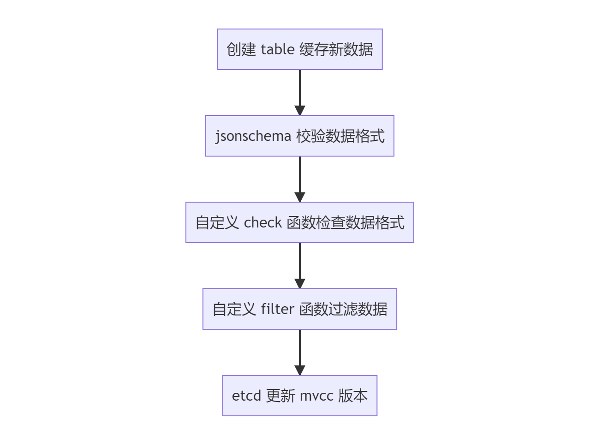

```lua
local function load_full_data(self, dir_res, headers)
    local err
    local changed = false

    if self.single_item then
        -- table size 为 1
        ...
        -- 执行逻辑与下面数组格式类似
    else
        if not dir_res.nodes then
            dir_res.nodes = {}
        end

        self.values = new_tab(#dir_res.nodes, 0)
        self.values_hash = new_tab(0, #dir_res.nodes)

        for _, item in ipairs(dir_res.nodes) do
            local key = short_key(self, item.key)
            local data_valid = true
            
            -- 数据格式校验...

            -- schema 校验...

            -- 过滤器...

            if data_valid then
                changed = true
                insert_tab(self.values, item)
                self.values_hash[key] = #self.values

                item.value.id = key
                item.clean_handlers = {}

                -- 执行回调
                if self.filter then
                    self.filter(item)
                end
            end
			-- 更新 mvcc 版本
            self:upgrade_version(item.modifiedIndex)
        end
    end
	...
    self.need_reload = false
end
```

##### 2.2.4.3. 后台数据同步

利用 etcd watch 机制进行数据变更的同步。

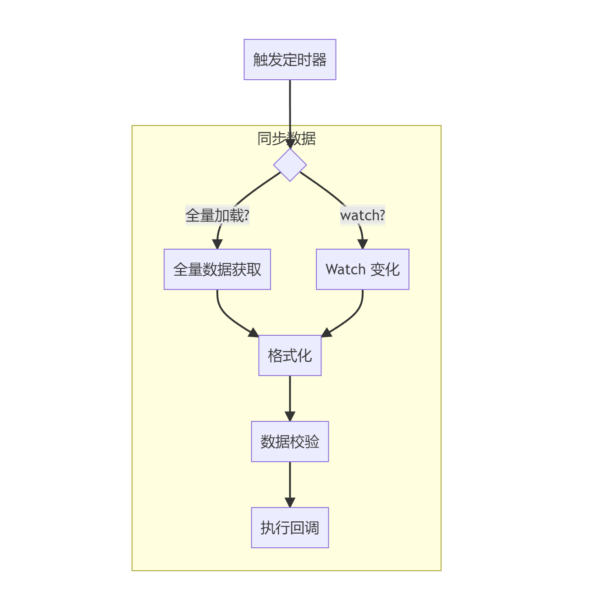

```lua
-- 定时器自动同步 etcd 数据
local function _automatic_fetch(premature, self)
    if premature then
        return
    end

    local i = 0
    while not exiting() and self.running and i <= 32 do
        i = i + 1

        local ok, err = xpcall(function()
            if not self.etcd_cli then
                local etcd_cli, err = get_etcd()
                if not etcd_cli then
                    error("failed to create etcd instance for key ["
                          .. self.key .. "]: " .. (err or "unknown"))
                end
                self.etcd_cli = etcd_cli
            end

            -- 同步数据
            local ok, err = sync_data(self)
            if err then
                if err ~= "timeout" and err ~= "Key not found"
                    and self.last_err ~= err then
                    log.error("failed to fetch data from etcd: ", err, ", ",
                              tostring(self))
                end

                if err ~= self.last_err then
                    self.last_err = err
                    self.last_err_time = ngx_time()
                else
                    if ngx_time() - self.last_err_time >= 30 then
                        self.last_err = nil
                    end
                end

                ngx_sleep(self.resync_delay + rand() * 0.5 * self.resync_delay)
            elseif not ok then
                -- no error. reentry the sync with different state
                ngx_sleep(0.05)
            end

        end, debug.traceback)

        if not ok then
            log.error("failed to fetch data from etcd: ", err, ", ",
                      tostring(self))
            ngx_sleep(self.resync_delay + rand() * 0.5 * self.resync_delay)
            break
        end
    end

    -- 进行下一次循环
    if not exiting() and self.running then
        ngx_timer_at(0, _automatic_fetch, self)
    end
end
```

##### 2.2.4.4. 配置同步

封装上述的逻辑提供给 `routes`、`plugins`、`services` 等数据结构使用，每个数据结构监听自己的 prefix，同步数据并执行回调，通常在回调逻辑上触发更新，例如重新构建 Router、重新构建 plugins table 等。

```lua
-- etcd 配置创建
function _M.new(key, opts)
    local local_conf, err = config_local.local_conf()
    if not local_conf then
        return nil, err
    end

    -- etcd 重新同步事件 5 秒, 与 Kong 重新 poll db 数据一致
    local etcd_conf = local_conf.etcd
    local prefix = etcd_conf.prefix
    local resync_delay = etcd_conf.resync_delay
    if not resync_delay or resync_delay < 0 then
        resync_delay = 5
    end

    local automatic = opts and opts.automatic
    local item_schema = opts and opts.item_schema
    local filter_fun = opts and opts.filter
    local timeout = opts and opts.timeout
    local single_item = opts and opts.single_item
    local checker = opts and opts.checker

    local obj = setmetatable({
        etcd_cli = nil,
        key = key and prefix .. key,
        automatic = automatic,
        item_schema = item_schema,
        checker = checker,
        sync_times = 0,
        running = true,
        conf_version = 0,
        values = nil,
        need_reload = true,
        routes_hash = nil,
        prev_index = 0,
        last_err = nil,
        last_err_time = nil,
        resync_delay = resync_delay,
        timeout = timeout,
        single_item = single_item,
        filter = filter_fun,
    }, mt)

    if automatic then
        -- timer 定时获取数据
        if not key then
            return nil, "missing `key` argument"
        end

        -- 从单例 table 获取 etcd 数据, 进行处理
        if loaded_configuration[key] then
            local res = loaded_configuration[key]
            -- 清空 table
            loaded_configuration[key] = nil -- tried to load

            log.notice("use loaded configuration ", key)

            local dir_res, headers = res.body, res.headers
            -- 加载数据并校验数据, 过滤数据
            load_full_data(obj, dir_res, headers)
        end

        -- 创建定时器自动同步
        ngx_timer_at(0, _automatic_fetch, obj)

    else
        local etcd_cli, err = get_etcd()
        if not etcd_cli then
            return nil, "failed to start a etcd instance: " .. err
        end
        obj.etcd_cli = etcd_cli
    end

    if key then
        created_obj[key] = obj
    end

    return obj
end
```

### 2.3. APISIX Proxy

源码中 Core 部分封装了数据获取的函数，在 API 网关主流程中通过 Nginx 生命周期串起来。

#### 2.3.1. Router

APISIX 的 Router 匹配基于压缩字典树（Radix Tree）实现，主要使用 [lua-resty-radixtree](https://github.com/api7/lua-resty-radixtree) 库。内置多种解析模式，这里只关注 HTTP 默认的 `radixtree_uri` 实现。

##### 2.3.1.1. 路由构建

`core.config.new` 调用的是 etcd 库（`config_etcd.lua`）维护的配置同步方法，返回原表，可以访问从 etcd 同步的数据。`core.schema.route` 包含了 route 这个数据结构的 schema 及校验规则，`check_route` 内部检查 route 直接绑定 plugin 的数据结构。

> APISIX 引入 route 直接绑定 plugin 的简化配置，不需要额外创建 plugin 对象。

```lua
-- 初始化 router
function _M.init_worker(filter)
    local user_routes, err = core.config.new("/routes", {
            automatic = true, -- 自动同步
            item_schema = core.schema.route,
            checker = check_route,
            filter = filter,
        })
    if not user_routes then
        error("failed to create etcd instance for fetching /routes : " .. err)
    end

    return user_routes
end
```

`filter` 是回调函数，下述的流程中会注入。

##### 2.3.1.2. 路由初始化

`router.http_init_worker` 中进行 Router 初始化。

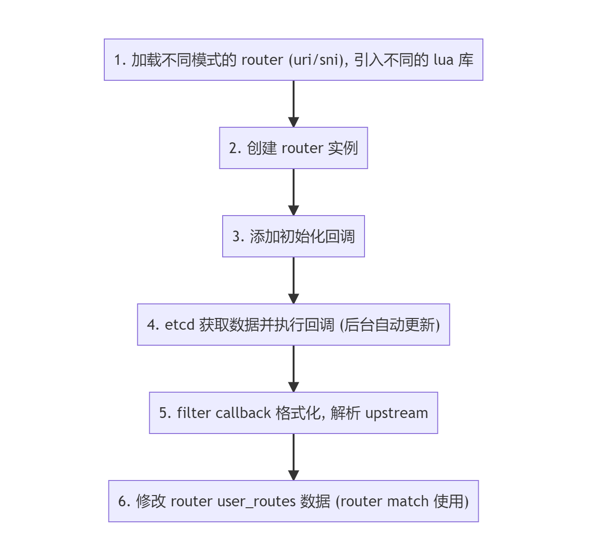


```lua
-- attach common methods if the router doesn't provide its custom implementation
local function attach_http_router_common_methods(http_router)
    ...

    if http_router.init_worker == nil then
        http_router.init_worker = function (filter)
            -- 添加路由
            http_router.user_routes = http_route.init_worker(filter)
        end
    end
end


function _M.http_init_worker()
    local conf = core.config.local_conf()
    -- 默认的匹配模式
    local router_http_name = "radixtree_uri"
    local router_ssl_name = "radixtree_sni"

    if conf and conf.apisix and conf.apisix.router then
        router_http_name = conf.apisix.router.http or router_http_name
        router_ssl_name = conf.apisix.router.ssl or router_ssl_name
    end

    -- 创建 router 实例
    local router_http = require("apisix.http.router." .. router_http_name)
    -- 修改 router 的 table
    attach_http_router_common_methods(router_http)
    -- 初始化路由
    -- 调用 apisix.http.route.init_worker 方法
    -- 从 etcd 获取数据并执行回调
    -- filter 为格式化, 解析 upstream
    router_http.init_worker(filter)
    _M.router_http = router_http

    local router_ssl = require("apisix.ssl.router." .. router_ssl_name)
    router_ssl.init_worker()
    _M.router_ssl = router_ssl

    _M.api = require("apisix.api_router")

    ...
end
```

`http_router.user_routes` 储存在 router 的 table 中，会在路由匹配时用到（懒加载）。

##### 2.3.1.3. 路由匹配

`access_by_lua` 阶段中进行路由匹配，将匹配结果（route、service）传递到 ctx 中供 balancer 请求上游。

```lua
do
    local uri_routes = {}
    local uri_router
    local match_opts = {}
    
    function _M.match(api_ctx)
        -- 从 module 的 user_routes 属性获取路由, 在 etcd route 变化时回调添加
        local user_routes = _M.user_routes
        if not cached_version or cached_version ~= user_routes.conf_version then
            uri_router = base_router.create_radixtree_uri_router(user_routes.values,
                                                                uri_routes, false)
            cached_version = user_routes.conf_version
        end

        if not uri_router then
            core.log.error("failed to fetch valid `uri` router: ")
            return true
        end

        return base_router.match_uri(uri_router, match_opts, api_ctx)
    end

end
```

`radixtree` 路由匹配库提供了匹配成功回调 handler，匹配成功后传递到 ctx 中。

```lua
core.table.insert(uri_routes, {
                ...
                handler = function (api_ctx, match_opts)
                    api_ctx.matched_params = nil
                    api_ctx.matched_route = route
                    api_ctx.curr_req_matched = match_opts.matched
                end
            })
```

#### 2.3.2. Balancer

Balancer 部分与 Kong 逻辑一致，甚至代码里函数名都一样，主要逻辑是 Service/Upstream 节点解析、负载均衡策略、健康检查与失败重试。

APISIX 支持的一特性是外部服务发现，Kong 中默认支持通过 DNS 解析 Service host，根据 AAAA、A、SRV 记录添加 IP 与优先级，APISIX 支持了从 consul、eruka 和其他注册中心获取 IP 地址列表，并同步节点数据（长轮询）。

##### 2.3.2.1. 服务发现

如果 serivce host 是域名, 通过外部注册中心进行服务发现，获取上游 IP 列表。

```lua
function _M.set_by_route(route, api_ctx)
   	...
    -- 如果 serivce host 是域名, 通过 discovery 发现, dns 解析
    if up_conf.service_name then
        ...
        -- 外部注册中心
        local dis = discovery[up_conf.discovery_type]
        if not dis then
            return 500, "discovery " .. up_conf.discovery_type .. " is uninitialized"
        end

        -- 从注册中心数据源（缓存本地 table）获取 IP
        local new_nodes, err = dis.nodes(up_conf.service_name)
        if not new_nodes then
            return HTTP_CODE_UPSTREAM_UNAVAILABLE, "no valid upstream node: " .. (err or "nil")
        end

        ...
    end

    -- 将 upstream 节点信息存入 ctx
    set_directly(api_ctx, up_conf.type .. "#upstream_" .. tostring(up_conf),
                 api_ctx.conf_version, up_conf)

    local nodes_count = up_conf.nodes and #up_conf.nodes or 0
    if nodes_count == 0 then
        return HTTP_CODE_UPSTREAM_UNAVAILABLE, "no valid upstream node"
    end
	...

    set_upstream_scheme(api_ctx, up_conf)

    local ok, err = fill_node_info(up_conf, api_ctx.upstream_scheme, false)
    if not ok then
        return 503, err
    end
    ...

    local scheme = up_conf.scheme
    if (scheme == "https" or scheme == "grpcs") and up_conf.tls then
        ...
    end

    return
end
```

##### 2.3.2.2. 负载均衡

不同于 Kong 使用自己封装的 [lua-resty-dns-client/balancer](https://github.com/Kong/lua-resty-dns-client/tree/master/src/resty/dns/balancer) 作为负载均衡器，APISIX 基于 [lua-resty-balancer](https://github.com/openresty/lua-resty-balancer) 封装了负载均衡策略，基于 [lua-resty-healthcheck](https://github.com/Kong/lua-resty-healthcheck)（fork 版本）实现节点健康检查。

API 网关的负载均衡策略（Kong/APISIX）都是基于 OpenResty [lua-resty-core/balancer](https://github.com/openresty/lua-resty-core/blob/master/lib/ngx/balancer.md#set_current_peer) 提供的负载均衡函数实现，`set_current_peer` 设置当前请求上游地址，`set_more_tries` 设置请求失败重试次数，`get_last_failure` 获取上一次请求失败结果判断是否需要继续重试，`set_timeouts` 设置单个请求超时时间。

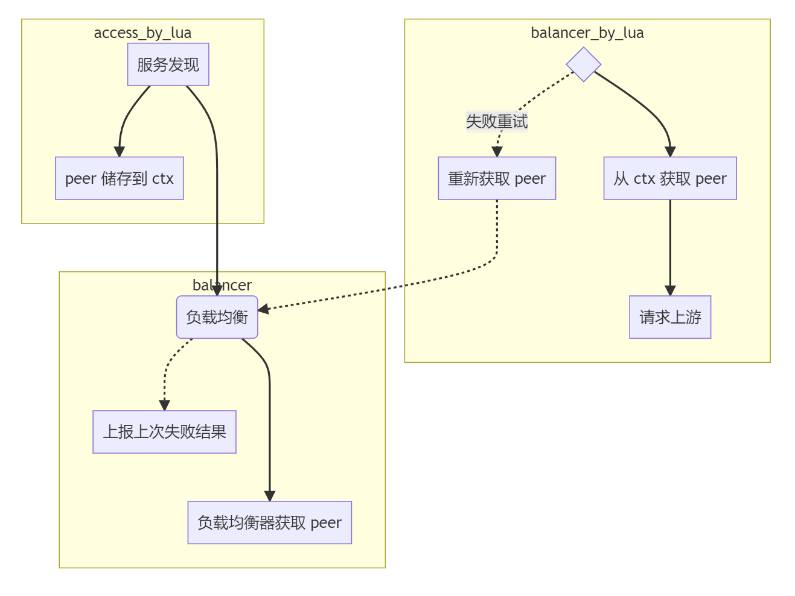

`set_balancer_opts` 设置 Nginx Balancer 参数。 

```lua
-- set_balancer_opts will be called in balancer phase and before any tries
local function set_balancer_opts(route, ctx)
    local up_conf = ctx.upstream_conf

    -- If the matched route has timeout config, prefer to use the route config.
    local timeout = nil
    if route and route.value and route.value.timeout then
        timeout = route.value.timeout
    else
        if up_conf.timeout then
            timeout = up_conf.timeout
        end
    end
    -- 设置 Nginx 请求超时时间
    if timeout then
        local ok, err = set_timeouts(timeout.connect, timeout.send,
                                     timeout.read)
        if not ok then
            core.log.error("could not set upstream timeouts: ", err)
        end
    end

    local retries = up_conf.retries
    if not retries or retries < 0 then
        retries = #up_conf.nodes - 1
    end

    -- 设置 Nginx 失败重试次数
    if retries > 0 then
        local ok, err = set_more_tries(retries)
        ...
    end
end
```

在 `access_by_lua` 阶段中服务发现，调用 balancer 库获取 peer 节点，`balancer_by_lua` 中从 ctx 中获取 peer 节点信息，访问后端节点，若失败重试（该阶段再次被调用），重新获取 peer 节点，重新创建请求（`recreate_request()`）再次访问后端节点。


#### 2.3.3. Plugin

插件机制也与 Kong 类似，插件开发者可以定义 Schema 配置数据结构，以及 Handler 注入 Nginx 请求生命周期，API 网关提供核心的库供开发者使用（SDK）。

APISIX 相比 Kong，开源的插件较多，插件 Schema 便于编写，同时插件只需要单文件，而 Kong 的插件通常是单独一个仓库，不方便维护。但是考虑到插件需要单独的 Test::Nginx 单元测试，单独一个仓库也未尝不可（Kong 还说了以后会把 Github 项目主仓库的插件代码移到单独的仓库）。

具体各个阶段执行逻辑应该与 Kong 相同，即部分阶段插件开协程并发执行，部分阶段避免数据竞争，插件顺序执行。

值得注意的一点是 APISIX 生命周期里没有 `rewrite_by_lua` 阶段，插件实现的该阶段会在 `access_by_lua` 中优先于 `access_by_lua` 插件逻辑执行。

> The apisix run both ".access" and ".rewrite" in the "access" phase.[^8]

##### 2.3.3.1. 插件加载

插件列表从本地 yaml 文件获取，同时监听本地文件变化，同步配置；插件配置信息从 etcd 获取。

```lua
local init_plugins_syncer
do
    local plugins_conf

    function init_plugins_syncer()
        local err
        -- 储存插件的配置信息, 一条 kv
        plugins_conf, err = core.config.new("/plugins", {
            automatic = true, -- 后台创建 timer watch etcd 自动同步配置
            item_schema = core.schema.plugins,
            single_item = true,
            -- filter 方法中访问到 etcd kv 的 item, 这里进行插件加载的回调
            -- 每次 etcd 插件配置变动, 自动同步
            filter = function(item)
                -- we need to pass 'item' instead of plugins_conf because
                -- the latter one is nil at the first run
                _M.load(item)
            end,
        })
        if not plugins_conf then
            error("failed to create etcd instance for fetching /plugins : " .. err)
        end
    end
end
```

插件列表会储存到 Lua table 中：

```lua
-- 加载插件
local function load(plugin_names)
    local processed = {}
    for _, name in ipairs(plugin_names) do
        if processed[name] == nil then
            processed[name] = true
        end
    end

    core.log.warn("new plugins: ", core.json.delay_encode(processed))

    -- 移除已经存在的 module
    for name in pairs(local_plugins_hash) do
        unload_plugin(name)
    end

    core.table.clear(local_plugins)
    core.table.clear(local_plugins_hash)

    -- 加载插件
    for name in pairs(processed) do
        load_plugin(name, local_plugins)
    end

    -- 插件排序, priority 越高的插件越先执行, 与 Kong 同样
    -- sort by plugin's priority
    if #local_plugins > 1 then
        sort_tab(local_plugins, sort_plugin)
    end

    -- 打印调试日志
    for i, plugin in ipairs(local_plugins) do
        ...
    end

    return true
end
```

插件配置信息 `plugin_meta` 也加载到 Lua table 中，在插件匹配的时候会获取。

##### 2.3.3.2. 插件匹配

插件过滤，遍历插件列表，匹配开启的插件，O(n) 操作 `plugin.filter(route)` ：

```lua
-- 插件配置绑定
function _M.filter(user_route, plugins)
    ...

    plugins = plugins or core.tablepool.fetch("plugins", 32, 0)
    for _, plugin_obj in ipairs(local_plugins) do
        local name = plugin_obj.name
        local plugin_conf = user_plugin_conf[name]

        -- 插件和插件配置存入
        if type(plugin_conf) == "table" and not plugin_conf.disable then
            core.table.insert(plugins, plugin_obj)
            core.table.insert(plugins, plugin_conf)
        end
    end

    trace_plugins_info_for_debug(plugins)

    return plugins
end
```

##### 2.3.3.3. 插件执行

这里以 `access_by_lua` 阶段插件执行逻辑为例，根据 Route、Service 匹配插件，创建临时 Table 储存 plugin 和  plugin_conf，存入 ctx 中。

```lua
        -- 插件过滤, 遍历插件列表, 匹配开启的插件, O(n)
        local plugins = plugin.filter(route)
        api_ctx.plugins = plugins

        -- fake 执行 rewrite 阶段
        plugin.run_plugin("rewrite", plugins, api_ctx)
        if api_ctx.consumer then
            local changed
            route, changed = plugin.merge_consumer_route(
                route,
                api_ctx.consumer,
                api_ctx
            )

            core.log.info("find consumer ", api_ctx.consumer.username,
                          ", config changed: ", changed)

            if changed then
                core.table.clear(api_ctx.plugins)
                api_ctx.plugins = plugin.filter(route, api_ctx.plugins)
            end
        end
        -- 执行 access 阶段
        plugin.run_plugin("access", plugins, api_ctx)
```

#### 2.3.4. 主流程

以 Nginx HTTP Subsystem 为例分析主要执行逻辑，其中一些核心逻辑已在上述小节中流程分析过。

##### 2.3.4.1. init_by_lua

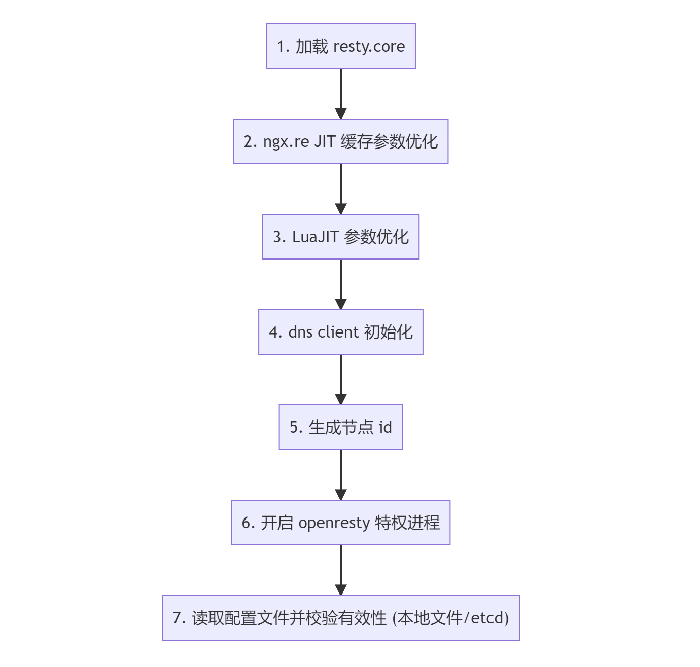

```lua
function _M.http_init(args)
    require("resty.core")

    if require("ffi").os == "Linux" then
        require("ngx.re").opt("jit_stack_size", 200 * 1024)
    end

    require("jit.opt").start("minstitch=2", "maxtrace=4000",
                             "maxrecord=8000", "sizemcode=64",
                             "maxmcode=4000", "maxirconst=1000")

    core.resolver.init_resolver(args)
    -- 生成节点 ID
    core.id.init()

    -- 启用 openresty 的特权进程
    local process = require("ngx.process")
    local ok, err = process.enable_privileged_agent()
    if not ok then
        core.log.error("failed to enable privileged_agent: ", err)
    end

    -- 从 etcd / yaml 本地配置文件获取配置, etcd 有 init 函数
    if core.config.init then
        local ok, err = core.config.init()
        if not ok then
            core.log.error("failed to load the configuration: ", err)
        end
    end
end
```

##### 2.3.4.2. init_worker_by_lua

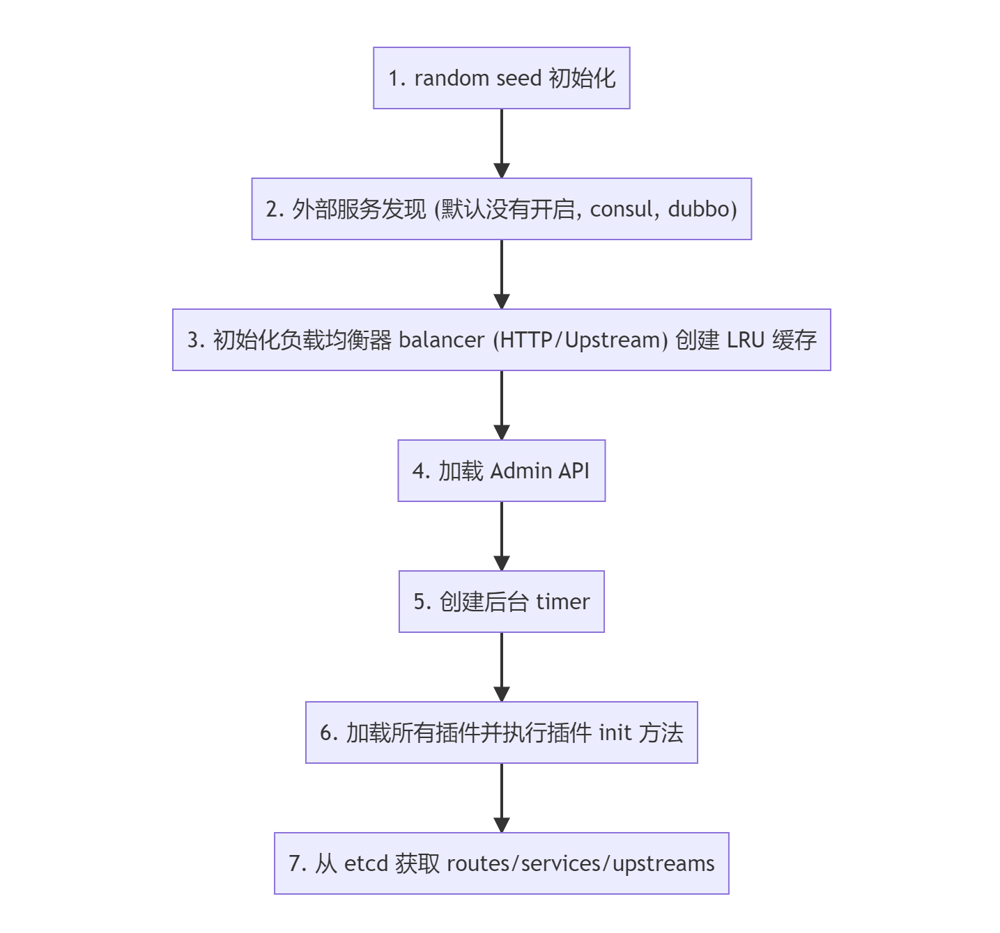

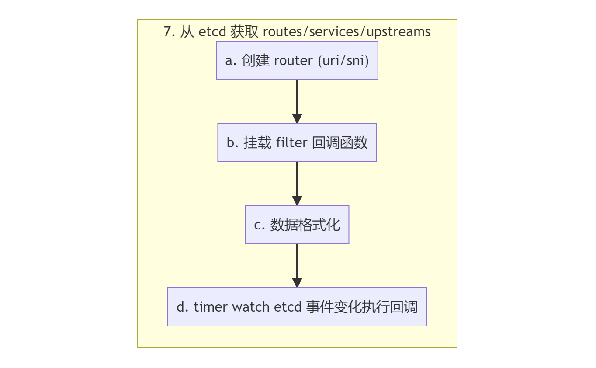

```lua
function _M.http_init_worker()
    local seed, err = core.utils.get_seed_from_urandom()
    if not seed then
        core.log.warn('failed to get seed from urandom: ', err)
        seed = ngx_now() * 1000 + ngx.worker.pid()
    end
    math.randomseed(seed)
    -- for testing only
    core.log.info("random test in [1, 10000]: ", math.random(1, 10000))

    -- 进程间事件通信
    local we = require("resty.worker.events")
    local ok, err = we.configure({shm = "worker-events", interval = 0.1})
    if not ok then
        error("failed to init worker event: " .. err)
    end
    -- 服务发现 lib
    local discovery = require("apisix.discovery.init").discovery
    -- 默认没有开启服务发现
    if discovery and discovery.init_worker then
        discovery.init_worker()
    end
    -- 初始化负载均衡器, 方法为空
    require("apisix.balancer").init_worker()
    -- 负载均衡器
    load_balancer = require("apisix.balancer")
    -- TODO admin 流程分析
    require("apisix.admin.init").init_worker()
    -- 注册全局 timer
    require("apisix.timers").init_worker()

    -- 加载所有插件并执行插件 init
    plugin.init_worker()
    -- 初始化 router, 并加载 routes
    router.http_init_worker()

    -- 初始化 services, 加载 services
    require("apisix.http.service").init_worker()
    -- 加载插件配置
    plugin_config.init_worker()
    -- consumer 加载
    require("apisix.consumer").init_worker()

    if core.config == require("apisix.core.config_yaml") then
        core.config.init_worker()
    end

    require("apisix.debug").init_worker()
    -- upstreams 加载
    apisix_upstream.init_worker()
    require("apisix.plugins.ext-plugin.init").init_worker()

    local_conf = core.config.local_conf()

    if local_conf.apisix and local_conf.apisix.enable_server_tokens == false then
        ver_header = "APISIX"
    end
end
```

##### 2.3.4.3. access_by_lua

```lua
-- access_by_lua 阶段, apisix 没有 rewrite_by_lua
-- ref: https://github.com/apache/apisix/issues/1120
-- ref: https://github.com/apache/apisix/issues/1120#issuecomment-584949073
function _M.http_access_phase()
    local ngx_ctx = ngx.ctx
	...

    -- 从 table 缓存池中获取 table
    -- always fetch table from the table pool, we don't need a reused api_ctx
    local api_ctx = core.tablepool.fetch("api_ctx", 0, 32)
    -- 将 table 储存在 ngx.ctx 中, 下一个阶段共享
    ngx_ctx.api_ctx = api_ctx

    -- 绑定 metatable 
    core.ctx.set_vars_meta(api_ctx)
	...

    -- router 路由匹配
    router.router_http.match(api_ctx)

    -- run global rule
    plugin.run_global_rules(api_ctx, router.global_rules, nil)

    ...
    local enable_websocket = route.value.enable_websocket

    -- route 插件配置绑定
    if route.value.plugin_config_id then
       	...
        route = plugin_config.merge(route, conf)
    end

    -- 获取对应的 service
    if route.value.service_id then
        local service = service_fetch(route.value.service_id)
        ...
        if enable_websocket == nil then
            enable_websocket = service.value.enable_websocket
        end

    else
        ...
    end
    api_ctx.route_id = route.value.id
    api_ctx.route_name = route.value.name

    -- 执行 script
    if route.value.script then
        script.load(route, api_ctx)
        script.run("access", api_ctx)
    else
        -- 插件过滤, 遍历插件列表, 匹配开启的插件, O(n)
        local plugins = plugin.filter(route)
        api_ctx.plugins = plugins

        -- fake 执行 rewrite 阶段
        plugin.run_plugin("rewrite", plugins, api_ctx)
        if api_ctx.consumer then
            local changed
            route, changed = plugin.merge_consumer_route(
                route,
                api_ctx.consumer,
                api_ctx
            )

            core.log.info("find consumer ", api_ctx.consumer.username,
                          ", config changed: ", changed)

            if changed then
                core.table.clear(api_ctx.plugins)
                api_ctx.plugins = plugin.filter(route, api_ctx.plugins)
            end
        end
        -- 执行 access 阶段
        plugin.run_plugin("access", plugins, api_ctx)
    end

    local up_id = route.value.upstream_id

    -- used for the traffic-split plugin
    if api_ctx.upstream_id then
        up_id = api_ctx.upstream_id
    end
	...

    -- websocket 特殊处理
    if enable_websocket then
        api_ctx.var.upstream_upgrade    = api_ctx.var.http_upgrade
        api_ctx.var.upstream_connection = api_ctx.var.http_connection
        core.log.info("enabled websocket for route: ", route.value.id)
    end

    if route.value.service_protocol == "grpc" then
        api_ctx.upstream_scheme = "grpc"
    end

    -- 获取 upstream 节点
    local code, err = set_upstream(route, api_ctx)
    if code then
        core.log.error("failed to set upstream: ", err)
        core.response.exit(code)
    end

    -- 负载均衡
    local server, err = load_balancer.pick_server(route, api_ctx)
    if not server then
        core.log.error("failed to pick server: ", err)
        return core.response.exit(502)
    end

    api_ctx.picked_server = server

    set_upstream_headers(api_ctx, server)

    -- stash ngx ctx 这部分与 Kong 一致, 怀疑是抄来的（95% 置信区间）
    ngx_var.ctx_ref = ctxdump.stash_ngx_ctx()
    local up_scheme = api_ctx.upstream_scheme
    if up_scheme == "grpcs" or up_scheme == "grpc" then
        return ngx.exec("@grpc_pass")
    end

    if api_ctx.dubbo_proxy_enabled then
        return ngx.exec("@dubbo_pass")
    end
end
```


## 3. 一些思考

### 3.1. 边缘计算

> 对于互联网设备，网络边缘是设备或包含设备的本地网络与互联网通信的位置。边缘是个比较模糊的术语。例如，可以将用户的计算机或 IoT  摄像头内部的处理器视为网络边缘，但也可以将用户的路由器、ISP 或本地边缘服务器视为边缘。重要的是，网络边缘在地理位置上靠近设备，与[源站](https://www.cloudflare.com/learning/cdn/glossary/origin-server/)和云服务器不同，后者可能与它们相互通信的设备相距很远。
>
> 完全减轻额外硬件需求的一种方法是利用边缘服务器。例如，借助 Cloudflare 分散在全球各地的 194 个边缘服务器网络，Cloudflare 的客户可以使用 [Cloudflare Workers](https://www.cloudflare.com/products/cloudflare-workers/) 在全球范围内运行边缘代码。[^9]

Cloudflare 的边缘计算是基于 Edge Gateway（边缘网关、边缘集群）的 Serverless 代码执行，提供了 JS 代码执行，以及 WASM 二进制。[^10]

*一些相关的 Issue:*

- [Support wasm in openresty?](https://github.com/openresty/openresty/issues/541)

- [feature: support WebAssembly in apisix.](https://github.com/apache/apisix/issues/157)

#### 3.1.1. Lua (Serverless)

APISIX 的 Serverless 插件功能支持注入任何 Lua 脚本，而 Kong 网关也有类似的插件功能。[^11]

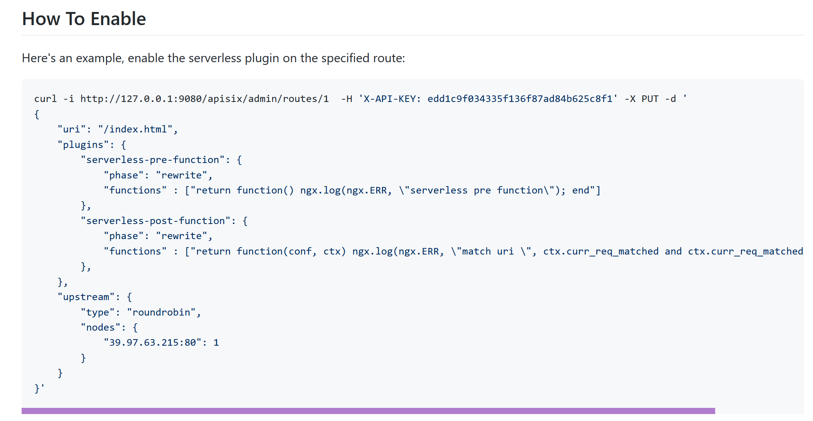

Serverless 插件支持执行简单的函数方法。

#### 3.1.2. WebAssembly

APISIX 自 2019 年发起提案，试图通过 WebAssembly 来扩展 Lua 贫乏的生态。
2021 年，在 WebAssembly 运行时的技术选型上，APISIX 的技术团队更偏向使用由 Fastly 团队
支撑[^14]的 [wasmtime](https://github.com/bytecodealliance/wasmtime) 项目。

开源的 WebAssembly 除了 wasmtime 还有[^15]：

- [WasmEdge](https://github.com/WasmEdge/WasmEdge)（前身 SSVM），由 Second State 开源的 CNCF 沙箱项目。
- [Wasmer](https://github.com/wasmerio/wasmer)，Dart 语言使用的 Wasm 运行时。
- [Lucet](https://github.com/bytecodealliance/lucet)，由 Fastly 开源的 [Bytecode Alliance](https://bytecodealliance.org/) 的
  项目，将会与 wasmtime 合并。

在 Issue [#157](https://github.com/apache/apisix/issues/157) 的讨论中，Wasmer 的 CEO 也来插了一嘴，
希望 APISIX 能够选型 Wasmer 运行时，APISIX 成员给了 Wasmer 一个大大的赞，
最终在 [api7/wasm-nginx-module](https://github.com/api7/wasm-nginx-module) 插件中，
还是使用 wasmtime 运行时实现了对 WebAssembly 的支持。


### 3.2. Service Mesh

APISIX 的 Service Mesh 项目 [api7/apisix-mesh-agent](https://github.com/api7/apisix-mesh-agent)，将 APISIX Proxy 作为 Sidecar 运作在数据平面。通过实现控制平面的接口，接入类似 [Istio](https://github.com/istio/istio) 或 [Kuma](https://github.com/kumahq/kuma)（由 Kong 创建捐赠给 CNCF） 的控制平面，形成一套完整的 Service Mesh 方案。
该项目本质上是使用 APISIX 替换了 Istio 中的 Envoy。

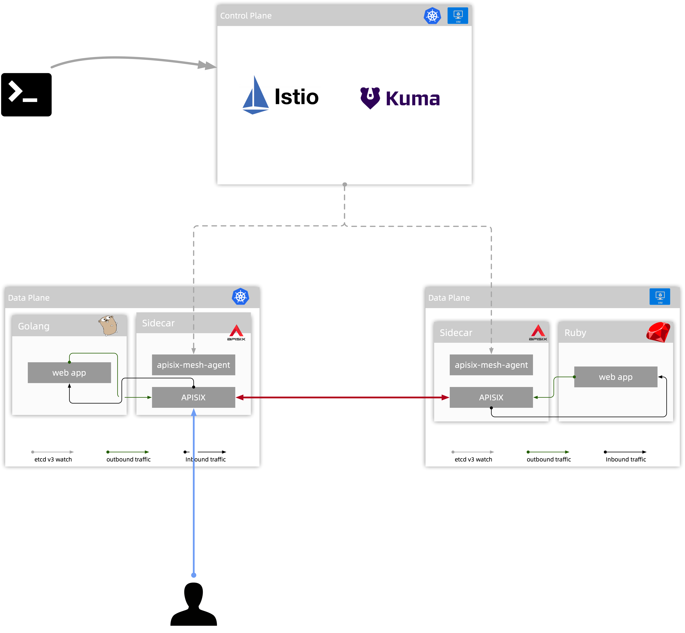


值得一提的是 Kong 类似的 Service Mesh 项目，叫做 [Kong Mesh](https://docs.konghq.com/mesh/)，目前只提供企业版本。

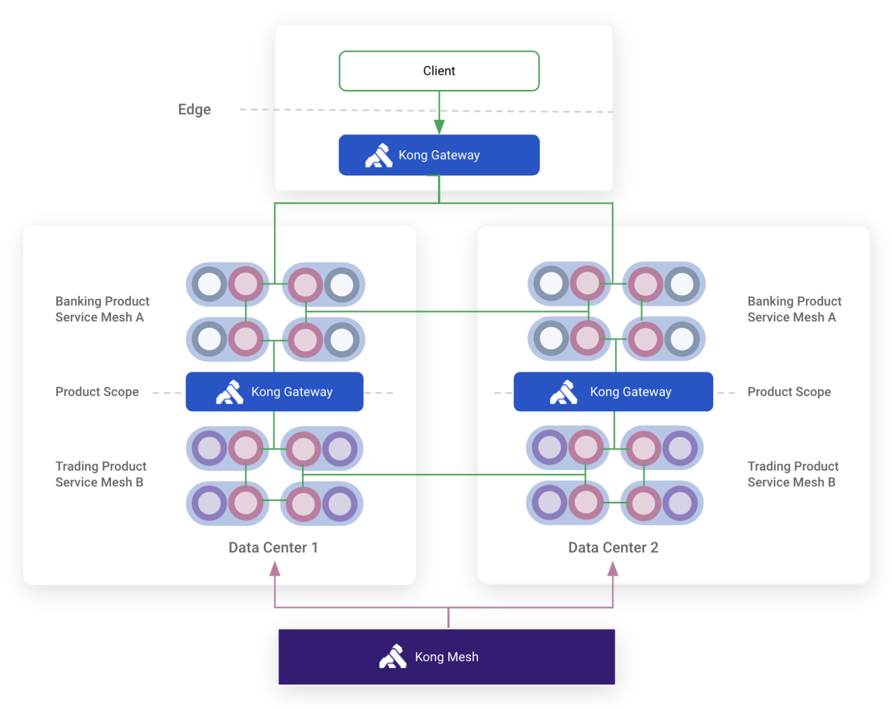


[^1]: 摘自 APISIX [#3207](https://github.com/apache/apisix/issues/3207#issuecomment-759269071) Issue
[^2]: [LuaJIT FFI 介绍，及其在 OpenResty 中的应用（下）](https://segmentfault.com/a/1190000016149595)
[^3]: [《OpenResty精华整理》6.性能优化 ](https://yxudong.github.io/%E3%80%8AOpenResty%E7%B2%BE%E5%8D%8E%E6%95%B4%E7%90%86%E3%80%8B6.%E6%80%A7%E8%83%BD%E4%BC%98%E5%8C%96/)
[^4]: [OpenResty：特权进程和定时任务](https://www.cnblogs.com/liekkas01/p/12764577.html)
[^5]: OpenResty lua-resty-core 文档 [enable_privileged_agent](https://github.com/openresty/lua-resty-core/blob/master/lib/ngx/process.md#enable_privileged_agent)
[^6]: OpenResty Issue [ngx.var vs ngx.ctx](https://github.com/openresty/lua-nginx-module/issues/1482)
[^7]: [openresty/lua-resty-lrucache](https://github.com/openresty/lua-resty-lrucache#description)
[^8]: [set variable inoperative!!](https://github.com/apache/apisix/issues/1120#issuecomment-584949073)
[^9]: [什么是边缘计算？](https://www.cloudflare.com/zh-cn/learning/serverless/glossary/what-is-edge-computing/)
[^10]: [WebAssembly on Cloudflare Workers](https://blog.cloudflare.com/webassembly-on-cloudflare-workers/)
[^11]: [APISIX Serverless Plugin](https://github.com/apache/apisix/blob/master/docs/en/latest/plugins/serverless.md)
[^13]: [openresty/luajit2](https://github.com/openresty/luajit2)
[^14]: 摘自 [Bytecode Alliance: One year update](https://bytecodealliance.org/articles/1-year-update)
[^15]: 摘自 [Proposal: APISIX JavaScript Plugin Runner](https://github.com/apache/apisix/issues/5106)