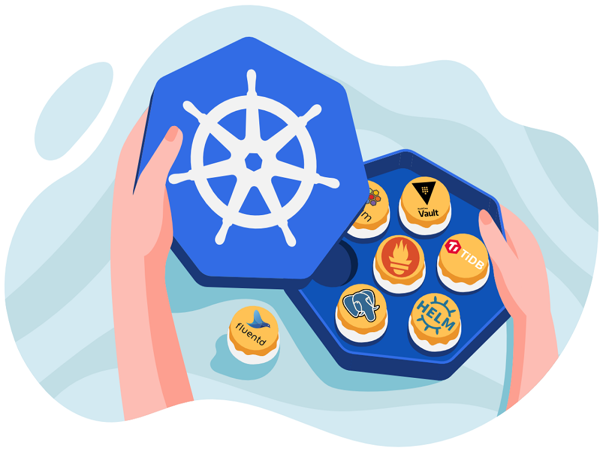
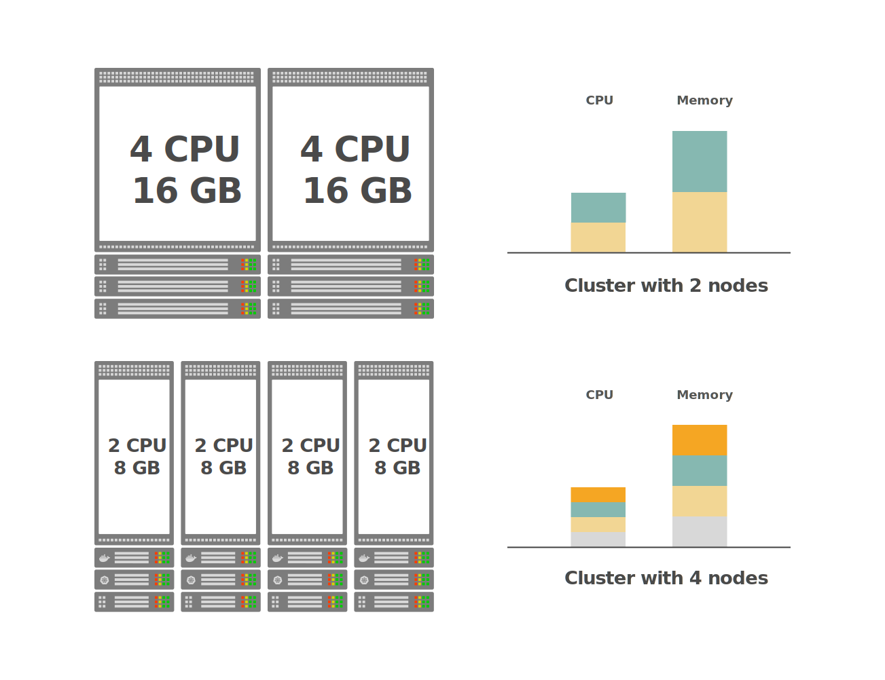
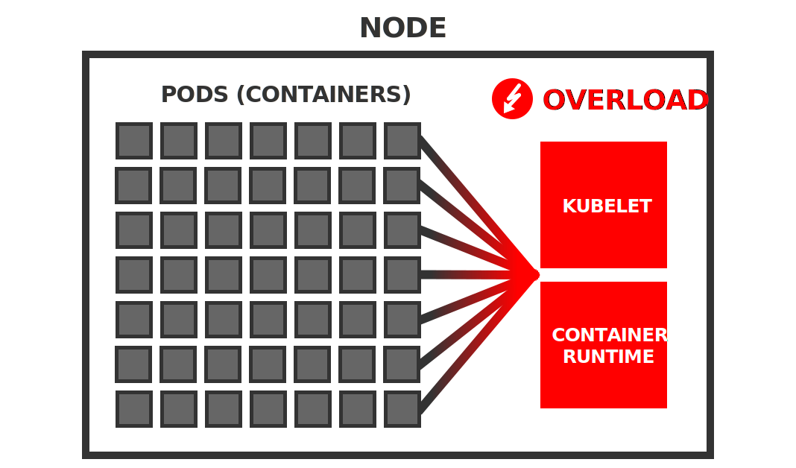
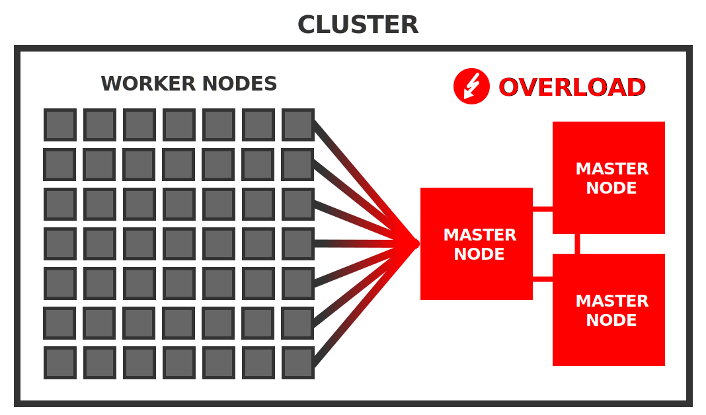

## 编者按

本文从多个维度阐述了使用更少的大节点与更多的小节点来组建 Kubernetes 集群各自的优势与劣势，并结合实践经验给出了选择工作节点数量和大小的一般方法。

## 引言

**欢迎来到 Kubernetes 学习园地**，这是一个常规专栏，收集整理了我们在线上以及线下研讨会上由 Kubernetes 专家回答的最有意思的问题。

> 今天问题的答案由 [Daniel Weibel](https://medium.com/@weibeld) 给出。Daniel 是一名软件工程师，同时也是 Learnk8s 的讲师。

如果您希望在下一期中展示您的问题，请[通过邮件联系我们](hello@learnk8s.io)或者[在 tweet 上 @learnk8s](https://twitter.com/learnk8s)。

错过了前几期？[点击这里查看往期内容](https://learnk8s.io/bite-sized)。

**在创建 Kubernetes 集群时，您首先会想到的问题之一就是：“我应该创建何种类型的工作节点，以及应该创建多少个？”。**

如果您正在搭建内部集群，是应该购买最新一代的超级服务器，还是使用数据中心里的十几台旧机器呢？

或者您使用的是托管 Kubernetes 服务，例如 [Google Kubernetes Engine (GKE)](https://cloud.google.com/kubernetes-engine/)，是应该使用 8 个 `n1-standard-1` 实例，还是应该使用 2 个 `n1-standard-4` 实例来实现您想要的计算能力呢？

## 集群容量

一般来说，Kubernetes 集群可以被视为是将一组单个节点抽象为一个大的“超级节点”。这个超级节点的总计算容量（就 CPU 和内存而言）是所有组成节点资源容量的总和。您可以采用多种不同的资源配置方式实现集群所需的目标容量。

例如，假如您需要一个总容量为 8 个 CPU 和 32GB 内存的集群。

> 例如，因为要在集群上运行的应用程序需要此数量的资源。

以下是实现集群的两种可能方法：

通过这两种方式构建的集群拥有相同的资源容量，但是一种是使用 4 个较小的节点，而另一种是使用 2 个较大的节点。

**究竟哪种配置方式更好呢？**

为了解决这个问题，让我们对比下二者（即更少的大节点与更多的小节点）各自的优缺点。

> 请注意，本文中的“节点”始终代指工作节点。主节点数量和大小的选择是完全不同的主题。

## 更少的大节点

这方面最极端的一个例子就是由单个工作节点提供整个集群的计算容量。

在上面的示例中，这将是一个具有 16 个 CPU 和 16GB 内存的单个工作节点。

### 使用大节点的优势

*让我们来看看这种方法可能具有的优势。*

#### 更少的管理开销 

简单来说，管理少量机器相比管理大量机器会更省力。对节点进行升级和打补丁的操作能很迅速地完成，节点间的同步保持也更容易。此外，对于很少的机器而言，预期故障的绝对数量也会小于使用大量机器的场景。

*但请注意，这主要适用于裸机服务器而不适用于云实例。*

如果您使用云实例（作为托管 Kubernetes 服务的一部分或在云基础架构上安装的 Kubernetes），则实际上是将底层机器的管理外包给了云提供商。因此，管理云中的 10 个节点可能并不比管理云中的单个节点耗费更多管理成本。

#### 更低的单节点成本

虽然高端机器比低端机器更昂贵，但价格上涨不一定是线性的。换句话说，具有 10 个 CPU 和 10GB 内存的单台机器可能比具有 1 个 CPU 和 1GB 内存的 10 台机器便宜。

*但请注意，如果您使用云实例，这个原则可能并不适用。*

在主要的云提供商 [Amazon Web Services](https://aws.amazon.com/ec2/pricing/on-demand/)、[Google Cloud Platform](https://cloud.google.com/compute/vm-instance-pricing) 和 [Microsoft Azure](https://azure.microsoft.com/en-us/pricing/calculator/#virtual-machines) 的当前定价方案中，实例价格会随容量线性增加。例如，在 Google Cloud Platform 上，64 个 `n1-standard-1` 实例的成本与单个 `n1-standard-64` 实例完全相同——这两种方式都为您提供 64 个 CPU 和 240GB 内存。因此，在云上，您通常无法通过使用更大的机器来节省资金投入。

#### 允许运行资源饥饿型应用

具备大型节点可能只是您要在集群中运行的应用程序类型的需求。

例如，如果您有一个需要 8GB 内存的机器学习应用程序，则无法在仅具有 1GB 内存的节点的集群上运行它。但是，您可以在具有 10GB 内存节点的集群上运行它。

### 使用大节点的劣势

*看完了优势，让我们再来看看劣势。*

#### 每个节点会运行大量 Pod

在较少的节点上运行相同的工作负载自然意味着在每个节点上运行更多的 Pod。

*这可能会成为一个问题。*

原因是每个 Pod 都会为在节点上运行的 Kubernetes 代理程序引入一些开销——例如容器运行时（如 Docker）、kubelet 和 cAdvisor。

例如，kubelet 对节点上的每个容器执行周期性的 liveness 和 readiness 探测——更多容器意味着在每轮迭代中 kubelet 将执行更多工作。cAdvisor 收集节点上所有容器的资源使用统计信息，并且 kubelet 定期查询此信息并在其 API 上公开它——再次，这意味着每轮迭代中 cAdvisor 和 kubelet 的工作量都会增加。

随着 Pod 数量的增长，这些问题的聚积可能会开始减慢系统速度，甚至使集群系统变得不可靠。

有报告称，[节点被报告为未就绪](https://github.com/kubernetes/kubernetes/issues/45419)，是因为周期性的的 kubelet 运行状况检查花费了太长时间来迭代节点上的所有容器。

出于这些原因，Kubernetes 官方[建议每个节点最多 110 个 Pod](https://kubernetes.io/docs/setup/best-practices/cluster-large/)。对于这个数字，Kubernetes 已经进行过相关测试，可以在一般类型的节点上可靠地工作。

当然，如果节点的性能足够好，您可能也能够成功地让每个节点运行更多的 Pod ——但很难预测这是否能够顺利进行，也许会遇到一些问题。

*大多数托管 Kubernetes 服务甚至对每个节点的 Pod 数量施加了严格的限制：*

- 在 [Amazon Elastic Kubernetes Service（EKS）](https://github.com/awslabs/amazon-eks-ami/blob/master/files/eni-max-pods.txt)上，每个节点的最大 Pod 数取决于节点类型，范围从 4 到 737。
- 在 [Google Kubernetes Engine（GKE）](https://cloud.google.com/kubernetes-engine/quotas)上，无论节点类型如何，每个节点的限制为 100 个 Pod。
- 在 [Azure Kubernetes Service（AKS）](https://docs.microsoft.com/bs-latn-ba/azure/aks/configure-azure-cni#maximum-pods-per-node)上，默认限制是每个节点 30 个 Pod，但最多可以增加到 250 个。

因此，如果您计划为每个节点运行大量 Pod，则应该事先进行测试，看能否按预期那样工作。

#### 有限的副本数量

较少的节点可能会限制应用程序的副本数量。

例如，如果您有一个由 5 个副本组成的高可用应用程序，但您只有 2 个节点，那么应用程序的有效副本数量将减少到 2。这是因为 5 个副本只能分布在 2 个节点上，如果其中一个节点失败，它可能会同时挂掉该节点上的多个副本。相反，如果您有至少 5 个节点，则每个副本可以在单独的节点上运行，并且单个节点的故障最多只会挂掉其中一个副本。

因此，如果您有高可用要求，则可能需要集群节点数大于某个下限值。

#### 更大的破坏范围

如果您只有几个工作节点，那么节点失败造成的影响比使用大量节点时的影响要大。

例如，如果您只有两个节点，那其中一个节点出现故障，就意味着一半的节点会消失。Kubernetes 可以将失败节点的工作负载重新安排到其他节点。但是，如果您只有几个节点，那风险也会增加，因为剩余节点上可能没有足够的备用资源容量来容纳故障节点的所有工作负载。结果是，部分应用程序将永久停机，直到再次启动故障节点。

因此，如果您想减少硬件故障的影响，则应该选择更多的节点。

#### 较大的资源伸缩增量

Kubernetes 为云基础架构提供了 Cluster Autoscaler，允许根据当前需求自动添加或删除节点。如果使用大型节点，则会有较大的资源伸缩增量，这会使资源扩缩容更加笨重。

例如，如果您只有 2 个节点，则添加节点意味着将群集容量增加 50%。这可能比您实际需要的资源多得多，就意味着您需要为未使用的资源付费。

因此，如果您计划使用集群的自动弹性伸缩功能，则较小的节点允许您进行更轻量且经济高效的资源扩缩容。

*在讨论了更少大节点的优缺点之后，让我们转向更多小节点的场景。*

## 更多的小节点

这种方法通过许多小节点构建集群，而不使用更少的大节点。

***那它的优缺点又是什么呢？***

### 使用小节点的优势

使用更多小节点的优点正对应于使用更少大节点的缺点。

#### 减小破坏范围

如果您有更多节点，则每个节点上的 Pod 自然会更少。

例如，如果您有 100 个 Pod 和 10 个节点，则每个节点平均只包含 10 个 Pod。这样，即便其中一个节点发生故障，它的影响也仅限于总工作负载的较小的一部分。有可能只有部分应用程序受到影响，并且可能只有少量副本挂掉，因此整个应用程序会仍然保持运行状态。

此外，剩余节点上的备用资源很可能足以容纳故障节点的工作负载，因此Kubernetes 可以重新安排所有 Pod，并且您的应用程序可以相对快速地恢复到完全正常的运行状态。

#### 允许更多副本数量

如果您有一个多副本高可用应用程序以及足够的可用节点，Kubernetes 调度程序可以将每个副本分配给不同的节点。

> 您可以通过[节点亲和](https://kubernetes.io/docs/concepts/configuration/assign-pod-node/#node-affinity)、[Pod 亲和/反亲和](https://kubernetes.io/docs/concepts/configuration/assign-pod-node/#inter-pod-affinity-and-anti-affinity)以及[污点和容忍](https://kubernetes.io/docs/concepts/configuration/taint-and-toleration/)来影响调度程序对 Pod 的调度。

这意味着如果某个节点出现故障，则最多只有一个副本受影响，且您的应用程序仍然可用。

### 使用小节点的劣势

*看了使用更多小节点的优点，那它有什么缺点呢？*

#### 较大的节点数量

如果使用较小的节点，则自然需要更多节点来实现给定的集群容量。

*但是大量节点对 Kubernetes 控制平面来说可能是一个挑战。*

例如，每个节点都需要能够与其他节点通信，这使得可能的通信路径数量会按照节点数量的平方增长——所有节点都必须由控制平面管理。

Kubernetes controller manager 中的节点控制器定期遍历集群中的所有节点以运行状况检查——更多节点意味着节点控制器的负载更多。

更多节点同时也意味着 etcd 数据库上的负载也更多——每个 kubelet 和 kube-proxy 都会成为一个 etcd 的 [watcher](https://etcd.io/docs/v3.3.12/dev-guide/interacting_v3/#watch-key-changes) 客户端（通过 APIServer），etcd 必须广播对象变化到这些客户端。

通常，每个工作节点都会对主节点上的系统组件施加一些开销。

据官方统计，Kubernetes 声称[支持最多 5000 个节点的集群](https://kubernetes.io/docs/setup/best-practices/cluster-large/)。然而，在实践中，500 个节点可能已经形成了[巨大的挑战](https://www.lfasiallc.com/wp-content/uploads/2017/11/BoF_-Not-One-Size-Fits-All-How-to-Size-Kubernetes-Clusters_Guang-Ya-Liu-_-Sahdev-Zala.pdf)。

通过使用性能更高的主节点，往往可以减轻大量工作节点带来的影响。这也正是目前在实践中所应用的——这里是 `kube-up` 在云基础架构上使用的[主节点大小](https://kubernetes.io/docs/setup/best-practices/cluster-large/#size-of-master-and-master-components)：

- [Google Cloud Platform](https://cloud.google.com/compute/docs/machine-types)
  - 5 个工作节点 → `n1-standard-1` 主节点
  - 500 个工作节点 → `n1-standard-32` 主节点
- [Amazon Web Services](https://aws.amazon.com/ec2/instance-types/)
  - 5 个工作节点 → `m3.medium` 主节点
  - 500 个工作节点 → `c4.8xlarge` 主节点

如您所见，对于 500 个工作节点，使用的主节点分别具有 32 和 36 个 CPU 以及 120GB 和 60GB 内存。

*这些都是相当大的机器！*

因此，如果您打算使用大量小节点，则需要记住两件事：

- 您拥有的工作节点越多，主节点需要的性能就越高
- 如果您计划使用超过 500 个节点，则可能会遇到一些需要付出一些努力才能解决的性能瓶颈

> 像 [Virtual Kubelet](https://www.youtube.com/watch?v=v9cwYvuzROs) 这样的新开发产品允许您绕过这些限制，以构建具有大量工作节点的集群。

#### 更多的系统开销

Kubernetes 在每个工作节点上运行一组系统守护进程——包括容器运行时（如 Docker）、kube-proxy 和包含 cAdvisor 的 kubelet。

> cAdvisor 包含在 kubelet 二进制文件中。

所有这些守护进程一起消耗固定数量的资源。

如果使用许多小节点，则这些系统组件消耗的资源占比会增大。

例如，假设单个节点的所有系统守护程序一起使用 0.1 个 CPU 和 0.1GB 内存。如果您拥有 10 个 CPU 和 10GB 内存的单个节点，那么守护程序将占用集群容量的 1%。而如果您有 1 个 CPU 和 1GB 内存的 10 个节点，则后台程序将占用集群容量的 10%。在第二种情况下，10% 的资源消耗用于运行系统，而在第一种情况下，它只占 1%。

因此，如果您希望最大化基础架构支出的回报，那么您可能会喜欢更少的节点。

#### 更低的资源利用率

如果您使用较小的节点，那么可能会产生大量资源碎片因资源太少而无法分配给任何工作负载，最终保持未使用状态。

例如，假设您的所有 Pod 都需要 0.75GB 的内存。如果您有 10 个 1GB 内存的节点，那么最多可以运行 10 个这样的 Pod——您最终会在每个节点上有一块 0.25GB 的内存不能使用。这意味着，集群总内存的 25% 被浪费了。相反，如果您使用具有 10GB 内存的单个节点，那么您可以运行 13 个 Pod ——您最终会在这个节点上有一块 0.25GB 的内存不能使用。在这种情况下，您只会浪费 2.5% 的内存。

因此，如果您想最大限度地减少资源浪费，使用更大的节点可能会带来更好的结果。

#### 小节点限制 Pod 运行数量

在某些云基础架构上，小节点上允许的最大 Pod 数量比您预期的要限制得更多。

[Amazon Elastic Kubernetes Service（EKS）](https://aws.amazon.com/eks/)就是这种情况，其中[每个节点的最大 Pod 数](https://github.com/awslabs/amazon-eks-ami/blob/master/files/eni-max-pods.txt)取决于实例类型。

例如，对于 `t2.medium` 实例，最大 Pod 数为 17，`t2.small` 为 11，而 `t2.micro`为 4。

*这些都是非常小的数字！*

任何超出这些限制的 Pod 都无法由 Kubernetes 调度，并被无限期地保持在 Pending 状态。

如果您不了解这些限制，则可能导致难以发现的错误。

因此，如果您计划在 Amazon EKS 上使用小节点，请[检查相应的每节点 Pod 数量限制](https://github.com/awslabs/amazon-eks-ami/blob/master/files/eni-max-pods.txt)，并计算节点是否可以容纳所有 Pod。

## 结论

*那么，您应该在集群中使用更少的大节点还是更多的小节点呢？*

这没有明确的答案。

您要部署到集群的应用程序类型可能会影响您的决策。

例如，如果您的应用程序需要 10GB 内存，则可能不应使用小节点——集群中的节点应至少具有 10GB 内存。或者，如果您的应用程序需要 10 副本以实现高可用，那么您可能不应该只使用 2 个节点——您的集群应该至少有 10 个节点。

对于中间的所有场景，它取决于您的具体需求。

*以上哪项优缺点与您相关？哪项与您不相关？*

话虽如此，但没有规则说所有节点必须具有相同的大小。没有什么能阻止您使用不同大小的节点来混合构建集群。Kubernetes 集群的工作节点可以是完全异构的。这可能会让您权衡两种方法的优缺点。

最后，实践是检验真理的唯一标准——最好的方法是反复试验并找到最适合您的资源配置组合！
