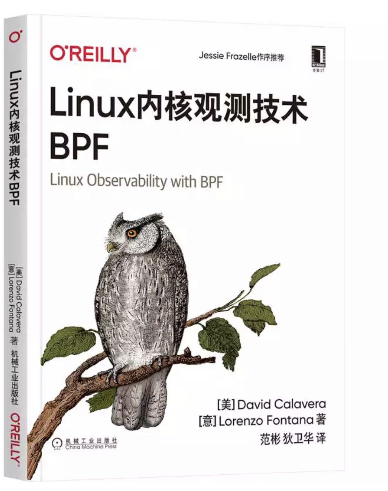
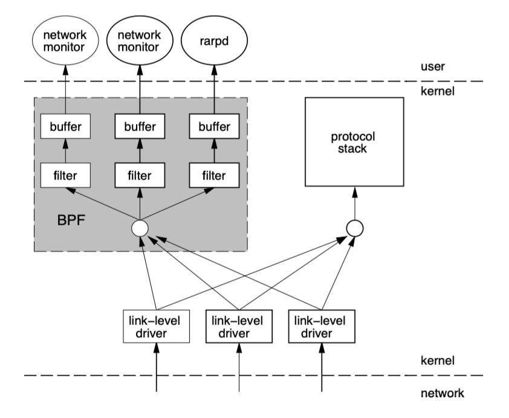
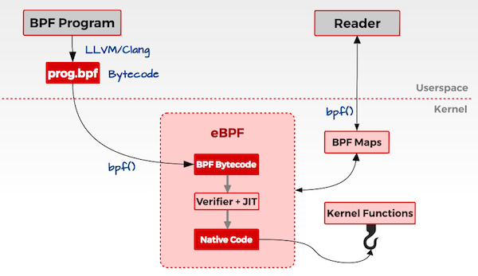
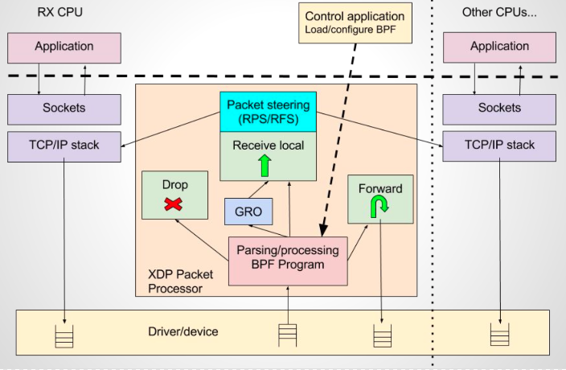
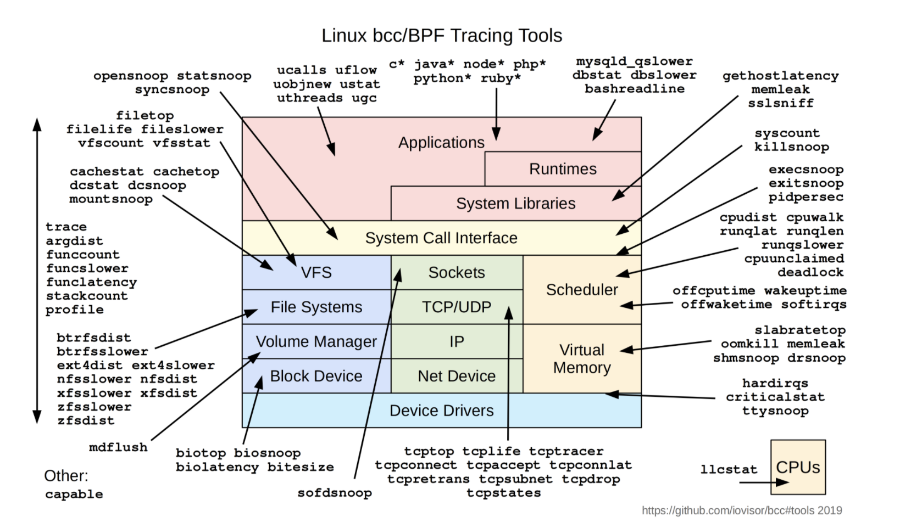
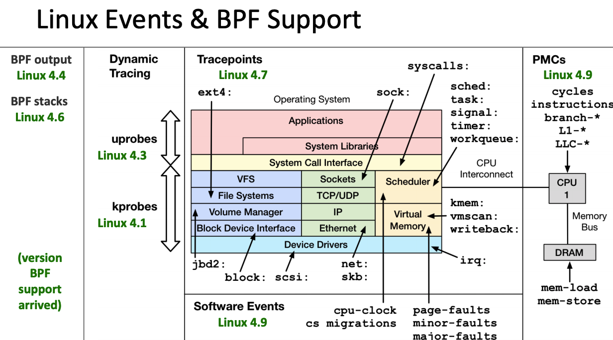
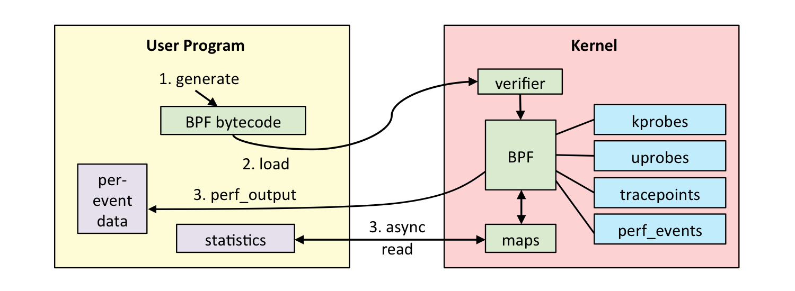
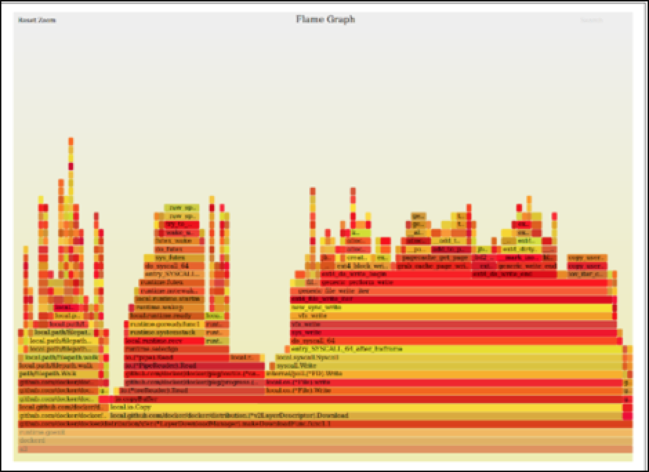
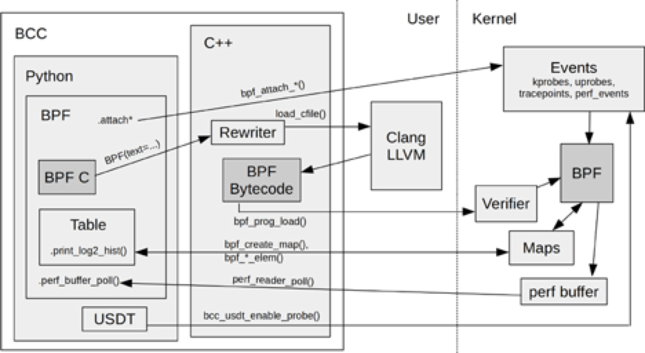

由范老师和我一起翻译的图书 《Linux内核观测技术BPF》 已经在 JD 上有现货，欢迎感兴趣 BPF 技术的同学选购。链接地址 [https://item.jd.com/72110825905.html](https://item.jd.com/72110825905.html)

“eBPF 是我见过的 Linux 中最神奇的技术，没有之一，已成为 Linux 内核中顶级子模块，从 tcpdump 中用作网络包过滤的经典 cbpf，到成为通用 Linux 内核技术的 eBPF，已经完成华丽蜕变，为应用与神奇的内核打造了一座桥梁，在系统跟踪、观测、性能调优、安全和网络等领域发挥重要的角色。为 Service Mesh 打造了具备 API 感知和安全高效的容器网络方案 Cilium，其底层正是基于 eBPF 技术”


## 1. BPF 

BPF（Berkeley Packet Filter ），中文翻译为伯克利包过滤器，是类 Unix 系统上数据链路层的一种原始接口，提供原始链路层封包的收发。1992 年，Steven McCanne 和 Van Jacobson 写了一篇名为《BSD数据包过滤：一种新的用户级包捕获架构》的论文。在文中，作者描述了他们如何在 Unix 内核实现网络数据包过滤，这种新的技术比当时最先进的数据包过滤技术快 20 倍。BPF 在数据包过滤上引入了两大革新：

* 一个新的虚拟机 (VM) 设计，可以有效地工作在基于寄存器结构的 CPU 之上；

* 应用程序使用缓存只复制与过滤数据包相关的数据，不会复制数据包的所有信息。这样可以最大程度地减少BPF 处理的数据；

由于这些巨大的改进，所有的 Unix 系统都选择采用 BPF 作为网络数据包过滤技术，直到今天，许多 Unix 内核的派生系统中（包括 Linux 内核）仍使用该实现。

tcpdump 的底层采用 BPF 作为底层包过滤技术，我们可以在命令后面增加 ”-d“ 来查看 tcpdump 过滤条件的底层汇编指令。

```bash
$ tcpdump -d 'ip and tcp port 8080'
(000) ldh      [12]
(001) jeq      #0x800           jt 2	jf 12
(002) ldb      [23]
(003) jeq      #0x6             jt 4	jf 12
(004) ldh      [20]
(005) jset     #0x1fff          jt 12	jf 6
(006) ldxb     4*([14]&0xf)
(007) ldh      [x + 14]
(008) jeq      #0x1f90          jt 11	jf 9
(009) ldh      [x + 16]
(010) jeq      #0x1f90          jt 11	jf 12
(011) ret      #262144
(012) ret      #0
```

图 1-1  tcpdump 底层汇编指令

BPF 工作在内核层，BPF 的架构图如下 [来自于bpf-usenix93]：



图 1-2 tcpdump 运行架构 

## 2. eBPF

### 2.1 eBPF 介绍

2014 年初，Alexei Starovoitov 实现了 eBPF（extended Berkeley Packet Filter）。经过重新设计，eBPF 演进为一个通用执行引擎，可基于此开发性能分析工具、软件定义网络等诸多场景。eBPF 最早出现在 3.18 内核中，此后原来的 BPF 就被称为经典 BPF，缩写 cBPF（classic BPF），cBPF 现在已经基本废弃。现在，Linux 内核只运行 eBPF，内核会将加载的 cBPF 字节码透明地转换成 eBPF 再执行。

eBPF 新的设计针对现代硬件进行了优化，所以 eBPF 生成的指令集比旧的 BPF 解释器生成的机器码执行得更快。扩展版本也增加了虚拟机中的寄存器数量，将原有的 2 个 32 位寄存器增加到 10 个 64 位寄存器。由于寄存器数量和宽度的增加，开发人员可以使用函数参数自由交换更多的信息，编写更复杂的程序。总之，这些改进使 eBPF 版本的速度比原来的 BPF 提高了 4 倍。

| 维度           | cBPF                      | eBPF                                                         |
| -------------- | ------------------------- | ------------------------------------------------------------ |
| 内核版本       | Linux 2.1.75（1997年）    | Linux 3.18（2014年）[4.x for kprobe/uprobe/tracepoint/perf-event] |
| 寄存器数目     | 2个：A, X                 | 10个： R0–R9, 另外 R10 是一个只读的帧指针                    |
| 寄存器宽度     | 32位                      | 64位                                                         |
| 存储           | 16 个内存位: M[0–15]      | 512 字节堆栈，无限制大小的 “map” 存储                        |
| 限制的内核调用 | 非常有限，仅限于 JIT 特定 | 有限，通过 bpf_call 指令调用                                 |
| 目标事件       | 数据包、 seccomp-BPF      | 数据包、内核函数、用户函数、跟踪点 PMCs 等                   |

表格 1-1 cBPF 与 eBPF 对比

> eBPF 在 Linux 3.18 版本以后引入，并不代表只能在内核 3.18+ 版本上运行，低版本的内核升级到最新也可以使用 eBPF 能力，只是可能部分功能受限，比如我就是在 Linux 发行版本 CentOS Linux release 7.7.1908 内核版本 3.10.0-1062.9.1.el7.x86_64 上运行 eBPF 在生产环境上搜集和排查网络问题。

eBPF 实现的最初目标是优化处理网络过滤器的内部 BPF 指令集。当时，BPF 程序仍然限于内核空间使用，只有少数用户空间程序可以编写内核处理的 BPF 过滤器，例如：tcpdump和 seccomp。时至今日，这些程序仍基于旧的 BPF 解释器生成字节码，但内核中会将这些指令转换为高性能的表示。                                 

2014 年 6 月，**eBPF 扩展到用户空间，这也成为了 BPF 技术的转折点**。 正如 Alexei 在提交补丁的注释中写到：“这个补丁展示了 eBPF 的潜力”。当前，eBPF 不再局限于网络栈，已经成为内核顶级的子系统。eBPF 程序架构强调安全性和稳定性，看上去更像内核模块，但与内核模块不同，eBPF 程序不需要重新编译内核，并且可以确保 eBPF 程序运行完成，而不会造成系统的崩溃。



图 2-1 BPF 架构图

简述概括， eBPF 是一套通用执行引擎，提供了可基于系统或程序事件高效安全执行特定代码的通用能力，通用能力的使用者不再局限于内核开发者；eBPF 可由执行字节码指令、存储对象和 Helper 帮助函数组成，字节码指令在内核执行前必须通过 BPF 验证器 Verfier 的验证，同时在启用 BPF JIT 模式的内核中，会直接将字节码指令转成内核可执行的本地指令运行。

同时，eBPF 也逐渐在观测（跟踪、性能调优等）、安全和网络等领域发挥重要的角色。Facebook、NetFlix 、CloudFlare 等知名互联网公司内部广泛采用基于 eBPF 技术的各种程序用于性能分析、排查问题、负载均衡、防范 DDoS 攻击，据相关信息显示在 Facebook 的机器上内置一系列 eBPF 的相关工具。

相对于系统的性能分析和观测，eBPF 技术在网络技术中的表现，更是让人眼前一亮，BPF 技术与 XDP（eXpress Data Path） 和 TC（Traffic Control） 组合可以实现功能更加强大的网络功能，更可为 SDN 软件定义网络提供基础支撑。XDP 只作用与网络包的 Ingress 层面，BPF 钩子位于**网络驱动中尽可能早的位置**，**无需进行原始包的复制**就可以实现最佳的数据包处理性能，挂载的 BPF 程序是运行过滤的理想选择，可用于丢弃恶意或非预期的流量、进行 DDOS 攻击保护等场景；而 TC Ingress 比 XDP 技术处于更高层次的位置，BPF 程序在 L3 层之前运行，可以访问到与数据包相关的大部分元数据，是本地节点处理的理想的地方，可以用于流量监控或者 L3/L4 的端点策略控制，同时配合 TC egress 则可实现对于容器环境下更高维度和级别的网络结构。



图 2-2 XDP 技术架构

eBPF 相关的知名的开源项目包括但不限于以下：

*  Facebook 高性能 4 层负载均衡器 [Katran](https://github.com/facebookincubator/katran)；
* [Cilium](https://cilium.io/) 为下一代微服务 ServiceMesh 打造了具备API感知和安全高效的容器网络方案；底层主要使用 XDP 和 TC 等相关技术；
*  IO Visor 项目开源的  [BCC](https://github.com/iovisor/bcc)、 [BPFTrace](https://github.com/iovisor/bpftrace) 和 [Kubectl-Trace](https://github.com/iovisor/kubectl-trace)：  [BCC](https://github.com/iovisor/bcc) 提供了更高阶的抽象，可以让用户采用 Python、C++ 和 Lua 等高级语言快速开发 BPF 程序；[BPFTrace](https://github.com/iovisor/bpftrace) 采用类似于 awk 语言快速编写 eBPF 程序；[Kubectl-Trace](https://github.com/iovisor/kubectl-trace) 则提供了在 kubernetes 集群中使用 BPF 程序调试的方便操作；
* CloudFlare 公司开源的 [eBPF Exporter](https://github.com/cloudflare/ebpf_exporter) 和 [bpf-tools](https://github.com/cloudflare/bpftools)：[eBPF Exporter](https://github.com/cloudflare/ebpf_exporter) 将 eBPF 技术与监控 Prometheus 紧密结合起来；[bpf-tools](https://github.com/cloudflare/bpftools) 可用于网络问题分析和排查；

越来越多的基于 eBPF 的项目如雨后脆笋一样开始蓬勃发展，而且逐步在社区中异军突起，成为一道风景线。比如 IO Visor 项目的 BCC 工具，为性能分析和观察提供了更加丰富的工具集：[图片来源](https://github.com/iovisor/bcc)



图 2-3 Linux bcc/BPF 观测工具

同时，IO Visor 的 [bpf-docs](https://github.com/iovisor/bpf-docs) 包含了日常的文档，可以用于学习。

>  由于 eBPF 还在快速发展期，内核中的功能也日趋增强，一般推荐基于Linux 4.4+ (4.9 以上会更好) 内核的来使用 eBPF。部分 Linux Event 和 BPF 版本支持见下图：
>
>  
>
>  图 2-4 Linux 事件和 BPF 版本支持

### 2.2 eBPF 架构（观测）

基于 Linux 系统的观测工具中，eBPF 有着得天独厚的优势，高效、生产安全且内核中内置，特别的可以在内核中完成数据分析聚合比如直方图，与将数据发送到用户空间分析聚合相比，能够节省大量的数据复制传递带来的 CPU 消耗。

eBPF 整体结构图如下：



图 2-5 eBPF 观测架构

eBPF 分为用户空间程序和内核程序两部分：

* 用户空间程序负责加载 BPF 字节码至内核，如需要也会负责读取内核回传的统计信息或者事件详情；
* 内核中的 BPF 字节码负责在内核中执行特定事件，如需要也会将执行的结果通过 maps 或者 perf-event 事件发送至用户空间；

其中用户空间程序与内核 BPF 字节码程序可以使用 map 结构实现双向通信，这为内核中运行的 BPF 字节码程序提供了更加灵活的控制。

用户空间程序与内核中的 BPF 字节码交互的流程主要如下：

1. 我们可以使用 LLVM 或者 GCC 工具将编写的 BPF 代码程序编译成 BPF 字节码；
2. 然后使用加载程序 Loader 将字节码加载至内核；内核使用验证器（verfier） 组件保证执行字节码的安全性，以避免对内核造成灾难，在确认字节码安全后将其加载对应的内核模块执行；BPF 观测技术相关的程序程序类型可能是 kprobes/uprobes/tracepoint/perf_events 中的一个或多个，其中：
   * **kprobes**：实现内核中动态跟踪。 kprobes 可以跟踪到 Linux 内核中的导出函数入口或返回点，但是不是稳定 ABI 接口，可能会因为内核版本变化导致，导致跟踪失效。
   * **uprobes**：用户级别的动态跟踪。与 kprobes 类似，只是跟踪用户程序中的函数。
   * **tracepoints**：内核中静态跟踪。tracepoints 是内核开发人员维护的跟踪点，能够提供稳定的 ABI 接口，但是由于是研发人员维护，数量和场景可能受限。
   * **perf_events**：定时采样和 PMC。
3. 内核中运行的 BPF 字节码程序可以使用两种方式将测量数据回传至用户空间
   * **maps** 方式可用于将内核中实现的统计摘要信息（比如测量延迟、堆栈信息）等回传至用户空间；
   * **perf-event** 用于将内核采集的事件实时发送至用户空间，用户空间程序实时读取分析；

> 如无特殊说明，本文中所说的 BPF 都是泛指 BPF 技术。

### 2.3 eBPF 的限制

eBPF 技术虽然强大，但是为了保证内核的处理安全和及时响应，内核中的 eBPF 技术也给予了诸多限制，当然随着技术的发展和演进，限制也在逐步放宽或者提供了对应的解决方案。

* eBPF 程序不能调用任意的内核参数，只限于内核模块中列出的 BPF Helper 函数，函数支持列表也随着内核的演进在不断增加。

* eBPF 程序不允许包含无法到达的指令，防止加载无效代码，延迟程序的终止。

* eBPF 程序中循环次数限制且必须在有限时间内结束，这主要是用来防止在 kprobes 中插入任意的循环，导致锁住整个系统；解决办法包括展开循环，并为需要循环的常见用途添加辅助函数。Linux 5.3 在 BPF 中包含了对有界循环的支持，它有一个可验证的运行时间上限。

* eBPF 堆栈大小被限制在 MAX_BPF_STACK，截止到内核 Linux 5.8 版本，被设置为 512；参见 [include/linux/filter.h](https://github.com/torvalds/linux/blob/v5.8/include/linux/filter.h)，这个限制特别是在栈上存储多个字符串缓冲区时：一个char[256]缓冲区会消耗这个栈的一半。目前没有计划增加这个限制，解决方法是改用 bpf 映射存储，它实际上是无限的。

  ```c
  /* BPF program can access up to 512 bytes of stack space. */
  #define MAX_BPF_STACK	512
  ```

* eBPF 字节码大小最初被限制为 4096 条指令，截止到内核 Linux 5.8 版本， 当前已将放宽至 100 万指令（ BPF_COMPLEXITY_LIMIT_INSNS），参见：[include/linux/bpf.h](https://github.com/torvalds/linux/blob/v5.8/include/linux/bpf.h)，对于无权限的BPF程序，仍然保留 4096 条限制 ( BPF_MAXINSNS )；新版本的 eBPF 也支持了多个 eBPF 程序级联调用，虽然传递信息存在某些限制，但是可以通过组合实现更加强大的功能。

  ```c
  #define BPF_COMPLEXITY_LIMIT_INSNS      1000000 /* yes. 1M insns */
  ```


### 2.4 eBPF 与内核模块对比

在 Linux 观测方面，eBPF 总是会拿来与 kernel 模块方式进行对比，eBPF 在安全性、入门门槛上比内核模块都有优势，这两点在观测场景下对于用户来讲尤其重要。

| 维度                | Linux 内核模块                       | eBPF                                           |
| ------------------- | ------------------------------------ | ---------------------------------------------- |
| kprobes/tracepoints | 支持                                 | 支持                                           |
| **安全性**          | 可能引入安全漏洞或导致内核 Panic     | 通过验证器进行检查，可以保障内核安全           |
| 内核函数            | 可以调用内核函数                     | 只能通过 BPF Helper 函数调用                   |
| 编译性              | 需要编译内核                         | 不需要编译内核，引入头文件即可                 |
| 运行                | 基于相同内核运行                     | 基于稳定 ABI 的 BPF 程序可以编译一次，各处运行 |
| 与应用程序交互      | 打印日志或文件                       | 通过 perf_event 或 map 结构                    |
| 数据结构丰富性      | 一般                                 | 丰富                                           |
| **入门门槛**        | 高                                   | 低                                             |
| **升级**            | 需要卸载和加载，可能导致处理流程中断 | 原子替换升级，不会造成处理流程中断             |
| 内核内置            | 视情况而定                           | 内核内置支持                                   |

表格 2-1 eBPF 与 Linux 内核模块方式对比

## 3. 应用案例

大名鼎鼎的性能分析大师 Brendan Gregg 等编写了诸多的 BCC 或 BPFTrace 的工具集可以拿来直接使用，完全可以满足我们日常问题分析和排查。

BCC 在 CentOS 7 系统中可以通过 yum 快速安装

```bash
# yum install bcc -y
Resolving Dependencies
--> Running transaction check
---> Package bcc.x86_64 0:0.8.0-1.el7 will be updated
--> Processing Dependency: bcc(x86-64) = 0.8.0-1.el7 for package: python-bcc-0.8.0-1.el7.x86_64
---> Package bcc.x86_64 0:0.10.0-1.el7 will be an update
--> Processing Dependency: bcc-tools = 0.10.0-1.el7 for package: bcc-0.10.0-1.el7.x86_64
--> Running transaction check
---> Package bcc-tools.x86_64 0:0.8.0-1.el7 will be updated
---> Package bcc-tools.x86_64 0:0.10.0-1.el7 will be an update
---> Package python-bcc.x86_64 0:0.8.0-1.el7 will be updated
---> Package python-bcc.x86_64 0:0.10.0-1.el7 will be an update
--> Finished Dependency Resolution
...
```

其他系统的安装方式参见：[INSTALL.md](https://github.com/iovisor/bcc/blob/master/INSTALL.md)

BCC 中每一个工具都有一个对应的使用样例，比如 [execsnoop.py](https://github.com/iovisor/bcc/blob/master/tools/execsnoop.py) 和 [execsnoop_example.txt](https://github.com/iovisor/bcc/blob/master/tools/execsnoop_example.txt)，在使用样例中有详细的使用说明，而且 BCC 中的工具使用的帮助文档格式基本类似，上手非常方便。

> BCC 的程序一般情况下都需要 root 用户来运行。

### 3.1 Linux 性能分析 60 秒 （BPF版本）

英文原文 [Linux Performance Analysis in 60,000 Milliseconds](https://netflixtechblog.com/linux-performance-analysis-in-60-000-milliseconds-accc10403c55)，[视频地址](http://www.brendangregg.com/blog/2015-12-03/linux-perf-60s-video.html) 

```bash
uptime
dmesg | tail
vmstat 1
mpstat -P ALL 1
pidstat 1
iostat -xz 1
free -m
sar -n DEV 1
sar -n TCP,ETCP 1
top
```

**60s 系列 BPF 版本如下：**


图 3-1 60s 排查之 BPF 版本

对于在系统中运行的 "闪电侠" 程序，运行周期非常短，但是可能会带来系统的抖动延时，我们采用 `top` 命令查看一般情况下难以发现，我们可以使用 BCC 提供的工具 `execsnoop ` 来进行排查：

```bash
# Trace file opens with process and filename: opensnoop
#/usr/share/bcc/tools/execsnoop 
PCOMM            PID    PPID   RET ARGS
sleep            3334   21029    0 /usr/bin/sleep 3
sleep            3339   21029    0 /usr/bin/sleep 3
conntrack        3341   1112     0 /usr/sbin/conntrack --stats
conntrack        3342   1112     0 /usr/sbin/conntrack --count
sleep            3344   21029    0 /usr/bin/sleep 3
iptables-save    3347   9211     0 /sbin/iptables-save -t filter
iptables-save    3348   9211     0 /sbin/iptables-save -t nat
```

### 3.2 **slab dentry 过大导致的网络抖动排查**

**现象**

网络 ping 的延时间歇性有规律出现抖动

**问题排查**

采用 `execsnoop`  分析发现，某个运行命令`cat /proc/slabinfo`的运行时间间隔与抖动的频率完全吻合，顺着这个的线索定位，我们发现云厂商提供的 Java 版本的云监控会定期调用 `cat /proc/slabinfo` 来获取内核缓存的信息；

通过命令 `slabtop` 发现系统中的 `dentry` 项的内存占用非常大，系统内存 128G，`dentry` 占用 70G 以上，所以问题很快就定位到是系统在打开文件方面可能有相关问题；

**根因分析**

我们使用对于打开文件跟踪的 BCC 工具 `opensnoop` 很快就定位到是某个程序频繁创建和删除临时文件，最终定位为某个 PHP 程序设置的调用方式存在问题，导致每次请求会创建和删除临时文件；代码中将 http 调用中的 `contentType` 设置成了 `Http::CONTENT_TYPE_UPLOAD`，导致每次请求都会生成临时文件，修改成 `application/x-www-form-urlencoded` 问题解决。

问题的原理可参考 [记一次对网络抖动经典案例的分析](https://developer.aliyun.com/article/697773) 和 [systemtap脚本分析系统中dentry SLAB占用过高问题](https://yq.aliyun.com/articles/131870)

### 3.3 生成火焰图

火焰图是帮助我们对系统耗时进行可视化的图表，能够对程序中那些代码经常被执行给出一个清晰的展现。Brendan Gregg 是火焰图的创建者，他在 [GitHub](https://github.com/brendangregg/FlameGraph) 上维护了一组脚本可以轻松生成需要的可视化格式数据。使用 BCC 中的工具 `profile` 可很方面地收集道 CPU 路径的数据，基于数据采用工具可以轻松地生成火焰图，查找到程序的性能瓶颈。

> 使用 `profile` 搜集火焰图的程序没有任何限制和改造

`profile` 工具可以让我们轻松对于系统或者程序的 CPU 性能路径进行可视化分析：

```
/usr/share/bcc/tools/profile -h
usage: profile [-h] [-p PID | -L TID] [-U | -K] [-F FREQUENCY | -c COUNT] [-d]
               [-a] [-I] [-f] [--stack-storage-size STACK_STORAGE_SIZE]
               [-C CPU]
               [duration]

Profile CPU stack traces at a timed interval

positional arguments:
  duration              duration of trace, in seconds

optional arguments:
  -h, --help            show this help message and exit
  -p PID, --pid PID     profile process with this PID only
  -L TID, --tid TID     profile thread with this TID only
  -U, --user-stacks-only
                        show stacks from user space only (no kernel space
                        stacks)
  -K, --kernel-stacks-only
                        show stacks from kernel space only (no user space
                        stacks)
  -F FREQUENCY, --frequency FREQUENCY
                        sample frequency, Hertz
  -c COUNT, --count COUNT
                        sample period, number of events
  -d, --delimited       insert delimiter between kernel/user stacks
  -a, --annotations     add _[k] annotations to kernel frames
  -I, --include-idle    include CPU idle stacks
  -f, --folded          output folded format, one line per stack (for flame
                        graphs)
  --stack-storage-size STACK_STORAGE_SIZE
                        the number of unique stack traces that can be stored
                        and displayed (default 16384)
  -C CPU, --cpu CPU     cpu number to run profile on

examples:
    ./profile             # profile stack traces at 49 Hertz until Ctrl-C
    ./profile -F 99       # profile stack traces at 99 Hertz
    ./profile -c 1000000  # profile stack traces every 1 in a million events
    ./profile 5           # profile at 49 Hertz for 5 seconds only
    ./profile -f 5        # output in folded format for flame graphs
    ./profile -p 185      # only profile process with PID 185
    ./profile -L 185      # only profile thread with TID 185
    ./profile -U          # only show user space stacks (no kernel)
    ./profile -K          # only show kernel space stacks (no user)
```

`profile`  配合 `FlameGraph` 可以轻松帮我们绘制出 CPU 使用的火焰图。

```bash
$ profile -af 30 > out.stacks01
$ git clone https://github.com/brendangregg/FlameGraph
$ cd FlameGraph
$ ./flamegraph.pl --color=java < ../out.stacks01 > out.svg
```


图 3-2 火焰图

### 3.3 排查网络调用来源

在生产场景下，会有些特定场景需要抓取连接到外网特定地址的程序，这时候我们可以采用 BCC 工具集中的 `tcplife` 来定位。

```
/usr/share/bcc/tools/tcplife -h
usage: tcplife [-h] [-T] [-t] [-w] [-s] [-p PID] [-L LOCALPORT]
               [-D REMOTEPORT]

Trace the lifespan of TCP sessions and summarize

optional arguments:
  -h, --help            show this help message and exit
  -T, --time            include time column on output (HH:MM:SS)
  -t, --timestamp       include timestamp on output (seconds)
  -w, --wide            wide column output (fits IPv6 addresses)
  -s, --csv             comma separated values output
  -p PID, --pid PID     trace this PID only
  -L LOCALPORT, --localport LOCALPORT
                        comma-separated list of local ports to trace.
  -D REMOTEPORT, --remoteport REMOTEPORT
                        comma-separated list of remote ports to trace.

examples:
    ./tcplife           # trace all TCP connect()s
    ./tcplife -t        # include time column (HH:MM:SS)
    ./tcplife -w        # wider colums (fit IPv6)
    ./tcplife -stT      # csv output, with times & timestamps
    ./tcplife -p 181    # only trace PID 181
    ./tcplife -L 80     # only trace local port 80
    ./tcplife -L 80,81  # only trace local ports 80 and 81
    ./tcplife -D 80     # only trace remote port 80
```


通过在机器上使用 `tcplife` 来获取的网络连接信息，我们可以看到包括了 PID、COMM、本地 IP 地址、本地端口、远程 IP 地址和远程端口，通过这些信息非常方便排查到连接到特定 IP 地址的程序，尤其是连接的过程非常短暂，通过 `netstat` 等其他工具不容易排查的场景。

```bash
# /usr/share/bcc/tools/tcplife
PID   COMM             IP LADDR                      LPORT RADDR                  RPORT  TX_KB  RX_KB MS
1776  blackbox_export  4  169.254.20.10              35830 169.254.20.10          53       0      0 0.36
27150 node-cache       4  169.254.20.10              53    169.254.20.10          35830    0      0 0.36
12511 coredns          4  127.0.0.1                  58492 127.0.0.1              8080     0      0 0.32
...
```

如果我们想知道更加详细的 TCP 状态情况，那么 `tcptracer` 可展示更加详细的 TCP 状态，其中 C 代表 Connect X 表示关闭， A 代表 Accept。

```bash
# /usr/share/bcc/tools/tcptracer 
Tracing TCP established connections. Ctrl-C to end.
T  PID    COMM             IP SADDR            DADDR            SPORT  DPORT
C  21066  ilogtail         4  10.81.128.12     100.100.49.128   40906  80
X  21066  ilogtail         4  10.81.128.12     100.100.49.128   40906  80
C  21066  ilogtail         4  10.81.128.12     100.100.49.128   40908  80
X  21066  ilogtail         4  10.81.128.12     100.100.49.128   40908  80
```

`tcpstates` 还能够展示出来 TCP 状态机的流转情况：

```bash
# /usr/share/bcc/tools/tcpstates
SKADDR           C-PID C-COMM     LADDR           LPORT RADDR           RPORT OLDSTATE    -> NEWSTATE    MS
ffff9fd7e8192000 22384 curl       100.66.100.185  0     52.33.159.26    80    CLOSE       -> SYN_SENT    0.000
ffff9fd7e8192000 0     swapper/5  100.66.100.185  63446 52.33.159.26    80    SYN_SENT    -> ESTABLISHED 1.373
ffff9fd7e8192000 22384 curl       100.66.100.185  63446 52.33.159.26    80    ESTABLISHED -> FIN_WAIT1   176.042
```

同样，我们也可以实时获取到 TCP 连接超时或者重连的网络连接；也可以通过抓取 UDP包相关的连接信息，用于定位诸如 DNS 请求超时或者 DNS 请求的发起进程。

## 4. 编写 BPF 程序

对于大多数开发者而言，更多的是基于 BPF 技术之上编写解决我们日常遇到的各种问题，当前 BCC 和 BPFTrace 两个项目在观测和性能分析上已经有了诸多灵活且功能强大的工具箱，完全可以满足我们日常使用。

*  [BCC](https://github.com/iovisor/bcc) 提供了更高阶的抽象，可以让用户采用 Python、C++ 和 Lua 等高级语言快速开发 BPF 程序；
*  [BPFTrace](https://github.com/iovisor/bpftrace) 采用类似于 awk 语言快速编写 eBPF 程序；

更早期的工具则是使用 C 语言来编写 BPF 程序，使用 LLVM clang 编译成 BPF 代码，这对于普通使用者上手有不少门槛当前仅限于对于 eBPF 技术更加深入的学习场景。

### 4.1 BCC 版本 HelloWorld



图 4-1 BCC 整体架构

使用 BCC 前端绑定语言 Python 编写的 Hello World 版本：

```
#!/usr/bin/python3

from bcc import BPF

# This may not work for 4.17 on x64, you need replace kprobe__sys_clone with kprobe____x64_sys_clone
prog = """
	int kprobe__sys_clone(void *ctx) {
		bpf_trace_printk("Hello, World!\\n");
		return 0;
	}
"""

b = BPF(text=prog, debug=0x04)
b.trace_print()
```

运行程序前需要安装过 bcc 相关工具包，当运行正常的时候我们发现每当 `sys_clone` 系统调用时，运行的控制台上就会打印 “Hello, World!”，在打印文字前面还包含了调用程序的进程名称，进程 ID 等信息；

> 如果运行报错，可能是缺少头文件，一般安装 kernel-devel 包即可。

```
# python ./hello.py
         kubelet-8349  [006] d... 33637334.829981: : Hello, World!
         kubelet-8349  [006] d... 33637334.838594: : Hello, World!
         kubelet-8349  [006] d... 33637334.843788: : Hello, World!
```


### 4.3 BPFTrace 

BPFTrace 是基于 BPF 和 BCC 的开源项目，与 BCC 不同的是其提供了更高层次的抽象，可以使用类似 AWK 脚本语言来编写基于 BPF 的跟踪或者性能排查工具，更加易于入门和编写，该工具的主要灵感来自于 Solaris 的 D 语言。BPFTrace 更方便与编写单行的程序。BPFTrace 与 BCC 一样也是 IO Visor 组织下的项目，仓库参见 [bpftrace](https://github.com/iovisor/bpftrace)。更加深入的学习资料参见：[Reference Guide](https://github.com/iovisor/bpftrace/blob/master/docs/reference_guide.md) 和 [One-Liner Tutorial](https://github.com/iovisor/bpftrace/blob/master/docs/tutorial_one_liners.md)。

BPFTrace 使用 LLVM 将脚本编译成 BPF 二进制码，后续使用 BCC 与 Linux 内核进行交互。从功能层面上讲，BPFTrace 的定制性和灵活性不如 BCC，但是比 BCC 工具更加易于理解和使用，降低了 BPF 技术的使用门槛。

使用样例：

```bash
# 统计进程调用 sys_enter 的次数
#bpftrace -e 'tracepoint:raw_syscalls:sys_enter { @[comm] = count(); }'
Attaching 1 probe...
^C

@[bpftrace]: 6
@[systemd]: 24
@[snmp-pass]: 96
@[sshd]: 125

# 统计内核中函数堆栈的次数
# bpftrace -e 'profile:hz:99 { @[kstack] = count(); }'
Attaching 1 probe...
^C

[...]
@[
filemap_map_pages+181
__handle_mm_fault+2905
handle_mm_fault+250
__do_page_fault+599
async_page_fault+69
]: 12
[...]
@[
cpuidle_enter_state+164
do_idle+390
cpu_startup_entry+111
start_secondary+423
secondary_startup_64+165
]: 22122
```

### 4.3 C 语言原生方式

采用 LLVM Clang 的方式编译会涉及到内核编译环境搭建，而且还需要自己编译 Makefile 等操作，属于高级用户使用：

bpf_program.c

```c
#include <linux/bpf.h>
#define SEC(NAME) __attribute__((section(NAME), used))

static int (*bpf_trace_printk)(const char *fmt, int fmt_size,
                               ...) = (void *)BPF_FUNC_trace_printk;

SEC("tracepoint/syscalls/sys_enter_execve")
int bpf_prog(void *ctx) {
  char msg[] = "Hello, BPF World!";
  bpf_trace_printk(msg, sizeof(msg));
  return 0;
}

char _license[] SEC("license") = "GPL";
```

loader.c

```c
#include "bpf_load.h"
#include <stdio.h>

int main(int argc, char **argv) {
  if (load_bpf_file("bpf_program.o") != 0) {
    printf("The kernel didn't load the BPF program\n");
    return -1;
  }

  read_trace_pipe();

  return 0;
}
```

Makefile 文件（部分）

```bash
build: ${BPFCODE.c} ${BPFLOADER}
	$(CLANG) -O2 -target bpf -c $(BPFCODE:=.c) $(CCINCLUDE) -o ${BPFCODE:=.o}
```

其中 clang 编译中的选型 `-target bpf` 表明我们将代码编译成 bpf 的字节码。

完整的程序参见：[hello_world](https://github.com/DavadDi/linux-observability-with-bpf/tree/master/code/chapter-2/hello_world)；更多的样例代码可以参见对应内核中 `kernel-src/samples/bpf/` 下的样例代码。

>  后续会持续进行 BPF 相关的内容总结和分享，Github [bpf_study](https://github.com/DavadDi/bpf_study) 仓库，欢迎提交 PR 和 Star

## 5. 参考资料

1. [The BSD Packet Filter: A New Architecture for User-level Packet Capture](https://www.tcpdump.org/papers/bpf-usenix93.pdf)

2. [[译] Cilium：BPF 和 XDP 参考指南（2019） ](http://arthurchiao.art/blog/cilium-bpf-xdp-reference-guide-zh/)   [Cillum BPF and XDP Reference Guide](https://docs.cilium.io/en/v1.8/bpf/)

3. [Cloudflare架构以及BPF如何占据世界](https://blog.cloudflare.com/zh/cloudflare-architecture-and-how-bpf-eats-the-world-zh/)

4. [關於 BPF 和 eBPF 的筆記](https://www.luoow.com/dc_tw/106805603)

5. [Dive into BPF: a list of reading material](https://qmonnet.github.io/whirl-offload/2016/09/01/dive-into-bpf/)  [中文](https://blog.csdn.net/F8qG7f9YD02Pe/article/details/79815702)

6. [eBPF 简史](https://www.ibm.com/developerworks/cn/linux/l-lo-eBPF-history/index.html)

7. https://www.youtube.com/watch?v=znBGt7oHJyQ

8. [BPF Documentation](https://www.infradead.org/~mchehab/kernel_docs/bpf/index.html)  [HOWTO interact with BPF subsystem](https://www.kernel.org/doc/html/latest/bpf/bpf_devel_QA.html#q-how-do-i-indicate-which-tree-bpf-vs-bpf-next-my-patch-should-be-applied-to)

9. [Linux 内核 BPF 文档](https://www.infradead.org/~mchehab/kernel_docs/bpf/index.html)

10. [Linux Extended BPF (eBPF) Tracing Tools](http://www.brendangregg.com/ebpf.html)  Brendan Gregg

11. [性能提升40%: 腾讯 TKE 用 eBPF绕过 conntrack 优化K8s Service](https://mp.weixin.qq.com/s/3BQU9AYh1ScZ_1V17BJ4wg)

12. [SDN handbook](https://tonydeng.github.io/sdn-handbook/)

13. Linux BPF 帮助文档 [bpf(2)](https://man7.org/linux/man-pages/man2/bpf.2.html)  [bpf-helpers(7)](https://man7.org/linux/man-pages/man7/bpf-helpers.7.html)  [tc-bpf(8)](https://man7.org/linux/man-pages/man8/tc-bpf.8.html) 
