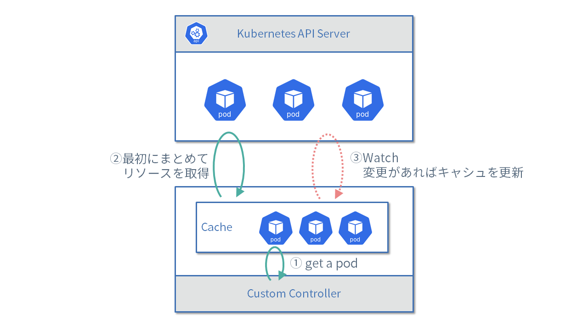
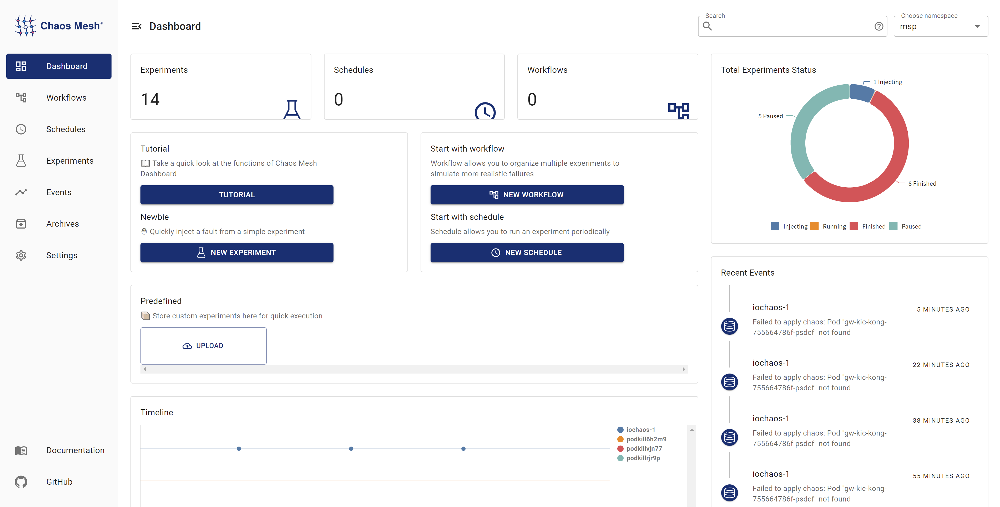

Chaos Mesh 是由 TiDB 背后的 PingCAP 公司开发，运行在 Kubernetes 上的混沌工程（Chaos Engineering）系统。简而言之，Chaos Mesh 通过运行在 K8s 集群中的“特权”容器，依据 CRD 资源中的测试场景，在集群中制造浑沌（模拟故障）[^1]。


本文探索混沌工程在 Kubernetes 集群上的实践，基于源码分析了解 Chaos Mesh 的工作原理，以代码示例阐述如何开发 Chaos Mesh 的控制平面。
如果你缺乏基础知识，要想对 Chaos Mesh 的架构有宏观上的认识，请参阅文末尾注中的链接。

本文试验代码位于 [mayocream/chaos-mesh-controlpanel-demo](https://github.com/mayocream/chaos-mesh-controlpanel-demo) 仓库。

## 怎么捣乱？

### 特权

上面提到 Chaos Mesh 运行 Kubernetes 特权容器来制造故障。Daemon Set 方式运行的 Pod 授权了容器运行时的[权能字（Capabilities）](https://kubernetes.io/zh/docs/concepts/policy/pod-security-policy/#capabilities)。

```yaml
apiVersion: apps/v1
kind: DaemonSet
spec:
  template:
    metadata: ...
    spec:
      containers:
        - name: chaos-daemon
          securityContext:
            {{- if .Values.chaosDaemon.privileged }}
            privileged: true
            capabilities:
              add:
                - SYS_PTRACE
            {{- else }}
            capabilities:
              add:
                - SYS_PTRACE
                - NET_ADMIN
                - MKNOD
                - SYS_CHROOT
                - SYS_ADMIN
                - KILL
                # CAP_IPC_LOCK is used to lock memory
                - IPC_LOCK
            {{- end }}
```

这些 Linux 权能字用于授予容器特权，以创建和访问 `/dev/fuse` FUSE 管道[^2]（FUSE 是 Linux 用户空间文件系统接口，它使无特权的用户能够无需编辑内核代码而创建自己的文件系统）。

参阅 [#1109](https://github.com/chaos-mesh/chaos-mesh/pull/1109) Pull Request，Daemon Set 程序使用 CGO 调用 Linux `makedev` 函数创建 FUSE 管道。

```go
// #include <sys/sysmacros.h>
// #include <sys/types.h>
// // makedev is a macro, so a wrapper is needed
// dev_t Makedev(unsigned int maj, unsigned int min) {
//   return makedev(maj, min);
// }

// EnsureFuseDev ensures /dev/fuse exists. If not, it will create one
func EnsureFuseDev() {
	if _, err := os.Open("/dev/fuse"); os.IsNotExist(err) {
		// 10, 229 according to https://www.kernel.org/doc/Documentation/admin-guide/devices.txt
		fuse := C.Makedev(10, 229)
		syscall.Mknod("/dev/fuse", 0o666|syscall.S_IFCHR, int(fuse))
	}
}
```

同时在 [#1103](https://github.com/chaos-mesh/chaos-mesh/pull/1453) PR 中，Chaos Daemon 默认启用特权模式，即容器的 `securityContext` 中设置 `privileged: true`。


### 杀死 Pod

PodKill、PodFailure、ContainerKill 都归属于 PodChaos 类别下，PodKill 是随机杀死 Pod。

PodKill 的具体实现其实是通过调用 API Server 发送 Kill 命令。

```go
import (
	"context"

	v1 "k8s.io/api/core/v1"
	"sigs.k8s.io/controller-runtime/pkg/client"
)

type Impl struct {
	client.Client
}

func (impl *Impl) Apply(ctx context.Context, index int, records []*v1alpha1.Record, obj v1alpha1.InnerObject) (v1alpha1.Phase, error) {
	...
	err = impl.Get(ctx, namespacedName, &pod)
	if err != nil {
		// TODO: handle this error
		return v1alpha1.NotInjected, err
	}

	err = impl.Delete(ctx, &pod, &client.DeleteOptions{
		GracePeriodSeconds: &podchaos.Spec.GracePeriod, // PeriodSeconds has to be set specifically
	})
	...
	return v1alpha1.Injected, nil
}
```

 `GracePeriodSeconds` 参数适用于 K8s [强制终止 Pod](https://kubernetes.io/zh/docs/concepts/workloads/pods/pod-lifecycle/#pod-termination-forced)。例如在需要快速删除 Pod 时，我们使用 `kubectl delete pod --grace-period=0 --force` 命令。


PodFailure 是通过 Patch Pod 对象资源，用错误的镜像替换 Pod 中的镜像。Chaos 只修改了 `containers` 和 `initContainers` 的 `image` 字段，这也是因为 Pod 大部分字段是无法更改的，详情可以参阅 [Pod 更新与替换](https://kubernetes.io/zh/docs/concepts/workloads/pods/#pod-update-and-replacement)。

```go
func (impl *Impl) Apply(ctx context.Context, index int, records []*v1alpha1.Record, obj v1alpha1.InnerObject) (v1alpha1.Phase, error) {
	...
	pod := origin.DeepCopy()
	for index := range pod.Spec.Containers {
		originImage := pod.Spec.Containers[index].Image
		name := pod.Spec.Containers[index].Name

		key := annotation.GenKeyForImage(podchaos, name, false)
		if pod.Annotations == nil {
			pod.Annotations = make(map[string]string)
		}

		// If the annotation is already existed, we could skip the reconcile for this container
		if _, ok := pod.Annotations[key]; ok {
			continue
		}
		pod.Annotations[key] = originImage
		pod.Spec.Containers[index].Image = config.ControllerCfg.PodFailurePauseImage
	}

	for index := range pod.Spec.InitContainers {
		originImage := pod.Spec.InitContainers[index].Image
		name := pod.Spec.InitContainers[index].Name

		key := annotation.GenKeyForImage(podchaos, name, true)
		if pod.Annotations == nil {
			pod.Annotations = make(map[string]string)
		}

		// If the annotation is already existed, we could skip the reconcile for this container
		if _, ok := pod.Annotations[key]; ok {
			continue
		}
		pod.Annotations[key] = originImage
		pod.Spec.InitContainers[index].Image = config.ControllerCfg.PodFailurePauseImage
	}

	err = impl.Patch(ctx, pod, client.MergeFrom(&origin))
	if err != nil {
		// TODO: handle this error
		return v1alpha1.NotInjected, err
	}

	return v1alpha1.Injected, nil
}
```

默认用于引发故障的容器镜像是 `gcr.io/google-containers/pause:latest`， 如果在国内环境使用，大概率会水土不服，可以将 `gcr.io` 替换为 `registry.aliyuncs.com`。


ContainerKill 不同于 PodKill 和 PodFailure，后两个都是通过 K8s API Server 控制 Pod 生命周期，而 ContainerKill 是通过运行在集群 Node 上的 Chaos Daemon 程序操作完成。具体来说，ContainerKill 通过 Chaos Controller Manager 运行客户端向 Chaos Daemon 发起 grpc 调用。

```go
func (b *ChaosDaemonClientBuilder) Build(ctx context.Context, pod *v1.Pod) (chaosdaemonclient.ChaosDaemonClientInterface, error) {
	...
	daemonIP, err := b.FindDaemonIP(ctx, pod)
	if err != nil {
		return nil, err
	}
	builder := grpcUtils.Builder(daemonIP, config.ControllerCfg.ChaosDaemonPort).WithDefaultTimeout()
	if config.ControllerCfg.TLSConfig.ChaosMeshCACert != "" {
		builder.TLSFromFile(config.ControllerCfg.TLSConfig.ChaosMeshCACert, config.ControllerCfg.TLSConfig.ChaosDaemonClientCert, config.ControllerCfg.TLSConfig.ChaosDaemonClientKey)
	} else {
		builder.Insecure()
	}
	cc, err := builder.Build()
	if err != nil {
		return nil, err
	}
	return chaosdaemonclient.New(cc), nil
}

```

向 Chaos Daemon 发送命令时会依据 Pod 信息创建对应的客户端，例如要控制某个 Node 上的 Pod，会获取该 Pod 所在 Node 的 ClusterIP，以创建客户端。如果 TLS 证书配置存在，Controller Manager 会为客户端添加 TLS 证书。

Chaos Daemon 在启动时如果有 TLS 证书，会附加证书以启用 grpcs。TLS 校验配置 `RequireAndVerifyClientCert` 表示启用双向 TLS 认证（mTLS）。 

```go
func newGRPCServer(containerRuntime string, reg prometheus.Registerer, tlsConf tlsConfig) (*grpc.Server, error) {
	...
	if tlsConf != (tlsConfig{}) {
		caCert, err := ioutil.ReadFile(tlsConf.CaCert)
		if err != nil {
			return nil, err
		}
		caCertPool := x509.NewCertPool()
		caCertPool.AppendCertsFromPEM(caCert)

		serverCert, err := tls.LoadX509KeyPair(tlsConf.Cert, tlsConf.Key)
		if err != nil {
			return nil, err
		}

		creds := credentials.NewTLS(&tls.Config{
			Certificates: []tls.Certificate{serverCert},
			ClientCAs:    caCertPool,
			ClientAuth:   tls.RequireAndVerifyClientCert,
		})

		grpcOpts = append(grpcOpts, grpc.Creds(creds))
	}

	s := grpc.NewServer(grpcOpts...)
	grpcMetrics.InitializeMetrics(s)

	pb.RegisterChaosDaemonServer(s, ds)
	reflection.Register(s)

	return s, nil
}
```

Chaos Daemon 提供了以下 grpc 调用接口：

```go
// ChaosDaemonClient is the client API for ChaosDaemon service.
//
// For semantics around ctx use and closing/ending streaming RPCs, please refer to https://godoc.org/google.golang.org/grpc#ClientConn.NewStream.
type ChaosDaemonClient interface {
	SetTcs(ctx context.Context, in *TcsRequest, opts ...grpc.CallOption) (*empty.Empty, error)
	FlushIPSets(ctx context.Context, in *IPSetsRequest, opts ...grpc.CallOption) (*empty.Empty, error)
	SetIptablesChains(ctx context.Context, in *IptablesChainsRequest, opts ...grpc.CallOption) (*empty.Empty, error)
	SetTimeOffset(ctx context.Context, in *TimeRequest, opts ...grpc.CallOption) (*empty.Empty, error)
	RecoverTimeOffset(ctx context.Context, in *TimeRequest, opts ...grpc.CallOption) (*empty.Empty, error)
	ContainerKill(ctx context.Context, in *ContainerRequest, opts ...grpc.CallOption) (*empty.Empty, error)
	ContainerGetPid(ctx context.Context, in *ContainerRequest, opts ...grpc.CallOption) (*ContainerResponse, error)
	ExecStressors(ctx context.Context, in *ExecStressRequest, opts ...grpc.CallOption) (*ExecStressResponse, error)
	CancelStressors(ctx context.Context, in *CancelStressRequest, opts ...grpc.CallOption) (*empty.Empty, error)
	ApplyIOChaos(ctx context.Context, in *ApplyIOChaosRequest, opts ...grpc.CallOption) (*ApplyIOChaosResponse, error)
	ApplyHttpChaos(ctx context.Context, in *ApplyHttpChaosRequest, opts ...grpc.CallOption) (*ApplyHttpChaosResponse, error)
	SetDNSServer(ctx context.Context, in *SetDNSServerRequest, opts ...grpc.CallOption) (*empty.Empty, error)
}
```


### 网络故障

从最初的 [#41](https://github.com/chaos-mesh/chaos-mesh/pull/41) PR 中，可以清晰地了解到，Chaos Mesh 的网络错误注入是通过调用 `pbClient.SetNetem` 方法，将参数封装成请求，交给 Node 上的 Chaos Daemon 处理的。

（注：这是 2019 年初期的代码，随着项目发展，代码中的函数已分散到不同的文件中）

```go
func (r *Reconciler) applyPod(ctx context.Context, pod *v1.Pod, networkchaos *v1alpha1.NetworkChaos) error {
	...
	pbClient := pb.NewChaosDaemonClient(c)

	containerId := pod.Status.ContainerStatuses[0].ContainerID

	netem, err := spec.ToNetem()
	if err != nil {
		return err
	}

	_, err = pbClient.SetNetem(ctx, &pb.NetemRequest{
		ContainerId: containerId,
		Netem:       netem,
	})

	return err
}
```

同时在 `pkg/chaosdaemon` 包中，我们能看到 Chaos Daemon 处理请求的方法。

```go
func (s *Server) SetNetem(ctx context.Context, in *pb.NetemRequest) (*empty.Empty, error) {
	log.Info("Set netem", "Request", in)

	pid, err := s.crClient.GetPidFromContainerID(ctx, in.ContainerId)

	if err != nil {
		return nil, status.Errorf(codes.Internal, "get pid from containerID error: %v", err)
	}

	if err := Apply(in.Netem, pid); err != nil {
		return nil, status.Errorf(codes.Internal, "netem apply error: %v", err)
	}

	return &empty.Empty{}, nil
}

// Apply applies a netem on eth0 in pid related namespace
func Apply(netem *pb.Netem, pid uint32) error {
	log.Info("Apply netem on PID", "pid", pid)

	ns, err := netns.GetFromPath(GenNetnsPath(pid))
	if err != nil {
		log.Error(err, "failed to find network namespace", "pid", pid)
		return errors.Trace(err)
	}
	defer ns.Close()

	handle, err := netlink.NewHandleAt(ns)
	if err != nil {
		log.Error(err, "failed to get handle at network namespace", "network namespace", ns)
		return err
	}

	link, err := handle.LinkByName("eth0") // TODO: check whether interface name is eth0
	if err != nil {
		log.Error(err, "failed to find eth0 interface")
		return errors.Trace(err)
	}

	netemQdisc := netlink.NewNetem(netlink.QdiscAttrs{
		LinkIndex: link.Attrs().Index,
		Handle:    netlink.MakeHandle(1, 0),
		Parent:    netlink.HANDLE_ROOT,
	}, ToNetlinkNetemAttrs(netem))

	if err = handle.QdiscAdd(netemQdisc); err != nil {
		if !strings.Contains(err.Error(), "file exists") {
			log.Error(err, "failed to add Qdisc")
			return errors.Trace(err)
		}
	}

	return nil
}
```

最终使用 [vishvananda/netlink](https://github.com/vishvananda/netlink) 库操作 Linux 网络接口来完成工作。

这里能够知道，NetworkChaos 混沌类型，操作了Linux 宿主机网络来制造混沌，包含 iptables、ipset 等工具。

在 Chaos Daemon 的 Dockerfile 中，可以看到其依赖的 Linux 工具链：

```dockerfile
RUN apt-get update && \ 
    apt-get install -y tzdata iptables ipset stress-ng iproute2 fuse util-linux procps curl && \
    rm -rf /var/lib/apt/lists/*
```


### 压力测试

StressChaos 类型的混沌也是由 Chaos Daemon 实施的，Controller Manager 计算好规则后就将任务下发到具体的 Daemon 上。拼装的参数如下，这些参数会组合成命令执行的参数，附加到 `stress-ng` 命令后执行[^3]。

```go
// Normalize the stressors to comply with stress-ng
func (in *Stressors) Normalize() (string, error) {
	stressors := ""
	if in.MemoryStressor != nil && in.MemoryStressor.Workers != 0 {
		stressors += fmt.Sprintf(" --vm %d --vm-keep", in.MemoryStressor.Workers)
		if len(in.MemoryStressor.Size) != 0 {
			if in.MemoryStressor.Size[len(in.MemoryStressor.Size)-1] != '%' {
				size, err := units.FromHumanSize(string(in.MemoryStressor.Size))
				if err != nil {
					return "", err
				}
				stressors += fmt.Sprintf(" --vm-bytes %d", size)
			} else {
				stressors += fmt.Sprintf(" --vm-bytes %s",
					in.MemoryStressor.Size)
			}
		}

		if in.MemoryStressor.Options != nil {
			for _, v := range in.MemoryStressor.Options {
				stressors += fmt.Sprintf(" %v ", v)
			}
		}
	}
	if in.CPUStressor != nil && in.CPUStressor.Workers != 0 {
		stressors += fmt.Sprintf(" --cpu %d", in.CPUStressor.Workers)
		if in.CPUStressor.Load != nil {
			stressors += fmt.Sprintf(" --cpu-load %d",
				*in.CPUStressor.Load)
		}

		if in.CPUStressor.Options != nil {
			for _, v := range in.CPUStressor.Options {
				stressors += fmt.Sprintf(" %v ", v)
			}
		}
	}
	return stressors, nil
}
```

Chaos Daemon 服务端处理函数中调用 Go 官方包 `os/exec` 执行命令，再大段贴代码就没有意思了，具体可以阅读 [pkg/chaosdaemon/stress_server_linux.go](https://github.com/chaos-mesh/chaos-mesh/blob/98af3a0e7832a4971d6b133a32069539d982ef0a/pkg/chaosdaemon/stress_server_linux.go#L33) 文件。同名文件还有以 darwin 结尾的，推测是为了在 macOS 上开发调试方便。

代码中使用 [shirou/gopsutil](https://github.com/shirou/gopsutil) 包获取 PID 进程状态，并读取了 stdout、stderr 等标准输出，这种处理模式我在 [hashicorp/go-plugin](https://github.com/hashicorp/go-plugin) 见过，go-plugin 在这方面做得更加优秀。我的另一篇文章 Dkron 源码分析中提到了它[^dkron]。

[^dkron]: [Dkron 源码分析](https://shoujo.ink/2021/09/dkron-%E6%BA%90%E7%A0%81%E5%88%86%E6%9E%90/)

### IO 注入

开篇就提到了 Chaos Mesh 使用了特权容器，用于挂载宿主机上的 FUSE 设备 `/dev/fuse`。

看到这里，我铁定以为 Chaos Mesh 是使用 [Mutating 准入控制器](https://kubernetes.io/zh/docs/reference/access-authn-authz/admission-controllers/#mutatingadmissionwebhook)进行 Sidecar 容器的注入，挂载 FUSE 设备，或修改 Pod Volumes Mount 等配置，然后它的实现方式与直观上不同。

仔细看了 [#826](https://github.com/chaos-mesh/chaos-mesh/pull/826) PR，这个 PR 引入了新的 IOChaos 的实现，避免使用 Sidecar 注入的方式，而采用 Chaos Daemon 直接通过 runc 容器底层命令操作 Linux 命名空间，运行用 Rust 开发的 [chaos-mesh/toda](https://github.com/chaos-mesh/toda) FUSE 程序（使用 [JSON-RPC 2.0](https://pkg.go.dev/github.com/ethereum/go-ethereum/rpc) 协议通信）进行容器 IO 混沌注入。


关注新的 IOChaos 实现，它不会修改 Pod 资源，IOChaos 混沌实验定义被创建时，针对选择器（selector 字段）筛选出的每一个 Pod，对应的一个 PodIoChaos 资源会被创建，PodIoChaos 的[属主引用（Owner Reference）](https://kubernetes.io/docs/concepts/overview/working-with-objects/owners-dependents/)为该 Pod。PodIoChaos 同时会被添加上一组 [Finalizers](https://kubernetes.io/docs/concepts/overview/working-with-objects/finalizers/)，用于在被删除前释放 PodIoChaos 资源。

```go
// Apply implements the reconciler.InnerReconciler.Apply
func (r *Reconciler) Apply(ctx context.Context, req ctrl.Request, chaos v1alpha1.InnerObject) error {
	iochaos, ok := chaos.(*v1alpha1.IoChaos)
	if !ok {
		err := errors.New("chaos is not IoChaos")
		r.Log.Error(err, "chaos is not IoChaos", "chaos", chaos)
		return err
	}

	source := iochaos.Namespace + "/" + iochaos.Name
	m := podiochaosmanager.New(source, r.Log, r.Client)

	pods, err := utils.SelectAndFilterPods(ctx, r.Client, r.Reader, &iochaos.Spec)
	if err != nil {
		r.Log.Error(err, "failed to select and filter pods")
		return err
	}

	r.Log.Info("applying iochaos", "iochaos", iochaos)

	for _, pod := range pods {
		t := m.WithInit(types.NamespacedName{
			Name:      pod.Name,
			Namespace: pod.Namespace,
		})

		// TODO: support chaos on multiple volume
		t.SetVolumePath(iochaos.Spec.VolumePath)
		t.Append(v1alpha1.IoChaosAction{
			Type: iochaos.Spec.Action,
			Filter: v1alpha1.Filter{
				Path:    iochaos.Spec.Path,
				Percent: iochaos.Spec.Percent,
				Methods: iochaos.Spec.Methods,
			},
			Faults: []v1alpha1.IoFault{
				{
					Errno:  iochaos.Spec.Errno,
					Weight: 1,
				},
			},
			Latency:          iochaos.Spec.Delay,
			AttrOverrideSpec: iochaos.Spec.Attr,
			Source:           m.Source,
		})

		key, err := cache.MetaNamespaceKeyFunc(&pod)
		if err != nil {
			return err
		}
		iochaos.Finalizers = utils.InsertFinalizer(iochaos.Finalizers, key)
	}
	r.Log.Info("commiting updates of podiochaos")
	err = m.Commit(ctx)
	if err != nil {
		r.Log.Error(err, "fail to commit")
		return err
	}
	r.Event(iochaos, v1.EventTypeNormal, utils.EventChaosInjected, "")

	return nil
}
```

在 PodIoChaos 资源的控制器中，Controller Manager 会将资源封装成参数，调用 Chaos Daemon 接口进行实际处理。

```go
// Apply flushes io configuration on pod
func (h *Handler) Apply(ctx context.Context, chaos *v1alpha1.PodIoChaos) error {
	h.Log.Info("updating io chaos", "pod", chaos.Namespace+"/"+chaos.Name, "spec", chaos.Spec)
    ...
	res, err := pbClient.ApplyIoChaos(ctx, &pb.ApplyIoChaosRequest{
		Actions:     input,
		Volume:      chaos.Spec.VolumeMountPath,
		ContainerId: containerID,

		Instance:  chaos.Spec.Pid,
		StartTime: chaos.Spec.StartTime,
	})
	if err != nil {
		return err
	}

	chaos.Spec.Pid = res.Instance
	chaos.Spec.StartTime = res.StartTime
	chaos.OwnerReferences = []metav1.OwnerReference{
		{
			APIVersion: pod.APIVersion,
			Kind:       pod.Kind,
			Name:       pod.Name,
			UID:        pod.UID,
		},
	}

	return nil
}
```


在 Chaos Daemon 中处理 IOChaos 的代码文件 `pkg/chaosdaemon/iochaos_server.go` 中，容器需要被注入一个 FUSE 程序，通过 [#2305](https://github.com/chaos-mesh/chaos-mesh/issues/2305) Issue，可以了解到执行了 `/usr/local/bin/nsexec -l -p /proc/119186/ns/pid -m /proc/119186/ns/mnt -- /usr/local/bin/toda --path /tmp --verbose info` 命令，以在特定的 Linux 命名空间（Namespace）下运行 toda 程序，即与 Pod 在同一个命名空间下。

```go
func (s *DaemonServer) ApplyIOChaos(ctx context.Context, in *pb.ApplyIOChaosRequest) (*pb.ApplyIOChaosResponse, error) {
	...
	pid, err := s.crClient.GetPidFromContainerID(ctx, in.ContainerId)
	if err != nil {
		log.Error(err, "error while getting PID")
		return nil, err
	}

	args := fmt.Sprintf("--path %s --verbose info", in.Volume)
	log.Info("executing", "cmd", todaBin+" "+args)

	processBuilder := bpm.DefaultProcessBuilder(todaBin, strings.Split(args, " ")...).
		EnableLocalMnt().
		SetIdentifier(in.ContainerId)

	if in.EnterNS {
		processBuilder = processBuilder.SetNS(pid, bpm.MountNS).SetNS(pid, bpm.PidNS)
	}

    ...
    // JSON RPC 调用
	client, err := jrpc.DialIO(ctx, receiver, caller)
	if err != nil {
		return nil, err
	}

	cmd := processBuilder.Build()
    procState, err := s.backgroundProcessManager.StartProcess(cmd)
	if err != nil {
		return nil, err
	}
	...
}
```


下面这段代码最终构建了运行的命令，而这些命令正是 [runc](https://github.com/opencontainers/runc) 底层的 Namespace 隔离实现[^4]：

```go
// GetNsPath returns corresponding namespace path
func GetNsPath(pid uint32, typ NsType) string {
	return fmt.Sprintf("%s/%d/ns/%s", DefaultProcPrefix, pid, string(typ))
}

// SetNS sets the namespace of the process
func (b *ProcessBuilder) SetNS(pid uint32, typ NsType) *ProcessBuilder {
	return b.SetNSOpt([]nsOption{{
		Typ:  typ,
		Path: GetNsPath(pid, typ),
	}})
}

// Build builds the process
func (b *ProcessBuilder) Build() *ManagedProcess {
	args := b.args
	cmd := b.cmd

	if len(b.nsOptions) > 0 {
		args = append([]string{"--", cmd}, args...)
		for _, option := range b.nsOptions {
			args = append([]string{"-" + nsArgMap[option.Typ], option.Path}, args...)
		}

		if b.localMnt {
			args = append([]string{"-l"}, args...)
		}
		cmd = nsexecPath
	}
    ...
}
```


## 控制平面

Chaos Mesh 是一个开源的混沌工程系统，以 Apache 2.0 协议开源，经过以上分析知道它的能力丰富，并且它的生态良好，维护团队围绕混沌系统研发了用户态文件系统（FUSE）[chaos-mesh/toda](https://github.com/chaos-mesh/toda) 、CoreDNS 混沌插件 [chaos-mesh/k8s_dns_chaos](https://github.com/chaos-mesh/k8s_dns_chaos)、基于 BPF 的内核错误注入 [chaos-mesh/bpfki](https://github.com/chaos-mesh/bpfki) 等。


下述如果我想要建立一个面向终端用户的混沌工程平台，在服务端实现的代码应该是怎样的。示例仅为一种实践，并不代表最佳实践，如果想看 Real World 平台的开发实践的话，可以参考 Chaos Mesh 官方的 [Dashboard](https://github.com/chaos-mesh/chaos-mesh/tree/master/pkg/dashboard)，内部使用了 [uber-go/fx](https://github.com/uber-go/fx) 依赖注入框架和 controller runtime 的 manager 模式。


### 要做什么？


这里标题虽是控制平面，但查看上述 Chaos Mesh 工作流程图，其实我们需要做的只是实现一个将 YAML 下发到 Kubernetes API 的服务器，复杂的规则校验、规则下发到 Chaos Daemon 的行为是由 Chaos Controller Manager 完成的。想要结合自己的平台使用，只需要对接 CRD 资源创建的过程就足够了。

我们来看一下 PingCAP 官方给出的示例：

```go
import (
    "context"

    "github.com/pingcap/chaos-mesh/api/v1alpha1"
    "sigs.k8s.io/controller-runtime/pkg/client"
)

func main() {
    ...
    delay := &chaosv1alpha1.NetworkChaos{
        Spec: chaosv1alpha1.NetworkChaosSpec{...},
    }
    k8sClient := client.New(conf, client.Options{ Scheme: scheme.Scheme })
    k8sClient.Create(context.TODO(), delay)
    k8sClient.Delete(context.TODO(), delay)
}
```

Chaos Mesh 已经提供了所有的 CRD 资源定义对应的 API，我们使用 Kubernetes [API Machinery SIG](https://github.com/kubernetes/community/tree/master/sig-api-machinery) 开发的 [controller-runtime](https://github.com/kubernetes-sigs/controller-runtime) 来简化与 Kubernetes API 的交互。


### 实施混沌

例如我们想通过程序调用的方式，创建一个 PodKill 资源，该资源被发送到 Kubernetes API Server 后，会经由  Chaos Controller Manager 的 [Validating 准入控制器](https://kubernetes.io/zh/docs/reference/access-authn-authz/admission-controllers/#validatingadmissionwebhook/)，进行数据校验，若数据格式验证失败，会在创建时返回错误。具体参数可以查阅官方文档[使用 YAML 配置文件创建实验](https://chaos-mesh.org/zh/docs/simulate-pod-chaos-on-kubernetes/#%E4%BD%BF%E7%94%A8-yaml-%E9%85%8D%E7%BD%AE%E6%96%87%E4%BB%B6%E5%88%9B%E5%BB%BA%E5%AE%9E%E9%AA%8C)。

`NewClient` 创建了一个 K8s API Client，可以参考[客户端创建示例](https://pkg.go.dev/sigs.k8s.io/controller-runtime@v0.10.2/pkg/client#example-New)。

```go
package main

import (
	"context"
	"controlpanel"
	"log"

	"github.com/chaos-mesh/chaos-mesh/api/v1alpha1"
	"github.com/pkg/errors"
	metav1 "k8s.io/apimachinery/pkg/apis/meta/v1"
)

func applyPodKill(name, namespace string, labels map[string]string) error {
	cli, err := controlpanel.NewClient()
	if err != nil {
		return errors.Wrap(err, "create client")
	}

	cr := &v1alpha1.PodChaos{
		ObjectMeta: metav1.ObjectMeta{
			GenerateName: name,
			Namespace:    namespace,
		},
		Spec: v1alpha1.PodChaosSpec{
			Action: v1alpha1.PodKillAction,
			ContainerSelector: v1alpha1.ContainerSelector{
				PodSelector: v1alpha1.PodSelector{
					Mode: v1alpha1.OnePodMode,
					Selector: v1alpha1.PodSelectorSpec{
						Namespaces:     []string{namespace},
						LabelSelectors: labels,
					},
				},
			},
		},
	}

	if err := cli.Create(context.Background(), cr); err != nil {
		return errors.Wrap(err, "create podkill")
	}

	return nil
}
```


运行程序的日志输出为：

```bash
I1021 00:51:55.225502   23781 request.go:665] Waited for 1.033116256s due to client-side throttling, not priority and fairness, request: GET:https://***
2021/10/21 00:51:56 apply podkill
```

通过 kubectl 查看 PodKill 资源的状态：

```bash
$ k describe podchaos.chaos-mesh.org -n dev podkillvjn77
Name:         podkillvjn77
Namespace:    dev
Labels:       <none>
Annotations:  <none>
API Version:  chaos-mesh.org/v1alpha1
Kind:         PodChaos
Metadata:
  Creation Timestamp:  2021-10-20T16:51:56Z
  Finalizers:
    chaos-mesh/records
  Generate Name:     podkill
  Generation:        7
  Resource Version:  938921488
  Self Link:         /apis/chaos-mesh.org/v1alpha1/namespaces/dev/podchaos/podkillvjn77
  UID:               afbb40b3-ade8-48ba-89db-04918d89fd0b
Spec:
  Action:        pod-kill
  Grace Period:  0
  Mode:          one
  Selector:
    Label Selectors:
      app:  nginx
    Namespaces:
      dev
Status:
  Conditions:
    Reason:  
    Status:  False
    Type:    Paused
    Reason:  
    Status:  True
    Type:    Selected
    Reason:  
    Status:  True
    Type:    AllInjected
    Reason:  
    Status:  False
    Type:    AllRecovered
  Experiment:
    Container Records:
      Id:            dev/nginx
      Phase:         Injected
      Selector Key:  .
    Desired Phase:   Run
Events:
  Type    Reason           Age    From          Message
  ----    ------           ----   ----          -------
  Normal  FinalizerInited  6m35s  finalizer     Finalizer has been inited
  Normal  Updated          6m35s  finalizer     Successfully update finalizer of resource
  Normal  Updated          6m35s  records       Successfully update records of resource
  Normal  Updated          6m35s  desiredphase  Successfully update desiredPhase of resource
  Normal  Applied          6m35s  records       Successfully apply chaos for dev/nginx
  Normal  Updated          6m35s  records       Successfully update records of resource
```


控制面还自然而然要有查询和获取 Chaos 资源的功能，方便平台用户查看到所有的混沌试验的实施状态，对其进行管理。当然，这里无非是调用 REST API 发送 Get/List 请求，但在实践上细节需要留意，敝司就发生过 Controller 每次请求全量的资源数据，造成 K8s API Server 的负载增高。

这里十分推荐阅读 [クライアントの使い方](https://zoetrope.github.io/kubebuilder-training/controller-runtime/client.html)，这篇 controller runtime 使用教程，提到了很细节的地方。例如 controller runtime 默认会从多个位置读取 kubeconfig，flag、环境变量、再是自动挂载在 Pod 中的 Service Account，[armosec/kubescape](https://github.com/armosec/kubescape) [#21](https://github.com/armosec/kubescape/pull/21) PR 也是利用了该特性。这篇教程还包括了如何分页、更新、覆盖对象等常用的操作，我目前还没有看到有哪篇中文、英文教程有这么详细。


Get/List 请求示例：

```go
package controlpanel

import (
	"context"

	"github.com/chaos-mesh/chaos-mesh/api/v1alpha1"
	"github.com/pkg/errors"
	"sigs.k8s.io/controller-runtime/pkg/client"
)

func GetPodChaos(name, namespace string) (*v1alpha1.PodChaos, error) {
	cli := mgr.GetClient()

	item := new(v1alpha1.PodChaos)
	if err := cli.Get(context.Background(), client.ObjectKey{Name: name, Namespace: namespace}, item); err != nil {
		return nil, errors.Wrap(err, "get cr")
	}

	return item, nil
}

func ListPodChaos(namespace string, labels map[string]string) ([]v1alpha1.PodChaos, error) {
	cli := mgr.GetClient()

	list := new(v1alpha1.PodChaosList)
	if err := cli.List(context.Background(), list, client.InNamespace(namespace), client.MatchingLabels(labels)); err != nil {
		return nil, err
	}

	return list.Items, nil
}
```

示例中使用了 manager，该模式下会启用 cache 机制，避免重复获取大量数据。



1. 获取 Pod
2. 初次获取全量数据（List）
3. Watch 数据变化时更新缓存


### 混沌编排

就如同 CRI 容器运行时提供了强大的底层隔离能力，能够支撑容器的稳定运行，而想要更大规模、更复杂的场景就需要容器编排一样，Chaos Mesh 提供了 Schedule 和 Workflow 功能。[Schedule](https://chaos-mesh.org/zh/docs/define-scheduling-rules/) 能够根据设定的 Cron 时间定时、间隔地触发故障，[Workflow](https://chaos-mesh.org/zh/docs/create-chaos-mesh-workflow/) 能像 Argo Workflow 一样编排多个故障试验。

当然，Chaos Controller Manager 替我们做了大部分工作，控制面所需要的还是管理这些 YAML 资源，唯一需要考虑的是要给用户提供怎样的功能。


### 平台功能

参考 Chaos Mesh Dashboard，我们需要考虑平台该提供哪些功能给终端用户。



可能的平台功能点：

- 混沌注入
  - Pod 崩溃
  - 网络故障
  - 负载测试
  - IO 故障
- 事件跟踪
- 关联告警
- 时序遥测


## 参阅资料

本文既是为公司引入新技术进行试探，同时也是自我学习的记录，此前接触的学习材料及撰写本文时查阅的资料，较为优秀的部分列在这里，以便快速查阅。

- [controller-runtime源码分析](https://qiankunli.github.io/2020/08/10/controller_runtime.html)
- [つくって学ぶKubebuilder](https://github.com/zoetrope/kubebuilder-training)（日文教程）
- [Kubebuilder Book](https://book.kubebuilder.io/) / [中文版](https://cloudnative.to/kubebuilder/)
- [kube-controller-manager源码分析（三）之 Informer机制](https://www.huweihuang.com/kubernetes-notes/code-analysis/kube-controller-manager/sharedIndexInformer.html)
- [kubebuilder2.0学习笔记——进阶使用](https://segmentfault.com/a/1190000020359577)
- [client-go和golang源码中的技巧](https://www.cnblogs.com/charlieroro/p/11112526.html)


[^1]: [Chaos Mesh - 让应用跟混沌在 Kubernetes 上共舞](https://pingcap.com/zh/blog/chaos-mesh)
[^2]: [自制文件系统 —— 02 开发者的福音，FUSE 文件系统](https://xie.infoq.cn/article/655c0893ed150ff65f2b7a16f)
[^3]: [系统压力测试工具-stress-ng](http://www.freeoa.net/product/apptool/stress-ng_3456.html)
[^4]: [RunC 源码通读指南之 NameSpace](https://www.jianshu.com/p/a73f984f53b5)
