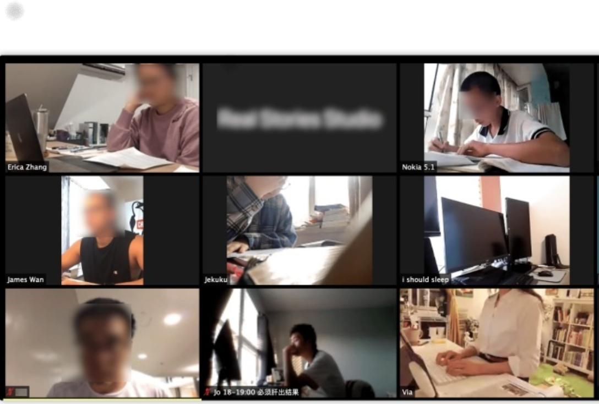

## 云原生社区线上自习室

### 概念

自习，即自己复习。 大部分人对自习的概念，还停留在晚上7点之后，学习的图书馆或者教室座位满满的，时常因为晚到而抢不到位置只好灰头低脸的回到宿舍。 回到宿舍后，可能因为舍友在玩游戏，追剧等原因，导致这一天晚上的自习效率极其低下。

让我们回忆一下，我们为何喜欢去图书馆自习呢？是因为安静吗？似乎在家中关上房门亦可以自习呢。自律极强的小伙伴们不管在房间还是在图书馆，自习的效率都是相当的高，而对于我来说，没有图书馆，没有自习室， 我经常不能控制住自己的双手，想去翻翻手机，刷刷最新的新闻亦或看看朋友圈。手机作为一个现代社会的娱乐设备似乎成为了我自习的前进方向的最大阻碍物。

随着疫情肆虐，人们逐渐习惯待在家中，尽管最近新冠病例下降，但疫情反弹时常出现。线上自习室响应国家号召，宅在家，不聚集，少聚集，并且作为新鲜事物，近年来不断出现在我们生活中。

为了便于理解，上一张关于线上自习室的图。

在云原生社区线上自习室，大家都会自愿开摄像头，看到身边的人一起努力奋斗，让自习充满了仪式感，而因为手机已经打开自习链接，无法再玩手机的我，在小伙伴的监督下，我的学习斗志满满干劲十足，很快就进入学习状态，很多目标也一一在自习室中达到了。

### 加入链接

制定学习目标，扫描以下二维码，就可以愉快的自习了。（该线上自习室为免费使用）

### 建议

视频自习，如果不愿意露脸的话，可以把摄像头对焦自己的手、书包或者电脑，担心自己玩手机，也可以把摄像头对准手机。