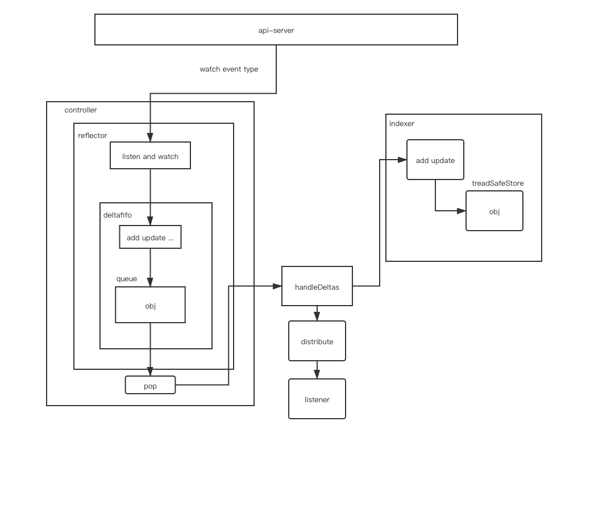
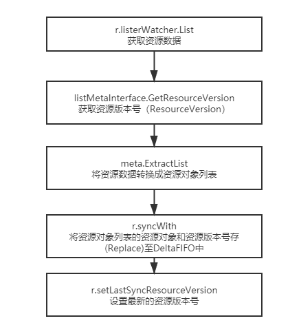
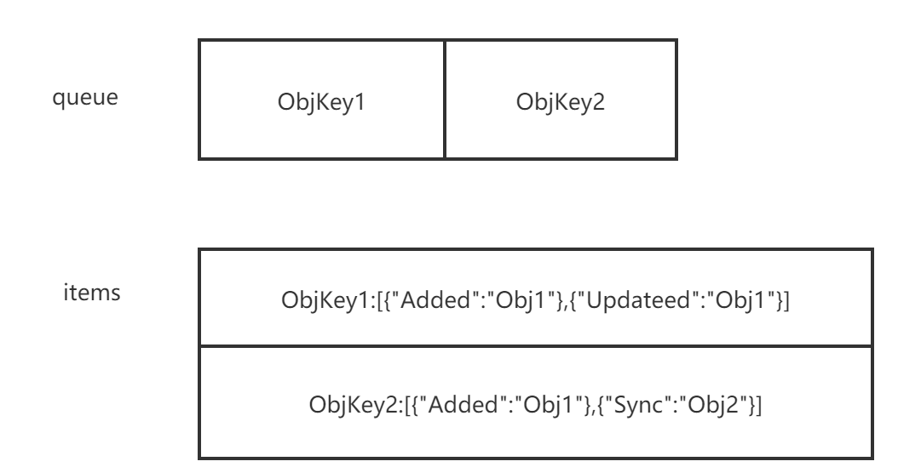
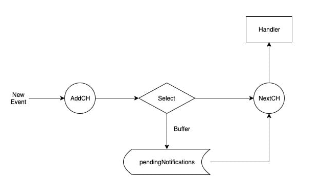
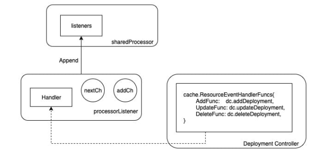
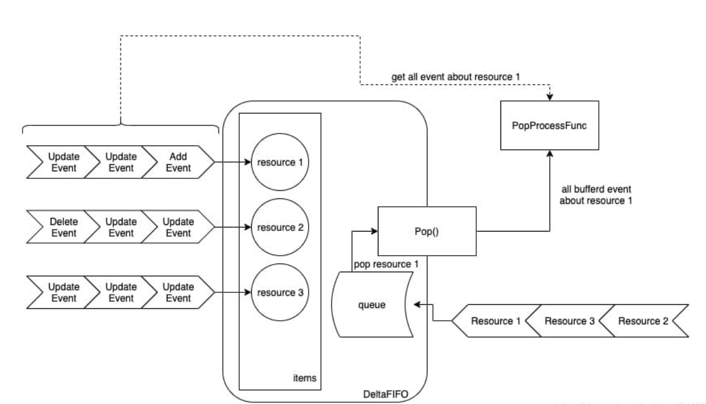
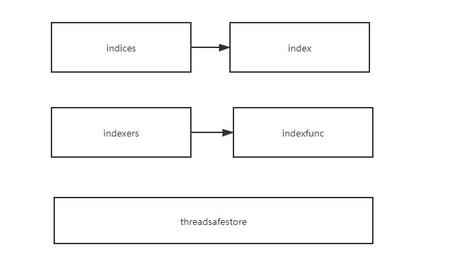

---

title: "Kubernetes client-go informer架构介绍"
description: "这篇文章通过对informer架构中所用到的组件,分别做了不同的介绍。"
author: "[屈帅波](https://github.com/strive-after)"
image: "images/blog/kubernetes-informer-banner.jpg"
categories: ["Kubernetes"]
tags: ["client-go", "informer"]
date: 2020-08-30T07:00:00+08:00
type: "post"
avatar: "/images/profile/qushuaibo.jpg"
profile: "某境外电商公司运维工程师，云原生爱好者。"
type: "post"
avatar: "/images/profile/default.jpg"
---

## 一、简介

在kubernetes系统中，组件之间通过http协议进行通信，通过informer来做到了消息的实时性、可靠性、顺序性， 通过informer机制与api-server进行通信。
## 二、架构设计


### 1.Reflector

#### (1)简介

informer可以对kubernetes api server 的资源执行监控（watch）操作 ，类型可以是kubernetes内置资源也可以是crd 自定义资源 ，其中最核心的功能是Reflector，Reflector用于监控指定资源的kubernetes资源，当资源发生变化的时候，例如发生了Added 资源添加等事件 会将其资源对象存放在本地缓存DeltaFIFO中。

#### (2)核心介绍（listandwatch）

第一部分首先获取资源列表数据。
第二部分通过watchhandler 来监控资源对象。

```go
// path: staging/src/k8s.io/client-go/tools/cache/reflector.go
// ListAndWatch首先列出所有项目，并在调用时获取资源版本，然后使用资源版本进行观看。
//如果ListAndWatch甚至没有尝试初始化watch，它将返回错误。
func (r *Reflector) ListAndWatch(stopCh <-chan struct{}) error {
	klog.V(3).Infof("Listing and watching %v from %s", r.expectedType, r.name)
	var resourceVersion string

	//从所要同步数据的资源对象的第0个版本开始
	options := metav1.ListOptions{ResourceVersion: "0"}

	if err := func() error {
		initTrace := trace.New("Reflector ListAndWatch", trace.Field{"name", r.name})
		defer initTrace.LogIfLong(10 * time.Second)
		var list runtime.Object
		var err error
		listCh := make(chan struct{}, 1)
		panicCh := make(chan interface{}, 1)
		go func() {
			defer func() {
				if r := recover(); r != nil {
					panicCh <- r
				}
			}()

			//如果listerWatcher支持，则尝试以块的形式收集列表；如果不支持，则尝试第一个
			//列表请求将返回完整的响应。
			pager := pager.New(pager.SimplePageFunc(func(opts metav1.ListOptions) (runtime.Object, error) {
				return r.listerWatcher.List(opts)
			}))
			if r.WatchListPageSize != 0 {
				pager.PageSize = r.WatchListPageSize
			}

			//返回完整列表
			list, err = pager.List(context.Background(), options)
			close(listCh)
		}()
		select {
		case <-stopCh:
			return nil
		case r := <-panicCh:
			panic(r)
		case <-listCh:
		}
		if err != nil {
			return fmt.Errorf("%s: Failed to list %v: %v", r.name, r.expectedType, err)
		}
		initTrace.Step("Objects listed")
		//通过list 转换我们得到listMetaInterface
		listMetaInterface, err := meta.ListAccessor(list)
		if err != nil {
			return fmt.Errorf("%s: Unable to understand list result %#v: %v", r.name, list, err)
		}
		//listMetaInterface 可以获取groupversion 然后从而转换为kind
		resourceVersion = listMetaInterface.GetResourceVersion()
		initTrace.Step("Resource version extracted")
		//得到[]runtime.Object
		items, err := meta.ExtractList(list)
		if err != nil {
			return fmt.Errorf("%s: Unable to understand list result %#v (%v)", r.name, list, err)
		}
		initTrace.Step("Objects extracted")
		//然后存入缓存
		/*
		func (r *Reflector) syncWith(items []runtime.Object, resourceVersion string) error {
			found := make([]interface{}, 0, len(items))
			for _, item := range items {
				found = append(found, item)
			}
		//调用store的replace来替换
			return r.store.Replace(found, resourceVersion)
		}
		 */
		if err := r.syncWith(items, resourceVersion); err != nil {
			return fmt.Errorf("%s: Unable to sync list result: %v", r.name, err)
		}
		initTrace.Step("SyncWith done")
		r.setLastSyncResourceVersion(resourceVersion)
		initTrace.Step("Resource version updated")
		return nil
	}(); err != nil {
		return err
	}
		...
		//调用api的接口 watch
		w, err := r.listerWatcher.Watch(options)
		if err != nil {
			switch err {
			case io.EOF:
				// watch closed normally
			case io.ErrUnexpectedEOF:
				klog.V(1).Infof("%s: Watch for %v closed with unexpected EOF: %v", r.name, r.expectedType, err)
			default:
				utilruntime.HandleError(fmt.Errorf("%s: Failed to watch %v: %v", r.name, r.expectedType, err))
			}
			//如果出现“连接被拒绝”错误，则意味着最有可能的apiserver没有响应。 重新列出所有对象没有任何意义，因为很可能我们将能够在结束的地方重新开始监视。 如果是这种情况，请等待并重新发送监视请求。
			if utilnet.IsConnectionRefused(err) {
				time.Sleep(time.Second)
				continue
			}
			return nil
		}
		
		if err := r.watchHandler(start, w, &resourceVersion, resyncerrc, stopCh); err != nil {
			if err != errorStopRequested {
				switch {
				case apierrs.IsResourceExpired(err):
					klog.V(4).Infof("%s: watch of %v ended with: %v", r.name, r.expectedType, err)
				default:
					klog.Warningf("%s: watch of %v ended with: %v", r.name, r.expectedType, err)
				}
			}
			return nil
		}
	}
}
```

#### (3)流程介绍



通过给NewRefector传入一个listerwatcher数据接口对象来实例化一个Reflector对象。
Reflector具备list和watch方法 最重要的是ListAndWatch。
list主要是用来获取资源列表数据。
watch主要是用来监控资源对象，发生event的时候插入本地缓存DeltaFIFO中并更新ResourceVersion。

### 2.DeltaFIFO

#### (1)简介

DeltaFIFO可以拆分开来理解 FIFO是一个先进先出的队列。Delta是一个资源对象存储，它可以保存资源对象的操作类型。

```go
// path: staging/src/k8s.io/client-go/tools/cache/delta_fifo.go
type DeltaFIFO struct {
...
	items map[string]Deltas
	queue []string
...
}
```
#### (2)生产者

在生产者方法中 queueActionLocked 内部通过keyof拿到对应obj的一个id，items是一个map[string]Deltas 的一个map 那么就以这个id为map的key ，value([]Delta)的话 初始化一个[]Delta 切片并且以f.items[id]为初始切片 再添加一个Delta{actionType, obj}，然后使用dedupDeltas对newDeltas做去重操作。我们会对f.items[id] ，items这个map中是否存在这个key(id)，如果不存在就在队列中添加一个id，添加完之后将 newDeltas 赋值给items[id]，并且调用cond.Broadcast()通知所有消费者并且解除阻塞。

```go
// path: staging/src/k8s.io/client-go/tools/cache/delta_fifo.go
//这里queue负责存放的是id （这里主要是负责先进先出）
//items存放的是对应id的 同一个obj的多种操作如图所示 objkey1中对应obj1的先added然后updated 
func (f *DeltaFIFO) queueActionLocked(actionType DeltaType, obj interface{}) error {
	...
		if _, exists := f.items[id]; !exists {
			f.queue = append(f.queue, id)
		}
		f.items[id] = newDeltas
		f.cond.Broadcast()
	...
}
```
 

#### (3)消费者
这里cond.Wait() 如果队列中没有数据那么就等待，当队列中有了数据之后从queue 里面拿出来第0个id，并且从队列（queue）中删除第0个元素，然后从items中做key的有效判断，如果不存在则跳过，存在的话那么我们就需要从map中把这个key给删除掉。这里主要是为了防止比如items中obj1 有added 有updated 忽然从生产者加了一个deleted，这里删除之后即使加deleted也是新的key会重新从队列中等待，这是对应objkey1的[]delta 中只有一个Deleted的操作，然后调用传入的回调函数process 做操作。

```go
// path: staging/src/k8s.io/client-go/tools/cache/delta_fifo.go
func (f *DeltaFIFO) Pop(process PopProcessFunc) (interface{}, error) {
	f.lock.Lock()
	defer f.lock.Unlock()
	for {
        //如果队列长度为0 且队列不是关闭 那么就等待
		for len(f.queue) == 0 {
			if f.IsClosed() {
				return nil, ErrFIFOClosed
			}
			f.cond.Wait()
		}
		id := f.queue[0]
		f.queue = f.queue[1:]
		if f.initialPopulationCount > 0 {
			f.initialPopulationCount--
		}
        //取出队列头部第一个元素
		item, ok := f.items[id]
		if !ok {
			continue
		}
		delete(f.items, id)
		err := process(item)
		if e, ok := err.(ErrRequeue); ok {
			f.addIfNotPresent(id, item)
			err = e.Err
		}
		return item, err
	}
}
```

#### (4)回调函数process
handleDeltas函数作为proess回调函数，当资源对象的操作类型为Added、Updated、Deleted时，将该资源对象存储值indexer（并发安全的存储），并通过distribute函数将资源对象分发至Sharedinformer，distribute函数将资源对象分发到该事件的处理函数中。
```go
// path: staging/src/k8s.io/client-go/tools/cache/shared_informer.go
func (s *sharedIndexInformer) HandleDeltas(obj interface{}) error {
	s.blockDeltas.Lock()
	defer s.blockDeltas.Unlock()
	//这里循环的目的是因为我们传入的obj是一个Deltas 也就是一个[]Deltas 那么就是一个obj的多个操作 
	for _, d := range obj.(Deltas) {
		switch d.Type {
		case Sync, Added, Updated:
			isSync := d.Type == Sync
			s.cacheMutationDetector.AddObject(d.Object)
			if old, exists, err := s.indexer.Get(d.Object); err == nil && exists {
				if err := s.indexer.Update(d.Object); err != nil {
					return err
				}
				s.processor.distribute(updateNotification{oldObj: old, newObj: d.Object}, isSync)
			} else {
				if err := s.indexer.Add(d.Object); err != nil {
					return err
				}
				s.processor.distribute(addNotification{newObj: d.Object}, isSync)

			}
		case Deleted:
			if err := s.indexer.Delete(d.Object); err != nil {
				return err
			}
			s.processor.distribute(deleteNotification{oldObj: d.Object}, false)
		}
	}
	return nil
}
```

#### (5)distribute函数处理

这段代码表示了通过区分是否是sync操作  通过遍历listener，并且调用add方法把obj写入了一个addch的管道中。
```go
// path: staging/src/k8s.io/client-go/tools/cache/shared_informer.go
func (p *sharedProcessor) distribute(obj interface{}, sync bool) {
	p.listenersLock.RLock()
	defer p.listenersLock.RUnlock()

	if sync {
		for _, listener := range p.syncingListeners {
			listener.add(obj)
		}
	} else {
		for _, listener := range p.listeners {
			listener.add(obj)
		}
	}
}
type sharedProcessor struct {
	listenersStarted bool
	listenersLock    sync.RWMutex
	listeners        []*processorListener
	syncingListeners []*processorListener
	clock            clock.Clock
	wg               wait.Group
}
func (p *processorListener) add(notification interface{}) {
	p.addCh <- notification
}
```
processor 是 sharedIndexInformer 中一个非常有趣的组件，Controller Manager 通过一个 Informer 单例工厂来保证不同的 Controller 共享了同一个 Informer，但是不同的 Controller 对该共享的 Informer 注册的 Handler 不同sharedProcessor 的工作核心是围绕着 listeners 这个 Listener 切片展开的。

#### (6)addch

```go
// path: staging/src/k8s.io/client-go/tools/cache/shared_informer.go
type processorListener struct {
	nextCh chan interface{}
	addCh  chan interface{}
}
```
将事件源源不断地 从addCh 到 nextCh，因为无法预知生产者的生产速度，所以这里pendingNotifications 承担了一个buffer的角色，通过pendingNotifications 来控制生产者与消费者之间的平衡。


```go
// path: staging/src/k8s.io/client-go/tools/cache/shared_informer.go
func (p *processorListener) pop() {
	defer utilruntime.HandleCrash()
	defer close(p.nextCh) // Tell .run() to stop

	var nextCh chan<- interface{}
	var notification interface{}
	for {
		select {
		case nextCh <- notification:
			// Notification dispatched
			var ok bool
			notification, ok = p.pendingNotifications.ReadOne()
			if !ok { // Nothing to pop
				nextCh = nil // Disable this select case
			}
		case notificationToAdd, ok := <-p.addCh:
			if !ok {
				return
			}
			if notification == nil { // No notification to pop (and pendingNotifications is empty)
				// Optimize the case - skip adding to pendingNotifications
				notification = notificationToAdd
				nextCh = p.nextCh
			} else { // There is already a notification waiting to be dispatched
				p.pendingNotifications.WriteOne(notificationToAdd)
			}
		}
	}
}
```

因为 listener 包含了 Controller 注册进来的 Handler 方法，因此 listener 最重要的职能就是当事件发生时来触发这些方法，而 listener.run 就是不停的从 nextCh 这个 channel 中拿到事件并执行对应的 handler可以看到，listener.run 不停的从 nextCh 这个 channel 中拿到事件。

```go
// path: staging/src/k8s.io/client-go/tools/cache/shared_informer.go
func (p *processorListener) run() {
	stopCh := make(chan struct{})
	wait.Until(func() {
		err := wait.ExponentialBackoff(retry.DefaultRetry, func() (bool, error) {
			for next := range p.nextCh {
				switch notification := next.(type) {
				case updateNotification:
					p.handler.OnUpdate(notification.oldObj, notification.newObj)
				case addNotification:
					p.handler.OnAdd(notification.newObj)
				case deleteNotification:
					p.handler.OnDelete(notification.oldObj)
				default:
					utilruntime.HandleError(fmt.Errorf("unrecognized notification: %T", next))
				}
			}
			// the only way to get here is if the p.nextCh is empty and closed
			return true, nil
		})

		// the only way to get here is if the p.nextCh is empty and closed
		if err == nil {
			close(stopCh)
		}
	}, 1*time.Minute, stopCh)
}
```

从图中可以看出当有一个新的event 这里新的event指的是从delta队列中通过distribute分发给所有Listener通过调用add 来对addch有一个写入的操作，然后通过缓存判定（也就是为了防止listener.handler生产速度大于消费速度 这里加了一层缓存层 如果没有缓存直接写入nextch ，有缓存就写入缓存还会对缓存的剩余量做判断），并执行对应的 handler。





#### (7)DeltaFIFO总结

总体来看，DeltaFIFO 的入队列方法，会先判断该资源是否已经在 items 中， 如果已经存在，说明该资源还没有被消费（还在 queue 中排队），则直接将事件 append 到 items[resource_id] 中即可。如果发现不在 items 中，便会创建 items[resource_id]，并将资源 id append 到 queue 中。而 DeltaFIFO 出队列方法，会从 queue 中拿到队列最前面的资源 id，然后从 items 中拿走该资源所有的事件，最后调用 Pop 方法传入的 PopProcessFunc 类型的处理函数。因此，DeltaFIFO 的特点在于，入队列的是（资源的）事件，而出队列时是拿到的是最早入队列的资源的所有事件。这样的设计保证了不会因为有某个资源疯狂的制造事件，导致其他资源没有机会被处理而产生饥饿



### 3.Indexer

#### (1)简介

indexer是client-go用来存储资源对象并自带索引功能的本地存储，Reflector从DeltaFIFO中将消费出来的资源对象存储至indexer，indexer要与etcd中的数据保持一致，这样无须每次都走etcd交互式拿到数据，能减轻api-server的压力。



#### (2)例子

这里是一个indexer的一个测试用例。
```go
//这就是一个keyfunc的定义
func testUsersIndexFunc(obj interface{}) ([]string, error) {
	pod := obj.(*v1.Pod)
	//拿到一个pod obj 并且从pod中拿到 注释key是users的值 
	usersString := pod.Annotations["users"]
	//以，作为分隔符 做一个切片返回
	return strings.Split(usersString, ","), nil
}

func TestMultiIndexKeys(t *testing.T) {
//我们初始化一个indexer  MetaNamespaceKeyFunc是一个获取ns和资源对象的的keyfunc 
//indexer的key是byUser value 是一个keyfunc(testUsersIndexFunc)
	index := NewIndexer(MetaNamespaceKeyFunc, Indexers{"byUser": testUsersIndexFunc})
	//初始化3个pod obj
	pod1 := &v1.Pod{ObjectMeta: metav1.ObjectMeta{Name: "one", Annotations: map[string]string{"users": "ernie,bert"}}}
	pod2 := &v1.Pod{ObjectMeta: metav1.ObjectMeta{Name: "two", Annotations: map[string]string{"users": "bert,oscar"}}}
	pod3 := &v1.Pod{ObjectMeta: metav1.ObjectMeta{Name: "tre", Annotations: map[string]string{"users": "ernie,elmo"}}}
	//调用add 插入缓存
	index.Add(pod1)
	index.Add(pod2)
	index.Add(pod3)
	...
	//我们通过map中的indexfunc（这个func主要就是从pod的注释字段中拿到注释key是users的值，keyfunc返回的是一个[]string） 那么通过indexfunc我们获得了注释key是users的值 然后通过我们第二个参数判断users中存不存在 ernie这个string 
	erniePods, err := index.ByIndex("byUser", "ernie")
	if err != nil {
		t.Errorf("unexpected error: %v", err)
	}
	if len(erniePods) != 1 {
		t.Errorf("Expected 1 pods but got %v", len(erniePods))
	}
	//可能有多个pod注释中都有users:ernie,xxx,xxx 类似的只要包含ernie 通过上面的byindex就可以拿出来 然后遍历 打印
	for _, erniePod := range erniePods {
		if erniePod.(*v1.Pod).Name != "one" {
			t.Errorf("Expected only 'one' but got %s", erniePod.(*v1.Pod).Name)
		}
	}
}
```
简单来说就是indefunc 我们自己定义一些逻辑  实现对一个obj 做一些取值或者操作，然后通过传入一个indexfunc初始化一个indexer 。 
这里的indexer是一个map[string]indexfunc 我的理解就是可以自定义indexfun 然后添加map里面 需要做什么操作就调用那个key对应的func 就比如 index.ByIndex("byUser", "ernie")。
indefunc 是一个对注释key是users取value的操作 那么调用这个indefunc 并且比较取出来的值中是否有ernie这个string。

#### (3)ByIndex的核心实现

```go
// path: staging/src/k8s.io/client-go/tools/cache/store.go
//前面说过了cache是一个store的实现 然后它本身有嵌套了ThreadSafeStore 接口 
//threadSafeMap 是ThreadSafeStore 接口的一个实现
//我们可以从newstroe看到 就是把threadSafeMap 赋给了store的ThreadSafeStore 字段
//go的特性当他这个结构体实现了一个接口的所有方法那么就可以把结构体赋给接口 
func (c *cache) ByIndex(indexName, indexKey string) ([]interface{}, error) {
	return c.cacheStorage.ByIndex(indexName, indexKey)
}
// path: staging/src/k8s.io/client-go/tools/cache/thread_safe_store.go
//接收2个参数 indexname 索引器名称   indexkey 需要检索的key
func (c *threadSafeMap) ByIndex(indexName, indexKey string) ([]interface{}, error) {
    //加锁
	c.lock.RLock()
	defer c.lock.RUnlock()
	//通过indexname  我们拿到对应的indexfunc
	indexFunc := c.indexers[indexName]
	if indexFunc == nil {
		return nil, fmt.Errorf("Index with name %s does not exist", indexName)
	}
	//从indeices中通过indexname我们拿到index  
	//indices是一个map[string]index
	//index是map[string]sets.String
	index := c.indices[indexName]
	//sets本身也是一个map[string]Empty    
	//empty是一个struct{}
	//从index中我们取到sets 
	set := index[indexKey]
	list := make([]interface{}, 0, set.Len())
	//通过遍历set 我们拿到所有的key 然后从items 通过key拿出来
	//item是map[string]interface{}
	for key := range set {
		list = append(list, c.items[key])
	}
	//把所有符合的结果返回
	return list, nil
}
```
index中的缓存数据为set集合数据结构，set本质与slice相同，但是set是一个map 不存在相同元素，kubernetes通过map结构类型的key作为set数据结构 ，实现set去重特性

### 4.工作流程

- controller manager在启动的时候会启动一个sharedInformerFactory这是一个informer的集合（informers map[reflect.Type]cache.SharedIndexInformer）。
- controller在run的时候会调用reflector的run，reflector 在run的时候会listen and watch，当有event的时候插入本地缓存DeltaFIFO中并更新ResouVersion。
- controller manager会watch and listen api-server的event，当有事件产生的时候，会通过reflector 插入deltafifo，
- DeltaFIFO是一个先进先出的队列 ，通过生产者 （add等等） 消费者（pop） 之后通过 sharedProcessor.distribute分发给所有listener 然后通过不同controller注册的handler来做逻辑处理。
- 最后indexer 去做操作调用treadsafestore 也就是底层存储的操作逻辑。

## 三、informer

### 1.资源informer
每一个kubernetes资源都实现了informer机制 ，每一个informer上都会事先informer的lister方法 例如pod informer。

```go
//path: staging/src/k8s.io/client-go/informers/core/v1/pod.go 
type PodInformer interface {
	Informer() cache.SharedIndexInformer
	Lister() v1.PodLister
}
```

### 2.shared informer

#### （1）简介

informer 也被称为shared informer  ，他是可以共享使用的，如果每一个informer使用一个reflector 那么会运行相当多的listandwatch 会增加api的复杂。shared informer 可以使同一类资源informer 共享一个reflector 可以节约资源。

```go
//path: staging/src/k8s.io/client-go/informers/factory.go 
type sharedInformerFactory struct {
	client           kubernetes.Interface
	namespace        string
	tweakListOptions internalinterfaces.TweakListOptionsFunc
	lock             sync.Mutex
	defaultResync    time.Duration
	customResync     map[reflect.Type]time.Duration
	//通过map 来存储  资源类型与 SharedIndexInformer 的对应关系 
	informers map[reflect.Type]cache.SharedIndexInformer
	// startedInformers is used for tracking which informers have been started.
	// This allows Start() to be called multiple times safely.
	startedInformers map[reflect.Type]bool
}
//通过informer 方法添加不同资源的informer 如果已存在则返回当前的informer 不再继续添加
func (f *sharedInformerFactory) InformerFor(obj runtime.Object, newFunc internalinterfaces.NewInformerFunc) cache.SharedIndexInformer {
	f.lock.Lock()
	defer f.lock.Unlock()
	//拿到obj 的type 
	informerType := reflect.TypeOf(obj)
	//通过obj type 获取informer 如果存在直接返回
	informer, exists := f.informers[informerType]
	if exists {
		return informer
	}
	
	resyncPeriod, exists := f.customResync[informerType]
	if !exists {
		resyncPeriod = f.defaultResync
	}

	informer = newFunc(f.client, resyncPeriod)
	//在map中添加一个新的type 跟informer的映射关系
	f.informers[informerType] = informer

	return informer
}
```

#### （2）启动informer
调用informer的start方法让 所有informers 中的informer 通过goroutine持久运行。

```go
//path: staging/src/k8s.io/client-go/informers/factory.go 
func (f *sharedInformerFactory) Start(stopCh <-chan struct{}) {
	f.lock.Lock()
	defer f.lock.Unlock()
	for informerType, informer := range f.informers {
		//遍历 informers 如果他的状态时true 那么它属于启动状态 如果不是那么run起来并且修改他的状态
		if !f.startedInformers[informerType] {
			go informer.Run(stopCh)
			f.startedInformers[informerType] = true
		}
	}
}
```

```go
//path: staging/src/k8s.io/client-go/tools/cache/shared_informer.go
//这里的run调用了shared informer的run方法
func (s *sharedIndexInformer) Run(stopCh <-chan struct{}) {
    defer utilruntime.HandleCrash()
    //创建fifo队列
    fifo := NewDeltaFIFO(MetaNamespaceKeyFunc, s.indexer)
    //初始化config
    cfg := &Config{
         Queue:            fifo,
         ListerWatcher:    s.listerWatcher,
         ObjectType:       s.objectType,
         FullResyncPeriod: s.resyncCheckPeriod,
         RetryOnError:     false,
         ShouldResync:     s.processor.shouldResync,
 
         Process: s.HandleDeltas,
    }
 	...
    //调用controller.run
    s.controller.Run(stopCh)
}
```

```go
//path: staging/src/k8s.io/client-go/tools/cache/controller.go
func (c *controller) Run(stopCh <-chan struct{}) {
	defer utilruntime.HandleCrash()
	go func() {
		<-stopCh
		c.config.Queue.Close()
	}()
	//初始化一个reflector
	r := NewReflector(
		c.config.ListerWatcher,
		c.config.ObjectType,
		c.config.Queue,
		c.config.FullResyncPeriod,
	)
	r.ShouldResync = c.config.ShouldResync
	r.clock = c.clock

	c.reflectorMutex.Lock()
	c.reflector = r
	c.reflectorMutex.Unlock()

	var wg wait.Group
	defer wg.Wait()
	//controller 最后也是调用的 reflector的run
	wg.StartWithChannel(stopCh, r.Run)

	wait.Until(c.processLoop, time.Second, stopCh)
}
```

```go
//path: staging/src/k8s.io/client-go/tools/cache/reflector.go
//controller run的时候会把reflector run起来,调用reflector 的listandwatch
func (r *Reflector) Run(stopCh <-chan struct{}) {
	klog.V(3).Infof("Starting reflector %v (%s) from %s", r.expectedType, r.resyncPeriod, r.name)
	wait.Until(func() {
		if err := r.ListAndWatch(stopCh); err != nil {
			utilruntime.HandleError(err)
		}
	}, r.period, stopCh)
}
```


## 四、通过一个例子来理解informer机制

```go
package main

import (
	"fmt"
	v1 "k8s.io/apimachinery/pkg/apis/meta/v1"
	"k8s.io/client-go/informers"
	"k8s.io/client-go/kubernetes"
	"k8s.io/client-go/tools/clientcmd"
	"time"
	"k8s.io/client-go/tools/cache"
)

func main() {
	config ,err := clientcmd.BuildConfigFromFlags("","config")
	if err != nil {
		panic(err)
	}
	//通过config 拿到client set客户端
	clientset ,err := kubernetes.NewForConfig(config)
	if err != nil {
		panic(err)
	}
	stopch := make(chan struct{})
	defer close(stopch)
	//通过client set客户端以及一个rsync（多久设置一次重新同步 也就是同步间隔时间 如果是0 那么禁用同步功能） 我们拿到一个informer的集合
	sharedinformers := informers.NewSharedInformerFactory(clientset,time.Minute)
	//通过sharedinfomers 我们获取到pod的informer
	podinfomer := sharedinformers.Core().V1().Pods().Informer()
	//为pod informer添加 controller的handlerfunc  触发回调函数之后 会通过addch 传给nextCh 管道然后调用controller的对应的handler来做处理
	podinfomer.AddEventHandler(cache.ResourceEventHandlerFuncs{
	//pod资源对象创建的时候出发的回调方法
		AddFunc: func(obj interface{}) {
			obja := obj.(v1.Object)
			fmt.Println(obja)
		},
		//更新回调
		UpdateFunc: func(oldObj, newObj interface{}) {
			...
		},
		//删除回调
		DeleteFunc: func(obj interface{}) {
			...
		},
	
	})
	//这里会调用reflector的run listandwatch 然后以goroutine的方式运行
	podinfomer.Run(stopch)

}
```
## 五、总结

通过对informer的架构的学习，我们引出了reflector 、deltafifo、indexer 几个核心的知识点，可以让我们更加深入的了解informer的工作流程，以此来熟悉controller，并且对于我们自己开发controller 也非常有帮助。

#### 参考资料

- https://blog.ihypo.net/15763910382218.html
- http://www.broadview.com.cn/book/6104

