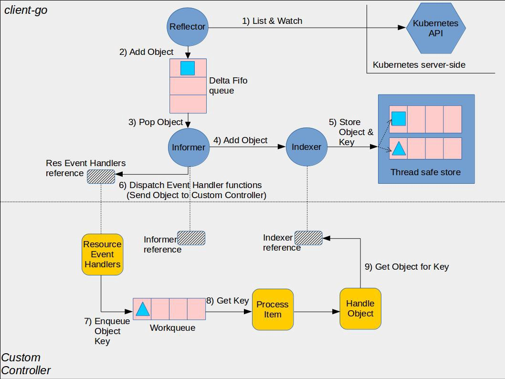
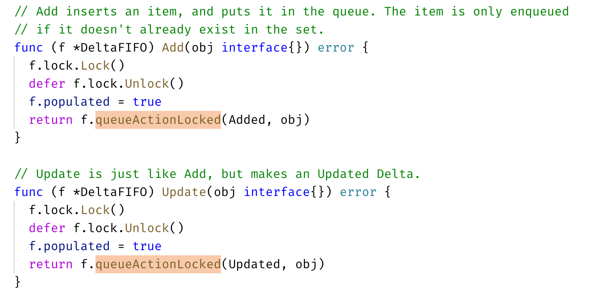

> 本文主要根据书籍 《Kubernetes 源码剖析》的基础上，对 Client-go 部分的 Informer 机制进行了解与学习。

## Informer 机制

Kubernetes 中使用 http 进行通信，**如何不依赖中间件的情况下保证消息的实时性，可靠性和顺序性等呢**？答案就是利用了 Informer 机制。Informer 的机制，降低了了 Kubernetes 各个组件跟 Etcd 与 Kubernetes API Server 的通信压力。

### Informer 机制架构设计



图片源自 [Client-go under the hood](https://github.com/kubernetes/sample-controller/blob/master/docs/controller-client-go.md)

⚠️  这张图分为两部分，黄色图标是开发者需要自行开发的部分，而其它的部分是 client-go 已经提供的，直接使用即可。

1. **Reflector**：用于 Watch 指定的 Kubernetes 资源，当 watch 的资源发生变化时，触发变更的事件，比如 Added，Updated 和 Deleted 事件，并将资源对象存放到本地缓存 DeltaFIFO；
2. **DeltaFIFO**：拆开理解，FIFO 就是一个队列，拥有队列基本方法（ADD，UPDATE，DELETE，LIST，POP，CLOSE 等），Delta 是一个资源对象存储，保存存储对象的消费类型，比如 Added，Updated，Deleted，Sync 等；
3. **Indexer**：Client-go 用来存储资源对象并自带索引功能的本地存储，Reflector 从 DeltaFIFO 中将消费出来的资源对象存储到 Indexer，Indexer 与 Etcd 集群中的数据完全保持一致。从而 client-go 可以本地读取，减少 Kubernetes API 和 Etcd 集群的压力。

看书本上的一个例子，想使用 Informer 的关键流程如下：

```go
clientset, err := kubernetes.NewForConfig(config)
stopCh := make(chan struct{})
defer close(stopch)
sharedInformers := informers.NewSharedInformerFactory(clientset, time.Minute)
informer := sharedInformer.Core().V1().Pods().Informer()
informer.AddEventHandler(cache.ResourceEventHandlerFuncs{
  AddFunc: func(obj interface{} {
    // ...
  },
  UpdateFunc: func(obj interface{} {
    // ...
  },
  DeleteFunc  : func(obj interface{} {
    // ...
  })
  informer.Run(stopCh)
})
```

* Informer 需要通过 ClientSet 与 Kubernetes API Server 交互；
* 创建 stopCh 是用于在程序进程退出前通知 Informer 提前退出，Informer 是一个持久运行的 goroutine；
* NewSharedInformerFactory 实例化了一个 SharedInformer 对象，用于进行本地资源存储；
* sharedInformer.Core().V1().Pods().Informer() 得到了具体 Pod 资源的 informer 对象；
* AddEventHandler 即图中的第6步，这是一个资源事件回调方法，上例中即为当创建/更新/删除 Pod 时触发事件回调方法；
* 一般而言，其他组件使用 Informer 机制触发资源回调方法会将资源对象推送到 WorkQueue 或其他队列中，具体推送的位置要去回调方法里自行实现。

上面这个示例，当触发了 Add，Update 或者 Delete 事件，就通知 Client-go，告知 Kubernetes 资源事件发生变更并且需要进行相应的处理。

1. 资源 Informer

每一个 k8s Resource 都实现了 Informer 机制，**均有 Informer 和 Lister 方法**，以 PodInformer 为例：

```go
type PodInformer interface {
	Informer() cache.SharedIndexInformer
	Lister() v1.PodLister
}
```

2. Shared Informer 共享机制

Informer 又称为 Shared Informer，表明是可以共享使用的，在使用 client-go 写代码时，若同一资源的 Informer 被实例化太多次，每个 Informer 使用一个 Reflector，会运行过多的相同 ListAndWatch（**即图中的第一步**），太多重复的序列化和反序列化会导致 k8s API Server 负载过重。

而 Shared Informer 通过对同一类资源 Informer 共享一个 Reflector 可以节约很多资源，这**通过 map 数据结构**即可实现这样一个共享 Informer 机制。

`vendor/k8s.io/client-go/informers/factory.go`

```go
type sharedInformerFactory struct {
  // ...
  
  // map 数据结构
	informers map[reflect.Type]cache.SharedIndexInformer
	// ...
}
// ...
// InternalInformerFor returns the SharedIndexInformer for obj using an internal client.
// 当示例中调用 xxx.Informer() 时，内部调用了该方法
func (f *sharedInformerFactory) InformerFor(obj runtime.Object, newFunc internalinterfaces.NewInformerFunc) cache.SharedIndexInformer {
	f.lock.Lock()
	defer f.lock.Unlock()

	informerType := reflect.TypeOf(obj)
	informer, exists := f.informers[informerType]
	if exists {
		return informer
	}

	resyncPeriod, exists := f.customResync[informerType]
	if !exists {
		resyncPeriod = f.defaultResync
	}

	informer = newFunc(f.client, resyncPeriod)
	f.informers[informerType] = informer

	return informer
}
```

### Reflector

Reflector 用于 Watch 指定的 Kubernetes 资源，当 watch 的资源发生变化时，触发变更的事件，并将资源对象存放到本地缓存 DeltaFIFO。

通过 NewReflector 实例化 Reflector 对象，实例化过程必须传入 ListerWatcher 数据接口对象，它拥有 List 和 Watch 方法。Reflector 对象通过 Run 行数启动监控并处理监控事件，在实现中，其核心为 ListAndWatch 函数。

以 Example 的代码为例，我们在最后一步执行了 `informer.Run(stopCh)`，内部会执行一个 ListAndWatch 方法：

`vendor/k8s.io/client-go/tools/cache/reflector.go`

```go
// Run 执行一个 watch 并且把握所有的 watch events，watch 关闭后会重启
// stopCh 关闭时 Run 退出
func (r *Reflector) Run(stopCh <-chan struct{}) {
	klog.V(3).Infof("Starting reflector %v (%s) from %s", r.expectedType, r.resyncPeriod, r.name)
	wait.Until(func() {
		if err := r.ListAndWatch(stopCh); err != nil {
			utilruntime.HandleError(err)
		}
	}, r.period, stopCh)
}
```

1. **获取资源数据列表**

以之前提过的 Example 的代码为例，通过 `Run` 获取了所有 Pod 的资源数据，List 流程如下：

1. `r.ListWatcher.List` 获取资源数据；
2. `listMetaInterface.GetResourceVersion` 获取资源版本号；
3. `meta.ExtractList` 将资源数据转换为资源对象列表；
4. `r.SyncWith` 将资源对象列表的资源对象和资源版本号存储到 DeltaFIFO 中；
5. `r.setLastSyncResourceVersion` 设置最新的资源版本号。

具体的，

* `r.ListWatcher.List` 根据 ResourceVersion 获取资源下的所有对象数据。以 Example 为例，该方法调用的就是 Pod Informer 下的 `ListFunc` 函数，通过 ClientSet 客户端与 Kubernetes API Server 交互并获取 Pod 资源列表数据；
* `listMetaInterface.GetResourceVersion` 获取 ResourceVersion，即资源版本号，注意这里的资源版本号并不是指前面各个客户端的不同 kind 的不同 Version，所有资源都拥有 ResourceVersion，标识当前资源对象的版本号。每次修改 etcd 集群中存储的对象时，Kubernetes API Server 都会更改 ResourceVersion，使得 client-go 执行 watch 时可以根据 ResourceVersion 判断当前资源对象是否发生变化；
* `meta.ExtractList` 将 runtime.Object 对象转换为 []runtime.Object 对象。因为 `r.ListWatcher.List` 获取的是资源下所有对象的数据，因此应当是一个列表；
* `r.SyncWith `将结果同步到 DeltaFIFO 中；
* `r.setLastSyncResourceVersion` 设置最新的资源版本号。

2. **监控资源对象**

Watch 通过 HTTP 协议与 Kubernetes API Server 建立长连接，接收 Kubernetes API Server 发来的资源变更事件。Watch 操作的实现机制使用 HTTP 协议的分块传输编码——当 client-go 调用 Kubernetes API Server 时，Kubernetes API Server 在 Response 的 HTTP Header 中设置 Transfer-Encoding 的值为 chunked，表示采用分块传输编码，客户端收到消息后，与服务端进行连接，并等待下一个数据块。

**在源码中关键为 watch 和 watchHandler 函数**：

`staging/src/k8s.io/client-go/tools/cache/reflector.go`

```go
func (r *Reflector) ListAndWatch(stopCh <-chan struct{}) error {
	// 前面提到的 list 部分代码
  
  // watch part
	for {
		// 收到 stopCh 停止循环
		select {
		case <-stopCh:
			return nil
		default:
		}

		// ...
		options = metav1.ListOptions{
			ResourceVersion: resourceVersion,
      // 设置超时时间避免将 watchers 挂起
			TimeoutSeconds: &timeoutSeconds,
		}

		w, err := r.listerWatcher.Watch(options)
		// error handling 部分
    
    // 另一个核心函数 watchHandler，后文介绍
		if err := r.watchHandler(w, &resourceVersion, resyncerrc, stopCh); err != nil {
			if err != errorStopRequested {
				klog.Warningf("%s: watch of %v ended with: %v", r.name, r.expectedType, err)
			}
			return nil
		}
	}
}
```

以之前的 Example 为例子，`r.listerWatcher.Watch` 实际调用了 Pod Informer 下的 Watch 函数，通过 ClientSet 客户端与 Kubernetes API Server 建立长链接，监控指定资源的变更事件，如下：

`staging/src/k8s.io/client-go/informers/core/v1/pod.go`

```go
func NewFilteredPodInformer(...) cache.SharedIndexInformer {
	return cache.NewSharedIndexInformer(
		  // ...
			WatchFunc: func(options metav1.ListOptions) (watch.Interface, error) {
				if tweakListOptions != nil {
					tweakListOptions(&options)
				}
				return client.CoreV1().Pods(namespace).Watch(options)
			},
		},
		// ...
	)
}
```

`r.watchHandler` 处理资源的变更事件，将对应资源更新到本地缓存 DeltaFIFO 并更新 ResourceVersion 资源版本号。

```go
// watchHandler watches w and keeps *resourceVersion up to date.
func (r *Reflector) watchHandler(w watch.Interface, resourceVersion *string, errc chan error, stopCh <-chan struct{}) error {
	start := r.clock.Now()
	eventCount := 0
	defer w.Stop()

// 循环嵌套循环时，在 break 后指定标签。用标签决定哪个循环被终止
loop:
	for {
		select {
		case <-stopCh:
			return errorStopRequested
		case err := <-errc:
			return err
		case event, ok := <-w.ResultChan():
      if !ok {
        // 直接跳出 for 循环
				break loop
			}
			// ...
			newResourceVersion := meta.GetResourceVersion()
			switch event.Type {
			case watch.Added:
				err := r.store.Add(event.Object)
				// ...
			case watch.Modified:
				err := r.store.Update(event.Object)
				// ...
			case watch.Deleted:
				err := r.store.Delete(event.Object)
				// ...
			default:
				// ...
			}
			*resourceVersion = newResourceVersion
			r.setLastSyncResourceVersion(newResourceVersion)
			eventCount++
		}
	}
// ...
}
```

### DeltaFIFO

DeltaFIFO 拆开理解，FIFO 就是一个队列，拥有队列基本方法（ADD，UPDATE，DELETE，LIST，POP，CLOSE 等），Delta 是一个资源对象存储，保存存储对象的消费类型，比如 Added，Updated，Deleted，Sync 等。

看 DeltaFIFO 的数据结构：

`vendor/k8s.io/client-go/tools/cache/delta_fifo.go`

```go
type DeltaFIFO struct {
	// lock/cond protects access to 'items' and 'queue'.
	lock sync.RWMutex
	cond sync.Cond

	// We depend on the property that items in the set are in
	// the queue and vice versa, and that all Deltas in this
	// map have at least one Delta.
	items map[string]Deltas
	queue []string

	// ...
}
```

其中，Deltas 部分的数据结构如下：

`staging/src/k8s.io/client-go/tools/cache/delta_fifo.go`

```go
// DeltaType is the type of a change (addition, deletion, etc)
type DeltaType string

// Delta is the type stored by a DeltaFIFO. It tells you what change
// happened, and the object's state after* that change.
type Delta struct {
	Type   DeltaType
	Object interface{}
}

// Deltas is a list of one or more 'Delta's to an individual object.
// The oldest delta is at index 0, the newest delta is the last one.
type Deltas []Delta
```

DeltaFIFO 会保留所有关于资源对象（obj）的操作类型，队列中会存在拥有不同操作类型的同一资源对象，**使得消费者在处理该资源对象时能够了解资源对象所发生的事情**。queue 字段存储资源对象的 key，这个 key 通过 KeyOf 函数计算得到，items 字段通过 map 数据结构的方式存储，value 存储的是对象 Deltas 数组，一个结构示例图如下：

```
        ┌───────┐┌───────┐┌───────┐
queue   │ObjKey1││ObjKey2││ObjKey3│
        └───────┘└───────┘└───────┘

        ┌─────────────────────────────────────────────────────────────┐
itmes   │ObjKey1: [{"Added",Obj1} {"Updated",Obj1}]                   │
        ├─────────────────────────────────────────────────────────────┤
        │ObjKey2: [{"Added",Obj2},{"Deleted",Obj2},{"Sync",Obj2}]     │
        ├─────────────────────────────────────────────────────────────┤
        │ObjKey3: [{"Added",Obj3},{"Updated",Obj3},{"Deleted",Obj3}]  │
        └─────────────────────────────────────────────────────────────┘

```

作为一个 FIFO 的队列，有数据的生产者和消费者，其中生产者是 Reflector 调用的 Add 方法，消费者是 Controller 调用的 Pop 方法。三个核心方法为**生产者方法，消费者方法和 Resync 机制**。

#### 生产者方法

DeltaFIFO 队列中的资源对象在调用 Added，Updated，Deleted 等事件时都调用了 queueActionLocked 函数：



它是 DeltaFIFO 实现的关键：

`vendor/k8s.io/client-go/tools/cache/delta_fifo.go`

```go
// queueActionLocked 为一个 delta list 添加一个 object
// 调用方必须先上锁
func (f *DeltaFIFO) queueActionLocked(actionType DeltaType, obj interface{}) error {
  // 通过 KeyOf 函数计算出对象的 key
	id, err := f.KeyOf(obj)
	if err != nil {
		return KeyError{obj, err}
	}

  // 将 actionType 以及对应的 id 添加到 items 中，并通过 dedupDeltas 对数组中最新的两次添加进行去重
	newDeltas := append(f.items[id], Delta{actionType, obj})
	newDeltas = dedupDeltas(newDeltas)

  // 一般不会出现 <= 0， 属冗余判断
	if len(newDeltas) > 0 {
		if _, exists := f.items[id]; !exists {
			f.queue = append(f.queue, id)
		}
		f.items[id] = newDeltas
    // 广播所有消费者解除阻塞
		f.cond.Broadcast()
	} else {
		delete(f.items, id)
	}
	return nil
}
```

1. 通过 KeyOf 函数计算出对象的 key；
2. 将 actionType 以及对应的 id 添加到 items 中，并通过 dedupDeltas 对数组中最新的两次添加进行去重；
3. 更新构造后的 Deleta 并通过 cond.Broadcast() 广播所有消费者解除阻塞。

#### 消费者方法

Pop 函数作为消费者使用方法，从 DeltaFIFO 的头部取出最早进入队列中的资源对象数据。Pop 方法必须传入 process 函数，用于接收并处理对象的回调方法，如下：

`vendor/k8s.io/client-go/tools/cache/delta_fifo.go`

```go
func (f *DeltaFIFO) Pop(process PopProcessFunc) (interface{}, error) {
	f.lock.Lock()
	defer f.lock.Unlock()
	for {
		for len(f.queue) == 0 {
      // 空队列时阻塞 Pop 方法
			if f.IsClosed() {
				return nil, FIFOClosedError
			}

			f.cond.Wait()
		}
		id := f.queue[0]
		f.queue = f.queue[1:]
		if f.initialPopulationCount > 0 {
			f.initialPopulationCount--
		}
		item, ok := f.items[id]
		if !ok {
			// Item may have been deleted subsequently.
			continue
		}
    // 注意这里在执行之前会把该 obj 旧的 delta 数据清空
		delete(f.items, id)
		err := process(item)
		if e, ok := err.(ErrRequeue); ok {
			f.addIfNotPresent(id, item)
			err = e.Err
		}
		return item, err
	}
}
```

首先，使用 `f.lock.Lock()` 确保了数据的同步，当队列不为空时，取出 `f.queue` 的头部数据，将对象传入 process 回调函数，由上层消费者进行处理，如果 process 回调方法处理出错，将该对象重新存入队列。

Controller 的 `processLoop` 方法负责从 DeltaFIFO 队列中取出数据传递给 process 回调函数，process 函数的类型如下：

```go
type PopProcessFunc func(interface{}) error
```

一个 process 回调函数代码示例如下：

`vendor/k8s.io/client-go/tools/cache/shared_informer.go`

```go
func (s *sharedIndexInformer) HandleDeltas(obj interface{}) error {
	s.blockDeltas.Lock()
	defer s.blockDeltas.Unlock()

	// from oldest to newest
	for _, d := range obj.(Deltas) {
		switch d.Type {
		case Sync, Added, Updated:
			isSync := d.Type == Sync
			s.cacheMutationDetector.AddObject(d.Object)
			if old, exists, err := s.indexer.Get(d.Object); err == nil && exists {
				if err := s.indexer.Update(d.Object); err != nil {
					return err
				}
				s.processor.distribute(updateNotification{oldObj: old, newObj: d.Object}, isSync)
			} else {
				if err := s.indexer.Add(d.Object); err != nil {
					return err
				}
				s.processor.distribute(addNotification{newObj: d.Object}, isSync)
			}
		case Deleted:
			if err := s.indexer.Delete(d.Object); err != nil {
				return err
			}
			s.processor.distribute(deleteNotification{oldObj: d.Object}, false)
		}
	}
	return nil
}
```

在这个例子中，HandleDeltas 作为 process 的一个回调函数，当资源对象操作类型为 Added，Updated 和 Delted 时，该资源对象存储至 Indexer（它是并发安全的），并通过 distribute 函数将资源对象分发到 SharedInformer，在之前 [Informer 机制架构设计](#informer-机制架构设计)的示例代码中，通过 `informer.AddEventHandler` 函数添加了对资源事件进行处理的函数，distribute 函数将资源对象分发到该事件处理函数。

#### Resync 机制

> 本节内容主要参考自 [【提问】Informer 中为什么需要引入 Resync 机制？](https://github.com/cloudnativeto/sig-k8s-source-code/issues/11)

Resync 机制会将 Indexer 本地存储中的资源对象同步到 DeltaFIFO 中，并将这些资源对象设置为 Sync 的操作类型，

```go
// 重新同步一次 Indexer 缓存数据到 Delta FIFO
func (f *DeltaFIFO) Resync() error {
	f.lock.Lock()
	defer f.lock.Unlock()

	if f.knownObjects == nil {
		return nil
	}
	// 遍历 indexer 中的 key，传入 syncKeyLocked 中处理
	keys := f.knownObjects.ListKeys()
	for _, k := range keys {
		if err := f.syncKeyLocked(k); err != nil {
			return err
		}
	}
	return nil
}

func (f *DeltaFIFO) syncKeyLocked(key string) error {
	obj, exists, err := f.knownObjects.GetByKey(key)
	if err != nil {
		klog.Errorf("Unexpected error %v during lookup of key %v, unable to queue object for sync", err, key)
		return nil
	} else if !exists {
		klog.Infof("Key %v does not exist in known objects store, unable to queue object for sync", key)
		return nil
	}
	// 若 FIFO 队列中已经有相同 key 的 event 进来了，说明该资源对象有了新的 event，
	// Indexer 中旧的缓存失效，直接返回 nil
	id, err := f.KeyOf(obj)
	if err != nil {
		return KeyError{obj, err}
	}
	if len(f.items[id]) > 0 {
		return nil
	}
  // 重新放入 FIFO 队列中
	if err := f.queueActionLocked(Sync, obj); err != nil {
		return fmt.Errorf("couldn't queue object: %v", err)
	}
	return nil
}
```

为什么需要 Resync 机制呢？因为在处理 SharedInformer 事件回调时，可能存在处理失败的情况，定时的 Resync 让这些处理失败的事件有了重新 onUpdate 处理的机会。

那么经过 Resync 重新放入 Delta FIFO 队列的事件，和直接从 apiserver 中 watch 得到的事件处理起来有什么不一样呢？在消费者方法中有介绍过 `HandleDeltas`，其中就有关于 Resync 的部分：

```go
func (s *sharedIndexInformer) HandleDeltas(obj interface{}) error {
	// 上锁

	for _, d := range obj.(Deltas) {
		// 判断事件类型
		switch d.Type {
		case Sync, Replaced, Added, Updated:
			s.cacheMutationDetector.AddObject(d.Object)
			if old, exists, err := s.indexer.Get(d.Object); err == nil && exists {
				if err := s.indexer.Update(d.Object); err != nil {
					return err
				}
				
				isSync := false
				switch {
				case d.Type == Sync:
					// 如果是通过 Resync 重新同步得到的事件则做个标记
					isSync = true
				case d.Type == Replaced:
					...
				}
				// 如果是通过 Resync 重新同步得到的事件，则触发 onUpdate 回调
				s.processor.distribute(updateNotification{oldObj: old, newObj: d.Object}, isSync)
			} else {
				if err := s.indexer.Add(d.Object); err != nil {
					return err
				}
				s.processor.distribute(addNotification{newObj: d.Object}, false)
			}
		case Deleted:
			if err := s.indexer.Delete(d.Object); err != nil {
				return err
			}
			s.processor.distribute(deleteNotification{oldObj: d.Object}, false)
		}
	}
	return nil
}
```

从上面对 Delta FIFO 的队列处理源码可看出，当从 Resync 重新同步到 Delta FIFO 队列的事件，会分发到 updateNotification 中触发 onUpdate 的回调。Resync 机制的引入，定时将 Indexer 缓存事件重新同步到 Delta FIFO 队列中，在处理 SharedInformer 事件回调时，让处理失败的事件得到重新处理。并且通过入队前判断 FIFO 队列中是否已经有了更新版本的 event，来决定是否丢弃 Indexer 缓存不进行 Resync 入队。在处理 Delta FIFO 队列中的 Resync 的事件数据时，触发 onUpdate 回调来让事件重新处理。

### Indexer

Client-go 用来存储资源对象并自带索引功能的本地存储，Reflector 从 DeltaFIFO 中将消费出来的资源对象存储到 Indexer，Indexer 与 Etcd 集群中的数据完全保持一致。从而 client-go 可以本地读取，减少 Kubernetes API 和 Etcd 集群的压力。

了解 Indexer 之前，先了解 ThreadSafeMap，ThreadSafeMap 是实现并发安全存储，就像 Go 1.9 后推出 `sync.Map` 一样。Kubernetes 开始编写的时候还没有 `sync.Map`。Indexer 在 ThreadSafeMap 的基础上进行了封装，继承了 ThreadSafeMap 的存储相关的增删改查相关操作方法，实现了 Indexer Func 等功能，例如 Index，IndexKeys，GetIndexers 等方法，这些方法为 ThreadSafeMap 提供了索引功能。如下图：

```
        ┌───────────────┐    ┌──────────────┐
        │   Indeices    │--->│    Index     │
        └───────────────┘    └──────────────┘

        ┌───────────────┐    ┌──────────────┐
        │   Indexers    │--->│  IndexFun    │
        └───────────────┘    └──────────────┘

        ┌───────────────────────────────────┐
        │          ThreadSafeStore          │
        └───────────────────────────────────┘
```

#### ThreadSafeStore

ThreadSafeStore 是一个**内存中存储**，数据不会写入本地磁盘，增删改查都会加锁，保证数据一致性。结构如下：

`vendor/k8s.io/client-go/tools/cache/store.go`

```go
// threadSafeMap implements ThreadSafeStore
type threadSafeMap struct {
	lock  sync.RWMutex
	items map[string]interface{}

	// indexers maps a name to an IndexFunc
	indexers Indexers
	// indices maps a name to an Index
	indices Indices
}
```

items 字段存储资源对象数据，其中 items 的 key 通过 keyFunc 函数计算得到，计算默认使用 MetaNamespaceKeyFunc 函数，该函数根据资源对象计算出 `<namespace>/<name>` 格式的 key，value 用于存储资源对象。

而后面两个字段的定义类型如下：

`vendor/k8s.io/client-go/tools/cache/index.go`

```go
// Index maps the indexed value to a set of keys in the store that match on that value
type Index map[string]sets.String

// Indexers maps a name to a IndexFunc
type Indexers map[string]IndexFunc

// Indices maps a name to an Index
type Indices map[string]Index
```

#### Indexer 索引器

每次增删改 ThreadSafeStore 的数据时，都会通过 updateIndices 或 deleteFormIndices 函数变更 Indexer。Indexer 被设计为可以自定义索引函数，他有重要的四个数据结构，**Indexers**，**IndexFunc**，**Indices** 和 **Index**。

看下面这个例子的关键流程：

```go
func UsersIndexFunc(obj interfaces{}) ([]string, error) {
  pod := obj.(*v1.Pod)
  usersString := pod.Annotations["users"]
  return strings.Split(userString, ","), nil
}

func main() {
  index := cache.NewIndexer(cache.MetaNamespaceKeyFunc, cache.Indexers{"byUser": UsersIndexFunc})
  pod1 := &v1.Pod{ObjectMeta: metav1.ObjectMeta{Name: "one", Annotations: map[string]string{"users": "ernie,bert"}}}
  // Initialize pod2 and pod3
  
  index.Add(pod1)
  // Add pod2 and pod3
  erniePods, err := omdex.ByIndex("byUser", "ernie")
}
```

首先定义了一个索引器函数（IndexFunc），UsersIndexFunc。该函数定义查询所有 Pod 资源下 Annotations 字段的 key 为 users 的 Pod：

```go
func UsersIndexFunc(obj interfaces{}) ([]string, error) {
  pod := obj.(*v1.Pod)
  usersString := pod.Annotations["users"]
  return strings.Split(userString, ","), nil
}
```

Main 函数中 `cache.NewIndexer` 实例化了一个 Indexer 对象：

```go
index := cache.NewIndexer(cache.MetaNamespaceKeyFunc, cache.Indexers{"byUser": UsersIndexFunc})
```

第一个参数计算资源对象的 key，默认就是 MetaNamespaceKeyFunc，第二个参数是一个 Indexers 对象，如上一节展示的定义那样，key 为索引器（IndexFunc）的名称，value 为索引器函数。

通过 index.Add 添加了三个 Pod，再通过 index.ByIndex 函数查询使用 byUser 索引器下匹配 ernie 字段的 Pod 列表：

```go
erniePods, err := index.ByIndex("byUser", "ernie")
```

回看这四个类型：

```go
// Indexers maps a name to a IndexFunc
type Indexers map[string]IndexFunc

// IndexFunc knows how to provide an indexed value for an object.
type IndexFunc func(obj interface{}) ([]string, error)

// Indices maps a name to an Index
type Indices map[string]Index

// Index maps the indexed value to a set of keys in the store that match on that value
type Index map[string]sets.String
```

* Indexers：存储索引器，key 为 索引器名称，value 为索引器实现函数；
* IndexFunc：索引器函数，定义为接收一个资源对象，返回检索结果列表；
* Indices：存储缓存器，key 为缓存器名称，value 为缓存数据；
* Index：存储缓存数据，结构为 K/V。

#### Indexer 索引器核心实现

`vendor/k8s.io/client-go/tools/cache/thread_safe_store.go`

```go
// ByIndex returns a list of items that match an exact value on the index function
func (c *threadSafeMap) ByIndex(indexName, indexKey string) ([]interface{}, error) {
	c.lock.RLock()
	defer c.lock.RUnlock()

	indexFunc := c.indexers[indexName]
	if indexFunc == nil {
		return nil, fmt.Errorf("Index with name %s does not exist", indexName)
	}

	index := c.indices[indexName]

	set := index[indexKey]
	list := make([]interface{}, 0, set.Len())
	for _, key := range set.List() {
		list = append(list, c.items[key])
	}

	return list, nil
}
```

ByIndex 接收两个参数：indexName（索引器名字）以及 indexKey（需要检索的 key），首先从 c.indexers 查找制定的索引器函数，然后从 c.indices 查找返回的缓存器函数，最后根据需要索引的 indexKey 从缓存数据中查到并返回。

⚠️ K8s 将 map 结构类型的 key 作为 Set 数据结构，实现 Set 去重特性。

## 总结

本文从 Informer 的整体架构开始说起，介绍了各个核心组件的功能和作用，Kubernetes 之所以设计这样一个机制架构，核心是为了减少 Ectd 和 Kubernetes API Server 的压力，增强集群的稳定性。
