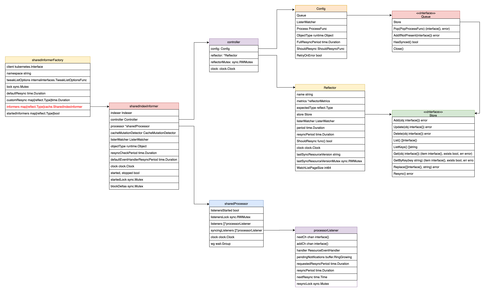
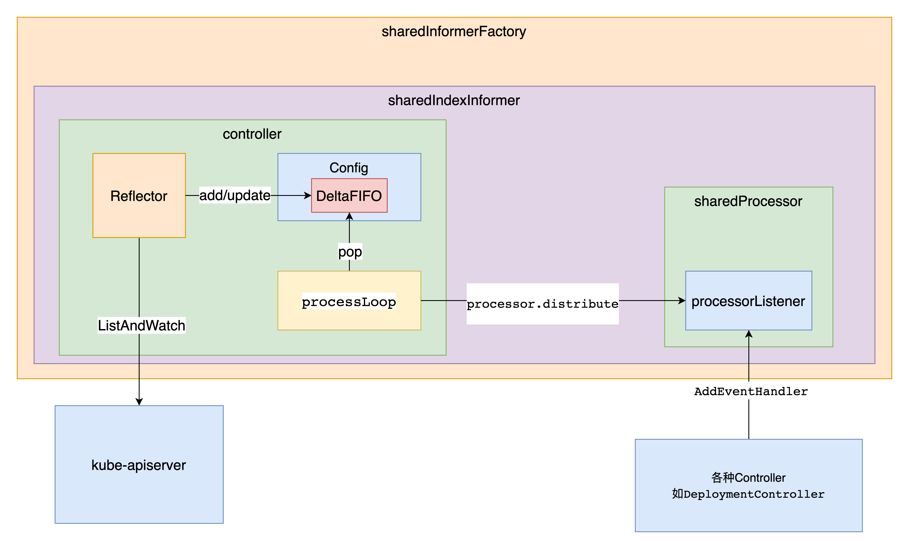

## Informer原理图
为了便于理解, 先上两张图
### 下面这张图为源码的调用流程
可以对照着图中的代码文件及代码行数跟下代码   
注: 图中的代码行数基于`1.15`版

### 下面这张图是用到的数据结构

## Informer 工厂
先来看下`cmd/kube-controller-manager/app/controllermanager.go:162`的`Run`方法
```go
func Run(c *config.CompletedConfig, stopCh <-chan struct{}) error {
...
	run := func(ctx context.Context) {
		rootClientBuilder := controller.SimpleControllerClientBuilder{
			ClientConfig: c.Kubeconfig,
		}
		var clientBuilder controller.ControllerClientBuilder
		if c.ComponentConfig.KubeCloudShared.UseServiceAccountCredentials {
			if len(c.ComponentConfig.SAController.ServiceAccountKeyFile) == 0 {
				// It's possible another controller process is creating the tokens for us.
				// If one isn't, we'll timeout and exit when our client builder is unable to create the tokens.
				klog.Warningf("--use-service-account-credentials was specified without providing a --service-account-private-key-file")
			}

			if shouldTurnOnDynamicClient(c.Client) {
				klog.V(1).Infof("using dynamic client builder")
				//Dynamic builder will use TokenRequest feature and refresh service account token periodically
				clientBuilder = controller.NewDynamicClientBuilder(
					restclient.AnonymousClientConfig(c.Kubeconfig),
					c.Client.CoreV1(),
					"kube-system")
			} else {
				klog.V(1).Infof("using legacy client builder")
				clientBuilder = controller.SAControllerClientBuilder{
					ClientConfig:         restclient.AnonymousClientConfig(c.Kubeconfig),
					CoreClient:           c.Client.CoreV1(),
					AuthenticationClient: c.Client.AuthenticationV1(),
					Namespace:            "kube-system",
				}
			}
		} else {
			clientBuilder = rootClientBuilder
		}
		controllerContext, err := CreateControllerContext(c, rootClientBuilder, clientBuilder, ctx.Done())
		if err != nil {
			klog.Fatalf("error building controller context: %v", err)
		}
		saTokenControllerInitFunc := serviceAccountTokenControllerStarter{rootClientBuilder: rootClientBuilder}.startServiceAccountTokenController

		if err := StartControllers(controllerContext, saTokenControllerInitFunc, NewControllerInitializers(controllerContext.LoopMode), unsecuredMux); err != nil {
			klog.Fatalf("error starting controllers: %v", err)
		}

		controllerContext.InformerFactory.Start(controllerContext.Stop)
		controllerContext.GenericInformerFactory.Start(controllerContext.Stop)
		close(controllerContext.InformersStarted)

		select {}
	}
}
...
```
上面代码中比较重要的几个方法`CreateControllerContext`, `StartControllers`, `controllerContext.InformerFactory.Start`
### 创建ControllerContext
再次进入`CreateControllerContext`方法中, 一直跟下去, 最终会调用到`vendor/k8s.io/client-go/informers/factory.go:108`的`NewSharedInformerFactoryWithOptions`方法
```go
func NewSharedInformerFactoryWithOptions(client kubernetes.Interface, defaultResync time.Duration, options ...SharedInformerOption) SharedInformerFactory {
	factory := &sharedInformerFactory{
		client:           client,
		namespace:        v1.NamespaceAll,
		defaultResync:    defaultResync,
		informers:        make(map[reflect.Type]cache.SharedIndexInformer),
		startedInformers: make(map[reflect.Type]bool),
		customResync:     make(map[reflect.Type]time.Duration),
	}

	// Apply all options
	for _, opt := range options {
		factory = opt(factory)
	}

	return factory
}
```
从上面的代码中, `sharedInformerFactory`结构体中, 有一个`informers`的`map`, 这个map的key为资源类型, value为关注该资源类型的Informer
### 启动所有内置的Controller
再来看`StartControllers`方法, 调用`StartControllers`之前, 会先调用`NewControllerInitializers`方法
```go
func NewControllerInitializers(loopMode ControllerLoopMode) map[string]InitFunc {
	controllers := map[string]InitFunc{}
    ...
	controllers["deployment"] = startDeploymentController
    ...

	return controllers
}
```
通过这个方法可以返回所有的内置controller, 这里map中的value存的只是相应的回调函数, 此时还没调用, 在`StartControllers`方法中会实际调用.   
接下来调用StartControllers方法
```go
func StartControllers(ctx ControllerContext, startSATokenController InitFunc, controllers map[string]InitFunc, unsecuredMux *mux.PathRecorderMux) error {
    ...
	for controllerName, initFn := range controllers {
        ...
		debugHandler, started, err := initFn(ctx)
		...
	}

	return nil
}
```
这里循环`NewControllerInitializers`方法返回的所有controller, 取到map的value, 然后调用.   
#### 启动各个Controller
再来看上一步的`initFn`, 也就是各个`startXXXController`方法, 我们以`startDeploymentController`为例,
```go
func startDeploymentController(ctx ControllerContext) (http.Handler, bool, error) {
	if !ctx.AvailableResources[schema.GroupVersionResource{Group: "apps", Version: "v1", Resource: "deployments"}] {
		return nil, false, nil
	}
	dc, err := deployment.NewDeploymentController(
		ctx.InformerFactory.Apps().V1().Deployments(),
		ctx.InformerFactory.Apps().V1().ReplicaSets(),
		ctx.InformerFactory.Core().V1().Pods(),
		ctx.ClientBuilder.ClientOrDie("deployment-controller"),
	)
	if err != nil {
		return nil, true, fmt.Errorf("error creating Deployment controller: %v", err)
	}
	go dc.Run(int(ctx.ComponentConfig.DeploymentController.ConcurrentDeploymentSyncs), ctx.Stop)
	return nil, true, nil
}
```
`deployment.NewDeploymentController`函数创建了`Deployment Controller`，而该创建函数的前三个参数分别为 Deployment、ReplicaSet、Pod 的 Informer. 可以看到, Informer的单例工厂以 ApiGroup 为路径提供了不同资源的 Informer.

`.Apps().V1().Deployments()`方法返回的虽然叫`DeploymentInformer`, 但这不是真正的Informer
```go
func (v *version) Deployments() DeploymentInformer {
	return &deploymentInformer{factory: v.factory, namespace: v.namespace, tweakListOptions: v.tweakListOptions}
}
```
真正的`Informer`是在调用`NewDeploymentController` -> `dInformer.Informer()` -> `f.factory.InformerFor`方法创建的
```go
func NewDeploymentController(dInformer appsinformers.DeploymentInformer, rsInformer appsinformers.ReplicaSetInformer, podInformer coreinformers.PodInformer, client clientset.Interface) (*DeploymentController, error) {
	eventBroadcaster := record.NewBroadcaster()
	eventBroadcaster.StartLogging(klog.Infof)
	eventBroadcaster.StartRecordingToSink(&v1core.EventSinkImpl{Interface: client.CoreV1().Events("")})

	if client != nil && client.CoreV1().RESTClient().GetRateLimiter() != nil {
		if err := metrics.RegisterMetricAndTrackRateLimiterUsage("deployment_controller", client.CoreV1().RESTClient().GetRateLimiter()); err != nil {
			return nil, err
		}
	}
	dc := &DeploymentController{
		client:        client,
		eventRecorder: eventBroadcaster.NewRecorder(scheme.Scheme, v1.EventSource{Component: "deployment-controller"}),
		queue:         workqueue.NewNamedRateLimitingQueue(workqueue.DefaultControllerRateLimiter(), "deployment"),
	}
	dc.rsControl = controller.RealRSControl{
		KubeClient: client,
		Recorder:   dc.eventRecorder,
	}

	dInformer.Informer().AddEventHandler(cache.ResourceEventHandlerFuncs{
		AddFunc:    dc.addDeployment,
		UpdateFunc: dc.updateDeployment,
		// This will enter the sync loop and no-op, because the deployment has been deleted from the store.
		DeleteFunc: dc.deleteDeployment,
	})
	rsInformer.Informer().AddEventHandler(cache.ResourceEventHandlerFuncs{
		AddFunc:    dc.addReplicaSet,
		UpdateFunc: dc.updateReplicaSet,
		DeleteFunc: dc.deleteReplicaSet,
	})
	podInformer.Informer().AddEventHandler(cache.ResourceEventHandlerFuncs{
		DeleteFunc: dc.deletePod,
	})

	dc.syncHandler = dc.syncDeployment
	dc.enqueueDeployment = dc.enqueue

	dc.dLister = dInformer.Lister()
	dc.rsLister = rsInformer.Lister()
	dc.podLister = podInformer.Lister()
	dc.dListerSynced = dInformer.Informer().HasSynced
	dc.rsListerSynced = rsInformer.Informer().HasSynced
	dc.podListerSynced = podInformer.Informer().HasSynced
	return dc, nil
}

# staging/src/k8s.io/client-go/informers/apps/v1/deployment.go:83
func (f *deploymentInformer) Informer() cache.SharedIndexInformer {
	return f.factory.InformerFor(&appsv1.Deployment{}, f.defaultInformer)
}

# staging/src/k8s.io/client-go/informers/apps/v1/deployment.go:79
func (f *deploymentInformer) defaultInformer(client kubernetes.Interface, resyncPeriod time.Duration) cache.SharedIndexInformer {
	return NewFilteredDeploymentInformer(client, f.namespace, resyncPeriod, cache.Indexers{cache.NamespaceIndex: cache.MetaNamespaceIndexFunc}, f.tweakListOptions)
}

# staging/src/k8s.io/client-go/informers/factory.go:163
func (f *sharedInformerFactory) InformerFor(obj runtime.Object, newFunc internalinterfaces.NewInformerFunc) cache.SharedIndexInformer {
	f.lock.Lock()
	defer f.lock.Unlock()

	informerType := reflect.TypeOf(obj)
	informer, exists := f.informers[informerType]
	if exists {
		return informer
	}

	resyncPeriod, exists := f.customResync[informerType]
	if !exists {
		resyncPeriod = f.defaultResync
	}

	informer = newFunc(f.client, resyncPeriod)
	f.informers[informerType] = informer

	return informer
}
```
从上面的`InformerFor`方法可以看到, 
1. 如果Informer工厂里已经存在informer, 就直接返回了, 也就是说一种资源始终只有一个informer
2. 如果不存在, 则调用传进来的参数`newFunc`实例化informer(注: `newFunc`即为`defaultInformer`, 返回的类型为`cache.SharedIndexInformer`

至此, DeploymentInformer被实例化，并真正的承担Informer的职责, 同时添加到Informer工厂的map中.
### InformerFactory启动
```go
func (f *sharedInformerFactory) Start(stopCh <-chan struct{}) {
	f.lock.Lock()
	defer f.lock.Unlock()

	for informerType, informer := range f.informers {
		if !f.startedInformers[informerType] {
			go informer.Run(stopCh)
			f.startedInformers[informerType] = true
		}
	}
}

# staging/src/k8s.io/client-go/tools/cache/shared_informer.go:242
func (s *sharedIndexInformer) Run(stopCh <-chan struct{}) {
	defer utilruntime.HandleCrash()

	fifo := NewDeltaFIFO(MetaNamespaceKeyFunc, s.indexer)

	cfg := &Config{
		Queue:            fifo,
		ListerWatcher:    s.listerWatcher,
		ObjectType:       s.objectType,
		FullResyncPeriod: s.resyncCheckPeriod,
		RetryOnError:     false,
		ShouldResync:     s.processor.shouldResync,

		Process: s.HandleDeltas,
	}

	func() {
		s.startedLock.Lock()
		defer s.startedLock.Unlock()

		s.controller = New(cfg)
		s.controller.(*controller).clock = s.clock
		s.started = true
	}()

	// Separate stop channel because Processor should be stopped strictly after controller
	processorStopCh := make(chan struct{})
	var wg wait.Group
	defer wg.Wait()              // Wait for Processor to stop
	defer close(processorStopCh) // Tell Processor to stop
	wg.StartWithChannel(processorStopCh, s.cacheMutationDetector.Run)
	wg.StartWithChannel(processorStopCh, s.processor.run)

	defer func() {
		s.startedLock.Lock()
		defer s.startedLock.Unlock()
		s.stopped = true // Don't want any new listeners
	}()
	s.controller.Run(stopCh)
}
```
`sharedIndexInformer`的`Run`方法代码不多, 但是很重要, 这块逻辑即为第一张图中粉红色的地方, 主要做了下面几件事:

1. 初始化fifo队列
2. 初始化controller
3. 启动cacheMutationDetector
4. 启动processor
5. 运行controller(此controller非XXXController)

接下来, 看下这几件事情的详细过程
#### sharedIndexInformer

我们先把视线拉回到上面第一张图片的最右侧, 因为这块做了一些初始化的工作, 以便后面的逻辑使用

```go
func NewSharedIndexInformer(lw ListerWatcher, objType runtime.Object, defaultEventHandlerResyncPeriod time.Duration, indexers Indexers) SharedIndexInformer {
	realClock := &clock.RealClock{}
	sharedIndexInformer := &sharedIndexInformer{
		processor:                       &sharedProcessor{clock: realClock},
		indexer:                         NewIndexer(DeletionHandlingMetaNamespaceKeyFunc, indexers),
		listerWatcher:                   lw,
		objectType:                      objType,
		resyncCheckPeriod:               defaultEventHandlerResyncPeriod,
		defaultEventHandlerResyncPeriod: defaultEventHandlerResyncPeriod,
		cacheMutationDetector:           NewCacheMutationDetector(fmt.Sprintf("%T", objType)),
		clock:                           realClock,
	}
	return sharedIndexInformer
}
```

在`sharedIndexInformer`的初始化逻辑中, 初始化了

1. processor: 提供了 EventHandler 注册和事件分发的功能
2. indexer: 提供了资源缓存的功能
3. listerWatcher: 由模板类提供，包含特定资源的 List 和 Watch 方法
4. objectType: 用来标记关注哪种特定资源类型
5. cacheMutationDetector: 监控 Informer 的缓存

##### sharedProcessor

```go
type sharedProcessor struct {
	listenersStarted bool
	listenersLock    sync.RWMutex
	listeners        []*processorListener
	syncingListeners []*processorListener
	clock            clock.Clock
	wg               wait.Group
}

type processorListener struct {
	nextCh chan interface{}
	addCh  chan interface{}

	handler ResourceEventHandler

	// pendingNotifications is an unbounded ring buffer that holds all notifications not yet distributed.
	// There is one per listener, but a failing/stalled listener will have infinite pendingNotifications
	// added until we OOM.
	// TODO: This is no worse than before, since reflectors were backed by unbounded DeltaFIFOs, but
	// we should try to do something better.
	pendingNotifications buffer.RingGrowing

	// requestedResyncPeriod is how frequently the listener wants a full resync from the shared informer
	requestedResyncPeriod time.Duration
	// resyncPeriod is how frequently the listener wants a full resync from the shared informer. This
	// value may differ from requestedResyncPeriod if the shared informer adjusts it to align with the
	// informer's overall resync check period.
	resyncPeriod time.Duration
	// nextResync is the earliest time the listener should get a full resync
	nextResync time.Time
	// resyncLock guards access to resyncPeriod and nextResync
	resyncLock sync.Mutex
}
```


在`sharedProcessor`结构体中, 可以看到有两个`processorListener`的切片

当我们注册一个 Handler 到 Informer 时, 最终会被转换为一个名为 `processorListener` 结构体的实例：

```go
func newProcessListener(handler ResourceEventHandler, requestedResyncPeriod, resyncPeriod time.Duration, now time.Time, bufferSize int) *processorListener {
	ret := &processorListener{
		nextCh:                make(chan interface{}),
		addCh:                 make(chan interface{}),
		handler:               handler,
		pendingNotifications:  *buffer.NewRingGrowing(bufferSize),
		requestedResyncPeriod: requestedResyncPeriod,
		resyncPeriod:          resyncPeriod,
	}

	ret.determineNextResync(now)

	return ret
}
```

该实例主要包含两个 channel 和外面注册的 Handler 方法。而此处被实例化的 `processorListener` 对象最终会被添加到 `sharedProcessor.listeners` 列表中

```go
func (p *sharedProcessor) addListener(listener *processorListener) {
	p.listenersLock.Lock()
	defer p.listenersLock.Unlock()

	p.addListenerLocked(listener)
	if p.listenersStarted {
		p.wg.Start(listener.run)
		p.wg.Start(listener.pop)
	}
}
```

#### 初始化DeltaFIFO

有了前面初始化的`sharedIndexInformer`, 现在开始解析`sharedIndexInformer`的`Run`方法

```go
fifo := NewDeltaFIFO(MetaNamespaceKeyFunc, s.indexer) // s.indexer再前面已经初始化好

func NewDeltaFIFO(keyFunc KeyFunc, knownObjects KeyListerGetter) *DeltaFIFO {
	f := &DeltaFIFO{
		items:        map[string]Deltas{},
		queue:        []string{},
		keyFunc:      keyFunc,
		knownObjects: knownObjects,
	}
	f.cond.L = &f.lock
	return f
}
```

#### 初始化controller(注意此处的Process字段被赋值为s.HandleDeltas)

```go
cfg := &Config{
	Queue:            fifo,
	ListerWatcher:    s.listerWatcher,
	ObjectType:       s.objectType,
	FullResyncPeriod: s.resyncCheckPeriod,
	RetryOnError:     false,
	ShouldResync:     s.processor.shouldResync,

	Process: s.HandleDeltas,
}
func() {
	s.startedLock.Lock()
	defer s.startedLock.Unlock()
    
	s.controller = New(cfg)
	s.controller.(*controller).clock = s.clock
	s.started = true
}()
```

```go
func New(c *Config) Controller {
	ctlr := &controller{
		config: *c,
		clock:  &clock.RealClock{},
	}
	return ctlr
}
```

#### 启动processor

```go
func (p *sharedProcessor) run(stopCh <-chan struct{}) {
	func() {
		p.listenersLock.RLock()
		defer p.listenersLock.RUnlock()
		for _, listener := range p.listeners {
			p.wg.Start(listener.run)
			p.wg.Start(listener.pop)
		}
		p.listenersStarted = true
	}()
	<-stopCh
	p.listenersLock.RLock()
	defer p.listenersLock.RUnlock()
	for _, listener := range p.listeners {
		close(listener.addCh) // Tell .pop() to stop. .pop() will tell .run() to stop
	}
	p.wg.Wait() // Wait for all .pop() and .run() to stop
}
```

可以看到, 主要是循环`sharedProcessor`里所有的listener, 然后调用了`listener.run`和`listener.pop`

##### listener.run

```go
func (p *processorListener) run() {
	// this call blocks until the channel is closed.  When a panic happens during the notification
	// we will catch it, **the offending item will be skipped!**, and after a short delay (one second)
	// the next notification will be attempted.  This is usually better than the alternative of never
	// delivering again.
	stopCh := make(chan struct{})
	wait.Until(func() {
		// this gives us a few quick retries before a long pause and then a few more quick retries
		err := wait.ExponentialBackoff(retry.DefaultRetry, func() (bool, error) {
			for next := range p.nextCh {
				switch notification := next.(type) {
				case updateNotification:
					p.handler.OnUpdate(notification.oldObj, notification.newObj)
				case addNotification:
					p.handler.OnAdd(notification.newObj)
				case deleteNotification:
					p.handler.OnDelete(notification.oldObj)
				default:
					utilruntime.HandleError(fmt.Errorf("unrecognized notification: %T", next))
				}
			}
			// the only way to get here is if the p.nextCh is empty and closed
			return true, nil
		})

		// the only way to get here is if the p.nextCh is empty and closed
		if err == nil {
			close(stopCh)
		}
	}, 1*time.Minute, stopCh)
}
```

listener 包含了 Controller 注册进来的 Handler 方法，因此 listener 最重要的职能就是当事件发生时来触发这些方法.  

可以看到，`listener.run` 不停的从 `nextCh` 这个 channel 中拿到事件，但是 `nextCh` 这个 channel 里的事件又是从哪来的呢？`listener.pop` 的职责便是将事件放入 `nextCh` 中。

##### listener.pop

```go
func (p *processorListener) pop() {
	defer utilruntime.HandleCrash()
	defer close(p.nextCh) // Tell .run() to stop

	var nextCh chan<- interface{}
	var notification interface{}
	for {
		select {
		case nextCh <- notification:
			// Notification dispatched
			var ok bool
			notification, ok = p.pendingNotifications.ReadOne()
			if !ok { // Nothing to pop
				nextCh = nil // Disable this select case
			}
		case notificationToAdd, ok := <-p.addCh:
			if !ok {
				return
			}
			if notification == nil { // No notification to pop (and pendingNotifications is empty)
				// Optimize the case - skip adding to pendingNotifications
				notification = notificationToAdd
				nextCh = p.nextCh
			} else { // There is already a notification waiting to be dispatched
				p.pendingNotifications.WriteOne(notificationToAdd)
			}
		}
	}
}
```

`listener` 之所以包含了两个 channel：`addCh` 和 `nextCh`，是因为 Informer 无法预知 `listener.handler` 的事件消费的速度是否大于事件生产的速度，因此添加了一个名为 `pendingNotifications` 的缓冲队列来保存未来得及消费的事件

`pop` 方法一方面会不停的从 `addCh` 中获得最新事件，以保证不会让生产方阻塞。然后判断是否存在 buffer，如果存在则把事件添加到 buffer 中，如果不存在则尝试推给 `nextCh`。

而另一方面，会判断 buffer 中是否还有事件，如果还有存量，则不停的传递给 `nextCh`。

`pop` 方法实现了一个带 buffer 的分发机制，使得事件可以源源不断的从 `addCh` 到 `nextCh`

#### 运行controller

```go
func (c *controller) Run(stopCh <-chan struct{}) {
	defer utilruntime.HandleCrash()
	go func() {
		<-stopCh
		c.config.Queue.Close()
	}()
	r := NewReflector(
		c.config.ListerWatcher,
		c.config.ObjectType,
		c.config.Queue,
		c.config.FullResyncPeriod,
	)
	r.ShouldResync = c.config.ShouldResync
	r.clock = c.clock

	c.reflectorMutex.Lock()
	c.reflector = r
	c.reflectorMutex.Unlock()

	var wg wait.Group
	defer wg.Wait()

	wg.StartWithChannel(stopCh, r.Run)

	wait.Until(c.processLoop, time.Second, stopCh)
}
```

##### 初始化Reflector并启动

`Reflector`通过 sharedIndexInformer 里定义的 `listerWatcher` 进行 List-Watch，并将获得的事件推入 DeltaFIFO 中, `controller` 启动之后会先将 `Reflector` 启动

##### 执行c.processLoop

```go
func (c *controller) processLoop() {
	for {
		obj, err := c.config.Queue.Pop(PopProcessFunc(c.config.Process))
		if err != nil {
			if err == FIFOClosedError {
				return
			}
			if c.config.RetryOnError {
				// This is the safe way to re-enqueue.
				c.config.Queue.AddIfNotPresent(obj)
			}
		}
	}
}
```

通过一个死循环，不停的将从 DeltaFIFO 读出需要处理的资源事件, 然后交给`c.config.Process`函数处理, 在前面初始化controller时, `c.config.Process`被赋值为`s.HandleDeltas`

```go
func (s *sharedIndexInformer) HandleDeltas(obj interface{}) error {
	s.blockDeltas.Lock()
	defer s.blockDeltas.Unlock()

	// from oldest to newest
	for _, d := range obj.(Deltas) {
		switch d.Type {
		case Sync, Added, Updated:
			isSync := d.Type == Sync
			s.cacheMutationDetector.AddObject(d.Object)
			if old, exists, err := s.indexer.Get(d.Object); err == nil && exists {
				if err := s.indexer.Update(d.Object); err != nil {
					return err
				}
				s.processor.distribute(updateNotification{oldObj: old, newObj: d.Object}, isSync)
			} else {
				if err := s.indexer.Add(d.Object); err != nil {
					return err
				}
				s.processor.distribute(addNotification{newObj: d.Object}, isSync)
			}
		case Deleted:
			if err := s.indexer.Delete(d.Object); err != nil {
				return err
			}
			s.processor.distribute(deleteNotification{oldObj: d.Object}, false)
		}
	}
	return nil
}
```

这里调用了`s.indexer.Add` `s.indexer.Update` `s.indexer.Delete`以及`s.processor.distribute`

`s.indexer.Add` `s.indexer.Update` `s.indexer.Delete`最后都调用了`queueActionLocked`方法

```go
func (f *DeltaFIFO) queueActionLocked(actionType DeltaType, obj interface{}) error {
	id, err := f.KeyOf(obj)
	if err != nil {
		return KeyError{obj, err}
	}

	newDeltas := append(f.items[id], Delta{actionType, obj})
	newDeltas = dedupDeltas(newDeltas)

	if len(newDeltas) > 0 {
		if _, exists := f.items[id]; !exists {
			f.queue = append(f.queue, id)
		}
		f.items[id] = newDeltas
		f.cond.Broadcast()
	} else {
		// We need to remove this from our map (extra items in the queue are
		// ignored if they are not in the map).
		delete(f.items, id)
	}
	return nil
}
```

而`s.processor.distribute`是把事件分发到listener

```go
func (p *sharedProcessor) distribute(obj interface{}, sync bool) {
	p.listenersLock.RLock()
	defer p.listenersLock.RUnlock()

	if sync {
		for _, listener := range p.syncingListeners {
			listener.add(obj)
		}
	} else {
		for _, listener := range p.listeners {
			listener.add(obj)
		}
	}
}

func (p *processorListener) add(notification interface{}) {
	p.addCh <- notification
}
```

可以看到, `distribute`方法调用`listener.add`, `listener.add`会将事件发送到`addCh`

至此, 整个事件流就打通了, 如下图

## 总结
Informer机制是kubernetes的核心, 了解清楚这个机制, 后续理解controller manager就容易多了, 而且也能更得心应手的编写自定义的controller.
## 参考资料
- [Source code](https://github.com/kubernetes/client-go)