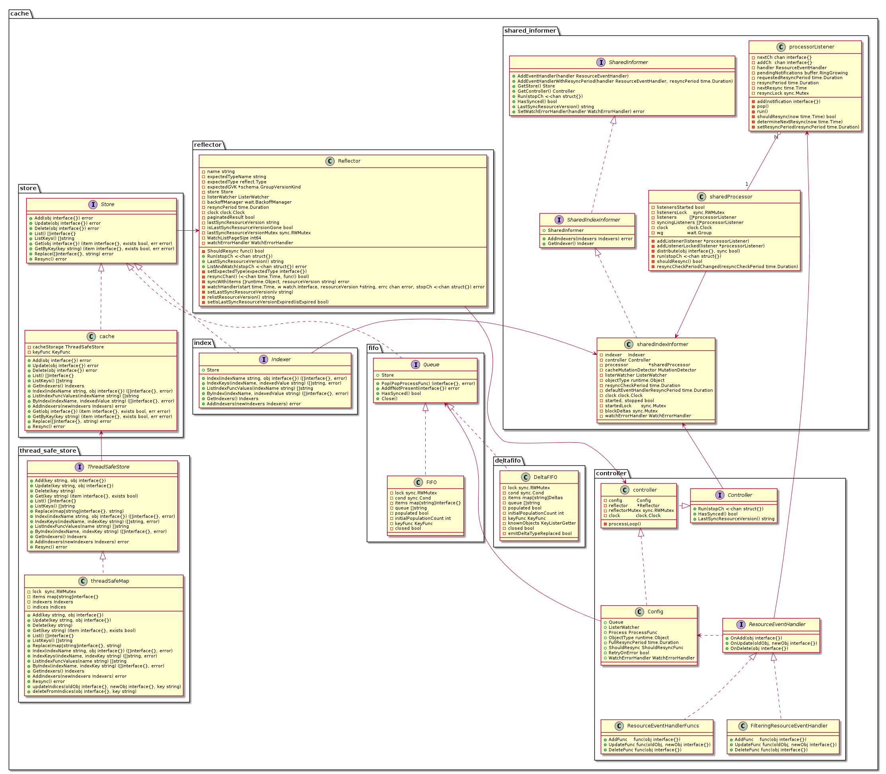
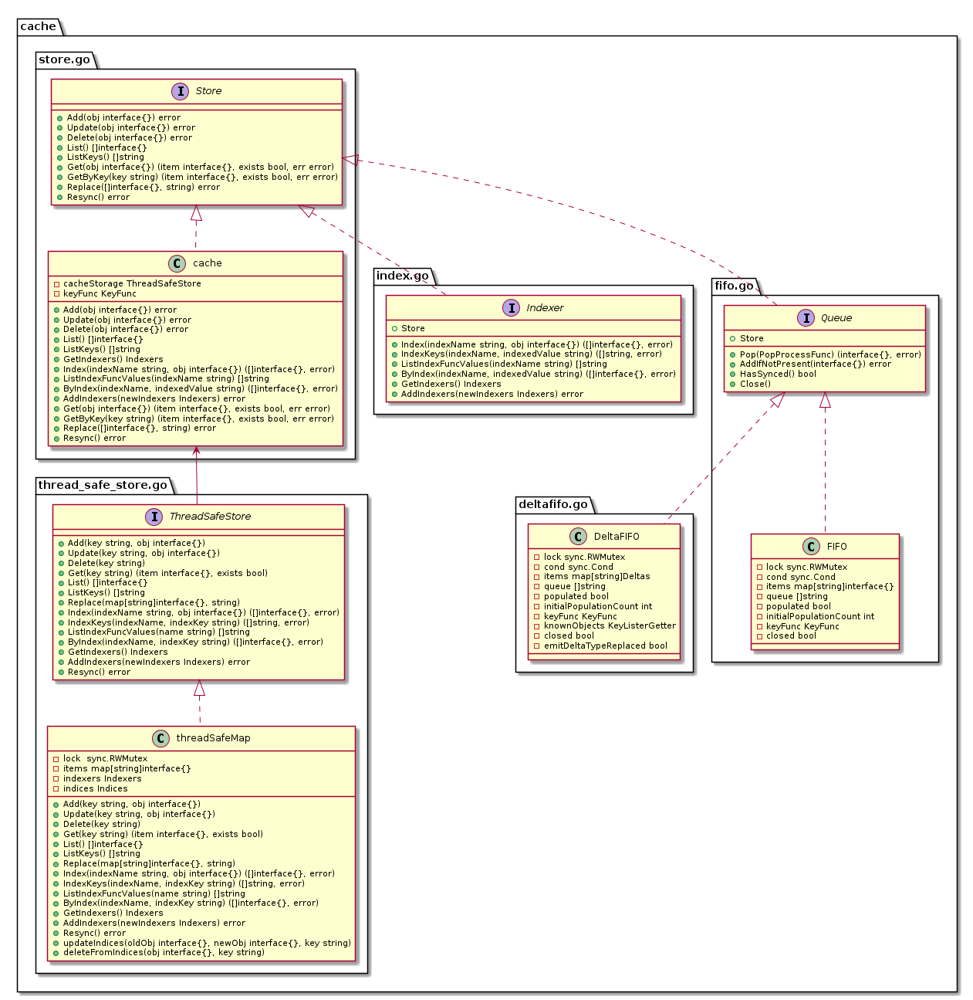
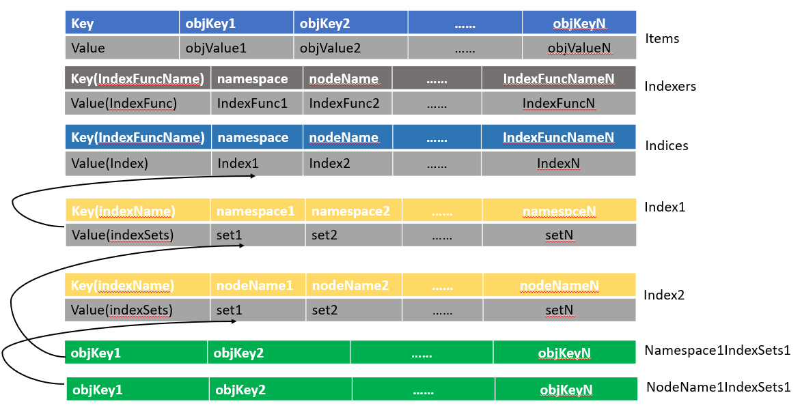
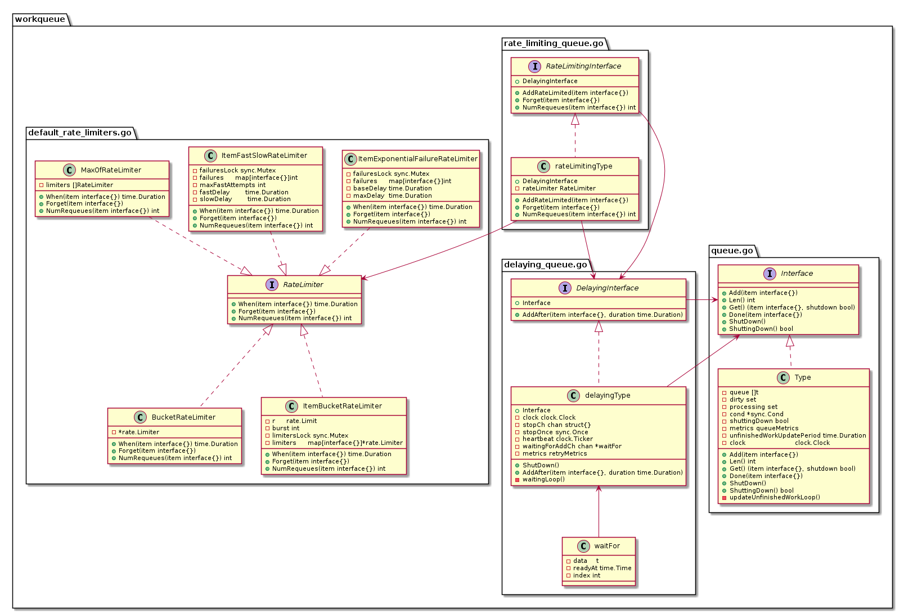

目前在云原生社区的 Kubernetes 源码研习社中和广大学友们共同学习郑东旭大佬的 [Kubernetes 源码剖析](https://item.jd.com/12665791.html)这本书。当前正在开展第一期学习活动，第五章节 client-go 的学习。之所以从这一章节开始学习，主要是考虑到 client-go 在源码中相对比较独立，可以单独阅读。更主要的是它是 Kubernetes 的核心处理框架，基本上运用在 Kubernetes 各个组件中，因此，如果你学好了这一章节，对于后面 Kubernetes 源码的阅读，将会有很大的帮助。此外随着 Operator 的盛行，一些开源的生成框架也受到广大 Operator 开发者们的青睐。例如 kubebuilder 和 operator-SDK 等。而精通了 client-go，将对你理解这些生成框架及编写 Operator 也是有很好的帮助。

下面内容是在学习过程中总结的相关笔记及个人见解。

## 概括

client-go 是用 Golang 语言编写的官方编程式交互客户端库，提供对 Kubernetes API server 服务的交互访问。

其源码目录结构如下：

1. **discovery**: 提供 DiscoveryClient 发现客户端。
2. **dynamic**: 提供 DynamicClient 动态客户端。
3. **informers**: 每种 K8S 资源的 Informer 实现。
4. **kubernetes**: 提供 ClientSet 客户端。
5. **listers**: 为每一个 K8S 资源提供 Lister 功能，该功能对 Get 和 List 请求提供只读的缓存数据。
6. **plugin**: 提供 OpenStack，GCP 和 Azure 等云服务商授权插件。
7. **rest**: 提供 RESTClient 客户端，对 K8S API Server 执行 RESTful 操作。
8. **scale**: 提供 ScaleClient 客户端，用于扩容或缩容 Deployment, Replicaset, Replication Controller 等资源对象。
9. **tools**: 提供常用工具，例如 SharedInformer, Reflector, DeltaFIFO 及 Indexers。 提供 Client 查询和缓存机制，以减少向 kube-apiserver 发起的请求数等。主要子目录为/tools/cache。
10. **transport**: 提供安全的 TCP 连接，支持 HTTP Stream，某些操作需要在客户端和容器之间传输二进制流，例如 exec，attach 等操作。该功能由内部的 SPDY 包提供支持。
11. **util**: 提供常用方法。例如 WorkQueue 工作队列，Certificate 证书管理等。

## RESTClient 客户端

RESTful Client 是最基础的客户端，它主要是对 HTTP 请求进行了封装，并且支持 JSON 和 Protobuf 格式数据。

## DynamicClient 客户端

DynamicClient 是一种动态客户端，它可以动态的指定资源的组，版本和资源。因此它可以对任意 K8S 资源进行 RESTful 操作，包括 CRD 自定义资源。它封装了 RESTClient。所以同样提供 RESTClient 的各种方法。

具体使用方法，可参考官方示例：[dynamic-create-update-delete-deployment](https://github.com/kubernetes/client-go/tree/master/examples/dynamic-create-update-delete-deployment)。

**注意**: 该官方示例是基于集群外的环境，如果你需要在集群内部使用（例如你需要在 container 中访问），你将需要调用 `rest.InClusterConfig()` 生成一个 configuration。具体的示例请参考 [in-cluster-client-configuration](https://github.com/kubernetes/client-go/tree/master/examples/in-cluster-client-configuration)。

## ClientSet 客户端

ClientSet 客户端在 RESTClient 的基础上封装了对资源和版本的管理方法。每个资源可以理解为一个客户端，而 ClientSet 则是多个客户端的集合，每一个资源和版本都以函数的方式暴露给开发者。

具体使用方法，可参考官方示例：[create-update-delete-deployment](https://github.com/kubernetes/client-go/tree/master/examples/create-update-delete-deployment)。

## DiscoveryClient 客户端

DiscoveryClient 是一个发现客户端，它主要用于发现 K8S API Server 支持的资源组，资源版本和资源信息。所以开发者可以通过使用 DiscoveryClient 客户端查看所支持的资源组，资源版本和资源信息。

## ClientSet VS DynamicClient

类型化 `ClientSets` 使得使用预先生成的本地 API 对象与 API 服务器通信变得简单，从而获得类似 `RPC` 的编程体验。类型化客户端使用程序编译来强制执行数据安全性和一些验证。然而，在使用类型化客户端时，程序被迫与所使用的版本和类型紧密耦合。

而 `DynamicClient` 则使用 `unstructured.Unstructured` 表示来自 API Server 的所有对象值。`Unstructured` 类型是一个嵌套的 `map[string]inferface{}` 值的集合来创建一个内部结构，该结构和服务端的 REST 负载非常相似。

`DynamicClient` 将所有数据绑定推迟到运行时，这意味着程序运行之前，使用 `DynamicClient` 的的程序将不会获取到类型验证的任何好处。对于某些需要强数据类型检查和验证的应用程序来说，这可能是一个问题。

然而，松耦合意味着当客户端 API 发生变化时，使用 `DynamicClient` 的程序不需要重新编译。客户端程序在处理 API 表面更新时具有更大的灵活性，而无需提前知道这些更改是什么。

## Informer 分析

这是一个官方图形表示，展示了client-go 库中的各种组件如何工作，以及它们与将要编写的自定义控制器代码的交互点。


下面对图中每个组件进行简单介绍：

1. ***client-go 组件***
    * **Reflector**: 定义在 [/tools/cache 包内的 Reflector 类型](https://github.com/kubernetes/client-go/blob/master/tools/cache/reflector.go) 中的 reflector 监视 Kubernetes API 以获取指定的资源类型 (Kind)。完成此操作的函数是 ListAndWatch。监视可以用于内建资源，也可以用于自定义资源。当 reflector 通过监视 API 的收到关于新资源实例存在的通知时，它使用相应的 listing API 获取新创建的对象，并将其放入 watchHandler 函数内的 Delta Fifo 队列中。

    * **Informer**: 在 [/tools/cache 包内的基础 controller](https://github.com/kubernetes/client-go/blob/master/tools/cache/controller.go) 中定义的一个 informer 从 Delta FIFO 队列中弹出对象。完成此操作的函数是 processLoop。这个基础 controller 的任务是保存对象以供以后检索，并调用 controller 将对象传递给它。

    * **Indexer**: indexer 为对象提供索引功能。它定义在 [/tools/cache 包内的 Indexer 类型](https://github.com/kubernetes/client-go/blob/master/tools/cache/index.go)。一个典型的索引用例是基于对象标签创建索引。Indexer 可以基于多个索引函数维护索引。Indexer 使用线程安全的数据存储来存储对象及其键值。在 [/tools/cache 包内的 Store 类型](https://github.com/kubernetes/client-go/blob/master/tools/cache/store.go) 定义了一个名为`MetaNamespaceKeyFunc`的默认函数，该函数为该对象生成一个名为 `<namespace>/<name>` 组合的对象键值。

2. ***Custom Controller 组件***
    * **Informer reference**: 这是一个知道如何使用自定义资源对象的 Informer 实例的引用。您的自定义控制器代码需要创建适当的 Informer。

    * **Indexer reference**: 这是一个知道如何使用自定义资源对象的 Indexer 实例的引用。您的自定义控制器代码需要创建这个。您将使用此引用检索对象，以便稍后处理。

    * **Resource Event Handlers**: 当 Informer 想要分发一个对象给你的控制器时，会调用这些回调函数。编写这些函数的典型模式是获取已分配对象的键值，并将该键值放入一个工作队列中进行进一步处理。

    * **Work queue**: 这是在控制器代码中创建的队列，用于将对象的分发与处理解耦。编写 Resource Event Handler 函数来提取所分发对象的键值并将其添加到工作队列中。

    * **Process Item**: 这是在代码中创建的处理 work queue 中的 items 的函数。可以有一个或多个其他函数来执行实际的处理。这些函数通常使用 [Indexer 引用](https://github.com/kubernetes/client-go/blob/master/examples/workqueue/main.go#L73) 或 Listing wrapper 来获取与键值对应的对象。

### Informer 源码类图



该类图主要描述了 Informer 中主要的接口和类之前的调用关系。大家可以参考这个类图去阅读源码。其中每个类或接口具体功能，请参考 [Kubernetes 源码剖析](https://item.jd.com/12665791.html)第五章节 client-go。

### Indexer 分析

1. **Store** : 是一个通用对象存储和处理接口。
2. **Indexer** : Indexer 扩展了多个索引的 Store，并限制每个累加器只保存当前对象（删除后为空）。
3. **cache** : 根据 ThreadSafeStore 和关联的 KeyFunc 实现的 Indexer。
4. **ThreadSafeStore** : 是一个允许对存储后端进行并发索引访问的接口。它类似于 Indexer，但不（必须）知道如何从给定对象中提取存储键。
5. **threadSafeMap** : 实现了 ThreadSafeStore。

下面为具体的类图展示：



### threadSafeMap 分析

**threadSafeMap** 类中包含下面三个属性：

1. `items map[string]interface{}` 保存所有数据的 map 结构。
2. `indexers Indexers` 通过一个名字映射一个 IndexFunc 索引处理函数。
3. `indices Indices` 通过一个名字映射一个 Index。  

下面是 threadSafeMap 结构的源码定义：

```go
// threadSafeMap implements ThreadSafeStore
type threadSafeMap struct {
    lock  sync.RWMutex
    items map[string]interface{}

    // indexers maps a name to an IndexFunc
    indexers Indexers
    // indices maps a name to an Index
    indices Indices
}
```

下面是 Indexers, Indices and Index 的源码定义：

```go
// IndexFunc knows how to compute the set of indexed values for an object.
type IndexFunc func(obj interface{}) ([]string, error)

// Index maps the indexed value to a set of keys in the store that match on that value
type Index map[string]sets.String

// Indexers maps a name to a IndexFunc
type Indexers map[string]IndexFunc

// Indices maps a name to an Index
type Indices map[string]Index
```

这是一个 threadSafeMap 存储结构的示例图：



最后以添加一个新的对象到 threadSafeMap 为例，分析具体需要哪些操作。

首先列出源码以供参考：

```go
func (c *threadSafeMap) Add(key string, obj interface{}) {
    c.lock.Lock()
    defer c.lock.Unlock()
    oldObject := c.items[key]
    c.items[key] = obj
    c.updateIndices(oldObject, obj, key)
}

// updateIndices modifies the objects location in the managed indexes, if this is an update, you must provide an oldObj
// updateIndices must be called from a function that already has a lock on the cache
func (c *threadSafeMap) updateIndices(oldObj interface{}, newObj interface{}, key string) {
    // if we got an old object, we need to remove it before we add it again
    if oldObj != nil {
        c.deleteFromIndices(oldObj, key)
    }
    for name, indexFunc := range c.indexers {
        indexValues, err := indexFunc(newObj)
        if err != nil {
            panic(fmt.Errorf("unable to calculate an index entry for key %q on index %q: %v", key, name, err))
        }
        index := c.indices[name]
        if index == nil {
            index = Index{}
            c.indices[name] = index
        }

        for _, indexValue := range indexValues {
            set := index[indexValue]
            if set == nil {
                set = sets.String{}
                index[indexValue] = set
            }
            set.Insert(key)
        }
    }
}
```

从上面代码可以总结出下面几个步骤：

1. 从 items 中获取旧的对象值，并将新的对象添加到 items 中指定键值的位置。
2. 将新加入对象的键值更新到索引中。
   1. 如果旧的对象存在，则将其从索引中删除，否则进行下一步。
   2. 迭代 indexers 进行新对象的索引处理。
   3. 通过 indexers 中的 indexFunc 处理新对象，找到相应的 indexValues。
   4. 使用 indexer 的 name 从 indices 中找到对应的 index。如果对应的 index 是空，则创建一个新的 index。
   5. 迭代 indexValues 进行 index 处理。
   6. 通过 indexValue 在 index 中找到对应的 set， 如果 set 不存在，则创建一个新的 set。并添加到 index 中。
   7. 添加新对象的键值到 set 中。
   8. 返回第 5 步，直到迭代完成。
   9. 返回第 2 步，直到迭代完成。

## WorkQueue 分析

**Interface** : FIFO 队列接口，并支持去重处理。

**DelayingInterface**: 延迟队列接口，基于 **Interface** 接口封装。

**RateLimitingInterface**: 速率限制接口，基于 **DelayingInterface** 接口封装。

下面是相关类图：



## 示例参考

1. 参考 K8S 官方示例 [Kubernetes/sample-controller](https://github.com/kubernetes/sample-controller)。

2. 参考 client-go 官方示例 [workqueue](https://github.com/kubernetes/client-go/tree/master/examples/workqueue)。这是一个典型的使用 client-go informer 的例子，它完全基于 client-go informer 的框架。几乎所有的 K8S 控制器都是基于这个框架实现的。所以个人认为 client-go 的 informer 机制是 k8S controller 实现的基石。

## 总结

可以说 Kubernetes 是当前云原生的基石。所以想要进军云原生领域，kubernetes 的学习必不可少。kubernetes 的设计理念就是通过各种控制器将系统的实际运行状态协调到声明 API 中的期待状态。而这种协调机制就是基于 client-go 实现的。同样，kubernetes 对于 ETCD 存储的缓存处理也使用到了 client-go 中的 Reflector 机制。所以学好 client-go，等于迈入了 Kubernetes 的大门。

学习 Kubernetes 及更多云原生相关技术是一个漫长的过程。所以需要一个人有极强的意志力和学习动力。如果你觉得自己缺乏这些能力，可以加入我们 [云原生社区](https://cloudnative.to/)。大家一起学习，相互督促，相互分享，相互学习，相互成长。

最后送自己和正在学习及将要学习 Kubernetes 源码的同学们一句话：**不积跬步，无以至千里；不积小流，无以成江海！**

## 参考文章

- [Source code](https://github.com/kubernetes/client-go)
- [Kubernetes client-go 库介绍和源码解析](https://github.com/opsnull/kubernetes-dev-docs/tree/master/client-go)
- [Client-Go informer 机制](https://tangxusc.github.io/blog/2019/05/client-go-informer%E6%9C%BA%E5%88%B6/)
- [informer 之 store 和 index](https://www.jianshu.com/p/76e7b1a57d2c)
- [Kubernetes Client-Go Informer 实现源码剖析](https://xigang.github.io/2019/09/21/client-go/)
- [client-go package Informer source code analysis](http://www.programmersought.com/article/6135240470/)
- [kube-controller-manager 源码分析（三）之 Informer 机制](https://www.huweihuang.com/kubernetes-notes/code-analysis/kube-controller-manager/sharedIndexInformer.html)
- [Sample-controller](https://github.com/kubernetes/sample-controller/blob/master/docs/controller-client-go.md)
- [Indexer](https://studygolang.com/articles/20402)
