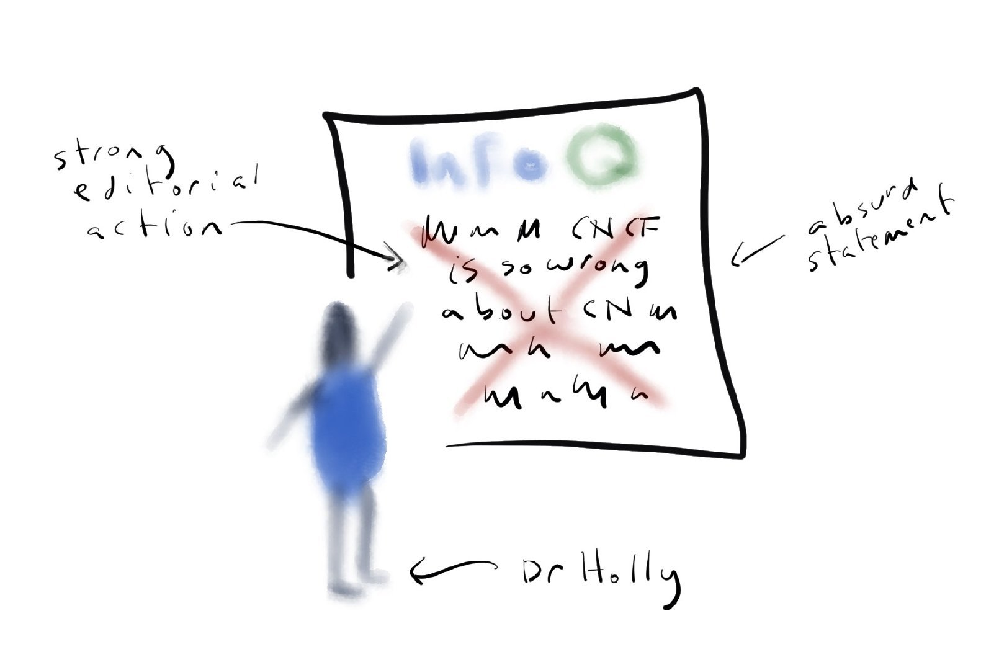
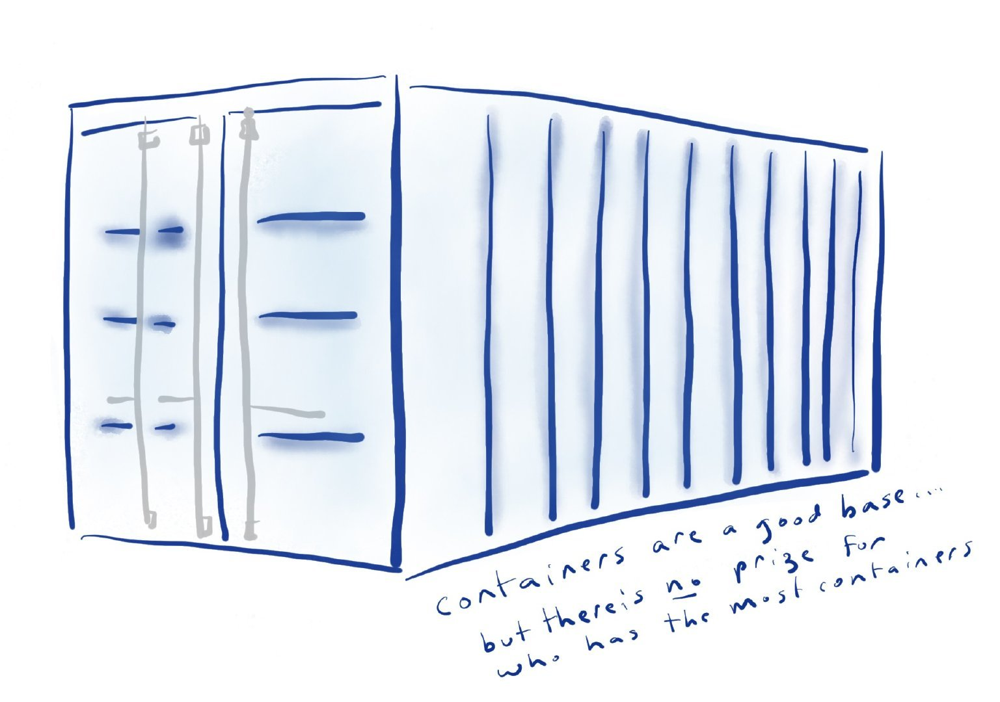
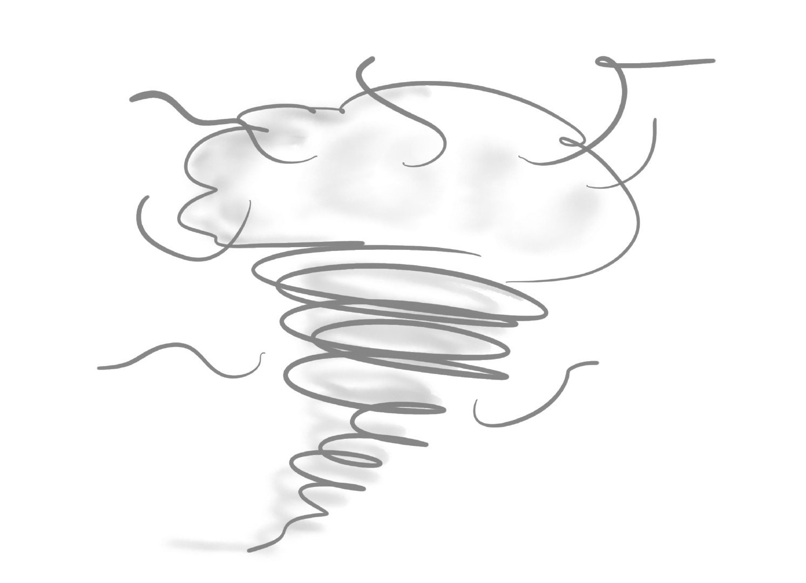
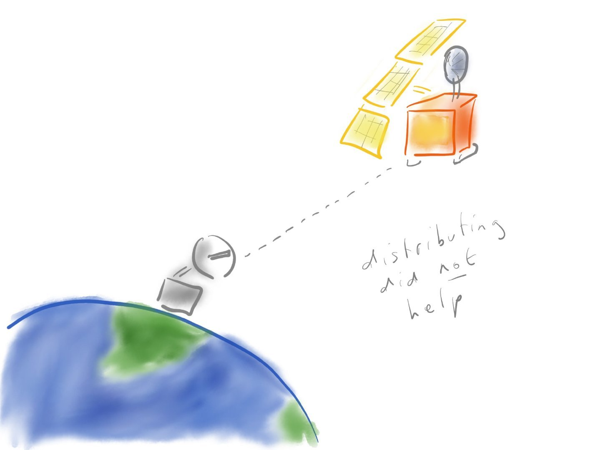
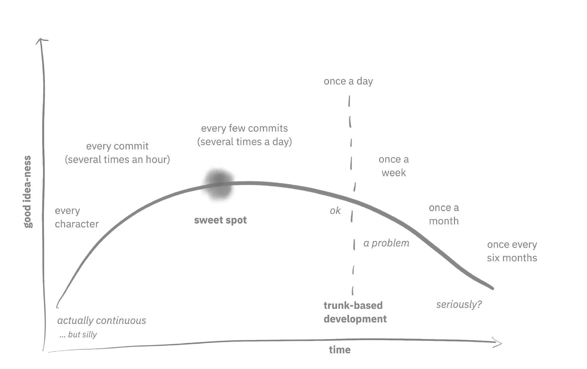
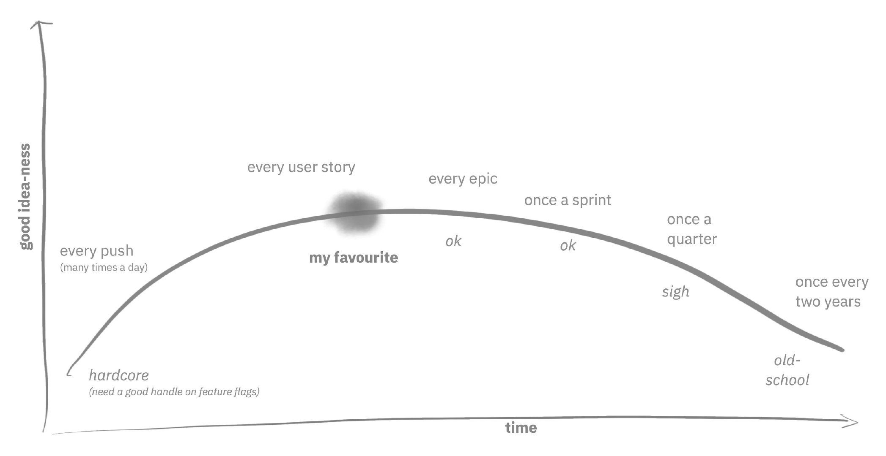
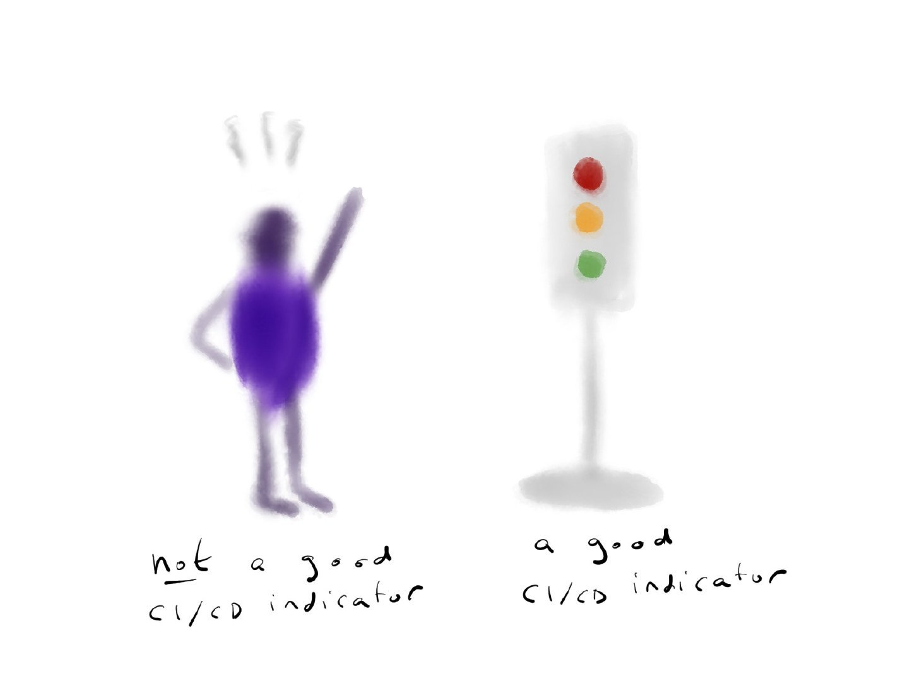
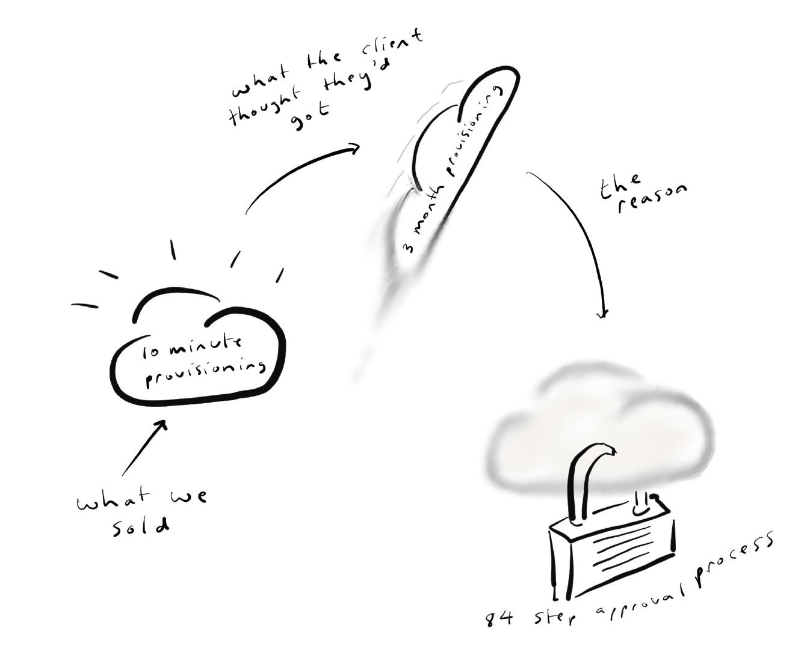
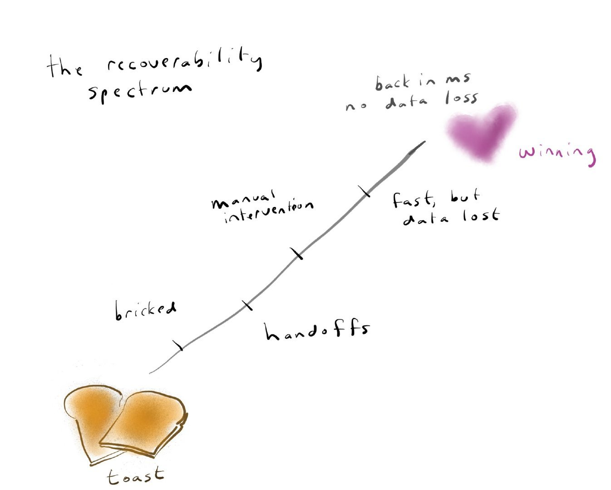

本文译自 [Cloud-Native Is about Culture, Not Containers](https://www.infoq.com/articles/cloud-native-culture/)，文章洋洋洒洒上万字，作者总结了她见过的云原生失败的各种经验教训，还用生动的示例说明了什么不是云原生。译者是在周末闲暇时间仓促间翻译的，其中难免有不当之处，请读者指正。

---

本文主要观点：

- 不需要一味的微服务，就可以做到非常的云原生。
- 在开始云原生转型之前，必须明确云原生对你的团队意味着什么，以及要解决的真正问题是什么。
- 如果发布涉及繁琐的仪式，不经常发布，而且所有的微服务都必须同时发布，那么微服务架构的好处将无法得到落实。
- 持续集成和部署是你要做的事情，而不是你买的工具。 
- 过度的治理扼杀了云的效率，但如果你对消耗的东西不够重视，就会造成严重的浪费。

在去年的伦敦 QCon 大会上，我提供了一个关于文化而非容器的云原生会议。让我开始思考文化在云原生中的作用的是 [Bilgin Ibryam](https://www.infoq.com/articles/microservices-post-kubernetes/) 一篇很棒的 [InfoQ 文章](https://www.infoq.com/articles/microservices-post-kubernetes/)。Bilgin 做的其中一件事是将云原生架构定义为很多微服务，通过智能管道连接。我看了之后，觉得它看起来完全不像我写的应用，尽管我认为我在写云原生应用。我是 IBM Garage 的一员，帮助客户实现云原生，然而我很少在我的应用中使用微服务。我创建的应用大多看起来和 Bilgin 的图完全不一样。这是否意味着我做错了，或者说云原生的定义可能有点复杂？

我不想把 Bilgin 单列出来，因为 Bilgin 的文章叫《后 Kubernetes 时代的微服务》，所以如果他在那篇文章中不是经常说到微服务，那就有点可笑了。事实也是如此，几乎所有关于云原生的定义都把它等同于微服务。无论在哪里，我都不断看到这样的假设：微服务等于云原生，云原生等于微服务。就连云原生计算基金会（CNCF）也曾经把云原生定义为：都是微服务，都是容器，还有一点动态编排在里面。说云原生并不总是涉及微服务，这让我陷入了这个特殊的境地，因为我不仅说 Bilgin 错了，我还说云原生计算基金会错了 —— 他们对云原生了解过什么？我相信我知道的比他们多得多吧？

显然我不知道在这个问题上，我站在了历史的错误一边。我承认这一点。虽然我站错了历史的一边，但我注意到 CNCF 已经更新了他们对云原生的定义，虽然微服务和容器仍然存在，但它们似乎不像以前那样必须，所以这一点历史可能在我这边！）。不管对不对，我还是要死在我的小山头上，那个 Cloud Native 是关于比微服务更大的东西。微服务是一种方式。它们不是唯一的方式。

事实上，在我们的社区中，你确实看到了一系列的定义。如果你问一堆人 Cloud Native 是什么意思，有些人会说 "生长在云上"。这是非常原始的 Cloud Native 定义，早在微服务还没有出现的时候就已经有了。有人会说这是微服务。

有人会说，"哦，不对，不只是微服务，是 Kubernetes 上的微服务，这样才有 Cloud Native"。这个我不喜欢，因为在我看来，Cloud Native 不应该是一个技术选择的问题。有时候我看到 Cloud Native 被当做 DevOps 的同义词，因为很多云原生的原则和实践和 DevOps 教的东西很相似。

有时，我看到云原生的用法只是作为一种说 "我们正在开发现代软件" 的方式。"我们将使用最佳实践；它将是可观察的；它将是健壮的；我们将经常发布，并使一切自动化；简而言之，我们将采用过去 20 年所学到的一切，并以这种方式开发软件，这就是云原生的原因"。在这个定义中，云只是一种必然 —— 当然是在云上，因为我们是在 2021 年开发的。

有时候我看到 Cloud Native 只是用来指云。我们听惯了 Cloud Native，以至于每次说到 Cloud 的时候，都觉得要在后面加上一个 "Native"，但其实我们只是在说 Cloud。最后，当人们说 Cloud Native 的时候，有时候他们的意思是 idempotent（幂等的）。这个问题是，如果你说 Cloud Native 的意思是 idempotent，其他人就会说：" 什么？我们说的 idempotent 真正的意思是可复用？如果我把它拿去，把它关了，然后再启动，运行结果跟之前也是一样的。这是对云上服务的一个基本要求。”

有了这些不同的定义，难怪我们在做 Cloud Native 的时候，并不能完全确定我们要做的是什么。

## 为什么？

"我们到底想实现什么？" 这是一个非常重要的问题。当我们在思考技术选择和技术风格的时候，我们要从 "我做 Cloud Native 是因为别人都在做退到思考我到底想解决什么问题？" 为了公平对待 CNCF，他们在对云原生的定义前面就有这个 "为什么"。他们说：" 云原生就是使用微服务来更快地构建伟大的产品。我们使用微服务不仅仅是因为我们想使用，我们使用微服务是因为微服务帮助我们更快地构建伟大的产品。”

我们退一步确保我们理解要解决的问题。为什么我们之前不能更快地打造出优秀的产品？很容易跳过这一步，我想我们所有人有时候都会犯这样的毛病。有时候我们真正要解决的问题是，别人都在做，所以我们害怕错过，除非我们开始做。一旦我们这样说，FOMO（错失恐惧症）就不是一个很好的决策标准。更糟糕的是，"我的简历看起来很沉闷" 绝对不是选择技术的正确理由。

## 为什么是云？

我认为要想知道为什么我们应该以云原生的方式来做事情；我们要退一步说："为什么我们在云上做事情？" 以下是原因。

- **成本**：当我们刚开始把东西放在云上的时候，价格是主要的动机。我们说："我有这个数据中心，我必须支付电费，我必须支付人员维护它。而且我必须购买所有的硬件。当我可以使用别人的数据中心时，我为什么要这么做呢？" 在自己的数据中心和别人的数据中心之间形成成本节约的原因是，自己的数据中心必须为最大需求储备足够的硬件。这有可能是大量的容量，而这些容量在大部分时间是没有使用的。如果是别人的数据中心，你可以集中资源。当需求低迷时，你不会为额外的容量付费。

- **弹性**。云计算为你省钱的原因就是因为它的弹性。你可以扩大规模；你可以缩小规模。当然，这已经是旧闻了。我们都认为弹性是理所当然的。
- **速度**：我们现在之所以对云感兴趣，是因为速度。不一定是硬件的速度，虽然有些云硬件的速度可以快得让人眼花缭乱。云是使用 GPU 的一个很好的方式，这多少也是使用量子计算机的唯一方式。不过，更普遍的是，我们可以通过云端将一些东西以某种方式、某种方式更快地推向市场，这比我们不得不将软件打印到光盘上，然后邮寄给人们，甚至比我们不得不在自己的数据中心站立实例的时候还要快。

## 12 因素

节约成本、弹性和交付速度都很好，但我们只要在云端就能得到这些。为什么我们需要云原生？我们需要云原生的原因是，很多公司发现他们试图上云，结果被电死了。

事实证明，云上的东西需要用不同的方式来编写和管理。把这些不同的地方阐述出来，就形成了 12 因素。这 12 个因素是对你应该如何编写云应用的一系列规定，这样你就不会被电死。

你可以说这 12 个因素描述了如何编写云原生应用 —— 但这 12 个因素与微服务完全没有关系。它们都是关于你如何管理应用的状态。它们是关于如何管理你的日志。12 个因素帮助应用程序变得幂等化，但 "12 因素" 比 "幂等化因素" 更吸引人。

这 12 个因素是在 Docker 进入市场前两年发布的。Docker 容器彻底改变了云的使用方式。容器如此之好，很难夸大其重要性。它们解决了很多问题，创造了新的架构可能性。因为容器是如此的简单，所以可以将一个应用分布在许多容器上。有些公司在 100、200、300、400 或 500 个不同的容器上运行单个应用。与这样的工程实力相比，一个应用如果仅仅分布在 6 个容器上，似乎有点不够用。面对如此少的复杂性，人们很容易想到 "我一定是做错了。我还不如那边的开发者呢"。

事实上，这不是比拼你能拥有多少个容器。容器是很好的，但你拥有的容器数量应该根据你的需求进行调整。

## 速度

让我们试着回忆一下 —— 你的需求又是什么？当我们想到云的时候，我们通常要考虑的是速度。我们之所以想要大量的容器，是因为我们想要更快地将新的东西推向市场。如果我们有很多容器，我们要么把完全一样的东西推向市场，要么以同样的速度推向市场，那么突然之间，这些容器只是一种成本。它们并没有帮助我们，我们正在消耗周期来管理将应用分散在基础设施上的小块应用所带来的复杂性。如果我们有这个神奇的架构，可以让我们对市场做出反应，但我们没有做出反应，那就是一种浪费。如果我们有这个架构，意味着我们可以快速发展，但是我们没有快速发展，那么这也是一种浪费。

## 如何在云原生中失败

这让我想到了如何在云原生中失败。关于我的背景，我是一个顾问。我是 IBM Garage 的全栈开发人员。我们与初创公司和大公司合作，帮助他们上云，并从云中获得最大的好处。作为其中的一部分，我们帮助他们解决有趣的、艰难的问题，我们帮助他们以比以前更快的速度做软件。为了确保我们真的能从云端获得最大的收益，我们做了精益创业、极限编程、设计思维、DevOps；以及云原生。因为我是一个顾问，所以我看到很多客户都在云计算的旅程中。有时候很顺利，有时候也会有这些陷阱。以下是我看到聪明的客户掉进的一些陷阱。那么，什么是云原生？

最早的一个陷阱就是关于云原生的意思。如果我说云原生，我是一个意思，而你说云原生，又是另一个意思，我们的沟通就会有问题......

有时候这并不重要，但有时候却有很大的不同。如果一个人认为目标是微服务，然后另一个人觉得目标是拥有一个幂等的系统，呃哦。或者说，如果一个组织的一部分人想上云，因为他们认为云可以让他们更快地进入市场，但另一部分人上云只是为了和以前完全一样的速度，但更具成本效益，那么我们可能会在以后的道路上发生一些冲突。

## 微服务环境

通常情况下，促使人们对目标产生一些困惑的原因之一是，我们有一种自然的倾向，即看到其他人做着奇妙的事情，并想效仿他们。我们想自己去做那些奇妙的事情，而没有真正思考我们的环境和它们是否适合。我们的一位 IBM 研究员在去和客户谈微服务的时候，有一个启发式的方法。他说："如果他们开始谈论 Netflix，而他们只是一直在谈论 Netflix，他们从来没有提到连贯性，也没有提到耦合，那么可能他们做这件事的原因并不正确。"

有时候我们和客户聊天，他们说："对，我想现代化到微服务。" 好吧，微服务不是目标。没有客户会看着你的网站说，"哦，微服务。这很好。" 客户会看你的网站，并根据它是否满足他们的需求，是否简单和令人愉快，以及，所有这些其他事情来判断它。微服务可以是达到这个目的的一个很好的手段，但它们本身并不是一个目标。我还应该说：微服务是一种手段。它们不一定是实现这一目标的唯一手段。

我在 IBM Garage 的一位同事与亚太地区的一家银行进行了一些对话。这家银行在响应客户时遇到了问题，因为他们的软件都很老旧、沉重和钙化。他们也遇到了人员问题，因为他们所有的 COBOL 开发人员都老了，而且都要离开工作岗位。因此，银行知道他们必须进行现代化改造。在这个案例中，主要的驱动力不是劳动力的老化，而是竞争力和灵活性。他们被竞争对手打败了，因为他们拥有大量的 COBOL 代码，而每次改变都是昂贵而缓慢的。他们说："好吧，为了解决这个问题，我们需要摆脱所有的 COBOL，我们需要切换到现代微服务架构。"

到目前为止，还不错。我们正准备跳进一些云原生的好东西时，银行又说他们的发布板一年只开两次会。这时，我们又收手了。不管银行的新架构会有多少微服务，这些微服务都会被组装成一个大的单体发布包，每年部署两次。这就是拿了微服务的开销，却没有好处。因为这不是一场看你有多少容器的比赛，大量的容器和缓慢的发布将是一个绝对没有人赢的堆栈。

大量的微服务被锁定在一个迟缓的发布节奏中，不仅不会是一种胜利，还可能是一种糟糕的损失。当组织尝试微服务时，他们并不总是像图片中的那样，最终得到一个美丽的解耦微服务架构。相反，他们最终得到的是一个分布式单体。这就像一个普通的单体，但要糟糕得多。之所以说这是格外可怕的坏事，是因为一个正常的、非分布式的单体有诸如编译时检查类型和同步的、有保证的内部通信。在单进程中运行会损害你的可扩展性，但这意味着你不能被分布式计算的谬误所困扰。如果你把同样的应用程序，然后只是在互联网上涂抹，不投入任何类型检查或投资于网络问题的错误处理，你不会有更好的客户体验，你会有更糟糕的客户体验。

在很多情况下，微服务是错误的答案。如果你是一个小团队，你不需要有很多自主的团队，因为每个独立的团队会有大约四分之一的人。假设你没有任何计划，也不希望独立发布部分应用，那么你不会从微服务的独立性中获益。

为了在你的应用程序的所有这些组件之间提供安全和可靠的通信和可发现性，你刚刚抹过云的一部分，你将需要类似服务网格的东西。你可能在技术曲线上很先进，或者对这个技术曲线有点陌生。你要么不知道服务网格是什么，要么你说："我都知道服务网格是什么。那么复杂，那么夸张。我不需要服务网格。我只想自己搞一个服务网格。" 这不一定会给你带来你所希望的结果。你最终还是会得到一个服务网格，但你必须维护它，因为它是你写的！不做微服务的另一个很好的理由是，有时候领域模型就是没有那些天然的断裂点，让你得到漂亮整洁的微服务。在这种情况下，完全有理由说："你知道吗？我就不做了。"

## 云原生面条

如果你不从杂乱中走出来，那么你最终会遇到下一个问题，那就是云原生面条。当我看 Netflix 微服务的通信图时，我总觉得有些恐慌。我确信他们知道自己在做什么，而且他们已经想好了，但在我眼里，它看起来完全像意大利面条。让它发挥作用需要很多真正扎实的工程和专门的技能。如果你不具备这种专业性，那么你最终会陷入混乱的局面。

我被邀请去给一个正在苦苦挣扎的客户做一些支持工作。他们正在开发一个绿地应用，所以他们当然选择了微服务，以尽可能的现代化。他们对我说的第一句话就是："只要我们修改任何代码，其他的东西就会坏掉。" 这不是微服务应该发生的事情。事实上，这与我们都被告知如果我们实现微服务会发生的情况完全相反。微服务的梦想是它们是解耦的。遗憾的是，解耦并不是免费的。它当然不会因为你分布式的东西而神奇地发生。当你分布式的东西时，所发生的是你有两个问题而不是一个问题。

**云原生面条还是面条。**

我的客户的代码之所以这么脆弱，耦合性这么强，其中一个原因是他们的对象模型相当复杂，大约有 20 个类，部分类中有 70 个字段。在微服务系统中处理这种复杂的对象模型是很难的。在这种情况下，他们看了看他们复杂的对象模型，决定："我们知道在我们的微服务之间有共同的代码是非常不好的，因为这样我们就没有解耦。相反，我们要在我们所有的六个微服务中复制和粘贴这个共同的对象模型。因为我们剪切和粘贴它，而不是链接到它，所以我们是解耦的。" 嗯，不，你不是解耦的。如果当一件事情发生变化的时候，不管是链接还是复制代码，事情就会中断，这就是耦合。

在这种情况下，什么是 "正确" 的做法？在理想的情况下，每个微服务都会整齐地映射到一个域上，而且它们很有区别。如果你有一个大域和很多微小的微服务，那就会有问题了。解决的办法是，要么决定领域真的很大，然后合并微服务，要么做更深层次的领域建模，尝试把对象模型解开，变成不同的边界上下文。

即使是最干净的域分离，在任何系统中，组件之间总会有一些接触点 —— 这才是系统的本质。这些接触点很容易出错，即使它们是最小的，尤其是当它们是隐藏的。你还记得 "火星气候轨道器" 吗？与 "毅力号" 不同的是，它被设计为在安全距离内绕着火星运行，而不是在火星上着陆。遗憾的是，它离火星太近了，被火星的引力拉了进去，然后坠毁了。探测器的失利令人惋惜，根本原因就是个悲剧。轨道器由两个模块控制，一个是探测器，一个是地球上的模块。探测模块是半自主的，因为从地球上大部分时间看不到轨道器。大约每隔三天，行星就会对准，它就会出现在视野中，地球上的团队就会微调它的运行轨迹我猜想当时的指令是这样的："哦，我想你需要向左移动一点，哦，如果你不向右移动一点，你就会错过火星。" 除了数字。

数字是导致问题的原因。地球模块和探测模块是由两个不同的团队建造的两个不同的系统。探测器使用的是英制单位，而 JPL 地面团队使用的是公制单位。尽管这两个系统看起来是独立的，但它们之间有一个非常重要的耦合点。每次地面团队传送指令时，他们发送的指令都会以一种谁也想不到的方式进行解释。

**这个故事的寓意是，分布式系统没有帮助。一部分系统在火星上，一部分系统在地球上，你不能比这更分散。**

## 微服务需要消费者驱动的接触测试

在这种情况下，解决方案，正确的做法是真正明确耦合点是什么，双方各自的期望值是什么。一个很好的方法就是消费者协议驱动的测试（Contract-driven Test）。尽管接触测试（Contract Test）是解决一个大问题的干净利落的办法，但在我们这个行业还没有被广泛使用。我认为部分问题是，它们可能有点棘手，难以学习，这减缓了采用的速度。关于测试的跨团队谈判也会很复杂 —— 尽管如果关于测试的谈判太难，关于实际交互参数的谈判会更难。如果你正在考虑探索接触测试，Spring Contract 或 Pact 是不错的起点。哪一个适合你，取决于你的环境。Spring Contract 很好地集成到了 Spring 生态系统中，而 Pact 是框架无关的，并且支持大量的语言，包括 Java 和 Javascript。

接触测试远远超出了 OpenAPI 验证的作用，因为它检查的是 API 的语义，而不仅仅是语法。它比 "好吧，两边的字段都有相同的名字，所以我们很好。" 这是个更有用的检查，它允许你检查，"当我得到这些输入时，我的行为是否是预期的行为？我在那边命名的关于那个 API 的假设是否仍然有效？" 这些都是你需要检查的东西，因为如果它们不是真的，事情就会变得非常糟糕。

很多公司都意识到了这个风险，也意识到做微服务的时候系统有不稳定的地方。为了有信心这些东西能一起工作，他们在发布之前会施加一个 UAT 阶段。在任何微服务发布之前，需要有人花几周时间测试它在更广泛的系统中是否正常工作。有了这样的开销，发布不会经常发生。那么这就引出了经典的反模式，那就是不连续的持续集成和持续部署，或者说 I/D。

### 为什么持续集成而不持续部署

我和很多客户交流，他们会说："我们有一个 CI/CD。" 这给我们敲响了警钟，因为 CI/CD，不应该是你买了一个工具，放在服务器上，然后欣赏，说 "有 CI/CD。"CD/CD 是你必须要做的事情。这两个字母分别代表持续集成和持续部署或交付。连续在这里意味着 "真的经常集成" 和 "真的经常部署"，如果你没有做到这一点，那么根本就不是连续。

有时候我会无意中听到这样的评论："下周我就把我的分支合并到我们的 CI 系统中"。这完全忽略了 "CI" 中的 "C"，它代表的是持续。如果你每周合并一次，那就不是连续。这几乎是连续的反义词。

"D" 部分可能会更加困难。如果软件每半年才部署一次，CI/CD 服务器可能很有用，但是没有人做 CD。可能有 "D"，但大家都忘记了 "C" 的部分。

到底多长时间推送一次才是合理的？连续性得有多连续？甚至我也承认，一些严格定义的连续会是一个团队中写软件的可笑方式。如果你把每一个角色都推到 main，这在技术上是连续的，但它会在团队中造成混乱。如果你每次提交都集成，并且目标是每小时提交几次，这可能是一个很好的节奏。如果你经常提交，每隔几次提交就集成一次，那么你每天推送几次，这样也是很好的。如果你做的是测试驱动的开发，那么当你得到一个合格的测试时，集成是一个很好的模式。我很提倡基于主干的开发（TBD）。TBD 在调试、实现机会主义重构、避免同事出现大的意外等方面有很多好处。基于主干的开发的技术定义是，你需要每天至少集成一次才算。我有时会听到 "每天一次" 被描述为 "还好" 和 "就是不连续" 之类的。一周一次就真的很成问题了。

一旦你每个月一次，那就太可怕了。当我加入 IBM 的时候，我们用的是一个构建系统和一个代码仓库，叫 CMVC。对于背景来说，这大概是二十年前的事情，我们整个行业都比较年轻，比较愚蠢。我在 IBM 的第一份工作是帮助构建 WebSphere 应用服务器。我们有一个大型的多站点构建，团队每周有六天开会，包括周六，讨论任何构建失败的问题。那个电话有很多重点，你不希望在 WebSphere 构建电话中被叫起来。我刚从大学毕业，对团队中的软件开发一窍不通，所以一些资深的开发人员把我收在了他们的手下。我至今还记得的一个建议是，避免被 WebSphere 构建调用的方法是将你所有的修改在本地机器上保存半年，然后全部批量推送。

在这个项目上，我还小，我想，好吧，这似乎不是很正确的建议，但我想你最清楚。事后看来，我意识到 WebSphere 的构建破坏得很严重，因为人们将他们的变化保存了六个月，然后才试图与他们的同事进行整合。很明显，那是行不通的，我们改变了做事的方式。

**你应该多久整合一次？**

下一个更难的问题是，你应该多久发布一次？和集成一样，有一个合理的选择范围。你可以每次推送都发布。许多技术公司都这样做。如果你每次迭代部署一次，你还是很有优势的。一个季度发布一次就有点悲哀了。你可以每两年发布一次。现在看来慢得荒唐，但在糟糕的过去，这是我们行业的标准模式。

**多久应该部署到生产中一次？**

之所以每次推送都能部署到生产中，是因为部署不等于发布。如果我们的新代码太不完整或者太吓人，无法真正展示给用户，我们仍然可以部署它，但要把它隐藏起来。我们可以让代码实际存在于生产代码库中，但没有任何东西与之相连。这样就很安全了。如果我们已经有点太纠结了，我们可以使用功能标志来翻开和关闭功能。如果我们感觉更冒险，我们可以做 A/B 或亲朋好友测试，这样只有一小部分用户看到我们可怕的代码。金丝雀部署是另一种变化，用于预先检测噩梦，在它们进入主流使用之前。

不发布有两个不好的后果。它延长了反馈周期，这会影响决策，并使工程师感到悲伤。从经济上讲，这也意味着有库存（工作软件）坐在货架上，而不是送到客户手中。精益原则告诉我们，有库存放在那里，不产生退货，就是浪费。

那么话题就是，为什么我们不能发布这个？是什么阻止了更频繁的部署？很多组织害怕他们的微服务，他们希望对整个组件进行集成测试，通常是手动集成测试。有一个客户，有大约 60 个微服务，他们希望确保不存在某个聪明的工程师火花可以发布一个微服务而不发布其他 59 个微服务的可能性。为了强制执行这一点，他们为所有的微服务大批量地设置了一个单一的管道。这显然不是微服务的价值取向，即微服务是可以独立部署的。可悲的是，这是他们觉得最安全的方式。

我们也看到了因为对质量和完整性的担忧，实际上不愿意交付。当然，这些并不荒唐。你不想激怒你的客户。另一方面，就像里德・霍夫曼所说的那样，如果你没有因为第一次发布而感到尴尬，那就太晚了。持续改进是有价值的，让东西被使用也是有价值的。

如果发布的频率不高，而且是单体的，你就有了这些漂亮的微服务架构，可以让你走得更快，然而你走得很慢。这是坏的业务，也是坏的工程。

假设你选择了频繁部署。所有保护你的用户不受半成品功能影响的东西，比如自动测试、功能标志、A/B 测试、SRE，都需要大量的自动化。通常当我开始与客户合作时，我们有一个关于测试的问题，他们说："哦，我们的测试不是自动化的。" 这意味着他们实际上不知道代码是否在任何特定的点上工作。他们希望它能工作，而且上次检查时可能已经工作了，但我们没有任何办法在不运行手动测试的情况下知道它现在是否工作。

问题是，退步是会发生的。即使所有的工程师都是最完美的工程师，也有一个不那么完美的外部世界。他们所依赖的系统可能会有意想不到的行为。如果一个依赖更新改变了行为，即使没有人做错任何事情，也会有一些东西被破坏。这就回到了 "我们不能交付是因为我们对质量没有信心" 的问题上。好吧，让我们解决对质量的信心问题，然后我们就可以交付了。

我谈到了合同测试。这很便宜，也很简单，可以在单元测试层面进行，当然，你也需要自动化集成测试。你不希望依赖手动集成测试，否则它们会成为瓶颈。

"CI/CD" 似乎已经取代了我们词汇中的 "构建"，但在这两种情况下，它都是你作为一个工程组织所拥有的最有价值的东西之一。它应该是你的朋友，它应该是这种无处不在的存在。有时候构建的方式是，它在某个地方的 Jenkins 系统上被关闭了。稍微勤快一点的人时不时去检查一下网页，发现是红色的，就去告诉同事，最后有人把问题解决了。更好的是只是一个被动的构建指标，大家都可以看到，而不需要单独打开一个页面来查看。如果显示器红了，真的很明显，那就是有变化了，而且很容易看最近的变化。如果你有一个项目，红绿灯就可以用。如果你有微服务，你可能会需要类似一组磁贴的东西。即使你没有微服务，你可能会有好几个项目，所以你需要比红绿灯更完整一点的东西，尽管红绿灯很可爱。

**我们不知道什么时候构建好了。**

如果你投资你的构建监控，那么你最终会出现破窗的情况。我到了客户那里，第一件事就是看了一下构建，我说："哦，这个构建好像坏了。" 他们说："是啊，已经坏了几个星期了。" 这时，我就知道我有很多工作要做了！

为什么一个“破窗”的构建是不好的？这意味着你无法进行自动化集成测试，因为没有任何东西能从构建中做出来。事实上，你甚至无法进行手动集成测试，所以服务间的兼容性可能会恶化，而且没有人会知道。

新的回归没有被发现，因为这个构建已经红了。也许最糟糕的是，它创造了一种文化，所以当其他构建中的一个红色时，人们并不那么担心，因为它更多的是相同的："现在我们有两个红色。也许我们可以弄到整套的，然后如果我们把它们都弄红了，就能匹配了。" 嗯，不，不应该是这样的。

## 锁定的完全僵化的、不灵活的、云雾缭绕的云端

这些都是发生在团队层面的挑战。它们是关于我们作为工程师如何管理自己和我们的代码。但当然，尤其是当你到了一定规模的组织，你最终会面临另一系列的挑战，那就是组织如何使用云。我注意到，有些组织喜欢把云，变成一个锁定的、完全僵化的、灵活的、没有云的云。

如何让一个云端不云端？你说："好吧，我知道你可以走得很快，我知道你所有的自动化支持都走得很快，但是我们有一个流程。我们有一个架构评审委员会，它的会议相当不频繁。" 它将在项目准备交付后一个月开会，或者在最坏的情况下，它将在项目已经交付后一个月开会。虽然东西已经交付了，但我们还是在走流程。架构将在已经在现场验证后进行纸面审查，这是愚蠢的。

有人曾经给我讲过一个故事。一个客户向他们抱怨说，IBM 卖给他们的一些配置软件不能用。当时我们承诺我们的精巧的配置软件可以让他们在十分钟内创建虚拟机。这是几年前的事了，当时 "10 分钟创建一个虚拟机" 是很先进很酷的。我们向他们承诺，这将是美好的。

当客户安装好它并开始使用时，他们并没有发现它的美妙。他们以为他们会得到 10 分钟的供应时间，但他们看到的是，他们花了三个月的时间来供应一个云实例。他们回来找我们，他们说："你们的软件完全坏了。你卖错了。你看，花了三个月的时间。" 我们对此感到疑惑，于是我们进去做了一些调查。事实证明，发生了什么事，他们创建了一个 84 步的预批准程序，以获得其中的一个实例。

**这款供应软件已经坏了。**

技术有了，但文化没有，所以技术没有用。这是可悲的。我们把这个云，这是一个美丽的云，它有所有这些神奇的属性，它让一切都变得非常简单，然后组织的另一部分人说，"哦，这有点可怕。我们不会希望人们真的能够做事情。让我们把它关进笼子里吧！" 那种老式的重文案的治理方式是行不通的 —— 同时也是真的让大家很烦。它不会给出结果。更糟糕的是，它实际上不会让事情变得更安全。它可能会使他们更不安全。它肯定会让事情变得更慢，而且要花钱。我们不应该这样做。

我和另一个客户聊过，那是一家大型汽车公司，他们在云计算供应方面遇到了真正的问题。他们花了很长的时间来获得实例。他们认为，"我们要解决这个问题的方法是我们要从供应商 A 转移到供应商 B。" 这可能会奏效，但实际上缓慢的问题是他们的内部采购。切换供应商会绕过他们既定的采购流程，所以可能会加快一段时间，但最终，他们的治理团队会注意到新的供应商，并实施控制。一旦发生这种情况，他们就会将监管落实到位，然后恢复现状。他们所有的成本会改变，但实际上没有任何的好处。这有点像，我很抱歉地说，我有时会受到这样的诱惑 —— 如果你看着你的炉子，你决定，"哦，那个烤箱很脏。清理很困难，所以我要搬家，所以我没有清洁烤箱。" 但后来，当然，同样的事情发生在其他房子，和新的烤箱变得肮脏。你需要一个更可持续的过程，而不是仅仅更换供应商来试图超越自己的采购。

如果只有开发者在改变，如果只有开发者在走 Cloud Native 的道路，那么就是行不通的。这并不意味着开发者驱动的自由竞争是正确的模式。如果周围没有一些治理，那么云就会变成一个神秘的钱坑。我们很多人都遇到过这样的问题：看着云账单，觉得 "嗯。是啊，这么多，我也不明白钱都花到了哪里，也不明白是谁花的。"

用云端配置硬件是如此简单，但这并不意味着硬件是免费的。还是要有人为它付费。硬件很容易配置，也不能保证硬件有用。

当我刚开始学习 Kubernetes 的时候，我当然也尝试过。我创建了一个集群，但后来我就偏离了轨道，因为我有太多的工作在进行。过了两个月，我又回到我的集群，发现这个集群一个月大约 1000 英镑...... 而且是完全没有价值的。太浪费了，我现在想起来还觉得恶心。

我们的技术使我们能够做的很多事情都是为了提高效率。伟大的管理顾问彼得・德鲁克说过："没有什么比高效地做那些根本不应该做的事情更无用的了。" 高效地创建没有价值的 Kubernetes 集群，这不是好事。除了成本高，还有对生态环境的影响。让一个 Kubernetes 集群消耗价值 1000 英镑的电力，什么都不做，对地球不是很好。

对于我说的很多问题，最初看起来是技术问题，其实是人的问题。我觉得这个有点不一样，因为这个看似是人的问题，其实是技术问题。这个领域其实工具可以帮助我们。比如说，工具可以帮助我们管理浪费，可以检测到闲置的服务器，帮助我们把服务器追溯到发起人。这方面的工具还没有，但已经越来越成熟了。

## 云管理你的云

这个云管理的工具化最后是在云上，所以你最后是在递归的情况下，要有一些云来管理你的云。我的公司有一个多云管理器，它会看你的工作负载，找出工作负载的形状，从财务上来说，你能让它上的最优化的供应商是什么，然后自动进行这种迁移。我预计我们可能会开始看到越来越多这样的软件，它在看它，然后说："顺便说一下，我可以告诉他的 Kubernetes 集群其实没有流量，它已经在那里待了两个月了。你为什么不去和 Holly 说几句话呢？"

## 微服务运维混乱

管理云成本越来越复杂，这反映了一个更普遍的事情，就是云运维越来越复杂。我们正在使用越来越多的云供应商。有越来越多的云实例涌现出来。我们到处都有集群，那么我们到底该如何为这些集群做运维呢？这就是 SRE (Site Reliability Engineering) 的作用。

网站可靠性工程的目的是使操作更加可重复，减少繁琐，以使服务更加可靠。它实现这一目标的方法之一是将一切自动化，我认为这是一个令人钦佩的目标。像发布这样的事情，我们越是自动化，我们就越能做到，这对工程师和消费者来说都是好事。最终的目标应该是，发布不是一个事件，而是一切照旧。

**使发布深感无聊。**

之所以能够有这种无聊的感觉，是我们对可回收性有信心，是 SRE 让我们对可回收性有信心。

我有另一个悲伤的太空故事，这次是来自苏联。在 80 年代，一位工程师想对苏联一个叫 "Phobos" 的太空探测器的代码进行更新。当时，它是机器代码，都是 0 和 1，而且都是手写的。很显然，你不想用手写的机器代码对一个绕着地球飞驰的航天器进行实时更新，而不进行一些检查。在任何推送之前，代码都会经过验证器，验证器相当于机器代码的 linter。

这样做很好，直到自动检查器坏了，这时需要进行更改。一位工程师说："哦，但我真的想做这个改动。我就绕过自动检查器，直接把我的代码推送给空间探测器，因为，我的代码当然是完美的。" 于是，他们用手写的机器代码，在没有检查的情况下，对绕着地球飞驰的航天器进行了实时更新。能出什么问题呢？

发生的是一个非常微妙的 bug。一切似乎都在正常工作。不幸的是，工程师忘记了其中一个指令的零点。这就改变了指令，从原来的指令变成了停止探测器的充电鳍旋转的指令。Phobos 号的翅片会转向太阳方向，这样无论它朝向哪个方向，都能收集太阳能。两天来一切都很好，直到电池没电了。一旦探测器没电了，他们就没办法恢复它，因为整个东西都死了。

这就是一个完全无法恢复的系统的例子。一旦它死了，你就再也找不回来了。你不能只是做一些事情，然后把它恢复到一个干净的空间探测代码副本，因为它在太空中。

这样的系统是真正无法恢复的。我们很多人认为，我们所有的系统几乎都和空间探测器一样无法恢复，但事实上，只有极少数系统可以恢复。

我们真正想做的是在这个频谱的顶端，我们可以在几毫秒内恢复，没有数据丢失。 如果有任何问题，只是，"ping，它被修复"。如果有什么问题，它只是，"ping，它的固定"。这真的很难达到，但有一大堆中间点是现实的目标。

如果我们恢复的速度很快，但是数据丢失了，那就不太好了，但是我们可以接受。如果我们有交接和人工干预，那对于恢复的速度会慢很多。当我们在考虑频繁部署和部署的时候，非常无聊 —— 我们要有信心，我们在那个上端。我们到达那里的方式，交接不好，自动化，好。

## 云原生成功的方法

这篇文章包含了一大堆关于我所看到的可能出错的事情的悲惨故事。我不想给你留下一个印象，即所有的事情都会出错，因为很多时候，事情确实非常正确。云原生是一种奇妙的软件开发方式，它可以让团队感觉更好，降低成本，让用户更快乐。作为工程师，我们可以把更少的时间花在辛苦和繁琐的事情上，而把更多的时间花在真正想做的事情上...... 我们可以更快地进入市场。

要想达到这种快乐的状态，我们必须在整个组织中保持一致。我们不能让一群人说微服务，一群人说快，一群人说老式治理。这几乎肯定是行不通的，会有很多脾气暴躁的工程师和委屈的财务人员。相反，一个组织应该在整体层面上达成共识，它要实现的目标是什么。一旦同意了这个目标，就应该对反馈进行优化，确保反馈回路尽可能短，因为这才是合理的工程。

## 关于作者

**Holly Cummins** 是 IBM 企业战略部的创新领导者，并在 IBM Garage 担任顾问多年。作为 Garage 的一员，她为各行各业的客户提供技术驱动的创新，从银行业到餐饮业，从零售业到非政府组织。Holly 是 Oracle Java 冠军、IBM Q 大使和 JavaOne Rock Star。她与人合著了 Manning 的《Enterprise OSGi in Action》。

