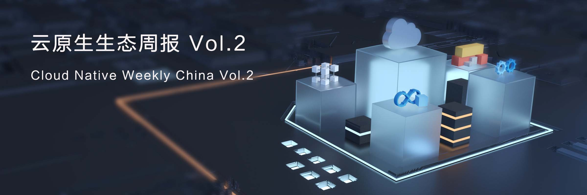

本周报由阿里巴巴容器平台联合蚂蚁金服共同发布

本周作者：傅伟，敖小剑，张磊，临石，南异，心贵，王夕宁，长虑

责任编辑：木环

## 业界要闻

1. [Kubernetes External Secrets](https://www.tuicool.com/articles/Jfaeqy2)  近日，世界上最大的域名托管公司 Godaddy公司，正式宣布并详细解读了其开源的K8s外部 Secrets 管理项目： [Kubernetes External Secrets](https://github.com/godaddy/kubernetes-external-secrets)，简称KES。这个项目定义了ExternalSecrets API，让开发者可以在K8s内部以和使用内部Secret相似的方式使用外部系统提供的Secrets，大大简化了开发者为了让应用获取外部Secrets所需要的工作量。从安全的角度，这个方案降低了使用外部Secret时候的攻击面（外部Secret是通过一个K8s API暴露的，而不是之前的每个应用自己实现），也降低了应用在适配外部Secret时候的难度。另外，[Kubernetes KMS plugin开源插件](https://github.com/AliyunContainerService/ack-kms-plugin) ，采用信封加密的方式与密钥管理能力结合，对进行K8s secret的存储加密。建议安全相关技术人员重点关注。  
2. [CNCF 官方宣布](https://mp.weixin.qq.com/s/y2V3PwOK5qbdmjFsuNTGkg)为中国开发者提供免费的云原生技术公开课。这些课程将专注于云原生技术堆栈，包括技术深度探索与动手实验课程，旨在帮助和指导中国开发人员在生产环境中使用云原生技术，并了解其用例和优势。此前，著名社区Stackoverflow发布了2019年开发者调研报告，报告有近九万人参与，Top 3 最受热爱开发平台是分别是Linux（83.1%）、Docker（77.8%）和Kubernetes（76.8%）。

## 上游重要进展

Kubernetes 项目

1. [重要性能优化] 2X performance improvement on both required and preferred PodAffinity. ([\#76243](https://github.com/kubernetes/kubernetes/pull/76243), [@Huang-Wei](https://github.com/Huang-Wei)) 这是一个重要的性能优化。这个提交将 PodAffinity 调度的效率实现了两倍的提高。**要知道，PodAffinity/Anti-affinity 调度规则是目前 K8s 默认调度器最大的性能瓶颈点，这次修复很值得关注。** 
2. [重要安全增强] [KEP: Node-Scoped DaemonSet](https://github.com/kubernetes/enhancements/pull/944): K8s 项目现在提供一种叫 Node-Scoped DaemonSet。这种 DaemonSet 的独特之处，在于它拥有、并且只能拥有自己所在的节点 kubelet 相同的权限，并且遵循同 kubelet 相同的鉴权流程。**这种设计，避免了以往 DaemonSet 权限泛滥的问题（比如：我们现在就可以让 DaemonSet 只能访问到属于该 Node 的 API 资源）。**这个特性发布后， DaemonSet 一直以来都 是K8s 集群里最优先被黑客们关照的尴尬局面有望从根本上得到缓解。
3. [重要功能补丁] [KEP: Add kubelet support lxcfs](https://github.com/kubernetes/enhancements/pull/953): 一直以来，容器里面通过 /proc 文件系统查看 CPU、内存等信息不准确都是一个让人头疼的问题，而挂载 lxcfs 则是这个问题的最常见解决办法。**现在， K8s 上游正在提议将 lxcfs 作为默认支持**，如果得以合并的话，那对于开发者和运维人员来说，都是个喜闻乐见的事情。**不过，lxcfs 本身是一个需要额外安装的软件，很可能会成为这个阻碍设计的 blocker。**

Knative 项目

1. [Serving v1beta1 API proposal(https://docs.google.com/presentation/d/10wuLMFXyol731WKuO5x7lalWrH0A6YVHa4exIERQaQ8/edit#slide=id.p)**Knative serving API准备升级到 v1beta1 版本**，其目标之一是使用标准的PodSpec，以便更方便的从 K8s Deployment 迁移过来。 这个版本和v1alpha1对比主要变更有：去掉了runLatest，缺省默认就是runLatest；Release模式可以通过配置traffic实现，可以指定各个版本的流量比例；取消Manual模式；提供revision生成名字的控制；停用Serving内置的Build。
2. [Triggers don't use Istio VirtualServices](https://github.com/knative/eventing/issues/918)：Knative Eventing 原有的实现，依赖于 Istio 的 VirtualService 来重写 Host Header，使得接下来 Broker 可以通过 Host  Header 来识别此 Event 是发给哪个Trigger 的。而最新的做法，则是通过  URL 来进行区分（比如： http://foo-broker-filter-1da3a.default.svc.cluster.local/my-trigger 代表此事件是发送给 my-trigger 的)，**从而解除了 Trigger 对Istio  VirtualService 的依赖**
3. [Remove Istio as a dependency](https://github.com/knative/eventing/issues/294)：除了上述解耦之外，Knative Eventing Channel 和 Bus 的绑定目前也是通过 istio 的 VirtualService 实现的。在这个新的实现方案中，Provisioners 直接把  Bus 的 主机名写到 channel 的状态当中，就不再需要 Istio VirtualService 来充当 Proxy 了。**这些提交，都在透出这样一个事实：Knative 正在逐步减少对 Istio 的各种依赖，这对于一个真正、适用于更广泛场景的 Serverless 基础设施来说，是非常重要的。**

Istio 项目

1. [重要安全增强]最近在Envoy代理中发现了两个安全漏洞（CVE 2019-9900和CVE 2019-9901）。这些漏洞现在已经在Envoy版本1.9.1中修补，并且相应地嵌入在Istio 1.1.2和Istio 1.0.7中的Envoy版本中。由于Envoy是Istio不可分割的一部分，因此建议用户立即更新Istio以降低这些漏洞带来的安全风险。 
2. [性能提升] Istio 1.1中的新增强功能可以提高应用程序性能和服务管理效率，从而实现扩展，Pilot CPU使用率降低了90％, 内存使用率降低50％。业界已有尝试在Kubernetes中使用Pilot实现服务的流量管理，对应用服务提供多版本管理、灵活的流量治理策略，以支持多种灰度发布场景。可以参考[通过Istio管理应用的灰度发布](https://yq.aliyun.com/articles/667297?source_type=cnvol_422_wenzhang)

containerd 项目

1. [runc v2 shim ](https://github.com/containerd/containerd/issues/3198)[支持](https://github.com/containerd/containerd/issues/3198)[ cgroup ](https://github.com/containerd/containerd/issues/3198)[设置](https://github.com/containerd/containerd/issues/3198)：containerd 目前支持多个容器使用[同一个](https://github.com/containerd/containerd/pull/3004)[ containerd-shim ](https://github.com/containerd/containerd/pull/3004)[来管理](https://github.com/containerd/containerd/pull/3004) - 一个 Pod 就可以使用一个 containerd-shim 来管理一组容器，减少 containerd-shim 对系统资源的开销。但是目前新的 shim v2 没有提供配置 Cgroup 接口，这个功能会在 1.3 Release 中解决。有了这个能力之后，上层应用就可以将 containerd-shim 资源控制也纳入 Pod 资源管理体系中，严格控制系统服务占用的资源大小。
2. [containerd 插件 ID 管理](https://github.com/containerd/containerd/issues/3210)：containerd 允许开发者将自定义的组件注册到服务里，提供了可插拔的能力。但是当前 containerd 插件的管理是假设 ID 是唯一，这会导致相同 ID 的插件加载结果不可预测。当前该问题还在讨论中，计划在 1.3 Release 中解决。

## 本周云原生最佳实践

传统富容器运维模式如何云原生化？

1. 在很多企业当中长期以来都在使用富容器模式，即：在业务容器里安装systemd、 sshd、监控进程等系统进程，模拟一个虚拟机的行为。这种运维方式固然方便业务迁入，但是也跟云原生理念中的“不可变基础设施”产生了本质冲突。比如：容器里的内容被操作人员频繁变化给升级、发布带来了众多运维隐患；富容器模式导致开发人员其实并不了解容器概念，在容器里随机位置写日志甚至用户数据等高风险的行为屡见不鲜。
2. **来自阿里巴巴“全站云化”的实践**：

- 将富容器容器运行时替换为支持 CRI 体系的标准容器运行时比如 containerd 等。目前阿里已经将 PouchContainer 全面升级为 containerd 发行版。
- 把富容器里面的耦合在一起进程、服务进行拆分，变成一个 Pod 里的多个容器，下面是“全站云化”采用的拆分方法：   (1)  业务容器：运行业务主进程，允许 exec 方式进入；(2)  运维 Sidecar 容器：日志收集、debugger、运维辅助进程等 ；(3)  业务辅助容器：Service Mesh 的 agent

## 开源项目推荐

1. 本周我们向您推荐[SPIFFE项目](https://spiffe.io/)。SPIFFE，从运维人员的第一感觉而言，是解决证书下发问题的。以往的安全体系更注重自然人的身份认证，而在SPIFFE里面所有的运行实体都有身份。一个案例就是K8s上的每个pod都配置相应的身份，对于多云和混合云的安全角度讲，SPIFFE的好处在于不被供应商的安全认证体系绑定，可以达到跨云/跨域的身份认证，从而确保安全。下面是我们搜集的一些关于SPIFFE的不错的公开资料，有兴趣可以去了解：
   - 项目的主要发起人Evan的[演讲](https://v.qq.com/x/page/t07113umnwq.html)
   - SPIRE是SPIFFE的实现，和Service Mesh结合详见[这篇文章](https://segmentfault.com/a/1190000018432444)
   - [SPIRE](https://www.aqniu.com/learn/39145.html)[的零信任安全机制](https://www.aqniu.com/learn/39145.html)

## 本周阅读推荐

1. [Knative：精简代码之道](http://www.servicemesher.com/blog/knative-whittling-down-the-code/)，作者 Brian McClain | 译者 孙海洲。这篇文章用循序渐进的例子对“什么是 Knative”做出了很好的回答。如果你现在对 Knative 的认识还停留在三张分别叫做Build， Serving 和 Eventing的插图的话，那可能阅读一下这篇文章会让你对它们的理解更加形象。
2. [Spark in action on Kubernetes - 存储篇](https://yq.aliyun.com/articles/695315?source_type=cnvol_422_wenzhang)，by Alibaba 莫源。存储永远是大数据计算的核心之一，随着新计算场景的不断涌现和硬件技术的飞速发展，存储的适配关系到大规模计算的成本、性能、稳定性等核心竞争要素。本文继上面分析K8s中的Spark Operator之后，从硬件限制、计算成本和存储成本几个角度，讨论了云原生时代来临后存储如何解决**成本低、存得多、读写快**这几个挑战，详细介绍了阿里云上相关产品在不同场景下的表现，并总结了不同场景下适用的存储解决方案以及选择的原因。如果你是K8s和大数据方面的开发者和使用者，这是一篇你不应该错过的博客，可以快速的帮你梳理当前技术下存储的场景和典型解决方案。

