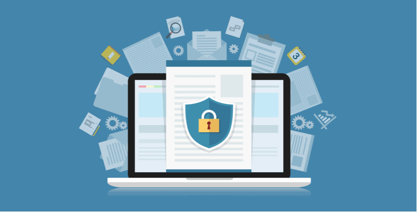
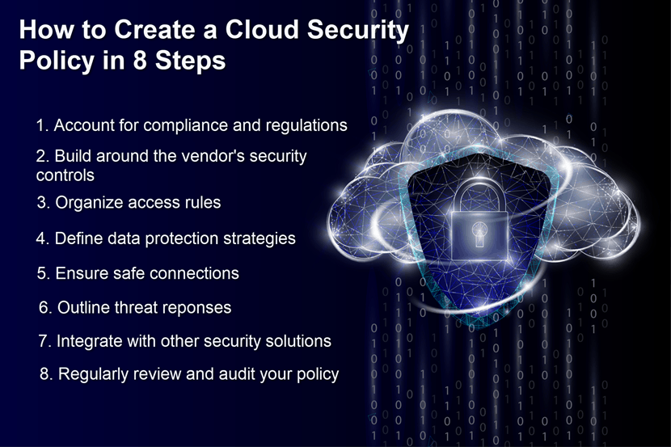

本文译自 [Creating a Cloud Security Policy](https://phoenixnap.com/blog/cloud-security-policy)

任何想要保护他们自己云资产的公司都需要云安全策略。安全策略有助于保持云数据的安全，且能赋予快速应对威胁和挑战的能力。

文章将解释云安全策略的价值。请继续阅读来了解这些策略都包含什么、它们能够带来什么收益以及如何为你的业务作出正确的选择。

## 什么是云安全策略？

云安全策略是公司在云运营过程中的一些正式准则。这些指导定义了安全策略，对于所有对云资产安全的决策进行指导。云安全策略指：

* 能够或不能够迁移至云上的数据类型
* 团队如何应对每种数据类型的风险
* 将负载迁移至云上的决定由谁来做
* 谁应该被授权来对数据进行访问或者迁移
* 法规条款和[当前合规状态](https://phoenixnap.com/blog/soc-2-audit-compliance)
* 正确应对威胁，黑客攻击和[数据泄漏](https://phoenixnap.com/blog/what-is-data-breach-how-to-prevent)
* 围绕风险优先级的规则

云安全策略是一个公司安全项目中的重要组成部分。安全策略能够保证信息的完整性和私密性，而且能够帮助团队快速作出正确的决定。

## 云安全策略的必要性

尽管云计算能够带来很多收益，但是云计算服务也具有一些安全隐患：

* 第三方设置中缺乏安全控制
* 多云环境中可见性差
* 有足够的空间来窃取和滥用数据
* 云是 [DDos 攻击](https://phoenixnap.com/blog/prevent-ddos-attacks) 的常见目标
* 攻击会从一个环境快速扩散至另一个环境

云计算的风险会波及着每个部门以及网络中的所有设备。因此，保护必须是强劲的、多样的以及大范围的。可靠的云安全策略能够提供上述所有的品质。如果一家公司依赖 [云服务](https://phoenixnap.com/security/data-security-cloud)。下述实践提供了需要保护云数据方面的一定层次的可见性和控制性。

### 云安全策略 vs 标准

云安全标准定义了支持云安全策略执行的一些流程。安全策略和标准协同工作，相辅相成。

标准涵盖了公司云计算的如下几个方面：

* 使用云平台来托管工作负载
* DevOps 模型以及在开发中包含云应用程序、API 和服务
* 分割策略
* 资产标记和分类
* 评估资产配置和安全等级的流程

通常，策略规则都是静态的。标准都是动态的，而你需要经常修改它们来确保能够跟上最新的技术和网络威胁。

请参考我们的文章 [《安全 vs 合规》](https://phoenixnap.com/blog/security-vs-compliance) 来查看关于这两个术语之间核心区别的深度分析。

## 如何创建云安全策略（8 步法）

在你开始创建策略以前，请确保你对你的云运维具有充足的认识。在撰写策略以前了解它们可以避免一些不必要的修改和返工。

### 第一步：相关法律的说明

如果你的公司必须要遵守一些隐私和规格规定，你就要考虑它们是如何影响安全策略的，所有基于云计算的活动都必须遵守法律法规。

### 第二步：评估云厂商的安全控制

不同的云厂商提供不同等级的安全控制。检查你合作伙伴的安全实践并形成与产品一致的解决方案。

### 第三步：分配角色和访问权限

为你的员工制定明确的角色，设置他们对于应用和数据的访问权限。只允许员工访问他们需要执行任务时所需的资产。此外，需要定义你的公司如何记录和检查访问权限。

### 第四步：保护你的数据

确定如何保护公司数据。大多数业务选择对迁移至云和互联网的所有数据进行加密。你还应该记录内部和外部数据存储的安全规则。

通常，厂商提供应用程序接口 (API) 来作为他们服务的一部分。可以考虑使用 API 来增强加密和 [防止数据丢失 (DLP) ](https://phoenixnap.com/blog/data-loss-prevention-best-practices)策略。

### 第五步：保护端点

被感染的单个端点会造成数据在多云中的泄漏。因此，你必须围绕云计算连接来设置明确的规则以避免此事的发生。这些步骤包括安全套接字层（[SSLs](https://phoenixnap.com/kb/types-of-ssl-certificates)）网络流量扫描和监控规则。

### 第六步：定义响应

策略不应仅仅包含预防。应该考虑一些团队能够处理数据泄漏、异常报告流程及制定取证功能的实际方法。这也能帮助你针对 [灾难恢复](https://phoenixnap.com/disaster-recovery-as-a-service-draas) 建立一些规则。

### 第七步：确保良好的集成

如果你有多种安全策略，确保团队正确的对它们进行了集成。差劲的结合方案反而会制造出漏洞，因此应找到一条合适的路来集成和利用公司的安全设备。

### 第八步：执行安全审计

定期检查和升级组件，以确保走在最新威胁之前。因此，对厂商的 [SLA](https://phoenixnap.com/blog/service-level-agreement-best-practices) 做例行检查就不会使你因为一个有问题的更新而被蒙蔽了双眼。

## 云安全策略应遵守的原则

### 保持简单

所有雇员都应该能够理解安全策略。避免过度复杂，应使指南清晰简单。保持简单能够让所有工作人员都遵循规则，也会使你的安全培训费用下降。

每项策略都要有明确的意图。意图应清楚地概述该规则的要点，以帮助工作人员理解和掌握法规

### 让规则透明

对执行和遵守策略负责的所有团队都应该有安全指南的所有访问权限。建立相关人员已阅读、理解并同意遵守规则的记录。

### 策略性的限制访问

内部控制规定能够组织对云资产的非授权访问。遵从零信任模型，仅允许那些对资源具有真实访问需求的个体来访问。一些工作人员仅需只读权限，像那些为运行报告负责的人。其他人可能必须能够做一些运维的工作，比如重启 VM，但是没有理由给他们赋予修改 VM 或 VM 资源的权限。

### 每月数据加密更新

安排每月数据加密更新。常规更新确保云资源的安全性，这样你就可以安心的知道一切都是最新的。

### 监控云环境

监控应该是你策略里面重要的一方面。[云监控工具](https://phoenixnap.com/blog/cloud-monitoring-tools) 提供一种简单的方法来发现活动模式和潜在的漏洞。

### 让策略做到雇员友好

不要因为云安全策略扰乱公司的工作流。尝试创建与公司文化相契合的规则，来帮助雇员更顺利的工作。如果你的策略对日常工作的影响很大，就可以能导致有人走捷径。

### 收集整个公司的意见

策略不应该仅仅由某个团队负责。最佳实践来自于多个部门的通力协作。

收集跨业务单元的利益干系人的意见。这种方式能够对现有安全层级提供一个清晰的视图，以此来找到正确的方法进行改进。

### 不要外包你的策略

将策略构建流程授权给第三方是一个错误。尽管你的云服务提供者能够处理这些任务，但是最安全的云安全策略来自于自身努力。

### 使用组访问而非个人访问

创建管理组然后给组而不是个人分配争取的权限。组访问在不影响安全性的情况下能使日常任务更轻松。

### 考虑 Two-Factor 认证

大多数云厂商允许使用 Two-Factor 认证 (2FA)。使用 2FA 来保护新部署和功能免受恶意登陆尝试的攻击。

### 严格限制

有些工作负载仅为单个地理区域中的客户或客户机提供服务。考虑在这些场景中添加访问限制。针对特定区域、特定 IP 的访问限制能够限制对黑客、蠕虫和其他威胁的暴漏。

### 使用密钥而非密码

考虑让公共密钥基础设施 (PKI) 成为你云安全策略的一部分。PKI 协议使用一对公钥和私钥来在数据交换钱对用户身份进行验证。切换至 PKI 消除了密码被偷的危险，[防止了暴力攻击](https://phoenixnap.com/kb/prevent-brute-force-attacks)。

## 云安全策略对任何谨慎的公司都是必须的

[修复数据泄漏的成本](https://phoenixnap.com/blog/data-breach-statistics) 远远超过适当预防措施的代价。云安全策略提供了当操作云环境时候的适当告诫步骤。此策略允许你利用 [云的优势](https://phoenixnap.com/blog/benefits-of-cloud-computing) 而无须承担非必要的风险。
